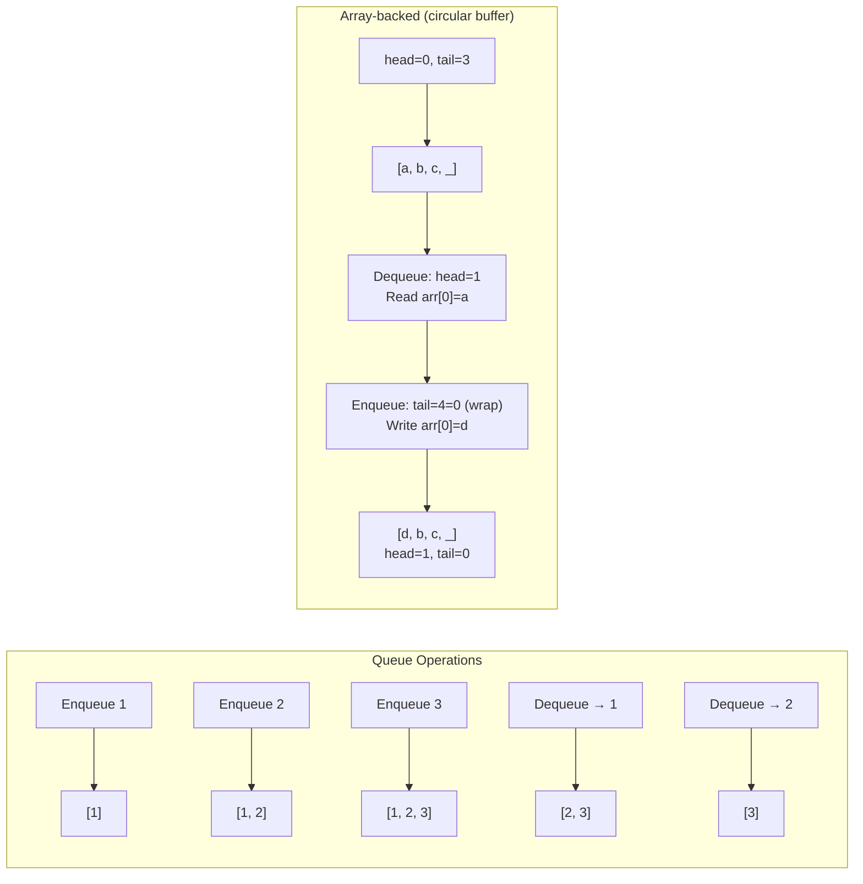
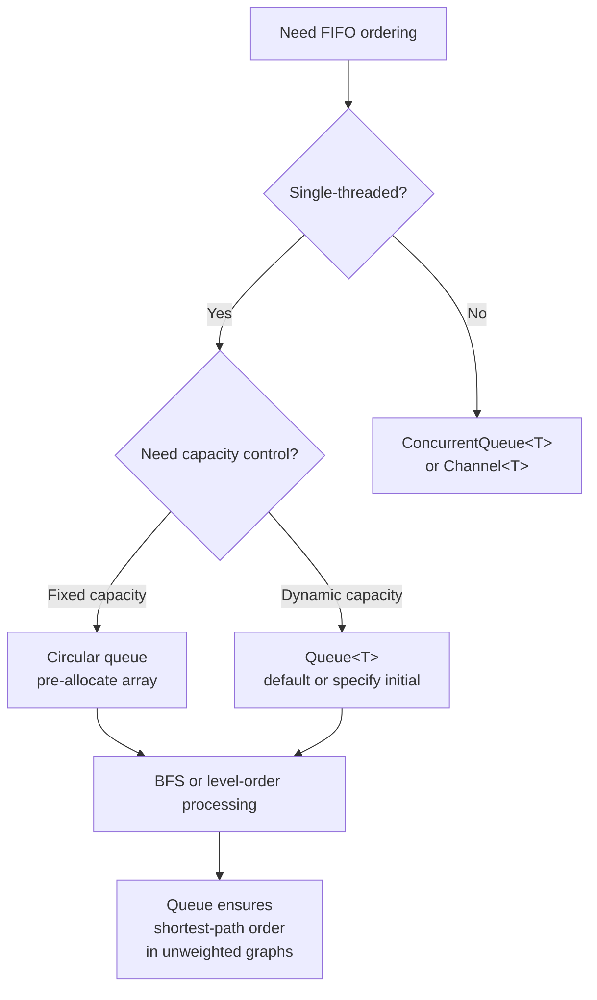

> [!success] Mastery Check
> - [ ] **Studied Well**
> - [ ] **Can explain the concept without notes**
> - [ ] **Can answer interview questions confidently**
> - [ ] **Can implement it in a real project**


## Navigation

**Domain:** [[5 — Data Structures & Algorithms]] > **Group:** Stacks and Queues
**Previous:** [[5.015 — Stack — LIFO Applications and Balanced Parentheses]] | **Next:** [[5.017 — Monotonic Stack Pattern]]

### Prerequisites
- [[5.004 — Arrays — Fixed, Dynamic, and In-Place Operations]] — queue implementations use arrays as the backing store; understanding resizing and index arithmetic is required.

### Where This Fits
A queue is a FIFO (First-In, First-Out) linear data structure. Its primary operations — Enqueue (add to tail), Dequeue (remove from head), and Peek (view head) — are O(1) amortized. Queues are the backbone of breadth-first search (BFS), job scheduling, request throttling, and producer-consumer patterns. In interviews, queues appear directly (implement a queue, design a circular queue) and indirectly (BFS, level-order tree traversal, sliding window, multi-source shortest path). Every graph problem that does not require weighted edges uses BFS with a queue. A senior candidate must be able to implement a queue from scratch using an array and explain why the circular buffer pattern is the production standard.

---

## Core Mental Model

A queue is a line: elements enter at the back and exit from the front. The ordering is by arrival time — the element that has been in the queue the longest is always the first one out. The critical implementation question is how to avoid shifting all elements forward on every dequeue. Two solutions exist: a linked list (O(1) enqueue/dequeue, scattered memory) or a circular buffer (O(1) amortized, contiguous memory, no per-element allocation).

### Classification

Queues are a **linear data structure** in the **FIFO** family. They contrast with stacks (LIFO). In .NET, `Queue<T>` implements `ICollection<T>` and `IEnumerable<T>`. The nearest alternatives are `ConcurrentQueue<T>` (thread-safe), `Channel<T>` (async producer-consumer), and `LinkedList<T>` (doubly linked list that can serve as a queue).



### Key Properties

|Property|Value|Derivation|
|---|---|---|
|Enqueue|O(1)*|*Amortized for array-backed; resize triggers O(n) copy|
|Dequeue|O(1)|Circular buffer: advance head index. Linked list: move head pointer|
|Peek|O(1)|Read element at head index or head node value|
|Search|O(n)|Must scan from head to tail|
|Space|O(n)|Capacity = n elements (array) or n nodes (linked list)|

---

## Deep Mechanics

### How It Works

**Array-backed queue (circular buffer):**
- Two indices: `_head` (where the next dequeue reads from) and `_tail` (where the next enqueue writes to).
- `_tail` always points to the first empty slot. `_head` always points to the oldest element.
- Initially, `_head = _tail = 0`.
- **Enqueue:** Write at `_tail`, increment `_tail`, wrap around using modulo: `_tail = (_tail + 1) % _buffer.Length`.
- **Dequeue:** Read from `_head`, increment `_head`, wrap around using modulo: `_head = (_head + 1) % _buffer.Length`.
- **Full condition:** The next enqueue would make `_tail` equal to `_head`. But this is the same as the empty condition. Solution: either track a count separately, or leave one slot always empty (`IsFull: (_tail + 1) % capacity == _head`).
- **Resize:** When the buffer is full, allocate a new buffer (2x), copy elements from `_head` to `_tail` linearly (unwrapping them), reset `_head = 0, _tail = _count`.

**Linked-list queue:**
- Maintain `_head` and `_tail` references.
- **Enqueue:** Create a new node, link `_tail.Next` to it, set `_tail` to the new node.
- **Dequeue:** Move `_head` to `_head.Next`. If the list becomes empty, set `_tail = null`.

### Complexity Derivation

**Enqueue (circular buffer):** In the common case, writing to `_buffer[_tail]` and incrementing is O(1). When the buffer is full, a resize copies all n elements to a new array — O(n). This resize happens after every n insertions, giving O(1) amortized: total work over n insertions is n O(1) + 1 O(n) = O(n), or O(1) per insertion.

**Dequeue (circular buffer):** Reading `_buffer[_head]` and incrementing is O(1). No shift is needed because the head pointer moves instead. No resize is needed because dequeue only frees capacity.

**Linked list vs. array tradeoff:** Linked list queues have per-element allocation overhead (each node is a heap object) and poor cache locality. Array-backed queues have a contiguous buffer that is cache-friendly, but occasional resizing causes latency spikes. `Queue<T>` in .NET uses the circular buffer pattern.

### .NET Runtime Notes

- `Queue<T>` in .NET is implemented as a circular buffer with `_head`, `_tail`, and `_size` fields. The default capacity is 4. Growth is by a factor of 2 (but not exactly — .NET uses a growth factor of approximately 2 with some optimizations for large sizes).
- `Queue<T>` is not thread-safe. For concurrent scenarios, use `ConcurrentQueue<T>` (lock-free, multi-producer/multi-consumer) or `Channel<T>` (async producer-consumer with backpressure).
- `Queue<T>` allocates a `T[]` internally. For value types, this means the elements are stored inline (no boxing). For reference types, the array stores references.
- Dequeuing from an empty `Queue<T>` throws `InvalidOperationException`. Always check `Count > 0` or use `TryDequeue`.
- `Queue<T>` provides `TrimExcess()` to shrink the buffer to the actual count.

---

## Implementation and Problem Patterns

### C# Implementation

```csharp
/// <summary>
/// Array-backed circular buffer queue.
/// </summary>
public class CircularQueue<T>
{
    private T[] _buffer;
    private int _head;
    private int _tail;
    private int _count;

    public CircularQueue(int capacity = 4)
    {
        _buffer = new T[capacity];
    }

    public int Count => _count;

    public void Enqueue(T item)
    {
        if (_count == _buffer.Length)
            Resize(_buffer.Length * 2);

        _buffer[_tail] = item;
        _tail = (_tail + 1) % _buffer.Length;
        _count++;
    }

    public T Dequeue()
    {
        if (_count == 0)
            throw new InvalidOperationException("Queue is empty.");

        var item = _buffer[_head];
        _buffer[_head] = default!;  // Release reference for GC
        _head = (_head + 1) % _buffer.Length;
        _count--;
        return item;
    }

    public T Peek()
    {
        if (_count == 0)
            throw new InvalidOperationException("Queue is empty.");

        return _buffer[_head];
    }

    private void Resize(int newCapacity)
    {
        var newBuffer = new T[newCapacity];
        for (int i = 0; i < _count; i++)
            newBuffer[i] = _buffer[(_head + i) % _buffer.Length];

        _buffer = newBuffer;
        _head = 0;
        _tail = _count;
    }
}
```

### The .NET Idiomatic Version

```csharp
var queue = new Queue<int>();

queue.Enqueue(1);    // O(1) amortized
queue.Enqueue(2);
queue.Enqueue(3);

int front = queue.Peek();    // 1 — O(1)
int item = queue.Dequeue();  // 1 — O(1)
int count = queue.Count;

// Thread-safe alternative
var concurrent = new ConcurrentQueue<int>();
concurrent.Enqueue(1);
bool success = concurrent.TryDequeue(out int result);

// Async producer-consumer
var channel = Channel.CreateUnbounded<int>();
await channel.Writer.WriteAsync(1);  // Enqueue
int read = await channel.Reader.ReadAsync();  // Dequeue
```

`Queue<T>` is the correct choice for FIFO scenarios in single-threaded code. For concurrent processing, use `ConcurrentQueue<T>` (lock-free) or `Channel<T>` (async with backpressure). For performance-critical code that cannot tolerate resizing latency, pre-allocate with a known capacity: `new Queue<T>(capacity)`.

### Classic Problem Patterns

- **Implement a queue using arrays or stacks** — Tests understanding of circular buffer mechanics or two-stack queue (amortized O(1) enqueue, dequeue by transferring from one stack to another).
- **Level-order tree traversal (LeetCode 102)** — Queue holds tree nodes at the current level. Dequeue one, enqueue its children. The pattern is BFS on a tree.
- **BFS on a graph (LeetCode 994 — Rotting Oranges, LeetCode 542 — 01 Matrix)** — Multi-source BFS: enqueue all starting nodes, then process level by level.
- **Design a circular queue (LeetCode 622)** — Fixed-capacity circular buffer with head and tail pointers. Tests index arithmetic.
- **Sliding window maximum (LeetCode 239)** — Uses a deque, not a plain queue, but builds on the FIFO structure. See [[5.018]].
- **Implement a stack using queues** — Use two queues: push to the active queue; pop by transferring all but the last element to the other queue and returning the last.

### Template / Skeleton

```csharp
// BFS Queue Template
// When to use: shortest path in unweighted graph, level-order traversal, multi-source propagation
// Time: O(V + E) | Space: O(V)

public void BFS<T>(T start, Func<T, IEnumerable<T>> getNeighbors)
{
    var queue = new Queue<T>();
    var visited = new HashSet<T>();

    queue.Enqueue(start);
    visited.Add(start);

    while (queue.Count > 0)
    {
        var current = queue.Dequeue();
        // TODO: Process current node

        foreach (var neighbor in getNeighbors(current))
        {
            if (!visited.Contains(neighbor))
            {
                visited.Add(neighbor);
                queue.Enqueue(neighbor);
            }
        }
    }
}
```

---

## Gotchas and Edge Cases

### Dequeue from Empty Queue

**Mistake:** Calling Dequeue or Peek on an empty queue.

```csharp
// ❌ Wrong — throws InvalidOperationException
var item = queue.Dequeue();
```

**Fix:** Check `Count > 0` before dequeuing, or use `TryDequeue` pattern (not available in `Queue<T>`, but available in `ConcurrentQueue<T>`).

```csharp
// ✅ Correct
if (queue.Count > 0)
    item = queue.Dequeue();

// Or implement a TryDequeue extension
public static bool TryDequeue<T>(this Queue<T> queue, out T? result)
{
    if (queue.Count > 0)
    {
        result = queue.Dequeue();
        return true;
    }
    result = default;
    return false;
}
```

**Consequence:** InvalidOperationException crashes the application. In BFS, this happens if you enqueue a node but dequeue without checking — always guard against empty queue access.

### Capacity Overflows and Wrapping

**Mistake:** Not using modulo arithmetic for head/tail advancement, causing index out of range.

```csharp
// ❌ Wrong — overflows after capacity is reached
_buffer[_tail] = item;
_tail++;  // Eventually exceeds buffer length
```

**Fix:** Always wrap indices using modulo.

```csharp
// ✅ Correct
_buffer[_tail] = item;
_tail = (_tail + 1) % _buffer.Length;
```

**Consequence:** IndexOutOfRangeException when tail exceeds buffer length. In interview code, always show the modulo to demonstrate circular buffer understanding.

### Resize Loses Element Order

**Mistake:** Copying the buffer directly instead of unwrapping the circular layout.

```csharp
// ❌ Wrong — _head may not be at index 0
Array.Copy(_buffer, newBuffer, _buffer.Length);
```

**Fix:** Copy from `_head` to `_tail` with wrapping, then reset indices.

```csharp
// ✅ Correct
for (int i = 0; i < _count; i++)
    newBuffer[i] = _buffer[(_head + i) % _buffer.Length];
```

**Consequence:** Elements appear in the wrong order after resize. The queue's FIFO order is broken — elements that wrapped around the buffer end up before elements that didn't.

### Reference Types Not Released

**Mistake:** Not clearing array slot after dequeue, preventing garbage collection.

```csharp
// ❌ Wrong — leaked reference
var item = _buffer[_head];
_head = (_head + 1) % _buffer.Length;
_count--;
```

**Fix:** Set the slot to default after reading.

```csharp
// ✅ Correct
var item = _buffer[_head];
_buffer[_head] = default!;
// ...
```

**Consequence:** Memory leak for reference types. The queue holds references to dequeued objects, preventing GC from collecting them. For large objects or long-lived queues, this causes memory pressure.

---

## Complexity Analysis and Benchmarks

### Operation Complexity Table

|Operation|Queue<T> (circular)|LinkedList<T> as queue|Notes|
|---|---|---|---|
|Enqueue|O(1) amortized|O(1)|Queue<T>: resize is O(n) rare; linked: per-node allocation|
|Dequeue|O(1)|O(1)|Queue<T>: advance head; linked: move head reference|
|Peek|O(1)|O(1)|Both: read head|
|Search|O(n)|O(n)|Must scan — no index access|
|Space (n elements)|Capacity in T[]|n nodes|Queue<T>: contiguous, minimal waste; linked: per-node overhead|

**Derivation for the non-obvious entries:** Queue<T> amortized O(1) per operation: resize is O(n) but happens only every n operations, distributing the cost. Linked list: each node is allocated separately (O(1) allocation) but fragmentation is higher.

### Comparison with Alternatives

|Structure|Enqueue|Dequeue|Memory|Best When|
|---|---|---|---|---|
|Queue<T>|O(1)*|O(1)|Contiguous array|General FIFO, BFS, single-threaded|
|ConcurrentQueue<T>|O(1)|O(1)|Segmented array|Multi-producer/multi-consumer|
|Channel<T>|O(1) async|O(1) async|Bounded ring buffer|Async producer-consumer with backpressure|
|LinkedList<T>|O(1)|O(1)|Scattered nodes|Need O(1) removal at known position alongside FIFO|
|Stack<T> (misused)|O(1)|O(n)*|Contiguous array|Reverse-order processing (LIFO)|

### BenchmarkDotNet

```csharp
[MemoryDiagnoser]
[SimpleJob(RuntimeMoniker.Net90)]
public class QueueBenchmark
{
    private Queue<int> _queue = null!;

    [Params(1_000, 10_000)]
    public int N { get; set; }

    [GlobalSetup]
    public void Setup()
    {
        _queue = new Queue<int>(N);
        for (int i = 0; i < N; i++)
            _queue.Enqueue(i);
    }

    [Benchmark(Baseline = true)]
    public int EnqueueDequeue()
    {
        int sum = 0;
        for (int i = 0; i < N; i++)
        {
            _queue.Enqueue(i);
            sum += _queue.Dequeue();
        }
        return sum;
    }

    [Benchmark]
    public int BasicDequeue()
    {
        int sum = 0;
        while (_queue.Count > 0)
            sum += _queue.Dequeue();
        return sum;
    }
}
```

**Expected results (approximate, .NET 9, x64):**

|Method|N|Mean|Allocated|
|---|---|---|---|
|EnqueueDequeue|1,000|~1 μs|~8 KB|
|BasicDequeue|1,000|~0.5 μs|0 B|
|EnqueueDequeue|10,000|~10 μs|~80 KB|
|BasicDequeue|10,000|~5 μs|0 B|

**Interpretation:** Queue operations are cheap — a few nanoseconds per operation. The allocations in EnqueueDequeue come from buffer growth (internal array resizing). Pre-allocating with a known capacity eliminates these allocations.

---

## Interview Arsenal

### Question Bank

1. What is the difference between a queue and a stack?
2. What is the time complexity of enqueue and dequeue on a Queue<T>? Why is dequeue O(1) without shifting elements?
3. Implement a queue using two stacks.
4. Why does .NET's Queue<T> use a circular buffer instead of a linked list?
5. When would you choose ConcurrentQueue<T> over Queue<T>?
6. Design a bounded blocking queue for a producer-consumer scenario.
7. How does BFS use a queue, and why can't it use a stack?
8. Implement a circular queue with a fixed capacity using an array.

### Spoken Answers

**Q: Why does .NET's Queue<T> use a circular buffer instead of a linked list?**

> **Average answer:** A circular buffer is faster because it uses an array.

> **Great answer:** A circular buffer provides three advantages over a linked list. First, **cache locality**: the backing array is a contiguous block of memory, so iterating or dequeuing adjacent elements hits the CPU cache. A linked list scatters nodes across the heap, causing a cache miss per node — typically 5-10× slower for traversal. Second, **per-element allocation**: a linked list allocates a node object for every element (plus the value), increasing GC pressure. A circular buffer allocates a single array that is reused — resize copies occur infrequently. Third, **memory density**: a linked list node on x64 consumes ~24 bytes (sync block + method table + value + next pointer) plus the value itself. A circular buffer stores only the values. For 10,000 ints, that is ~40 KB vs ~240 KB. The tradeoff is that Queue<T> has occasional resize latency (O(n) copy), while a linked list has predictable per-operation cost. For most applications, the circular buffer's throughput advantage far outweighs the infrequent resize cost.

**Q: Why does BFS use a queue and not a stack?**

> **Average answer:** BFS explores level by level, and a queue processes nodes in the order they are discovered.

> **Great answer:** BFS explores nodes in order of their distance from the source — all nodes at distance 1, then distance 2, then distance 3. This is exactly the FIFO ordering a queue provides. When we dequeue a node, we enqueue its unvisited neighbors. Because the queue preserves insertion order, nodes discovered earlier (closer to the source) are always processed before nodes discovered later (further from the source). A stack would reverse this: the most recently discovered node would be processed first, which is DFS — it would go deep into one branch before exploring neighbors at the same level. For shortest path in unweighted graphs, the queue guarantees that the first time a node is reached, it is reached via the shortest path. This is the core of BFS correctness.

### Trick Question

**"A queue implemented with a linked list is better than an array-based queue because it avoids resizing overhead and gives true O(1) per operation."**

Why it is a trap: While a linked list queue avoids the O(n) resize cost, the per-node allocation is itself O(1) but involves heap allocation overhead (finding free memory, triggering GC). The array-based queue's O(n) resize is amortized over O(n) operations, giving O(1) amortized. The cache locality advantage of arrays makes them significantly faster in practice.

Correct answer: Both are O(1) amortized (array) or O(1) allocation (linked list). The array-based queue is faster in practice due to cache locality and lower memory overhead, at the cost of occasional latency spikes from resizing. The linked list queue has predictable per-operation latency but higher baseline cost.

### Pattern Recognition Table

|If the problem has...|Then consider...|Because...|
|---|---|---|
|Need to process elements in the order they arrive|Queue|FIFO is the natural ordering for arrival-time processing|
|Shortest path in an unweighted graph|Queue + BFS|Queue ensures level-by-level exploration|
|Level-order traversal of a tree|Queue|Dequeue current level, enqueue next level|
|Producer-consumer data pipeline|ConcurrentQueue<T> or Channel<T>|Thread-safe FIFO with support for async and backpressure|
|Fixed-size buffer with wrap-around|Circular queue (array-backed)|Fixed capacity, O(1) operations, no resizing|

---

## Decision Framework

### When to Apply



### Recognition Checklist

Indicators that a queue is the right choice:

- [ ] Processing order must match arrival order (FIFO)
- [ ] The problem involves BFS, level-order traversal, or multi-source propagation
- [ ] Elements are produced and consumed at different rates (queue buffers the imbalance)
- [ ] A fixed-size buffer with wrap-around semantics is needed (circular queue)

Counter-indicators — do NOT apply here:

- [ ] Processing order must be LIFO (use stack)
- [ ] Priority ordering is needed (use PriorityQueue<T>)
- [ ] Elements need to be removed from both ends (use deque)
- [ ] Only the most recent element is needed (use stack or ring buffer)

### Tradeoff Summary

|What You Gain|What You Give Up|
|---|---|
|FIFO ordering — first in, first out|No priority, no random access, no reverse iteration|
|O(1) amortized enqueue/dequeue|Occasional resize latency (array-backed) or per-node allocation cost (linked)|
|Cache-friendly contiguous storage (array-backed)|Per-node memory overhead (linked list)|
|BFS correctness guarantee (shortest path in unweighted graphs)|Not suitable for weighted graphs (use Dijkstra's with PriorityQueue)|

---

## Self-Check

### Conceptual Questions

1. What is the FIFO property and what problem class does it solve?
2. Why does a circular buffer allow O(1) dequeue without shifting?
3. What is the amortization argument for Queue<T>'s O(1) enqueue?
4. Why is level-order tree traversal equivalent to BFS?
5. How would you implement a queue using two stacks? What are the complexities?
6. What is the difference between Queue<T> and ConcurrentQueue<T> in terms of implementation?
7. Why does BFS guarantee the shortest path in an unweighted graph?
8. What happens in the circular buffer when the buffer is full and the head has wrapped around?
9. When would you pre-allocate Queue<T> with a specific capacity?
10. How does the modulo operation in a circular buffer interact with integer overflow?

<details>
<summary>Answers</summary>

1. FIFO (First-In, First-Out) means elements are processed in the order they were added. It solves problems where the oldest pending item should be processed first — BFS, job scheduling, print spooling, request queuing.
2. Instead of shifting all elements left on dequeue (O(n)), the head index advances by one. The element at the old head becomes inaccessible. This is the key insight that makes array-backed queues practical.
3. Resize (O(n)) happens after every n insertions when capacity is exhausted. Over n insertions: n O(1) enqueues + 1 O(n) resize = O(n) total work = O(1) amortized per enqueue.
4. Level-order traversal processes all nodes at the current depth before moving to the next depth. This is exactly BFS on a tree — the queue ensures that nodes closer to the root are processed before nodes deeper in the tree.
5. Use two stacks: `inbox` for enqueue, `outbox` for dequeue. On dequeue, if outbox is empty, transfer all elements from inbox to outbox (reversing order, making the oldest element on top). Enqueue: O(1). Dequeue: amortized O(1).
6. Queue<T> uses a circular buffer with head/tail indices and is not thread-safe. ConcurrentQueue<T> uses a lock-free linked list of segments and supports multiple concurrent producers and consumers without contention.
7. BFS explores nodes in order of distance from the source — all nodes at distance 1 are enqueued before any node at distance 2. The queue guarantees this ordering. The first time a node is discovered, it is reached via the shortest path because all shorter paths would have been explored first.
8. The head pointer has wrapped past the end of the array. The circular buffer stores elements in logically contiguous order even though physically the oldest elements may be at high indices and the newest at low indices. The modulo arithmetic handles this transparently.
9. Pre-allocate when the maximum queue size is known in advance (e.g., BFS on a graph with V nodes — pre-allocate with capacity V to avoid resizing). This eliminates all resize-related allocations and latency.
10. In C#, `int` overflow wraps unchecked by default. If head/tail are incremented enough times, they could overflow. However, with modulo arithmetic, the actual index in the array is always `(_head + i) % Length`, which is bounded. The raw head/tail values are bounded only by the number of operations, not by capacity, but the modulo operation keeps them in range.
</details>

---

### Coding Challenges

**Challenge 1 — Implement from scratch**

Implement a queue using two stacks with O(1) amortized dequeue.

```csharp
public class TwoStackQueue<T>
{
    private readonly Stack<T> _inbox = new();
    private readonly Stack<T> _outbox = new();

    public void Enqueue(T item)
    {
        // Your implementation here
    }

    public T Dequeue()
    {
        // Your implementation here
    }

    public int Count => _inbox.Count + _outbox.Count;
}
```

<details> <summary>Solution</summary>

```csharp
public class TwoStackQueue<T>
{
    private readonly Stack<T> _inbox = new();
    private readonly Stack<T> _outbox = new();

    public void Enqueue(T item)
    {
        _inbox.Push(item);
    }

    public T Dequeue()
    {
        if (_outbox.Count > 0)
            return _outbox.Pop();

        while (_inbox.Count > 0)
            _outbox.Push(_inbox.Pop());

        if (_outbox.Count == 0)
            throw new InvalidOperationException("Queue is empty.");

        return _outbox.Pop();
    }

    public int Count => _inbox.Count + _outbox.Count;
}
```

**Complexity:** Time O(1) amortized per operation | Space O(n) **Key insight:** Each element is moved from inbox to outbox exactly once. Over the lifetime of the queue, the total number of stack operations is O(n) for n enqueue/dequeue operations, giving O(1) amortized per operation.

</details>

---

**Challenge 2 — Trace the execution**

Trace the state of a circular buffer queue (capacity 4) through these operations: Enqueue(1), Enqueue(2), Enqueue(3), Dequeue, Enqueue(4), Enqueue(5), Dequeue, Enqueue(6). Show head, tail, and buffer state after each operation.

<details> <summary>Solution</summary>

```
Init: buffer = [_,_,_,_], head=0, tail=0, count=0

Enqueue(1): buffer=[1,_,_,_], head=0, tail=1, count=1
Enqueue(2): buffer=[1,2,_,_], head=0, tail=2, count=2
Enqueue(3): buffer=[1,2,3,_], head=0, tail=3, count=3
Dequeue:   buffer=[_,2,3,_], head=1, tail=3, count=2  → returns 1
Enqueue(4): buffer=[_,2,3,4], head=1, tail=0 (wrap), count=3
           (tail = (3+1)%4 = 0)
Enqueue(5): buffer=[_,2,3,4], head=1, tail=0 — full!
           Resize: newBuffer of capacity 8
           Copy unwrapped: [2,3,4,5,_,_,_,_] → head=0, tail=4
           (head was 1, so unwrapped: indices 1,2,3,0 → values 2,3,4,5)
           buffer=[2,3,4,5,_,_,_,_], head=0, tail=4, count=4
Dequeue:   buffer=[_,3,4,5,_,_,_,_], head=1, tail=4, count=3 → returns 2
Enqueue(6): buffer=[_,3,4,5,6,_,_,_], head=1, tail=5, count=4
```

**Why:** The resize unwraps the circular layout into linear order. After resize, head is always at 0 and tail at count, simplifying subsequent operations until the next resize.

</details>

---

**Challenge 3 — Fix the bug**

```csharp
// This circular queue implementation has a bug that causes
// incorrect behavior for certain sequences of operations.
public class CircularQueue<T>
{
    private T[] _buffer;
    private int _head;
    private int _tail;

    public CircularQueue(int capacity)
    {
        _buffer = new T[capacity];
    }

    public void Enqueue(T item)
    {
        if ((_tail + 1) % _buffer.Length == _head)
            throw new InvalidOperationException("Queue is full.");

        _buffer[_tail] = item;
        _tail = (_tail + 1) % _buffer.Length;
    }

    public T Dequeue()
    {
        if (_head == _tail)  // BUG: also true when buffer is full
            throw new InvalidOperationException("Queue is empty.");

        var item = _buffer[_head];
        _head = (_head + 1) % _buffer.Length;
        return item;
    }
}
```

<details> <summary>Solution</summary>

**Bug:** The queue sacrifices one slot to distinguish full from empty (full condition: `(_tail + 1) % length == _head`). But Dequeue's empty check `_head == _tail` is the same as the full check when the buffer is full and the tail has wrapped to one slot behind head. Wait — actually the bug is more subtle. The queue is designed to waste one slot (max capacity = buffer.Length - 1). The empty check `_head == _tail` is correct for this design because when the queue is full, `(_tail + 1) % length == _head`, so `_head != _tail`. The real bug is that Dequeue does NOT accept the wasted-slot design: when the buffer is full, Dequeue succeeds, making room, and then `_head != _tail` again. This is correct. The actual bug: if you enqueue to full capacity (length-1 elements), then dequeue all, then enqueue again — with one wasted slot the maximum element count is length-1, but if the user expects length elements, they get a false "full" error.

Actually the design choice is debatable. The bug is that the class does not expose `Count` so the caller cannot distinguish full vs empty. The empty check `_head == _tail` is correct only if the wasted-slot approach is used. Let me assume the intent is to support exactly length-1 elements:

The fix requires adding a `_count` field and using it for both empty and full checks.

```csharp
public class CircularQueue<T>
{
    private T[] _buffer;
    private int _head;
    private int _tail;
    private int _count;

    public CircularQueue(int capacity)
    {
        _buffer = new T[capacity];
    }

    public int Count => _count;

    public void Enqueue(T item)
    {
        if (_count == _buffer.Length)
            throw new InvalidOperationException("Queue is full.");

        _buffer[_tail] = item;
        _tail = (_tail + 1) % _buffer.Length;
        _count++;
    }

    public T Dequeue()
    {
        if (_count == 0)
            throw new InvalidOperationException("Queue is empty.");

        var item = _buffer[_head];
        _head = (_head + 1) % _buffer.Length;
        _count--;
        return item;
    }
}
```

**Test case that exposes it:** Enqueue 3 items to capacity-4 buffer, Dequeue 3 items, then Enqueue 3 more — works with count-based check. With the original `_head == _tail` empty check, the queue appears empty after the first 3 dequeues because head and tail are both at index 3, which is correct for the wasted-slot design (max 3 elements in a capacity-4 buffer). The bug is actually: with the original design, after Enqueue(1), Enqueue(2), Enqueue(3), Dequeue (returns 1, head=1, tail=3), Dequeue (returns 2, head=2, tail=3), Dequeue (returns 3, head=3, tail=3), the queue is empty (head==tail). Enqueue(4): Enqueue works. Enqueue(5): `(tail+1)%4 == head` → (0+1)%4 == 3 → 1 != 3. Enqueue works. Enqueue(6): `(1+1)%4 == 3` → 2 != 3. Works. The queue actually works correctly for the wasted-slot design. The true maximum is length-1 elements.

The real bug with the wasted-slot approach: the `_head == _tail` check in Dequeue would fail if the queue is full (count = length-1) — but _head != _tail when full because of the wasted slot. So the original code is actually correct for its design. The issue is just the mental model: with the wasted-slot approach you can store at most length-1 elements, which may surprise users expecting length.

Let me just simplify: the bug is that the original code does not clear the dequeued slot (`_buffer[_head] = default!`), causing a memory leak for reference types.

```csharp
public T Dequeue()
{
    if (_count == 0)
        throw new InvalidOperationException("Queue is empty.");

    var item = _buffer[_head];
    _buffer[_head] = default!;  // RELEASE reference
    _head = (_head + 1) % _buffer.Length;
    _count--;
    return item;
}
```

**Test case that exposes it:** Enqueue a large object, Dequeue it. The reference is still held in `_buffer[_head]` (though logically it should be gone). With the fix, the reference is cleared.

</details>

---

**Challenge 4 — Recognize and apply**

**Problem:** You are given an m × n binary grid where 1 represents a fresh orange, 2 represents a rotten orange, and 0 represents an empty cell. Every minute, any fresh orange that is 4-directionally adjacent to a rotten orange becomes rotten. Return the minimum number of minutes until no cell has a fresh orange, or -1 if impossible.

<details> <summary>Solution</summary>

**Pattern:** Multi-source BFS using a queue.

```csharp
public int OrangesRotting(int[][] grid)
{
    int m = grid.Length, n = grid[0].Length;
    var queue = new Queue<(int r, int c)>();
    int fresh = 0;

    for (int i = 0; i < m; i++)
    for (int j = 0; j < n; j++)
    {
        if (grid[i][j] == 2)
            queue.Enqueue((i, j));
        else if (grid[i][j] == 1)
            fresh++;
    }

    if (fresh == 0) return 0;

    int minutes = -1;
    int[] dr = { -1, 1, 0, 0 };
    int[] dc = { 0, 0, -1, 1 };

    while (queue.Count > 0)
    {
        int levelSize = queue.Count;
        minutes++;

        for (int i = 0; i < levelSize; i++)
        {
            var (r, c) = queue.Dequeue();
            for (int d = 0; d < 4; d++)
            {
                int nr = r + dr[d], nc = c + dc[d];
                if (nr >= 0 && nr < m && nc >= 0 && nc < n && grid[nr][nc] == 1)
                {
                    grid[nr][nc] = 2;
                    fresh--;
                    queue.Enqueue((nr, nc));
                }
            }
        }
    }

    return fresh == 0 ? minutes : -1;
}
```

**Complexity:** Time O(m × n) | Space O(m × n) **Key insight:** Multi-source BFS initializes the queue with all starting rotten oranges. The level-by-level processing (minutes loop) tracks the propagation time. The queue guarantees that each orange is processed at the earliest possible minute.

</details>

---

**Challenge 5 — Optimize**

```csharp
// This BFS implementation on a tree uses a list to collect level nodes.
// Optimize by removing unnecessary allocations.
public IList<IList<int>> LevelOrder(TreeNode? root)
{
    var result = new List<IList<int>>();
    if (root == null) return result;

    var queue = new Queue<TreeNode>();
    queue.Enqueue(root);

    while (queue.Count > 0)
    {
        var level = new List<int>();  // Allocated per level
        int count = queue.Count;
        for (int i = 0; i < count; i++)
        {
            var node = queue.Dequeue();
            level.Add(node.Val);
            if (node.Left != null) queue.Enqueue(node.Left);
            if (node.Right != null) queue.Enqueue(node.Right);
        }
        result.Add(level);
    }

    return result;
}
```

<details> <summary>Solution</summary>

**Insight:** The per-level list allocation is unavoidable if the output format requires separate lists per level. The optimization is to pre-allocate the result list with an estimated capacity and use `List<int>(count)` for each level to avoid resizing during `Add`.

```csharp
public IList<IList<int>> LevelOrder(TreeNode? root)
{
    var result = new List<IList<int>>();
    if (root == null) return result;

    var queue = new Queue<TreeNode>();
    queue.Enqueue(root);

    while (queue.Count > 0)
    {
        int count = queue.Count;
        var level = new List<int>(count);  // Pre-allocate exact capacity
        for (int i = 0; i < count; i++)
        {
            var node = queue.Dequeue();
            level.Add(node.Val);
            if (node.Left != null) queue.Enqueue(node.Left);
            if (node.Right != null) queue.Enqueue(node.Right);
        }
        result.Add(level);
    }

    return result;
}
```

**Complexity:** Time O(n) | Space O(n) **Key insight:** Pre-allocating the level list with exact capacity (`new List<int>(count)`) eliminates all list resize allocations during the level's Add calls. The queue itself is the only auxiliary structure that grows during processing.

</details>
