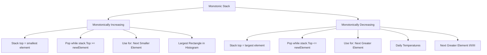
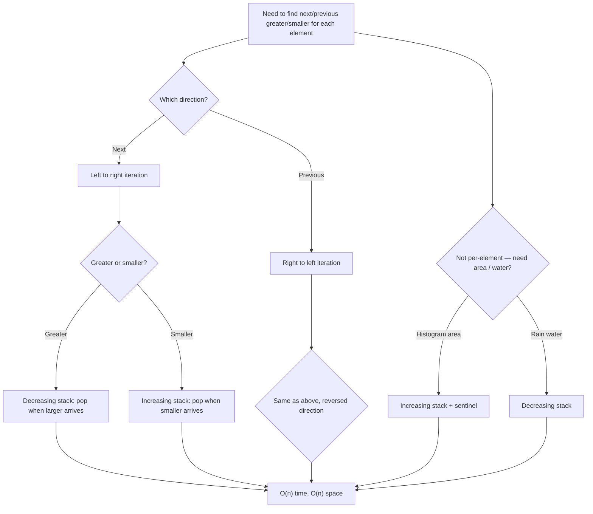

> [!success] Mastery Check
> - [ ] **Studied Well**
> - [ ] **Can explain the concept without notes**
> - [ ] **Can answer interview questions confidently**
> - [ ] **Can implement it in a real project**


## Navigation

**Domain:** [[5 — Data Structures & Algorithms]] > **Group:** Stacks and Queues
**Previous:** [[5.015 — Stack — LIFO Applications and Balanced Parentheses]] | **Next:** [[5.021 — Frequency Counting and Grouping]]

### Prerequisites
- [[5.015 — Stack — LIFO Applications and Balanced Parentheses]] — the monotonic stack is a standard stack with an additional ordering invariant; the LIFO operations (push, pop, peek) are the same, only the push logic changes.

### Where This Fits
The monotonic stack is one of the most frequently tested "advanced" stack patterns — it appears in roughly 10–15% of senior-level coding rounds, particularly in problems about finding the next greater element, the largest rectangle in a histogram, and trapping rain water. The core insight is that maintaining a stack in sorted order (increasing or decreasing) lets you answer, for every element, the "next" or "previous" element that is greater or smaller — all in O(n) time with O(n) space. The pattern is a natural extension of the basic stack: the invariant is that the stack elements are always monotonic (strictly increasing, decreasing, or non-decreasing/non-increasing). The pattern is closely related to the monotonic deque used in Sliding Window Maximum — the deque is a monotonic structure with two-ended access.

---

## Core Mental Model

A monotonic stack maintains a sequence of elements such that the values are in sorted order (increasing or decreasing). When a new element arrives, pop elements from the stack that violate the monotonic property, then push the new element. Each popped element has found the "next" element that is greater (or smaller) than itself — the new element is its answer. The stack stores either values or indices (indices are more useful because you can compute distances). For a **monotonically increasing stack**: pop while `stack.Top >= newElement` — top of stack is the smallest element. For a **monotonically decreasing stack**: pop while `stack.Top <= newElement` — top of stack is the largest element. The type of monotonic stack depends on the problem: next greater element uses a decreasing stack; next smaller element uses an increasing stack.

### Classification

The monotonic stack is a **constrained stack** — a standard `Stack<T>` where the push operation enforces a global ordering invariant. It belongs to the family of **monotonic queue/stack structures** alongside the monotonic deque. It is not a data structure but a **usage pattern** of the existing stack structure.



### Key Properties

|Property|Value|Derivation|
|---|---|---|
|Time complexity|O(n)|Each element pushed once, popped at most once|
|Space complexity|O(n)|Stack holds up to n elements in worst case (e.g., decreasing input for decreasing stack)|
|Amortized operations|O(1) per element|Push + at most one pop per element over n elements|
|Monotonic types|Increasing / Decreasing / Non-decreasing / Non-increasing|Strict vs. non-strict determines tie handling|

---

## Deep Mechanics

### How It Works

**Next Greater Element (NGE) — monotonically decreasing stack:**

Given `nums = [2, 1, 3, 4, 2]`, find the next greater element for each position.

Algorithm:
1. Iterate left to right.
2. While stack is not empty AND nums[i] > nums[stack.Peek()], pop — nums[i] is the NGE for the popped index.
3. Push i onto the stack.
4. After the loop, remaining elements in the stack have no NGE (result = -1).

Trace:
```
i=0, val=2: stack empty → push 0. Stack: [0]
i=1, val=1: 1 > 2? No → push 1. Stack: [0, 1]
i=2, val=3: 3 > 1? Yes → pop 1, result[1]=3. 3 > 2? Yes → pop 0, result[0]=3. Push 2. Stack: [2]
i=3, val=4: 4 > 3? Yes → pop 2, result[2]=4. Push 3. Stack: [3]
i=4, val=2: 2 > 4? No → push 4. Stack: [3, 4]
End: stack = [3, 4] → result[3] = -1, result[4] = -1

Result: [3, 3, 4, -1, -1]
```

**Previous Greater Element (PGE) — same algorithm, iterate right to left:**

Iterate from right to left. While stack.Top <= nums[i], pop. The new top of stack (if any) is the PGE for i.

**Largest Rectangle in Histogram — monotonically increasing stack:**

Given heights = [2, 1, 5, 6, 2, 3].

The algorithm maintains an increasing stack of indices. When a height is smaller than the height at the stack top, we pop — the popped height's rectangle is bounded by the current index on the right and the new stack top on the left.

```
i=0, h=2: stack empty → push 0. Stack: [0]
i=1, h=1: 1 < 2? Yes → pop 0. h=2, width = i - (stack empty ? 0 : stack.top+1) = 1-0 = 1. area = 2*1 = 2. Push 1. Stack: [1]
i=2, h=5: 5 >= 1? Yes → push 2. Stack: [1, 2]
i=3, h=6: 6 >= 5? Yes → push 3. Stack: [1, 2, 3]
i=4, h=2: 2 < 6? Yes → pop 3. h=6, width = 4-2-1 = 1. area = 6*1 = 6.
          2 < 5? Yes → pop 2. h=5, width = 4-1-1 = 2. area = 5*2 = 10. Push 4. Stack: [1, 4]
i=5, h=3: 3 >= 2? Yes → push 5. Stack: [1, 4, 5]
End: pop 5: h=3, width = 6-4-1 = 1. area = 3*1 = 3.
     pop 4: h=2, width = 6-1-1 = 4. area = 2*4 = 8.
     pop 1: h=1, width = 6. area = 1*6 = 6.

Max area = 10 (at index 2-3, heights 5 and 6).
```

### Complexity Derivation

**Time:** Each element is pushed onto the stack exactly once and popped at most once. The while loop inside the for loop executes at most n times total (each pop corresponds to a previous push). Total operations: O(n). No nested-loop blowup despite the appearance of a while loop inside a for loop.

**Space:** The stack can grow to size n in the worst case (a strictly decreasing input for a decreasing stack, or strictly increasing for an increasing stack). O(n).

### .NET Runtime Notes

- **`Stack<T>`** — .NET's built-in `Stack<T>` is the correct choice. It is backed by an array (T[]) and resized by doubling when full. Push and Pop are O(1) amortized.
- **`Stack<T>.Peek()`** — returns the top element without removing it. Throws `InvalidOperationException` if the stack is empty — always check `Count > 0` before Peek.
- **`Stack<T>.TryPeek()` / `TryPop()`** — .NET 6+ adds these methods that return false instead of throwing on empty stack. Prefer these in production code.
- **Index storage vs. value storage:** Always store indices in the stack when you need to access the original array (for computing distances, areas, etc.). Store values only when the absolute value is sufficient (simple NGE problems).
- **`Span<T>` for stack:** For performance-critical histogram problems with known max size, you can implement a stack-like array with an index pointer — faster than `Stack<T>` but not necessary for interviews.

### Why This Pattern Exists

The brute force approach for "next greater element" checks every element against every subsequent element — O(n²). The monotonic stack achieves O(n) by exploiting the fact that the next greater element relationship is transitive: if a is before b and a >= b, then a blocks b from being the next greater element for any element before a. The stack maintains the set of "unresolved" elements — elements whose next greater element has not been found yet. When a new element arrives, it resolves all unresolved elements that are smaller than itself (pops them), records the answer, and then becomes the newest unresolved element. This is the same insight as the sliding window maximum's deque: maintain a candidate set in decreasing order.

---

## Implementation and Problem Patterns

### C# Implementation

```csharp
public static class MonotonicStack
{
    /// <summary>
    /// Next Greater Element (NGE) for each position.
    /// Returns array where result[i] = index of next greater element, or -1.
    /// </summary>
    public static int[] NextGreaterElement(int[] nums)
    {
        int n = nums.Length;
        var result = new int[n];
        Array.Fill(result, -1);
        var stack = new Stack<int>(); // stores indices

        for (int i = 0; i < n; i++)
        {
            while (stack.Count > 0 && nums[i] > nums[stack.Peek()])
            {
                int idx = stack.Pop();
                result[idx] = i;
            }
            stack.Push(i);
        }

        return result;
    }

    /// <summary>
    /// Next Greater Element in a circular array.
    /// The array is treated as circular — for elements at the end,
    /// the next greater element may be at the beginning.
    /// </summary>
    public static int[] NextGreaterElementCircular(int[] nums)
    {
        int n = nums.Length;
        var result = new int[n];
        Array.Fill(result, -1);
        var stack = new Stack<int>();

        // Iterate twice the length to simulate circular behavior
        for (int i = 0; i < 2 * n; i++)
        {
            int idx = i % n;
            while (stack.Count > 0 && nums[idx] > nums[stack.Peek()])
            {
                int popIdx = stack.Pop();
                if (result[popIdx] == -1)
                    result[popIdx] = idx;
            }
            if (i < n)
                stack.Push(idx);
        }

        return result;
    }

    /// <summary>
    /// Largest rectangle in a histogram.
    /// Heights = array of bar heights. Returns the max area.
    /// </summary>
    public static int LargestRectangleArea(int[] heights)
    {
        int n = heights.Length;
        var stack = new Stack<int>();
        int maxArea = 0;

        for (int i = 0; i <= n; i++)
        {
            int h = i < n ? heights[i] : 0; // sentinel 0 at end to flush stack

            while (stack.Count > 0 && h < heights[stack.Peek()])
            {
                int height = heights[stack.Pop()];
                int left = stack.Count > 0 ? stack.Peek() + 1 : 0;
                int width = i - left;
                maxArea = Math.Max(maxArea, height * width);
            }

            stack.Push(i);
        }

        return maxArea;
    }

    /// <summary>
    /// Trapping rain water — amount of water that can be trapped between bars.
    /// Uses a decreasing stack (next greater on both sides).
    /// </summary>
    public static int TrapRainWater(int[] height)
    {
        int n = height.Length;
        var stack = new Stack<int>();
        int total = 0;

        for (int i = 0; i < n; i++)
        {
            while (stack.Count > 0 && height[i] > height[stack.Peek()])
            {
                int bottom = stack.Pop();
                if (stack.Count == 0) break;

                int left = stack.Peek();
                int width = i - left - 1;
                int boundedHeight = Math.Min(height[left], height[i]) - height[bottom];
                total += width * boundedHeight;
            }
            stack.Push(i);
        }

        return total;
    }

    /// <summary>
    /// Daily temperatures — number of days until a warmer temperature.
    /// Same as NGE, but returns distance (index difference) instead of index.
    /// </summary>
    public static int[] DailyTemperatures(int[] temperatures)
    {
        int n = temperatures.Length;
        var result = new int[n];
        var stack = new Stack<int>();

        for (int i = 0; i < n; i++)
        {
            while (stack.Count > 0 && temperatures[i] > temperatures[stack.Peek()])
            {
                int idx = stack.Pop();
                result[idx] = i - idx;
            }
            stack.Push(i);
        }

        return result;
    }
}
```

### The .NET Idiomatic Version

```csharp
public static class MonotonicStackIdiomatic
{
    // Use Stack<T> from System.Collections.Generic.
    // No LINQ alternative — the pattern requires manual index tracking.

    // For the histogram problem, a stack implemented as an array
    // can be faster in tight loops:
    public static int LargestRectangleAreaArray(int[] heights)
    {
        int n = heights.Length;
        var stack = new int[n + 1]; // array as stack
        int sp = 0; // stack pointer
        int maxArea = 0;

        for (int i = 0; i <= n; i++)
        {
            int h = i < n ? heights[i] : 0;
            while (sp > 0 && h < heights[stack[sp - 1]])
            {
                int height = heights[stack[--sp]];
                int left = sp > 0 ? stack[sp - 1] + 1 : 0;
                maxArea = Math.Max(maxArea, height * (i - left));
            }
            stack[sp++] = i;
        }

        return maxArea;
    }
    // Prefer Stack<T> in interviews for readability.
    // The array stack is a micro-optimization for production.
}
```

### Classic Problem Patterns

1. **Next greater element (LeetCode 496, 503)** — For each element, find the next element that is larger. Key insight: decreasing stack; when a larger element arrives, it resolves all smaller elements in the stack.

2. **Daily temperatures (LeetCode 739)** — Number of days until a warmer temperature. Key insight: same as NGE but track index difference instead of value.

3. **Largest rectangle in histogram (LeetCode 84)** — Largest area rectangle that fits under the histogram. Key insight: increasing stack; when a height is smaller than the stack top, pop and compute the rectangle bounded by the current index and the new top of stack.

4. **Trapping rain water (LeetCode 42)** — Water trapped between bars. Key insight: decreasing stack; when a bar is higher than the stack top, pop the bottom and the water is bounded by the lower of the left and right walls, minus the bottom height.

5. **Remove duplicate letters / smallest subsequence (LeetCode 316, 1081)** — Remove duplicates to get the smallest lexicographic result. Key insight: increasing stack with a remaining-count check — pop if the current character is smaller than the stack top AND the popped character appears later.

### Template / Skeleton

```csharp
// Monotonic Stack Template (decreasing — for Next Greater Element)
// When to use: find next/previous greater/smaller element for each position
// Time: O(n) | Space: O(n)

public static int[] MonotonicStackTemplate(int[] nums)
{
    int n = nums.Length;
    var result = new int[n];
    Array.Fill(result, -1); // TODO: set appropriate default
    var stack = new Stack<int>(); // stores indices

    for (int i = 0; i < n; i++)
    {
        // TODO: determine monotonic type and comparison operator
        // For decreasing stack (NGE): nums[i] > nums[stack.Peek()]
        // For increasing stack (NSL): nums[i] < nums[stack.Peek()]
        while (stack.Count > 0 && nums[i] > nums[stack.Peek()])
        {
            int idx = stack.Pop();
            // TODO: record result for idx using nums[i] or i
            result[idx] = i; // or nums[i] depending on problem
        }
        stack.Push(i);
    }

    // remaining elements in stack have no "next" element satisfying the condition
    return result;
}

// Largest Rectangle in Histogram Template:
public static int HistogramTemplate(int[] heights)
{
    int n = heights.Length;
    var stack = new Stack<int>();
    int maxArea = 0;

    for (int i = 0; i <= n; i++)
    {
        int h = i < n ? heights[i] : 0; // sentinel to flush stack

        while (stack.Count > 0 && h < heights[stack.Peek()])
        {
            int height = heights[stack.Pop()];
            int left = stack.Count > 0 ? stack.Peek() + 1 : 0;
            int width = i - left;
            maxArea = Math.Max(maxArea, height * width);
        }

        stack.Push(i);
    }

    return maxArea;
}
```

---

## Gotchas and Edge Cases

### Strict vs. Non-Strict Monotonicity (Tie Handling)

**Mistake:** Using `>` when `>=` is required (or vice versa) for ties.

```csharp
// ❌ Wrong — for "next greater element" with duplicates
// Using >= treats a duplicate as not "greater" — the duplicate stays in the stack.
// If the problem treats duplicates as not satisfying the condition, this is correct.
// But if duplicates should resolve (e.g., "next greater or equal"), use >= instead.
while (stack.Count > 0 && nums[i] >= nums[stack.Peek()]) // depends on problem
```

**Fix:** Determine tie handling from the problem statement. "Next greater element" → strict (`>`). "Next greater or equal" → non-strict (`>=`). For "remove duplicate letters," the comparison is on character priority and tie handling depends on future occurrences.

```csharp
// ✅ Check the problem: strict or non-strict?
// Strict: nums[i] > nums[stack.Peek()]
// Non-strict: nums[i] >= nums[stack.Peek()]
```

**Consequence:** Wrong answers for duplicate values — either failing to resolve duplicates that should be resolved, or incorrectly resolving duplicates that should not be.

### Empty Stack Access in Histogram Width Calculation

**Mistake:** Accessing `stack.Peek()` after popping without checking if the stack is empty.

```csharp
// ❌ Wrong — InvalidOperationException when stack is empty after pop
int height = heights[stack.Pop()];
int left = stack.Peek() + 1; // throws if stack is now empty
int width = i - left;
```

**Fix:** Always check `stack.Count > 0` when computing left boundary after a pop.

```csharp
// ✅ Correct
int height = heights[stack.Pop()];
int left = stack.Count > 0 ? stack.Peek() + 1 : 0;
int width = i - left;
```

**Consequence:** InvalidOperationException when computing width for the last remaining element in the stack — the left boundary extends to index 0.

### Forgetting the Sentinel Value at the End of Histogram

**Mistake:** Not processing the remaining elements in the stack after the main loop.

```csharp
// ❌ Wrong — stack may still have elements at end of loop
for (int i = 0; i < n; i++) { /* process */ }
// remaining elements in stack not processed — missing areas
```

**Fix:** Either flush the stack after the loop, or (better) extend the loop to n+1 with a sentinel height of 0.

```csharp
// ✅ Correct — sentinel height 0 at the end flushes all remaining bars
for (int i = 0; i <= n; i++)
{
    int h = i < n ? heights[i] : 0; // sentinel
    while (stack.Count > 0 && h < heights[stack.Peek()])
    {
        // compute area as normal
    }
    stack.Push(i);
}
```

**Consequence:** Missed rectangles — the final bars in a non-decreasing sequence (which never triggered a pop) will not have their areas computed. The result will be too low.

### Circular NGE — Double Iteration Without Guard

**Mistake:** Pushing all elements in the second pass as well, causing duplicate processing.

```csharp
// ❌ Wrong — pushes elements from the second pass, causing issues
for (int i = 0; i < 2 * n; i++)
{
    int idx = i % n;
    while (stack.Count > 0 && nums[idx] > nums[stack.Peek()])
    {
        int popIdx = stack.Pop();
        result[popIdx] = idx;
    }
    stack.Push(idx); // pushes indices from both passes — duplicates!
}
```

**Fix:** Only push indices during the first pass. The second pass only resolves (pops) remaining elements.

```csharp
// ✅ Correct
for (int i = 0; i < 2 * n; i++)
{
    int idx = i % n;
    while (stack.Count > 0 && nums[idx] > nums[stack.Peek()])
    {
        int popIdx = stack.Pop();
        if (result[popIdx] == -1)
            result[popIdx] = idx;
    }
    if (i < n) // only push during first pass
        stack.Push(idx);
}
```

**Consequence:** Stack contains stale indices from the second pass, potentially causing incorrect results or double-resolution of already-resolved elements.

### Monotonic Type Selection (Increasing vs. Decreasing)

**Mistake:** Choosing the wrong monotonic direction for the problem.

```csharp
// ❌ Wrong — using decreasing stack for "next smaller element"
// Decreasing stack finds NEXT GREATER elements.
// For next smaller, you need an INCREASING stack.
while (stack.Count > 0 && nums[i] > nums[stack.Peek()]) // pops when larger arrives → NGE
```

**Fix:** Remember: monotonic direction is the inverse of the answer:
- **NGE (Next Greater Element):** decreasing stack (pop when larger arrives — the larger is the answer)
- **NSE (Next Smaller Element):** increasing stack (pop when smaller arrives — the smaller is the answer)
- **PGE (Previous Greater Element):** iterate right-to-left with decreasing stack
- **PSE (Previous Smaller Element):** iterate right-to-left with increasing stack

```csharp
// ✅ NSE — increasing stack
while (stack.Count > 0 && nums[i] < nums[stack.Peek()])
{
    int idx = stack.Pop();
    result[idx] = i; // nums[i] is the next smaller for popped idx
}
```

**Consequence:** Returns next greater instead of next smaller (or vice versa) — completely wrong answers for every element.

---

## Complexity Analysis and Benchmarks

### Operation Complexity Table

|Operation|Time|Space|Notes|
|---|---|---|---|
|Next greater element|O(n)|O(n)|Single pass, each element pushed/popped once|
|Next greater element (circular)|O(n)|O(n)|2n iterations, push on first n only|
|Largest rectangle in histogram|O(n)|O(n)|n+1 iterations with sentinel|
|Trapping rain water|O(n)|O(n)|Single pass, decreasing stack|
|Daily temperatures|O(n)|O(n)|Same as NGE with distance tracking|

**Derivation for the non-obvious entries:** Each element enters the stack once and leaves at most once. The while loop inside the for loop executes O(n) times total across all iterations — the classic amortized O(1) argument. The sentinel extension (n+1 iterations) adds a constant factor.

### Comparison with Alternatives

|Approach|Time|Space|Best When|
|---|---|---|---|
|Monotonic stack|O(n)|O(n)|All NGE / NSE / largest-rectangle / rain-water problems|
|Brute force (nested loops)|O(n²)|O(1)|Small n (n ≤ 100) — never in interviews|
|Two-pointer (rain water)|O(n)|O(1)|Rain water only — simpler than stack, same time|
|Segment tree (range max queries)|O(n log n)|O(n)|When you need arbitrary range queries, not just per-element results|
|Divide and conquer (histogram)|O(n log n)|O(log n)|Theoretical alternative — worse than stack O(n)|

### BenchmarkDotNet

```csharp
[MemoryDiagnoser]
[SimpleJob(RuntimeMoniker.Net90)]
public class MonotonicStackBenchmark
{
    [Params(100, 1_000, 10_000)]
    public int N { get; set; }

    private int[] _heights = default!;

    [GlobalSetup]
    public void Setup()
    {
        var rng = new Random(42);
        _heights = new int[N];
        for (int i = 0; i < N; i++)
            _heights[i] = rng.Next(0, 1000);
    }

    [Benchmark(Baseline = true)]
    public int LargestRectangleStack()
    {
        return MonotonicStack.LargestRectangleArea(_heights);
    }

    [Benchmark]
    public int LargestRectangleBrute()
    {
        int max = 0;
        for (int i = 0; i < _heights.Length; i++)
        {
            int minH = _heights[i];
            for (int j = i; j < _heights.Length; j++)
            {
                minH = Math.Min(minH, _heights[j]);
                max = Math.Max(max, minH * (j - i + 1));
            }
        }
        return max;
    }
}
```

**Expected results (approximate, .NET 9, x64):**

|Method|N|Mean|Allocated|
|---|---|---|---|
|LargestRectangleStack|100|~1 μs|~1 KB|
|LargestRectangleBrute|100|~100 μs|0 B|
|LargestRectangleStack|1_000|~10 μs|~8 KB|
|LargestRectangleBrute|1_000|~10,000 μs|0 B|
|LargestRectangleStack|10_000|~100 μs|~80 KB|
|LargestRectangleBrute|10_000|~1,000,000 μs (1 sec)|0 B|

**Interpretation:** The monotonic stack is ~100x faster at n=1,000 and ~10,000x faster at n=10,000 compared to brute force. The difference grows quadratically because the stack is O(n) vs. brute force O(n²). The stack allocates O(n) memory for the stack but this is minor compared to the time savings.

---

## Interview Arsenal

### Question Bank

1. [Definition] What is a monotonic stack and what invariant does it maintain?
2. [Complexity] Derive the amortized O(n) time complexity of the monotonic stack pattern.
3. [Implementation] Implement largest rectangle in histogram using a monotonic stack.
4. [Recognition] "Given an array of integers, find the nearest smaller number to the left for every element" — which monotonic stack variant?
5. [Comparison] Compare the monotonic stack approach for trapping rain water vs. the two-pointer approach.
6. [Trick] What determines whether you use strict (`>`) or non-strict (`>=`) comparison in the while loop?
7. [System Design] How would you use a monotonic stack to detect anomalies in a time series of server metrics?
8. [Optimization] In the histogram problem, what does the sentinel height of 0 at the end accomplish?

### Spoken Answers

**Q: What is a monotonic stack and what invariant does it maintain?**

> **Average answer:** A stack where elements are in increasing or decreasing order.

> **Great answer:** A monotonic stack maintains the invariant that elements from bottom to top are in sorted order — either increasing (smallest at top) or decreasing (largest at top). The monotonic direction depends on the problem: a **decreasing stack** (top is the largest) is used for "next greater element" problems — when a larger element arrives, it pops smaller elements from the stack because the new element is the next greater element for each popped one. An **increasing stack** (top is the smallest) is used for "next smaller element" problems. The key property is that each element is pushed once and popped at most once, making the overall time O(n) despite the nested while loop. The stack typically stores indices rather than values because indices let you compute distances and access the original array.

**Q: Implement largest rectangle in histogram using a monotonic stack.**

> **Average answer:** Iterate through heights, maintain an increasing stack, compute area when a smaller height arrives.

> **Great answer:** I maintain an increasing stack of indices. At each step, I have the current height `h`. While the stack is not empty and `h < heights[stack.Peek()]`, I pop the top index. The popped height is the top of a potential rectangle. The left boundary of this rectangle is the new stack top + 1 (or 0 if the stack is empty), and the right boundary is the current index `i`. The width is `i - left`. I compute the area as height × width and update the max. After processing all heights, I add a sentinel height of 0 to flush the remaining elements in the stack. The sentinel ensures all rectangles are computed — without it, bars that are in non-decreasing order would never trigger a pop. This is O(n) time and O(n) space.

**Q: [Trick] What determines whether you use strict (>) or non-strict (>=) comparison in the while loop?**

> **Average answer:** It depends on whether duplicates are handled as greater or equal.

> **Great answer:** The comparison operator determines how ties are handled. For **next greater element**, using `>` (strict) means a duplicate value is NOT considered "greater" — the duplicate stays in the stack and does not resolve. Using `>=` (non-strict) means a duplicate value IS considered a resolution. The choice depends on the problem's definition of "greater." For **next greater element I**, duplicates are not considered greater, so strict `>` is correct. For **largest rectangle in histogram**, I use `<` (strict) — when heights are equal, I do not pop because the rectangle can extend through equal heights. Actually, for histogram, I use `<` on the current height vs. the stack top's height — equal heights stay in the stack, which means the left boundary extends further backward, giving the correct maximum area. The general rule: read the problem carefully — if it says "greater" (not "greater or equal"), use strict. If it says "smaller," use strict `<`. Adjust based on the expected behavior for duplicates.

### Trick Question

**"Can you use a monotonic stack to find the maximum element in a sliding window?"**

Why it is a trap: The monotonic stack finds "next greater element" per position, but sliding window maximum requires the "current maximum" in each window — a different pattern.

Correct answer: No — sliding window maximum uses a **monotonic deque** (double-ended queue), not a stack. The difference is that when the window slides, the leftmost element must be removed from the window. A stack cannot remove from the bottom (oldest element). A deque supports removal from both ends — pop from the front when the element is outside the window, pop from the back to maintain the monotonic property. The monotonic deque is a direct adaptation of the monotonic stack concept, but with double-ended access. The structure is the same (decreasing order), but the container is different.

### Pattern Recognition Table

|If the problem has...|Then consider...|Because...|
|---|---|---|
|"Next greater / smaller element"|Monotonic stack (decreasing / increasing)|Each element resolves all previously unresolved smaller/larger elements|
|"Largest rectangle in histogram"|Monotonic increasing stack + sentinel|Width bounded by nearest smaller heights on both sides|
|"Trapping rain water"|Monotonic decreasing stack|Water bounded by nearest greater heights on both sides|
|"Remove duplicates / smallest subsequence"|Monotonic increasing stack + remaining count|Greedy character selection with future availability check|
|"Daily temperatures"|Monotonic decreasing stack with distance|Same as NGE but tracks index difference|
|"Maximum in sliding window"|Monotonic deque (not stack)|Need to remove from both ends — stack cannot pop from bottom|

---

## Decision Framework

### When to Apply



### Recognition Checklist

Indicators that the monotonic stack applies:

- [ ] Problem asks for "next greater," "next smaller," "nearest larger" per element
- [ ] Problem involves computing rectangles under a histogram
- [ ] Problem involves trapping water between bars
- [ ] Problem involves removing characters to get the smallest lexicographic result
- [ ] A brute force O(n²) solution exists and n is large (10⁵)
- [ ] The optimal solution uses a stack with a while loop that seems nested but is actually O(n)

Counter-indicators — do NOT apply here:

- [ ] Problem asks for maximum/minimum in sliding windows (use deque)
- [ ] Problem asks for subarray sum or product (use prefix sum or segment tree)
- [ ] Problem involves a queue-like pattern where elements are removed from the front
- [ ] Problem does not require comparison between elements (only absolute values)

### Tradeoff Summary

|What You Gain|What You Give Up|
|---|---|
|O(n) time for all per-element comparisons|O(n) space for the stack|
|Simple, uniform pattern across many problems|Must choose correct monotonic direction (increasing vs. decreasing)|
|Stack stores indices — gives access to values and distances|Edge cases: empty stack, sentinel handling, tie-breaking|
|Amortized O(1) per element|Non-amortized analysis shows a while loop — may confuse in interview if not explained|

---

## Self-Check

### Conceptual Questions

1. What is a monotonic stack and what are the two directions?
2. Derive why each element is pushed and popped at most once in the monotonic stack pattern.
3. Recognizing from a problem: "Given an array of integers temperatures representing daily temperatures, return an array where answer[i] is the number of days you would have to wait until a warmer temperature."
4. When would you choose a monotonic stack over a brute force approach?
5. What is the purpose of the sentinel value at the end of the histogram algorithm?
6. In .NET, what does `Stack<T>.Peek()` throw if the stack is empty?
7. What invariant does the stack maintain in the histogram algorithm?
8. How does the solution change if the histogram problem requires the area of the largest rectangle that can be formed by using at most k consecutive bars?
9. In a production monitoring system, how would you use a monotonic stack to detect when a server's response time exceeds all previous response times in a window?
10. Why can a monotonic stack not solve the sliding window maximum problem?

<details>
<summary>Answers</summary>

1. A stack where elements from bottom to top are in sorted order. Monotonically decreasing: top is the largest element (used for NGE). Monotonically increasing: top is the smallest element (used for NSE).
2. Each element is pushed onto the stack exactly once (in the outer for loop). It can be popped at most once (in the inner while loop). Once popped, it never re-enters the stack. Total pops ≤ total pushes = n. The while loop's total iterations across the entire for loop is ≤ n. Therefore O(n) total.
3. Daily temperatures (LeetCode 739) — monotonic decreasing stack storing indices. When a warmer temperature is found, pop all colder temperatures from the stack and record the distance.
4. Monotonic stack when n > 1,000 and O(n²) would TLE. Brute force when n ≤ 100 and simplicity is preferred.
5. The sentinel (height 0) at the end flushes all remaining bars from the stack. Without it, bars at the end that are in non-decreasing order would never pop and their rectangles would never be computed.
6. `InvalidOperationException`. Use `TryPeek()` (.NET 6+) or check `Count > 0` before `Peek()`.
7. The stack maintains indices of bars in increasing order of height. When a smaller bar arrives, it triggers pops because the popped bar's rectangle is bounded by the current bar on the right and the new stack top on the left.
8. Use a sliding window of size k with a monotonic stack restricted to the window — or more practically, check for each bar whether there are at least k bars to its left and right with height ≥ its height. This changes the problem from "global maximum" to "bounded width maximum."
9. Maintain a monotonic decreasing stack of (timestamp, responseTime). When a new response time arrives, pop all entries with lower response time and record the popped entries as "resolved" — their next greater response time is the new entry. The remaining entries have no next greater within the observed window. This is the production equivalent of "next greater element."
10. Sliding window maximum requires removing elements from the front of the window (as it slides) — a stack only supports removal from the top. The deque supports removal from both ends: pop front when an element leaves the window, pop back to maintain monotonicity.
</details>

---

### Coding Challenges

**Challenge 1 — Implement from scratch**

Implement next greater element (NGE) for each position in an array. Return an array where result[i] is the index of the next greater element, or -1 if none exists.

<details> <summary>Solution</summary>

```csharp
public int[] NextGreaterElement(int[] nums)
{
    int n = nums.Length;
    var result = new int[n];
    Array.Fill(result, -1);
    var stack = new Stack<int>();

    for (int i = 0; i < n; i++)
    {
        while (stack.Count > 0 && nums[i] > nums[stack.Peek()])
        {
            int idx = stack.Pop();
            result[idx] = i;
        }
        stack.Push(i);
    }

    return result;
}
```

**Complexity:** Time O(n) | Space O(n) **Key insight:** Each element is pushed once and popped at most once. The while loop is amortized O(1) per iteration of the for loop.

</details>

---

**Challenge 2 — Trace the execution**

Trace the next greater element algorithm on `nums = [4, 5, 2, 25, 7, 8]`. Show the stack state and result after each iteration.

<details> <summary>Solution</summary>

```
i=0, val=4: stack empty → push 0. Stack: [0]        Result: [-1, -1, -1, -1, -1, -1]
i=1, val=5: 5>4 → pop 0, result[0]=1. Push 1. Stack: [1]  Result: [1, -1, -1, -1, -1, -1]
i=2, val=2: 2>5? No → push 2. Stack: [1, 2]         Result: [1, -1, -1, -1, -1, -1]
i=3, val=25: 25>2 → pop 2, result[2]=3. 25>5 → pop 1, result[1]=3. Push 3. Stack: [3]
                                                      Result: [1, 3, 3, -1, -1, -1]
i=4, val=7: 7>25? No → push 4. Stack: [3, 4]         Result: [1, 3, 3, -1, -1, -1]
i=5, val=8: 8>7 → pop 4, result[4]=5. 8>25? No → push 5. Stack: [3, 5]
                                                      Result: [1, 3, 3, -1, 5, -1]
End: stack = [3, 5] → result[3]=-1, result[5]=-1.    Result: [1, 3, 3, -1, 5, -1]
```

**Why:** NGE for 4 is 5 (at index 1). NGE for 2 is 25 (at index 3). NGE for 7 is 8 (at index 5). Elements 25 and 8 have no NGE → -1.

</details>

---

**Challenge 3 — Fix the bug**

```csharp
// This code finds the largest rectangle in a histogram.
// It has a bug — which test case fails?
public static int LargestRectangleArea(int[] heights)
{
    int n = heights.Length;
    var stack = new Stack<int>();
    int maxArea = 0;

    for (int i = 0; i < n; i++)
    {
        while (stack.Count > 0 && heights[i] < heights[stack.Peek()])
        {
            int height = heights[stack.Pop()];
            int width = stack.Count > 0 ? i - stack.Peek() - 1 : i;
            maxArea = Math.Max(maxArea, height * width);
        }
        stack.Push(i);
    }

    // Missing: flush remaining elements in stack
    // Bars that are in non-decreasing order were never popped

    return maxArea;
}
```

<details> <summary>Solution</summary>

**Bug:** The stack is not flushed after the main loop. Bars that form a non-decreasing sequence (e.g., [1, 2, 3, 4, 5]) never trigger the while loop because each new height is greater than the stack top. Their rectangles are never computed.

**Fix:** Either flush after the loop or (preferred) extend the loop to n+1 with sentinel height 0.

```csharp
public static int LargestRectangleArea(int[] heights)
{
    int n = heights.Length;
    var stack = new Stack<int>();
    int maxArea = 0;

    for (int i = 0; i <= n; i++) // FIXED: n+1 iterations
    {
        int h = i < n ? heights[i] : 0; // FIXED: sentinel 0 at end

        while (stack.Count > 0 && h < heights[stack.Peek()])
        {
            int height = heights[stack.Pop()];
            int left = stack.Count > 0 ? stack.Peek() + 1 : 0;
            int width = i - left;
            maxArea = Math.Max(maxArea, height * width);
        }
        stack.Push(i);
    }

    return maxArea;
}
```

**Test case that exposes it:** `LargestRectangleArea([1, 2, 3, 4, 5])`. Buggy returns 0. Correct returns 9 (height 1 × width 5, but actually max is 9 from height 3 × width 3, etc.). Actually for [1,2,3,4,5], the stack process would be: no pops occur because heights are increasing. maxArea stays 0. Correct answer: 9 (3*3 from positions 2-4). Wait — actually the max area for [1,2,3,4,5] is 9 (the 3-bar rectangle of height 3 × width 3, or better: 5 × 1 = 5, 4 × 2 = 8, 3 × 3 = 9).

</details>

---

**Challenge 4 — Recognize and apply**

**Problem:** Given a binary matrix of 0s and 1s, find the largest rectangle containing only 1s and return its area.

Example:
```
1 0 1 0 0
1 0 1 1 1
1 1 1 1 1
1 0 0 1 0
```
Maximum area = 6 (the rectangle of 1s in rows 2-3, columns 2-4).

<details> <summary>Solution</summary>

**Pattern:** Reduce to largest rectangle in histogram. For each row, compute a heights array where heights[j] = consecutive 1s ending at row i, column j (reset to 0 if matrix[i][j] == 0). Apply the histogram algorithm on each row's heights.

```csharp
public static int MaximalRectangle(char[][] matrix)
{
    if (matrix.Length == 0) return 0;
    int rows = matrix.Length, cols = matrix[0].Length;
    var heights = new int[cols];
    int maxArea = 0;

    for (int i = 0; i < rows; i++)
    {
        // Update heights for this row
        for (int j = 0; j < cols; j++)
        {
            if (matrix[i][j] == '1')
                heights[j]++;
            else
                heights[j] = 0;
        }

        // Largest rectangle in this row's histogram
        maxArea = Math.Max(maxArea, LargestRectangleArea(heights));
    }

    return maxArea;
}

// Use the histogram function from Challenge 3
```

**Complexity:** Time O(rows × cols) | Space O(cols) **Key insight:** Each row builds on the previous row's heights. The histogram algorithm runs once per row. The total is O(rows × cols) because the histogram is O(cols) per row.

</details>

---

**Challenge 5 — Optimize**

```csharp
// This solution finds the next greater element using nested loops.
// Optimize to O(n) time.
public static int[] NextGreaterElement(int[] nums)
{
    int n = nums.Length;
    var result = new int[n];
    Array.Fill(result, -1);

    for (int i = 0; i < n; i++)
    {
        for (int j = i + 1; j < n; j++)
        {
            if (nums[j] > nums[i])
            {
                result[i] = j;
                break;
            }
        }
    }

    return result;
}
```

<details> <summary>Solution</summary>

**Insight:** Replace the nested loops with a monotonic decreasing stack — O(n) amortized.

```csharp
public static int[] NextGreaterElement(int[] nums)
{
    int n = nums.Length;
    var result = new int[n];
    Array.Fill(result, -1);
    var stack = new Stack<int>();

    for (int i = 0; i < n; i++)
    {
        while (stack.Count > 0 && nums[i] > nums[stack.Peek()])
        {
            int idx = stack.Pop();
            result[idx] = i;
        }
        stack.Push(i);
    }

    return result;
}
```

**Complexity:** Time O(n) | Space O(n) **Key insight:** The stack replaces the O(n) inner loop by maintaining the set of "unresolved" elements. Each unresolved element is resolved at most once when a larger element arrives.

</details>
