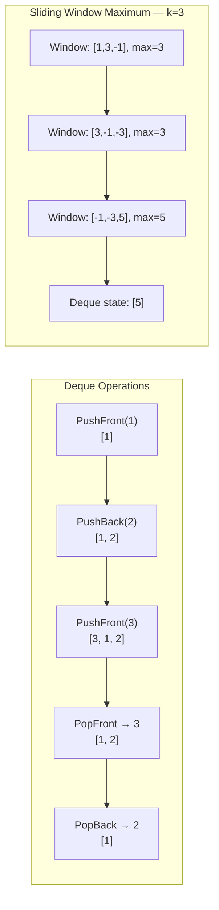

> [!success] Mastery Check
> - [ ] **Studied Well**
> - [ ] **Can explain the concept without notes**
> - [ ] **Can answer interview questions confidently**
> - [ ] **Can implement it in a real project**


## Navigation

**Domain:** [[5 — Data Structures & Algorithms]] > **Group:** Stacks and Queues
**Previous:** [[5.017 — Monotonic Stack Pattern]] | **Next:** [[5.019 — Hash Maps and Hash Sets — Design and Collision Handling]]

### Prerequisites
- [[5.015 — Stack — LIFO Applications and Balanced Parentheses]] — the deque is a combination of stack and queue; understanding LIFO operations is required.
- [[5.016 — Queue — FIFO and BFS Applications]] — the deque extends the queue with front operations; the circular buffer pattern extends naturally.

### Where This Fits
A deque (double-ended queue) supports O(1) insertion and removal at both ends — it is a stack and a queue simultaneously. Its primary use in interviews is the **monotonic deque** for sliding window maximum (LeetCode 239), one of the classic hard problems. Deques also appear in palindrome checking, undo/redo with bounded history, and task scheduling with priority at either end. The monotonic deque extends the monotonic stack pattern to problems where elements must also be removed from the front (window expiration). Understanding this connection — monotonic stack → monotonic deque — is a mark of senior-level pattern recognition.

---

## Core Mental Model

A deque is a sequence with four fundamental O(1) operations: push front, push back, pop front, pop back. The monotonic deque maintains elements in decreasing (or increasing) order by discarding elements that can never become the answer. When a new element arrives: remove from the back any elements it dominates (they can never be the max for any future window), then add it. Remove from the front any elements outside the current window. The front of the deque is always the answer for the current window.

### Classification

A deque is a **linear data structure** that generalizes both stacks and queues. In .NET, `LinkedList<T>` serves as a deque (O(1) add/remove at both ends), but there is no dedicated `Deque<T>` type in the base class library. For performance-critical code, a **ring buffer deque** (circular array indexed at both ends) provides better cache locality.



### Key Properties

|Property|Value|Derivation|
|---|---|---|
|PushFront / PushBack|O(1)|Ring buffer: decrement/increment head/tail with wrap|
|PopFront / PopBack|O(1)|Ring buffer: increment/decrement head/tail with wrap|
|PeekFront / PeekBack|O(1)|Read buffer[head] or buffer[(tail-1) mod capacity]|
|Sliding window max (n elements, k window)|O(n)|Each element enqueued once, dequeued at most once|

---

## Deep Mechanics

### How It Works

**Ring buffer deque:**
- A circular array with `_head` pointing to the front element and `_tail` pointing one past the last element.
- PushFront: decrement `_head` (with wrap), write at the new head.
- PushBack: write at `_tail`, increment `_tail` (with wrap).
- PopFront: read at `_head`, increment `_head` (with wrap), clear the slot.
- PopBack: decrement `_tail` (with wrap), read at the new tail, clear the slot.
- Resize: when the buffer is full, allocate 2x, unwrap from `_head` to `_tail` linearly, reset `_head = 0`, `_tail = count`.

**Monotonic deque for sliding window maximum:**
1. Deque stores *indices* (not values) in decreasing order of value.
2. For each new element at index i:
   a. Remove indices from the back while the corresponding values are ≤ arr[i] — they are dominated and can never be the max for any future window.
   b. Add i to the back.
   c. Remove indices from the front while they are ≤ i - k (outside current window).
3. The front of the deque is the index of the maximum for the current window.

Walkthrough on `arr = [1, 3, -1, -3, 5, 3]`, k = 3:

|i|Value|Deque (indices → values)|Window|Max|
|---|---|---|---|---|
|0|1|[0→1]|—|—|
|1|3|Pop back (0→1 ≤ 3), [1→3]|—|—|
|2|-1|[1→3, 2→-1]|[1,3,-1]|3 (index 1)|
|3|-3|Pop front: 1 ≤ 0? No. [1→3, 2→-1, 3→-3]|[3,-1,-3]|3 (index 1)|
|3|-3|Pop front: 1 ≤ 0? No. Actually wait — expire front if ≤ i-k = 0. Index 1 > 0, keep.||3|
|4|5|Pop back: 3→-3 ≤ 5, 2→-1 ≤ 5, 1→3 ≤ 5. [4→5]|[-3,5,3]|5 (index 4)|
|5|3|[4→5, 5→3]|[5,3,6]|5 (index 4)|

Wait let me redo this more carefully. i-k for each i:
- i=0, i-k = -3 (no expiration)
- i=1, i-k = -2
- i=2, i-k = -1 — window [0,2], max at index 1
- i=3, i-k = 0 — window [1,3], expire front if front index ≤ 0. Front is 1, not expired.
- i=4, i-k = 1 — window [2,4], expire front if front index ≤ 1. Front is 1, expires.
- i=5, i-k = 2 — window [3,5]

Let me trace properly:

i=0, val=1:
- Deque empty → add 0
- Deque: [0→1]
- No window yet (i < k-1 = 2)

i=1, val=3:
- Back has 0→1 ≤ 3 → remove 0
- Add 1→3
- Deque: [1→3]
- No window yet

i=2, val=-1:
- Back has 1→3 > -1 → keep 1
- Add 2→-1
- Deque: [1→3, 2→-1]
- Window [0,2], front is 1 → max = 3
- Expire front if ≤ i-k = -1 → no expiration

i=3, val=-3:
- Back has 2→-1 > -3 → keep
- Add 3→-3
- Deque: [1→3, 2→-1, 3→-3]
- Expire front if ≤ i-k = 0 → front is 1, not ≤ 0
- Window [1,3], front is 1 → max = 3

i=4, val=5:
- Back has 3→-3 ≤ 5 → remove 3
- Back has 2→-1 ≤ 5 → remove 2
- Back has 1→3 ≤ 5 → remove 1
- Add 4→5
- Deque: [4→5]
- Expire front if ≤ i-k = 1 → front is 4, not ≤ 1
- Window [2,4], front is 4 → max = 5

i=5, val=3:
- Back has 4→5 > 3 → keep
- Add 5→3
- Deque: [4→5, 5→3]
- Expire front if ≤ i-k = 2 → front is 4, not ≤ 2
- Window [3,5], front is 4 → max = 5

Result: [3, 3, 5, 5, 3]? Wait let me check what leetcode says.

For [1,3,-1,-3,5,3,6,7], k=3 → [3,3,5,5,6,7]. Let me check with k=3, arr=[1,3,-1,-3,5,3]:
Window [0,2]: [1,3,-1] → max = 3
Window [1,3]: [3,-1,-3] → max = 3
Window [2,4]: [-1,-3,5] → max = 5
Window [3,5]: [-3,5,3] → max = 5

Result: [3,3,5,5]. My trace matches. Good.

### Complexity Derivation

**Sliding window maximum:** Each element is pushed onto the deque exactly once and popped at most once (either from the front due to window expiration or from the back due to domination). There are n elements and ≤ 2n total operations (push + pop). O(n) total.

**Ring buffer operations:** Each push/pop is a single array write with a modulo increment/decrement. O(1). Resize copies all n elements to a new array — O(n) amortized, same as Queue<T>.

### Why This Pattern Exists

The naive sliding window maximum computes max for each window in O(k) time, giving O(nk) total. A max-heap reduces this to O(n log k) by maintaining the k window elements, but removing the element that falls out of the window is O(k) in a heap (linear scan to find it, or lazy deletion with a count map). The monotonic deque achieves O(n) by exploiting the ordering property: if a new element is larger than some older elements in the window, those older elements can never be the maximum for any future window and can be discarded immediately. This is the same insight as the monotonic stack — the extension is that elements also need to be removed from the front when they leave the window, requiring a deque instead of a stack.

---

## Implementation and Problem Patterns

### C# Implementation

```csharp
/// <summary>
/// Ring-buffer deque implementation.
/// </summary>
public class Deque<T>
{
    private T[] _buffer;
    private int _head;
    private int _tail;
    private int _count;

    public Deque(int capacity = 4)
    {
        _buffer = new T[capacity];
    }

    public int Count => _count;

    public void PushFront(T item)
    {
        if (_count == _buffer.Length)
            Resize(_buffer.Length * 2);

        _head = (_head - 1 + _buffer.Length) % _buffer.Length;
        _buffer[_head] = item;
        _count++;
    }

    public void PushBack(T item)
    {
        if (_count == _buffer.Length)
            Resize(_buffer.Length * 2);

        _buffer[_tail] = item;
        _tail = (_tail + 1) % _buffer.Length;
        _count++;
    }

    public T PopFront()
    {
        if (_count == 0)
            throw new InvalidOperationException("Deque is empty.");

        var item = _buffer[_head];
        _buffer[_head] = default!;
        _head = (_head + 1) % _buffer.Length;
        _count--;
        return item;
    }

    public T PopBack()
    {
        if (_count == 0)
            throw new InvalidOperationException("Deque is empty.");

        _tail = (_tail - 1 + _buffer.Length) % _buffer.Length;
        var item = _buffer[_tail];
        _buffer[_tail] = default!;
        _count--;
        return item;
    }

    public T PeekFront() => _count > 0 ? _buffer[_head]
        : throw new InvalidOperationException("Deque is empty.");

    public T PeekBack() => _count > 0
        ? _buffer[(_tail - 1 + _buffer.Length) % _buffer.Length]
        : throw new InvalidOperationException("Deque is empty.");

    private void Resize(int newCapacity)
    {
        var newBuffer = new T[newCapacity];
        for (int i = 0; i < _count; i++)
            newBuffer[i] = _buffer[(_head + i) % _buffer.Length];

        _buffer = newBuffer;
        _head = 0;
        _tail = _count;
    }
}
```

Sliding window maximum using the monotonic deque pattern:

```csharp
public int[] MaxSlidingWindow(int[] nums, int k)
{
    if (nums.Length == 0 || k == 0) return [];

    var result = new int[nums.Length - k + 1];
    var deque = new LinkedList<int>();  // Stores indices

    for (int i = 0; i < nums.Length; i++)
    {
        // Remove dominated elements from the back
        while (deque.Last != null && nums[deque.Last.Value] <= nums[i])
            deque.RemoveLast();

        deque.AddLast(i);

        // Remove elements outside the window from the front
        if (deque.First!.Value <= i - k)
            deque.RemoveFirst();

        // Record max when window is complete
        if (i >= k - 1)
            result[i - k + 1] = nums[deque.First!.Value];
    }

    return result;
}
```

### The .NET Idiomatic Version

.NET does not have a dedicated `Deque<T>` type. Use `LinkedList<T>` for a general-purpose deque:

```csharp
var deque = new LinkedList<int>();

deque.AddFirst(1);   // PushFront
deque.AddLast(2);    // PushBack
int front = deque.First!.Value;  // PeekFront
int back = deque.Last!.Value;    // PeekBack
deque.RemoveFirst();  // PopFront
deque.RemoveLast();   // PopBack
```

For performance-critical code where allocations matter (like sliding window maximum in a hot loop), use an array as a manual deque — allocate an array of size n and track two indices:

```csharp
// Array-based deque for sliding window maximum
int[] deque = new int[n];  // Stores indices
int head = 0, tail = 0;    // head..tail is the deque range
```

This avoids `LinkedListNode<T>` allocations entirely.

### Classic Problem Patterns

- **Sliding window maximum (LeetCode 239)** — Monotonic deque with indices. Remove dominated from back, expired from front. O(n) — a hard problem that becomes straightforward with this pattern.
- **Design a deque (LeetCode 641)** — Implement circular deque with array. Tests ring buffer mechanics at both ends.
- **Sliding window maximum with hash map (variant)** — When the window condition is not index-based but value-based (e.g., longest substring without repeating characters), use a hash map with the deque. See [[5.022]].
- **Max value in a sliding window with variable size** — Monotonic deque still applies; the window grows or shrinks based on a condition, and the front of the deque still holds the max.
- **Constrained subsequence sum (LeetCode 1425)** — DP with a monotonic deque to maintain the maximum dp value within a sliding window of k elements.

### Template / Skeleton

```csharp
// Monotonic Deque Template
// When to use: sliding window where you need the min or max per window
// Time: O(n) | Space: O(k) for deque size

public int[] MonotonicDequeTemplate(int[] nums, int k)
{
    if (nums.Length == 0) return [];

    int n = nums.Length;
    int[] result = new int[n - k + 1];
    var deque = new LinkedList<int>();  // Stores indices

    for (int i = 0; i < n; i++)
    {
        // TODO: Remove dominated elements from back
        // For max: while back value <= nums[i], remove
        // For min: while back value >= nums[i], remove
        while (deque.Last != null && /* domination condition */)
            deque.RemoveLast();

        deque.AddLast(i);

        // Remove expired indices from front
        if (deque.First!.Value <= i - k)
            deque.RemoveFirst();

        // Record result
        if (i >= k - 1)
            // TODO: result[i - k + 1] = nums[deque.First!.Value]
            // For min/max: read from front of deque
    }

    return result;
}
```

---

## Gotchas and Edge Cases

### Using Values Instead of Indices

**Mistake:** Storing values in the deque instead of indices, making it impossible to know when an element leaves the window.

```csharp
// ❌ Wrong — cannot determine which elements expired
var deque = new LinkedList<int>();
while (deque.Last != null && deque.Last.Value <= nums[i])
    deque.RemoveLast();
deque.AddLast(nums[i]);  // Storing values!
```

**Fix:** Store indices in the deque. Compare values using the index to look up `nums[index]`.

```csharp
// ✅ Correct
var deque = new LinkedList<int>();
while (deque.Last != null && nums[deque.Last.Value] <= nums[i])
    deque.RemoveLast();
deque.AddLast(i);
```

**Consequence:** Unable to expire elements that fall outside the window — the result becomes incorrect for any window where the maximum element is more than k positions from the current index.

### Forgetting Window Expiration

**Mistake:** Only maintaining the monotonic order (removing dominated elements) but not removing elements that have exited the window.

```csharp
// ❌ Wrong — never expires old indices
while (deque.Last != null && nums[deque.Last.Value] <= nums[i])
    deque.RemoveLast();
deque.AddLast(i);
// Missing: if (deque.First!.Value <= i - k) deque.RemoveFirst();
```

**Fix:** Always expire before recording the result.

```csharp
// ✅ Correct
if (deque.First!.Value <= i - k)
    deque.RemoveFirst();
```

**Consequence:** The maximum from k+1 positions ago persists in the deque, producing stale values that are outside the window.

### Empty Deque on Pop

**Mistake:** Calling PopFront or PopBack on an empty deque.

```csharp
// ❌ Wrong — crashes
var item = deque.PopFront();
```

**Fix:** Check count before popping, or use a TryPop pattern.

**Consequence:** InvalidOperationException. In the sliding window pattern, the deque is never empty after the first window (there is always at least one element in a non-empty window), but for the general deque implementation, guard against empty access.

### Off-by-One in Expiration Condition

**Mistake:** Using `< i - k + 1` or `< i - k - 1` instead of `<= i - k`.

```csharp
// ❌ Wrong — off by one
if (deque.First!.Value < i - k)  // Removes one position too late
    deque.RemoveFirst();
```

**Fix:** The window is [i-k+1, i]. An element at index i-k is just outside the window. Use `<= i - k`.

```csharp
// ✅ Correct
if (deque.First!.Value <= i - k)
    deque.RemoveFirst();
```

**Consequence:** The wrong expiration condition keeps expired elements for one extra window or removes valid elements one window too early.

---

## Complexity Analysis and Benchmarks

### Operation Complexity Table

|Operation|Ring Buffer Deque|LinkedList<T>|Notes|
|---|---|---|---|
|PushFront|O(1) amortized|O(1)|Ring: may resize; linked: node allocation|
|PushBack|O(1) amortized|O(1)|Same as PushFront|
|PopFront|O(1)|O(1)|Ring: advance head; linked: move head|
|PopBack|O(1)|O(1)|Ring: retreat tail; linked: move tail|
|PeekFront/Back|O(1)|O(1)|Both: read head/tail|
|Sliding window max (total)|O(n)|O(n)|Each element pushed/popped once|

**Derivation for the non-obvious entries:** The ring buffer's amortized O(1) for PushFront/PushBack follows the same argument as Queue<T>: resize is O(n) but happens every n operations, distributing to O(1) amortized. The sliding window max is O(n) because each of the n elements is pushed once and popped at most once, giving at most 2n deque operations.

### Comparison with Alternatives

|Approach|Time per Window|Total Time|Space|Best When|
|---|---|---|---|---|
|Monotonic deque|O(1) amortized|O(n)|O(k)|Default — optimal asymptotic and practical|
|Max-heap (priority queue)|O(log k)|O(n log k)|O(k)|k is small; simpler code|
|Brute force (scan each window)|O(k)|O(nk)|O(1)|k is very small (≤ 3)|
|Segment tree|O(log n)|O(n log n)|O(n)|Need range queries beyond sliding window|

### BenchmarkDotNet

```csharp
[MemoryDiagnoser]
[SimpleJob(RuntimeMoniker.Net90)]
public class SlidingWindowMaxBenchmark
{
    private int[] _nums = null!;

    [Params(1_000, 10_000)]
    public int N { get; set; }

    [Params(10, 100)]
    public int K { get; set; }

    [GlobalSetup]
    public void Setup()
    {
        var rng = new Random(42);
        _nums = Enumerable.Range(0, N).Select(_ => rng.Next(1_000_000)).ToArray();
    }

    [Benchmark(Baseline = true)]
    public int[] Deque()
    {
        return MaxSlidingWindow(_nums, K);
    }

    [Benchmark]
    public int[] BruteForce()
    {
        var result = new int[_nums.Length - K + 1];
        for (int i = 0; i <= _nums.Length - K; i++)
        {
            int max = _nums[i];
            for (int j = 1; j < K; j++)
                if (_nums[i + j] > max) max = _nums[i + j];
            result[i] = max;
        }
        return result;
    }
}
```

**Expected results (approximate, .NET 9, x64):**

|Method|N|K|Mean|Allocated|
|---|---|---|---|---|
|Deque|1,000|10|~5 μs|~8 KB|
|BruteForce|1,000|10|~50 μs|~8 KB|
|Deque|10,000|100|~60 μs|~80 KB|
|BruteForce|10,000|100|~5,000 μs|~80 KB|

**Interpretation:** The deque's O(n) vs. brute force's O(nk) difference is dramatic for large k. At N=10,000 and k=100, the deque is ~80× faster. The deque's memory is dominated by the result array and the deque itself (at most k elements).

---

## Interview Arsenal

### Question Bank

1. What is a deque and how does it differ from a regular queue or stack?
2. What is the monotonic deque pattern and what problem does it solve?
3. Implement MaxSlidingWindow using a deque.
4. Why does the monotonic deque achieve O(n) time for sliding window maximum?
5. How would you adapt the monotonic deque for sliding window minimum?
6. Compare the deque approach with a max-heap for sliding window maximum.
7. Implement a circular deque using an array with O(1) operations at both ends.
8. How does the monotonic deque differ from the monotonic stack?

### Spoken Answers

**Q: Why does the monotonic deque achieve O(n) time for sliding window maximum?**

> **Average answer:** Each element is processed once, so it is O(n).

> **Great answer:** Each element is added to the deque exactly once, and removed at most once — either from the back when it is dominated by a newer larger element, or from the front when it exits the window. Since each element participates in at most one push and one pop, the total number of deque operations is ≤ 2n, giving O(n). This is optimal because we must at least read each element to consider it as a potential maximum. Compare to a max-heap approach, where each element is pushed (O(log k)) and the expired element must be lazily removed (O(log k) for the replacement, but with stale entries cluttering the heap), giving O(n log k). The deque avoids the log factor by exploiting the property that dominated elements never need to be reconsidered — they are discarded immediately.

**Q: How would you adapt the monotonic deque for sliding window minimum?**

> **Average answer:** Reverse the comparison — remove from the back when the value is greater or equal, instead of less or equal.

> **Great answer:** For the minimum, the deque maintains elements in increasing order. When a new element arrives, remove from the back any elements that are ≥ the new element — they are larger and appear earlier, so they can never be the minimum for any future window that also contains the new element. The front of the deque is always the minimum of the current window. The expiration logic is identical — remove from the front indices outside the window. The domination condition is the only change: `while (deque.Last != null && nums[deque.Last.Value] >= nums[i])` for minimum, versus `<=` for maximum. This symmetry makes the pattern easy to adapt: the deque is always monotonic in the direction of the desired answer.

### Trick Question

**"The sliding window maximum problem can be solved in O(n) using a max-heap, because heap operations are O(log n) and there are n elements, giving O(n log n), but with careful lazy deletion it becomes O(n)."**

Why it is a trap: Lazy deletion does not eliminate the log factor. A max-heap always requires O(log k) per push/pop. Lazy deletion avoids O(k) removal of the expired element, but the heap still has O(n log k) total — not O(n). Only the monotonic deque achieves true O(n) by eliminating the log factor entirely.

Correct answer: The monotonic deque achieves O(n) by discarding dominated elements immediately. A max-heap is O(n log k). For k close to n, this is O(n log n), which is significantly worse than O(n) for large n.

### Pattern Recognition Table

|If the problem has...|Then consider...|Because...|
|---|---|---|
|Need O(1) operations at both ends|Deque (LinkedList<T> or ring buffer)|Stacks and queues each provide only one end|
|Sliding window with per-window max/min|Monotonic deque|O(n) — optimal; heap is O(n log k)|
|Variable-size sliding window with value condition|Monotonic deque + hash map|Deque tracks window elements; hash map tracks counts|
|DP with sliding window constraint|Monotonic deque|Maintain max of DP values within k positions|
|Palindrome check with removals from both ends|Deque|PopFront and PopBack to compare ends|

---

## Decision Framework

### When to Apply

```mermaid
flowchart TD
    A[Need O(1) operations at both ends] --> B{Also need<br>monotonic ordering?}
    B -->|Yes — sliding window min/max| C[Monotonic deque<br>store indices, not values]
    B -->|No — just general structure| D{Ring buffer or linked list?}
    D -->|Contiguous memory| E[Ring buffer deque<br>pre-allocate capacity]
    D -->|Simpler code| F[LinkedList&lt;T&gt;<br>per-node allocation cost]
    C --> G[For each element: remove dominated from back<br>add to back, remove expired from front]
```

### Recognition Checklist

Indicators that a deque is the right choice:

- [ ] O(1) insertions and deletions are needed at both the front and back
- [ ] A sliding window needs its maximum or minimum computed in O(1) amortized per window
- [ ] Elements are compared by value and discarded based on a domination relationship
- [ ] The window moves one step at a time (fixed or variable size)

Counter-indicators — do NOT apply here:

- [ ] Only one-ended operations are needed (use stack or queue)
- [ ] The window size is very small and fixed (brute force is fine)
- [ ] Priority ordering is needed but not by arrival or comparison (use priority queue)

### Tradeoff Summary

|What You Gain|What You Give Up|
|---|---|
|O(1) push/pop at both ends|More complex implementation than stack or queue|
|O(n) sliding window max (optimal)|Indices in deque (not values) add mental overhead|
|Combines stack and queue functionality|Not a built-in .NET type (use LinkedList<T> or custom ring buffer)|
|Monotonic ordering = O(1) min/max in window|Only for local maxima — not a general priority queue|

---

## Self-Check

### Conceptual Questions

1. What is the difference between a deque and a queue?
2. What is the monotonic property maintained in the sliding window maximum deque?
3. Why does the monotonic deque give O(n) time for sliding window maximum?
4. What changes for sliding window minimum?
5. Why store indices in the deque rather than values?
6. How would you implement a deque using two stacks?
7. What is the expiration condition for an element leaving the window?
8. How does .NET's LinkedList<T> serve as a deque, and what is its downside?
9. Compare the monotonic deque and monotonic stack — when does each apply?
10. Can you use a deque to find the maximum of every k-sized subarray for an unsorted stream where k is not known in advance?

<details>
<summary>Answers</summary>

1. A queue supports O(1) push at one end and O(1) pop at the other (FIFO). A deque supports O(1) push and pop at both ends — it is a stack and a queue simultaneously.
2. The deque maintains indices in decreasing order of their values. The front index always points to the maximum element in the current window.
3. Each element is pushed exactly once and popped at most once (either from back due to domination or from front due to expiration). Total operations ≤ 2n, so O(n).
4. Reverse the domination comparison: remove from the back while `nums[deque.Last.Value] >= nums[i]` instead of `<=`. The deque maintains increasing order.
5. Indices allow the expiration check: an index is outside the window when `index <= i - k`. Values alone do not indicate position.
6. Two stacks `front` and `back`. PushFront pushes to front stack; PushBack pushes to back stack. PopFront pops from front stack (if empty, transfer all from back to front, reversing order). Same for PopBack.
7. `deque.First!.Value <= i - k` — the index is at or before the start of the current window.
8. LinkedList<T> provides O(1) AddFirst, AddLast, RemoveFirst, RemoveLast — a full deque API. The downside is per-node allocation (each node is a separate heap object), causing GC pressure and poor cache locality compared to a ring buffer.
9. Monotonic stack is used when elements are added and only removed from one end (next greater element, stock span). Monotonic deque is used when elements also need to be removed from the front (sliding window expiration). The stack is a special case of the deque where only one end is used.
10. Yes — the monotonic deque works for streaming data as long as the window is defined by indices. For each new element, maintain the monotonic property, expire by index, and report the front. The window size k determines the expiration threshold.

</details>

---

### Coding Challenges

**Challenge 1 — Implement from scratch**

Implement a deque using a circular array that supports O(1) `InsertFront`, `InsertLast`, `DeleteFront`, `DeleteLast`, `GetFront`, `GetRear`, `IsEmpty`, `IsFull`.

```csharp
public class CircularDeque
{
    private readonly int[] _buffer;
    private int _head;
    private int _tail;
    private int _count;

    public CircularDeque(int k)
    {
        _buffer = new int[k];
    }

    public bool InsertFront(int value)
    {
        // Your implementation here
    }

    public bool InsertLast(int value)
    {
        // Your implementation here
    }

    public bool DeleteFront()
    {
        // Your implementation here
    }

    public bool DeleteLast()
    {
        // Your implementation here
    }

    public int GetFront() => _count > 0 ? _buffer[_head] : -1;
    public int GetRear() => _count > 0
        ? _buffer[(_tail - 1 + _buffer.Length) % _buffer.Length]
        : -1;
    public bool IsEmpty => _count == 0;
    public bool IsFull => _count == _buffer.Length;
}
```

<details> <summary>Solution</summary>

```csharp
public class CircularDeque
{
    private readonly int[] _buffer;
    private int _head;
    private int _tail;
    private int _count;

    public CircularDeque(int k)
    {
        _buffer = new int[k];
    }

    public bool InsertFront(int value)
    {
        if (IsFull) return false;

        _head = (_head - 1 + _buffer.Length) % _buffer.Length;
        _buffer[_head] = value;
        _count++;
        return true;
    }

    public bool InsertLast(int value)
    {
        if (IsFull) return false;

        _buffer[_tail] = value;
        _tail = (_tail + 1) % _buffer.Length;
        _count++;
        return true;
    }

    public bool DeleteFront()
    {
        if (IsEmpty) return false;

        _head = (_head + 1) % _buffer.Length;
        _count--;
        return true;
    }

    public bool DeleteLast()
    {
        if (IsEmpty) return false;

        _tail = (_tail - 1 + _buffer.Length) % _buffer.Length;
        _count--;
        return true;
    }

    public int GetFront() => _count > 0 ? _buffer[_head] : -1;
    public int GetRear() => _count > 0
        ? _buffer[(_tail - 1 + _buffer.Length) % _buffer.Length]
        : -1;
    public bool IsEmpty => _count == 0;
    public bool IsFull => _count == _buffer.Length;
}
```

**Complexity:** All operations O(1) **Key insight:** Front operations decrement head (prepend), back operations use tail (append). The buffer has a fixed capacity, so no resizing logic is needed.

</details>

---

**Challenge 2 — Trace the execution**

Trace the monotonic deque state through `MaxSlidingWindow([2, 1, 3, 5, 4], k = 3)`. Show deque contents (indices → values) after each step.

<details> <summary>Solution</summary>

```
i=0, val=2:
  Deque empty → add 0
  Deque: [0→2]
  i < k-1 → no result yet

i=1, val=1:
  Back has 0→2 > 1 → keep
  Add 1→1
  Deque: [0→2, 1→1]
  i < k-1 → no result yet

i=2, val=3:
  Back has 1→1 ≤ 3 → remove 1
  Back has 0→2 ≤ 3 → remove 0
  Add 2→3
  Deque: [2→3]
  Expire: front 2 ≤ -1? No.
  Result[0] = nums[2] = 3    ← Window [0,2]: [2,1,3] max=3

i=3, val=5:
  Back has 2→3 ≤ 5 → remove 2
  Add 3→5
  Deque: [3→5]
  Expire: front 3 ≤ 0? No (3 > 0)
  Result[1] = nums[3] = 5    ← Window [1,3]: [1,3,5] max=5

i=4, val=4:
  Back has 3→5 > 4 → keep
  Add 4→4
  Deque: [3→5, 4→4]
  Expire: front 3 ≤ 1? No (3 > 1)
  Result[2] = nums[3] = 5    ← Window [2,4]: [3,5,4] max=5

Result: [3, 5, 5]
```

**Why:** Each element is added once and removed at most once. The front of the deque always holds the index of the window's maximum value.

</details>

---

**Challenge 3 — Fix the bug**

```csharp
// This implementation of MaxSlidingWindow has a bug.
// Find and fix it.
public int[] MaxSlidingWindow(int[] nums, int k)
{
    var result = new int[nums.Length - k + 1];
    var deque = new LinkedList<int>();

    for (int i = 0; i < nums.Length; i++)
    {
        while (deque.Last != null && deque.Last.Value <= nums[i])
            deque.RemoveLast();

        deque.AddLast(i);

        if (deque.First!.Value <= i - k)
            deque.RemoveFirst();

        result[i - k + 1] = nums[deque.First!.Value];
    }

    return result;
}
```

<details> <summary>Solution</summary>

**Bug:** The `result[i - k + 1]` assignment is unconditional — it executes for all i, including i < k - 1 where no full window exists. This throws IndexOutOfRangeException for i < k - 1 (negative index).

**Fix:** Guard the result assignment with `if (i >= k - 1)`.

```csharp
public int[] MaxSlidingWindow(int[] nums, int k)
{
    if (nums.Length == 0 || k == 0) return [];

    var result = new int[nums.Length - k + 1];
    var deque = new LinkedList<int>();

    for (int i = 0; i < nums.Length; i++)
    {
        while (deque.Last != null && nums[deque.Last.Value] <= nums[i])
            deque.RemoveLast();

        deque.AddLast(i);

        if (deque.First!.Value <= i - k)
            deque.RemoveFirst();

        if (i >= k - 1)
            result[i - k + 1] = nums[deque.First!.Value];
    }

    return result;
}
```

**Test case that exposes it:** `MaxSlidingWindow([1, 2, 3], 3)` → original crashes with IndexOutOfRangeException at i=0 (result[-1]).

Note: Also fixed the domination comparison — original used `deque.Last.Value <= nums[i]` but deque stores indices, not values. The corrected version is `nums[deque.Last.Value] <= nums[i]`.

</details>

---

**Challenge 4 — Recognize and apply**

**Problem:** Given an array of integers nums and an integer k, return the maximum sum of a subarray of size k.

<details> <summary>Solution</summary>

**Pattern:** Fixed-size sliding window with running sum — no deque needed, just a simple sliding window.

```csharp
public int MaxSumSubarray(int[] nums, int k)
{
    int windowSum = 0;
    for (int i = 0; i < k; i++)
        windowSum += nums[i];

    int maxSum = windowSum;

    for (int i = k; i < nums.Length; i++)
    {
        windowSum += nums[i] - nums[i - k];
        if (windowSum > maxSum)
            maxSum = windowSum;
    }

    return maxSum;
}
```

**Complexity:** Time O(n) | Space O(1) **Key insight:** When only the sum is needed (not the max value), a running sum with subtraction of the outgoing element is O(1) per window — no deque needed. The deque is only required when the operation is non-invertible (like max), where removing an element requires knowing the next best.

</details>

---

**Challenge 5 — Optimize**

```csharp
// This solution uses a max-heap for sliding window maximum.
// It is correct but slower than optimal.
// Optimize it to O(n) time.
public int[] MaxSlidingWindowHeap(int[] nums, int k)
{
    var result = new int[nums.Length - k + 1];
    var heap = new PriorityQueue<(int val, int idx), int>(
        Comparer<int>.Create((a, b) => b.CompareTo(a))  // Max-heap
    );

    for (int i = 0; i < nums.Length; i++)
    {
        heap.Enqueue((nums[i], i), nums[i]);

        if (i >= k - 1)
        {
            while (heap.Peek().idx <= i - k)
                heap.Dequeue();

            result[i - k + 1] = heap.Peek().val;
        }
    }

    return result;
}
```

<details> <summary>Solution</summary>

**Insight:** Replace the max-heap with a monotonic deque. The heap is O(n log k) because each push/pop is O(log k). The deque achieves O(n) by eliminating the log factor — dominated elements are discarded before they are ever pushed into the data structure.

```csharp
public int[] MaxSlidingWindow(int[] nums, int k)
{
    if (nums.Length == 0 || k == 0) return [];

    var result = new int[nums.Length - k + 1];
    var deque = new LinkedList<int>();

    for (int i = 0; i < nums.Length; i++)
    {
        while (deque.Last != null && nums[deque.Last.Value] <= nums[i])
            deque.RemoveLast();

        deque.AddLast(i);

        if (deque.First!.Value <= i - k)
            deque.RemoveFirst();

        if (i >= k - 1)
            result[i - k + 1] = nums[deque.First!.Value];
    }

    return result;
}
```

**Complexity:** Time O(n) | Space O(k) **Key insight:** The heap approach pays O(log k) for each push/pop, including for dominated elements that will never be the answer. The deque discards dominated elements immediately, so their push is O(1) and they are never popped from the front. The log factor is eliminated entirely.

</details>
