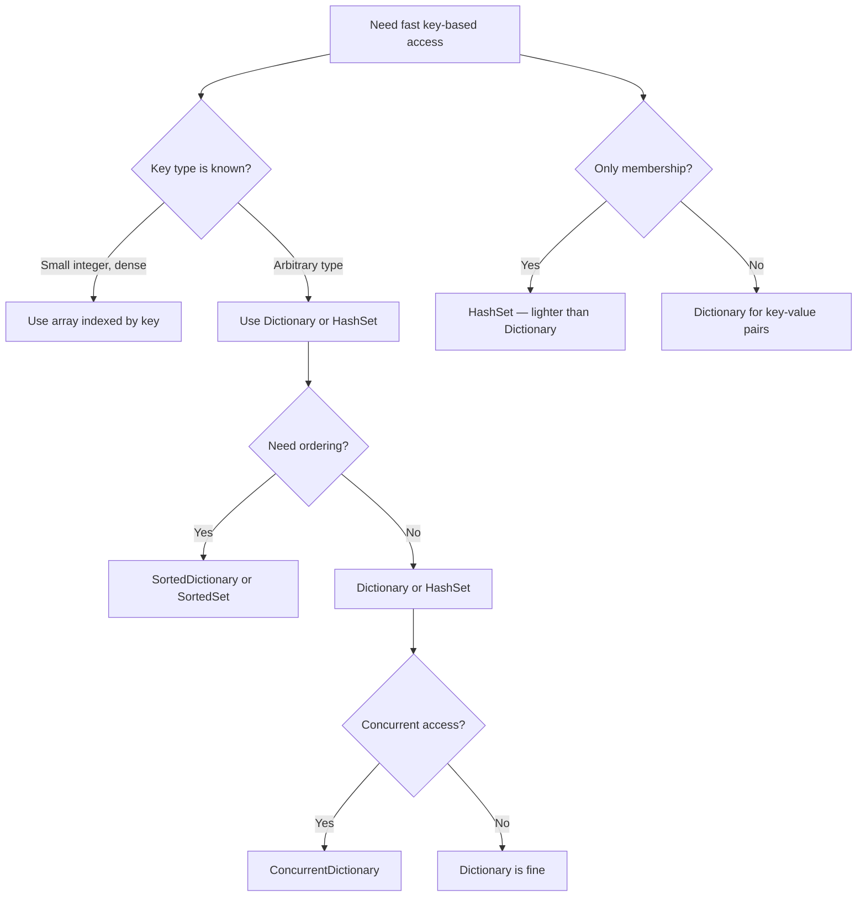

> [!success] Mastery Check
> - [ ] **Studied Well**
> - [ ] **Can explain the concept without notes**
> - [ ] **Can answer interview questions confidently**
> - [ ] **Can implement it in a real project**


## Navigation

**Domain:** [[5 — Data Structures & Algorithms]] > **Group:** Hash Maps and Sets
**Previous:** [[5.015 — Stack — LIFO Applications and Balanced Parentheses]] | **Next:** [[5.020 — Two-Sum Pattern and Generalizations]]

### Prerequisites
- [[5.001 — Big-O Notation and Complexity Analysis]] — amortized O(1) lookup requires understanding hash functions and collision resolution costs.
- [[5.004 — Arrays, Fixed, Dynamic, and In-Place Operations]] — hash maps are array-backed; resizing and index arithmetic are foundational.

### Where This Fits
Hash maps and hash sets are the most versatile data structures in interview problems and production code alike. They provide amortized O(1) insertion, deletion, and lookup by key — the closest we get to "magic" in algorithm design. Every problem that involves checking membership, counting frequencies, pairing elements, or grouping by a property immediately triggers consideration of a hash map or hash set. In senior interviews, the hash map is so fundamental that failing to use it when appropriate is a red flag, and using it unnecessarily (when a simple array or boolean flag would do) indicates over-engineering.

---

## Core Mental Model

A hash map stores key-value pairs in an array, using a hash function to map each key to an array index. The core insight is that the hash function converts an arbitrary key (string, object, compound) into a bounded integer index, giving near-O(1) access. Collisions — when two keys hash to the same index — are resolved either by chaining (storing multiple entries at the same index in a linked list or tree) or by open addressing (probing for the next empty slot). The performance of a hash map depends on the quality of the hash function (producing uniformly distributed hashes) and the load factor (ratio of entries to array size).

### Classification

Hash maps implement `IDictionary<TKey, TValue>` in .NET. Hash sets implement `ISet<T>`. `Dictionary<TKey, TValue>` uses open addressing (specifically, a variant of linear probing) in .NET Core/.NET 5+.

```mermaid
graph TD
    A[Hash Table] --> B[Hash Map / Dictionary]
    A --> C[Hash Set]
    B --> D[Key-Value pairs]
    B --> E["IDictionary<TKey,TValue>"]
    C --> F[Unique values only]
    C --> G["ISet<T>"]
    A --> H[Collision Resolution]
    H --> I[Chaining]
    H --> J[Open Addressing]
    I --> K[Linked list per bucket]
    I --> L[Tree for large buckets (Java 8+)]
    J --> M[Linear probing]
    J --> N[Quadratic probing]
    J --> O[Double hashing]
```

### Key Properties

|Property|Value|Derivation|
|---|---|---|
|Insert (average)|O(1) amortized|Hash function → index → store; resize inserts only on load factor exceeded|
|Lookup (average)|O(1)|Hash function → index → retrieve; key equality check at that slot|
|Delete (average)|O(1)|Hash function → index → mark as deleted|
|Insert (worst-case)|O(n)|All keys collide at the same index; chaining degenerates to linked list|
|Lookup (worst-case)|O(n)|Same — all keys in same bucket must be scanned|
|Space|O(n + capacity)|Array of slots + entries storage; load factor ~0.72 for .NET Dictionary|

---

## Deep Mechanics

### How It Works

**Hash function:** Takes a key and returns an integer hash code. In .NET, this is `key.GetHashCode()`. The hash code should be uniformly distributed across the int range. The index is computed as `hashCode & (bucketCount - 1)` when bucketCount is a power of two (the modulus via bitmask optimization).

**Collision resolution in .NET Dictionary (open addressing):** When two keys hash to the same slot, the Dictionary probes forward linearly (or with a specific offset pattern) to find the next available slot. Entries store their hash code and key, so lookups can verify the correct key at each probed position.

**Load factor and resizing:** When the number of entries exceeds `capacity * loadFactor`, the Dictionary resizes to the next prime larger than double the current capacity. All entries are rehashed into the new array. The .NET Dictionary uses a load factor of approximately 0.72 (internal constant).

**Hash collision in hash set:** `HashSet<T>` is essentially a `Dictionary<T, bool>` with only keys — the same collision resolution and resizing behavior applies.

### Complexity Derivation

**Time — Average case:** For a good hash function with uniform distribution, each key has an equal probability of mapping to any slot. The expected number of probes per lookup in open addressing is 1/(1-α) where α is the load factor. At α = 0.72, this is approximately 3.57 probes per lookup — still O(1) amortized.

**Time — Worst case:** A deliberately poor hash function (or adversarial input) that maps all keys to the same slot causes open addressing to chain through the entire table. For chaining, all entries degenerate into a single linked list — O(n) per operation. .NET protects against hash flooding (DoS via forced collisions) by randomizing the hash function per process with a seed.

**Space — Overhead:** The internal array has `capacity` slots, each storing only a hash code and entry index (for open addressing). The actual entries are stored in a separate entries array. This design minimizes memory overhead per slot.

### .NET Runtime Notes

- **`GetHashCode` contract:** Must return the same value for the same object's lifetime. If `Equals` returns true for two objects, they must have the same hash code. The reverse is not required. Override `GetHashCode` whenever you override `Equals`.
- **Default hash for value types:** `ValueType.GetHashCode()` uses reflection and is slow. Always override `GetHashCode` for custom structs used as dictionary keys.
- **`HashSet<T>` vs `Dictionary<TKey, TValue>`:** A `HashSet<T>` stores only keys, using about half the memory of a `Dictionary<T, bool>`. Use `HashSet<T>` when you only need membership testing.
- **Hash flooding protection:** .NET Core 2.1+ uses a randomized hash function per process (`string.GetHashCode()` returns different values on each process start) to prevent hash-flooding DoS attacks.
- **`ImmutableDictionary<TKey,TValue>`:** Provides a thread-safe, never-mutating dictionary. Useful for static lookup tables. Uses a balanced AVL tree internally.

---

## Implementation and Problem Patterns

### C# Implementation

```csharp
/// <summary>
/// Scratch implementation of a hash map with separate chaining.
/// Demonstrates the core mechanism — not production-ready.
/// </summary>
public class SimpleHashMap<TKey, TValue>
{
    private const int DefaultCapacity = 16;
    private const double LoadFactor = 0.75;

    private LinkedList<KeyValuePair<TKey, TValue>>[] _buckets;
    private int _count;

    public SimpleHashMap() : this(DefaultCapacity) { }

    public SimpleHashMap(int capacity)
    {
        _buckets = new LinkedList<KeyValuePair<TKey, TValue>>[capacity];
    }

    private int GetBucketIndex(TKey key)
    {
        int hash = key?.GetHashCode() ?? 0;
        return (hash & 0x7FFFFFFF) % _buckets.Length;
    }

    public void Add(TKey key, TValue value)
    {
        if (_count >= _buckets.Length * LoadFactor)
            Resize();

        int index = GetBucketIndex(key);
        _buckets[index] ??= new LinkedList<KeyValuePair<TKey, TValue>>();

        var list = _buckets[index];
        for (var node = list.First; node != null; node = node.Next)
        {
            if (EqualityComparer<TKey>.Default.Equals(node.Value.Key, key))
                throw new ArgumentException("Key already exists");
        }

        list.AddLast(new KeyValuePair<TKey, TValue>(key, value));
        _count++;
    }

    public bool TryGetValue(TKey key, out TValue value)
    {
        int index = GetBucketIndex(key);
        var list = _buckets[index];
        if (list != null)
        {
            foreach (var pair in list)
            {
                if (EqualityComparer<TKey>.Default.Equals(pair.Key, key))
                {
                    value = pair.Value;
                    return true;
                }
            }
        }
        value = default!;
        return false;
    }

    public bool Remove(TKey key)
    {
        int index = GetBucketIndex(key);
        var list = _buckets[index];
        if (list != null)
        {
            var node = list.First;
            while (node != null)
            {
                if (EqualityComparer<TKey>.Default.Equals(node.Value.Key, key))
                {
                    list.Remove(node);
                    _count--;
                    return true;
                }
                node = node.Next;
            }
        }
        return false;
    }

    private void Resize()
    {
        var oldBuckets = _buckets;
        _buckets = new LinkedList<KeyValuePair<TKey, TValue>>[oldBuckets.Length * 2];
        _count = 0;

        foreach (var bucket in oldBuckets)
        {
            if (bucket != null)
            {
                foreach (var pair in bucket)
                    Add(pair.Key, pair.Value);
            }
        }
    }
}

public static class HashMapProblems
{
    /// <summary>
    /// Two-Sum: find indices of two numbers that add to target.
    /// </summary>
    public static int[] TwoSum(int[] nums, int target)
    {
        var map = new Dictionary<int, int>();
        for (int i = 0; i < nums.Length; i++)
        {
            int complement = target - nums[i];
            if (map.TryGetValue(complement, out int index))
                return [index, i];
            map[nums[i]] = i;
        }
        return [-1, -1];
    }

    /// <summary>
    /// Contains Duplicate: check if any value appears at least twice.
    /// </summary>
    public static bool ContainsDuplicate(int[] nums)
    {
        var seen = new HashSet<int>();
        foreach (int num in nums)
        {
            if (!seen.Add(num)) return true;
        }
        return false;
    }

    /// <summary>
    /// Group Anagrams: group strings by their sorted character pattern.
    /// </summary>
    public static List<List<string>> GroupAnagrams(string[] strs)
    {
        var groups = new Dictionary<string, List<string>>();
        foreach (string s in strs)
        {
            char[] chars = s.ToCharArray();
            Array.Sort(chars);
            string key = new string(chars);
            if (!groups.ContainsKey(key))
                groups[key] = new List<string>();
            groups[key].Add(s);
        }
        return groups.Values.ToList();
    }

    /// <summary>
    /// First non-repeating character in a string.
    /// </summary>
    public static int FirstUniqChar(string s)
    {
        var freq = new Dictionary<char, int>();
        foreach (char c in s)
            freq[c] = freq.GetValueOrDefault(c) + 1;
        for (int i = 0; i < s.Length; i++)
            if (freq[s[i]] == 1) return i;
        return -1;
    }
}
```

### The .NET Idiomatic Version

```csharp
public static class HashMapIdiomatic
{
    // Use Dictionary<TKey, TValue> directly — it is production-optimized.
    // Use HashSet<T> for membership-only operations.

    // For concurrent access:
    //   ConcurrentDictionary<TKey, TValue> for multi-threaded writes
    //   ImmutableDictionary<TKey, TValue> for read-only fixed data

    // For ordering guarantees:
    //   SortedDictionary<TKey, TValue> — O(log n) operations, sorted by key
    //   SortedSet<T> — O(log n), sorted unique values

    // GetValueOrDefault pattern — simplifies frequency counting:
    public static Dictionary<char, int> BuildFrequency(string s)
    {
        var freq = new Dictionary<char, int>();
        foreach (char c in s)
            freq[c] = freq.GetValueOrDefault(c) + 1;
        return freq;
    }

    // TryAdd — atomic add-if-not-present (newer .NET API):
    public static bool AddUnique<TKey, TValue>(Dictionary<TKey, TValue> dict, TKey key, TValue value)
        => dict.TryAdd(key, value);
}
```

### Classic Problem Patterns

1. **Two-Sum and generalizations** — Find pairs that sum to a target, or K-sum problems. Key insight: store each element's value and index as you traverse; check if the complement exists in the map.
2. **Frequency counting** — Count occurrences of each element for mode analysis, anagram detection, or duplication checking. Key insight: one pass to build frequency, second pass to query.
3. **Grouping by a derived key** — Group anagrams by sorted string, group words by length, group by a hash of a property. Key insight: the hash map key is a normalization of the original data.

### Template / Skeleton

```csharp
// Frequency Counting Template
// When to use: need to count occurrences of elements (characters, words, integers)
// Time: O(n) | Space: O(k) where k = distinct elements

public static Dictionary<T, int> BuildFrequency<T>(IEnumerable<T> items)
    where T : notnull
{
    var freq = new Dictionary<T, int>();
    foreach (T item in items)
    {
        // TODO: may need conditional counting (skip nulls, only specific items)
        freq[item] = freq.GetValueOrDefault(item) + 1;
    }
    return freq;
}
```

---

## Gotchas and Edge Cases

### Forgetting to Override GetHashCode for Custom Keys

**Mistake:** Using a custom class as a dictionary key without overriding `GetHashCode` and `Equals`.

```csharp
// ❌ Wrong — default GetHashCode uses object reference; two "equal" objects won't match
class Person { public string Name; }
var map = new Dictionary<Person, int>();
map[new Person { Name = "Alice" }] = 1;
map[new Person { Name = "Alice" }] = 2; // Adds a new entry — key not recognized as duplicate
```

**Fix:** Override `GetHashCode` and `Equals` in the key class, or use a `record` (which does both automatically).

```csharp
// ✅ Correct — record provides structural equality
record Person(string Name);
// Or override manually:
class Person
{
    public string Name = "";
    public override bool Equals(object? obj) => obj is Person p && Name == p.Name;
    public override int GetHashCode() => Name.GetHashCode();
}
```

**Consequence:** Silent bug — dictionary contains duplicate entries for "equal" objects. Two objects with the same field values are treated as different keys.

### Mutable Keys

**Mistake:** Modifying a key object after it has been inserted into a dictionary.

```csharp
// ❌ Wrong — modifying a key after insertion breaks the hash table
var key = new List<int> { 1, 2, 3 };
var dict = new Dictionary<List<int>, string>();
dict[key] = "value";
key.Add(4); // Mutates the key — hash code changes!
dict.TryGetValue(key, out _); // May not find the entry
```

**Fix:** Use immutable types as dictionary keys (string, int, record, Tuple, or custom immutable types).

```csharp
// ✅ Correct — use immutable key types
var key = "prefix_suffix";
```

**Consequence:** Dictionary entries become inaccessible because the hash code used at insertion time no longer matches the current hash code. The entry is orphaned until the dictionary is rebuilt.

### Capacity Pre-Sizing to Avoid Resize Spikes

**Mistake:** Adding many entries to a dictionary without pre-sizing, causing repeated resizes.

```csharp
// ❌ Wrong — starts at default capacity, resizes multiple times for 100K entries
var dict = new Dictionary<int, string>();
for (int i = 0; i < 100_000; i++) dict[i] = i.ToString();
```

**Fix:** Specify the expected capacity in the constructor to avoid resizes.

```csharp
// ✅ Correct — pre-size to avoid resizes
var dict = new Dictionary<int, string>(100_000);
for (int i = 0; i < 100_000; i++) dict[i] = i.ToString();
```

**Consequence:** Multiple O(n) resize operations and rehashing of all entries, increasing both CPU time and memory allocation spikes.

### Null Keys in Dictionary

**Mistake:** Assuming Dictionary supports null keys.

```csharp
// ❌ Wrong — throws ArgumentNullException
var dict = new Dictionary<string, int>();
dict[null] = 1; // ArgumentNullException
```

**Fix:** Use a sentinel value or handle null separately.

```csharp
// ✅ Correct — handle null as a special case, or use a nullable-aware pattern
if (key == null) { /* handle separately */ }
```

**Consequence:** `ArgumentNullException` at runtime. In an interview, this appears careless.

---

## Complexity Analysis and Benchmarks

### Operation Complexity Table

|Operation|Time (Best)|Time (Average)|Time (Worst)|Space|Notes|
|---|---|---|---|---|---|
|Insert|O(1)|O(1) amortized|O(n)|O(n) resize|Worst case: all keys collide or resize triggers rehash|
|Lookup|O(1)|O(1)|O(n)|O(1)|Worst case: scan through all colliding keys|
|Delete|O(1)|O(1)|O(n)|O(1)|Same collision concern|
|ContainsKey|O(1)|O(1)|O(n)|O(1)|Same as lookup|
|Resize|O(n)|O(n)|O(n)|O(n)|Copy all entries to new array and rehash|

**Derivation for the non-obvious entries:** The worst-case O(n) occurs when the hash function maps all keys to the same bucket. With open addressing in .NET, this means probing through a long chain of occupied slots to find the target or an empty slot. With a proper hash function and load factor, the probability of this is astronomically low for non-adversarial inputs.

### Comparison with Alternatives

|Structure / Algorithm|Time|Space|Best When|
|---|---|---|---|
|Dictionary<TKey,TValue>|O(1) avg|O(n)|Unordered key-value storage|
|SortedDictionary<TKey,TValue>|O(log n)|O(n)|Need keys in sorted order|
|List<(TKey, TValue)>|O(n)|O(n)|Small n (≤ 100), no hash overhead|
|Array index by key (int)|O(1)|O(maxKey)|Key is a small integer, dense range|

### BenchmarkDotNet

```csharp
[MemoryDiagnoser]
[SimpleJob(RuntimeMoniker.Net90)]
public class HashMapBenchmark
{
    [Params(100, 1_000, 10_000)]
    public int N { get; set; }

    private int[] _data = null!;

    [GlobalSetup]
    public void Setup()
    {
        var rng = new Random(42);
        _data = new int[N];
        for (int i = 0; i < N; i++)
            _data[i] = rng.Next(N);
    }

    [Benchmark(Baseline = true)]
    public bool ContainsDuplicateHashSet()
    {
        var seen = new HashSet<int>();
        foreach (int num in _data)
            if (!seen.Add(num)) return true;
        return false;
    }

    [Benchmark]
    public bool ContainsDuplicateBruteForce()
    {
        for (int i = 0; i < _data.Length; i++)
            for (int j = i + 1; j < _data.Length; j++)
                if (_data[i] == _data[j]) return true;
        return false;
    }

    [Benchmark]
    public bool ContainsDuplicateSortFirst()
    {
        var sorted = (int[])_data.Clone();
        Array.Sort(sorted);
        for (int i = 1; i < sorted.Length; i++)
            if (sorted[i] == sorted[i - 1]) return true;
        return false;
    }
}
```

**Expected results (approximate, .NET 9, x64):**

|Method|N|Mean|Allocated|
|---|---|---|---|
|ContainsDuplicateHashSet|100|~400 ns|~2 KB|
|ContainsDuplicateHashSet|1,000|~4 μs|~16 KB|
|ContainsDuplicateHashSet|10,000|~40 μs|~160 KB|
|ContainsDuplicateBruteForce|100|~3 μs|0 B|
|ContainsDuplicateBruteForce|1,000|~300 μs|0 B|
|ContainsDuplicateBruteForce|10,000|~30 ms|0 B|
|ContainsDuplicateSortFirst|100|~600 ns|~1 KB|
|ContainsDuplicateSortFirst|1,000|~8 μs|~8 KB|
|ContainsDuplicateSortFirst|10,000|~80 μs|~80 KB|

**Interpretation:** The hash set is consistently the fastest across all sizes. The brute force is competitive at N=100 but becomes unusable at N=10,000 (30 ms vs 40 μs). The sort-first approach is a middle ground — no hash overhead but O(n log n) sort cost.

---

## Interview Arsenal

### Question Bank

1. [Definition] What is a hash map and what problem does it solve?
2. [Complexity] Derive the amortized O(1) average case for hash map operations.
3. [Implementation] Implement a hash map with separate chaining from scratch.
4. [Recognition] Given a problem, when would you choose a hash map vs. a hash set vs. a sorted dictionary?
5. [Comparison] Compare .NET Dictionary's open addressing with Java HashMap's chaining.
6. [Trick] What happens when you modify a key after inserting it into a Dictionary?
7. [System Design] How would you design a distributed hash table for a caching layer?
8. [Optimization] How would you optimize a Dictionary for use in a hot loop with thousands of lookups per microsecond?

### Spoken Answers

**Q: Derive the amortized O(1) average case for hash map operations.**

> **Average answer:** The hash function maps keys to indices, so lookups are O(1) directly.

> **Great answer:** The hash map's O(1) average case depends on two assumptions: a uniformly distributed hash function and a bounded load factor. Given a hash function that distributes keys uniformly, each key maps to any slot with equal probability 1/m where m is the number of buckets. With a load factor α = n/m (where n is the number of entries), the expected number of collisions per insertion is approximately α / (1-α) for open addressing. Resizing when α exceeds a threshold (e.g., 0.72 for .NET Dictionary) ensures α stays bounded. The amortized argument: across n insertions, each entry is rehashed at most O(log n) times (because capacity doubles each resize), and each rehash touches O(1) expected buckets. The total expected cost across n insertions is O(n), giving O(1) amortized expected per operation. I should note that this is an *average-case* guarantee, not a worst-case one — adversarial input causing all keys to collide gives O(n) per operation, which is why .NET randomizes hash functions per process.

**Q: Compare .NET Dictionary's open addressing with Java HashMap's chaining.**

> **Average answer:** .NET uses open addressing and Java uses chaining.

> **Great answer:** In .NET Core/.NET 5+, `Dictionary<TKey, TValue>` uses a form of open addressing (specifically a variation of linear probing). This stores all entries in a single contiguous array, which improves cache locality — a significant advantage on modern hardware. The downside is that deletion requires special handling (tombstone markers) to avoid breaking probe chains. Java's `HashMap` uses separate chaining: each bucket stores a linked list or tree (after a threshold) of colliding entries. Chaining handles deletions naturally (remove from linked list) but has worse cache locality because entries are heap-allocated independently. A practical difference: .NET Dictionary is more memory-efficient (no per-entry Node object overhead) and faster on lookups due to cache behavior, but Java's HashMap handles high load factors better because chains can grow without rehashing everything. From an interview perspective, either is acceptable — the key insight is that both achieve amortized O(1) but make different tradeoffs in memory layout and worst-case behavior.

**Q: [Trick] What happens when you modify a key after inserting it into a Dictionary?**

> **Average answer:** It doesn't matter because the dictionary stores the key as-is.

> **Great answer:** If a key object is mutable and its hash code depends on the mutated fields, the dictionary will silently break. When you insert the entry, the dictionary computes the bucket index from `key.GetHashCode()`. If you then modify the key such that its hash code changes, the entry lives in a bucket determined by the *old* hash code. Any subsequent lookup with the modified key will compute a *new* bucket index and never find the entry — the entry is effectively orphaned. This can cause memory leaks (the entry lives in the dictionary but is unreachable) and correctness bugs (the lookup returns false when the key should exist). The fix is to use immutable key types (string, int, records) or ensure key objects are never modified after insertion. The .NET documentation explicitly warns against this.

### Trick Question

**"What is the time complexity of `dict[key] = value` where key does not exist?"**

Why it is a trap: The candidate might say O(1) without qualification. The correct answer distinguishes average case from worst case, and notes that if the indexer is used as a setter for a non-existent key, it inserts a new entry — potentially triggering a resize.

Correct answer: O(1) amortized average case. O(n) worst case if the dictionary needs to resize (triggered by load factor) or if hash collisions degenerate. The indexer setter for a non-existent key calls `Insert`, which checks load factor and resizes if needed, then probes for an open slot. The resize is O(n) and happens infrequently.

### Pattern Recognition Table

|If the problem has...|Then consider...|Because...|
|---|---|---|
|Check if an element exists in a collection|HashSet<T>|O(1) membership testing|
|Count occurrences of each element|Dictionary<T, int>|Build frequency map in O(n)|
|Find a pair summing to target|Dictionary complement map|Store seen values, check for target - current|
|Group elements by a property|Dictionary of lists|Hash on the property value|
|Remove duplicates|HashSet<T>|Only unique values survive insertion|

---

## Decision Framework

### When to Apply



### Recognition Checklist

Indicators that a hash map or hash set is the right choice:

- [ ] Problem involves membership testing ("does this exist?")
- [ ] Problem involves counting frequencies
- [ ] Problem involves grouping by a derived key
- [ ] Need to pair elements (Two-Sum, complements)
- [ ] Need to eliminate duplicates

Counter-indicators — do NOT apply here:

- [ ] Input is very small (n ≤ 10) — the hash overhead is not justified
- [ ] Keys are a small, dense set of integers — a simple array is faster
- [ ] Need ordered access — SortedDictionary or SortedSet instead

### Tradeoff Summary

|What You Gain|What You Give Up|
|---|---|
|O(1) average-case lookup/insert/delete|No ordering guarantees|
|Flexible key types|Memory overhead for hash table structure|
|Dynamic resizing|Resize spikes (amortized away)|

---

## Self-Check

### Conceptual Questions

1. What is the core mechanism that gives hash maps O(1) average-case access?
2. Derive why inserting n items into a hash map is O(n) total even though individual inserts may trigger O(n) resizes.
3. Recognizing from a problem: given two strings, decide if they are anagrams.
4. When would you choose a HashSet over a Dictionary?
5. What specific edge case causes hash map performance to degrade to O(n)?
6. What .NET method provides the hash code for a key, and what contract must it satisfy?
7. What invariant must hold about a key object during its lifetime in a dictionary?
8. How does the answer change if the problem asks for "first non-repeating character" vs "first duplicate"?
9. In a production system, why might you pre-size a Dictionary's capacity?
10. What is the trap question about using a custom class as a dictionary key?

<details>
<summary>Answers</summary>

1. A hash function maps arbitrary keys to bounded integer indices. With a uniform hash function and a bounded load factor, the expected number of keys per bucket is O(1), giving O(1) average access.
2. Total resize cost across n inserts is the geometric series of copy operations: each entry is copied a logarithmic number of times (when its bucket doubles). Summing across n entries: O(n). Total n inserts + n copies = O(2n) = O(n), amortized O(1) per insert.
3. Use frequency counting: count characters from the first string in a Dictionary, decrement counts for the second string. If all counts are zero at the end, they are anagrams. O(n) time, O(k) space.
4. When you only need membership testing (add/remove/contains), a HashSet is lighter and communicates intent better. A Dictionary should store associated values.
5. All keys hash to the same bucket, either due to a poor hash function (e.g., all keys have the same GetHashCode return value) or deliberate hash-flooding attack.
6. `GetHashCode()` must return the same value for the same object for its lifetime. If two objects are equal per `Equals`, they must have the same hash code. The reverse is not required.
7. The key must not be mutated while it is in the dictionary. Mutating a key changes its hash code, making the entry unreachable.
8. First non-repeating requires a frequency map (Dictionary) plus a second pass. First duplicate can use a HashSet in a single pass — once Add returns false, the duplicate is found.
9. Pre-sizing avoids multiple resize operations. If the final size is known (e.g., loading 100K records from a database), pre-sizing eliminates O(n) resizes and reduces GC pressure.
10. The trap is using a mutable class without overriding `GetHashCode` and `Equals`. The default `GetHashCode` uses reference identity, so two objects with identical field values are treated as different keys.

</details>

---

### Coding Challenges

**Challenge 1 — Implement from scratch**

Implement a HashSet (unique value storage) using a boolean array. Support `Add`, `Remove`, and `Contains`. Only works for non-negative integers in a known range.

```csharp
public class IntHashSet
{
    private readonly bool[] _buckets;

    public IntHashSet(int maxValue)
    {
        _buckets = new bool[maxValue + 1];
    }

    public void Add(int value)
    {
        // Your implementation here
    }

    public bool Remove(int value)
    {
        // Your implementation here
    }

    public bool Contains(int value)
    {
        // Your implementation here
    }
}
```

<details> <summary>Solution</summary>

```csharp
public class IntHashSet
{
    private readonly bool[] _buckets;

    public IntHashSet(int maxValue)
    {
        _buckets = new bool[maxValue + 1];
    }

    public void Add(int value)
    {
        if (value >= 0 && value < _buckets.Length)
            _buckets[value] = true;
    }

    public bool Remove(int value)
    {
        if (value >= 0 && value < _buckets.Length)
        {
            bool existed = _buckets[value];
            _buckets[value] = false;
            return existed;
        }
        return false;
    }

    public bool Contains(int value)
    {
        return value >= 0 && value < _buckets.Length && _buckets[value];
    }
}
```

**Complexity:** Time O(1) for all operations | Space O(maxValue) **Key insight:** This is a "perfect hash" — the index IS the key. Useful when the value domain is a small, known range. Not a general-purpose solution.

</details>

---

**Challenge 2 — Trace the execution**

Given `nums = [2, 7, 11, 15]` and `target = 9`, trace the Two-Sum hash map algorithm.

<details> <summary>Solution</summary>

Initial: map = {}

Step 1: i=0, nums[0]=2, complement=9-2=7 → 7 not in map → map[2]=0
Step 2: i=1, nums[1]=7, complement=9-7=2 → 2 IS in map at index 0 → return [0, 1]

**Why:** The hash map stores each value with its index. When the complement is found, the pair is returned. Only two iterations needed — O(n) in worst case, O(1) in this case.

</details>

---

**Challenge 3 — Fix the bug**

```csharp
// This implementation has a bug that fails on specific input types
public static int FirstUniqChar(string s)
{
    var freq = new Dictionary<char, int>();
    foreach (char c in s)
        freq[c]++;  // BUG: throws KeyNotFoundException on first occurrence
    for (int i = 0; i < s.Length; i++)
        if (freq[s[i]] == 1) return i;
    return -1;
}
```

<details> <summary>Solution</summary>

**Bug:** `freq[c]++` assumes the key already exists. On the first occurrence of each character, the key is not in the dictionary, and `freq[c]` tries to get (which throws) rather than add.

**Fix:**

```csharp
public static int FirstUniqChar(string s)
{
    var freq = new Dictionary<char, int>();
    foreach (char c in s)
    {
        if (freq.ContainsKey(c))
            freq[c]++;
        else
            freq[c] = 1;
    }
    // Or using GetValueOrDefault:
    // freq[c] = freq.GetValueOrDefault(c) + 1;
    for (int i = 0; i < s.Length; i++)
        if (freq[s[i]] == 1) return i;
    return -1;
}
```

**Test case that exposes it:** `s = "leetcode"` → expected `0`, actual `KeyNotFoundException` at first character.

</details>

---

**Challenge 4 — Recognize and apply**

**Problem:** Given an array of integers, find the length of the longest consecutive sequence of elements (e.g., `[100, 4, 200, 1, 3, 2]` → length 4 for `[1, 2, 3, 4]`). Solve in O(n) time.

<details> <summary>Solution</summary>

**Pattern:** Use a HashSet for O(1) membership. Iterate through each element, but only start counting from elements that are the start of a sequence (no left neighbor).

```csharp
public static int LongestConsecutive(int[] nums)
{
    var set = new HashSet<int>(nums);
    int longest = 0;
    foreach (int num in set)
    {
        if (!set.Contains(num - 1))
        {
            int current = num;
            int length = 1;
            while (set.Contains(current + 1))
            {
                current++;
                length++;
            }
            longest = Math.Max(longest, length);
        }
    }
    return longest;
}
```

**Complexity:** Time O(n) | Space O(n) **Key insight:** By only counting from sequence starts, each element is visited at most twice (once in the outer loop, once in a while loop) — O(n) total.

</details>

---

**Challenge 5 — Optimize**

```csharp
// This solution is correct but uses O(n) space
// Optimize if possible — what is the space requirement for this group anagram problem?
public static List<List<string>> GroupAnagrams(string[] strs)
{
    var groups = new Dictionary<string, List<string>>();
    foreach (string s in strs)
    {
        char[] chars = s.ToCharArray();
        Array.Sort(chars);
        string key = new string(chars);
        if (!groups.ContainsKey(key))
            groups[key] = new List<string>();
        groups[key].Add(s);
    }
    return groups.Values.ToList();
}
```

<details> <summary>Solution</summary>

**Insight:** The sorting approach is O(k log k) per string where k is string length. For strings with a fixed alphabet (lowercase letters), we can use a frequency-count-based key to avoid sorting.

```csharp
public static List<List<string>> GroupAnagrams(string[] strs)
{
    var groups = new Dictionary<string, List<string>>();
    foreach (string s in strs)
    {
        int[] count = new int[26];
        foreach (char c in s) count[c - 'a']++;
        // Build key from frequency array (delimiter-separated to avoid collisions)
        var keyParts = new System.Text.StringBuilder();
        foreach (int c in count) keyParts.Append(c).Append('#');
        string key = keyParts.ToString();

        if (!groups.ContainsKey(key))
            groups[key] = new List<string>();
        groups[key].Add(s);
    }
    return groups.Values.ToList();
}
```

**Complexity:** Time O(n × k) where k = max string length | Space O(n × k) **Key insight:** The frequency key avoids sorting but creates longer keys. The tradeoff is O(k) per string (vs. O(k log k) for sorting), which is better when strings are long but has a worse constant for short strings.

</details>
