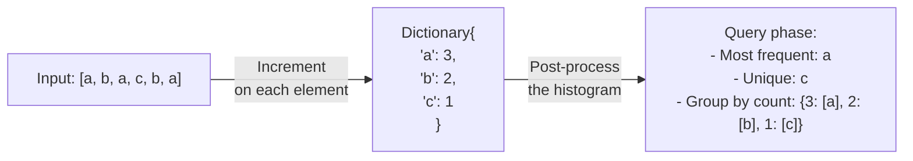
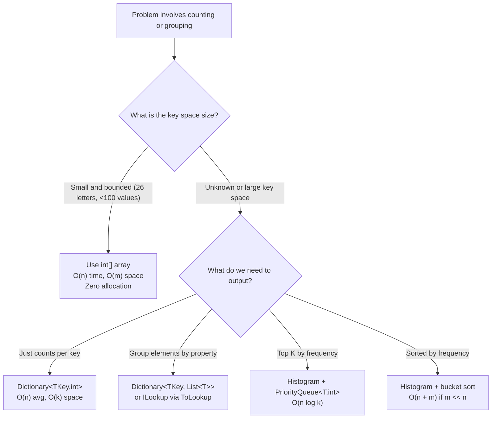

> [!success] Mastery Check
> - [ ] **Studied Well**
> - [ ] **Can explain the concept without notes**
> - [ ] **Can answer interview questions confidently**
> - [ ] **Can implement it in a real project**


## Navigation

**Domain:** [[5 — Data Structures & Algorithms]] > **Group:** Hash Maps and Sets
**Previous:** [[5.020 — Two-Sum Pattern and Generalizations]] | **Next:** [[5.022 — Sliding Window with Hash Map]]

### Prerequisites
- [[5.019 — Hash Maps and Hash Sets — Design and Collision Handling]] — frequency counting relies on the hash map's O(1) amortized insert and lookup to build frequency tables in linear time.
- [[5.007 — Prefix Sums]] — cumulative frequency tracking (prefix sum) is frequency counting over a numeric range; the two patterns meet in subarray sum problems.

### Where This Fits
Frequency counting is the second-most-common hash map pattern after Two-Sum. It appears whenever a problem asks about element occurrences, duplicates, anagrams, or grouping by some property. It is the backbone of "top K" problems (combined with a heap), anagram detection, plagiarism detection, and any scenario requiring a histogram. In system design, frequency counting powers rate limiters, trending topics, and word count pipelines. It is non-negotiable for a senior interview because it combines with almost every other pattern — sliding window, sorting, heap, prefix sum — and the interviewer will expect you to reach for a `Dictionary<TKey,int>` instinctively.

---

## Core Mental Model

Frequency counting treats the hash map as a histogram: traverse the input once, increment a counter for each distinct element, then query the histogram to answer the question. The core invariant is that after a single pass, the map contains **every unique key and its exact multiplicity** — no sorting, no nested loops, no precomputed bounds. This works because hash maps provide O(1) key lookup, making the "check if seen before" operation effectively free compared to scanning an array.

### Classification

- **Paradigm:** Enumeration with aggregation — a direct application of the hash map's insert-and-lookup contract.
- **Family:** Map-Reduce — the map phase builds counts, the reduce phase reads them.
- **Distinction from alternatives:** A sorted array of tuples (`(count, element)`) requires O(n log n) to build and cannot update incrementally. A `Dictionary<TKey,int>` builds in O(n) average and handles streaming input. A `List<T>` with linear scan costs O(n²). A `HashSet<T>` tracks existence but not multiplicity.
- **Contract:** `Dictionary<TKey,TValue>` implements `IDictionary<TKey,TValue>` and satisfies the amortized O(1) contract when hash codes are well-distributed.



### Key Properties

|Operation|Value|Derivation|
|---|---|---|
|Insert / increment|O(1) amortized|Hash map insert is O(1) on average; each element visited exactly once in the build phase|
|Lookup count of key|O(1) amortized|Hash map lookup by key is O(1); no iteration needed|
|Build histogram (n items)|O(n) average|Each item triggers one hash map insert or update — O(1) per item × n items|
|Group by count|O(n)|After the histogram is built, iterate all entries and bucket by value — one pass over k ≤ n entries|
|Find max frequency|O(k) where k = distinct keys|Iterate all dictionary entries; each entry checked once|
|Space|O(k) where k = distinct keys|Dictionary stores one entry per unique key; no per-element overhead beyond the key-value pair|

---

## Deep Mechanics

### How It Works

The frequency counting pattern has two phases:

**Phase 1 — Build the histogram.** Iterate the input exactly once. For each element:
1. Try to look it up in the dictionary (`TryGetValue`).
2. If not present, insert it with count = 1.
3. If present, increment the stored value.

This phase is O(n) because each dictionary operation is O(1) amortized.

**Phase 2 — Query the histogram.** Depending on the problem, read the histogram to find:
- The element(s) with maximum / minimum count (linear scan over entries).
- All elements whose count meets a threshold (filter).
- Elements grouped by their count (bucket sort — array of lists indexed by count).
- Whether a specific count exists for any element.

**Example trace — Group Anagrams:**

Input: `["eat", "tea", "tan", "ate", "nat", "bat"]`

Step 1 (Phase 1): For each word, compute its sorted signature:
- "eat" → sorted = "aet" → dict: `{"aet": ["eat"]}`
- "tea" → sorted = "aet" → dict: `{"aet": ["eat", "tea"]}`
- "tan" → sorted = "ant" → dict: `{"aet": ["eat", "tea"], "ant": ["tan"]}`
- "ate" → sorted = "aet" → dict: `{"aet": ["eat", "tea", "ate"], "ant": ["tan"]}`
- "nat" → sorted = "ant" → dict: `{"aet": ["eat", "tea", "ate"], "ant": ["tan", "nat"]}`
- "bat" → sorted = "abt" → dict: `{"aet": ["eat", "tea", "ate"], "ant": ["tan", "nat"], "abt": ["bat"]}`

Step 2 (Phase 2): Return all dictionary values as the grouped result.

### Complexity Derivation

**Time (Group Anagrams):**
- For each of n words of length L: sort the word — O(L log L). The dictionary insert is O(1). Total: O(n × L log L).
- The grouping by signature is O(n) because we iterate once.
- Final: O(n × L log L) dominated by sorting, O(n) for grouping.

**Time (Top K Frequent Elements — count + heap):**
- Build histogram: O(n) — one pass over n elements.
- Insert into min-heap of size k: each insert is O(log k). At most k entries: O(n log k).
- Total: O(n log k). For k << n this approaches O(n).

**Space:**
- Dictionary: O(k) where k = number of distinct keys.
- In the worst case all elements are distinct: k = n → O(n) space.
- In the best case all elements are the same: k = 1 → O(1) space.

### .NET Runtime Notes

- **Dictionary<TKey,int>** is the idiomatic frequency table in .NET. Its internal implementation uses open addressing with separate chaining for collision resolution. `TryGetValue` is the preferred method for updates because it saves one lookup compared to `ContainsKey` + indexer.
- **ConcurrentDictionary<TKey,int>** provides thread-safe frequency counting via `AddOrUpdate` for concurrent scenarios (e.g., PLINQ aggregates, producer-consumer histograms).
- **ILookup<TKey,TElement>** (from LINQ's `ToLookup`) implements grouping natively. It is a one-to-many map — each key maps to a sequence of elements. `GroupBy` uses deferred execution; `ToLookup` materializes immediately.
- **LINQ's `GroupBy`** does not build a simple frequency histogram — it groups elements, not counts. If you need counts, use `.GroupBy(...).ToDictionary(g => g.Key, g => g.Count())`.
- **GC pressure:** Inserting n distinct items allocates n `KeyValuePair<TKey,TValue>` structs plus the dictionary's internal arrays. This can pressure Gen 0 GC in hot loops. For counting known-small alphabets (e.g., 26 lowercase letters), prefer an array of size 26 over a dictionary — zero allocations, better cache locality.

---

## Implementation and Problem Patterns

### C# Implementation

```csharp
/// <summary>
/// Builds a frequency histogram from any IEnumerable{T}.
/// </summary>
public static Dictionary<T, int> BuildHistogram<T>(IEnumerable<T> source)
    where T : notnull
{
    var freq = new Dictionary<T, int>();
    foreach (var item in source)
    {
        // Increment or initialize to 1
        freq.TryGetValue(item, out int count);
        freq[item] = count + 1;
    }
    return freq;
}

/// <summary>
/// Groups elements by a key selector — returns ILookup for one-to-many mapping.
/// </summary>
public static ILookup<TKey, TElement> GroupByKey<TElement, TKey>(
    IEnumerable<TElement> source,
    Func<TElement, TKey> keySelector)
    where TKey : notnull
{
    return source.ToLookup(keySelector);
}

/// <summary>
/// Finds the element with the highest frequency. Returns default(T) if empty.
/// Ties broken by first encountered.
/// </summary>
public static T? FindMostFrequent<T>(IEnumerable<T> source) where T : notnull
{
    var freq = BuildHistogram(source);
    T? best = default;
    int maxCount = 0;
    foreach (var (key, count) in freq)
    {
        if (count > maxCount)
        {
            maxCount = count;
            best = key;
        }
    }
    return best;
}

/// <summary>
/// Returns elements whose frequency meets or exceeds a threshold.
/// </summary>
public static List<T> FilterByMinFrequency<T>(IEnumerable<T> source, int minCount)
    where T : notnull
{
    var freq = BuildHistogram(source);
    var result = new List<T>();
    foreach (var (key, count) in freq)
    {
        if (count >= minCount)
            result.Add(key);
    }
    return result;
}
```

### The .NET Idiomatic Version

For quick one-off counting, LINQ with `GroupBy` + `ToDictionary` is concise:

```csharp
// Build frequency dictionary with LINQ
var freq = items
    .GroupBy(x => x)
    .ToDictionary(g => g.Key, g => g.Count());

// Group by key (e.g., anagram signature)
var groups = words
    .GroupBy(w => string.Concat(w.OrderBy(c => c)))
    .ToDictionary(g => g.Key, g => g.ToList());

// Top K frequent — O(n log k) with PriorityQueue
var topK = freq
    .OrderByDescending(kvp => kvp.Value)
    .Take(k)
    .Select(kvp => kvp.Key)
    .ToList();
```

**When to use LINQ vs. explicit dictionary:** Use LINQ for simple, one-off histograms where readability matters more than performance. Use explicit `Dictionary<T,int>` + `TryGetValue` when counting in hot loops, processing streaming data, or when you need early exit (e.g., "stop if any count exceeds threshold").

### Classic Problem Patterns

1. **Anagram detection (Valid Anagram)** — Two strings are anagrams iff their character frequency maps are identical. If strings can be sorted, compare sorted versions; if not (streaming), build and compare two dictionaries. Key insight: anagrams have identical histograms.

2. **Grouping by transformed key (Group Anagrams)** — Group strings by their sorted character signature. The sorted signature is the canonical form — any two strings that are anagrams produce the same sorted form. Key insight: the hash map key is a *transformation* of the input, not the input itself.

3. **Top K Frequent Elements** — Build a histogram, then use a min-heap (or `PriorityQueue<TElement,TPriority>`) of size k to track the k highest-frequency elements. Key insight: you do not need to sort all n elements — the heap drops the lowest-frequency element at each step, keeping only the top k.

4. **Sort by frequency (Sort Characters By Frequency)** — Build a histogram, then bucket-sort by count (array of lists indexed by frequency) or use a max-heap. Key insight: the frequency range is bounded by n, so bucket sort gives O(n).

5. **First unique character** — Two-pass: build histogram (first pass), then scan input and return the first element whose count is 1 (second pass). Key insight: the dictionary preserves insertion order of keys in .NET (`Dictionary<TKey,TValue>` maintains insertion order until a deletion), so you can use a second pass over the original input instead of iterating dictionary entries.

6. **Subarray sum equals K (via prefix frequency)** — Track running prefix sum and count how many times each prefix sum has occurred. The count of `prefix - k` gives the number of subarrays ending at the current position that sum to k. Key insight: this is frequency counting over prefix sums, not raw elements.

### Template / Skeleton

```csharp
// Frequency Counting Template
// When to use: "count occurrences of X" or "group by some property"
// Time: O(n) | Space: O(k) where k = distinct keys

public static Dictionary<TKey, int> BuildFrequency<TKey>(
    IEnumerable<TKey> items)
    where TKey : notnull
{
    var freq = new Dictionary<TKey, int>();
    foreach (var item in items)
    {
        // TODO: define the key — could be the element itself or a transform
        // TKey key = GetKey(item);  // e.g., sorted string, hash, normalized form

        freq.TryGetValue(item, out int count);
        freq[item] = count + 1;
    }
    return freq;
}

// Grouping Template
// When to use: "group items that share a property"
// Time: O(n * cost_of_key_computation) | Space: O(n)

public static Dictionary<TKey, List<TItem>> GroupByKey<TItem, TKey>(
    IEnumerable<TItem> items,
    Func<TItem, TKey> keySelector)
    where TKey : notnull
{
    var groups = new Dictionary<TKey, List<TItem>>();
    foreach (var item in items)
    {
        TKey key = keySelector(item);
        if (!groups.TryGetValue(key, out var list))
        {
            list = new List<TItem>();
            groups[key] = list;
        }
        list.Add(item);
    }
    return groups;
}

// Top K Frequent Template
// When to use: "find the k most/least frequent elements"
// Time: O(n log k) | Space: O(n)

public static List<T> TopKFrequent<T>(IEnumerable<T> items, int k)
    where T : notnull
{
    // 1. Build histogram
    var freq = BuildFrequency(items);

    // 2. Use min-heap to keep top k
    var heap = new PriorityQueue<T, int>();  // min-heap by frequency
    foreach (var (element, count) in freq)
    {
        heap.Enqueue(element, count);
        if (heap.Count > k)
            heap.Dequeue();  // drop the smallest frequency
    }

    // 3. Extract results (reversed because min-heap pops smallest first)
    var result = new List<T>(k);
    while (heap.Count > 0)
        result.Add(heap.Dequeue());
    result.Reverse();
    return result;
}
```

---

## Gotchas and Edge Cases

### Duplicate elements when grouping

**Mistake:** Assuming each element maps to exactly one group entry, then overwriting instead of appending.

```csharp
// ❌ Wrong — overwrites previous group
groups[key] = new List<TItem> { item };
```

**Fix:** Check if the key exists first; if it does, append to the existing list.

```csharp
// ✅ Correct — append to existing group or create new one
if (!groups.TryGetValue(key, out var list))
{
    list = new List<TItem>();
    groups[key] = list;
}
list.Add(item);
```

**Consequence:** Silent data loss — only the last element per group survives.

### Counting with mutable keys

**Mistake:** Using a mutable type (e.g., `List<int>`, `StringBuilder`) as a dictionary key, then mutating it after insertion.

```csharp
// ❌ Wrong — key is mutable
var key = new List<int> { 1, 2, 3 };
dict[key] = 5;
key.Add(4);  // hash code changes; dict is now corrupted
```

**Fix:** Use immutable keys, or compute a hashable representation (sorted string, tuple, or record struct).

```csharp
// ✅ Correct — immutable representation as key
var key = string.Join(",", items.OrderBy(x => x));
```

**Consequence:** Dictionary lookups silently fail, returning wrong counts or throwing `KeyNotFoundException`. This is a C#-specific trap — in languages without struct semantics, mutable key types are a common interview mistake.

### Integer overflow on frequency counter

**Mistake:** Using an `int` counter for inputs that may exceed `int.MaxValue` (unlikely in interviews but possible in system design — think word counts across a corpus).

```csharp
// ❌ Wrong — unchecked addition overflows silently
freq[key] = freq[key] + 1;  // wraps to negative at 2^31
```

**Fix:** Use `long` for counters or enable checked arithmetic where overflow is possible.

```csharp
// ✅ Correct — use long for large counts, or check bounds
freq[key] = freq.TryGetValue(key, out long count) ? count + 1 : 1;
```

**Consequence:** Silent corruption — negative counts lead to broken heap comparisons (in Top K), wrong grouping decisions, or infinite loops.

### The "non-distinct keys are rare" assumption

**Mistake:** Assuming the number of distinct keys k is small, then using a dictionary when an array would be faster and allocation-free.

```csharp
// ❌ Wrong — dictionary overhead for known-small alphabet
var freq = new Dictionary<char, int>();
foreach (char c in text) freq[c] = freq.GetValueOrDefault(c) + 1;
```

**Fix:** Use a fixed-size array when the key space is small and bounded (lowercase letters, ASCII, digits).

```csharp
// ✅ Correct — array for lowercase English letters
var freq = new int[26];
foreach (char c in text) freq[c - 'a']++;
```

**Consequence:** Unnecessary allocations and GC pressure. In a hot loop counting 10 million characters, the dictionary path can be 10× slower than the array path.

### Using `GroupBy` when you need a count

**Mistake:** Calling `GroupBy` and then iterating each group's elements just to count them, materializing groups that are only needed for their cardinality.

```csharp
// ❌ Wrong — materializes all elements into groups unnecessarily
var groups = items.GroupBy(x => x);
foreach (var g in groups)
    count = g.Count();  // group already holds all elements
```

**Fix:** Use `GroupBy` + `ToDictionary(g => g.Key, g => g.Count())` or build an explicit dictionary.

```csharp
// ✅ Correct — counts without materializing groups
var freq = new Dictionary<T, int>();
foreach (var item in items)
{
    freq.TryGetValue(item, out int count);
    freq[item] = count + 1;
}
```

**Consequence:** Unnecessary memory allocation — `GroupBy` stores all elements internally to materialize each `IGrouping<TKey,TElement>`. For large inputs with few duplicates, this is O(n) memory overhead that a simple dictionary avoids.

---

## Complexity Analysis and Benchmarks

### Operation Complexity Table

| Operation | Time (Best) | Time (Average) | Time (Worst) | Space | Notes |
|---|---|---|---|---|---|
| Build histogram (n items) | O(n) | O(n) | O(n²) | O(k) | Worst case when all keys collide in the same hash bucket (.NET uses separate chaining) |
| Lookup count of key | O(1) | O(1) | O(n) | O(1) | Worst case on hash collision chain; mitigated by .NET's rehashing at load factor 0.75 |
| Group by transformed key | O(n × f(k)) | O(n × f(k)) | O(n² × f(k)) | O(n) | f(k) = cost of computing the key transform; worst case from hash collisions |
| Top K frequent (heap) | O(n log k) | O(n log k) | O(n² log k) | O(n + k) | The n² worst case is from dictionary collision, not the heap |
| Bucket sort by frequency | O(n + m) | O(n + m) | O(n² + m) | O(n + m) | m = number of distinct frequencies (bounded by n); collisions still limit |

**Derivation for the non-obvious entries:**
- Bucket sort by frequency is O(n + m) because building the histogram is O(n) and placing elements into buckets indexed by frequency is O(k) ≤ O(n). Reading back the result iterates all buckets: O(m) where m ≤ n. Total: O(2n) → O(n).
- Top K with heap is O(n log k) because each of the k heap operations is O(log k). For k << n, this is essentially linear.

### Comparison with Alternatives

| Structure / Algorithm | Time | Space | Best When |
|---|---|---|---|
| Dictionary (frequency counting) | O(n) avg, O(n²) worst | O(k) | General purpose, streaming, unknown key space |
| Array of size m | O(n) | O(m) | Key space is small and known (26 letters, 256 ASCII values) |
| Sorted array of tuples | O(n log n) | O(n) | Input is static and both histogram + sorted-by-count output needed |
| SQL GROUP BY | O(n log n) typical | O(n) | Data is in a database; .NET memory constraints are a concern |
| Bloom filter + counters | O(n) | O(m) / tunable | Approximate counting is acceptable; memory is at a premium |
| ConcurrentDictionary | O(n) amortized | O(k) | Multiple threads counting concurrently; use `AddOrUpdate` |

### BenchmarkDotNet

```csharp
[MemoryDiagnoser]
[SimpleJob(RuntimeMoniker.Net90)]
public class FrequencyCountBenchmark
{
    private int[] _data = default!;

    [Params(1_000, 10_000, 100_000)]
    public int N { get; set; }

    [GlobalSetup]
    public void Setup()
    {
        var rng = new Random(42);
        _data = new int[N];
        for (int i = 0; i < N; i++)
            _data[i] = rng.Next(0, N / 10);  // ~10 distinct values
    }

    [Benchmark(Baseline = true)]
    public Dictionary<int, int> DictionaryCounting()
    {
        var freq = new Dictionary<int, int>();
        foreach (var val in _data)
        {
            freq.TryGetValue(val, out int count);
            freq[val] = count + 1;
        }
        return freq;
    }

    [Benchmark]
    public Dictionary<int, int> LinqGroupBy()
    {
        return _data
            .GroupBy(x => x)
            .ToDictionary(g => g.Key, g => g.Count());
    }

    [Benchmark]
    public ILookup<int, int> LinqToLookup()
    {
        return _data.ToLookup(x => x);
    }
}
```

**Expected results (approximate, .NET 9, x64):**

| Method | N | Mean | Allocated |
|---|---|---|---|
| DictionaryCounting | 1_000 | ~5 μs | 8 KB |
| LinqGroupBy | 1_000 | ~8 μs | 24 KB |
| LinqToLookup | 1_000 | ~7 μs | 20 KB |
| DictionaryCounting | 100_000 | ~500 μs | 800 KB |
| LinqGroupBy | 100_000 | ~1.2 ms | 4.2 MB |
| LinqToLookup | 100_000 | ~1.0 ms | 3.8 MB |

**Interpretation:** Explicit dictionary counting is 2-3× faster and allocates significantly less than LINQ `GroupBy` + `ToDictionary` because it avoids the intermediate grouping materialization. The gap widens with input size as LINQ's per-element overhead compounds.

---

## Interview Arsenal

### Question Bank

1. [Definition] "What is frequency counting and what problem does it solve?"
2. [Complexity] "What is the time and space complexity of building a frequency histogram from an array of n integers, and what factors affect the worst case?"
3. [Implementation] "Implement a method that takes a string and returns the first non-repeating character using a frequency table."
4. [Recognition] "Which data structure would you use to check if two strings are anagrams, and why?"
5. [Comparison] "When would you use an array instead of a dictionary for frequency counting in C#?"
6. [Trick] "Given a frequency dictionary built from a large stream, how do you update it when elements are removed from the stream (sliding window)?"
7. [System design integration] "Design a real-time trending hashtags system. How would you use frequency counting with a time decay?"
8. [Optimization] "How would you count word frequencies across 1 TB of text distributed across 100 machines?"

### Spoken Answers

**Q: "What is frequency counting and what problem does it solve?"**

> **Average answer:** It's when you use a dictionary to count how many times each element appears. You check if the element is in the dictionary and increment the count.

> **Great answer:** Frequency counting is the pattern of using a hash map as a histogram to answer questions about element multiplicity in a single pass. The key insight is that a hash map provides amortized O(1) insert and lookup, so we can build a complete count of every distinct element in O(n) time and O(k) space, where k is the number of distinct elements. This is the foundation for every "count occurrences," "find frequent," or "group by property" problem. In .NET, we use `Dictionary<TKey,int>` with `TryGetValue` for the update — not `ContainsKey` plus the indexer, which would be two lookups. The pattern extends naturally to grouping (via `ToLookup` or a dictionary of lists), top-K (via heap), and sliding window (via decrement-and-evict on window shrink).

**Q: "Implement a method that takes a string and returns the first non-repeating character."**

> **Average answer:** Use a dictionary to count characters, then go through the string again and return the first one with count 1.

> **Great answer:** I'll use a two-pass approach with a `Dictionary<char, int>`. The first pass builds the histogram — iterating the string and incrementing counts via `TryGetValue` to avoid a double lookup. The second pass scans the string in order and returns the first character whose count is 1. I use the original string order, not the dictionary's enumeration order, because .NET's `Dictionary` insertion order is only guaranteed until the first deletion. If no character has count 1, I return a sentinel — a space character or null. Space is O(1) for the alphabet size — 26 if we know it's lowercase letters, in which case I'd use an `int[26]` instead. Time is O(n) for the two passes — O(2n) → O(n).

**Trick Q: "How do you update a frequency dictionary when elements slide out of a window?"**

> **Average answer:** Decrement the count and remove it if it hits zero.

> **Great answer:** The core issue is that decrementing is not the inverse of incrementing when multiple copies exist. When a character leaves the window, I decrement its count. If it reaches 0, I do NOT delete the key — I leave it. Deleting the key would cause the dictionary to rehash its internal structure, which is O(n). Instead, I keep the entry with count 0 and only clean up periodicially, or I accept the stale entries since they don't affect correctness — a lookup on a zero-count key still returns false for "does this key appear in the window." The real trap is that `TryGetValue` returns false for missing keys but true for keys with count 0, so I must check `count > 0`, not just `TryGetValue`, to determine if the element is currently in the window.

### Trick Question

**"What is the worst-case time complexity of building a frequency histogram with a `Dictionary<TKey,int>`, and what causes it?"**

Why it is a trap: The candidate says O(n) without qualification, forgetting that hash map operations degrade to O(n) per operation in the worst case (all keys collide).

Correct answer: O(n²) in the worst case, when all elements have the same hash code and land in the same bucket. .NET's `Dictionary<TKey,TValue>` uses separate chaining — a collision chain of length n means each insert traverses n existing entries. In practice, this requires either a pathological data type with a constant hash code or an adversary in a whiteboard setting. The average case is O(n) because the load factor is kept at 0.75 and rehashing redistributes entries. In interviews, the answer should be: "Average O(n), worst O(n²) under hash collision" to demonstrate awareness of the degenerate case.

### Pattern Recognition Table

| If the problem has... | Then consider... | Because... |
|---|---|---|
| "Count occurrences of each element" | Frequency counting with Dictionary | Direct histogram — each element maps to an integer count |
| "Group strings/items that are the same under a transformation" | Grouping with key transform (dictionary of lists) | Compute a canonical key for each input; group by that key |
| "Find the K most frequent elements" | Frequency counting + min-heap (PriorityQueue) | Histogram identifies frequencies; heap keeps top K without sorting all |
| "First / last element with a given property" | Two-pass: histogram then scan | Histogram first pass; second pass preserves original order |
| "Check if two collections have the same elements with the same multiplicities" | Frequency counting comparison | Compare two dictionaries of counts — identical histograms means identical multisets |
| "Subarray sum / product equals k" | Prefix sum frequency | Track prefix sums in a frequency map; count how many times `prefix - k` has been seen |

---

## Decision Framework

### When to Apply



### Recognition Checklist

Indicators that frequency counting is the right choice:

- [ ] Problem asks for "count," "frequency," "occurrences," "most common," "least common," or "how many times"
- [ ] Problem involves grouping elements by a computed property (anagram signature, normalized form)
- [ ] Input contains duplicates and the answer depends on multiplicity, not just existence
- [ ] Two-pass algorithm makes sense: build state first, then query
- [ ] Brute force is O(n²) — nested loop counting per element

Counter-indicators — do NOT apply here:

- [ ] Only existence matters, not count — use `HashSet<T>` instead
- [ ] Input is sorted and you need running aggregates — consider prefix sums instead
- [ ] Elements are numeric and range is small — use array or `BitArray`

### Tradeoff Summary

| What You Gain | What You Give Up |
|---|---|
| O(n) average time to build full histogram | O(k) space for distinct keys — worst case O(n) when all elements are distinct |
| Incremental updates — O(1) per new element | No ordering — dictionary entries are unordered; you must sort separately if order matters |
| Simple, readable code — the "obvious" solution | Hash collision risk — worst case degrades to O(n²) |
| Flexible key transformation — group by any computed property | Key must be immutable — .NET `Dictionary` requires stable `GetHashCode()` |
| Combination-friendly — easily composes with heap, sliding window, sorting | Overkill for small key spaces — array is faster and allocation-free |

---

## Self-Check

### Conceptual Questions

1. What is the core invariant of frequency counting, and how does the hash map's contract enable it?
2. Derive the time complexity of building a frequency histogram from an array of n integers with k distinct values. What is the worst-case scenario and what causes it?
3. A problem asks: "Given an array of strings, group them by their character composition regardless of order." Which pattern applies and what is the key transformation?
4. When should you choose an `int[]` array over a `Dictionary<char,int>` for character frequency counting in C#?
5. What happens when you use a mutable type (e.g., `List<int>`) as a dictionary key and then mutate it after insertion? How do you fix it?
6. Which .NET collection implements a one-to-many map (one key → multiple values), and how do you create it from an `IEnumerable<T>`?
7. What invariant must be maintained when updating a frequency dictionary in a sliding window — specifically when an element exits the window?
8. If the input constraint changes from "array of n integers where n ≤ 10⁶" to "streaming input with no known bound," does the frequency counting approach change? If so, how?
9. Design a system that tracks the top 10 trending hashtags over a 1-hour sliding window. How does frequency counting integrate with the time-decay mechanism?
10. A frequency dictionary reports that key "a" has count 5, but `TryGetValue("b", out int count)` returns false. What is the difference between "key not in dictionary" and "key in dictionary with count 0"? Why does this matter in sliding window problems?

<details>
<summary>Answers</summary>

1. The invariant is that after a single pass, the map contains every unique key and its exact multiplicity. The hash map's amortized O(1) insert and lookup make the per-element operation effectively free, enabling O(n) histogram construction.

2. Average case: O(n) — each element triggers one dictionary operation at O(1). Worst case: O(n²) when all keys have the same hash code, causing every insert to traverse a collision chain of length up to n. Space: O(k) where k ≤ n.

3. Group Anagrams pattern. The key transformation is the sorted character signature of each string (e.g., sorting the characters to produce "aet" for "eat," "tea," "ate"). Two strings are anagrams iff they produce the same sorted signature.

4. Use an array when the key space is small, bounded, and known at compile time — e.g., lowercase English letters (26), ASCII (128), or digits (10). The array avoids dictionary's per-entry allocation, has better cache locality, and is typically 5-10× faster in hot loops.

5. After mutation, the key's hash code changes. The dictionary stores entries in buckets indexed by the original hash code. A subsequent lookup computes the new hash code, probes a different bucket, and fails to find the entry. The dictionary is permanently corrupted — the entry becomes inaccessible. Fix: use immutable keys (string, int, record structs) or compute a hashable representation (sorted string, tuple).

6. `ILookup<TKey,TElement>` — created via `source.ToLookup(keySelector)`. It materializes immediately (unlike `GroupBy` which is deferred) and provides O(1) key lookup to its sequence of elements.

7. When an element exits the window, decrement its count but do NOT delete the key from the dictionary even if count reaches 0. Deleting forces a rehash which is O(n). Stale zero-count entries do not affect correctness as long as the code checks `count > 0` rather than just `TryGetValue`.

8. Yes — for streaming input with no bound, a dictionary grows unbounded as distinct elements accumulate. The approach must change to approximate counting (HyperLogLog, Count-Min Sketch) or pruning (remove keys with count 0, time-based expiry). For exact counting, the dictionary still works but memory is unbounded.

9. Each hashtag event increments a frequency counter. A background job decrements counters for events older than 1 hour (or uses a separate queue with timestamps). A min-heap of size 10 maintains the top trending hashtags. The frequency dictionary is the core data structure; the heap and timer are supporting infrastructure.

10. `TryGetValue` returns false only when the key is not in the dictionary at all. If the key exists with count 0, `TryGetValue` returns true and count = 0. In sliding window problems, after decrementing a count to 0, the key is still present. Checking `TryGetValue` alone would incorrectly report the element as still "in the window" — you must check `count > 0`.

</details>

---

### Coding Challenges

**Challenge 1 — Implement from scratch**

Implement a frequency counter that builds a histogram without using `Dictionary<TKey,TValue>` for storage — use two parallel arrays (one for keys, one for counts) and linear search.

```csharp
public static (string[] Keys, int[] Counts) BuildHistogramNoDict(string[] words)
{
    // Your implementation here
}
```

<details> <summary>Solution</summary>

```csharp
public static (string[] Keys, int[] Counts) BuildHistogramNoDict(string[] words)
{
    var keys = new string[words.Length];
    var counts = new int[words.Length];
    int distinct = 0;

    foreach (var word in words)
    {
        int index = -1;
        for (int i = 0; i < distinct; i++)
        {
            if (keys[i] == word)
            {
                index = i;
                break;
            }
        }

        if (index >= 0)
        {
            counts[index]++;
        }
        else
        {
            keys[distinct] = word;
            counts[distinct] = 1;
            distinct++;
        }
    }

    Array.Resize(ref keys, distinct);
    Array.Resize(ref counts, distinct);
    return (keys, counts);
}
```

**Complexity:** Time O(n × k) — O(n) outer loop × O(k) linear search where k = distinct count. In worst case (all distinct), O(n²). **Key insight:** This is why we use hash maps — the dictionary replaces the linear search with O(1) lookup, bringing O(n²) down to O(n).

</details>

---

**Challenge 2 — Trace the execution**

Given this input: `["apple", "banana", "apple", "cherry", "banana", "apple"]`

Trace building a frequency histogram step by step using a dictionary. What is the state after each element? What is the final histogram?

<details> <summary>Solution</summary>

Step 1: "apple" → dict: `{"apple": 1}`
Step 2: "banana" → dict: `{"apple": 1, "banana": 1}`
Step 3: "apple" → dict: `{"apple": 2, "banana": 1}`
Step 4: "cherry" → dict: `{"apple": 2, "banana": 1, "cherry": 1}`
Step 5: "banana" → dict: `{"apple": 2, "banana": 2, "cherry": 1}`
Step 6: "apple" → dict: `{"apple": 3, "banana": 2, "cherry": 1}`

Final: `{"apple": 3, "banana": 2, "cherry": 1}`

**Why:** Each element triggers exactly one dictionary operation. The histogram grows by one distinct key per first occurrence. Subsequent occurrences only update the value. This trace demonstrates the linear-time property — 6 elements, 6 operations.

</details>

---

**Challenge 3 — Fix the bug**

```csharp
// This implementation has a bug that fails when the same element appears consecutively
public static char FirstNonRepeatingChar(string s)
{
    var freq = new Dictionary<char, int>();
    foreach (char c in s)
    {
        if (freq.ContainsKey(c))
            freq[c]++;
        else
            freq.Add(c, 1);
    }

    // Bug is here
    foreach (var kvp in freq)
    {
        if (kvp.Value == 1)
            return kvp.Key;
    }
    return ' ';
}
```

<details> <summary>Solution</summary>

**Bug:** The second loop iterates over dictionary entries, not the original string. `Dictionary<TKey,TValue>` does not guarantee insertion order in all scenarios — after internal rehashing, the iteration order may differ from the first-occurrence order. The method returns the first character in dictionary order with count 1, not the first character in string order.

**Fix:**

```csharp
public static char FirstNonRepeatingChar(string s)
{
    var freq = new Dictionary<char, int>();
    foreach (char c in s)
    {
        freq.TryGetValue(c, out int count);
        freq[c] = count + 1;
    }

    // Iterate over the original string, not the dictionary
    foreach (char c in s)
    {
        if (freq[c] == 1)  // safe because all chars from s are in freq
            return c;
    }
    return ' ';
}
```

**Test case that exposes it:** `"loveleetcode"` → expected `'v'` (second character in the string), but `Dictionary` iteration may return `'l'` first depending on hash codes.

</details>

---

**Challenge 4 — Recognize and apply**

**Problem:** Given an array of integers `nums` and an integer `k`, return the total number of subarrays whose sum equals `k`. A subarray is a contiguous, non-empty sequence of elements. For example: `nums = [1, 1, 1]`, `k = 2` → output `2` (subarrays `[1, 1]` at index 0-1 and `[1, 1]` at index 1-2). Which pattern applies? Write the solution.

<details> <summary>Solution</summary>

**Pattern:** Prefix sum frequency counting — track the running sum and count how many times each prefix sum has occurred. When `prefixSum - k` has been seen before, every occurrence represents a subarray ending at the current position that sums to k.

```csharp
public static int SubarraySumEqualsK(int[] nums, int k)
{
    var prefixFreq = new Dictionary<int, int>
    {
        [0] = 1  // empty prefix has sum 0
    };
    int sum = 0, count = 0;

    foreach (int num in nums)
    {
        sum += num;
        // If (sum - k) has been seen, those subarrays end here
        if (prefixFreq.TryGetValue(sum - k, out int freq))
            count += freq;

        // Record current prefix sum for future matches
        prefixFreq.TryGetValue(sum, out int current);
        prefixFreq[sum] = current + 1;
    }

    return count;
}
```

**Complexity:** Time O(n) | Space O(n)

</details>

---

**Challenge 5 — Optimize**

```csharp
// This solution finds the most frequent element in an array correctly but is O(n²) time.
// Optimize it to O(n) time.
public static int MostFrequent(int[] nums)
{
    int best = nums[0];
    int bestCount = 0;

    for (int i = 0; i < nums.Length; i++)
    {
        int count = 0;
        for (int j = 0; j < nums.Length; j++)
        {
            if (nums[j] == nums[i])
                count++;
        }
        if (count > bestCount)
        {
            bestCount = count;
            best = nums[i];
        }
    }
    return best;
}
```

<details> <summary>Solution</summary>

**Insight:** The O(n²) cost comes from recounting the frequency of every element on every outer iteration. By building a frequency dictionary once, we reduce the per-element work from O(n) to O(1). If there is a tie, the first element encountered with the maximum frequency wins — matching the original code's behavior of iterating in input order (though the original code is wrong — it also compares `nums[i]` against all `nums[j]` which re-counts each element multiple times).

```csharp
public static int MostFrequentOptimized(int[] nums)
{
    var freq = new Dictionary<int, int>();
    int best = nums[0];
    int bestCount = 0;

    foreach (int num in nums)
    {
        freq.TryGetValue(num, out int count);
        freq[num] = count + 1;
    }

    foreach (var (num, count) in freq)
    {
        if (count > bestCount)
        {
            bestCount = count;
            best = num;
        }
    }
    return best;
}
```

**Complexity:** Time O(n) | Space O(k) where k = distinct elements

</details>
