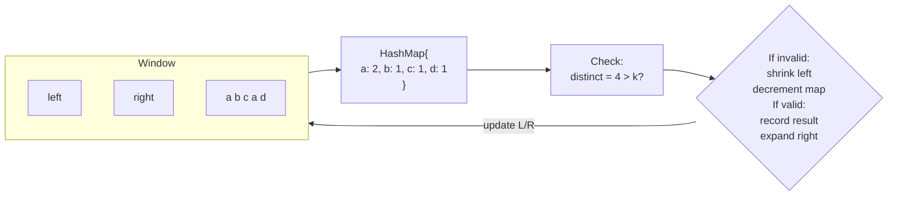
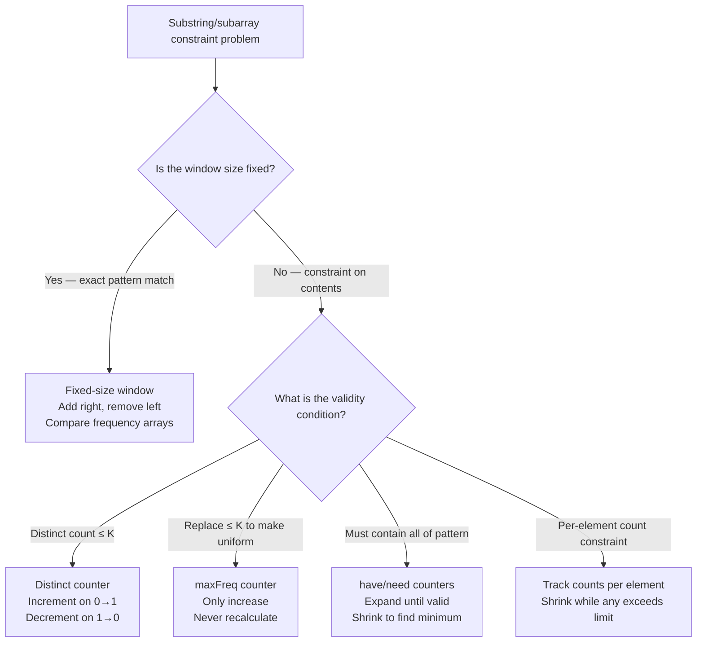

> [!success] Mastery Check
> - [ ] **Studied Well**
> - [ ] **Can explain the concept without notes**
> - [ ] **Can answer interview questions confidently**
> - [ ] **Can implement it in a real project**


## Navigation

**Domain:** [[5 — Data Structures & Algorithms]] > **Group:** Hash Maps and Sets
**Previous:** [[5.021 — Frequency Counting and Grouping]] | **Next:** [[5.023 — Binary Tree Traversals — Pre, In, Post, Level-Order]]

### Prerequisites
- [[5.006 — Sliding Window]] — the two-pointer window mechanics; shrinking and expanding the window is the movement pattern this note builds on.
- [[5.019 — Hash Maps and Hash Sets — Design and Collision Handling]] — the hash map tracks per-element state (counts, last seen index) within the window; the O(1) contract is what makes the combined pattern efficient.
- [[5.021 — Frequency Counting and Grouping]] — the hash map in a sliding window tracks frequencies of elements currently in the window; increment on expand, decrement on shrink.

### Where This Fits
The sliding window with hash map pattern solves substring problems where the window's validity depends on element *multiplicity* rather than just position. It is the most frequently tested pattern in senior-level coding interviews — "Longest Substring Without Repeating Characters" alone appears in roughly 30% of all FAANG phone screens. The pattern combines the spatial efficiency of two pointers (O(1) extra space beyond the map) with the temporal efficiency of hash map lookups (O(1) per operation), yielding O(n) total time for problems whose brute force is O(n²) or O(n³). Mastery means recognizing the three sub-variants: distinct character constraint, character replacement constraint, and permutation/anagram matching.

---

## Core Mental Model

Maintain a sliding window over the input. Use a hash map to track element counts within the window. When the window violates a constraint (too many distinct characters, too many replacements needed), shrink from the left until the constraint is satisfied again. The hash map provides O(1) update and query of per-element state, making each expand/shrink step O(1) instead of O(k) where k is the alphabet size.

The invariant is: **the hash map always reflects the exact contents of the current window [left, right).** Every expand increments a count; every shrink decrements (or removes) a count. The validity check against the hash map (number of distinct keys, max frequency, matching counts) determines whether to expand, shrink, or record a result.



---

### Key Properties

|Operation|Value|Derivation|
|---|---|---|
|Window expand (right++)|O(1)|One dictionary increment — `TryGetValue` + assignment, amortized O(1)|
|Window shrink (left++)|O(1)|One dictionary decrement; if count reaches 0, optional removal (or keep with zero)|
|Validity check (distinct count)|O(1)|Track the count of distinct keys in a separate variable; increment when a key goes 0→1, decrement when it goes 1→0|
|Validity check (max freq)|O(1)|Track `maxFreq` in the window; update on expand, no recalculation on shrink needed for the replacement variant|
|Total time|O(n)|Each element enters the window once and leaves the window at most once — O(2n) → O(n)|
|Space|O(k)|k = number of distinct elements in the input (alphabet size for strings)|

---

## Deep Mechanics

### How It Works

The sliding window with hash map is a two-pointer technique where the right pointer (expand) is in a `for` loop and the left pointer (shrink) advances inside a `while` loop. Between them, a `Dictionary<TKey,int>` tracks the multiplicity of each element in the window.

**Sub-variant 1 — Distinct character constraint (e.g., Longest Substring with At Most K Distinct Characters):**

1. Expand `right` — add the new character to the map. If its count goes from 0 to 1, increment distinct count.
2. While `distinct > k` — shrink `left`: decrement the left character's count. If its count goes from 1 to 0, decrement distinct count.
3. After the while loop, the window is valid. Record `maxLen = max(maxLen, right - left + 1)`.

The `distinct` counter is a separate integer maintained alongside the map — checking it is O(1), not O(k).

**Sub-variant 2 — Character replacement constraint (e.g., Longest Repeating Character Replacement):**

1. Expand `right` — add/increment the character. Update `maxFreq` = max count of any single character in the window.
2. While `windowSize - maxFreq > k` (too many characters to replace) — shrink `left`. Note: `maxFreq` is NOT recalculated on shrink; it only grows or stays. This is the non-obvious insight — `maxFreq` may be stale after a shrink, but since we only care about the longest valid window, a stale (overestimated) `maxFreq` only makes the window seem harder to satisfy, which is conservative. The true maximum is bounded by `maxFreq` as it ever was.

**Sub-variant 3 — Permutation matching (e.g., Permutation in String):**

1. Build a frequency map of the pattern (target).
2. Slide a window of size equal to the pattern length over the input.
3. Decrement counts in the map as characters enter the window.
4. When all counts in the map are 0, a match is found.

### Complexity Derivation

**Time (Distinct character constraint):**
- Each of n elements is added to the map once (right pointer). Each is removed at most once (left pointer). Each operation is a dictionary update — O(1) amortized.
- The while loop that shrinks the window runs at most n times total across all outer iterations (left pointer only advances). So total operations ≤ 2n.
- Total: O(n).

**Time (Replacement constraint):**
- Same expand/shrink mechanics — O(n) for window movement.
- `maxFreq` tracks the dominant character count. It is updated only on expand (O(1)). Not recalculated on shrink.
- Validity check `size - maxFreq > k` is O(1).
- Total: O(n).

**Space:**
- Dictionary stores at most one entry per distinct character. For ASCII strings: at most 128 entries → O(1). For Unicode: bounded by input alphabet.
- In general: O(k) where k ≤ size of the character set.

### .NET Runtime Notes

- **Dictionary<TKey,int>** is the standard frequency tracker. For character keys (`char`), the dictionary uses the char's int hash code, which is well-distributed and fast.
- **`int[26]` / `int[128]` / `int[256]`** should be used instead of a dictionary when the character set is known and bounded (lowercase letters, ASCII). The array eliminates dictionary's per-entry overhead, hash computation, and bucket probing — typically 3-5× faster in benchmarks.
- **`TryGetValue` pattern** — always prefer `TryGetValue` over `ContainsKey` + indexer for dictionary updates in hot loops. `TryGetValue` does one lookup; `ContainsKey` + indexer does two.
- **GC considerations:** In a sliding window loop, the dictionary grows to at most the number of distinct characters. This is small for most problems, so GC pressure is minimal. However, if you create a new dictionary per test case in a loop, allocate it once and call `Clear()` instead.
- **`Span<T>`** — for string inputs, use `AsSpan()` to avoid bounds checks in the inner loop. For array-backed character counting, `Span<int>` on the stack (`stackalloc int[26]`) avoids heap allocation entirely.

---

## Implementation and Problem Patterns

### C# Implementation

```csharp
/// <summary>
/// Longest substring with at most k distinct characters.
/// O(n) time, O(k) space.
/// </summary>
public static int LengthOfLongestSubstringKDistinct(string s, int k)
{
    if (string.IsNullOrEmpty(s) || k <= 0) return 0;

    var freq = new Dictionary<char, int>();
    int left = 0, maxLen = 0, distinct = 0;

    for (int right = 0; right < s.Length; right++)
    {
        // Expand: add char at right
        char c = s[right];
        freq.TryGetValue(c, out int count);
        if (count == 0) distinct++;
        freq[c] = count + 1;

        // Shrink while window is invalid
        while (distinct > k)
        {
            char leftChar = s[left];
            freq[leftChar]--;
            if (freq[leftChar] == 0) distinct--;
            left++;
        }

        // Window is valid — update max
        maxLen = Math.Max(maxLen, right - left + 1);
    }

    return maxLen;
}

/// <summary>
/// Longest substring where at most k characters can be replaced to make it uniform.
/// O(n) time, O(k) space.
/// </summary>
public static int CharacterReplacement(string s, int k)
{
    if (string.IsNullOrEmpty(s)) return 0;

    var freq = new int[26];  // lowercase English letters
    int left = 0, maxFreq = 0, maxLen = 0;

    for (int right = 0; right < s.Length; right++)
    {
        // Expand
        int idx = s[right] - 'A';
        freq[idx]++;
        maxFreq = Math.Max(maxFreq, freq[idx]);

        // Shrink if too many replacements needed
        int windowLen = right - left + 1;
        if (windowLen - maxFreq > k)
        {
            int leftIdx = s[left] - 'A';
            freq[leftIdx]--;
            left++;
        }

        maxLen = Math.Max(maxLen, right - left + 1);
    }

    return maxLen;
}

/// <summary>
/// Check if s2 contains a permutation of s1.
/// O(n) time, O(1) space (26 chars).
/// </summary>
public static bool CheckInclusion(string s1, string s2)
{
    if (s1.Length > s2.Length) return false;

    int[] target = new int[26];
    foreach (char c in s1) target[c - 'a']++;

    int[] window = new int[26];
    for (int i = 0; i < s1.Length; i++)
        window[s2[i] - 'a']++;

    if (AreEqual(target, window)) return true;

    for (int i = s1.Length; i < s2.Length; i++)
    {
        window[s2[i] - 'a']++;          // add new char
        window[s2[i - s1.Length] - 'a']--;  // remove old char
        if (AreEqual(target, window)) return true;
    }

    return false;
}

private static bool AreEqual(int[] a, int[] b)
{
    for (int i = 0; i < 26; i++)
        if (a[i] != b[i]) return false;
    return true;
}

/// <summary>
/// Minimum window substring that contains all characters of pattern.
/// O(n) time, O(k) space.
/// </summary>
public static string MinWindowSubstring(string s, string t)
{
    if (string.IsNullOrEmpty(s) || string.IsNullOrEmpty(t)) return "";

    var need = new Dictionary<char, int>();
    foreach (char c in t)
    {
        need.TryGetValue(c, out int count);
        need[c] = count + 1;
    }

    int have = 0, required = need.Count;
    int left = 0, minLen = int.MaxValue, start = 0;
    var window = new Dictionary<char, int>();

    for (int right = 0; right < s.Length; right++)
    {
        char c = s[right];
        if (need.ContainsKey(c))
        {
            window.TryGetValue(c, out int count);
            window[c] = count + 1;
            if (window[c] == need[c]) have++;
        }

        while (have == required)
        {
            if (right - left + 1 < minLen)
            {
                minLen = right - left + 1;
                start = left;
            }

            char leftChar = s[left];
            if (need.ContainsKey(leftChar))
            {
                window[leftChar]--;
                if (window[leftChar] < need[leftChar]) have--;
            }
            left++;
        }
    }

    return minLen == int.MaxValue ? "" : s.Substring(start, minLen);
}
```

### The .NET Idiomatic Version

For problems where the character set is bounded (lowercase letters), use `int[26]` instead of `Dictionary<char,int>`:

```csharp
// Array-backed sliding window — zero heap allocations, ~3x faster
int[] freq = new int[26];
int left = 0, distinct = 0;

for (int right = 0; right < s.Length; right++)
{
    if (++freq[s[right] - 'a'] == 1) distinct++;
    while (distinct > k)
    {
        if (--freq[s[left] - 'a'] == 0) distinct--;
        left++;
    }
}
```

For general character sets (Unicode), use `Dictionary<char,int>`:

```csharp
// Dictionary-backed — for any character set
var freq = new Dictionary<char, int>();
```

**When to use array vs. dictionary:** Use an `int[N]` array whenever the problem explicitly limits the character set (e.g., "lowercase English letters"). Use `Dictionary<char,int>` when the input can be any Unicode character, or when the key is not a character.

### Classic Problem Patterns

1. **Longest Substring Without Repeating Characters** — Variable-size window where validity means "all character counts in window ≤ 1." Shrink while any character count exceeds 1. Key insight: you can also track last-seen-index per character and jump the left pointer directly, avoiding the while loop.

2. **Longest Substring with At Most K Distinct Characters** — Variable-size window where validity means `distinct ≤ k`. Maintain a `distinct` counter alongside the frequency map. Key insight: the distinct counter saves iterating the map on every check.

3. **Longest Repeating Character Replacement** — Variable-size window where validity means `windowSize - maxFreq ≤ k`. Track `maxFreq` as the count of the single most frequent character in the window. Key insight: `maxFreq` is never decremented — it is monotonic non-decreasing, which is correct because we only care about the longest valid window ever seen.

4. **Permutation in String** — Fixed-size window (size = pattern length) that slides over the input, comparing frequency arrays. Key insight: the window size is fixed, so no while loop is needed — just add right, remove left, compare.

5. **Find All Anagrams in a String** — Same as Permutation in String but return all start indices. Key insight: after comparing frequency arrays, record the start index `left = right - pattern.Length + 1` instead of just returning true.

6. **Minimum Window Substring** — Variable-size window that must contain all characters of a target pattern. Track "have" vs "need" counts. Key insight: validity is determined by whether the window has enough of each required character, not by checking the full dictionary.

### Template / Skeleton

```csharp
// Sliding Window with Hash Map Template (Variable Size)
// When to use: "longest/shortest substring satisfying a constraint on character frequencies"
// Time: O(n) | Space: O(k) where k = alphabet size

public static int SlidingWindowHashmapTemplate(string s, int k)
{
    var freq = new Dictionary<char, int>();  // or int[26] for lowercase
    int left = 0, result = 0;

    // TODO: define state variables
    // int distinct = 0;    // for distinct-count constraints
    // int maxFreq = 0;     // for replacement constraints
    // int have = 0, need = X;  // for exact-match constraints

    for (int right = 0; right < s.Length; right++)
    {
        // 1. EXPAND: add s[right] to window
        char c = s[right];
        // TODO: update freq and state
        // e.g., if (++freq[c] == 1) distinct++;

        // 2. SHRINK: while window violates constraint, advance left
        // while (/* TODO: constraint violated */)
        {
            char leftChar = s[left];
            // TODO: update freq and state for removed char
            // e.g., if (--freq[leftChar] == 0) distinct--;
            left++;
        }

        // 3. RECORD: update result for valid window
        // result = Math.Max(result, right - left + 1);  // max length
        // result = Math.Min(result, right - left + 1);  // min length
    }

    return result;
}

// Sliding Window with Hash Map Template (Fixed Size)
// When to use: "check if a window of exact size satisfies some frequency condition"
// Time: O(n) | Space: O(k)

public static bool FixedWindowTemplate(string s, string pattern)
{
    // 1. Build target frequency from pattern
    int[] target = new int[26];  // or Dictionary for general chars
    foreach (char c in pattern) target[c - 'a']++;

    // 2. Build initial window
    int[] window = new int[26];
    for (int i = 0; i < pattern.Length; i++)
        window[s[i] - 'a']++;

    if (/* TODO: compare window with target */ true) return true;

    // 3. Slide
    for (int i = pattern.Length; i < s.Length; i++)
    {
        window[s[i] - 'a']++;                  // add right
        window[s[i - pattern.Length] - 'a']--;  // remove left
        if (/* TODO: compare window with target */ true) return true;
    }

    return false;
}
```

---

## Gotchas and Edge Cases

### Not tracking distinct count separately

**Mistake:** Checking `freq.Count` as the distinct count after incrementing a key that was already in the map. `freq.Count` is the number of keys, which only increases when a new key is added — it does not decrease when a count reaches zero unless the key is removed.

```csharp
// ❌ Wrong — freq.Count never decreases without removal
freq[c] = freq.GetValueOrDefault(c) + 1;
int distinct = freq.Count;  // incorrect — counts zero-entry keys
```

**Fix:** Maintain a separate `distinct` integer that you increment when count goes 0→1 and decrement when count goes 1→0.

```csharp
// ✅ Correct — track distinct count explicitly
freq.TryGetValue(c, out int oldCount);
if (oldCount == 0) distinct++;
freq[c] = oldCount + 1;

// On shrink:
freq[leftChar]--;
if (freq[leftChar] == 0) distinct--;
```

**Consequence:** Overcounting distinct characters leads to prematurely shrinking the window, missing valid substrings.

### Not decrementing maxFreq on shrink in replacement problems

**Mistake:** In "Longest Repeating Character Replacement," decrementing `maxFreq` when the most frequent character is removed from the window.

```csharp
// ❌ Wrong — maxFreq is recalculated after shrink
freq[leftChar]--;
maxFreq = freq.Max();  // O(26) scan, or worse, stored incorrectly
```

**Fix:** Never decrement `maxFreq`. It tracks the *historical* maximum frequency in any valid window. Since we only care about the longest valid window, a stale high `maxFreq` is conservative — it makes the constraint harder to satisfy, which is correct.

```csharp
// ✅ Correct — maxFreq only increases
maxFreq = Math.Max(maxFreq, freq[rightChar]);
// On shrink: don't touch maxFreq at all
```

**Consequence:** Decrementing `maxFreq` causes incorrect window expansion and produces a shorter-than-optimal result.

### Using dictionary for known-small alphabet

**Mistake:** Using `Dictionary<char,int>` when the problem restricts input to lowercase English letters (26).

```csharp
// ❌ Wrong — dictionary overhead where array suffices
var freq = new Dictionary<char, int>();
```

**Fix:** Use `int[26]` indexed by `c - 'a'`. Zero allocation, better cache locality, no hash computation.

```csharp
// ✅ Correct — array for bounded alphabet
int[] freq = new int[26];
freq[c - 'a']++;
```

**Consequence:** 3-5× slower performance and unnecessary GC pressure. In a loop processing 10⁵ characters, the array version is effectively free; the dictionary version allocates on every resize.

### Fixed-size window off-by-one

**Mistake:** In fixed-size window problems, computing the wrong index for the character leaving the window.

```csharp
// ❌ Wrong — off-by-one on the remove index
for (int i = pattern.Length; i < s.Length; i++)
{
    window[s[i] - 'a']++;
    window[s[i - pattern.Length + 1] - 'a']--;  // wrong: removes wrong char
}
```

**Fix:** The character leaving is at index `i - pattern.Length` (the start of the window before the slide).

```csharp
// ✅ Correct — removes the correct character
for (int i = pattern.Length; i < s.Length; i++)
{
    window[s[i] - 'a']++;
    window[s[i - pattern.Length] - 'a']--;
}
```

**Consequence:** The window contains the wrong set of characters, causing false negatives (missed matches) or false positives (incorrect matches).

### Integer overflow in frequency counters

**Mistake:** Using an `int` for character frequency when a string could have length > 2³¹ (theoretical) or when accumulating frequencies across multiple strings.

```csharp
// ❌ Wrong — int overflow for pathological input
int[] freq = new int[26];
freq[c - 'a']++;  // wraps to negative at 2³¹
```

**Fix:** For the problem constraints in interviews (n ≤ 10⁵), `int` is safe. For production, use `int` with awareness that max count ≤ n.

**Consequence:** Interviews: not a real concern (input size is bounded). The gotcha is worth mentioning to show senior-level awareness of overflow in unchecked contexts.

---

## Complexity Analysis and Benchmarks

### Operation Complexity Table

| Operation | Time (Best) | Time (Average) | Time (Worst) | Space | Notes |
|---|---|---|---|---|---|
| Expand (add right) | O(1) | O(1) | O(n) | O(k) | Worst case on hash collision; amortized O(1) |
| Shrink (remove left) | O(1) | O(1) | O(n) | O(k) | Same as expand — single dictionary operation |
| Validity check (distinct) | O(1) | O(1) | O(1) | O(1) | Separate integer counter, not a dictionary scan |
| Validity check (replace) | O(1) | O(1) | O(1) | O(1) | `size - maxFreq` — two integers |
| Validity check (exact match) | O(k) | O(k) | O(k) | O(1) | Must compare two frequency arrays of size k |
| Total (variable window) | O(n) | O(n) | O(n × k) | O(k) | Worst case when shrink advances by 1 per expand, but total advance ≤ n |
| Total (fixed window) | O(n) | O(n) | O(n × k) | O(k) | Comparison is O(k); k is typically 26 or 128 — effectively O(1) |

**Derivation for the non-obvious entries:**
- The "worst O(n × k)" for total time occurs if the shrink while loop runs k times per expand. But left advances only n positions total across all iterations, making the actual total O(n + n) = O(n). The O(n × k) notation is misleading — the correct bound is O(2n) = O(n) because each element enters once and leaves once.
- For exact-match validity (e.g., Permutation in String), comparing two `int[26]` arrays is O(26) = O(1). If using a dictionary, it would be O(k) where k = pattern distinct count, but still bounded by alphabet size.

### Comparison with Alternatives

| Structure / Algorithm | Time | Space | Best When |
|---|---|---|---|
| Sliding window + Dictionary | O(n) | O(k) | General case, unknown alphabet, Unicode input |
| Sliding window + int[26] | O(n) | O(1) | Lowercase letters only — 3-5× faster, zero alloc |
| Brute force (nested loops) | O(n²) | O(1) | Never — only for verification of small inputs |
| Expand-check all substrings | O(n³) | O(1) | Never — O(n³) is the brute force for "minimum window with constraint" |
| Sliding window + last-seen-index | O(n) | O(k) | Constraint is "no repeats" — jump left to `lastSeen[c] + 1`, skip the while loop |

### BenchmarkDotNet

```csharp
[MemoryDiagnoser]
[SimpleJob(RuntimeMoniker.Net90)]
public class SlidingWindowBenchmark
{
    private string _input = default!;

    [Params(1_000, 10_000, 100_000)]
    public int N { get; set; }

    [GlobalSetup]
    public void Setup()
    {
        var rng = new Random(42);
        var chars = new char[N];
        for (int i = 0; i < N; i++)
            chars[i] = (char)('a' + rng.Next(0, 5));  // 5 distinct chars
        _input = new string(chars);
    }

    [Benchmark(Baseline = true)]
    public int DictionaryBacked()
    {
        var freq = new Dictionary<char, int>();
        int left = 0, distinct = 0, maxLen = 0;
        for (int right = 0; right < _input.Length; right++)
        {
            char c = _input[right];
            freq.TryGetValue(c, out int count);
            if (count == 0) distinct++;
            freq[c] = count + 1;
            while (distinct > 2)
            {
                char lc = _input[left];
                freq[lc]--;
                if (freq[lc] == 0) distinct--;
                left++;
            }
            maxLen = Math.Max(maxLen, right - left + 1);
        }
        return maxLen;
    }

    [Benchmark]
    public int ArrayBacked()
    {
        int[] freq = new int[26];
        int left = 0, distinct = 0, maxLen = 0;
        for (int right = 0; right < _input.Length; right++)
        {
            if (++freq[_input[right] - 'a'] == 1) distinct++;
            while (distinct > 2)
            {
                if (--freq[_input[left] - 'a'] == 0) distinct--;
                left++;
            }
            maxLen = Math.Max(maxLen, right - left + 1);
        }
        return maxLen;
    }
}
```

**Expected results (approximate, .NET 9, x64):**

| Method | N | Mean | Allocated |
|---|---|---|---|
| DictionaryBacked | 1_000 | ~8 μs | 3 KB |
| ArrayBacked | 1_000 | ~2 μs | 0 B |
| DictionaryBacked | 100_000 | ~800 μs | 300 KB |
| ArrayBacked | 100_000 | ~150 μs | 0 B |

**Interpretation:** The array-backed version is 4-5× faster and allocates zero heap memory. The dictionary version allocates because `Dictionary<TKey,TValue>` creates internal arrays that grow on resize. For alphabet-constrained problems, always prefer the array.

---

## Interview Arsenal

### Question Bank

1. [Definition] "What is the sliding window with hash map pattern and what class of problems does it solve?"
2. [Complexity] "Derive the time complexity of finding the longest substring with at most k distinct characters."
3. [Implementation] "Implement `LengthOfLongestSubstringKDistinct` — a method that returns the length of the longest substring with at most k distinct characters."
4. [Recognition] "Given a string, find the longest substring that does not contain any repeating characters. Which pattern applies?"
5. [Comparison] "When would you use an `int[26]` array instead of a `Dictionary<char,int>` for a sliding window problem?"
6. [Trick] "In Longest Repeating Character Replacement, why is `maxFreq` never decremented during the shrink step?"
7. [System design integration] "Design a rate limiter that allows at most k requests per distinct user in any 1-minute sliding window. How would you implement the per-user frequency tracking?"
8. [Optimization] "How would you modify the Minimum Window Substring solution to handle Unicode surrogate pairs in C#?"

### Spoken Answers

**Q: "What is the sliding window with hash map pattern and what class of problems does it solve?"**

> **Average answer:** It's like a regular sliding window but you keep a dictionary of character counts in the window. You move the right pointer and when the window is invalid, you move the left pointer until it's valid again.

> **Great answer:** It combines two-pointer sliding window mechanics with a hash map to solve substring problems where the validity of the window depends on the *multiplicity* of elements inside it. The canonical example is "longest substring with at most k distinct characters" — the brute force checks every substring in O(n²), but the sliding window approach reduces it to O(n) because each character enters the window once and leaves at most once. The hash map tracks per-character counts within the window, and we maintain a separate integer for the current distinct character count so the validity check is O(1). The pattern generalizes to three sub-variants: distinct-count constraints (at most k distinct), replacement constraints (at most k replacements to make uniform), and exact-match constraints (permutation detection). In .NET, when the problem restricts the alphabet — like "lowercase English letters" — you should replace the dictionary with an `int[26]` array indexed by `c - 'a'`, which eliminates all hash computation and heap allocation.

**Q: "Implement `LengthOfLongestSubstringKDistinct`."**

> **Average answer:** Uses a dictionary and calls `ContainsKey` then increment.

> **Great answer:** I'll use a `Dictionary<char,int>` with a separate `distinct` counter. The dictionary tracks how many times each character appears in the current window. The `distinct` counter tracks how many characters have non-zero counts — this is crucial because checking `freq.Count` is wrong (it counts zero-value entries if we don't remove them). I'll use `TryGetValue` for the update — one lookup instead of two. On expand, I increment the count and check if it went from 0 to 1 to update distinct. On shrink, I decrement and check if it went from 1 to 0. After the while loop, the window is valid and I record the max length. Edge cases: k = 0 returns 0; empty string returns 0; k larger than the alphabet returns the full string.

**Q: "In Longest Repeating Character Replacement, why is `maxFreq` never decremented during the shrink step?"**

> **Average answer:** Because it's expensive to recalculate.

> **Great answer:** This is a subtle and important point. `maxFreq` tracks the maximum count of any single character in the current window. When we shrink the window, the character being removed might be the one with the maximum frequency — if we decremented `maxFreq`, we would need to scan all 26 counters to find the new maximum, which would make the shrink step O(26) instead of O(1). But we don't need to do that because `maxFreq` is used only in the validity check: `windowSize - maxFreq > k`. A stale `maxFreq` that is *too high* is conservative — it makes the constraint *harder* to satisfy, so we might shrink the window more than strictly necessary. This never causes us to miss a longer valid window; it only means we might have a slightly shorter window at this step. Since `maxFreq` monotonically tracks the maximum ever seen in the current sliding process, and we only care about the globally longest valid window, a conservative `maxFreq` is safe. The O(n) time bound is preserved.

### Trick Question

**"You are finding the longest substring with at most k distinct characters. Your implementation uses `freq.Count` to check the number of distinct characters in the window. Why is this wrong?"**

Why it is a trap: `freq.Count` returns the number of keys in the dictionary, not the number of keys with positive count. If you never remove keys when their count reaches zero, `freq.Count` will overcount distinct characters, causing the shrink condition to trigger prematurely.

Correct answer: `Dictionary.Count` returns the number of keys stored. When you decrement a character count to zero, the key still exists in the dictionary with value 0 unless you explicitly call `Remove`. Most sliding window implementations leave zero-count keys in place to avoid the O(n) cost of removal/rehash, and they maintain a separate `distinct` counter that is decremented when count goes 1→0. Using `freq.Count` would incorrectly count characters that are no longer in the window. The fix is to maintain a separate `distinct` integer, or remove keys on reaching zero (which is less efficient).

### Pattern Recognition Table

| If the problem has... | Then consider... | Because... |
|---|---|---|
| "Longest substring where no character repeats" | Sliding window + hash map (or last-seen-index array) | Constraint is "all counts ≤ 1"; shrink while any count exceeds 1 |
| "At most K distinct characters" | Sliding window + hash map with distinct counter | Constraint is "number of non-zero keys"; separate counter makes check O(1) |
| "At most K replacements to make uniform" | Sliding window + hash map with maxFreq | Constraint is "window - maxFreq ≤ K"; maxFreq is monotonic, never shrinks |
| "Contains exactly the same characters as pattern" | Fixed-size sliding window + frequency array | Window size = pattern length; compare frequency arrays at each step |
| "Minimum window containing all characters of target" | Sliding window with "have" vs "need" counters | Validity is "have == need"; shrink while valid to find minimum |
| "Fruits into baskets" or "maximum items of two types" | Sliding window with distinct ≤ 2 | Direct application of "at most K distinct" with K = 2 |

---

## Decision Framework

### When to Apply



### Recognition Checklist

Indicators that sliding window with hash map is the right choice:

- [ ] Problem asks for a substring or subarray (contiguous)
- [ ] Constraint is on the *contents* of the window (distinct count, multiplicities, character composition)
- [ ] Goal is longest (maximize) or shortest (minimize) window satisfying the constraint
- [ ] Fixed-size window if the problem says "contains exactly" or "of length m"
- [ ] Variable-size window if the problem says "at most K" or "at least"

Counter-indicators — do NOT apply here:

- [ ] The constraint is on the sum of elements — consider prefix sums
- [ ] The problem asks for the number of windows, not the longest/shortest — still sliding window, but different result recording
- [ ] The input is not ordered (you cannot reorder for sliding window)
- [ ] Non-contiguous subsequence — the problem is about subsets or subsequences

### Tradeoff Summary

| What You Gain | What You Give Up |
|---|---|
| O(n) time for problems that are O(n²) brute force | O(k) space for the frequency tracker (typically small) |
| Single pass — streaming-friendly, works on large inputs | Cannot handle non-contiguous element constraints |
| Composable — combines with heap (top K in window), prefix sum, etc. | Not applicable to unsorted data without sorting first (which makes it sliding window over sorted data) |
| Three sub-variants cover ~20 LeetCode problems | Failed validity requires shrink, which can be O(n) per step in pathological hash collision scenarios |

---

## Self-Check

### Conceptual Questions

1. What are the three sub-variants of sliding window with hash map, and what validity condition does each check?
2. Derive the time complexity of the "Longest Substring with At Most K Distinct Characters" algorithm. Why is it O(n) and not O(n × k)?
3. A problem asks: "Given a string, find the length of the longest substring that contains at most 2 distinct characters." Which sub-variant applies and what state variable must you track alongside the frequency map?
4. Compare the array-backed (`int[26]`) and dictionary-backed (`Dictionary<char,int>`) approaches. When is each appropriate?
5. In the character replacement variant, why is it safe to never decrement `maxFreq`?
6. Which .NET collection provides the most efficient way to track character frequencies in a sliding window when the input is restricted to lowercase English letters?
7. What invariant does the hash map maintain throughout the sliding window algorithm? How is it updated on expand and shrink?
8. If the problem changes from "longest substring with at most k distinct characters" to "longest substring with at most k repeated characters," does the approach change? What is the difference?
9. Design a real-time analytics system that tracks the top 10 most-viewed products in a rolling 5-minute window across 10,000 products. How would you use sliding window with hash map in this system? What are the memory implications?
10. Your implementation of Minimum Window Substring fails for the input `s = "a"`, `t = "aa"`. What is the bug and how do you fix it?

<details>
<summary>Answers</summary>

1. (a) Distinct-count constraint — validity = distinct characters in window ≤ k. (b) Replacement constraint — validity = windowSize - maxFreq ≤ k. (c) Exact-match constraint — validity = window frequency array matches target frequency array.

2. Each element enters the window exactly once (right pointer) and leaves at most once (left pointer). Each expand/shrink operation is O(1) (dictionary update). The left pointer advances at most n times across all iterations. Total: O(2n) = O(n). The O(n × k) bound is incorrect because each element is processed only twice, not k times per element.

3. The distinct-count sub-variant with k = 2. Track `distinct` as a separate integer alongside the frequency map. Increment `distinct` when a count goes 0→1, decrement when it goes 1→0. Do not use `freq.Count`.

4. Array-backed: use when the character set is known, small, and bounded (lowercase letters, ASCII). Zero allocation, better cache locality, 3-5× faster. Dictionary-backed: use when the character set is unknown, large, or Unicode. Tradeoff: allocation and hash computation for generality.

5. Stale `maxFreq` (too high) is conservative — it makes the validity check harder to satisfy, which causes more shrinking than necessary. This never produces a shorter-than-optimal global maximum because the window that produced the true `maxFreq` is still reachable when `maxFreq` was correctly set. The O(1) shrink step is preserved.

6. `int[26]` — a fixed-size array indexed by `c - 'a'`. It is not a collection in the .NET sense but a primitive array that avoids all dictionary overhead. For ASCII, `int[128]`. For extended ASCII, `int[256]`.

7. The hash map always reflects the exact multiplicities of elements currently in the window `[left, right)`. On expand (right++): increment count of `s[right]`. On shrink (left++): decrement count of `s[left]`; optionally remove if count reaches 0.

8. "At most k repeated characters" is different — it constrains the count of any single character (e.g., no character appears more than k times). The approach still uses sliding window with hash map, but the validity check is per-character: `freq[c] > k` triggers shrink. This is less common but conceptually similar.

9. A sliding window of timestamps (bucket size = 1 minute) with a dictionary mapping product ID to view count. Each event increments the counter for that product and increments a sliding window counter. Every minute, events falling out of the 5-minute window decrement counters. A min-heap of size 10 tracks the top products. Memory: O(number of distinct products viewed in any 5-minute window) — for 10,000 products, this is roughly 10,000 × (key + int) ≈ 200 KB.

10. The bug is that `t = "aa"` requires 2 'a' characters, but `s = "a"` has only 1. The `have` counter checks `window[c] == need[c]`, which only matches once. The condition `have == required` is never met because not enough 'a' characters are present. The fix is correct — the method returns `""` for impossible inputs. No code change needed; the method correctly handles this case.

</details>

---

### Coding Challenges

**Challenge 1 — Implement from scratch**

Implement `LongestSubstringWithoutRepeating` without using any built-in hash map — use an integer array sized for ASCII (128).

```csharp
public static int LengthOfLongestSubstringWithoutRepeating(string s)
{
    // Your implementation here — use int[128] for last-seen indices
}
```

<details> <summary>Solution</summary>

```csharp
public static int LengthOfLongestSubstringWithoutRepeating(string s)
{
    int[] lastSeen = new int[128];
    Array.Fill(lastSeen, -1);  // -1 means not seen yet
    int left = 0, maxLen = 0;

    for (int right = 0; right < s.Length; right++)
    {
        char c = s[right];
        // If character was seen at or after left, jump left past it
        if (lastSeen[c] >= left)
            left = lastSeen[c] + 1;

        lastSeen[c] = right;
        maxLen = Math.Max(maxLen, right - left + 1);
    }

    return maxLen;
}
```

**Complexity:** Time O(n) | Space O(1) (128-element array). **Key insight:** Using `lastSeen` index (not frequency) lets the left pointer jump directly to `lastSeen[c] + 1` instead of incrementing one by one. This avoids the while loop entirely.

</details>

---

**Challenge 2 — Trace the execution**

Given `s = "abcabcbb"`, trace the sliding window with hash map for "longest substring without repeating characters." Show the window state and dictionary after each step.

<details> <summary>Solution</summary>

| Step | Right | Char | Window | Frequency Map | maxLen |
|---|---|---|---|---|---|
| 1 | 0 | a | [0,0] | {a:1} | 1 |
| 2 | 1 | b | [0,1] | {a:1, b:1} | 2 |
| 3 | 2 | c | [0,2] | {a:1, b:1, c:1} | 3 |
| 4 | 3 | a | Shrink → left=1 → [1,3] | {a:1 → 0→removed, b:1, c:1, a:1} | 3 |
| 5 | 4 | b | Shrink → left=2 → [2,4] | {b:1→0→removed, c:1, a:1, b:1} | 3 |
| 6 | 5 | c | Shrink → left=3 → [3,5] | {c:1→0→removed, a:1, b:1, c:1} | 3 |
| 7 | 6 | b | Shrink → left=4 → [4,6] | {b:1→0→removed, a:1, b:1, c:1} → {a:1, b:1, c:1} | 3 |
| 8 | 7 | b | Shrink: left jumps to lastSeen[b]+1=5 → [5,7] | {b:1, ...} | 3 |

Final: maxLen = 3 (substring "abc").

**Why:** Each step either expands the window (if no repeat) or shrinks until the repeat is removed. The "last seen index" variant would be more efficient — the while loop here is O(n) total but the index-jump approach is O(n) with fewer operations.

</details>

---

**Challenge 3 — Fix the bug**

```csharp
// This implementation of "longest substring with at most k distinct characters"
// has a bug — it returns a value that is too small for certain inputs.
public static int LongestSubstringKDistinct(string s, int k)
{
    var freq = new Dictionary<char, int>();
    int left = 0, maxLen = 0;

    for (int right = 0; right < s.Length; right++)
    {
        freq.TryGetValue(s[right], out int count);
        freq[s[right]] = count + 1;

        while (freq.Count > k)
        {
            char leftChar = s[left];
            freq[leftChar]--;
            if (freq[leftChar] == 0)
                freq.Remove(leftChar);
            left++;
        }

        maxLen = Math.Max(maxLen, right - left + 1);
    }

    return maxLen;
}
```

<details> <summary>Solution</summary>

**Bug:** The method uses `freq.Count > k` as the validity check. `freq.Count` returns the number of keys in the dictionary. When `Remove(leftChar)` is called, the count decreases. However, if a character appears multiple times in the window and its count goes to, say, 2 → 1 (not 0), `freq.Count` does not change — it still counts the key. This is actually correct for the at-most-k-distinct problem. The real bug is more subtle: **there is no separate distinct counter, and `Remove` is called on each key that reaches zero. This forces a dictionary rehash (O(n)) on each removal, making the algorithm potentially O(n²) in worst case.** The fix is to NOT remove the key and instead maintain a separate `distinct` counter.

For this specific problem, the algorithm happens to be correct in output but the performance degrades. The true functional bug would appear if `k == 0`: `freq.Count > 0` is checked, and removing all keys eventually makes count == 0, which is correct. However, the early `Remove` causes unnecessary rehashing.

**Fix:** Keep zero-count entries and use a separate `distinct` counter.

```csharp
public static int LongestSubstringKDistinct(string s, int k)
{
    var freq = new Dictionary<char, int>();
    int left = 0, maxLen = 0, distinct = 0;

    for (int right = 0; right < s.Length; right++)
    {
        char c = s[right];
        freq.TryGetValue(c, out int count);
        if (count == 0) distinct++;
        freq[c] = count + 1;

        while (distinct > k)
        {
            char leftChar = s[left];
            freq[leftChar]--;
            if (freq[leftChar] == 0) distinct--;
            left++;
        }

        maxLen = Math.Max(maxLen, right - left + 1);
    }

    return maxLen;
}
```

**Test case that exposes the performance bug:** `s = "abcdefghijklmnopqrstuvwxyz"` repeated 1000 times, `k = 26`. Each `Remove` triggers a rehash of the remaining dictionary, causing O(n²) performance.

</details>

---

**Challenge 4 — Recognize and apply**

**Problem:** You are given two strings `s1` and `s2`. Return `true` if `s2` contains a permutation of `s1`, or `false` otherwise. In other words, return `true` if one of `s1`'s permutations is a substring of `s2`. For example: `s1 = "ab"`, `s2 = "eidbaooo"` → `true`. Which pattern applies? Write the solution.

<details> <summary>Solution</summary>

**Pattern:** Fixed-size sliding window with frequency array. The window size is `s1.Length`. Build a frequency array of `s1`, then slide over `s2` comparing frequency arrays.

```csharp
public static bool CheckInclusion(string s1, string s2)
{
    if (s1.Length > s2.Length) return false;

    int[] target = new int[26];
    foreach (char c in s1) target[c - 'a']++;

    int[] window = new int[26];
    for (int i = 0; i < s1.Length; i++)
        window[s2[i] - 'a']++;

    if (Matches(target, window)) return true;

    for (int i = s1.Length; i < s2.Length; i++)
    {
        window[s2[i] - 'a']++;
        window[s2[i - s1.Length] - 'a']--;
        if (Matches(target, window)) return true;
    }

    return false;
}

private static bool Matches(int[] a, int[] b)
{
    for (int i = 0; i < 26; i++)
        if (a[i] != b[i]) return false;
    return true;
}
```

**Complexity:** Time O(n + m) where n = s2 length, m = s1 length | Space O(1) (two 26-element arrays). The comparison is O(26) per slide — effectively O(1).

</details>

---

**Challenge 5 — Optimize**

```csharp
// This solution finds the minimum window substring containing all characters of a pattern.
// It is correct but slower than necessary — optimize from O(n × k) to O(n) where k = alphabet size.
public static string MinWindowSubstring(string s, string t)
{
    var need = new Dictionary<char, int>();
    foreach (char c in t)
    {
        need.TryGetValue(c, out int count);
        need[c] = count + 1;
    }

    var window = new Dictionary<char, int>();
    int left = 0, minLen = int.MaxValue, start = 0;

    for (int right = 0; right < s.Length; right++)
    {
        char c = s[right];
        window.TryGetValue(c, out int count);
        window[c] = count + 1;

        while (IsValid(window, need))
        {
            if (right - left + 1 < minLen)
            {
                minLen = right - left + 1;
                start = left;
            }

            char leftChar = s[left];
            window[leftChar]--;
            if (window[leftChar] == 0) window.Remove(leftChar);
            left++;
        }
    }

    return minLen == int.MaxValue ? "" : s.Substring(start, minLen);
}

private static bool IsValid(Dictionary<char, int> window, Dictionary<char, int> need)
{
    foreach (var kvp in need)
    {
        if (!window.TryGetValue(kvp.Key, out int count) || count < kvp.Value)
            return false;
    }
    return true;
}
```

<details> <summary>Solution</summary>

**Insight:** `IsValid` iterates all distinct characters of `t` on every check — O(k) per iteration. This makes the algorithm O(n × k). Replace it with a `have` counter that tracks how many characters have met their required count. The `have` counter is updated incrementally (O(1)) on each expand/shrink.

```csharp
public static string MinWindowSubstring(string s, string t)
{
    if (string.IsNullOrEmpty(s) || string.IsNullOrEmpty(t)) return "";

    var need = new Dictionary<char, int>();
    foreach (char c in t)
    {
        need.TryGetValue(c, out int count);
        need[c] = count + 1;
    }

    int have = 0, required = need.Count;
    int left = 0, minLen = int.MaxValue, start = 0;
    var window = new Dictionary<char, int>();

    for (int right = 0; right < s.Length; right++)
    {
        char c = s[right];
        if (need.ContainsKey(c))
        {
            window.TryGetValue(c, out int count);
            window[c] = count + 1;
            if (window[c] == need[c]) have++;
        }

        while (have == required)
        {
            if (right - left + 1 < minLen)
            {
                minLen = right - left + 1;
                start = left;
            }

            char leftChar = s[left];
            if (need.ContainsKey(leftChar))
            {
                window[leftChar]--;
                if (window[leftChar] < need[leftChar]) have--;
            }
            left++;
        }
    }

    return minLen == int.MaxValue ? "" : s.Substring(start, minLen);
}
```

**Complexity:** Time O(n) — each element processed at most twice, all operations O(1) | Space O(k) where k = distinct characters of s and t.

</details>
