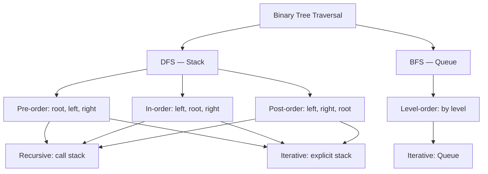

> [!success] Mastery Check
> - [ ] **Studied Well**
> - [ ] **Can explain the concept without notes**
> - [ ] **Can answer interview questions confidently**
> - [ ] **Can implement it in a real project**


## Navigation

**Domain:** [[5 — Data Structures & Algorithms]] > **Group:** Trees
**Previous:** [[5.020 — Two-Sum Pattern and Generalizations]] | **Next:** [[5.024 — Binary Search Tree — Operations and Validation]]

### Prerequisites
- [[5.002 — Recursion and the Call Stack]] — recursive traversal uses the call stack implicitly; understanding stack frames is required for tracing traversal.
- [[5.015 — Stack — LIFO Applications and Balanced Parentheses]] — iterative traversal requires an explicit stack; stack operations (push/pop/peek) must be fluent.

### Where This Fits
Binary tree traversals are the entry point to every tree problem. Pre-order, in-order, post-order, and level-order are the four fundamental visitation orders, and nearly every tree problem is a traversal with some additional logic attached at the visit step. In interviews, tree traversal is a non-negotiable baseline: every candidate must be able to write all four traversals recursively and iteratively. Senior candidates must also explain the tradeoffs (recursive simplicity vs. iterative stack safety, BFS for shortest path vs. DFS for path existence) and connect traversal order to the problem (in-order for BST sorted output, pre-order for serialization, post-order for subtree computation).

---

## Core Mental Model

A binary tree traversal visits every node exactly once in a specific order. The three DFS orders differ by when the node is visited relative to its subtrees:
- **Pre-order:** Visit node → traverse left → traverse right (root first)
- **In-order:** Traverse left → visit node → traverse right (sorted order for BST)
- **Post-order:** Traverse left → traverse right → visit node (children before parent)

Level-order (BFS) visits nodes level by level, using a queue instead of a stack.

### Classification

Tree traversal is a graph traversal technique. It is the tree-specific case of DFS (pre, in, post) and BFS (level-order). The classification is recursive vs. iterative, and stack-based (DFS) vs. queue-based (BFS).



### Key Properties

|Property|Value|Derivation|
|---|---|---|
|Time (all traversals)|O(n)|Each node visited exactly once|
|Space (recursive DFS)|O(h) — call stack|Maximum stack depth = tree height h|
|Space (iterative DFS)|O(h) — explicit stack|Same: stack holds at most h nodes|
|Space (BFS level-order)|O(w) — queue|Maximum queue size = max width w of tree|
|Space (worst-case DFS)|O(n)|Skewed tree: h = n; stack holds n nodes|
|Space (worst-case BFS)|O(n)|Perfect binary tree: w = n/2 at leaf level|

---

## Deep Mechanics

### How It Works

**Recursive DFS:** The call stack implicitly tracks which nodes to backtrack to. Each recursive call pushes a frame; when the function returns, execution resumes at the parent node.

**Iterative DFS (pre-order and in-order):** Use an explicit `Stack<TreeNode>`. The stack holds nodes to be processed. For pre-order: push root, while stack not empty, pop, visit, push right then left. For in-order: traverse to the leftmost node, pushing each node; pop, visit, then move to the right child.

**Iterative DFS (post-order):** Requires two stacks or a visited flag because the node must be visited after both children. Two-stack approach: stack1 processes root → left → right (modified pre-order), stack2 collects the reverse. Single-stack approach: track the last visited node to know when both children are processed.

**Level-order (BFS):** Use a `Queue<TreeNode>`. Enqueue root. While queue not empty, dequeue, visit, enqueue left then right.

### Complexity Derivation

**Time — Each traversal:** Exactly n nodes. Each node is pushed and popped once (stack) or enqueued and dequeued once (queue). The visit operation is O(1). Total: O(n).

**Space — DFS stack:** In the worst case (skewed tree where each node has only a right child), the stack grows to O(n). In a balanced tree, the stack depth is O(log n). The two-stack post-order uses O(h) for both stacks simultaneously, still O(h) total.

**Space — BFS queue:** In a perfect binary tree, the leaf level contains n/2 nodes. The queue holds them all simultaneously during the last level: O(w) where w = max width = O(n) in worst case.

### .NET Runtime Notes

- **Recursive stack overflow:** Recursive traversal of a skewed BST with 10,000+ nodes overflows the .NET call stack (1 MB default). Always verify the tree height before choosing recursive traversal in production.
- **`Stack<T>` vs. `List<T>` as a stack:** `Stack<T>` is the idiomatic choice. `List<T>` with Add/RemoveAt(Count-1) works but communicates intent less clearly.
- **`Queue<T>` for BFS:** The standard `Queue<T>` in .NET is array-backed; dequeue removes from the front (arrays shift). For very large queues, consider `ConcurrentQueue<T>` for thread safety or a custom ring buffer for performance.
- **`yield return` for lazy traversal:** You can implement traversal as an iterator method with `yield return`, allowing the consumer to stop early without visiting all nodes. This is useful for "find first match" problems.

---

## Implementation and Problem Patterns

### C# Implementation

```csharp
public class TreeNode
{
    public int Value;
    public TreeNode? Left;
    public TreeNode? Right;
    public TreeNode(int value) { Value = value; }
}

public static class TreeTraversals
{
    // ─── Recursive ────────────────────────────────────────────────────────

    public static List<int> PreOrderRecursive(TreeNode? root)
    {
        var result = new List<int>();
        PreOrder(root, result);
        return result;
    }

    private static void PreOrder(TreeNode? node, List<int> result)
    {
        if (node == null) return;
        result.Add(node.Value);
        PreOrder(node.Left, result);
        PreOrder(node.Right, result);
    }

    public static List<int> InOrderRecursive(TreeNode? root)
    {
        var result = new List<int>();
        InOrder(root, result);
        return result;
    }

    private static void InOrder(TreeNode? node, List<int> result)
    {
        if (node == null) return;
        InOrder(node.Left, result);
        result.Add(node.Value);
        InOrder(node.Right, result);
    }

    public static List<int> PostOrderRecursive(TreeNode? root)
    {
        var result = new List<int>();
        PostOrder(root, result);
        return result;
    }

    private static void PostOrder(TreeNode? node, List<int> result)
    {
        if (node == null) return;
        PostOrder(node.Left, result);
        PostOrder(node.Right, result);
        result.Add(node.Value);
    }

    // ─── Iterative ────────────────────────────────────────────────────────

    public static List<int> PreOrderIterative(TreeNode? root)
    {
        var result = new List<int>();
        if (root == null) return result;
        var stack = new Stack<TreeNode>();
        stack.Push(root);
        while (stack.Count > 0)
        {
            var node = stack.Pop();
            result.Add(node.Value);
            if (node.Right != null) stack.Push(node.Right);
            if (node.Left != null) stack.Push(node.Left);
        }
        return result;
    }

    public static List<int> InOrderIterative(TreeNode? root)
    {
        var result = new List<int>();
        var stack = new Stack<TreeNode>();
        var current = root;
        while (current != null || stack.Count > 0)
        {
            while (current != null)
            {
                stack.Push(current);
                current = current.Left;
            }
            current = stack.Pop();
            result.Add(current.Value);
            current = current.Right;
        }
        return result;
    }

    /// <summary>
    /// Two-stack post-order: stack1 does root-left-right (modified pre-order),
    /// stack2 reverses to left-right-root.
    /// </summary>
    public static List<int> PostOrderIterative(TreeNode? root)
    {
        var result = new List<int>();
        if (root == null) return result;
        var stack1 = new Stack<TreeNode>();
        var stack2 = new Stack<TreeNode>();
        stack1.Push(root);
        while (stack1.Count > 0)
        {
            var node = stack1.Pop();
            stack2.Push(node);
            if (node.Left != null) stack1.Push(node.Left);
            if (node.Right != null) stack1.Push(node.Right);
        }
        while (stack2.Count > 0)
            result.Add(stack2.Pop().Value);
        return result;
    }

    /// <summary>
    /// Post-order with single stack and last-visited tracking.
    /// </summary>
    public static List<int> PostOrderSingleStack(TreeNode? root)
    {
        var result = new List<int>();
        var stack = new Stack<TreeNode>();
        TreeNode? lastVisited = null;
        var current = root;
        while (current != null || stack.Count > 0)
        {
            while (current != null)
            {
                stack.Push(current);
                current = current.Left;
            }
            var peek = stack.Peek();
            if (peek.Right != null && peek.Right != lastVisited)
            {
                current = peek.Right;
            }
            else
            {
                result.Add(peek.Value);
                lastVisited = stack.Pop();
            }
        }
        return result;
    }

    /// <summary>
    /// Level-order (BFS) using a queue.
    /// Returns a list of lists, one per level.
    /// </summary>
    public static List<List<int>> LevelOrder(TreeNode? root)
    {
        var result = new List<List<int>>();
        if (root == null) return result;
        var queue = new Queue<TreeNode>();
        queue.Enqueue(root);
        while (queue.Count > 0)
        {
            int levelSize = queue.Count;
            var level = new List<int>(levelSize);
            for (int i = 0; i < levelSize; i++)
            {
                var node = queue.Dequeue();
                level.Add(node.Value);
                if (node.Left != null) queue.Enqueue(node.Left);
                if (node.Right != null) queue.Enqueue(node.Right);
            }
            result.Add(level);
        }
        return result;
    }

    /// <summary>
    /// Level-order with zigzag (alternating direction per level).
    /// </summary>
    public static List<List<int>> ZigzagLevelOrder(TreeNode? root)
    {
        var result = new List<List<int>>();
        if (root == null) return result;
        var queue = new Queue<TreeNode>();
        queue.Enqueue(root);
        bool leftToRight = true;
        while (queue.Count > 0)
        {
            int levelSize = queue.Count;
            var level = new List<int>(levelSize);
            for (int i = 0; i < levelSize; i++)
            {
                var node = queue.Dequeue();
                level.Add(node.Value);
                if (node.Left != null) queue.Enqueue(node.Left);
                if (node.Right != null) queue.Enqueue(node.Right);
            }
            if (!leftToRight) level.Reverse();
            result.Add(level);
            leftToRight = !leftToRight;
        }
        return result;
    }
}
```

### The .NET Idiomatic Version

```csharp
public static class TraversalIdiomatic
{
    // For simple traversal, recursion is the clearest.
    // For production, avoid deep recursion due to stack overflow risk.

    // LINQ-style traversal using yield return (lazy evaluation):
    public static IEnumerable<int> InOrderLazy(TreeNode? root)
    {
        var stack = new Stack<TreeNode>();
        var current = root;
        while (current != null || stack.Count > 0)
        {
            while (current != null)
            {
                stack.Push(current);
                current = current.Left;
            }
            current = stack.Pop();
            yield return current.Value;
            current = current.Right;
        }
    }

    // Use Array.ForEach or List.ForEach — not idiomatic for trees.

    // For printing, string.Join works:
    public static string InOrderString(TreeNode? root) =>
        string.Join(", ", InOrderRecursive(root));
}
```

### Classic Problem Patterns

1. **Validate BST** — In-order traversal of a BST yields sorted values. Use recursive in-order with a previous-value tracker to verify ascending order. Key insight: if in-order traversal ever decreases, the tree is not a BST.
2. **Serialize/Deserialize binary tree** — Pre-order traversal with null markers encodes the tree structure. Key insight: null markers preserve the shape so deserialization knows when to stop recursing.
3. **Tree sum, depth, and path problems** — Post-order traversal computes values from children up (e.g., max depth, diameter, path sum). Key insight: children must be processed before the parent can compute its result.

### Template / Skeleton

```csharp
// Iterative DFS Template (for most tree problems)
// When to use: need to process tree nodes with explicit stack control
// Time: O(n) | Space: O(h)

public static int IterativeDFSTemplate(TreeNode? root)
{
    if (root == null) return 0;
    var stack = new Stack<TreeNode>();
    stack.Push(root);

    while (stack.Count > 0)
    {
        var node = stack.Pop();
        // TODO: process node

        // TODO: decide push order — right before left for pre-order
        if (node.Right != null) stack.Push(node.Right);
        if (node.Left != null) stack.Push(node.Left);
    }
    return 0;
}

// BFS Template
// When to use: need shortest path, level-by-level processing, or multi-source BFS
// Time: O(n) | Space: O(w)

public static int BFSTemplate(TreeNode? root)
{
    if (root == null) return 0;
    var queue = new Queue<TreeNode>();
    queue.Enqueue(root);
    int level = 0;

    while (queue.Count > 0)
    {
        int size = queue.Count;
        for (int i = 0; i < size; i++)
        {
            var node = queue.Dequeue();
            // TODO: process node at this level
            if (node.Left != null) queue.Enqueue(node.Left);
            if (node.Right != null) queue.Enqueue(node.Right);
        }
        level++;
    }
    return level;
}
```

---

## Gotchas and Edge Cases

### Forgetting Null Node Checks

**Mistake:** Accessing `node.Left` or `node.Right` without checking if the node is null.

```csharp
// ❌ Wrong — NullReferenceException if node is null
void PreOrder(TreeNode? node, List<int> result)
{
    result.Add(node.Value);
    PreOrder(node.Left, result);
    PreOrder(node.Right, result);
}
```

**Fix:** Check for null at the start of the recursive function.

```csharp
// ✅ Correct — return immediately on null
void PreOrder(TreeNode? node, List<int> result)
{
    if (node == null) return;
    result.Add(node.Value);
    PreOrder(node.Left, result);
    PreOrder(node.Right, result);
}
```

**Consequence:** `NullReferenceException` at runtime.

### Call Stack Overflow for Deep Trees

**Mistake:** Using recursion on a skewed tree with 100,000+ nodes.

```csharp
// ❌ Wrong — StackOverflowException for deep trees
public static List<int> InOrderRecursive(TreeNode? root) { ... }
```

**Fix:** Use iterative traversal for production code or when tree height is unbounded.

```csharp
// ✅ Correct — iterative in-order handles any depth
public static List<int> InOrderIterative(TreeNode? root) { ... }
```

**Consequence:** `StackOverflowException` — process termination. In an interview, acknowledge the risk and discuss the iterative alternative.

### Incorrect Level-Order Node Separation

**Mistake:** Not separating nodes by level, just returning a flat list.

```csharp
// ❌ Wrong — flat list, loses level information
while (queue.Count > 0)
{
    var node = queue.Dequeue();
    result.Add(node.Value);
    if (node.Left != null) queue.Enqueue(node.Left);
    if (node.Right != null) queue.Enqueue(node.Right);
}
```

**Fix:** Process one level at a time using the queue size at the start of the level.

```csharp
// ✅ Correct — level-by-level processing
while (queue.Count > 0)
{
    int levelSize = queue.Count;
    var level = new List<int>(levelSize);
    for (int i = 0; i < levelSize; i++)
        // process only levelSize nodes
}
```

**Consequence:** Wrong answer for problems requiring level-based output (right side view, zigzag, level averages).

### Pre-Order vs. Post-Order Confusion in Tree Building Problems

**Mistake:** Using pre-order when post-order is required for subtree computation (or vice versa).

```csharp
// ❌ Wrong — trying to compute subtree properties during pre-order
int TreeDiameter(TreeNode? node)
{
    if (node == null) return 0;
    int leftHeight = TreeHeight(node.Left); // But leftHeight not computed yet
    int rightHeight = TreeHeight(node.Right);
    // ... needs post-order
}
```

**Fix:** Use post-order for problems that depend on children values.

```csharp
// ✅ Correct — post-order ensures children are processed
int PostOrderCompute(TreeNode? node)
{
    if (node == null) return 0;
    int left = PostOrderCompute(node.Left);
    int right = PostOrderCompute(node.Right);
    return 1 + Math.Max(left, right); // Height computed from children up
}
```

**Consequence:** Wrong result — the computation uses stale or uninitialized values from child subtrees.

---

## Complexity Analysis and Benchmarks

### Operation Complexity Table

|Traversal|Time|Space (balanced tree)|Space (skewed tree)|Notes|
|---|---|---|---|---|
|Pre-order (recursive)|O(n)|O(log n)|O(n)|Call stack depth = height|
|Pre-order (iterative)|O(n)|O(log n)|O(n)|Explicit stack = height|
|In-order (recursive)|O(n)|O(log n)|O(n)|Same space as pre-order|
|In-order (iterative)|O(n)|O(log n)|O(n)|Stack holds left spine|
|Post-order (recursive)|O(n)|O(log n)|O(n)|Same|
|Post-order (iterative)|O(n)|O(log n)|O(n)|Two-stack: O(2h) = O(h)|
|Level-order (BFS)|O(n)|O(w)|O(n)|Queue size = max width|

**Derivation for the non-obvious entries:** In-order iterative stack size equals tree height because the stack holds the path to the current node's leftmost ancestor. In a skewed tree, this path includes all n nodes. Level-order queue size equals the maximum width of the tree — the number of nodes in the fullest level. For a perfect binary tree, this is n/2 (the leaf level).

### Comparison with Alternatives

|Approach|Use Case|Space|Recursive Safe?|
|---|---|---|---|
|Recursive DFS|Small trees, clarity|O(h)|Only if h < ~10,000|
|Iterative DFS|Large trees, stack control|O(h)|Always safe (heap memory)|
|BFS (queue)|Shortest path, level problems|O(w)|Always safe|
|Morris traversal|O(1) space in-order|O(1)|Threads tree temporarily; complex|

### BenchmarkDotNet

```csharp
[MemoryDiagnoser]
[SimpleJob(RuntimeMoniker.Net90)]
public class TraversalBenchmark
{
    private TreeNode? _balanced;
    private TreeNode? _skewed;

    [GlobalSetup]
    public void Setup()
    {
        _balanced = BuildBalanced(0, 10000);
        _skewed = BuildSkewed(10000);
    }

    private TreeNode? BuildBalanced(int start, int count)
    {
        if (count <= 0) return null;
        int mid = count / 2;
        return new TreeNode(start + mid)
        {
            Left = BuildBalanced(start, mid),
            Right = BuildBalanced(start + mid + 1, count - mid - 1)
        };
    }

    private TreeNode? BuildSkewed(int count)
    {
        TreeNode? root = null;
        for (int i = 0; i < count; i++)
            root = new TreeNode(i) { Right = root };
        return root;
    }

    [Benchmark(Baseline = true)]
    public List<int> InOrderRecursiveBalanced() => TreeTraversals.InOrderRecursive(_balanced);

    [Benchmark]
    public List<int> InOrderIterativeBalanced() => TreeTraversals.InOrderIterative(_balanced);
}
```

**Expected results (approximate, .NET 9, x64):**

|Method|Tree|Mean|Allocated|
|---|---|---|---|
|InOrderRecursiveBalanced|Balanced|~50 μs|~80 KB|
|InOrderIterativeBalanced|Balanced|~55 μs|~90 KB|
|InOrderRecursiveSkewed|Skewed|StackOverflow|N/A|
|InOrderIterativeSkewed|Skewed|~60 μs|~90 KB|

**Interpretation:** Recursive and iterative are comparable on balanced trees. On skewed trees of 10,000 nodes, the recursive version overflows the stack while the iterative version completes normally. This is the primary practical difference.

---

## Interview Arsenal

### Question Bank

1. [Definition] What are the four binary tree traversal orders and when is each used?
2. [Complexity] Derive the space complexity of iterative in-order traversal.
3. [Implementation] Implement level-order traversal returning nodes grouped by level.
4. [Recognition] For a problem asking for the "right side view" of a binary tree, which traversal?
5. [Comparison] Compare recursive vs. iterative traversal — when would you choose each?
6. [Trick] Can you implement in-order traversal in O(1) space (not counting output)?
7. [System Design] How would you represent and traverse a tree stored in a relational database?
8. [Optimization] How would you parallelize traversal of a large tree on a multi-core machine?

### Spoken Answers

**Q: Derive the space complexity of iterative in-order traversal.**

> **Average answer:** The stack holds nodes, so it is O(n) in the worst case.

> **Great answer:** The iterative in-order traversal uses a stack to hold the left spine — the path of left children from the current node up to the root. In a balanced tree, the left spine depth is O(log n). In a skewed tree (all right children or all left children), the stack holds O(n) nodes. Specifically, for a completely right-skewed tree, the outer while loop pushes every node onto the stack during the left traversal (which goes nowhere since there are no left children), but because current advances to `current.Right` after popping, the stack never holds more than 1 node at a time. Actually, let me reconsider: in a left-skewed tree (all left children), the inner while loop pushes all n nodes onto the stack, and then we pop them one by one. The stack grows to O(n). In a right-skewed tree, current never has a left child, so the inner while loop pushes only one node at a time — stack size is O(1). The worst case is a left-skewed tree: O(n) space. If I need O(1) space, I would use Morris traversal, which temporarily rewires the tree's right pointers to create a threaded binary tree, but that modifies the tree during traversal.

**Q: In-order traversal of a BST gives sorted order. Can you prove this?**

> **Average answer:** Because the left subtree is smaller and the right subtree is larger.

> **Great answer:** In a BST, for every node, all values in the left subtree are less than the node's value, and all values in the right subtree are greater. In-order traversal visits the left subtree first (all smaller values, recursively in sorted order), then the node (the median of the current subtree), then the right subtree (all larger values, recursively in sorted order). By induction: the base case (null node) is trivially sorted. For a node with sorted left and right subtrees, concatenating left + node + right preserves the sorted order because every value in left < node < every value in right. The induction holds for any BST. This property is why in-order is used for BST validation and for converting a BST to a sorted list.

**Q: [Trick] Can you implement in-order traversal in O(1) space?**

> **Average answer:** No, you always need a stack for in-order.

> **Great answer:** Yes — Morris traversal achieves O(1) space by temporarily threading the tree. For each node without a right child, we set its right pointer to the in-order successor (the next node in the traversal). We detect and revert these temporary threads during the traversal. The algorithm: start at root. While current is not null: if current has no left child, visit current and move to right. Otherwise, find the predecessor (the rightmost node in the left subtree). If the predecessor's right pointer is null, set it to current (create thread) and move current to left. If the predecessor's right pointer is already current (thread exists), revert it to null, visit current, and move to right. This is O(n) time and O(1) space, but it modifies the tree temporarily. The trap is that most candidates think O(1) space traversal is impossible, but Morris traversal achieves it by exploiting the tree's unused right pointers.

### Trick Question

**"What is the space complexity of recursive in-order traversal for a balanced binary tree?"**

Why it is a trap: The immediate answer "O(log n)" is correct for the call stack, but many candidates forget the output list allocation.

Correct answer: The space complexity is O(n + log n) = O(n) when including the output list (which is required to return the result). The call stack alone is O(log n) for a balanced tree. If the output is streamed (not returned as a list), the auxiliary space is O(log n). Always distinguish between auxiliary space and output space.

### Pattern Recognition Table

|If the problem has...|Then consider...|Because...|
|---|---|---|
|Need to process parent before children|Pre-order|Root-first — serialize, clone, compute prefix expressions|
|Need sorted order from a BST|In-order|BST property: left < node < right|
|Need children values before parent|Post-order|Tree height, diameter, subtree sum — children must be computed first|
|Need shortest path or level info|Level-order (BFS)|Shortest path in unweighted tree, right side view, level averages|
|Need to check if a value exists in a BST|Either DFS or BFS|Any traversal will find it, but DFS has O(h) memory vs BFS O(w)|

---

## Decision Framework

### When to Apply

```mermaid
flowchart TD
    A[Need to process all nodes] --> B{Order requirement?}
    B -->|Parent before children| C[Pre-order]
    B -->|Children before parent| D[Post-order]
    B -->|Sorted order (BST)| E[In-order]
    B -->|Level by level| F[Level-order BFS]
    C --> G{Tree depth safe?}
    G -->|< 10000| H[Recursive]
    G -->|Unbounded| I[Iterative]
    D --> G
    E --> G
    F --> J[Queue — always iterative]
```

### Recognition Checklist

Indicators for the traversal choice:

- [ ] "Construct tree from traversals" pairs (pre+in, in+post, level+in)
- [ ] "Right side view" → level-order (rightmost node of each level)
- [ ] "Maximum depth" → post-order or level-order
- [ ] "Validate BST" → in-order with previous-value tracking
- [ ] "Serialize/Deserialize" → pre-order with null markers

Counter-indicators:

- [ ] Tree is very large and deep → avoid recursion, use iteration
- [ ] Tree is modified during traversal → Morris traversal not safe

### Tradeoff Summary

|What You Gain|What You Give Up|
|---|---|
|Recursive: simplest code|Call stack O(h) — overflow risk for deep trees|
|Iterative: safe for any depth|More complex code (especially post-order)|
|BFS: shortest path, level info|Synchronous per-level processing; cannot stream easily|
|Morris: O(1) space|Modifies tree temporarily; more complex; not thread-safe|

---

## Self-Check

### Conceptual Questions

1. What distinguishes the four binary tree traversal orders?
2. Derive the space complexity of the iterative in-order traversal stack.
3. Recognizing from a problem: given two binary trees, check if they are structurally identical.
4. When would you choose BFS over DFS for a tree problem?
5. What specific edge case causes recursive DFS to fail?
6. What .NET collection is used for level-order traversal and what is its worst-case space usage?
7. What invariant does a BST satisfy that makes in-order traversal produce sorted output?
8. How does the answer change if the tree is stored as an array (heap-like) vs. a linked structure?
9. In a production API that serves tree data, why might you implement iterative traversal server-side?
10. Why can Morris traversal achieve O(1) space for in-order traversal?

<details>
<summary>Answers</summary>

1. Pre-order: root → left → right (node before children). In-order: left → root → right (node between children). Post-order: left → right → root (node after children). Level-order: breadth-first by level.
2. The stack holds the left spine from root to the current node's leftmost ancestor. In a balanced tree, this is O(log n). In a left-skewed tree, it is O(n). Right-skewed trees have O(1) stack size.
3. Recursive pre-order traversal on both trees simultaneously — compare node values, then recursively check left and right subtrees. Any mismatch returns false.
4. When the answer is at a shallow depth (e.g., shortest path, nearest neighbor), BFS can stop early. When the tree is very wide (BFS queue grows large), DFS may have better memory.
5. StackOverflowException — when tree height exceeds the .NET call stack limit (~10,000 frames on a 1 MB stack).
6. `Queue<TreeNode>`. Worst-case space: O(n) for a perfect binary tree where the leaf level contains n/2 nodes.
7. For every node: all values in left subtree < node value < all values in right subtree. In-order visits left then node then right, preserving sorted order by induction.
8. Array-based trees (heaps) use index arithmetic: parent = (i-1)/2, left = 2i+1, right = 2i+2. No pointers needed; traversal is index-based. Linked structures use explicit node references.
9. Server-side code handles requests from many clients. A deep recursive traversal for one client could overflow the server's thread pool stack (1 MB default), crashing the worker thread or process.
10. Morris traversal repurposes null right pointers as threads to the in-order successor, eliminating the need for a stack. Each node is visited at most twice — once to set the thread, once to revert it.

</details>

---

### Coding Challenges

**Challenge 1 — Implement from scratch**

Implement a function that serializes a binary tree to a string and deserializes it back, using pre-order traversal with null markers.

```csharp
public static string Serialize(TreeNode? root) { /* Your implementation */ }
public static TreeNode? Deserialize(string data) { /* Your implementation */ }
```

<details> <summary>Solution</summary>

```csharp
public static string Serialize(TreeNode? root)
{
    var sb = new System.Text.StringBuilder();
    SerializeHelper(root, sb);
    return sb.ToString().TrimEnd(',');
}

private static void SerializeHelper(TreeNode? node, System.Text.StringBuilder sb)
{
    if (node == null) { sb.Append("null,"); return; }
    sb.Append(node.Value).Append(',');
    SerializeHelper(node.Left, sb);
    SerializeHelper(node.Right, sb);
}

public static TreeNode? Deserialize(string data)
{
    var values = new Queue<string>(data.Split(','));
    return DeserializeHelper(values);
}

private static TreeNode? DeserializeHelper(Queue<string> values)
{
    string val = values.Dequeue();
    if (val == "null") return null;
    var node = new TreeNode(int.Parse(val));
    node.Left = DeserializeHelper(values);
    node.Right = DeserializeHelper(values);
    return node;
}
```

**Complexity:** Time O(n) | Space O(n) for serialized string **Key insight:** Pre-order preserves the structure; null markers ensure the exact shape is recoverable.

</details>

---

**Challenge 2 — Trace the execution**

Trace the iterative in-order traversal on this tree: root=4, left=2 (left=1, right=3), right=6 (left=5, right=7).

<details> <summary>Solution</summary>

Initial: current=4, stack=[]

Step 1: current=4, push 4, current=2
Step 2: current=2, push 2, current=1
Step 3: current=1, push 1, current=null
Step 4: current=null → pop 1, visit 1, current=null
Step 5: pop 2, visit 2, current=3
Step 6: current=3, push 3, current=null
Step 7: pop 3, visit 3, current=null
Step 8: pop 4, visit 4, current=6
Step 9: current=6, push 6, current=5
Step 10: current=5, push 5, current=null
Step 11: pop 5, visit 5, current=null
Step 12: pop 6, visit 6, current=7
Step 13: current=7, push 7, current=null
Step 14: pop 7, visit 7, current=null

Result: [1, 2, 3, 4, 5, 6, 7]

**Why:** The stack always holds the path of unvisited ancestors. When current is null, we backtrack by popping the nearest ancestor.

</details>

---

**Challenge 3 — Fix the bug**

```csharp
// This implementation has a bug — what input causes it to fail?
public static List<int> PreOrderIterative(TreeNode? root)
{
    var result = new List<int>();
    if (root == null) return result;
    var stack = new Stack<TreeNode>();
    stack.Push(root);
    while (stack.Count > 0)
    {
        var node = stack.Pop();
        result.Add(node.Value);
        stack.Push(node.Left);  // BUG: pushes null
        stack.Push(node.Right);
    }
    return result;
}
```

<details> <summary>Solution</summary>

**Bug:** Pushes null children onto the stack. When a null node is popped, `node.Value` throws NullReferenceException.

**Fix:**

```csharp
public static List<int> PreOrderIterative(TreeNode? root)
{
    var result = new List<int>();
    if (root == null) return result;
    var stack = new Stack<TreeNode>();
    stack.Push(root);
    while (stack.Count > 0)
    {
        var node = stack.Pop();
        result.Add(node.Value);
        if (node.Right != null) stack.Push(node.Right);
        if (node.Left != null) stack.Push(node.Left);
    }
    return result;
}
```

**Test case that exposes it:** Any tree with at least one leaf node — the leaf's null children get pushed onto the stack.

</details>

---

**Challenge 4 — Recognize and apply**

**Problem:** Given a binary tree, find the maximum sum of any path between any two nodes. The path may start and end at any node. Which traversal? Write the solution.

<details> <summary>Solution</summary>

**Pattern:** Post-order traversal (children must be processed before the parent can compute the path through itself). For each node, compute max path sum through its left and right subtrees, then combine.

```csharp
public static int MaxPathSum(TreeNode? root)
{
    int globalMax = int.MinValue;
    MaxGain(root, ref globalMax);
    return globalMax;
}

private static int MaxGain(TreeNode? node, ref int globalMax)
{
    if (node == null) return 0;
    int left = Math.Max(0, MaxGain(node.Left, ref globalMax));
    int right = Math.Max(0, MaxGain(node.Right, ref globalMax));
    int pathThrough = node.Value + left + right;
    globalMax = Math.Max(globalMax, pathThrough);
    return node.Value + Math.Max(left, right);
}
```

**Complexity:** Time O(n) | Space O(h) **Key insight:** Each node returns the maximum gain (the best single-branch path up to its parent). The global max tracks paths that may split through the node.

</details>

---

**Challenge 5 — Optimize**

```csharp
// This solution is correct but uses recursion that may overflow for deep trees
// Convert to iterative approach
public static int MaxDepth(TreeNode? root)
{
    if (root == null) return 0;
    return 1 + Math.Max(MaxDepth(root.Left), MaxDepth(root.Right));
}
```

<details> <summary>Solution</summary>

**Insight:** Use iterative DFS (stack with depth tracking) or BFS (level counting).

```csharp
// Iterative DFS with explicit stack
public static int MaxDepthIterative(TreeNode? root)
{
    if (root == null) return 0;
    var stack = new Stack<(TreeNode Node, int Depth)>();
    stack.Push((root, 1));
    int maxDepth = 0;
    while (stack.Count > 0)
    {
        var (node, depth) = stack.Pop();
        maxDepth = Math.Max(maxDepth, depth);
        if (node.Left != null) stack.Push((node.Left, depth + 1));
        if (node.Right != null) stack.Push((node.Right, depth + 1));
    }
    return maxDepth;
}
```

**Complexity:** Time O(n) | Space O(h)

</details>
