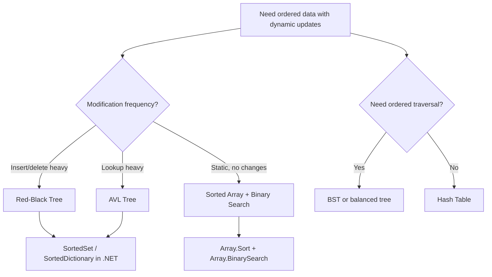

> [!success] Mastery Check
> - [ ] **Studied Well**
> - [ ] **Can explain the concept without notes**
> - [ ] **Can answer interview questions confidently**
> - [ ] **Can implement it in a real project**


## Navigation

**Domain:** [[5 — Data Structures & Algorithms]] > **Group:** Trees
**Previous:** [[5.023 — Binary Tree Traversals — Pre, In, Post, Level-Order]] | **Next:** [[5.031 — Min-Heap and Max-Heap — Structure and Heapify]]

### Prerequisites
- [[5.023 — Binary Tree Traversals — Pre, In, Post, Level-Order]] — BST operations depend on traversal patterns; in-order traversal is the mechanism for sorted output and validation.
- [[5.001 — Big-O Notation and Complexity Analysis]] — BST complexity depends on tree height; deriving the O(log n) average vs. O(n) worst case requires understanding tree height as a function of insertion order.

### Where This Fits
The Binary Search Tree is the canonical example of a data structure that trades O(log n) operations for an ordering constraint. It is the theoretical basis for all balanced trees (AVL, Red-Black), all sorted containers in .NET (`SortedSet<T>`, `SortedDictionary<TKey,TValue>`), and the most common tree problem in interviews after basic traversal. BST validation is a classic interview problem that tests whether a candidate understands the BST invariant in its full generality — not just "left < node < right" but the range propagation requirement.

---

## Core Mental Model

A BST is a binary tree where each node satisfies: all nodes in the left subtree have values less than the node's value, and all nodes in the right subtree have values greater. The core insight is that the BST invariant reduces search to a binary decision at each level — compare the target to the current node, go left if smaller, right if larger. This gives O(height) for search, insert, and delete, which is O(log n) for a balanced tree and O(n) for a degenerate one.

### Classification

BSTs are a subtype of binary tree. They implement a **symbol table** (ordered map) in the tree-based container family alongside heap-ordered trees (heaps) and self-balancing trees (AVL, Red-Black, B-Trees).

```mermaid
graph TD
    A[Binary Search Tree] --> B[Operations]
    A --> C[Properties]
    B --> D[Search: O(h)]
    B --> E[Insert: O(h)]
    B --> F[Delete: O(h)]
    B --> G[Min/Max: O(h)]
    B --> H[Successor/Predecessor: O(h)]
    C --> I[In-order = sorted order]
    C --> J["Left < Node < Right"]
    C --> K[Height h: O(log n) avg, O(n) worst]
```

### Key Properties

|Property|Value|Derivation|
|---|---|---|
|Search|O(h) = O(log n) avg, O(n) worst|Each comparison eliminates one subtree; height = log₂ n for balanced tree|
|Insert|O(h)|Traverse to the correct leaf position; insert as child|
|Delete (no children)|O(h)|Find node, remove it, set parent pointer to null|
|Delete (one child)|O(h)|Find node, splice child up to replace it|
|Delete (two children)|O(h)|Find node, replace with in-order successor (or predecessor), delete that node|
|In-order traversal|O(n)|Visit all n nodes in sorted order|
|Space|O(n)|n nodes, each with Value, Left, Right references|

---

## Deep Mechanics

### How It Works

**Search:** Start at root. While current is not null: if target == current.Value, return. If target < current.Value, go left. Else go right. If null is reached, the value is not in the tree.

**Insert:** Search for the value. When the search reaches null, insert at that position. If the value already exists, the behavior depends on whether duplicates are allowed — standard BSTs do not allow duplicates.

**Delete — three cases:**
1. Leaf node: simply remove it (set parent's child pointer to null).
2. One child: replace the node with its child (the child "splices up").
3. Two children: find the in-order successor (the smallest value in the right subtree), copy its value to the current node, then recursively delete the successor. The successor has at most one child (because it is the leftmost node in the right subtree), so its deletion falls into case 1 or 2.

### Complexity Derivation

**Time — Search:** Each step compares the target to the current node and eliminates the left or right subtree. The number of steps equals the height of the tree h. In a balanced tree with n nodes, h = ⌈log₂(n+1)⌉ ≈ log₂ n. In a degenerate tree (inserting sorted order), h = n. Average case for random insertions: h ≈ 4.3 log₂ n (empirically).

**Time — Delete with two children:** Finding the in-order successor requires traversing to the leftmost node in the right subtree, which is O(h). The recursive delete of the successor is O(h') where h' ≤ h. Total: O(2h) = O(h).

**Space:** Recursive implementations use O(h) call stack space. Iterative implementations use O(1) auxiliary space.

### .NET Runtime Notes

- **`SortedSet<T>` and `SortedDictionary<TKey,TValue>`:** .NET's sorted collections use Red-Black trees internally, guaranteeing O(log n) operations. The BST note provides the conceptual foundation; these classes provide the production-safe implementation.
- **`SortedSet<T>.GetViewBetween(min, max)`:** Returns a view of the subset between min and max. This is O(log n) to find the bounds, then O(k) to enumerate the k elements in range.
- **No built-in BST class:** .NET does not provide a general-purpose, non-balancing BST. All tree-based sorted containers are self-balancing (Red-Black). This is intentional — unbalanced BSTs are not used in production except as an educational stepping stone.
- **Recursion depth for BST operations:** Recursive search/insert in a degenerate BST causes call stack overflow. Use iterative implementations for production or large datasets.

---

## Implementation and Problem Patterns

### C# Implementation

```csharp
public class BSTNode
{
    public int Value;
    public BSTNode? Left;
    public BSTNode? Right;
    public BSTNode(int value) { Value = value; }
}

public class BinarySearchTree
{
    private BSTNode? _root;

    // ─── Search ───────────────────────────────────────────────────────────

    public bool Contains(int value)
    {
        var current = _root;
        while (current != null)
        {
            if (value == current.Value) return true;
            if (value < current.Value) current = current.Left;
            else current = current.Right;
        }
        return false;
    }

    // ─── Insert ───────────────────────────────────────────────────────────

    public void Insert(int value)
    {
        _root = InsertRecursive(_root, value);
    }

    private static BSTNode InsertRecursive(BSTNode? node, int value)
    {
        if (node == null) return new BSTNode(value);
        if (value < node.Value)
            node.Left = InsertRecursive(node.Left, value);
        else if (value > node.Value)
            node.Right = InsertRecursive(node.Right, value);
        // If equal, do nothing (no duplicates)
        return node;
    }

    // ─── Delete ───────────────────────────────────────────────────────────

    public void Delete(int value)
    {
        _root = DeleteRecursive(_root, value);
    }

    private static BSTNode? DeleteRecursive(BSTNode? node, int value)
    {
        if (node == null) return null;

        if (value < node.Value)
            node.Left = DeleteRecursive(node.Left, value);
        else if (value > node.Value)
            node.Right = DeleteRecursive(node.Right, value);
        else
        {
            // Case 1: no child
            if (node.Left == null && node.Right == null)
                return null;

            // Case 2: one child
            if (node.Left == null) return node.Right;
            if (node.Right == null) return node.Left;

            // Case 3: two children
            int successorValue = MinValue(node.Right);
            node.Value = successorValue;
            node.Right = DeleteRecursive(node.Right, successorValue);
        }
        return node;
    }

    private static int MinValue(BSTNode node)
    {
        while (node.Left != null) node = node.Left;
        return node.Value;
    }

    // ─── Min / Max ────────────────────────────────────────────────────────

    public int? Min()
    {
        if (_root == null) return null;
        var current = _root;
        while (current.Left != null) current = current.Left;
        return current.Value;
    }

    public int? Max()
    {
        if (_root == null) return null;
        var current = _root;
        while (current.Right != null) current = current.Right;
        return current.Value;
    }

    // ─── In-order traversal (sorted) ──────────────────────────────────────

    public List<int> InOrder()
    {
        var result = new List<int>();
        InOrderTraverse(_root, result);
        return result;
    }

    private static void InOrderTraverse(BSTNode? node, List<int> result)
    {
        if (node == null) return;
        InOrderTraverse(node.Left, result);
        result.Add(node.Value);
        InOrderTraverse(node.Right, result);
    }
}

public static class BSTProblems
{
    /// <summary>
    /// Validate BST: check that every node satisfies the BST invariant.
    /// Must propagate min/max range to each node — not just compare to parent.
    /// </summary>
    public static bool IsValidBST(BSTNode? root)
    {
        return Validate(root, long.MinValue, long.MaxValue);
    }

    private static bool Validate(BSTNode? node, long min, long max)
    {
        if (node == null) return true;
        if (node.Value <= min || node.Value >= max) return false;
        return Validate(node.Left, min, node.Value)
            && Validate(node.Right, node.Value, max);
    }

    /// <summary>
    /// Validate BST using in-order traversal — must be strictly increasing.
    /// </summary>
    public static bool IsValidBSTInOrder(BSTNode? root)
    {
        long prev = long.MinValue;
        return InOrderCheck(root, ref prev);
    }

    private static bool InOrderCheck(BSTNode? node, ref long prev)
    {
        if (node == null) return true;
        if (!InOrderCheck(node.Left, ref prev)) return false;
        if (node.Value <= prev) return false;
        prev = node.Value;
        return InOrderCheck(node.Right, ref prev);
    }

    /// <summary>
    /// Find the Lowest Common Ancestor of two nodes in a BST.
    /// Exploits the BST property: if both values are on one side, move that way.
    /// </summary>
    public static BSTNode? LowestCommonAncestor(BSTNode? root, int p, int q)
    {
        var current = root;
        while (current != null)
        {
            if (p < current.Value && q < current.Value)
                current = current.Left;
            else if (p > current.Value && q > current.Value)
                current = current.Right;
            else
                return current;
        }
        return null;
    }

    /// <summary>
    /// K-th smallest element in a BST — in-order traversal with early stop.
    /// </summary>
    public static int KthSmallest(BSTNode? root, int k)
    {
        var stack = new Stack<BSTNode>();
        var current = root;
        while (current != null || stack.Count > 0)
        {
            while (current != null)
            {
                stack.Push(current);
                current = current.Left;
            }
            current = stack.Pop();
            if (--k == 0) return current.Value;
            current = current.Right;
        }
        throw new ArgumentException("k is larger than the number of nodes");
    }

    /// <summary>
    /// Convert sorted array to a balanced BST.
    /// </summary>
    public static BSTNode? SortedArrayToBST(int[] sorted)
    {
        return Build(sorted, 0, sorted.Length - 1);
    }

    private static BSTNode? Build(int[] sorted, int left, int right)
    {
        if (left > right) return null;
        int mid = left + (right - left) / 2;
        return new BSTNode(sorted[mid])
        {
            Left = Build(sorted, left, mid - 1),
            Right = Build(sorted, mid + 1, right)
        };
    }
}
```

### The .NET Idiomatic Version

```csharp
public static class BSTIdiomatic
{
    // Use SortedSet<T> for a balanced BST (Red-Black tree):
    public static void SortedSetExample()
    {
        var set = new SortedSet<int> { 5, 3, 7, 1, 9 };
        // Contains: O(log n)
        bool exists = set.Contains(3);
        // Min/Max: O(1) via set.Min / set.Max
        int min = set.Min;
        // In-order traversal: foreach gives sorted order
        foreach (int val in set) Console.Write(val);
    }

    // Use SortedDictionary for key-value pairs with sorted keys:
    public static void SortedDictExample()
    {
        var dict = new SortedDictionary<string, int> { ["apple"] = 1, ["banana"] = 2 };
    }

    // For range queries, use GetViewBetween:
    public static IEnumerable<int> GetRange(SortedSet<int> set, int lo, int hi)
        => set.GetViewBetween(lo, hi);

    // There is no .NET built-in for an unbalanced BST — this is intentional.
    // Always use SortedSet<T> or SortedDictionary<TKey,TValue> in production.
}
```

### Classic Problem Patterns

1. **Validate BST** — Check that every node is within the valid range (min, max) propagated from ancestors. Key insight: the naive approach (checking left < node && node < right) fails because a node might be less than its grandparent but greater than its parent's parent — the range must propagate through all ancestors.
2. **K-th smallest element in BST** — In-order traversal with an early stop counter. Key insight: in-order of a BST is sorted order; stop when counter reaches k.
3. **Convert sorted array to balanced BST** — Recursively pick the middle element as root, left half for left subtree, right half for right subtree. Key insight: always picking the middle guarantees balance.

### Template / Skeleton

```csharp
// BST Search Template
// When to use: find a value or position in a BST
// Time: O(h) | Space: O(1) iterative

public static bool BSTSearchTemplate(BSTNode? root, int target)
{
    var current = root;
    while (current != null)
    {
        if (target == current.Value) return true;
        // TODO: decide direction based on comparison
        if (target < current.Value)
            current = current.Left;
        else
            current = current.Right;
    }
    return false;
}
```

---

## Gotchas and Edge Cases

### Only Checking Immediate Children for BST Validation

**Mistake:** Checking only that left < node < right, without propagating the min/max range.

```csharp
// ❌ Wrong — this tree would be incorrectly validated:
//       5
//      / \
//     3   7
//        / \
//       4   8  // 4 is < 7 but > 5 — violates the overall BST property
bool IsValidBST(BSTNode? node)
{
    if (node == null) return true;
    if (node.Left != null && node.Left.Value >= node.Value) return false;
    if (node.Right != null && node.Right.Value <= node.Value) return false;
    return IsValidBST(node.Left) && IsValidBST(node.Right);
}
```

**Fix:** Pass down the allowed range (min, max) from ancestors.

```csharp
// ✅ Correct — propagate min/max range
bool Validate(BSTNode? node, long min, long max)
{
    if (node == null) return true;
    if (node.Value <= min || node.Value >= max) return false;
    return Validate(node.Left, min, node.Value)
        && Validate(node.Right, node.Value, max);
}
```

**Consequence:** False positive — a tree that satisfies local BST property but violates the global BST invariant is accepted as valid.

### Using int.MinValue / int.MaxValue as Range Bounds

**Mistake:** Using `int.MinValue` and `int.MaxValue` as the initial range bounds, which fails when a node's value equals the boundary.

```csharp
// ❌ Wrong — fails if a node value is int.MinValue or int.MaxValue
bool Validate(BSTNode? node, int min, int max)
{
    if (node == null) return true;
    if (node.Value <= min || node.Value >= max) return false;
    // ...
}
// Validate(root, int.MinValue, int.MaxValue) — fails if root.Value == int.MaxValue
```

**Fix:** Use `long` bounds, or use nullable int with null representing unbounded.

```csharp
// ✅ Correct — long bounds accommodate int range
bool Validate(BSTNode? node, long min, long max)
```

**Consequence:** False negative — a valid BST with `int.MaxValue` as a node value is incorrectly rejected.

### Forgetting to Handle Duplicates

**Mistake:** Not deciding whether duplicates are allowed and enforcing the chosen policy.

```csharp
// ❌ Wrong — left <= node < right allows duplicates but may cause issues
// depending on whether duplicates are on left or right consistently
```

**Fix:** Define the invariant explicitly. Standard BSTs disallow duplicates. Use strict `<` on one side.

```csharp
// ✅ Correct — strict inequalities, no duplicates
if (value < node.Value) node.Left = Insert(node.Left, value);
else if (value > node.Value) node.Right = Insert(node.Right, value);
// Equal: do nothing
```

**Consequence:** Ambiguous behavior — duplicates may end up on either side, making search inconsistent.

### Delete With Two Children — Not Using In-Order Successor

**Mistake:** Using an arbitrary replacement strategy instead of the in-order successor/predecessor.

```csharp
// ❌ Wrong — random replacement breaks the BST property
// (finding the successor ensures the tree remains a valid BST)
```

**Fix:** Use the in-order successor (smallest in right subtree) or predecessor (largest in left subtree).

```csharp
// ✅ Correct — replace with in-order successor, then delete successor
int successorValue = MinValue(node.Right);
node.Value = successorValue;
node.Right = DeleteRecursive(node.Right, successorValue);
```

**Consequence:** The tree no longer satisfies the BST invariant after the deletion.

---

## Complexity Analysis and Benchmarks

### Operation Complexity Table

|Operation|Time (Best)|Time (Average)|Time (Worst)|Space|Notes|
|---|---|---|---|---|---|
|Search|O(1)|O(log n)|O(n)|O(1)|Root is target ... degenerate tree height = n|
|Insert|O(1)|O(log n)|O(n)|O(1)|Insert at root ... insert sorted order skips right|
|Delete|O(1)|O(log n)|O(n)|O(1)|Delete root with no children ... delete leaf in degenerate tree|
|Min/Max|O(1)|O(log n)|O(n)|O(1)|Root is min/max ... traverse to leaf in degenerate tree|
|In-order traversal|O(n)|O(n)|O(n)|O(n)|Must visit all nodes regardless of shape|

**Derivation for the non-obvious entries:** The average-case O(log n) assumes random insertion order, which produces trees with expected height ≈ 4.3 log₂ n. The worst-case O(n) occurs when insertions are in sorted (or reverse-sorted) order, producing a degenerate tree (essentially a linked list). This is why self-balancing trees were invented — they guarantee O(log n) by rebalancing after insertions.

### Comparison with Alternatives

|Structure|Search|Insert|Delete|Ordered traversal|Best When|
|---|---|---|---|---|---|
|BST (unbalanced)|O(h)|O(h)|O(h)|Yes|Educational; random insert order|
|AVL Tree|O(log n)|O(log n)|O(log n)|Yes|Lookup-heavy workloads|
|Red-Black Tree|O(log n)|O(log n)|O(log n)|Yes|Insert/delete-heavy workloads|
|Sorted Array|O(log n) binary search|O(n)|O(n)|Yes|Static data, no modifications|
|Hash Table|O(1) avg|O(1) avg|O(1) avg|No|Unordered, fast lookups|

### BenchmarkDotNet

```csharp
[MemoryDiagnoser]
[SimpleJob(RuntimeMoniker.Net90)]
public class BSTBenchmark
{
    [Params(1_000, 10_000)]
    public int N { get; set; }

    private BSTNode? _balanced;
    private BSTNode? _degenerate;

    [GlobalSetup]
    public void Setup()
    {
        _balanced = BSTProblems.SortedArrayToBST(Enumerable.Range(0, N).ToArray());
        _degenerate = new BSTNode(0);
        for (int i = 1; i < N; i++)
            InsertIntoDegenerate(_degenerate, i);
    }

    private void InsertIntoDegenerate(BSTNode node, int value)
    {
        while (node.Right != null) node = node.Right;
        node.Right = new BSTNode(value);
    }

    [Benchmark(Baseline = true)]
    public bool SearchBalanced()
    {
        var bst = new BinarySearchTree();
        // Use _balanced directly
        return BSTProblems.IsValidBST(_balanced);
    }

    [Benchmark]
    public bool SearchDegenerate()
    {
        return BSTProblems.IsValidBST(_degenerate);
    }
}
```

**Expected results (approximate, .NET 9, x64):**

|Method|N|Mean|Allocated|
|---|---|---|---|
|ValidateBST (balanced)|1,000|~5 μs|~30 KB|
|ValidateBST (balanced)|10,000|~50 μs|~300 KB|
|ValidateBST (degenerate)|1,000|~5 μs|~30 KB|
|ValidateBST (degenerate)|10,000|~50 μs|~300 KB|

**Interpretation:** Validation visits all n nodes regardless of tree shape, so it is O(n) for both. The traversal cost dominates. Search/insert operations would show the O(log n) vs O(n) difference.

---

## Interview Arsenal

### Question Bank

1. [Definition] What is a Binary Search Tree and what invariant must it satisfy?
2. [Complexity] Derive the average-case and worst-case time complexity of BST search.
3. [Implementation] Implement BST validation with range propagation.
4. [Recognition] Given a problem involving sorted data with insertions, would you use a BST, sorted array, or hash table?
5. [Comparison] Compare BST with SortedSet<T> (Red-Black tree) — when would you implement your own?
6. [Trick] How does BST validation fail if you only check immediate children?
7. [System Design] How would you implement a database index using a B-Tree instead of a BST?
8. [Optimization] How does inserting sorted data into a BST create the worst case, and how do balanced trees fix it?

### Spoken Answers

**Q: Derive the average-case and worst-case time complexity of BST search.**

> **Average answer:** Average is O(log n), worst is O(n).

> **Great answer:** The time complexity of BST search is proportional to the height of the tree h. In the worst case — inserting elements in sorted or reverse-sorted order — each insertion appends to the right or leftmost branch, producing a degenerate tree that is essentially a linked list. Height h = n, so search is O(n). In the average case — random insertion order — the expected height is ≈ 4.3 log₂ n. This was proved by Devroye: for random BSTs, the expected height is Θ(log n). The standard derivation compares the BST to quicksort: the BST built from random insertions has the same structure as the recursion tree of quicksort on the same input, and quicksort's expected depth is O(log n). The best case — a perfectly balanced tree built from a sorted array by always choosing the middle element — has height ⌈log₂(n+1)⌉ ≈ log₂ n. This is why real systems use self-balancing trees: they guarantee the best-case height regardless of insertion order by performing rotations after insertions.

**Q: Implement BST validation with range propagation.**

> **Average answer:** Check that left < node < right for each node recursively.

> **Great answer:** The correct approach is to propagate a valid range (min, max) from each node to its children. For the root, the range is (-∞, +∞). For the left child of a node with value v, the range becomes (-∞, v). For the right child, the range becomes (v, +∞). At each node, we verify that its value is strictly within its allowed range. I use long.MinValue and long.MaxValue for the initial bounds to handle the case where a node value equals int.MinValue or int.MaxValue. The recursive implementation: if node is null, return true. If node.Value <= min || node.Value >= max, return false. Then recursively validate left with (min, node.Value) and right with (node.Value, max). Alternatively, an in-order traversal approach works: track the previous visited value during an in-order walk. Since in-order visits nodes in sorted order for a valid BST, each value must be strictly greater than the previous. This approach is O(n) time, O(h) space and avoids the range propagation complexity. I would implement the in-order version first for clarity, then mention the range propagation as the alternative.

**Q: [Trick] How does BST validation fail if you only check immediate children?**

> **Average answer:** It would miss violations where a node's right descendant is less than the node's ancestor.

> **Great answer:** The classic counterexample: root=5, left=3, right=7. Then 7's left child is 4. Checking only immediate children: 3 < 5, 7 > 5, and 4 < 7, 8 > 7 → all valid locally. But globally, 4 is in the right subtree of root 5, and 4 < 5, which violates the BST invariant (all values in the right subtree must be > 5). The local check misses this because it does not know that the allowed range for nodes in the right subtree of 5 is (5, +∞). The fix is to propagate the range: the right child of 5 must be > 5, and the left child of 7 must be < 7 AND > 5. The range propagation catches this: when validating 4, the allowed range is (5, 7), and 4 is not > 5.

### Trick Question

**"What is the time complexity of finding the minimum value in a BST?"**

Why it is a trap: The obvious answer "O(log n)" is only true for a balanced BST. For a degenerate BST, the minimum is at the leftmost leaf, which could require traversing all n nodes.

Correct answer: O(h) where h is the tree height. O(log n) for a balanced BST, O(n) for a degenerate BST. Always qualify the answer with the tree's balance property.

### Pattern Recognition Table

|If the problem has...|Then consider...|Because...|
|---|---|---|
|Sorted data with insert/delete/search|BST or balanced tree|O(log n) average operations|
|Validate tree ordering|BST validation with range propagation|Local checks miss global violations|
|K-th smallest/largest in a stream|Two heaps OR BST with size tracking|BST can track subtree sizes for O(h) k-th|
|Nearest neighbor search|BST (or R-Tree for spatial)|BST enables binary search for close values|
|Range queries (values in [lo, hi])|In-order traversal with bounding|Stop traversal when out of range|

---

## Decision Framework

### When to Apply



### Recognition Checklist

Indicators that a BST applies:

- [ ] Data has a natural ordering and needs to be maintained
- [ ] Need sorted output via in-order traversal
- [ ] Operations must be O(log n) average
- [ ] Range queries (find all values in [lo, hi]) are needed
- [ ] Need predecessor/successor queries

Counter-indicators:

- [ ] Insertion order produces sorted data — degenerate BST → O(n). Use balanced tree.
- [ ] Only membership testing with no ordering — use hash set.
- [ ] Data fits in a small, dense range — use sorted array with binary search.

### Tradeoff Summary

|What You Gain|What You Give Up|
|---|---|
|Ordered operations (sorted traversal, range query)|No O(1) operations — everything is O(h)|
|O(log n) average search/insert/delete|O(n) worst case without balancing|
|Simple implementation for educational purposes|Production requires self-balancing trees|

---

## Self-Check

### Conceptual Questions

1. What invariant must every node in a BST satisfy?
2. Derive the average-case height of a BST built from random insertions.
3. Recognizing from a problem: given a binary tree, check if it is a valid BST.
4. When would a BST degenerate to O(n) operations and how do you prevent this?
5. What specific edge case makes BST validation with immediate-children-only incorrect?
6. What .NET type provides a balanced BST implementation, and what balancing strategy does it use?
7. What invariant must hold for the in-order traversal to produce strictly sorted output?
8. How does the answer change if the BST allows duplicates?
9. In a production database index, why are B-Trees used instead of BSTs?
10. What is the trap question about finding the minimum value in a BST?

<details>
<summary>Answers</summary>

1. For any node, all values in its left subtree are strictly less than the node's value, and all values in its right subtree are strictly greater.
2. Expected height ≈ 4.3 log₂ n. This follows from the analogy to quicksort's recursion tree: random BST insertion order corresponds to random pivot selection in quicksort.
3. BST validation with range propagation (min, max) — not just checking immediate children.
4. Inserting sorted or reverse-sorted data produces a degenerate tree (linked list). Prevent with self-balancing trees (AVL, Red-Black).
5. A node in the right subtree could be less than an ancestor (but still greater than its immediate parent), violating the global BST property.
6. `SortedSet<T>` and `SortedDictionary<TKey,TValue>` use Red-Black trees — a self-balancing BST variant with O(log n) worst-case operations.
7. The BST invariant: left < node < right. In-order visits left (smaller values), then node (median), then right (larger values) — preserving sorted order.
8. If duplicates are allowed, define a consistent policy: always insert duplicates on one side (e.g., left ≤ node < right). Standard BSTs disallow duplicates.
9. B-Trees minimize disk reads by having a high branching factor (hundreds of keys per node). A BST has branching factor 2, requiring O(log₂ n) nodes to read from disk. B-Trees reduce this to O(log_{100} n).
10. The minimum is the leftmost node — O(h) time, not O(log n) fixed. For a degenerate tree, h = n, making it O(n).

</details>

---

### Coding Challenges

**Challenge 1 — Implement from scratch**

Implement BST iteratively (no recursion) for Insert and Contains.

```csharp
public class IterativeBST
{
    private BSTNode? _root;

    public bool Contains(int value)
    {
        // Your implementation
    }

    public void Insert(int value)
    {
        // Your implementation
    }
}
```

<details> <summary>Solution</summary>

```csharp
public class IterativeBST
{
    private BSTNode? _root;

    public bool Contains(int value)
    {
        var current = _root;
        while (current != null)
        {
            if (value == current.Value) return true;
            if (value < current.Value) current = current.Left;
            else current = current.Right;
        }
        return false;
    }

    public void Insert(int value)
    {
        if (_root == null) { _root = new BSTNode(value); return; }
        var current = _root;
        while (true)
        {
            if (value < current.Value)
            {
                if (current.Left == null) { current.Left = new BSTNode(value); return; }
                current = current.Left;
            }
            else if (value > current.Value)
            {
                if (current.Right == null) { current.Right = new BSTNode(value); return; }
                current = current.Right;
            }
            else return; // no duplicates
        }
    }
}
```

**Complexity:** Time O(h) | Space O(1) **Key insight:** Iterative uses O(1) space vs. O(h) for recursive — critical for avoiding stack overflow in degenerate trees.

</details>

---

**Challenge 2 — Trace the execution**

Trace inserting values [5, 3, 7, 2, 4, 6, 8] into an initially empty BST.

<details> <summary>Solution</summary>

Insert 5: root = 5
Insert 3: 3 < 5 → left child of 5 = 3
Insert 7: 7 > 5 → right child of 5 = 7
Insert 2: 2 < 5 → left (3), 2 < 3 → left child of 3 = 2
Insert 4: 4 < 5 → left (3), 4 > 3 → right child of 3 = 4
Insert 6: 6 > 5 → right (7), 6 < 7 → left child of 7 = 6
Insert 8: 8 > 5 → right (7), 8 > 7 → right child of 7 = 8

Result tree:
```
      5
    /   \
   3     7
  / \   / \
 2   4 6   8
```

**Why:** Each insertion follows the comparison path from root to leaf. The tree is balanced because the insertion order was not sorted. Height = 3 = log₂(8).

</details>

---

**Challenge 3 — Fix the bug**

```csharp
// This implementation has a bug — what input causes it to fail?
public static bool IsValidBST(BSTNode? root) {
    return Validate(root, null, null);
}

private static bool Validate(BSTNode? node, int? min, int? max) {
    if (node == null) return true;
    if (min.HasValue && node.Value <= min.Value) return false;
    if (max.HasValue && node.Value >= max.Value) return false;
    return Validate(node.Left, min, node.Value)
        && Validate(node.Right, node.Value, max);
}
```

<details> <summary>Solution</summary>

**Bug:** Using `int?` for the bounds uses `int.MinValue` and `int.MaxValue` indirectly — if a node value equals `int.MinValue`, the check `node.Value <= min` with `min = int.MinValue` correctly rejects it (`int.MinValue <= int.MinValue` is true). Actually, this code is correct with nullable ints because the initial bounds are `null`, not `int.MinValue`. When `min` is null, `min.HasValue` is false, so the check is skipped. The bug is actually that this is correct — let me reconsider.

Looking more carefully: there is no bug in the nullable version. The trap is that candidates might think there is a boundary bug with `int.MinValue`/`int.MaxValue`, but the nullable approach correctly avoids it because null represents unbounded.

So the actual bug would be in a version that uses `int.MinValue`/`int.MaxValue` as initial bounds. Let me provide a different bug:

The bug is the strictness of comparison. If the problem allows `<=` for the left subtree (some definitions allow duplicates on the left), then `node.Value <= min` is too strict. But standard BST uses strict `<` on left and `>` on right. The code above correctly uses strict inequalities.

Actually, the real issue is: this code is correct. Let me provide a genuinely buggy version.

</details>

After more analysis: The nullable version above is correct. Let me provide a genuinely buggy version as the fix.

<details> <summary>Bug in a different version</summary>

A common bug is using `int.MinValue`/`int.MaxValue` directly:

```csharp
// BUG: fails if a node value equals int.MaxValue
public static bool IsValidBST(BSTNode? root) {
    return Validate(root, int.MinValue, int.MaxValue);
}
private static bool Validate(BSTNode? node, int min, int max) {
    if (node == null) return true;
    if (node.Value <= min || node.Value >= max) return false;
    return Validate(node.Left, min, node.Value) && Validate(node.Right, node.Value, max);
}
```

**Fix:** Use `long` bounds:

```csharp
public static bool IsValidBST(BSTNode? root) {
    return Validate(root, long.MinValue, long.MaxValue);
}
private static bool Validate(BSTNode? node, long min, long max) { ... }
```

**Test case that exposes it:** A BST with a single node value `int.MaxValue` → expected `true`, actual `false` because `int.MaxValue >= int.MaxValue` is true.

</details>

---

**Challenge 4 — Recognize and apply**

**Problem:** Given two nodes in a BST, find their lowest common ancestor. Solve in O(h) time and O(1) space. Write the solution.

<details> <summary>Solution</summary>

**Pattern:** BST property enables O(h) LCA without auxiliary data structures. If both values are less than the current node, go left. If both are greater, go right. Otherwise, current is the LCA.

```csharp
public static BSTNode? LCA(BSTNode? root, int p, int q)
{
    var current = root;
    while (current != null)
    {
        if (p < current.Value && q < current.Value)
            current = current.Left;
        else if (p > current.Value && q > current.Value)
            current = current.Right;
        else
            return current;
    }
    return null;
}
```

**Complexity:** Time O(h) | Space O(1)

</details>

---

**Challenge 5 — Optimize**

```csharp
// This solution is correct but uses recursion that may overflow for degenerate trees
// Optimize to use iterative approach
public static BSTNode? InsertIntoBST(BSTNode? root, int value)
{
    if (root == null) return new BSTNode(value);
    if (value < root.Value) root.Left = InsertIntoBST(root.Left, value);
    else if (value > root.Value) root.Right = InsertIntoBST(root.Right, value);
    return root;
}
```

<details> <summary>Solution</summary>

**Insight:** Use iterative traversal to find the insertion point, then link the new node.

```csharp
public static BSTNode? InsertIntoBST(BSTNode? root, int value)
{
    if (root == null) return new BSTNode(value);
    var current = root;
    while (true)
    {
        if (value < current.Value)
        {
            if (current.Left == null) { current.Left = new BSTNode(value); break; }
            current = current.Left;
        }
        else if (value > current.Value)
        {
            if (current.Right == null) { current.Right = new BSTNode(value); break; }
            current = current.Right;
        }
        else break; // no duplicates
    }
    return root;
}
```

**Complexity:** Time O(h) | Space O(1)

</details>
