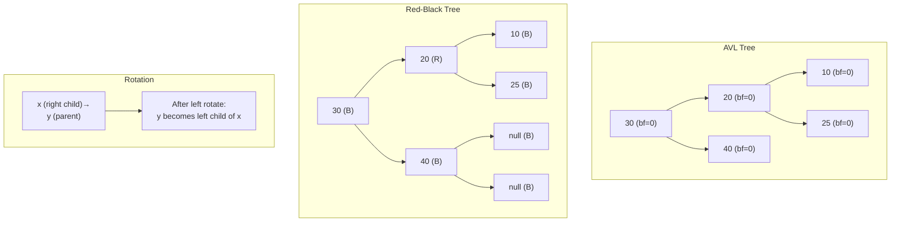

> [!success] Mastery Check
> - [ ] **Studied Well**
> - [ ] **Can explain the concept without notes**
> - [ ] **Can answer interview questions confidently**
> - [ ] **Can implement it in a real project**


## Navigation

**Domain:** [[5 — Data Structures & Algorithms]] > **Group:** Trees
**Previous:** [[5.024 — Binary Search Tree — Operations and Validation]] | **Next:** [[5.026 — Tries — Prefix Trees]]

### Prerequisites
- [[5.024 — Binary Search Tree — Operations and Validation]] — balanced BSTs are BSTs with a self-balancing mechanism; understanding BST operations (insert, delete, search) and the degeneration problem is required.

### Where This Fits
A plain BST degenerates to O(n) height when elements are inserted in sorted order. Balanced BSTs solve this by enforcing a **balance invariant** that keeps the height O(log n) through rotations after insertions and deletions. The two canonical balanced BSTs — AVL and Red-Black — differ in their strictness: AVL enforces tighter balance (faster lookups, slower inserts/deletes), while Red-Black allows more slack (faster inserts/deletes, slightly slower lookups). This topic is rarely tested as a full implementation in senior interviews (the code is too long), but understanding the concept is expected: what invariant each tree maintains, how rotations work, why .NET's `SortedSet<T>` and `SortedDictionary<TKey,TValue>` use Red-Black trees, and when to choose a balanced BST over a hash map.

---

## Core Mental Model

A balanced BST maintains O(log n) height by enforcing a local invariant at every node. AVL tracks the height difference between left and right subtrees (balance factor -1, 0, or +1) and performs rotations when it exceeds this range. Red-Black uses color flags (red or black) and five structural rules (no consecutive reds, equal black height on all paths) to guarantee the longest path is at most twice the shortest. Both use the same rotation primitives (left rotate, right rotate) — just different triggers for when to apply them.

### Classification

Balanced BSTs are **self-balancing binary search trees** in the **comparison-based ordered data structure** family. They implement the same API as BSTs (insert, delete, search, traversal) with O(log n) guaranteed worst-case.



### Key Properties

|Property|Unbalanced BST|AVL Tree|Red-Black Tree|
|---|---|---|---|
|Height in worst case|O(n)|~1.44 log₂(n)|~2 log₂(n)|
|Search|O(n)|O(log n)|O(log n)|
|Insert|O(n)|O(log n)|O(log n)|
|Delete|O(n)|O(log n)|O(log n)|
|Space per node|3 pointers|3 ptrs + balance factor (int)|3 ptrs + color (bool)|
|Rotations per insert|0|≤ 2|≤ 2|
|Rotations per delete|0|O(log n)|≤ 3|

---

## Deep Mechanics

### How It Works

**AVL balance factor:** After every insert/delete, walk up from the modified node to the root, recomputing each node's height as `1 + max(left.height, right.height)`. The balance factor is `left.height - right.height`. If it is outside [-1, +1], perform a rotation:

|Balance Factor Pattern|Rotation|
|---|---|
|Left-Left (bf > 1, left child's bf ≥ 0)|Right rotate|
|Right-Right (bf < -1, right child's bf ≤ 0)|Left rotate|
|Left-Right (bf > 1, left child's bf < 0)|Left rotate on left child, then right rotate on parent|
|Right-Left (bf < -1, right child's bf > 0)|Right rotate on right child, then left rotate on parent|

**Red-Black rules:**
1. Every node is red or black.
2. The root is always black.
3. Leaves (null children) are considered black.
4. Red nodes cannot have red children (no consecutive reds).
5. Every path from root to a null leaf has the same number of black nodes (black height).

After an insert (new node is always red):
- If the parent is black: no violation — done.
- If the parent is red (violates rule 4): fix by recoloring and/or rotating based on the uncle's color.
- **Red uncle:** Recolor parent, uncle, and grandparent; continue checking from grandparent upward.
- **Black uncle (or null):** Rotate (same four patterns as AVL) and recolor.

**Rotation mechanics:**
- **Left rotate at x:** x's right child y becomes the new root of this subtree. x becomes y's left child. y's left child becomes x's right child.
- **Right rotate at y:** Symmetric — y's left child x becomes the new root. y becomes x's right child. x's right child becomes y's left child.

Both rotations are O(1) pointer changes that preserve BST ordering and change the height distribution.

### Complexity Derivation

**AVL height:** The minimum node count in an AVL tree of height h follows the Fibonacci-like recurrence: N(h) = N(h-1) + N(h-2) + 1. Solving gives h ≤ 1.44 log₂(N) — the strictest balance among practical BSTs.

**Red-Black height:** The rules guarantee that the longest path (alternating red-black) is at most twice the shortest path (all black). Proof: rule 4 prevents consecutive reds, and rule 5 ensures equal black height. The longest path is at most 2 × black height, so height ≤ 2 log₂(N + 1).

**Rotations:** AVL requires O(log n) rotations during delete (walking up to rebalance), but only ≤ 2 rotations during insert. Red-Black requires ≤ 2 rotations for insert and ≤ 3 for delete — the recolorings propagate up but the rotations are bounded at a constant.

### .NET Runtime Notes

- `SortedSet<T>` and `SortedDictionary<TKey,TValue>` in .NET are implemented as **Red-Black trees**.
- `SortedDictionary<TKey,TValue>` requires O(log n) for insert, delete, and lookup. It is the standard choice when ordered traversal is needed.
- The Red-Black tree in .NET is not a "pure" RB tree — it uses a different implementation than CLRS. Null sentinel nodes are represented as `null` rather than a special sentinel object.
- `SortedSet<T>` implements `ISet<T>` and provides set operations (union, intersect, except) in O(n) time for already-constructed sets.
- Comparison: `SortedDictionary<TKey,TValue>` vs `Dictionary<TKey,TValue>` — the former is ordered (maintains sorted keys) with O(log n) operations; the latter is unordered with O(1) average-case and O(n) worst-case. Use `SortedDictionary` when you need ordered traversal or range queries; use `Dictionary` when order does not matter and raw speed is primary.
- The `Comparer<T>.Default` property determines the key ordering. Custom comparers can be passed to the constructor.

---

## Implementation and Problem Patterns

### C# Implementation

Full AVL implementation is lengthy but the rotation primitives and rebalancing logic are the core:

```csharp
public class AvlNode
{
    public int Value { get; set; }
    public AvlNode? Left { get; set; }
    public AvlNode? Right { get; set; }
    public int Height { get; set; } = 1;

    public AvlNode(int value) => Value = value;
}

public class AvlTree
{
    private AvlNode? _root;

    public void Insert(int value) => _root = Insert(_root, value);

    private AvlNode? Insert(AvlNode? node, int value)
    {
        if (node == null) return new AvlNode(value);

        if (value < node.Value)
            node.Left = Insert(node.Left, value);
        else if (value > node.Value)
            node.Right = Insert(node.Right, value);
        else
            return node;  // Duplicate — no insertion

        node.Height = 1 + Math.Max(GetHeight(node.Left), GetHeight(node.Right));
        return Rebalance(node);
    }

    private AvlNode? Rebalance(AvlNode node)
    {
        int balance = GetBalance(node);

        // Left-Left
        if (balance > 1 && GetBalance(node.Left) >= 0)
            return RotateRight(node);

        // Left-Right
        if (balance > 1 && GetBalance(node.Left) < 0)
        {
            node.Left = RotateLeft(node.Left!);
            return RotateRight(node);
        }

        // Right-Right
        if (balance < -1 && GetBalance(node.Right) <= 0)
            return RotateLeft(node);

        // Right-Left
        if (balance < -1 && GetBalance(node.Right) > 0)
        {
            node.Right = RotateRight(node.Right!);
            return RotateLeft(node);
        }

        return node;
    }

    private AvlNode RotateRight(AvlNode y)
    {
        var x = y.Left!;
        var t2 = x.Right;

        x.Right = y;
        y.Left = t2;

        y.Height = 1 + Math.Max(GetHeight(y.Left), GetHeight(y.Right));
        x.Height = 1 + Math.Max(GetHeight(x.Left), GetHeight(x.Right));

        return x;
    }

    private AvlNode RotateLeft(AvlNode x)
    {
        var y = x.Right!;
        var t2 = y.Left;

        y.Left = x;
        x.Right = t2;

        x.Height = 1 + Math.Max(GetHeight(x.Left), GetHeight(x.Right));
        y.Height = 1 + Math.Max(GetHeight(y.Left), GetHeight(y.Right));

        return y;
    }

    private int GetHeight(AvlNode? node) => node?.Height ?? 0;
    private int GetBalance(AvlNode? node) =>
        node == null ? 0 : GetHeight(node.Left) - GetHeight(node.Right);

    public bool Contains(int value)
    {
        var current = _root;
        while (current != null)
        {
            if (value == current.Value) return true;
            current = value < current.Value ? current.Left : current.Right;
        }
        return false;
    }
}
```

### The .NET Idiomatic Version

```csharp
// Red-Black tree (via SortedSet<T>)
var sortedSet = new SortedSet<int> { 5, 3, 7, 1, 9 };
sortedSet.Add(4);              // O(log n)
bool exists = sortedSet.Contains(7);  // O(log n)
sortedSet.Remove(3);           // O(log n)

// Ordered dictionary
var dict = new SortedDictionary<int, string>
{
    { 3, "three" },
    { 1, "one" },
    { 2, "two" }
};
// Iterates in key order: 1→one, 2→two, 3→three
foreach (var kvp in dict)
    Console.WriteLine($"{kvp.Key}: {kvp.Value}");

// Custom comparer
var byLength = new SortedDictionary<string, int>(
    Comparer<string>.Create((a, b) => a.Length.CompareTo(b.Length))
);
```

`SortedSet<T>` and `SortedDictionary<TKey,TValue>` are the idiomatic .NET balanced BSTs. Use them when you need ordered iteration, predecessor/successor queries, or range operations. Their O(log n) guarantee applies to all operations, unlike `Dictionary<TKey,TValue>` whose O(1) average masks O(n) worst-case under hash collisions.

### Classic Problem Patterns

- **Ordered data structure backing** — Balanced BSTs are the standard implementation for ordered sets and maps. Used when iteration order must match key order.
- **Range queries** — Count elements in a range, find elements above/below a threshold. A balanced BST supports O(log n) range count with subtree size augmentation.
- **Predecessor/successor queries** — Find the largest element < a given value or the smallest element > a given value. O(log n) via tree traversal.
- **Floor and ceiling in a data stream** — Maintain a balanced BST of seen values; for each new value, query the floor (largest ≤) and ceiling (smallest ≥). SortedSet<T> provides `GetViewBetween`.
- **K-th smallest element in a stream** — Augment each node with subtree size. Insert is O(log n), k-th is O(log n). This is the order-statistic tree.

### Template / Skeleton

```csharp
// Balanced BST Insert Template (AVL-style)
// When to use: implementing a self-balancing BST from scratch
// Time: O(log n) | Space: O(log n) recursion

private AvlNode? Insert(AvlNode? node, int value)
{
    if (node == null) return new AvlNode(value);

    // 1. Standard BST insert
    if (value < node.Value) node.Left = Insert(node.Left, value);
    else if (value > node.Value) node.Right = Insert(node.Right, value);
    else return node;  // TODO: Handle duplicates

    // 2. Update height
    node.Height = 1 + Math.Max(GetHeight(node.Left), GetHeight(node.Right));

    // 3. Rebalance
    return Rebalance(node);
}
```

---

## Gotchas and Edge Cases

### Confusing AVL and Red-Black Balance Criteria

**Mistake:** Stating that AVL is stricter than Red-Black without knowing why.

```csharp
// ❌ Wrong — "AVL uses color flags; Red-Black uses balance factors"
// Wrong — the reverse is true
```

**Fix:** AVL uses balance factors (height difference). Red-Black uses color flags (red/black) with the no-consecutive-reds and equal-black-height rules.

**Consequence:** Reveals a fundamental misunderstanding. In an interview, clarify: "AVL enforces a stricter balance — height difference at most 1 — giving faster lookups at the cost of more rotations during insertion/deletion. Red-Black allows the height to differ by up to a factor of 2, reducing rotation cost."

### Not Understanding Rotation Direction

**Mistake:** Performing a right rotation when a left rotation is needed, or getting the pointer reassignments wrong.

```csharp
// ❌ Wrong — x.Right should become y, not the other way
var x = y.Left;
x.Right = y;  // Should be y.Left = x.Right
```

**Fix:** Trace the rotation: "Left rotate at x means x goes down, its right child y comes up." The pivot node becomes the child of its former child.

**Consequence:** The BST property is violated — elements end up in the wrong subtree, making subsequent searches incorrect.

### Mutating Keys in a SortedDictionary

**Mistake:** Modifying a key after it has been inserted into a `SortedDictionary<TKey,TValue>`.

```csharp
// ❌ Wrong — key mutation breaks the tree ordering
var dict = new SortedDictionary<List<int>, string>();
var key = new List<int> { 1, 2, 3 };
dict[key] = "value";
key.Add(4);  // Key changed! Tree ordering is now corrupted.
```

**Fix:** Use immutable key types (int, string, record structs, or types that override Equals/GetHashCode without mutating).

**Consequence:** The Red-Black tree's ordering invariant is violated — subsequent lookups, insertions, and deletions produce undefined behavior (wrong results, infinite loops, or exceptions).

### Misunderstanding the Red-Black Fix Logic

**Mistake:** Trying to memorize all six Red-Black insertion cases instead of understanding the pattern.

```csharp
// ❌ Wrong — memorizing without understanding
// "Case 1: uncle red, recolor. Case 2: uncle black, triangle, rotate..."
```

**Fix:** Understand the two-variable logic: (1) What color is the uncle? Red → recolor and walk up. Black/null → rotate and recolor. (2) Is the new node an inside grandchild (LR or RL) or outside grandchild (LL or RR)? Inside → first rotate the parent to make it an outside case.

**Consequence:** Missing the correct fix leads to tree corruption (consecutive reds or unequal black height).

---

## Complexity Analysis and Benchmarks

### Operation Complexity Table

|Operation|BST (worst)|AVL|Red-Black|SortedSet<T>|
|---|---|---|---|---|
|Search|O(n)|O(log n)|O(log n)|O(log n)|
|Insert|O(n)|O(log n)|O(log n)|O(log n)|
|Delete|O(n)|O(log n)|O(log n)|O(log n)|
|Min/Max|O(n)|O(log n)|O(log n)|O(log n) (First/Last)|
|In-order traversal|O(n)|O(n)|O(n)|O(n) iteration|
|Space per node|3 refs + value|3 refs + 1 int + value|3 refs + 1 bool + value|≈ 40 bytes + value|

**Derivation for the non-obvious entries:** BST's O(n) is the degenerate case (sorted insertion). AVL's ~1.44 log₂(n) height is derived from the Fibonacci recurrence N(h) = N(h-1) + N(h-2) + 1. Red-Black's ~2 log₂(n) follows from the rule that the longest path (alternating red-black-black) is at most 2× the shortest (all black).

### Comparison with Alternatives

|Structure|Search|Insert|Delete|Ordered iteration|Best When|
|---|---|---|---|---|---|
|Balanced BST|O(log n)|O(log n)|O(log n)|Yes|Ordered data, range queries, predecessor/successor|
|Hash table|O(1)*|O(1)*|O(1)*|No|Fast unordered lookup, no ordering needed|
|Skip list|O(log n)*|O(log n)*|O(log n)*|Yes|Simpler concurrent implementation|
|Sorted array|O(log n)|O(n)|O(n)|Yes|Static data — no inserts/deletes|

### BenchmarkDotNet

```csharp
[MemoryDiagnoser]
[SimpleJob(RuntimeMoniker.Net90)]
public class BalancedBstBenchmark
{
    private SortedSet<int> _set = null!;
    private HashSet<int> _hashSet = null!;

    [Params(1_000, 10_000)]
    public int N { get; set; }

    [GlobalSetup]
    public void Setup()
    {
        var rng = new Random(42);
        var values = Enumerable.Range(0, N).Select(_ => rng.Next()).ToArray();
        _set = new SortedSet<int>(values);
        _hashSet = new HashSet<int>(values);
    }

    [Benchmark(Baseline = true)]
    public bool SortedSetLookup()
    {
        bool found = false;
        for (int i = 0; i < N; i++)
            found ^= _set.Contains(i);
        return found;
    }

    [Benchmark]
    public bool HashSetLookup()
    {
        bool found = false;
        for (int i = 0; i < N; i++)
            found ^= _hashSet.Contains(i);
        return found;
    }

    [Benchmark]
    public int SortedSetIterate()
    {
        int sum = 0;
        foreach (var v in _set) sum += v;
        return sum;
    }
}
```

**Expected results (approximate, .NET 9, x64):**

|Method|N|Mean|Allocated|
|---|---|---|---|
|SortedSetLookup|1,000|~8 μs|0 B|
|HashSetLookup|1,000|~3 μs|0 B|
|SortedSetLookup|10,000|~100 μs|0 B|
|HashSetLookup|10,000|~40 μs|0 B|

**Interpretation:** HashSet is ~2-3× faster for lookups due to O(1) vs O(log n). However, HashSet cannot provide ordered iteration or range queries. The benchmark demonstrates the tradeoff: choose SortedSet when ordering matters; choose HashSet when only raw lookup speed matters.

---

## Interview Arsenal

### Question Bank

1. What problem do balanced BSTs solve that plain BSTs do not?
2. Compare AVL trees and Red-Black trees — which is stricter and what are the tradeoffs?
3. Explain the Red-Black tree insertion fix: when do you recolor vs. rotate?
4. What is the maximum height of a Red-Black tree with n nodes, and why?
5. How does .NET's SortedDictionary<TKey,TValue> differ from Dictionary<TKey,TValue>?
6. What is a rotation in a BST and why does it preserve the BST property?
7. How would you find the k-th smallest element in a balanced BST?
8. When would you choose a balanced BST over a hash table in a production system?

### Spoken Answers

**Q: Compare AVL trees and Red-Black trees — which is stricter and what are the tradeoffs?**

> **Average answer:** AVL trees are more balanced. Red-Black trees are faster for inserts.

> **Great answer:** AVL trees maintain a stricter balance invariant — the height of every node's left and right subtrees differ by at most 1. This gives AVL a worst-case height of approximately 1.44 log₂(n), meaning lookups are at most 44% slower than optimal. Red-Black trees allow the height difference to be up to a factor of 2 — the longest root-to-leaf path (alternating red-black) is at most twice the shortest (all black), giving a maximum height of 2 log₂(n). The tradeoff is in operation cost: AVL performs O(log n) rotations during delete (walking up to rebalance), while Red-Black performs at most 3 rotations per delete and at most 2 per insert. For lookup-heavy workloads (search more frequent than insert/delete), AVL's stricter balance gives better average lookup time. For insert/delete-heavy workloads, Red-Black's bounded rotation count gives better write performance. .NET's SortedSet uses Red-Black trees because general-purpose collections tend to have mixed read/write workloads.

**Q: How does .NET's SortedDictionary differ from Dictionary?**

> **Average answer:** SortedDictionary is sorted; Dictionary is not.

> **Great answer:** SortedDictionary is implemented as a Red-Black tree, giving O(log n) for all operations (insert, delete, lookup) and maintaining keys in sorted order. Dictionary is implemented as a hash table with open addressing, giving O(1) average-case and O(n) worst-case operations with no ordering guarantee. The practical differences: SortedDictionary supports ordered iteration, predecessor/successor via `GetViewBetween`, and range queries; Dictionary supports faster lookups (~2-3×) and lower memory per entry. Choose SortedDictionary when you need to iterate in sorted order, find floor/ceiling entries, or perform range queries. Choose Dictionary when raw lookup speed is primary and ordering is irrelevant. There is also `SortedList<TKey,TValue>`, which uses a sorted array internally and has O(log n) lookup but O(n) insert/delete — it is more memory-efficient but slower to modify.

### Trick Question

**"A Red-Black tree is always at least as fast as an AVL tree for lookups because both have O(log n) search."**

Why it is a trap: Both have O(log n) asymptotic complexity, but the constants differ. AVL's stricter balance (1.44 log₂(n) vs 2 log₂(n)) means AVL lookups traverse fewer nodes on average — about 30% fewer for large n. For lookup-dominated workloads, AVL is meaningfully faster despite the same big-O.

Correct answer: AVL has a smaller constant factor for lookups due to stricter balance, making it faster for search-heavy workloads. Red-Black wins on insert/delete-heavy workloads due to bounded rotations.

### Pattern Recognition Table

|If the problem has...|Then consider...|Because...|
|---|---|---|
|Need ordered iteration over keys|Balanced BST (SortedSet/SortedDictionary)|In-order traversal gives sorted order at O(n)|
|Floor/ceiling queries on a dynamic set|SortedSet<T>.GetViewBetween|Balanced BST supports O(log n) predecessor/successor|
|Range count queries|BST with subtree size augmentation|Count elements ≤ value in O(log n)|
|Data stream with k-th smallest queries|Order-statistic tree|Augmented BST with subtree size supports O(log n) select|
|Concurrent sorted data|ConcurrentSkipList|Skip lists are easier to make lock-free than balanced BSTs|

---

## Decision Framework

### When to Apply

```mermaid
flowchart TD
    A[Need ordered data structure] --> B{Operations mix?}
    B -->|Lookup-heavy| C[AVL tree<br>stricter balance → faster searches]
    B -->|Insert/delete-heavy| D[Red-Black tree<br>bounded rotations → faster writes]
    B -->|General purpose| E[Red-Black tree<br>.NET SortedSet / SortedDictionary]
    B -->|Static data| F[Sorted array<br>binary search O(log n)]
    A --> G{Dynamic or static?}
    G -->|Dynamic| H[Balanced BST or skip list]
    G -->|Static| I[Sorted array]
```

### Recognition Checklist

Indicators that a balanced BST is the right choice:

- [ ] Ordered traversal is required (ascending or descending)
- [ ] Floor/ceiling queries (predecessor/successor) are needed
- [ ] Range queries (count or retrieve elements in an interval)
- [ ] The data is dynamic (insertions and deletions mixed with lookups)
- [ ] O(log n) worst-case guarantee is required (avoid hash table's O(n) worst case)

Counter-indicators — do NOT apply here:

- [ ] Only unordered insert and lookup are needed (use hash table)
- [ ] The data is small and static (use sorted array)
- [ ] Priority-based access is needed (use heap)
- [ ] The ordering is by insertion time (use linked list)

### Tradeoff Summary

|What You Gain|What You Give Up|
|---|---|
|O(log n) guaranteed worst-case operations|Higher constant factor than hash table O(1) average|
|Ordered iteration|More complex implementation than plain BST|
|Range and floor/ceiling queries|Memory overhead per node (pointers + balance/color info)|
|Predictable performance — no resizing latency|Slower than hash table for pure lookup|

---

## Self-Check

### Conceptual Questions

1. What causes a plain BST to degenerate to O(n) height?
2. What invariant does an AVL tree maintain? How is it checked?
3. What are the five properties of a Red-Black tree?
4. How does a left rotation at node x affect the tree structure?
5. What is the maximum height of an AVL tree with 1 million nodes? Of a Red-Black tree?
6. Why does .NET use Red-Black trees for SortedSet instead of AVL trees?
7. When would you use SortedDictionary over Dictionary in production?
8. What is the black height of a Red-Black tree with n nodes?
9. How many rotations can a Red-Black tree insertion require? An AVL insertion?
10. Can a Red-Black tree have a node with one red child and one black child? Why or why not?

<details>
<summary>Answers</summary>

1. Inserting elements in sorted (or reverse-sorted) order causes each new node to be appended as a chain, producing a linked list shape with height n.
2. At every node, |left.height - right.height| ≤ 1. This is checked by computing the balance factor after each insert/delete and performing rotations when it exceeds [-1, +1].
3. (1) Every node is red or black. (2) Root is black. (3) Leaves (nulls) are black. (4) No consecutive red nodes. (5) Every root-to-leaf path has the same number of black nodes.
4. x's right child y becomes the new root of x's subtree. x becomes y's left child. y's original left child becomes x's right child. The BST ordering is preserved because all values in y's left subtree are between x and y.
5. AVL: ~1.44 log₂(10⁶) ≈ 29. Red-Black: ~2 log₂(10⁶) ≈ 40. Both are O(log n) but AVL is ~30% shorter.
6. Red-Black trees have bounded rotations (≤ 2 per insert, ≤ 3 per delete) while AVL can require O(log n) rotations per delete. For a general-purpose collection with mixed workloads, Red-Black's predictable write cost is preferred.
7. SortedDictionary is preferred over Dictionary when ordered iteration, range queries, or floor/ceiling lookups are needed. It is also preferred when hash collision attacks are a concern (O(n) worst-case for Dictionary).
8. The black height is at least ⌊n/2⌋ and at most log₂(n + 1). The exact black height depends on the distribution of red and black nodes.
9. Red-Black insert: ≤ 2 rotations. Red-Black delete: ≤ 3 rotations. AVL insert: ≤ 2 rotations. AVL delete: O(log n) rotations (may propagate to root).
10. Yes. A node can have one red child and one black child. The rule is only that red nodes cannot have red children — black nodes have no restriction on child colors. A node with one red and one black child is common.

</details>

---

### Coding Challenges

**Challenge 1 — Implement from scratch**

Implement the `RotateRight` and `RotateLeft` methods for a BST node.

```csharp
public class TreeNode
{
    public int Value;
    public TreeNode? Left;
    public TreeNode? Right;

    public TreeNode(int value) => Value = value;
}

// Implement these two methods:
public TreeNode? RotateRight(TreeNode? y) { /* Your code */ }
public TreeNode? RotateLeft(TreeNode? x) { /* Your code */ }
```

<details> <summary>Solution</summary>

```csharp
/// <summary>
/// Right rotate at y. y's left child x becomes the new root of this subtree.
/// </summary>
public TreeNode? RotateRight(TreeNode? y)
{
    if (y?.Left == null) return y;

    var x = y.Left;
    var t2 = x.Right;

    // Perform rotation
    x.Right = y;
    y.Left = t2;

    return x;
}

/// <summary>
/// Left rotate at x. x's right child y becomes the new root of this subtree.
/// </summary>
public TreeNode? RotateLeft(TreeNode? x)
{
    if (x?.Right == null) return x;

    var y = x.Right;
    var t2 = y.Left;

    // Perform rotation
    y.Left = x;
    x.Right = t2;

    return y;
}
```

**Complexity:** Time O(1) | Space O(1) **Key insight:** A rotation is a constant-time operation — it changes exactly 3 pointers regardless of the tree size.

</details>

---

**Challenge 2 — Trace the execution**

Trace the result of inserting [10, 20, 30, 40, 50, 25] into an AVL tree. Show the tree after each insertion, including the rotation performed.

<details> <summary>Solution</summary>

```
Insert 10: Tree: 10 (no rebalance needed)
Insert 20: Tree: 10→20 (right child, bf=-1 for 10, OK)
Insert 30: Tree: 10→20→30
  Balance of 10: left=0, right=2 → bf=-2 (Right-Right)
  Left rotate at 10:
    20 becomes root, 10 left child, 30 right child
  Tree:
        20
       /  \
     10    30

Insert 40: Tree:
        20
       /  \
     10    30
             \
             40
  Balance of 30: left=0, right=1 → bf=-1 (OK)
  Balance of 20: left=1, right=2 → bf=-1 (OK)

Insert 50: Tree:
        20
       /  \
     10    30
             \
             40
              \
              50
  Balance of 40: left=0, right=1 → bf=-1
  Balance of 30: left=0, right=2 → bf=-2 (Right-Right)
  Left rotate at 30:
    40 becomes 30's parent
  Tree:
        20
       /  \
     10    40
          /  \
        30    50

Insert 25: Tree:
        20
       /  \
     10    40
          /  \
        30    50
        /
      25
  Balance of 30: left=1, right=0 → bf=1
  Balance of 40: left=2, right=1 → bf=1
  Balance of 20: left=1, right=2 → bf=-1 (OK)
  All nodes balanced. No rotation needed.
```

**Why:** Each insertion follows BST insert then walks up updating heights and checking balance. The Right-Right case (insert 30, insert 50) triggers a left rotation. The tree remains balanced after every operation.

</details>

---

**Challenge 3 — Fix the bug**

```csharp
// This AVL insertion has a bug in the rotation logic.
// Find and fix it.
private AvlNode? Insert(AvlNode? node, int value)
{
    if (node == null) return new AvlNode(value);

    if (value < node.Value) node.Left = Insert(node.Left, value);
    else if (value > node.Value) node.Right = Insert(node.Right, value);
    else return node;

    node.Height = 1 + Math.Max(GetHeight(node.Left), GetHeight(node.Right));

    int balance = GetBalance(node);

    // Left-Left
    if (balance > 1 && value < node.Left!.Value)
        return RotateRight(node);

    // Right-Right
    if (balance < -1 && value > node.Right!.Value)
        return RotateLeft(node);

    // Left-Right
    if (balance > 1 && value > node.Left!.Value)
    {
        node.Left = RotateLeft(node.Left);
        return RotateRight(node);
    }

    // Right-Left
    if (balance < -1 && value < node.Right!.Value)
    {
        node.Right = RotateRight(node.Right);
        return RotateLeft(node);
    }

    return node;
}
```

<details> <summary>Solution</summary>

**Bug:** The code uses `value` comparison to determine the rotation case, but this only works during the initial insertion walk. After a rotation, the rebalancing propagates upward, and the `value` at the current node may not correspond to what caused the imbalance. The correct approach is to use the subtree heights (GetBalance on the child), not the inserted value.

**Fix:** Replace `value > node.Left!.Value` with `GetBalance(node.Left) < 0` (for Left-Right: left child has negative balance = right-heavy). Replace `value < node.Right!.Value` with `GetBalance(node.Right) > 0` (for Right-Left: right child has positive balance = left-heavy).

```csharp
private AvlNode? PostInsertRebalance(AvlNode node)
{
    int balance = GetBalance(node);

    // Left-Left
    if (balance > 1 && GetBalance(node.Left) >= 0)
        return RotateRight(node);

    // Left-Right
    if (balance > 1 && GetBalance(node.Left) < 0)
    {
        node.Left = RotateLeft(node.Left);
        return RotateRight(node);
    }

    // Right-Right
    if (balance < -1 && GetBalance(node.Right) <= 0)
        return RotateLeft(node);

    // Right-Left
    if (balance < -1 && GetBalance(node.Right) > 0)
    {
        node.Right = RotateRight(node.Right);
        return RotateLeft(node);
    }

    return node;
}
```

**Test case that exposes it:** Insert [30, 10, 20] — the LR case at node 30 after inserting 20. The original code checks `value (20) > node.Left!.Value (10)` which happens to be correct in this case. But try [50, 20, 10, 40, 30] — after the first rotation, the propagation may use stale values.

</details>

---

**Challenge 4 — Recognize and apply**

**Problem:** Design a data structure that supports the following operations in O(log n) time: insert a number into a stream, and return the number of elements strictly less than a given value.

<details> <summary>Solution</summary>

**Pattern:** Balanced BST (SortedSet is insufficient because it does not support rank queries directly) — use an order-statistic tree (BST with subtree sizes). In .NET, approximate this with `GetViewBetween`:

```csharp
public class StreamRanker
{
    private readonly SortedSet<int> _set = new();

    public void Add(int value) => _set.Add(value);

    public int CountLessThan(int value)
    {
        // GetViewBetween returns elements in [low, high]
        // Elements < value = elements in [int.MinValue, value - 1]
        return _set.GetViewBetween(int.MinValue, value - 1).Count;
    }
}
```

**Complexity:** Time O(log n) for Add and O(log n + k) where k is the count of elements less than value (due to Count iteration). For true O(log n) rank queries, implement an order-statistic tree with subtree size augmentation.

**Key insight:** `GetViewBetween` returns a view over a subrange; accessing its `Count` evaluates the subtree size via the tree structure but may iterate in the .NET implementation. For interview purposes, the order-statistic tree concept (each node stores the size of its subtree) is the expected answer.

```csharp
public class OrderStatisticNode
{
    public int Value;
    public int Size;  // 1 + left.Size + right.Size
    public OrderStatisticNode? Left;
    public OrderStatisticNode? Right;
}

// Rank(x) = number of elements < x
public int Rank(OrderStatisticNode? root, int x)
{
    int rank = 0;
    var current = root;
    while (current != null)
    {
        if (x <= current.Value)
        {
            current = current.Left;
        }
        else
        {
            rank += 1 + (current.Left?.Size ?? 0);
            current = current.Right;
        }
    }
    return rank;
}
```

</details>

---

**Challenge 5 — Optimize**

```csharp
// This method finds all elements in a BST that are within a given range [low, high].
// It traverses the entire tree even when the subtrees are guaranteed to be out of range.
public List<int> RangeSearch(TreeNode? root, int low, int high)
{
    var result = new List<int>();
    Traverse(root);
    return result;

    void Traverse(TreeNode? node)
    {
        if (node == null) return;
        Traverse(node.Left);
        if (node.Value >= low && node.Value <= high)
            result.Add(node.Value);
        Traverse(node.Right);
    }
}
```

<details> <summary>Solution</summary>

**Insight:** Prune subtrees that cannot contain values in the range. If `node.Value < low`, skip the left subtree (all smaller values). If `node.Value > high`, skip the right subtree (all larger values).

```csharp
public List<int> RangeSearch(TreeNode? root, int low, int high)
{
    var result = new List<int>();
    Traverse(root);
    return result;

    void Traverse(TreeNode? node)
    {
        if (node == null) return;

        if (node.Value > low)
            Traverse(node.Left);  // Left may have values ≥ low

        if (node.Value >= low && node.Value <= high)
            result.Add(node.Value);

        if (node.Value < high)
            Traverse(node.Right);  // Right may have values ≤ high
    }
}
```

**Complexity:** Time O(k + log n) where k is the number of elements in range (instead of O(n) for the full traversal) | Space O(log n) recursion **Key insight:** The BST property allows us to skip entire subtrees. If the current node's value is ≤ low, the entire left subtree is out of range. If the current node's value is ≥ high, the entire right subtree is out of range.

</details>
