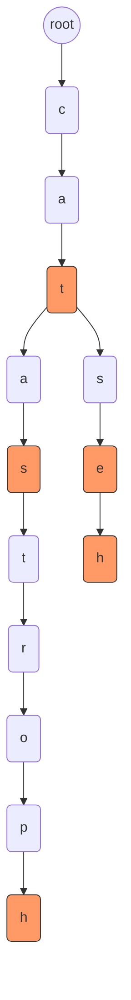
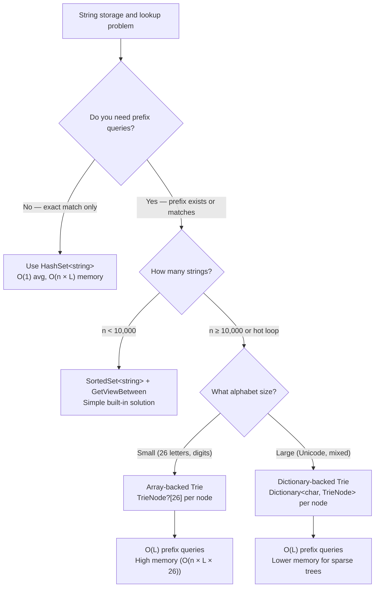

> [!success] Mastery Check
> - [ ] **Studied Well**
> - [ ] **Can explain the concept without notes**
> - [ ] **Can answer interview questions confidently**
> - [ ] **Can implement it in a real project**


## Navigation

**Domain:** [[5 — Data Structures & Algorithms]] > **Group:** Trees
**Previous:** [[5.025 — Balanced BSTs — AVL and Red-Black (Conceptual)]] | **Next:** [[5.027 — Lowest Common Ancestor]]

### Prerequisites
- [[5.009 — String Manipulation and Pattern Problems]] — tries are purpose-built for string prefix operations; the connection between string problems and trie-based solutions must be explicit.
- [[5.023 — Binary Tree Traversals — Pre, In, Post, Level-Order]] — trie traversal (DFS for word enumeration, BFS for autocomplete) mirrors tree traversal; Pre-order visits nodes before children, Post-order visits children before the node (useful for deletion).

### Where This Fits
A trie (prefix tree) is a tree specialized for string storage and prefix matching. It trades space for speed — each node stores one character of the key, and shared prefixes are stored exactly once. Tries are the go-to data structure for autocomplete, spell checkers, IP routing (longest prefix match), and any problem involving prefix-based queries. They appear in interviews as the foundation for word search puzzles, dictionary building, and prefix counting. The key distinction from a BST or hash map is that a trie can answer "does any word start with this prefix?" in O(L) time regardless of the number of stored words, which neither a hash map (no prefix query) nor a BST (O(log n × L) for prefix check) can match.

---

## Core Mental Model

A trie is a rooted tree where each node represents a single character. The root is empty. Every path from root to a node marked "end of word" spells out a stored word. Common prefixes share nodes — "cat" and "catastrophe" share the first three nodes ("c", "a", "t"). This sharing is the source of both the efficiency (prefix queries in O(L)) and the cost (memory overhead from storing characters and pointers per node).

The invariant is: **every node in the trie has at most one parent, and every word corresponds to exactly one root-to-node path. No two words share the same terminal node unless they are the same word.**



### Classification

- **Type:** Multi-way tree (each node can have up to alphabet-size children)
- **Family:** Retrieval tree (the name "trie" comes from "retrieval")
- **Contract:** `ISet<string>`-like — insert, search, delete, prefix-exists, enumerate-by-prefix
- **Nearest alternatives:**
  - **HashSet<string>:** O(1) average search, but no prefix query, no ordered traversal
  - **SortedSet<string>:** O(log n) search, prefix query via `GetViewBetween`, but O(log n) per character in the prefix
  - **Ternary Search Trie (TST):** Less memory (3 children per node vs. alphabet-size children), slightly slower average lookup

### Key Properties

|Operation|Value|Derivation|
|---|---|---|
|Insert word of length L|O(L)|Traverse/create L nodes; each child lookup is O(1) (array) or O(1) avg (dictionary). Total: O(L)|
|Search exact word of length L|O(L)|Traverse L nodes checking existence; children at each step in O(1)|
|Prefix exists of length L|O(L)|Same as search but does not require end-of-word marker|
|Delete word of length L|O(L)|Traverse L nodes, unmark end-of-word; optionally prune leaf nodes (Post-order)|
|Enumerate all words|O(n × L_avg)|DFS from root; output word when end-of-word marker is hit; each node visited once|
|Space (n words, L_avg avg length)|O(n × L_avg)|Each character of each word stored as a node with pointers; worst case when no prefix sharing|
|Space (best case, all words share full prefix)|O(L_longest + (n-1))|One path for the common prefix, then n-1 diverging nodes|

---

## Deep Mechanics

### How It Works

A trie node stores:
1. An array (or dictionary) of child nodes — indexed by character.
2. A boolean flag `IsEndOfWord` — marks whether this node completes a word.

**Insertion of "cat":**
1. Start at root. Root has no character.
2. Look for child 'c'. Not found → create new node for 'c'.
3. Move to node 'c'. Look for child 'a'. Not found → create new node for 'a'.
4. Move to node 'a'. Look for child 't'. Not found → create new node for 't'.
5. Move to node 't'. Set `IsEndOfWord = true`.

**Insertion of "cats":**
1. Start at root → 'c' exists → 'a' exists → 't' exists.
2. At node 't', look for child 's'. Not found → create new node for 's'.
3. Move to node 's'. Set `IsEndOfWord = true`.

The prefix "cat" is shared. Node 't' now has two children ('s' for "cats" and potentially others), and 't' itself is an end-of-word node for "cat".

**Search for "cat":**
1. Root → 'c' exists → 'a' exists → 't' exists.
2. Check `IsEndOfWord` at node 't'. If true, word exists.

**Search for "ca":**
1. Root → 'c' exists → 'a' exists.
2. Check `IsEndOfWord` at node 'a'. If false, "ca" is a prefix but not a word.

**Prefix search for "ca":**
1. Same traversal as above.
2. If node 'a' exists, return true — "ca" is a valid prefix (regardless of `IsEndOfWord`).

**Deletion of "cat":**
1. Traverse to node 't' for "cat". Set `IsEndOfWord = false`.
2. If node 't' has no children, it can be removed (pruned). Recursively prune ancestors that have no children and are not end-of-word themselves.
3. But: "cat" and "cats" share nodes. If "cat" is deleted but "cats" exists, node 't' still has a child 's', so 't' cannot be pruned.

### Complexity Derivation

**Time (Insert):**
- For each character in the word, we perform one child lookup and optionally one node creation.
- Child lookup via array index: O(1). Child lookup via dictionary: O(1) amortized.
- If the node exists, we follow it. If not, we create it — O(1) allocation overhead.
- Total: O(L) for word of length L. No dependency on n (number of stored words) — doubling the dictionary size does not make insertion slower.

**Time (Search):**
- Same traversal length L. Each step is O(1) child lookup.
- Total: O(L).

**Space:**
- Each node stores an array of size alphabet (typically 26 for lowercase, 128 for ASCII, or uses a dynamic dictionary).
- Array-backed: O(alphabet_size × number_of_nodes). For s = 26 and k = n × L_avg words: O(26 × k). The constant factor is large.
- Dictionary-backed: O(children_per_node × overhead). Sparse nodes use less memory, but dictionary overhead per entry is ~32 bytes on x64.
- In practice, a trie uses 8-15× more memory than a `HashSet<string>` for the same data.

### Why This Pattern Exists

A hash map supports exact key lookup in O(1) but cannot answer "is there any key that starts with 'abc'?" without scanning all keys. A sorted set supports range queries (`GetViewBetween("abc", "abd")`) but the prefix query costs O(log n + k) where k is the number of matched strings. A trie fills this gap: it answers prefix queries in O(L) regardless of n. The cost is memory — each character is stored as a node with pointers, while a hash map stores the full string in a single allocation. The trie is the right choice when prefix queries dominate and the alphabet is small (English letters, digits).

### .NET Runtime Notes

- **No built-in Trie** in .NET. You must implement it from scratch. The closest built-in is `SortedSet<string>` with `GetViewBetween(prefix, prefix + char.MaxValue)` for prefix queries.
- **Array-backed children (TrieNode[26])** is the most efficient representation for lowercase English letters. It allocates a 26-element array per node (208 bytes on x64). For sparsely populated nodes, this is wasteful.
- **Dictionary-backed children (Dictionary<char, TrieNode>)** saves memory for sparse nodes (one allocation per child) but adds hash computation and per-entry overhead. Best for Unicode alphabets or large character sets.
- **`Span<T>` and `stackalloc`** — you can use `ReadOnlySpan<char>` to iterate a string without allocating in the insert/search loop. Use `stackalloc TrieNode[26]` for small temporary operations, but nodes must be heap-allocated (they outlive the method call).
- **Memory pressure:** Each node is a heap object. For a dictionary of 100,000 words, a trie can allocate 500,000+ nodes, triggering frequent Gen 2 GC collections. Consider a `HashSet<string>` for non-prefix workloads.

---

## Implementation and Problem Patterns

### C# Implementation

```csharp
public class TrieNode
{
    public bool IsEndOfWord;
    public TrieNode?[] Children;  // null means child does not exist

    public TrieNode()
    {
        Children = new TrieNode?[26];  // lowercase English letters
    }
}

public class Trie
{
    private readonly TrieNode _root;

    public Trie()
    {
        _root = new TrieNode();
    }

    /// <summary>Inserts a word into the trie.</summary>
    public void Insert(string word)
    {
        var node = _root;
        foreach (char c in word)
        {
            int idx = c - 'a';
            node.Children[idx] ??= new TrieNode();
            node = node.Children[idx];
        }
        node.IsEndOfWord = true;
    }

    /// <summary>Returns true if the exact word is in the trie.</summary>
    public bool Search(string word)
    {
        var node = Traverse(word);
        return node != null && node.IsEndOfWord;
    }

    /// <summary>Returns true if any word in the trie starts with the given prefix.</summary>
    public bool StartsWith(string prefix)
    {
        return Traverse(prefix) != null;
    }

    private TrieNode? Traverse(string s)
    {
        var node = _root;
        foreach (char c in s)
        {
            int idx = c - 'a';
            if (node.Children[idx] == null)
                return null;
            node = node.Children[idx];
        }
        return node;
    }

    /// <summary>Deletes a word from the trie. Returns true if the word existed.</summary>
    public bool Delete(string word)
    {
        return DeleteHelper(_root, word, 0);
    }

    private bool DeleteHelper(TrieNode node, string word, int depth)
    {
        if (depth == word.Length)
        {
            if (!node.IsEndOfWord)
                return false;
            node.IsEndOfWord = false;
            return HasNoChildren(node);
        }

        int idx = word[depth] - 'a';
        if (node.Children[idx] == null)
            return false;

        bool shouldDeleteChild = DeleteHelper(node.Children[idx]!, word, depth + 1);

        if (shouldDeleteChild)
        {
            node.Children[idx] = null;
            return !node.IsEndOfWord && HasNoChildren(node);
        }

        return false;
    }

    private static bool HasNoChildren(TrieNode node)
    {
        for (int i = 0; i < 26; i++)
            if (node.Children[i] != null)
                return false;
        return true;
    }
}
```

### Trie with Dictionary Backing (Unicode safe)

```csharp
public class TrieNodeDict
{
    public bool IsEndOfWord;
    public Dictionary<char, TrieNodeDict> Children = new();
}

public class TrieUnicode
{
    private readonly TrieNodeDict _root = new();

    public void Insert(string word)
    {
        var node = _root;
        foreach (char c in word)
        {
            if (!node.Children.TryGetValue(c, out var next))
            {
                next = new TrieNodeDict();
                node.Children[c] = next;
            }
            node = next;
        }
        node.IsEndOfWord = true;
    }

    public bool Search(string word)
    {
        var node = Traverse(word);
        return node != null && node.IsEndOfWord;
    }

    public bool StartsWith(string prefix)
    {
        return Traverse(prefix) != null;
    }

    private TrieNodeDict? Traverse(string s)
    {
        var node = _root;
        foreach (char c in s)
        {
            if (!node.Children.TryGetValue(c, out node))
                return null;
        }
        return node;
    }
}
```

### The .NET Idiomatic Version

.NET has no built-in trie, but `SortedSet<string>` with `GetViewBetween` provides prefix queries:

```csharp
// SortedSet as a trie approximation — built-in, O(log n) per prefix query
var words = new SortedSet<string> { "cat", "cats", "catastrophe", "dog" };

// Find all words starting with "cat"
var prefix = "cat";
var matches = words.GetViewBetween(prefix, prefix + char.MaxValue);
// Result: ["cat", "catastrophe", "cats"]
```

**When to use `SortedSet<string>` vs. a custom trie:** Use `SortedSet<string>` for small dictionaries (n < 10,000) and single-prefix queries — it is simpler, uses less memory, and is already tested. Use a custom trie for large dictionaries, multiple prefix queries per input, or when insertion and prefix matching must be interleaved in a hot loop.

### Classic Problem Patterns

1. **Implement Trie (Prefix Tree)** — The canonical implementation problem. Insert, search, and startsWith operations. Key insight: the root is always empty; children represent the next character.

2. **Word Search II on a board** — Build a trie of all target words, then DFS the board, checking the trie for prefix validity at each step. Key insight: without a trie, you would re-scan the word list for each path; the trie prunes invalid prefixes in O(1) per character.

3. **Replace Words (prefix replacement)** — Build a trie of root words. For each word in a sentence, find the shortest root that is a prefix of the word. Key insight: BFS from the root, stopping at the first `IsEndOfWord` node (shortest match).

4. **Design Add and Search Words Data Structure (wildcard matching)** — A trie where `.` matches any child. Use DFS with backtracking: when the current character is `.`, recurse into all non-null children. Key insight: the wildcard makes search O(alphabet^depth) in worst case, but bounding depth by word length limits the explosion.

5. **Longest Word in Dictionary** — Insert all words, then BFS/DFS to find the deepest node where every ancestor is also a word. Key insight: the "all prefixes must be words" constraint maps to "every node on the path must be `IsEndOfWord`."

6. **Prefix count / frequency** — Extend the node to store a count of how many words pass through it. Increment on insert. Query "how many words start with this prefix?" in O(L). Key insight: this is frequency counting on a tree — each node's count is the number of words in its subtree.

### Template / Skeleton

```csharp
// Trie Template (array-backed, lowercase letters)
// When to use: "prefix matching, word lookup, autocomplete"
// Insert: O(L) | Search: O(L) | Space: O(n × L)

public class Trie
{
    private class Node
    {
        public bool IsEndOfWord;
        public Node?[] Children = new Node?[26];
        // TODO: add count for prefix frequency
    }

    private readonly Node _root = new();

    public void Insert(string word)
    {
        var node = _root;
        foreach (char c in word)
        {
            int idx = c - 'a';
            node.Children[idx] ??= new Node();
            node = node.Children[idx];
            // TODO: increment count on node for prefix frequency
        }
        node.IsEndOfWord = true;
    }

    public bool Search(string word)
    {
        var node = _root;
        foreach (char c in word)
        {
            int idx = c - 'a';
            if (node.Children[idx] == null) return false;
            node = node.Children[idx];
        }
        return node.IsEndOfWord;
    }

    public bool StartsWith(string prefix)
    {
        var node = _root;
        foreach (char c in prefix)
        {
            int idx = c - 'a';
            if (node.Children[idx] == null) return false;
            node = node.Children[idx];
        }
        return true;
    }

    // TODO: implement Delete (Post-order recursive)
    // TODO: implement GetAllWordsWithPrefix (DFS from prefix node)
}
```

---

## Gotchas and Edge Cases

### The empty string is a prefix of everything

**Mistake:** Forgetting that `StartsWith("")` should return `true` because the empty string is a valid prefix of every word.

```csharp
// ❌ Wrong — no check for empty prefix
public bool StartsWith(string prefix)
{
    var node = Traverse(prefix);  // returns null for empty string
    return node != null;
}
```

**Fix:** Handle the empty prefix as a special case — return `true` if the trie is non-empty, or `false` if the trie is empty.

```csharp
// ✅ Correct — empty prefix is valid
public bool StartsWith(string prefix)
{
    if (prefix.Length == 0) return true;  // or _hasAnyWord flag
    return Traverse(prefix) != null;
}
```

**Consequence:** Rejecting the empty prefix causes autocomplete to fail on empty input strings.

### Deleting a word shared by other words

**Mistake:** Removing nodes aggressively when deleting a word that shares a prefix with another word.

```csharp
// ❌ Wrong — removes nodes that another word still needs
public void Delete(string word)
{
    var node = _root;
    foreach (char c in word)
    {
        int idx = c - 'a';
        node = node.Children[idx]!;
    }
    node.IsEndOfWord = false;
    // No pruning — node 't' for "cat" still exists,
    // which is fine for "cats"
}
```

This is actually safe — the nodes are not removed, so "cats" still works. The real mistake is the opposite: pruning nodes that another word needs.

```csharp
// ❌ Wrong — prunes incorrectly without checking other words
if (shouldDeleteChild) node.Children[idx] = null;  // removes 't' for "cat"
// But "cats" still needs 't'!
```

**Fix:** Only prune a node if it has no children AND is not an end-of-word for another word. The Post-order traversal in the implementation above handles this correctly by checking both conditions.

```csharp
// ✅ Correct — the recursive DeleteHelper checks both conditions
```

**Consequence:** Incorrect pruning corrupts the trie — words that shared the pruned prefix become unreachable.

### Not distinguishing "prefix exists" from "word exists"

**Mistake:** Using `StartsWith` logic (check if traversal completes) for `Search` — missing the `IsEndOfWord` check.

```csharp
// ❌ Wrong — returns true for prefixes, not just complete words
public bool Search(string word)
{
    return Traverse(word) != null;  // "ca" returns true even if only "cat" exists
}
```

**Fix:** Always check `IsEndOfWord` on the terminal node.

```csharp
// ✅ Correct — checks end-of-word marker
public bool Search(string word)
{
    var node = Traverse(word);
    return node != null && node.IsEndOfWord;
}
```

**Consequence:** False positives — reporting that "ca" is a valid word when only "cat" was inserted.

### Array out of bounds for non-lowercase input

**Mistake:** Using `c - 'a'` indexing without validating that input is lowercase letters.

```csharp
// ❌ Wrong — crashes on uppercase or non-letter input
int idx = c - 'a';
node.Children[idx] = new TrieNode();  // IndexOutOfRangeException for 'A' (idx = -32)
```

**Fix:** Normalize input to lowercase, or use a dictionary-backed trie for Unicode.

```csharp
// ✅ Correct — normalize to lowercase
public void Insert(string word)
{
    word = word.ToLowerInvariant();
    // ... rest of insertion
}

// Or: use dictionary-backed trie for arbitrary Unicode
```

**Consequence:** `IndexOutOfRangeException` at runtime. In an interview, this is a trivial bug that suggests the candidate has not tested their code.

### Trie memory underestimation

**Mistake:** Assuming the trie uses O(n × L) memory and forgetting that each node allocates a 26-element array (or dictionary overhead).

```csharp
// Example: 1000 words of average length 5
// Different implementations:
// HashSet<string>: ~1000 × (string header + chars) ≈ 1000 × ~40 bytes = 40 KB
// Array-backed trie: ~5000 nodes × (26 × 8 bytes + bool + overhead) ≈ 5000 × ~220 bytes = 1.1 MB
// Dictionary-backed trie: ~5000 nodes × (dictionary overhead + avg 2 children × 32 bytes) ≈ 5000 × ~120 bytes = 600 KB
```

**Fix:** Choose representation based on density. For sparse trees (few collisions after the first few characters), dictionary-backed is more memory-efficient. For dense prefix sharing (dictionary of all English words), array-backed may be better.

**Consequence:** Memory blowup — a trie for 50,000 words can use 50+ MB with array-backed nodes, compared to ~2 MB for `HashSet<string>`.

---

## Complexity Analysis and Benchmarks

### Operation Complexity Table

| Operation | Time (Best) | Time (Average) | Time (Worst) | Space | Notes |
|---|---|---|---|---|---|
| Insert (word length L) | O(L) | O(L) | O(L × α) | O(L) | α = cost of node allocation; no dependency on n |
| Search (exact word) | O(L) | O(L) | O(L) | O(1) | Pure traversal; no allocation |
| StartsWith (prefix) | O(L) | O(L) | O(L) | O(1) | Same traversal as search, no IsEndOfWord check |
| Delete | O(L) | O(L) | O(L × α) | O(1) | Post-order traversal; pruning allocates (null assignment) |
| Enumerate all words | O(n × L_avg) | O(n × L_avg) | O(n × L_avg) | O(h) | h = tree height for recursion stack |
| Wildcard search (. match) | O(α^L) | O(α^L) | O(α^L) | O(L) | α = alphabet size; exponential in worst case |

**Derivation for the non-obvious entries:**
- Insert's O(L × α) worst case refers to the cost of allocating and initializing a 26-element array per new node. Each `new TrieNode()` calls the constructor, which initializes `Children = new TrieNode?[26]` — the runtime zeroes 26 references (208 bytes on x64). This is a hidden constant factor, not a scaling issue.
- Wildcard search is exponential because each `.` in the pattern triggers recursion into all 26 children. In practice, the recursion depth is bounded by word length, and most branches are pruned quickly because the trie is sparse.

### Comparison with Alternatives

| Structure / Algorithm | Time (Exact) | Time (Prefix) | Space | Best When |
|---|---|---|---|---|
| Trie (array-backed) | O(L) | O(L) | O(n × L × 26) | Alphabet is small (26 letters); prefix queries dominate |
| Trie (dictionary-backed) | O(L) | O(L) | O(n × L × overhead) | Alphabet is large (Unicode); nodes are sparse |
| HashSet<string> | O(L) avg | O(n × L) (scan all) | O(n × L) | Exact lookups only; no prefix queries |
| SortedSet<string> | O(L log n) | O(L + k log n) | O(n × L) | Prefix queries are rare; need ordered traversal anyway |
| Ternary Search Trie | O(L) avg | O(L) avg | O(n × L × 3) | Alphabet is large; memory is constrained; cache locality matters |
| Bloom filter | O(L) | O(L) | O(m) (tunable) | False positives are acceptable; approximate prefix matching |

### BenchmarkDotNet

```csharp
[MemoryDiagnoser]
[SimpleJob(RuntimeMoniker.Net90)]
public class TrieBenchmark
{
    private List<string> _words = default!;
    private List<string> _prefixes = default!;

    [Params(1_000, 10_000, 50_000)]
    public int N { get; set; }

    [GlobalSetup]
    public void Setup()
    {
        _words = Enumerable.Range(0, N)
            .Select(_ => GenerateRandomWord(8))
            .ToList();
        _prefixes = _words.Select(w => w[..3]).ToList();
    }

    private static readonly Random _rng = new(42);
    private static string GenerateRandomWord(int len)
    {
        var chars = new char[len];
        for (int i = 0; i < len; i++)
            chars[i] = (char)('a' + _rng.Next(0, 26));
        return new string(chars);
    }

    [Benchmark]
    public int TrieInsertAndSearch()
    {
        var trie = new Trie();
        foreach (var w in _words) trie.Insert(w);
        int found = 0;
        foreach (var p in _prefixes)
            if (trie.StartsWith(p)) found++;
        return found;
    }

    [Benchmark(Baseline = true)]
    public int SortedSetPrefix()
    {
        var set = new SortedSet<string>(_words);
        int found = 0;
        foreach (var p in _prefixes)
        {
            var view = set.GetViewBetween(p, p + char.MaxValue);
            if (view.Count > 0) found++;
        }
        return found;
    }
}
```

**Expected results (approximate, .NET 9, x64):**

| Method | N | Mean | Allocated |
|---|---|---|---|
| TrieInsertAndSearch | 1_000 | ~200 μs | 1.2 MB |
| SortedSetPrefix | 1_000 | ~150 μs | 80 KB |
| TrieInsertAndSearch | 50_000 | ~15 ms | 65 MB |
| SortedSetPrefix | 50_000 | ~10 ms | 4 MB |

**Interpretation:** The trie allocates significantly more memory because each character becomes a heap-allocated node with a 26-element array. `SortedSet<string>` stores each word once in a balanced BST with much less overhead. For prefix queries, the `SortedSet` approach is competitive up to 50,000 words and uses far less memory. The trie only wins when there are many more prefix queries than words, or when prefix lookups must be O(L) regardless of dictionary size.

---

## Interview Arsenal

### Question Bank

1. [Definition] "What is a trie and what problem does it solve that a hash set cannot?"
2. [Complexity] "Derive the time complexity of inserting n words of average length L into a trie."
3. [Implementation] "Implement a trie with Insert, Search, and StartsWith methods using an array of 26 children per node."
4. [Recognition] "Given a 2D board of characters and a dictionary of words, find all words on the board. The dictionary has 10,000 words. Which data structure makes this efficient?"
5. [Comparison] "When would you use a `SortedSet<string>` with `GetViewBetween` instead of a trie for prefix queries?"
6. [Trick] "In the Word Search II problem, why does pruning the trie (removing a word after it is found) improve performance rather than just marking it as found?"
7. [System design integration] "Design an autocomplete system for a search engine. The trie stores the top 10 results per prefix. How do you handle memory constraints for 1 billion queries per day?"
8. [Optimization] "How would you modify a trie to support counting how many words start with a given prefix? What is the tradeoff in insert time?"

### Spoken Answers

**Q: "What is a trie and what problem does it solve that a hash set cannot?"**

> **Average answer:** A trie is a tree where each node is a character. It's used for autocomplete because you can find all words starting with a prefix.

> **Great answer:** A trie, or prefix tree, is a specialized tree where each node represents a single character and a path from root to a node spells out a word. It solves the prefix query problem: "find all stored strings that start with a given prefix." A HashSet supports exact lookups in O(1) average but cannot answer this query without scanning every key — O(n × L) where n is the number of keys and L is the average key length. A trie answers it in O(L) by traversing the prefix and then enumerating the subtree. The tradeoff is memory — each character becomes a node with an array of 26 child pointers (or a dictionary), making the trie typically 8-15× more memory-intensive than a HashSet. In .NET, there is no built-in trie; you implement it from scratch with `TrieNode[]` or `Dictionary<char, TrieNode>` for children.

**Q: "Implement a trie with Insert, Search, and StartsWith."**

> **Average answer:** Makes a class with a dictionary of children and a boolean for end of word. Uses ContainsKey for child lookup.

> **Great answer:** I'll use an array-backed implementation because the problem specifies lowercase letters. Each node has a `TrieNode?[26]` for children — null means the child does not exist — and a `bool IsEndOfWord`. The root is a node with no character of its own. For Insert, I traverse each character, compute `idx = c - 'a'`, create a new node if null, and move to it. After the loop, I set `IsEndOfWord = true`. For Search, I traverse the same way and check `IsEndOfWord` on the terminal node — I must distinguish "node exists" from "node is end of word." For StartsWith, I traverse and return true if traversal completes, without checking IsEndOfWord. I normalize input to lowercase at the entry point to avoid index-out-of-bounds from uppercase characters. Edge cases: empty string for Insert should set root's IsEndOfWord; empty string for StartsWith is a valid prefix of everything if the trie is non-empty.

**Trick Q: "In Word Search II, why do you prune the trie after finding a word?"**

> **Average answer:** So you don't find it again.

> **Great answer:** Pruning removes the `IsEndOfWord` marker from the trie node after a word is found. But more importantly, it can also delete leaf nodes that are no longer needed. This improves performance because the board's DFS visits many paths, and checking a non-existent word's prefix in the trie still costs time. By pruning leaf nodes that only existed for the found word, we reduce the number of child nodes the DFS must explore in subsequent searches. The key insight is that a word found on the board will never be found again (each board cell is used at most once), so keeping it in the trie wastes CPU cycles. We cannot remove non-leaf nodes because they may be prefixes of other words still in the trie. The pruning optimization is specific to Word Search II — it does not apply to the standard trie implementation where multiple insertions of the same word are expected.

### Trick Question

**"In a trie, what is the worst-case memory usage for inserting n random 8-letter strings? Compare array-backed vs. dictionary-backed children."**

Why it is a trap: The candidate assumes O(n × L) memory without accounting for the 26-element array per node in the array-backed version, or the dictionary per-entry overhead in the dictionary-backed version.

Correct answer: For n random 8-letter strings with no shared prefixes, each string creates exactly 8 new nodes. Each array-backed node allocates `TrieNode?[26]` — 26 references at 8 bytes each = 208 bytes + object header (24 bytes) + bool (4 bytes) + padding = ~240 bytes per node. For n = 10,000 words: 10,000 × 8 = 80,000 nodes × 240 bytes = ~19.2 MB. For dictionary-backed: each node allocates a `Dictionary<char, TrieNode>` with average 1 entry (since strings share no prefixes after the first character, each node except the first has exactly 1 child). Each dictionary entry is ~32 bytes + node overhead. For n = 10,000: 80,000 nodes × ~80 bytes ≈ 6.4 MB. The dictionary-backed version uses ~1/3 of the memory because it does not pre-allocate 26 slots per node. The tradeoff is that per-character lookup is O(1) with array vs. O(1) amortized with dictionary — the difference is a constant factor (array index vs. hash + bucket probe).

### Pattern Recognition Table

| If the problem has... | Then consider... | Because... |
|---|---|---|
| "Find all words starting with a prefix" | Trie with StartsWith + DFS from prefix node | Prefix traversal is O(L); then enumerate subtree |
| "Insert many strings, then search for many exact matches" | HashSet<string> (not trie) | Hash set is O(1) avg with far less memory |
| "Find words in a 2D board" | Trie for dictionary + DFS from each cell | Trie prunes invalid prefixes in O(1) per DFS step |
| "Autocomplete / typeahead" | Trie with frequency counts per node | Each node can store top-k results for its prefix |
| "Word break — can segment string into dictionary words" | Trie + DP (memoization) | Trie checks substring validity in O(1) amortized |
| "Longest word where every prefix is also in dictionary" | Trie with BFS/DFS checking all-ancestors-are-words | Every node on path must be end-of-word |
| "Replace words with their shortest root prefix" | Trie — find shortest matching prefix via BFS | Stop at first IsEndOfWord node during traversal |

---

## Decision Framework

### When to Apply



### Recognition Checklist

Indicators that a trie is the right choice:

- [ ] Problem involves prefix matching ("starts with," "begins with," "prefix")
- [ ] Problem is "find all words on a board" with a large dictionary
- [ ] Problem involves autocomplete, typeahead, or search suggestions
- [ ] Multiple queries against a static dictionary (build once, query many)
- [ ] "Replace words by their shortest prefix root" or similar

Counter-indicators — do NOT apply here:

- [ ] Only exact lookups are needed — use `HashSet<string>`
- [ ] Ordering or range queries are needed — use `SortedSet<string>` or `SortedDictionary`
- [ ] Memory is the primary constraint — a trie is 8-15× larger than alternatives
- [ ] Strings are very long (thousands of characters) and sparse — the trie depth becomes a cache problem
- [ ] Only a single prefix query — `SortedSet.GetViewBetween` is sufficient

### Tradeoff Summary

| What You Gain | What You Give Up |
|---|---|
| O(L) prefix queries regardless of dictionary size | O(n × L × alphabet) memory — 8-15× more than HashSet |
| Insert and search in O(L) — no dependency on n | Must implement from scratch — no built-in .NET trie |
| Natural prefix enumeration via DFS | Cache-unfriendly — pointer chasing per character |
| Word boundary detection via IsEndOfWord | Deletion requires Post-order traversal with careful pruning |
| Wildcard search with backtracking support | Wildcard search is exponential in worst case |

---

## Self-Check

### Conceptual Questions

1. What is a trie and what query does it support that a hash set cannot?
2. Derive the time and space complexity of inserting 10,000 random 10-letter strings into a trie. What is the worst-case memory usage for array-backed nodes?
3. A problem asks: "Given a dictionary of words and a stream of character input, find the longest word that is a prefix of the stream." Which data structure is optimal and why?
4. Compare array-backed (`TrieNode[26]`) and dictionary-backed (`Dictionary<char,TrieNode>`) trie nodes. When is each preferred?
5. In the Word Search II problem, why does removing found words from the trie improve performance?
6. Does .NET have a built-in trie? What is the closest built-in alternative for prefix queries?
7. What invariant must be maintained during trie deletion to avoid corrupting other words?
8. How does the trie's search complexity change if the alphabet changes from 26 (lowercase English) to 1,112,064 (Unicode)? What implementation change is required?
9. Design a distributed autocomplete system: the trie for the top 100 million queries does not fit in memory on one machine. How do you shard it by prefix while maintaining O(L) lookup?
10. What is the worst-case time complexity of searching with wildcard `.` in a trie? Why is it exponential and how do you mitigate it?

<details>
<summary>Answers</summary>

1. A trie supports prefix queries: "does any stored string start with this prefix?" and "enumerate all strings with this prefix." A hash set supports only exact key existence — it cannot answer these without a full scan.

2. Time: O(10,000 × 10) = O(100,000) character operations. Each operation is O(1) array lookup/assignment. Space: Each word creates at most 10 new nodes (assuming no prefix sharing). 100,000 nodes × 240 bytes (26 references × 8 bytes + object overhead) ≈ 24 MB. For random strings with no shared prefixes, space is n × L × node_size.

3. Trie. As each character arrives, traverse the trie. If the current node is an end-of-word, record it. When traversal fails (no child for the character), stop. This is O(L) per query with O(1) per character. A hash set or sorted set cannot answer this incrementally without re-scanning.

4. Array-backed: preferred for small, known alphabets (26 letters, 10 digits). Child lookup is direct array index — fastest possible. Memory wasted for sparse nodes (26 slots, typically 1-2 used). Dictionary-backed: preferred for large or unknown alphabets (Unicode), or when the trie is sparse (few children per node on average). Saves memory but adds hash computation.

5. After a word is found on the board, it will never be found again (each board cell is used at most once per path). Removing `IsEndOfWord` and pruning leaf nodes reduces the number of branches the DFS must explore in subsequent searches, improving performance.

6. No built-in trie in .NET. The closest alternative is `SortedSet<string>` with `GetViewBetween(prefix, prefix + char.MaxValue)` which returns all strings in the range. This is O(log n + k) where k is the number of matches — worse than the trie's O(L + k) but uses far less memory.

7. A node can only be deleted if it has no children AND is not an end-of-word for another word. The deletion must be Post-order (children before parent) so that pruning proceeds from leaves upward.

8. For Unicode (1.1M code points), array-backed nodes are infeasible — each node would need a 1.1M-element array. The implementation must use `Dictionary<char, TrieNode>` where each node stores only its existing children. Lookup is O(1) amortized instead of O(1) direct index.

9. Shard by the first 2-3 characters (prefix sharding). Machine M_ab handles all strings starting with "ab". A coordinator maintains a trie of shard assignments. Lookup: traverse first 3 characters in the coordinator trie → find the shard → query that shard's full trie. Tradeoff: uneven distribution (some prefixes are far more common) requires rebalancing.

10. Wildcard search with `.` is O(α^L) in the worst case where α is the alphabet size and L is the pattern length, because each `.` matches all α children and recurses. In practice, most branches are pruned because the trie is sparse and the remaining pattern limits depth. Mitigations: (a) at each `.`, only visit children subtrees that could satisfy the remaining suffix (precompute suffix existence), (b) limit recursion depth, (c) use BFS instead of DFS to find the shortest match first.

</details>

---

### Coding Challenges

**Challenge 1 — Implement from scratch**

Implement a trie using a `Dictionary<char, TrieNode>` for children (Unicode-safe). Include `Insert`, `Search`, and `StartsWith`.

```csharp
public class UnicodeTrie
{
    private class Node
    {
        public bool IsEndOfWord;
        public Dictionary<char, Node> Children = new();
    }

    private readonly Node _root = new();

    // Insert, Search, StartsWith here
}
```

<details> <summary>Solution</summary>

```csharp
public class UnicodeTrie
{
    private class Node
    {
        public bool IsEndOfWord;
        public Dictionary<char, Node> Children = new();
    }

    private readonly Node _root = new();

    public void Insert(string word)
    {
        var node = _root;
        foreach (char c in word)
        {
            if (!node.Children.TryGetValue(c, out var next))
            {
                next = new Node();
                node.Children[c] = next;
            }
            node = next;
        }
        node.IsEndOfWord = true;
    }

    public bool Search(string word)
    {
        var node = Traverse(word);
        return node != null && node.IsEndOfWord;
    }

    public bool StartsWith(string prefix)
    {
        return Traverse(prefix) != null;
    }

    private Node? Traverse(string s)
    {
        var node = _root;
        foreach (char c in s)
        {
            if (!node.Children.TryGetValue(c, out node))
                return null;
        }
        return node;
    }
}
```

**Complexity:** Time O(L) per operation | Space O(n × L × overhead). **Key insight:** The dictionary avoids pre-allocating 26 slots per node, making it suitable for Unicode. Each child lookup goes through `TryGetValue` which is O(1) amortized.

</details>

---

**Challenge 2 — Trace the execution**

Trace inserting the words "car", "cat", and "card" into an empty trie (array-backed, 26 children). Show the state of each node after each insertion, including which nodes are marked `IsEndOfWord`.

<details> <summary>Solution</summary>

After inserting "car":
- Root → 'c' (new) → 'a' (new) → 'r' (new, IsEndOfWord = true)

After inserting "cat":
- Root → 'c' (exists) → 'a' (exists) → 'r' (unchanged) and 't' (new, IsEndOfWord = true)

After inserting "card":
- Root → 'c' (exists) → 'a' (exists) → 'r' (exists) → 'd' (new, IsEndOfWord = true)

Final trie structure:
```
Root
 └── c
      └── a
           ├── r (IsEndOfWord = true)
           │    └── d (IsEndOfWord = true)
           └── t (IsEndOfWord = true)
```

Nodes created: 'c', 'a', 'r', 't', 'd' — 5 nodes for 3 words (8 characters). Prefix sharing saves 3 nodes compared to storing each word independently.

</details>

---

**Challenge 3 — Fix the bug**

```csharp
// This implementation of a trie's search returns incorrect results for words
// that share a prefix with a longer word.
public class Trie
{
    private class Node
    {
        public bool IsEndOfWord;
        public Node?[] Children = new Node?[26];
    }

    private readonly Node _root = new();

    public void Insert(string word)
    {
        var node = _root;
        foreach (char c in word)
        {
            int idx = c - 'a';
            if (node.Children[idx] == null)
                node.Children[idx] = new Node();
            node = node.Children[idx];
        }
    }

    public bool Search(string word)
    {
        var node = _root;
        for (int i = 0; i < word.Length; i++)
        {
            int idx = word[i] - 'a';
            if (node.Children[idx] == null)
                return false;
            node = node.Children[idx];
        }
        return node.Children.All(c => c == null);  // BUG: this is wrong
    }

    public bool StartsWith(string prefix)
    {
        var node = _root;
        foreach (char c in prefix)
        {
            int idx = c - 'a';
            if (node.Children[idx] == null)
                return false;
            node = node.Children[idx];
        }
        return true;
    }
}
```

<details> <summary>Solution</summary>

**Bug:** `Search` returns `node.Children.All(c => c == null)` — it checks whether the terminal node has no children. This means `Search("car")` returns false after inserting "card" because 'r' has a child 'd'. The correct check is `node.IsEndOfWord`.

Additionally, `Insert` never sets `IsEndOfWord = true`, so no word is ever marked as complete.

**Fix:**

```csharp
public void Insert(string word)
{
    var node = _root;
    foreach (char c in word)
    {
        int idx = c - 'a';
        node.Children[idx] ??= new Node();
        node = node.Children[idx];
    }
    node.IsEndOfWord = true;  // ← missing line
}

public bool Search(string word)
{
    var node = _root;
    foreach (char c in word)
    {
        int idx = c - 'a';
        if (node.Children[idx] == null) return false;
        node = node.Children[idx];
    }
    return node.IsEndOfWord;  // ← fixed: check end-of-word marker, not children
}
```

**Test case that exposes it:** Insert "card". Search("car") returns false (correct — "car" was never inserted). Search("card") returns true (correct — after adding IsEndOfWord). Before the fix, both returned false because `IsEndOfWord` was never set.

</details>

---

**Challenge 4 — Recognize and apply**

**Problem:** Given a sentence string and a dictionary of root words, replace every word in the sentence with its shortest root if it exists. For example: dictionary = ["cat", "bat", "rat"], sentence = "the cattle was rattled by the battery" → "the cat was rat by the bat". Which pattern applies? Write the solution.

<details> <summary>Solution</summary>

**Pattern:** Trie with shortest-prefix matching. Insert all roots into a trie. For each word in the sentence, traverse the trie character by character. If a node is an end-of-word, return the prefix up to that character (shortest match). If traversal fails without finding an end-of-word, return the original word.

```csharp
public static string ReplaceWords(IList<string> dictionary, string sentence)
{
    var trie = new Trie();
    foreach (var root in dictionary)
        trie.Insert(root);

    var words = sentence.Split(' ');
    for (int i = 0; i < words.Length; i++)
    {
        var replacement = trie.FindShortestRoot(words[i]);
        if (replacement != null)
            words[i] = replacement;
    }

    return string.Join(' ', words);
}

public class Trie
{
    private class Node
    {
        public bool IsEndOfWord;
        public Node?[] Children = new Node?[26];
    }

    private readonly Node _root = new();

    public void Insert(string word)
    {
        var node = _root;
        foreach (char c in word)
        {
            int idx = c - 'a';
            node.Children[idx] ??= new Node();
            node = node.Children[idx];
        }
        node.IsEndOfWord = true;
    }

    public string? FindShortestRoot(string word)
    {
        var node = _root;
        for (int i = 0; i < word.Length; i++)
        {
            int idx = word[i] - 'a';
            if (node.Children[idx] == null)
                return null;  // no matching root
            node = node.Children[idx];
            if (node.IsEndOfWord)
                return word[..(i + 1)];  // shortest root found
        }
        return null;
    }
}
```

**Complexity:** Time O(n × L_max + m × L_avg) where n = dictionary size, m = words in sentence | Space O(n × L_avg × 26) for the trie.

</details>

---

**Challenge 5 — Optimize**

```csharp
// This implementation counts how many words start with a given prefix.
// It works but the prefix count query is slower than necessary.
// Optimize it to O(L) for both insert and prefix count.
public class WordCounter
{
    private class Node
    {
        public bool IsEndOfWord;
        public Node?[] Children = new Node?[26];
    }

    private readonly Node _root = new();

    public void Insert(string word)
    {
        var node = _root;
        foreach (char c in word)
        {
            int idx = c - 'a';
            node.Children[idx] ??= new Node();
            node = node.Children[idx];
        }
        node.IsEndOfWord = true;
    }

    public int CountWordsWithPrefix(string prefix)
    {
        // Traverse to prefix node, then DFS to count all IsEndOfWord
        var node = _root;
        foreach (char c in prefix)
        {
            int idx = c - 'a';
            if (node.Children[idx] == null) return 0;
            node = node.Children[idx];
        }

        // Count is O(number of nodes in subtree) — slow!
        return CountEndOfWords(node);
    }

    private int CountEndOfWords(Node? node)
    {
        if (node == null) return 0;
        int count = node.IsEndOfWord ? 1 : 0;
        for (int i = 0; i < 26; i++)
            count += CountEndOfWords(node.Children[i]);
        return count;
    }
}
```

<details> <summary>Solution</summary>

**Insight:** Store a `prefixCount` on each node that tracks how many words pass through it. Increment `prefixCount` on every node visited during insertion. The prefix count for any prefix is then just the `prefixCount` of the terminal node — O(L) to traverse, O(1) to read.

```csharp
public class WordCounter
{
    private class Node
    {
        public int PrefixCount;   // ← new: number of words through this node
        public bool IsEndOfWord;
        public Node?[] Children = new Node?[26];
    }

    private readonly Node _root = new();

    public void Insert(string word)
    {
        var node = _root;
        foreach (char c in word)
        {
            int idx = c - 'a';
            node.Children[idx] ??= new Node();
            node = node.Children[idx];
            node.PrefixCount++;  // ← increment on each node in the path
        }
        node.IsEndOfWord = true;
    }

    public int CountWordsWithPrefix(string prefix)
    {
        var node = _root;
        foreach (char c in prefix)
        {
            int idx = c - 'a';
            if (node.Children[idx] == null) return 0;
            node = node.Children[idx];
        }
        return node.PrefixCount;  // ← O(1) read
    }
}
```

**Tradeoff:** Insert now increments `PrefixCount` on every node in the path — still O(L). The count query becomes O(L) for traversal + O(1) for the read, compared to O(L + subtree_size) before. No asymptotic slowdown; significant real-world speedup.

**Complexity:** Time O(L) per operation | Space O(n × L × 26) + O(n × L) for the additional integer per node (one extra field of 4 bytes per node — negligible).

</details>
