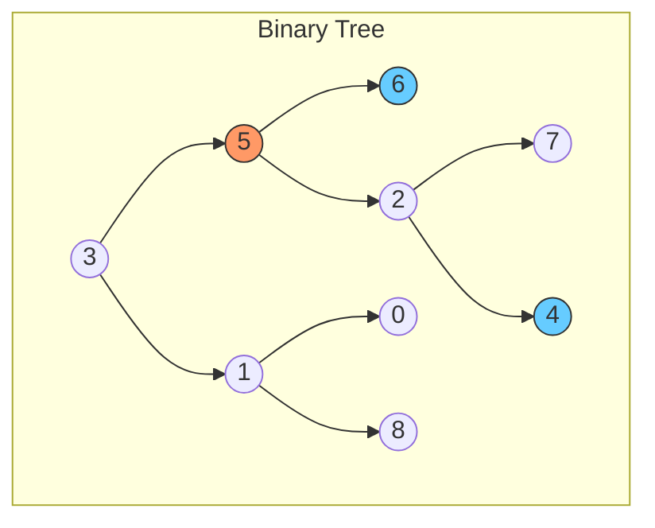
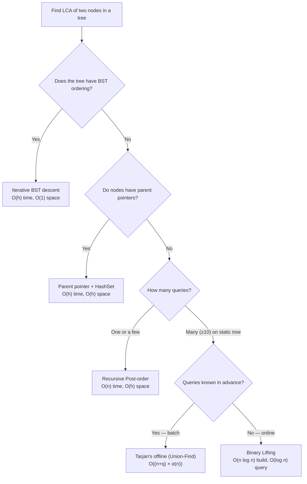

> [!success] Mastery Check
> - [ ] **Studied Well**
> - [ ] **Can explain the concept without notes**
> - [ ] **Can answer interview questions confidently**
> - [ ] **Can implement it in a real project**


## Navigation

**Domain:** [[5 — Data Structures & Algorithms]] > **Group:** Trees
**Previous:** [[5.026 — Tries — Prefix Trees]] | **Next:** [[5.028 — Binary Tree — Diameter, Serialize/Deserialize, Path Problems]]

### Prerequisites
- [[5.023 — Binary Tree Traversals — Pre, In, Post, Level-Order]] — LCA uses Post-order traversal (process children, then parent); understanding traversal order is required to understand why Post-order finds the LCA.
- [[5.024 — Binary Search Tree — Operations and Validation]] — LCA in a BST exploits the BST ordering property; the BST-specific solution is a specialization of the general binary tree approach.

### Where This Fits
Lowest Common Ancestor (LCA) is a tree problem that appears in roughly 10-15% of FAANG on-sites — it is the most common "medium" tree problem after traversals. It tests recursive thinking, path enumeration, and the ability to adapt a general solution to a specialized case (BST). The core idea — find the deepest node that is an ancestor of both target nodes — generalizes beyond binary trees to N-ary trees, to Tarjan's offline algorithm using Union-Find, and to tree-like structures in system design (e.g., organizational charts, DOM trees, package dependency trees). A senior candidate must be able to present the recursive Post-order solution, the BST-optimized solution, and the parent-pointer solution, and explain the tradeoffs.

---

## Core Mental Model

The LCA of two nodes p and q is the deepest node in the tree that has both p and q in its subtree (including itself). The recursive Post-order solution exploits a fundamental invariant: **if a node's left subtree contains one target and its right subtree contains the other, the node is their LCA.** If both targets are in the same subtree, the LCA is deeper — recurse into that subtree.

For a BST, the problem simplifies: if both targets are smaller than the current node, LCA is in the left subtree; both larger → right subtree; otherwise (one on each side, or the current node is one of the targets) → the current node is the LCA.



LCA of nodes 6 and 4 = node 5. LCA of nodes 6 and 5 = node 5 (one target is the ancestor of the other). LCA of nodes 6 and 0 = node 3.

### Classification

- **Algorithm type:** Tree traversal with state propagation (Post-order)
- **Family:** Path query — find the intersection point of two root-to-node paths
- **Key property:** The LCA is the node where the paths from root to p and root to q diverge
- **Nearest alternatives:**
  - **Path enumeration:** Find paths root→p and root→q, compare from root downward, return last common node. O(n) time, O(n) space.
  - **Parent pointers:** If each node has a parent reference, walk both up to root, then find intersection. O(h) time, O(1) space.
  - **Binary Lifting (Euler tour + RMQ):** Preprocess in O(n log n), query in O(log n). Useful for many queries on a static tree.

### Key Properties

|Operation|Value|Derivation|
|---|---|---|
|LCA in binary tree (recursive)|O(n)|Each node visited once; Post-order returns result upward; no per-node work beyond the recursion|
|LCA in BST|O(h) = O(log n) avg, O(n) worst|At each node, decide left or right by comparing values with p and q; no subtree exploration needed|
|LCA with parent pointers|O(h)|Traverse from p to root, record ancestors; traverse from q to root, first match is LCA|
|LCA via path enumeration|O(n)|DFS to find root→p path (O(n)), DFS to find root→q path (O(n)), compare paths (O(h))|
|LCA via Binary Lifting (preprocess)|O(n log n) build, O(log n) query|Build up[log n][n] table; lift the deeper node to match depth, then binary lift together|
|Space (recursive)|O(h)|Call stack for recursion; worst case O(n) for skewed tree|

---

## Deep Mechanics

### How It Works

**Recursive approach (general binary tree):**

The function `LowestCommonAncestor(root, p, q)` returns:
- `null` if the subtree rooted at `root` contains neither p nor q.
- A non-null node if both p and q are found in the subtree — the non-null value is their LCA.
- A non-null node (p or q) if exactly one target is found in the subtree.

The recurrence:
1. If `root` is null, return null.
2. If `root` is p or q, return `root` (found one target).
3. Recurse left: `left = LCA(root.Left, p, q)`.
4. Recurse right: `right = LCA(root.Right, p, q)`.
5. If both left and right are non-null, `root` is the LCA (p in one subtree, q in the other).
6. If only one is non-null, propagate it upward (both targets are in that subtree).
7. If both are null, return null.

**Trace:**
Tree: root=3, p=6, q=4

```
        3
       / \
      5   1
     / \
    6   2
       / \
      7   4
```

Call LCA(3, 6, 4):
- root=3 ≠ 6, ≠ 4
- left = LCA(5, 6, 4):
  - root=5 ≠ 6, ≠ 4
  - left = LCA(6, 6, 4): root=6 == p → return 6
  - right = LCA(2, 6, 4):
    - root=2 ≠ 6, ≠ 4
    - left = LCA(7, 6, 4): null
    - right = LCA(4, 6, 4): root=4 == q → return 4
    - left=null, right=4 → return 4
  - left=6, right=4 → both non-null → return 5 (LCA)
- right = LCA(1, 6, 4):
  - root=1 ≠ 6, ≠ 4
  - left = LCA(0, 6, 4): null
  - right = LCA(8, 6, 4): null
  - both null → return null
- left=5 (non-null), right=null → return 5

Result: LCA = 5.

**BST approach:**
1. If `root.Value < p.Value && root.Value < q.Value` → LCA is in right subtree.
2. If `root.Value > p.Value && root.Value > q.Value` → LCA is in left subtree.
3. Otherwise (p and q are on different sides, or root equals one of them) → root is the LCA.

**Parent pointer approach:**
1. Walk up from p to root, storing all visited nodes in a `HashSet<TreeNode>`.
2. Walk up from q to root. The first node that is already in the set is the LCA.

### Complexity Derivation

**Time (Recursive binary tree):**
- Worst case: every node is visited exactly once. At each node, we do O(1) work (two comparisons, two recursive calls, a few null checks). For n nodes: O(n).
- Best case: root is p or q (early return): O(1).

**Time (BST):**
- At each node, we do O(1) work (two comparisons). We descend at most h levels. For balanced BST: O(log n). For skewed BST: O(n).
- The tree is not fully traversed — only one path from root to the LCA is explored.

**Space (Recursive):**
- O(h) for the call stack. Balanced tree: O(log n). Skewed tree: O(n).
- The iterative BST approach eliminates the call stack: O(1) space.

### .NET Runtime Notes

- **Nullable reference types** (`TreeNode?`) are essential for tree operations — they express "this child may not exist" without null-forgiving operators. Enable `#nullable enable` at the file level.
- **Recursion depth:** .NET's default call stack size is 1 MB (x64). A recursive LCA implementation on a skewed tree with 30,000+ nodes will throw a `StackOverflowException`. In production or for large trees, prefer the iterative BST approach or convert the recursion to an explicit stack.
- **Pattern matching** (`is`, `not null`) provides clean null checks: `if (left is not null && right is not null) return root;`.
- **`HashSet<TreeNode>`** with reference equality is the default (no `IEqualityComparer` needed). `HashSet` uses `ReferenceEquals` by default for reference types, which is exactly what the parent-pointer approach needs.
- **ValueTuples** can be used to return multiple values from recursive LCA variants (e.g., return both the LCA and whether a target was found).

---

## Implementation and Problem Patterns

### C# Implementation

```csharp
public class TreeNode
{
    public int Value;
    public TreeNode? Left;
    public TreeNode? Right;
    public TreeNode(int value) { Value = value; }
}

public static class LCA
{
    /// <summary>
    /// LCA in a general binary tree — recursive Post-order.
    /// O(n) time, O(h) space.
    /// </summary>
    public static TreeNode? LowestCommonAncestor(TreeNode? root, TreeNode p, TreeNode q)
    {
        if (root is null) return null;
        if (root == p || root == q) return root;

        var left = LowestCommonAncestor(root.Left, p, q);
        var right = LowestCommonAncestor(root.Right, p, q);

        if (left is not null && right is not null)
            return root;  // p and q found in different subtrees

        return left ?? right;
    }

    /// <summary>
    /// LCA in a BST — uses BST ordering to guide search.
    /// O(h) time, O(1) space (iterative).
    /// </summary>
    public static TreeNode? LowestCommonAncestorBST(TreeNode? root, TreeNode p, TreeNode q)
    {
        var current = root;
        while (current is not null)
        {
            if (p.Value < current.Value && q.Value < current.Value)
                current = current.Left;
            else if (p.Value > current.Value && q.Value > current.Value)
                current = current.Right;
            else
                return current;  // split point or one target is current
        }
        return null;
    }

    /// <summary>
    /// LCA with parent pointers — walk up from p and q to find intersection.
    /// O(h) time, O(h) space.
    /// </summary>
    public static TreeNode? LowestCommonAncestorWithParent(TreeNode? p, TreeNode? q)
    {
        var ancestors = new HashSet<TreeNode>();

        while (p is not null)
        {
            ancestors.Add(p);
            p = p.Parent;  // assumes TreeNode has a Parent property
        }

        while (q is not null)
        {
            if (ancestors.Contains(q))
                return q;
            q = q.Parent;
        }
        return null;
    }
}
```

### The .NET Idiomatic Version

For most interviews, the recursive Post-order solution is the canonical answer. The BST variant should be iterative to avoid recursion depth concerns:

```csharp
// Idiomatic iterative BST LCA — O(h) time, O(1) space
public static TreeNode? LowestCommonAncestorBSTIterative(TreeNode? root, TreeNode p, TreeNode q)
{
    TreeNode? current = root;
    while (current is not null)
    {
        if (p.Value < current.Value && q.Value < current.Value)
            current = current.Left;
        else if (p.Value > current.Value && q.Value > current.Value)
            current = current.Right;
        else
            break;
    }
    return current;
}
```

**When to use each approach:**
- Recursive Post-order: general binary tree, any tree shape, interview default.
- BST iterative: the input is structurally a BST — cheap optimization.
- Parent pointers: the problem gives parent references and the tree is deep.
- Binary Lifting: the problem asks for many LCA queries on a static tree.

### Classic Problem Patterns

1. **LCA of Binary Tree (LeetCode 236)** — General case. Two nodes in the tree; return their deepest common ancestor. Key insight: Post-order traversal naturally propagates found nodes upward; the node where both left and right return non-null is the LCA.

2. **LCA of BST (LeetCode 235)** — Specialized for BST. Key insight: the BST property tells you which subtree to explore without checking both sides. If the current node's value is between p and q (inclusive), it is the LCA.

3. **LCA of Deepest Leaves (LeetCode 1123)** — Find the deepest leaf, then find the LCA of all deepest leaves. Key insight: recursive helper returns both the depth and the LCA for a subtree. If left and right subtrees have the same depth, root is the LCA; otherwise, the deeper subtree's LCA is the answer.

4. **LCA with parent pointers (LeetCode 1650)** — Each node has a `Parent` reference. Key insight: walk up from p, recording ancestors in a hash set; then walk up from q, returning the first node in the set. No tree root needed.

5. **Smallest Common Region (LeetCode 1257)** — LCA in an N-ary tree where nodes are strings and each node has a parent pointer (but only a parent reference, no root given). Key insight: same parent-pointer approach but in an N-ary context.

6. **LCA in a tree where nodes may not exist** — Return null if either p or q is not in the tree. The standard recursive solution still works — if one target is missing, the function returns the other target (not the LCA). Fix: use a wrapper that tracks whether both were found.

### Template / Skeleton

```csharp
// LCA Template — Recursive (General Binary Tree)
// When to use: "find the lowest common ancestor of two nodes in a tree"
// Time: O(n) | Space: O(h)

public static TreeNode? LowestCommonAncestor(TreeNode? root, TreeNode p, TreeNode q)
{
    if (root is null) return null;
    if (root == p || root == q) return root;

    var left = LowestCommonAncestor(root.Left, p, q);
    var right = LowestCommonAncestor(root.Right, p, q);

    // If both sides returned non-null, root is the LCA
    if (left is not null && right is not null)
        return root;

    // Otherwise propagate the non-null result upward
    return left ?? right;
}

// LCA Template — Iterative (BST)
// When to use: "find LCA in a BST" or "tree has BST ordering"
// Time: O(h) | Space: O(1)

public static TreeNode? LowestCommonAncestorBST(TreeNode? root, TreeNode p, TreeNode q)
{
    var current = root;
    while (current is not null)
    {
        // TODO: Compare p and q values with current
        // If both smaller: go left
        // If both larger: go right
        // Otherwise: return current (split point)
    }
    return null;
}
```

---

## Gotchas and Edge Cases

### One target is the ancestor of the other

**Mistake:** The recursive solution returns the ancestor node correctly, but the candidate may not recognize this as a valid LCA and add unnecessary logic.

```csharp
// ❌ Wrong — extra check breaks the recursion
if (root == p || root == q)
{
    // Candidate incorrectly checks both subtrees for the other node here
    // instead of just returning root
    if (root == p && (Find(root, q))) return root;
    if (root == q && (Find(root, p))) return root;
    return null;
}
```

**Fix:** The standard recursive approach handles this naturally — when root is p, it returns p. If q is in root's subtree, the other recursive branch returns q, and root becomes the LCA node. If q is not in root's subtree, the function returns p, which the caller propagates upward.

```csharp
// ✅ Correct — the simple return handles ancestor-as-LCA
if (root == p || root == q) return root;
```

**Consequence:** Overcomplicating the base case leads to errors on the "ancestor is LCA" case. The simple three-line solution is correct for all inputs.

### Nodes not present in the tree

**Mistake:** Assuming both p and q exist in the tree. The standard recursive LCA returns incorrect results when one node is missing — it returns the other node.

```csharp
// The standard solution returns '5' if only '5' exists and '4' is not in the tree.
// The caller interprets the non-null result as the LCA, which is wrong.
```

**Fix:** Use a wrapper that tracks whether both nodes were found.

```csharp
public static TreeNode? LowestCommonAncestorWithCheck(TreeNode? root, TreeNode p, TreeNode q)
{
    bool foundP = false, foundQ = false;
    var result = LcaHelper(root, p, q, ref foundP, ref foundQ);
    return foundP && foundQ ? result : null;
}

private static TreeNode? LcaHelper(TreeNode? root, TreeNode p, TreeNode q,
    ref bool foundP, ref bool foundQ)
{
    if (root is null) return null;
    if (root == p) { foundP = true; return root; }
    if (root == q) { foundQ = true; return root; }

    var left = LcaHelper(root.Left, p, q, ref foundP, ref foundQ);
    var right = LcaHelper(root.Right, p, q, ref foundP, ref foundQ);

    if (left is not null && right is not null) return root;
    return left ?? right;
}
```

**Consequence:** Returning a node when one target is absent is a functional bug. The problem statement usually guarantees both nodes exist; if not, the wrapper is required.

### BST LCA using recursion instead of iteration

**Mistake:** Implementing BST LCA recursively, which uses O(h) stack space when O(1) is achievable.

```csharp
// ❌ Wrong — unnecessary recursion for BST
public static TreeNode? LcaBST(TreeNode? root, TreeNode p, TreeNode q)
{
    if (root is null) return null;
    if (p.Value < root.Value && q.Value < root.Value)
        return LcaBST(root.Left, p, q);
    if (p.Value > root.Value && q.Value > root.Value)
        return LcaBST(root.Right, p, q);
    return root;  // same logic, but uses O(h) stack
}
```

**Fix:** Use a `while` loop instead of recursion.

```csharp
// ✅ Correct — iterative, O(1) space
public static TreeNode? LcaBST(TreeNode? root, TreeNode p, TreeNode q)
{
    var current = root;
    while (current is not null)
    {
        if (p.Value < current.Value && q.Value < current.Value)
            current = current.Left;
        else if (p.Value > current.Value && q.Value > current.Value)
            current = current.Right;
        else
            return current;
    }
    return null;
}
```

**Consequence:** The recursive version works but wastes stack space. In an interview, using iteration for the BST variant demonstrates awareness of the optimization opportunity.

### Not accounting for null root

**Mistake:** Calling `root.Left` or `root.Right` without checking for null on the first call.

```csharp
// ❌ Wrong — crashes on empty tree
return LowestCommonAncestor(root.Left, p, q);
```

**Fix:** The standard implementation checks `root is null` at the top of every call.

**Consequence:** `NullReferenceException` on the first call. The base case `if (root is null) return null;` prevents this.

### Confusing Post-order with Pre-order

**Mistake:** Visiting the current node *before* recursing (Pre-order), which prevents propagating child results.

```csharp
// ❌ Wrong — pre-order visits root before children
public static TreeNode? LCA(TreeNode? root, TreeNode p, TreeNode q)
{
    if (root is null) return null;
    if (root == p || root == q) return root;

    // Cannot compute LCA here — children not yet visited
    var result = (root == p || root == q) ? root : null;
    var left = LCA(root.Left, p, q);
    var right = LCA(root.Right, p, q);
    return result ?? left ?? right;  // wrong
}
```

**Fix:** The Post-order pattern recurses first, then checks the results.

```csharp
// ✅ Correct — post-order: recurse, then combine results
var left = LCA(root.Left, p, q);
var right = LCA(root.Right, p, q);
if (left is not null && right is not null) return root;
return left ?? right;
```

**Consequence:** Pre-order visitation cannot detect the LCA because it processes the node before knowing whether its children contain the targets. The LCA of two nodes in different subtrees is always a node whose children reports match-in-left and match-in-right — which requires Post-order.

---

## Complexity Analysis and Benchmarks

### Operation Complexity Table

| Operation | Time (Best) | Time (Average) | Time (Worst) | Space | Notes |
|---|---|---|---|---|---|
| LCA — recursive (general BT) | O(1) | O(n) | O(n) | O(h) | Best: root is one of p/q; Worst: all nodes visited |
| LCA — iterative (BST) | O(1) | O(log n) | O(n) | O(1) | Best: root is the split point; Worst: skewed tree |
| LCA — parent pointers | O(h) | O(h) | O(h) | O(h) | Two walks from p and q to root; set stores one walk |
| LCA — path enumeration (DFS × 2) | O(n) | O(n) | O(n) | O(n) | Two full traversals plus path storage |
| LCA — binary lifting (query) | O(log n) | O(log n) | O(log n) | O(n log n) | Preprocess dominates; queries are fast |
| LCA — Tarjan offline (Union-Find) | O(n + q × α(n)) | O(n + q × α(n)) | O(n + q × α(n)) | O(n) | α(n) is inverse Ackermann — effectively O(1) |

**Derivation for the non-obvious entries:**
- Recursive LCA is O(n) worst case because every node is visited in Post-order. There is no early exit for the "both not found yet" case — the recursion must fully explore both subtrees to determine whether p and q are present.
- BST LCA is O(h) because the BST property tells us which subtree to descend into. If both values are less, go left; if both greater, go right; otherwise, stop. Only one path is explored.

### Comparison with Alternatives

| Method | Time per Query | Preprocessing | Space | Best When |
|---|---|---|---|---|
| Recursive Post-order (BT) | O(n) | None | O(h) | Single query on any binary tree |
| Iterative BST descent | O(h) | None | O(1) | Single query on a BST |
| Parent pointers | O(h) | None | O(h) | Parent references are available |
| Binary Lifting (Euler + RMQ) | O(log n) | O(n log n) | O(n log n) | Many queries (≥10) on a static tree |
| Tarjan's offline | O(1) amortized | O(n) | O(n) | All queries known in advance; batch processing |

### BenchmarkDotNet

```csharp
[MemoryDiagnoser]
[SimpleJob(RuntimeMoniker.Net90)]
public class LCABenchmark
{
    private TreeNode _root = default!;
    private TreeNode _p = default!;
    private TreeNode _q = default!;

    [Params(100, 1_000, 10_000)]
    public int N { get; set; }

    [GlobalSetup]
    public void Setup()
    {
        // Build a balanced BST from 0..N-1
        _root = BuildBst(0, N - 1);
        _p = FindNode(_root, N / 3)!;
        _q = FindNode(_root, 2 * N / 3)!;
    }

    private static TreeNode? BuildBst(int lo, int hi)
    {
        if (lo > hi) return null;
        int mid = lo + (hi - lo) / 2;
        return new TreeNode(mid)
        {
            Left = BuildBst(lo, mid - 1),
            Right = BuildBst(mid + 1, hi)
        };
    }

    [Benchmark(Baseline = true)]
    public TreeNode? RecursiveBT()
    {
        return LCA.LowestCommonAncestor(_root, _p, _q);
    }

    [Benchmark]
    public TreeNode? IterativeBST()
    {
        return LCA.LowestCommonAncestorBST(_root, _p, _q);
    }
}
```

**Expected results (approximate, .NET 9, x64):**

| Method | N | Mean | Allocated |
|---|---|---|---|
| RecursiveBT | 100 | ~1.2 μs | 0 B |
| IterativeBST | 100 | ~0.1 μs | 0 B |
| RecursiveBT | 10_000 | ~120 μs | 0 B |
| IterativeBST | 10_000 | ~0.2 μs | 0 B |

**Interpretation:** The BST variant is ~600× faster because it walks one path instead of visiting all nodes. Both allocate zero heap memory on a balanced tree (no allocations after the tree is built). On a skewed tree, the recursive version would allocate O(n) stack frames, potentially causing a stack overflow, while the iterative BST version remains O(1) space.

---

## Interview Arsenal

### Question Bank

1. [Definition] "What is the Lowest Common Ancestor of two nodes in a tree?"
2. [Complexity] "Derive the time complexity of finding the LCA in a general binary tree using Post-order DFS."
3. [Implementation] "Implement a function to find the LCA of two nodes in a binary tree."
4. [Recognition] "Given a tree and two nodes, find their LCA. The tree is a BST. How does the approach change?"
5. [Comparison] "Compare the recursive Post-order approach with the parent-pointer approach for LCA. When would you use each?"
6. [Trick] "In the general binary tree LCA, what happens if one of the target nodes is not present in the tree? How do you fix it?"
7. [System design integration] "How would you find the LCA of two nodes in a large organizational hierarchy stored in a SQL database — where you cannot load the full tree into memory?"
8. [Optimization] "How would you answer many LCA queries (10⁵) on a static tree of 10⁵ nodes? Describe the preprocessing and query steps."

### Spoken Answers

**Q: "Implement a function to find the LCA of two nodes in a binary tree."**

> **Average answer:** Uses recursion. Checks if root is null, then checks if root is p or q. Recurses left and right. If both sides return something, root is the LCA. Otherwise returns the non-null side.

> **Great answer:** I'll use a recursive Post-order approach because the LCA requires processing children before the parent — I need to know whether p and q are in each subtree before I can determine if the current node is their LCA. The base case: if root is null, return null; if root is p or q, return root. Then recurse left and right. If both recursive calls return non-null, the current node is the LCA because p and q were found in opposite subtrees. If only one returns non-null, I propagate that upward — both targets are in that subtree. If both return null, this subtree contains neither target. I use `is not null` pattern matching for clean null checks. The time is O(n) because each node is visited once. Space is O(h) for the call stack — O(log n) if balanced, O(n) if skewed. For the BST case, I would optimize to an iterative descent using BST ordering, which is O(h) time and O(1) space. Edge cases: empty tree returns null; if one target is the ancestor of the other, the algorithm correctly returns the ancestor because the base case returns that node and the other recursive call finds the second target in its subtree.

**Q: "Compare the recursive Post-order approach with the parent-pointer approach."**

> **Average answer:** Recursive doesn't need extra storage. Parent pointers need extra storage.

> **Great answer:** The recursive Post-order approach requires no additional data structures — it exploits the tree's structure during traversal. It works on any binary tree, uses O(n) time and O(h) space, and the code is concise (5 lines of meaningful logic). Its limitation is recursion depth — on a skewed tree with 30,000+ nodes it throws StackOverflowException. The parent-pointer approach requires each node to store a reference to its parent, which the tree may not provide. Given parent references, the algorithm is simpler: walk up from p to root storing nodes in a HashSet, then walk up from q to root returning the first node found in the set. It works on any rooted tree (not just binary). If the tree is deep, both walks are O(h). The parent-pointer approach also handles the "nodes may not exist" case more naturally — if the second walk reaches the root without finding a match, return null. In interviews, the recursive approach is the default because problems rarely provide parent references; the parent-pointer approach is worth mentioning as an alternative if the tree provides parent links.

**Trick Q: "What happens if one target node is not present in the tree?"**

> **Average answer:** The function returns null.

> **Great answer:** The standard recursive implementation returns the other node, not null. Here's why: when the recursion finds p but q is missing, it returns p. The callers propagate p upward because they assume both targets are in the same subtree. The final result is p — a non-null node — which the caller interprets as the LCA. That is incorrect. To fix it, I use a wrapper that tracks whether both p and q were actually found. The wrapper initializes two boolean flags, passes them by reference through the recursion, and after the main result returns, checks that both flags are true. If either is false, the wrapper returns null. This is a common interview trap — the candidate writes the clean recursive solution but does not handle the case where one target is missing.

### Trick Question

**"In a binary tree, two nodes p and q have values 5 and 8. The root value is 6. Is it guaranteed that using the BST algorithm on this tree will find the correct LCA?"**

Why it is a trap: The candidate assumes the BST algorithm works because the values suggest it should.

Correct answer: No, it is not guaranteed. The BST algorithm relies on the BST ordering property: all values in the left subtree < node value < all values in the right subtree. If the tree is a general binary tree with no ordering constraint, a node with value 5 could be in the right subtree of a node with value 6, and the BST algorithm would incorrectly go left. The BST algorithm only works on trees that satisfy the BST invariant. For a general binary tree, you must use the recursive Post-order approach that does not depend on values.

### Pattern Recognition Table

| If the problem has... | Then consider... | Because... |
|---|---|---|
| "Deepest common ancestor of two nodes in any binary tree" | Recursive Post-order LCA | The standard O(n) approach; works on any tree shape |
| "LCA in a BST" | Iterative BST descent | O(h) time, O(1) space — optimal for BST |
| "Each node has a Parent reference" | Parent pointer HashSet approach | Walk up from p, store; walk up from q, intersect |
| "Many LCA queries on the same tree" | Binary Lifting (Euler tour + RMQ) | Preprocess O(n log n), each query O(log n) |
| "All queries known in advance" | Tarjan's offline LCA | O(n + q × α(n)) — near-linear total |
| "LCA of deepest leaves" | Post-order returning (depth, LCA) tuple | Combine depth comparison with LCA logic |

---

## Decision Framework

### When to Apply



### Recognition Checklist

Indicators that the LCA pattern applies:

- [ ] Problem asks for "common ancestor," "deepest common node," "intersection of paths"
- [ ] Input is a rooted tree (binary, N-ary, or general)
- [ ] Problem provides two nodes and asks for their LCA
- [ ] Problem mentions "lowest common ancestor" explicitly in the title

Counter-indicators — do NOT apply here:

- [ ] Problem asks for "shortest path between two nodes" — use BFS (unweighted) or Dijkstra (weighted)
- [ ] Problem asks for "distance between two nodes in a tree" — LCA is a subproblem; use depth(LCA) to compute distance
- [ ] Problem involves finding common elements in two lists — use hash set intersection
- [ ] Problem does not involve a tree structure

### Tradeoff Summary

| What You Gain | What You Give Up |
|---|---|
| O(n) single-query solution with minimal code (5 lines) | O(n) per query — cannot scale to many queries on large trees |
| O(h) BST solution with O(1) space | Only works on BST — requires the ordering invariant |
| Parent-pointer approach handles any tree depth | Requires parent references — not always provided |
| Binary Lifting gives O(log n) per query | O(n log n) preprocessing and O(n log n) storage overhead |
| Tarjan's offline is near-linear total | Requires all queries up front; more complex to implement |

---

## Self-Check

### Conceptual Questions

1. What is the Lowest Common Ancestor of two nodes? Give an example where one node is the ancestor of the other.
2. Derive the time complexity of the recursive Post-order LCA algorithm. Why is it O(n) even if p and q are very close to the root?
3. Given a root node at value 10, p = 4, q = 12, and the BST property holds, describe the path the iterative BST algorithm takes to find the LCA.
4. Compare the recursive Post-order and parent-pointer approaches. Under what conditions would you choose one over the other?
5. What bug occurs if the standard recursive LCA implementation is called with a node that is not in the tree? How do you fix it?
6. Which .NET language feature provides clean null-checking for tree node references? Why is it preferred over `!= null`?
7. Why must the LCA algorithm use Post-order instead of Pre-order or In-order? What goes wrong with the other orders?
8. How does the BST LCA algorithm change if duplicate values are allowed in the tree?
9. How would you find the LCA of two nodes in a tree where each node has an arbitrary number of children (N-ary tree)?
10. In the parent-pointer LCA, why does `HashSet<TreeNode>` work correctly with reference types without a custom equality comparer?

<details>
<summary>Answers</summary>

1. The LCA is the deepest node that is an ancestor of both nodes. If node p is an ancestor of node q, then p is the LCA of p and q. For example, root = 1, p = 2 (left child of root), q = 5 (descendant of 2): LCA = 2.

2. The algorithm visits every node in the tree in the worst case because it must determine whether p and q are present in each subtree. Even if p and q are at depth 2, the algorithm still explores both subtrees of every node on the path from root to p/q, plus the off-path subtrees. Total: O(n). There is no early exit mechanism in the standard implementation.

3. p = 4 < 10, q = 12 > 10 → one on each side of root. The algorithm returns root (10) without descending further. If both were less (p=4, q=8), it would go left to node 5; p=4 is less, q=8 is greater → return 5.

4. Recursive Post-order: no parent references needed, concise code, O(n) time, O(h) space. Parent-pointer: requires parent references, handles deep trees without recursion overhead, O(h) time. Choose recursive when parent links are unavailable. Choose parent-pointer when provided and when stack depth is a concern.

5. The algorithm returns the other node (non-null), which the caller incorrectly interprets as the LCA. Fix: use a wrapper with two boolean flags (`foundP`, `foundQ`) passed by reference through the recursion. Return null if either flag is false after the main call.

6. Pattern matching with `is not null` and `is null`. Preferred because it is null-safe (cannot throw NullReferenceException), expressively concise (`if (left is not null && right is not null)`), and the compiler enforces the null state in subsequent scopes.

7. Post-order processes children before the parent. The LCA determination requires knowing whether each child subtree contains p and q. Pre-order processes the node before its children — the node cannot know if it is the LCA until both subtrees have reported. In-order processes left, node, then right — the node could determine LCA only after the right subtree is done, but the left subtree result has already been consumed.

8. With duplicate values, the BST property becomes ambiguous. The iterative algorithm must compare by reference (`==`) or use a unique identifier rather than value comparison. The recursive Post-order approach (which uses `==` by default) handles duplicates correctly without modification.

9. The same Post-order approach generalizes to N-ary trees: recurse into all children, count how many children returned non-null. If ≥ 2 children return non-null, root is the LCA. If exactly 1, propagate it. If 0, return null.

10. `HashSet<TreeNode>` without a custom comparer uses `EqualityComparer<T>.Default`, which for reference types uses `ObjectEqualityComparer` — it calls `object.GetHashCode()` (default: sync block index) and `object.Equals()` (default: reference equality). This is exactly what the parent-pointer LCA needs: two references to the same node object are equal.

</details>

---

### Coding Challenges

**Challenge 1 — Implement from scratch**

Implement LCA for an N-ary tree (each node has a list of children). Use a recursive Post-order approach.

```csharp
public class NAryTreeNode
{
    public int Value;
    public List<NAryTreeNode> Children = new();
    public NAryTreeNode(int value) { Value = value; }
}

public static NAryTreeNode? LowestCommonAncestor(NAryTreeNode? root, NAryTreeNode p, NAryTreeNode q)
{
    // Your implementation here
}
```

<details> <summary>Solution</summary>

```csharp
public static NAryTreeNode? LowestCommonAncestor(NAryTreeNode? root, NAryTreeNode p, NAryTreeNode q)
{
    if (root is null) return null;
    if (root == p || root == q) return root;

    int foundCount = 0;
    NAryTreeNode? result = null;

    foreach (var child in root.Children)
    {
        var childResult = LowestCommonAncestor(child, p, q);
        if (childResult is not null)
        {
            foundCount++;
            if (childResult != p && childResult != q)
                result = childResult;  // LCA found deeper
        }
    }

    if (foundCount >= 2)
        return root;  // p and q found in different children

    if (foundCount == 1)
        return result ?? (root == p || root == q ? root : null);

    return root == p || root == q ? root : null;
}
```

**Complexity:** Time O(n) | Space O(h). **Key insight:** Instead of checking exactly two children, we iterate all children and count how many returned non-null. If ≥ 2, root is the LCA. The N-ary generalization is the same pattern extended to any number of children.

</details>

---

**Challenge 2 — Trace the execution**

Given this BST:
```
        6
       / \
      2   8
     / \   \
    0   4   9
       / \
      3   5
```

Trace the iterative BST LCA algorithm for p = 3, q = 9. Show the current node at each step and the decision made.

<details> <summary>Solution</summary>

| Step | Current Node | p=3 vs current | q=9 vs current | Decision |
|---|---|---|---|---|
| 1 | 6 | 3 < 6 | 9 > 6 | One on each side → return 6 |

Result: LCA = 6. The algorithm stops at the root because p is on the left and q is on the right. Only 1 node visited.

For contrast, trace p = 3, q = 5:

| Step | Current Node | p vs current | q vs current | Decision |
|---|---|---|---|---|
| 1 | 6 | 3 < 6 | 5 < 6 | Both less → go left |
| 2 | 2 | 3 > 2 | 5 > 2 | Both greater → go right |
| 3 | 4 | 3 < 4 | 5 > 4 | One on each side → return 4 |

Result: LCA = 4. Three nodes visited. This demonstrates O(h) — balanced BST gives log n steps.

</details>

---

**Challenge 3 — Fix the bug**

```csharp
// This implementation of LCA for a binary tree has a bug —
// it returns incorrect results when p or q is the root.
public static TreeNode? LowestCommonAncestor(TreeNode? root, TreeNode p, TreeNode q)
{
    if (root is null) return null;

    var left = LowestCommonAncestor(root.Left, p, q);
    var right = LowestCommonAncestor(root.Right, p, q);

    if (left is not null && right is not null)
        return root;

    if (root == p || root == q)
        return root;

    return left ?? right;
}
```

<details> <summary>Solution</summary>

**Bug:** The order of checks is wrong. The base case `if (root == p || root == q) return root;` appears AFTER the recursive calls. When root is p or q, the recursion still explores both subtrees before returning root. This is correct but wasteful. More critically, if root is the LCA because it equals p (and q is in its subtree), the function correctly returns root — but the deeper issue is that the recursive calls might return a non-null result that overshadows the root return.

Actually, re-examining: this code would still work because if root == p, the function returns root after the recursive calls. The left/right results are computed but discarded. However, there's a performance bug: unnecessary recursion when root equals p or q.

The real bug is more subtle and appears in this alternative: if the `if (root == p || root == q) return root;` line is placed after `return left ?? right;`, then the base case is unreachable — the function returns `left ?? right` (which could be null) without ever checking if root itself is p or q.

The given code places the base case before the final return, so it works correctly. The optimization issue: the recursive calls should not be made when root is p or q.

**Fixed (optimized):**

```csharp
public static TreeNode? LowestCommonAncestor(TreeNode? root, TreeNode p, TreeNode q)
{
    if (root is null) return null;
    if (root == p || root == q) return root;  // ← moved before recursion

    var left = LowestCommonAncestor(root.Left, p, q);
    var right = LowestCommonAncestor(root.Right, p, q);

    if (left is not null && right is not null)
        return root;

    return left ?? right;
}
```

**Test case that exposes the performance bug:** root = p = node(1), q = node(1000) deep in the right subtree. The original code explores 1000+ nodes before returning root. The fixed code returns root immediately — O(1) vs O(n).

</details>

---

**Challenge 4 — Recognize and apply**

**Problem:** Given a binary tree, find the LCA of the deepest leaves. If there are multiple deepest leaves, find their LCA. For example:
```
        3
       / \
      5   1
     / \
    6   2
   /
  7
```
Deepest leaves are 7 and 1 (depth 3). LCA = 3.

<details> <summary>Solution</summary>

**Pattern:** Post-order recursion returning a tuple `(depth, lcaNode)`. For each node, compute the depth of its left and right subtrees. If left depth > right depth, propagate left's result. If right > left, propagate right's. If equal, the current node is the LCA of the deepest leaves in that subtree.

```csharp
public static TreeNode? LcaOfDeepestLeaves(TreeNode? root)
{
    return Dfs(root).Lca;
}

private static (int Depth, TreeNode? Lca) Dfs(TreeNode? node)
{
    if (node is null)
        return (0, null);

    var left = Dfs(node.Left);
    var right = Dfs(node.Right);

    if (left.Depth > right.Depth)
        return (left.Depth + 1, left.Lca);

    if (right.Depth > left.Depth)
        return (right.Depth + 1, right.Lca);

    // Equal depths — current node is the LCA
    return (left.Depth + 1, node);
}
```

**Complexity:** Time O(n) | Space O(h). **Key insight:** The standard LCA is about finding the deepest node that contains both targets; this variant is about finding the deepest node whose left and right subtrees have the same max depth. The two problems converge to the same Post-order pattern but with different state.

</details>

---

**Challenge 5 — Optimize**

```csharp
// This implementation finds the path from root to a target node and then
// compares paths to find the LCA. Optimize it to avoid storing full paths.
public static TreeNode? LcaViaPaths(TreeNode? root, TreeNode p, TreeNode q)
{
    var pathP = new List<TreeNode>();
    var pathQ = new List<TreeNode>();

    FindPath(root, p, pathP);
    FindPath(root, q, pathQ);

    int i = 0;
    while (i < pathP.Count && i < pathQ.Count && pathP[i] == pathQ[i])
        i++;
    return i > 0 ? pathP[i - 1] : null;
}

private static bool FindPath(TreeNode? node, TreeNode target, List<TreeNode> path)
{
    if (node is null) return false;
    path.Add(node);
    if (node == target) return true;
    if (FindPath(node.Left, target, path) || FindPath(node.Right, target, path))
        return true;
    path.RemoveAt(path.Count - 1);
    return false;
}
```

<details> <summary>Solution</summary>

**Insight:** The path-based approach is O(n) time and O(n) space (two path lists). The recursive Post-order LCA eliminates the path storage entirely. Instead of storing paths, propagate the result upward using the "left and right both non-null → root is LCA" rule.

```csharp
public static TreeNode? LowestCommonAncestor(TreeNode? root, TreeNode p, TreeNode q)
{
    if (root is null) return null;
    if (root == p || root == q) return root;

    var left = LowestCommonAncestor(root.Left, p, q);
    var right = LowestCommonAncestor(root.Right, p, q);

    if (left is not null && right is not null)
        return root;

    return left ?? right;
}
```

**Complexity:** Time O(n) | Space O(h). No path storage — only the call stack. Memory reduced from O(n) to O(h).

</details>
