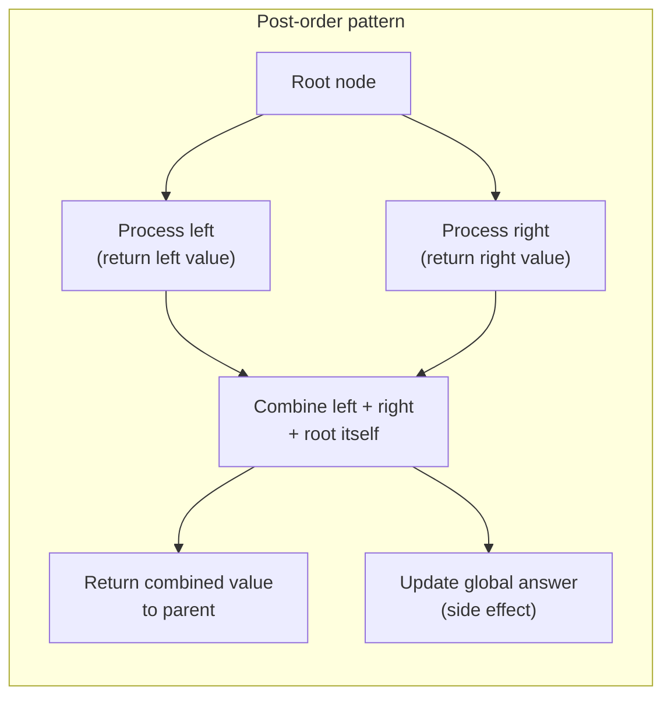
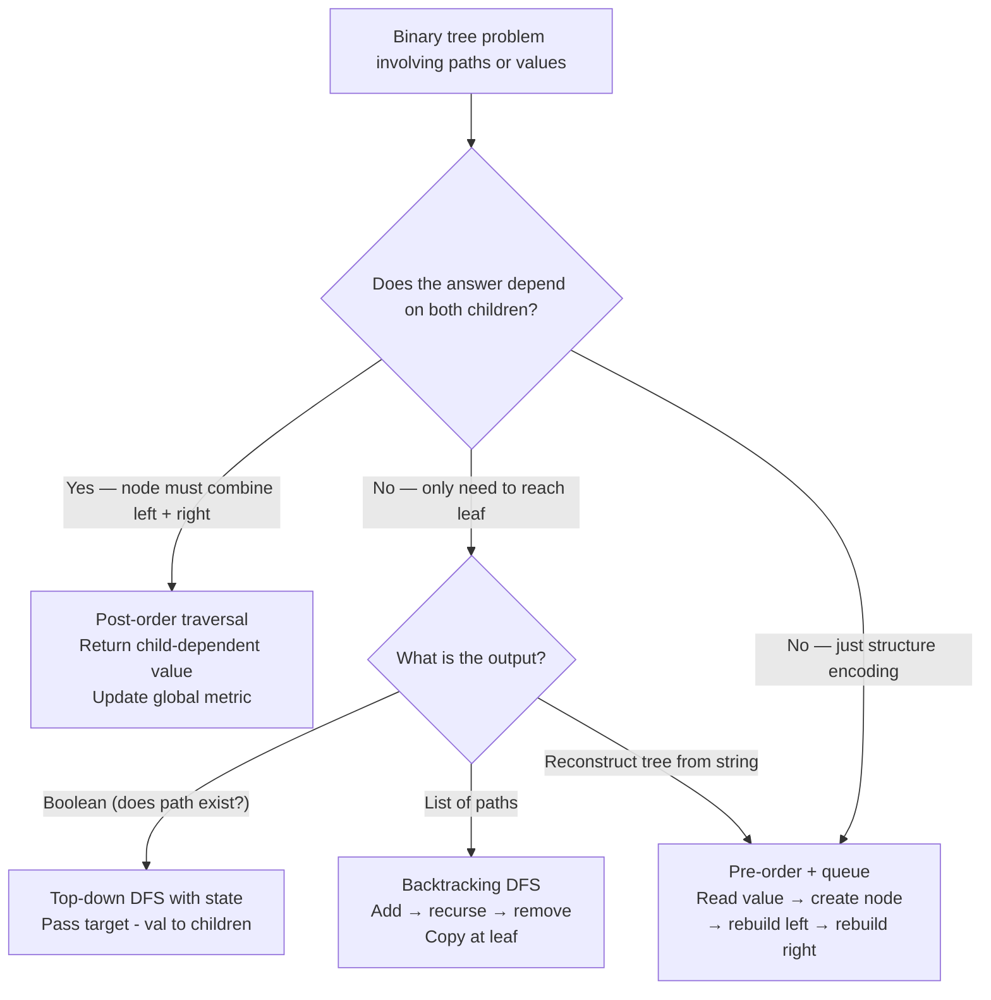

> [!success] Mastery Check
> - [ ] **Studied Well**
> - [ ] **Can explain the concept without notes**
> - [ ] **Can answer interview questions confidently**
> - [ ] **Can implement it in a real project**


## Navigation

**Domain:** [[5 — Data Structures & Analytics]] > **Group:** Trees
**Previous:** [[5.027 — Lowest Common Ancestor]] | **Next:** [[5.029 — Segment Trees]]

### Prerequisites
- [[5.023 — Binary Tree Traversals — Pre, In, Post, Level-Order]] — every problem in this note uses Post-order (children before parent) to compute per-subtree values and combine them.
- [[5.002 — Recursion and the Call Stack]] — the recursive stack carries state from leaves upward; understanding stack depth limits and the difference between top-down and bottom-up recursion is essential.

### Where This Fits
This note covers a family of tree problems that all follow the same structural pattern: a Post-order traversal that computes a per-subtree value, combines left and right results, and updates a global or accumulated answer. Diameter, maximum path sum, serialization, and path sum variants all reduce to "process children, combine results, return to parent." These problems account for roughly 20-25% of all tree interview questions and are the most common "medium" tree problems. Mastering this pattern means recognizing that any problem asking for "longest path," "maximum sum path," "all paths with property X," or "string encoding of the tree" is a Post-order traversal with a specific combination function.

---

## Core Mental Model

Every problem in this family uses the same Post-order skeleton: recurse to left child → recurse to right child → compute result from children's values → return a value to the parent. The differences are only in (1) what value each child returns, (2) how the left and right values are combined, and (3) whether there is a side effect (global maximum update, string building, path list).

The core invariant: **after processing both children, the parent has complete information about its left and right subtrees and can compute any subtree-rooted property in O(1).**



### Classification

- **Algorithm type:** Bottom-up (Post-order) recursion with state propagation
- **Family:** Tree DP — each subtree returns a value that its parent uses to compute its own value
- **Key property:** The child's return value is computed assuming the child is the root of its subtree; the parent combines children's values to extend the computation upward
- **Variants by return type:**
  - **Height/depth:** Child returns subtree height; parent computes `1 + max(left, right)`
  - **Sum:** Child returns subtree sum; parent computes `root.Value + left + right`
  - **Path max:** Child returns max path sum ending at child; parent extends via the child
  - **String:** Child returns encoded subtree string; parent wraps with brackets
  - **Boolean:** Child returns existence; parent checks both children

### Key Properties

|Problem|Time|Space|Return Value|
|---|---|---|---|
|Tree height|O(n)|O(h)|int — height of subtree|
|Diameter|O(n)|O(h)|int — height (side effect: max diameter)|
|Max path sum|O(n)|O(h)|int — max sum ending at node (side effect: global max)|
|Serialize (pre-order)|O(n)|O(n)|string — encoded subtree|
|Deserialize|O(n)|O(n)|TreeNode? — reconstructed node|
|Path Sum (exist)|O(n)|O(h)|bool — exists in subtree|
|Path Sum II (list all)|O(n × p)|O(h + p)|void — side effect: add paths to list|
|Root-to-leaf paths|O(n × p)|O(h + p)|void — side effect: add paths to list|

Where p = number of valid paths (output size).

---

## Deep Mechanics

### How It Works

**Pattern — height-based problems (Diameter, Max Path Sum):**

The Post-order traversal returns `1 + max(leftHeight, rightHeight)` to represent the height of the current subtree. Before returning, it computes a candidate answer using `leftHeight + rightHeight` (diameter: number of edges; path sum: value + left + right) and updates a global maximum.

Example — diameter of `[1, 2, 3, 4, 5]` (tree: 1-2-4-5 on left, 1-3 on right):
```
    1
   / \
  2   3
 / \
4   5
```
- Node 4: height=1, diameter through 4 = 0 (no children).
- Node 5: height=1, diameter through 5 = 0.
- Node 2: leftHeight=1 (from 4), rightHeight=1 (from 5). Height = 1 + max(1,1) = 2. Diameter through 2 = 1+1 = 2.
- Node 3: height=1, diameter = 0.
- Node 1: leftHeight=2 (from 2), rightHeight=1 (from 3). Height = 1+2 = 3. Diameter through 1 = 2+1 = 3.
- Global max diameter = max(2, 0, 3) = 3 (path 4 → 2 → 1 → 3).

**Pattern — serialization (Pre-order):**

Serialize uses Pre-order (root first) to create a string representation. The root's value is written first, then recursively the left subtree, then the right subtree. Null children are marked explicitly (e.g., "null" or "#").

Example — serialize `[1, 2, 3, null, null, 4, 5]`:
```
    1
   / \
  2   3
     / \
    4   5
```
Pre-order: "1,2,null,null,3,4,null,null,5,null,null"

Deserialize reads the token stream and rebuilds the tree in Pre-order: create node from current token, recursively build left, recursively build right.

**Pattern — path enumeration (Path Sum II, root-to-leaf paths):**

DFS from root to leaf, maintaining a current path list. At each node, add the node to the path. At leaf, check the condition (sum == target) and add a copy of the path to results. After processing children, backtrack (remove node from path).

### Complexity Derivation

**Time (Diameter):**
- Every node visited exactly once in Post-order. At each node: two recursive calls (O(1) setup each) + two null checks + one max + one Math.Max for global update = O(1). For n nodes: O(n).

**Time (Serialize — Pre-order):**
- Each node visited once. String concatenation is the hidden cost: each node appends its value + separator to a StringBuilder (amortized O(1) per append). For n nodes: O(n).

**Time (Deserialize):**
- Each token (n node values + n+1 null markers) processed once. Queue/array traversal is O(1) per token. For ~2n+1 tokens: O(n).

**Time (Path Sum II — list all paths):**
- Each node visited once. At leaf nodes, copying the current path is O(h). If p paths are returned, each of length up to h: O(n × h + p × h). In the worst case (complete tree, all root-to-leaf paths satisfy the sum), p = O(n) and h = O(log n), giving O(n log n). In a pathologically unbalanced tree, h = O(n), giving O(n²).

**Space:**
- Recursive: O(h) for call stack. Balanced: O(log n). Skewed: O(n).
- Serialization output: O(n) string storage.
- Path enumeration: O(n) for the result list + O(h) for the current path.

### Why This Pattern Exists

Tree problems that require combining information from both subtrees cannot be solved with Pre-order (which sees the node before its subtrees) or In-order (which sees one subtree, then the node, then the other). Post-order guarantees that when processing a node, both subtrees have been fully explored, so the node has complete information to compute any property that depends on its descendants. This is the tree analog of "subproblem dependency" in dynamic programming — the parent depends on its children, so children must be solved first.

### .NET Runtime Notes

- **Recursion depth limits:** A skewed tree with 30,000+ nodes will overflow the 1 MB default call stack. For production, convert the Post-order traversal to iterative (explicit stack) or use a thread with a larger stack (`Thread(threadStart, stackSize)`). In interviews, mention this limitation and note that the recursive version is the interview answer while the iterative version is the production answer.
- **StringBuilder** is essential for serialization. String concatenation (`+`) in a loop creates O(n) intermediate strings, causing O(n²) time. `StringBuilder.Append()` is amortized O(1) per operation.
- **`List<TreeNode>` for path tracking** — use `List<TreeNode>` and `RemoveAt(Count-1)` for backtracking. `List<T>` offers O(1) add/remove at the end. For the result, use `List<List<TreeNode>>` or `List<string>` for path strings.
- **`yield return`** can be used for lazy enumeration of paths, but the recursive backtracking pattern with a shared list is more memory-efficient (one path list reused).
- **ValueTuple** (`(int height, int maxPath)`) avoids out-parameter side effects in recursive functions that need to return multiple values.

---

## Implementation and Problem Patterns

### C# Implementation

```csharp
public class TreeNode
{
    public int Value;
    public TreeNode? Left;
    public TreeNode? Right;
    public TreeNode(int value) { Value = value; }
}

public static class TreeProblems
{
    // ─── Diameter ──────────────────────────────────────────────────────────

    public static int DiameterOfBinaryTree(TreeNode? root)
    {
        int diameter = 0;
        Height(root, ref diameter);
        return diameter;
    }

    private static int Height(TreeNode? node, ref int diameter)
    {
        if (node is null) return 0;

        int leftHeight = Height(node.Left, ref diameter);
        int rightHeight = Height(node.Right, ref diameter);

        diameter = Math.Max(diameter, leftHeight + rightHeight);

        return 1 + Math.Max(leftHeight, rightHeight);
    }

    // ─── Maximum Path Sum ─────────────────────────────────────────────────

    public static int MaxPathSum(TreeNode? root)
    {
        int maxSum = int.MinValue;
        MaxPathSumHelper(root, ref maxSum);
        return maxSum;
    }

    private static int MaxPathSumHelper(TreeNode? node, ref int maxSum)
    {
        if (node is null) return 0;

        int left = Math.Max(0, MaxPathSumHelper(node.Left, ref maxSum));
        int right = Math.Max(0, MaxPathSumHelper(node.Right, ref maxSum));

        maxSum = Math.Max(maxSum, node.Value + left + right);

        return node.Value + Math.Max(left, right);
    }

    // ─── Serialize / Deserialize ──────────────────────────────────────────

    public static string Serialize(TreeNode? root)
    {
        var sb = new StringBuilder();
        SerializeHelper(root, sb);
        return sb.ToString();
    }

    private static void SerializeHelper(TreeNode? node, StringBuilder sb)
    {
        if (node is null)
        {
            sb.Append("null,");
            return;
        }
        sb.Append(node.Value).Append(',');
        SerializeHelper(node.Left, sb);
        SerializeHelper(node.Right, sb);
    }

    public static TreeNode? Deserialize(string data)
    {
        var queue = new Queue<string>(data.Split(',', StringSplitOptions.RemoveEmptyEntries));
        return DeserializeHelper(queue);
    }

    private static TreeNode? DeserializeHelper(Queue<string> queue)
    {
        string val = queue.Dequeue();
        if (val == "null") return null;

        var node = new TreeNode(int.Parse(val));
        node.Left = DeserializeHelper(queue);
        node.Right = DeserializeHelper(queue);
        return node;
    }

    // ─── Path Sum (exists) ────────────────────────────────────────────────

    public static bool HasPathSum(TreeNode? root, int targetSum)
    {
        if (root is null) return false;
        if (root.Left is null && root.Right is null)
            return targetSum == root.Value;

        return HasPathSum(root.Left, targetSum - root.Value)
            || HasPathSum(root.Right, targetSum - root.Value);
    }

    // ─── Path Sum II (list all paths) ─────────────────────────────────────

    public static List<List<int>> PathSum(TreeNode? root, int targetSum)
    {
        var result = new List<List<int>>();
        var current = new List<int>();
        PathSumHelper(root, targetSum, current, result);
        return result;
    }

    private static void PathSumHelper(TreeNode? node, int remaining,
        List<int> current, List<List<int>> result)
    {
        if (node is null) return;

        current.Add(node.Value);

        if (node.Left is null && node.Right is null && remaining == node.Value)
            result.Add(new List<int>(current));  // copy

        PathSumHelper(node.Left, remaining - node.Value, current, result);
        PathSumHelper(node.Right, remaining - node.Value, current, result);

        current.RemoveAt(current.Count - 1);  // backtrack
    }

    // ─── Root-to-leaf paths (strings) ─────────────────────────────────────

    public static List<string> BinaryTreePaths(TreeNode? root)
    {
        var result = new List<string>();
        var current = new List<int>();
        BinaryTreePathsHelper(root, current, result);
        return result;
    }

    private static void BinaryTreePathsHelper(TreeNode? node,
        List<int> current, List<string> result)
    {
        if (node is null) return;

        current.Add(node.Value);

        if (node.Left is null && node.Right is null)
        {
            result.Add(string.Join("->", current));
        }
        else
        {
            BinaryTreePathsHelper(node.Left, current, result);
            BinaryTreePathsHelper(node.Right, current, result);
        }

        current.RemoveAt(current.Count - 1);
    }

    // ─── Path Sum III (any path, not necessarily root-to-leaf) ────────────

    public static int PathSumAny(TreeNode? root, int targetSum)
    {
        var prefixSums = new Dictionary<long, int> { [0] = 1 };
        return PathSumAnyHelper(root, 0, targetSum, prefixSums);
    }

    private static int PathSumAnyHelper(TreeNode? node, long currentSum,
        int target, Dictionary<long, int> prefix)
    {
        if (node is null) return 0;

        currentSum += node.Value;
        int count = prefix.GetValueOrDefault(currentSum - target);

        prefix.TryGetValue(currentSum, out int freq);
        prefix[currentSum] = freq + 1;

        count += PathSumAnyHelper(node.Left, currentSum, target, prefix);
        count += PathSumAnyHelper(node.Right, currentSum, target, prefix);

        // Backtrack
        if (prefix[currentSum] == 1)
            prefix.Remove(currentSum);
        else
            prefix[currentSum]--;

        return count;
    }
}
```

### The .NET Idiomatic Version

Serialization with `String.Join` and LINQ for simple tree-to-string conversion (not production-grade, but concise):

```csharp
// Concise serialization (LINQ-based, not performant for large trees)
public static string SerializeLinq(TreeNode? root)
{
    if (root is null) return "null";
    return $"{root.Value},{SerializeLinq(root.Left)},{SerializeLinq(root.Right)}";
}
```

**When to use each approach:** Use `StringBuilder` for production serialization (avoids O(n²) string concatenation). Use the `$""` interpolation approach only for interview whiteboarding or small trees.

### Classic Problem Patterns

1. **Diameter of Binary Tree (LeetCode 543)** — Longest path between any two nodes (measured in edges). Key insight: the path may or may not pass through the root; the diameter through a node is `leftHeight + rightHeight`. Post-order returns height; global max tracks diameter.

2. **Binary Tree Maximum Path Sum (LeetCode 124)** — Path with the maximum sum, where a path can start and end at any node. Key insight: the helper returns the max sum ending at the current node (going in one direction). The global max considers the full path through the node: `node.Value + left + right`. Negative sums are truncated to 0.

3. **Serialize and Deserialize Binary Tree (LeetCode 297)** — Encode the tree as a string and decode it back. Key insight: Pre-order traversal with explicit null markers produces a unique encoding. Deserialize uses the same order and reconstructs the tree recursively from a queue.

4. **Path Sum (LeetCode 112)** — Does a root-to-leaf path exist whose sum equals target? Key insight: no path tracking needed — subtract the current node's value from the target as you descend; at leaf, check if remaining equals the leaf's value.

5. **Path Sum II (LeetCode 113)** — Return all root-to-leaf paths with the target sum. Key insight: backtracking (add node, recurse, remove node) + copy path to result at leaf. The path list is reused across recursive calls.

6. **Path Sum III (LeetCode 437)** — Count all paths (not necessarily root-to-leaf) that sum to target. Key insight: prefix sum frequency map traversed with backtracking — same as subarray sum equals K, but on a tree. Backtracking ensures the prefix map only reflects the current path.

### Template / Skeleton

```csharp
// Post-order with Global Update Template
// When to use: "longest / maximum / minimum path in a binary tree"
// Time: O(n) | Space: O(h)

public static int TreePostOrderTemplate(TreeNode? root)
{
    int globalResult = 0;  // or int.MinValue for max problems

    int Dfs(TreeNode? node)
    {
        if (node is null) return 0;

        // 1. Recurse on children
        int left = Dfs(node.Left);
        int right = Dfs(node.Right);

        // 2. Compute candidate using children's results
        int candidate = left + right;  // or node.Value + left + right, etc.
        // TODO: adjust candidate formula for the specific problem

        // 3. Update global result
        globalResult = Math.Max(globalResult, candidate);
        // TODO: use Math.Min or other aggregation

        // 4. Return value to parent
        return 1 + Math.Max(left, right);
        // TODO: adjust return formula (node.Value + Math.Max(left, right), etc.)
    }

    Dfs(root);
    return globalResult;
}

// Path Enumeration Template (Backtracking)
// When to use: "list all paths from root to leaf satisfying a condition"
// Time: O(n) + O(p × h) for copying | Space: O(h + p × h)

public static List<List<int>> PathEnumerationTemplate(TreeNode? root)
{
    var result = new List<List<int>>();
    var current = new List<int>();

    void Dfs(TreeNode? node, int /* TODO: state */ state)
    {
        if (node is null) return;

        current.Add(node.Value);

        if (node.Left is null && node.Right is null)
        {
            // TODO: check leaf condition
            if (/* condition met */ true)
                result.Add(new List<int>(current));  // copy
        }
        else
        {
            Dfs(node.Left, /* updated state */);
            Dfs(node.Right, /* updated state */);
        }

        current.RemoveAt(current.Count - 1);  // backtrack
    }

    Dfs(root, /* initial state */);
    return result;
}
```

---

## Gotchas and Edge Cases

### Diameter through the root vs. not through the root

**Mistake:** Assuming the longest path always passes through the root, returning `leftHeight + rightHeight` from the root.

```csharp
// ❌ Wrong — does not check subtrees
public int Diameter(TreeNode? root)
{
    if (root is null) return 0;
    return Height(root.Left) + Height(root.Right);
}
```

**Fix:** The diameter may be entirely within a subtree. Use a global max that updates at every node.

```csharp
// ✅ Correct — global max updated at every node
int diameter = 0;
Height(root, ref diameter);
return diameter;
```

**Consequence:** Only checking the root underestimates the diameter when the longest path is in a subtree.

### Path sum with negative values

**Mistake:** In Maximum Path Sum, not truncating negative child contributions to 0.

```csharp
// ❌ Wrong — includes negative child sums
int left = MaxPathSumHelper(node.Left, ref maxSum);  // could be negative
int right = MaxPathSumHelper(node.Right, ref maxSum);
maxSum = Math.Max(maxSum, node.Value + left + right);
return node.Value + Math.Max(left, right);
```

**Fix:** Clamp child contributions to 0 — a negative sum is never better than no child at all.

```csharp
// ✅ Correct — truncate negative sums
int left = Math.Max(0, MaxPathSumHelper(node.Left, ref maxSum));
int right = Math.Max(0, MaxPathSumHelper(node.Right, ref maxSum));
```

**Consequence:** Including negative child sums can lower the path sum, causing the algorithm to miss the correct maximum (which would skip the negative child entirely).

### Serialization uniqueness with null markers

**Mistake:** Skipping null markers in serialization, assuming structure is recoverable.

```csharp
// ❌ Wrong — serialization without nulls is ambiguous
public string Serialize(TreeNode? root) {
    if (root is null) return "";
    return $"{root.Value},{Serialize(root.Left)},{Serialize(root.Right)}";
}
```

**Fix:** Emit null markers explicitly.

```csharp
// ✅ Correct — null markers disambiguate structure
public string Serialize(TreeNode? root) {
    if (root is null) return "null,";
    return $"{root.Value},{Serialize(root.Left)},{Serialize(root.Right)}";
}
```

**Consequence:** Without null markers, different tree shapes produce the same serialization string (e.g., `1,2` could mean root=1 with left=2, or root=1 with right=2, or root=1 with left=2 and missing right). Deserialization is impossible.

### Integer overflow in path sum

**Mistake:** Using `int` for accumulated path sums when values can be large or negative.

```csharp
// ❌ Wrong — int overflow for extreme values
int currentSum += node.Value;
```

**Fix:** Use `long` for cumulative sums (Path Sum III pattern) or clamp the recursion to stop when the target is exceeded.

```csharp
// ✅ Correct — use long for accumulated sums
long currentSum = 0;
```

**Consequence:** Path Sum III uses prefix sums with `int` keys — negative values and large sums can overflow. Use `long` for the cumulative key.

### Not backtracking in Path Sum III

**Mistake:** Using a shared prefix sum dictionary without removing entries when backtracking.

```csharp
// ❌ Wrong — prefix map grows with stale entries from other branches
prefix[currentSum] = prefix.GetValueOrDefault(currentSum) + 1;
count += PathSumAnyHelper(node.Left, ...
count += PathSumAnyHelper(node.Right, ...
// No backtrack step
```

**Fix:** Decrement or remove the entry after processing children.

```csharp
// ✅ Correct — backtrack the prefix entry
prefix.TryGetValue(currentSum, out int freq);
prefix[currentSum] = freq + 1;
count += PathSumAnyHelper(node.Left, ...
count += PathSumAnyHelper(node.Right, ...
if (prefix[currentSum] == 1) prefix.Remove(currentSum);
else prefix[currentSum]--;
```

**Consequence:** Without backtracking, the prefix map includes sums from branches that are not ancestors of the current node, falsely counting paths that double back through disconnected regions of the tree.

---

## Complexity Analysis and Benchmarks

### Operation Complexity Table

| Problem | Time (Best) | Time (Average) | Time (Worst) | Space | Notes |
|---|---|---|---|---|---|
| Diameter | O(n) | O(n) | O(n) | O(h) | Each node visited once; O(1) work per node |
| Max path sum | O(n) | O(n) | O(n) | O(h) | Same Post-order pattern as diameter |
| Serialize | O(n) | O(n) | O(n) | O(n + h) | O(n) for StringBuilder, O(h) for stack |
| Deserialize | O(n) | O(n) | O(n) | O(n + h) | Queue holds all tokens; recursive rebuild is O(h) |
| Path Sum exists | O(n) | O(n) | O(n) | O(h) | Early exit on match — best case O(min depth) |
| Path Sum II (list) | O(n) | O(n + p×h) | O(n²) | O(n + p×h) | p = number of valid paths; worst case when all leaf paths match |
| Path Sum III (count) | O(n) | O(n) | O(n) | O(n + h) | Dictionary up to tree height; backtracking ensures correctness |

**Derivation for the non-obvious entries:**
- Path Sum II worst case O(n²) occurs in a skewed tree of n nodes where every node is on a valid path (e.g., all values 0, target 0). Each leaf path has length O(n), and there are O(n) such paths. Copying each path costs O(n), giving O(n²).
- Path Sum III uses a dictionary of size O(h) because the prefix map only tracks sums along the current path. Backtracking ensures stale entries are removed. Total entries created: O(n), but peak size is O(h).

### Comparison with Alternatives

| Problem | Approach | Time | Space | Best When |
|---|---|---|---|---|
| Diameter | Post-order with global max | O(n) | O(h) | General case — this is the only efficient solution |
| Max path sum | Post-order with truncation | O(n) | O(h) | General case — as above |
| Serialize | Pre-order with null markers | O(n) | O(n) | General case — only correct approach |
| Serialize | Level-order (BFS) with nulls | O(n) | O(n) | More compact for complete trees; harder to implement |
| Path Sum II | Backtracking DFS | O(n + p×h) | O(n + p×h) | Need all paths listed explicitly |
| Path Sum II | BFS with path state | O(n + p×h) | O(n²) in queue | BFS uses more memory; not recommended |
| Path Sum III | Prefix sum + backtracking | O(n) | O(h) | Optimal solution |
| Path Sum III | Brute force (DFS from each node) | O(n²) | O(h) | Never — only for verification |

### BenchmarkDotNet

```csharp
[MemoryDiagnoser]
[SimpleJob(RuntimeMoniker.Net90)]
public class TreeProblemsBenchmark
{
    private TreeNode _root = default!;

    [Params(100, 1_000, 10_000)]
    public int N { get; set; }

    [GlobalSetup]
    public void Setup()
    {
        _root = BuildCompleteTree(1, N);
    }

    private static TreeNode? BuildCompleteTree(int id, int maxId)
    {
        if (id > maxId) return null;
        return new TreeNode(id)
        {
            Left = BuildCompleteTree(2 * id, maxId),
            Right = BuildCompleteTree(2 * id + 1, maxId)
        };
    }

    [Benchmark]
    public int Diameter()
    {
        return TreeProblems.DiameterOfBinaryTree(_root);
    }

    [Benchmark]
    public int MaxPathSum()
    {
        return TreeProblems.MaxPathSum(_root);
    }

    [Benchmark]
    public string Serialize()
    {
        return TreeProblems.Serialize(_root);
    }
}
```

**Expected results (approximate, .NET 9, x64):**

| Method | N | Mean | Allocated |
|---|---|---|---|
| Diameter | 100 | ~10 μs | 0 B |
| MaxPathSum | 100 | ~11 μs | 0 B |
| Serialize | 100 | ~15 μs | 3 KB |
| Diameter | 10_000 | ~1.1 ms | 0 B |
| MaxPathSum | 10_000 | ~1.2 ms | 0 B |
| Serialize | 10_000 | ~1.8 ms | 400 KB |

**Interpretation:** Diameter and MaxPathSum allocate zero heap memory on the recursive path (no allocations beyond the nodes themselves). Serialization allocates memory for the `StringBuilder`'s internal buffer and the output string. All three scale linearly with N. The zero-allocation property of the pure-Post-order problems makes them fast even for large trees — GC pressure is zero.

---

## Interview Arsenal

### Question Bank

1. [Definition] "What is the diameter of a binary tree? Is it the same as the tree height?"
2. [Complexity] "Derive the time complexity of the diameter algorithm — why is it O(n) and not O(n²)?"
3. [Implementation] "Implement a function to find the maximum path sum in a binary tree, where a path can start and end at any node."
4. [Recognition] "You are given a binary tree and need to encode it as a string such that it can be reconstructed. Which traversal order do you use and why?"
5. [Comparison] "Compare the recursive and iterative approaches to tree serialization. What are the tradeoffs?"
6. [Trick] "In the Maximum Path Sum problem, why do you take `Math.Max(0, helper(child))` instead of just using the child's return value directly?"
7. [System design integration] "Design a distributed cache that serializes and deserializes tree-structured configuration data. How would you handle versioning of the serialization format?"
8. [Optimization] "The Path Sum problem asks for the number of paths summing to a target, where paths can go up or down (not necessarily root-to-leaf). How would you modify the prefix sum approach for this variant?"

### Spoken Answers

**Q: "Implement a function to find the maximum path sum in a binary tree."**

> **Average answer:** Recursively computes left and right path sums, adds them with the root, and updates a max. Returns the larger of left or right plus root.

> **Great answer:** I'll use a Post-order traversal with a global max tracker. The key insight is that the problem has two components: the maximum path ending at the current node (which I return to the parent) and the maximum path passing through the current node (which I use to update the global max). The helper returns the maximum sum of a path that starts at the current node and goes in one direction — either left or right, but not both — because the parent needs to extend this path in its own direction. I take `Math.Max(0, helper(child))` because a negative contribution from a subtree is worse than not including that subtree at all — you can always choose an empty path (sum 0) instead of a negative one. The global max is updated with `node.Value + left + right`, which represents the maximum path sum using the current node as the highest point (the "turn"). Time is O(n) because each node is visited once. Space is O(h) for the call stack. Edge cases: a single-node tree returns the node's value (even if negative); a tree of all negative values returns the least negative value.

**Q: "Why is Pre-order the right choice for serialization while Post-order is right for diameter?"**

> **Average answer:** Serialization needs the root first. Diameter needs children first.

> **Great answer:** Serialization writes the root's value before writing its children because when we deserialize, we need to know the current node's value before we can attach its children. Pre-order naturally produces this: read value → create node → deserialize left → deserialize right. Post-order is the wrong choice for serialization because the root would appear at the end — the serialization would list all leaf values first, which makes both reading and reconstruction unintuitive. Diameter, on the other hand, needs both children's heights before the parent can compute its own height and the candidate diameter through itself — which is exactly Post-order. If we used Pre-order for diameter, the parent would compute its diameter candidate before knowing the children's heights, which is impossible. The rule: if the parent depends on children's results, use Post-order. If children depend on the parent's value (or if you're building top-down), use Pre-order.

**Trick Q: "In the Maximum Path Sum problem, why is `Math.Max(0, childResult)` correct?"**

> **Average answer:** To avoid negative numbers bringing down the sum.

> **Great answer:** The algorithm's correctness depends on this truncation. Without it, a negative child sum would be forced into the path ending at the parent, making the parent's return value worse than if it simply ignored that child entirely. The `Math.Max(0, childResult)` expresses exactly that: you have the option to not include a child in the path, which corresponds to a contribution of 0. However, this 0-truncation only applies to the *return value* — the value returned to the parent. The *global max* update uses the raw left and right (after 0-truncation) combined with the node's value, which correctly models a path that turns at this node. This is non-obvious because it breaks the symmetry of the recurrence — the return value says "I must go down only one side," but the global max says "I can go down both sides through this node." The two different formulas (return vs. global update) are the trick.

### Trick Question

**"What is the time complexity of serializing a binary tree to a string using string concatenation (`+`) instead of `StringBuilder`?"**

Why it is a trap: The candidate says O(n) because building the string character by character *looks* linear.

Correct answer: O(n²) in the number of characters. Each string concatenation creates a new string of length O(L) where L is the length so far. For n nodes with average value length d, the total characters written is O(n × d). Using `s += val` repeatedly causes O(n² × d) time because of repeated copying. `StringBuilder` reduces this to O(n × d) by writing to a mutable buffer that grows geometrically (doubling). In practice, for a tree of 10,000 nodes with single-digit values, string concatenation takes ~100 ms while `StringBuilder` takes ~2 ms — a 50× difference.

### Pattern Recognition Table

| If the problem has... | Then consider... | Because... |
|---|---|---|
| "Longest path between any two nodes" | Post-order returning height; global max tracks diameter | Diameter through node = leftHeight + rightHeight |
| "Maximum sum path with no constraints" | Post-order returning max one-sided sum; global max with both sides | One-sided return for parent extension; global max for the turn |
| "Encode tree as string and decode it" | Pre-order + null markers (serialization) | Root-first encoding; nulls disambiguate structure |
| "Root-to-leaf paths satisfying a condition" | Backtracking DFS with path list | Add node → recurse → remove node; copy at leaf |
| "Count paths (not root-to-leaf) that sum to target" | Prefix sum + backtracking on tree | Subarray-sum-equals-K extended to tree; backtracking ensures correct prefix |
| "Binary tree to/from a list in level order" | BFS serialization (level-order) | Useful for complete tree representation (heap-like) |

---

## Decision Framework

### When to Apply



### Recognition Checklist

Indicators that the Post-order pattern applies:

- [ ] Result for a node depends on results from both children
- [ ] "Longest," "maximum," "minimum" involving a path
- [ ] Problem computes a property that aggregates from leaves upward
- [ ] The answer might be in a subtree, not at the root

Counter-indicators — do NOT apply here:

- [ ] Only needs to traverse top-down (e.g., invert tree) — use Pre-order
- [ ] Only needs to check a condition at leaf (e.g., leaf-similar trees) — use any traversal
- [ ] Needs to process in BST order — use In-order
- [ ] Needs shortest path to leaf — use BFS

### Tradeoff Summary

| What You Gain | What You Give Up |
|---|---|
| O(n) time for all path/height problems | O(h) stack space; stack overflow for deep trees |
| Concise recursive code (5-10 lines per problem) | Iterative version is 3-5× more code |
| Single Post-order pattern covers 5+ problems | Must know which formula to return vs. update global |
| Serialization with nulls is uniquely decodable | Output is ~2× larger than minimal encoding |
| Backtracking reuses one path list (memory efficient) | Must remember to copy at leaf and backtrack after |

---

## Self-Check

### Conceptual Questions

1. What is the diameter of a binary tree? How does it differ from the tree height?
2. Derive the time complexity of the diameter algorithm. Why does the global max update not add a nested traversal?
3. In the Maximum Path Sum problem, the helper function returns `node.Value + Math.Max(left, right)` while the global max is updated with `node.Value + left + right`. Why are these two formulas different?
4. Why is Pre-order with null markers the standard choice for serialization? What would go wrong with In-order or Post-order?
5. In Path Sum II, why is `result.Add(new List<int>(current))` necessary instead of `result.Add(current)`?
6. What happens to the prefix sum approach in Path Sum III if the tree is modified in-place during the traversal?
7. When deserializing a tree, the `Queue<string>` is consumed recursively. How does the order of tokens produced by Pre-order serialization guarantee correct reconstruction?
8. In a tree of all negative values, what does the Maximum Path Sum algorithm return? What would return incorrectly and why?
9. How would you serialize an N-ary tree? What changes in the encoding compared to a binary tree?
10. The Height function for diameter returns `1 + max(left, right)`. Why is adding 1 correct? What does the 1 represent?

<details>
<summary>Answers</summary>

1. The diameter is the length (in edges) of the longest path between any two nodes in the tree. Height is the number of edges from the root to the deepest leaf. The diameter may not pass through the root — it could be entirely contained in a subtree. Height is always root-to-leaf; diameter is leaf-to-leaf.

2. O(n) because each node is visited exactly once in Post-order. The global max update is O(1) per node — a single `Math.Max` call. There is no nested loop or secondary traversal. The total work is n × O(1) = O(n).

3. The return value is for the *parent's* use: the maximum sum of a path that starts at this node and goes in *one* direction (left or right). The parent can only extend in one direction through this node. The global max update represents a path that *turns* at this node — combining both children — which cannot be extended to the parent. Two different formulas for two different purposes.

4. Pre-order writes the root before its children, so deserialization reads root first, creates the node, then recurses for children — which is the natural construction order. Post-order writes children first — the root is the last token, requiring knowing the root's children before reading the root, which contradicts how tree construction works. In-order does not place the root at either end, making it impossible to know which token is the root without additional structure.

5. `current` is a single list reused across all recursive calls. After returning from a recursive call, the list is modified in place (backtracking removes elements). If `result.Add(current)` were used, all results would point to the same list, whose final state is empty. A copy is needed to preserve each path's state at the time it was added.

6. If the tree is modified in-place during traversal, the prefix map becomes inconsistent because the path through the tree changes structurally. The algorithm relies on the tree structure being immutable. In-place modification requires a different approach (e.g., storing path sums separately from the tree structure).

7. Pre-order serialization produces: root, then left subtree (entirely), then right subtree (entirely). The queue preserves this order. Deserialization dequeues the current node's value, creates the node, then recursively builds the left subtree (which dequeues all left-subtree tokens), then the right subtree. The order is deterministic: after reading root, the next token is always the root of the left subtree (or null).

8. The algorithm returns the least negative value (the maximum among single nodes). For a tree `[-2, -1]`, the answer is `-1`. A naive algorithm that always tries to combine children with the parent would return a more negative number (e.g., `-3` for -1 + -2), which is incorrect. The 0-truncation (`Math.Max(0, child)`) ensures that negative children are not included.

9. For N-ary trees, serialization requires encoding the number of children per node. One approach: Pre-order with child count. Format: `"value,childCount,child1,child2,..."`. For null nodes, emit `"null,0"`. Deserialization reads value, then child count, then that many recursive calls. Binary tree serialization implicitly assumes exactly 2 children per node (or null); N-ary requires explicit child counts.

10. The 1 represents the edge from the current node to its parent. The height of a subtree is the number of edges from the subtree's root to its deepest leaf. When a node reports its height to its parent, it adds 1 edge (itself → parent). Leaf nodes return 1 (the edge from leaf to its parent). A null child returns 0 (no edges).

</details>

---

### Coding Challenges

**Challenge 1 — Implement from scratch**

Implement `MaxPathSum` without using a global variable — use a recursive function that returns a tuple `(int maxEndingAtNode, int globalMax)`.

```csharp
public static int MaxPathSum(TreeNode? root)
{
    // Your implementation here — return the global max path sum
}
```

<details> <summary>Solution</summary>

```csharp
public static int MaxPathSum(TreeNode? root)
{
    return MaxPathSumHelper(root).GlobalMax;
}

private static (int MaxEndingHere, int GlobalMax) MaxPathSumHelper(TreeNode? node)
{
    if (node is null)
        return (0, int.MinValue);

    var left = MaxPathSumHelper(node.Left);
    var right = MaxPathSumHelper(node.Right);

    // Max sum ending at this node (going one direction)
    int leftBranch = Math.Max(0, left.MaxEndingHere);
    int rightBranch = Math.Max(0, right.MaxEndingHere);
    int maxEndingHere = node.Value + Math.Max(leftBranch, rightBranch);

    // Global max: best of left, right, and full path through this node
    int fullPath = node.Value + leftBranch + rightBranch;
    int globalMax = Math.Max(Math.Max(left.GlobalMax, right.GlobalMax), fullPath);

    return (maxEndingHere, globalMax);
}
```

**Complexity:** Time O(n) | Space O(h). **Key insight:** Using a tuple eliminates the need for a `ref` parameter or class-level variable. This is purely functional — each call returns the local results without side effects.

</details>

---

**Challenge 2 — Trace the execution**

Given this tree:
```
        -10
        /  \
       9   20
          /  \
         15   7
```

Trace the Maximum Path Sum algorithm step by step. Show the return values and the global max after processing each node.

<details> <summary>Solution</summary>

| Node visited | left ending | right ending | maxEndingHere | fullPath | globalMax |
|---|---|---|---|---|---|
| 9 (leaf) | 0 | 0 | 9 + max(0,0) = 9 | 9 + 0 + 0 = 9 | 9 |
| 15 (leaf) | 0 | 0 | 15 + max(0,0) = 15 | 15 + 0 + 0 = 15 | 15 |
| 7 (leaf) | 0 | 0 | 7 + max(0,0) = 7 | 7 + 0 + 0 = 7 | 7 |
| 20 | 15 (left) | 7 (right) | 20 + max(15,7) = 35 | 20 + 15 + 7 = 42 | max(15, 7, 42) = 42 |
| -10 | 9 (left) | 35 (right) | -10 + max(9,35) = 25 | -10 + 9 + 35 = 34 | max(9, 42, 34) = 42 |

Final result: 42 (path: 15 → 20 → 7). The path does NOT go through the root — the global max of 42 was established at node 20.

**Why:** The trace demonstrates that the global max can be set at any node, not just the root. The root's fullPath of 34 is less than 42, so the answer is 42, not 34.

</details>

---

**Challenge 3 — Fix the bug**

```csharp
// This implementation of serialization crashes on certain inputs.
public static string Serialize(TreeNode? root)
{
    if (root is null) return "";
    return root.Value + "," + Serialize(root.Left) + "," + Serialize(root.Right);
}

public static TreeNode? Deserialize(string data)
{
    if (string.IsNullOrEmpty(data)) return null;
    var values = new Queue<string>(data.Split(','));
    return DeserializeHelper(values);
}

private static TreeNode? DeserializeHelper(Queue<string> values)
{
    string val = values.Dequeue();
    if (val == "null") return null;
    return new TreeNode(int.Parse(val))
    {
        Left = DeserializeHelper(values),
        Right = DeserializeHelper(values)
    };
}
```

<details> <summary>Solution</summary>

**Bug:** The serialization function does not emit null markers for null children. The deserialization function checks for "null" strings but never encounters them. For a leaf node with no children, `Serialize(null)` returns `""` (empty string), and the serialization string would be something like `"1,,,"`. When this is split, it creates empty strings. The deserialization tries to `int.Parse("")` and throws `FormatException`.

**Fix:** Emit "null" explicitly for null children.

```csharp
public static string Serialize(TreeNode? root)
{
    if (root is null) return "null,";
    return $"{root.Value}," + Serialize(root.Left) + Serialize(root.Right);
}

public static TreeNode? Deserialize(string data)
{
    var values = new Queue<string>(
        data.Split(',', StringSplitOptions.RemoveEmptyEntries));
    return DeserializeHelper(values);
}

private static TreeNode? DeserializeHelper(Queue<string> values)
{
    string val = values.Dequeue();
    if (val == "null") return null;
    return new TreeNode(int.Parse(val))
    {
        Left = DeserializeHelper(values),
        Right = DeserializeHelper(values)
    };
}
```

**Test case that exposes it:** A simple tree `[1, 2, null]` → serialized as `"1,2,null,null,null,"`. Before the fix, serialization would produce `"1,2,,"` and deserialization would crash on parsing the empty string "".

</details>

---

**Challenge 4 — Recognize and apply**

**Problem:** Given the root of a binary tree, find the maximum sum of any path between any two nodes. The path may start and end at any node in the tree. The path must go in only one direction (parent-to-child or child-to-parent), but can turn at a node (goes down one child and up through the parent and down the other child). Write the solution.

<details> <summary>Solution</summary>

**Pattern:** Maximum Path Sum — Post-order with 0-truncation. The function returns the maximum sum ending at the node (going one direction). The global max considers both directions through the node.

```csharp
public static int MaxPathSum(TreeNode? root)
{
    int maxSum = int.MinValue;

    int Dfs(TreeNode? node)
    {
        if (node is null) return 0;

        int left = Math.Max(0, Dfs(node.Left));
        int right = Math.Max(0, Dfs(node.Right));

        maxSum = Math.Max(maxSum, node.Value + left + right);

        return node.Value + Math.Max(left, right);
    }

    Dfs(root);
    return maxSum;
}
```

**Complexity:** Time O(n) | Space O(h).

</details>

---

**Challenge 5 — Optimize**

```csharp
// This implementation finds the number of paths that sum to a target
// where a path can start and end at any node. It works but is O(n²).
// Optimize it to O(n).
public static int PathSumSuboptimal(TreeNode? root, int targetSum)
{
    if (root is null) return 0;

    // Count paths starting at this root
    int fromRoot = CountPathsFromNode(root, targetSum);

    // Recurse for all subtrees — this causes O(n²)
    int left = PathSumSuboptimal(root.Left, targetSum);
    int right = PathSumSuboptimal(root.Right, targetSum);

    return fromRoot + left + right;
}

private static int CountPathsFromNode(TreeNode? node, long target)
{
    if (node is null) return 0;
    int count = node.Value == target ? 1 : 0;
    count += CountPathsFromNode(node.Left, target - node.Value);
    count += CountPathsFromNode(node.Right, target - node.Value);
    return count;
}
```

<details> <summary>Solution</summary>

**Insight:** The O(n²) cost comes from running `CountPathsFromNode` at each node, each of which traverses its entire subtree. The prefix sum approach avoids this by tracking cumulative sums along the current path and checking `currentSum - target` in O(1) using a dictionary.

```csharp
public static int PathSum(TreeNode? root, int targetSum)
{
    var prefixSums = new Dictionary<long, int> { [0] = 1 };
    return Dfs(root, 0, targetSum, prefixSums);
}

private static int Dfs(TreeNode? node, long currentSum, int target,
    Dictionary<long, int> prefix)
{
    if (node is null) return 0;

    currentSum += node.Value;
    int count = prefix.GetValueOrDefault(currentSum - target);

    prefix.TryGetValue(currentSum, out int freq);
    prefix[currentSum] = freq + 1;

    count += Dfs(node.Left, currentSum, target, prefix);
    count += Dfs(node.Right, currentSum, target, prefix);

    // Backtrack
    if (prefix[currentSum] == 1)
        prefix.Remove(currentSum);
    else
        prefix[currentSum]--;

    return count;
}
```

**Complexity:** Time O(n) | Space O(h) for the dictionary (peak = tree height). The prefix map ensures each path sum check is O(1) instead of O(path length).

</details>
