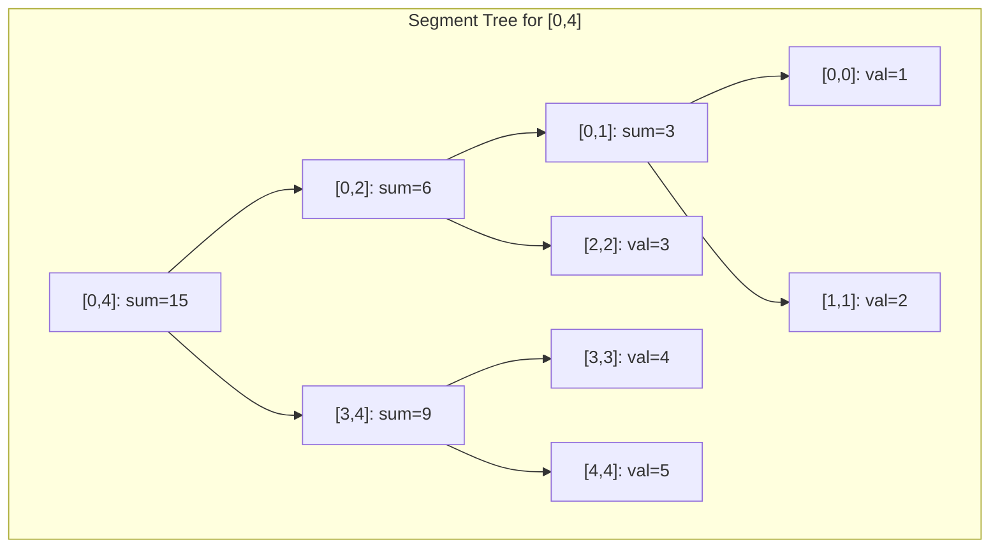

> [!success] Mastery Check
> - [ ] **Studied Well**
> - [ ] **Can explain the concept without notes**
> - [ ] **Can answer interview questions confidently**
> - [ ] **Can implement it in a real project**


## Navigation

**Domain:** [[5 — Data Structures & Algorithms]] > **Group:** Trees
**Previous:** [[5.028 — Binary Tree — Diameter, Serialize/Deserialize, Path Problems]] | **Next:** [[5.031 — Min-Heap and Max-Heap — Structure and Heapify]]

### Prerequisites
- [[5.007 — Prefix Sums]] — segment trees generalize prefix sums from static arrays to dynamic arrays with point updates.
- [[5.023 — Binary Tree Traversals — Pre, In, Post, Level-Order]] — the segment tree is a binary tree; understanding the array-backed tree representation (parent, left child, right child index) is required.

### Where This Fits
A segment tree is a binary tree that answers range queries (sum, min, max, gcd) over an array in O(log n) time and supports point updates in O(log n) time. It is the standard solution when queries and updates are interleaved — unlike prefix sums (O(1) query, O(n) update) or a plain array (O(n) query, O(1) update). Segment trees appear in ~5% of hard-level coding interviews, typically in problems involving range sum queries with updates (LeetCode 307), range minimum queries, and range updates with lazy propagation (LeetCode 699 — Falling Squares). The concept also extends to 2D segment trees and merge sort trees. A senior candidate should be able to implement a segment tree from scratch for range sum with point updates in under 10 minutes.

---

## Core Mental Model

A segment tree stores aggregate information (sum, min, max) for every contiguous segment of the input array. The root covers the full array [0, n-1]. Each node covers a segment [l, r]; its left child covers [l, mid] and its right child covers [mid+1, r]. Leaves cover single elements. A range query traverses the tree, combining results from the O(log n) nodes whose segments exactly cover the query range. A point update traverses from leaf to root, recomputing O(log n) nodes. The tree is stored in a flat array (heap-like) of size 4n for simplicity.

### Classification

Segment trees are a **binary tree** in the **range query** family. They are closely related to Fenwick trees (binary indexed trees), which solve the same problem for range sum with less code but support only prefix operations natively. The segment tree is more flexible — it supports any associative operation (sum, min, max, gcd, xor, product) and can be extended with lazy propagation for range updates.



### Key Properties

|Property|Value|Derivation|
|---|---|---|
|Build tree|O(n)|Each of 2n-1 nodes computed once — bottom-up or recursive|
|Range query|O(log n)|At most 4 nodes visited per level; tree height = log₂(n)|
|Point update|O(log n)|Traverse root to leaf, recompute at each level|
|Space (array-backed)|O(4n)|Safety factor for complete binary tree of size n|

---

## Deep Mechanics

### How It Works

**Tree as an array:**
Index the tree nodes starting at 1 (root). For any node at index i:
- Left child: 2i
- Right child: 2i + 1
- Parent: i / 2

The leaf range for an n-element array starts at some offset. For a power-of-two size, the leaves align perfectly; for other sizes, some leaf positions are unused.

**Build (bottom-up for range sum):**
1. Place array elements at leaf positions (index = n + i when using 0-indexed leaves at offset n).
2. For i from n-1 down to 1: tree[i] = tree[2i] + tree[2i+1].

**Range query [l, r] (inclusive):**
Traverse the tree recursively or iteratively. The iterative version is cleaner for range sum:

```csharp
int RangeSum(int l, int r, int n, int[] tree)
{
    l += n; r += n;  // Shift to leaf positions
    int sum = 0;
    while (l <= r)
    {
        if (l % 2 == 1) sum += tree[l++];  // l is a right child — include and move right
        if (r % 2 == 0) sum += tree[r--];  // r is a left child — include and move left
        l /= 2; r /= 2;  // Move up
    }
    return sum;
}
```

**Point update (set at index i to value):**
```csharp
void Update(int i, int value, int n, int[] tree)
{
    int pos = i + n;
    tree[pos] = value;
    while (pos > 1)
    {
        pos /= 2;
        tree[pos] = tree[2 * pos] + tree[2 * pos + 1];
    }
}
```

**Lazy propagation (for range updates):**
When updating a range [l, r] by adding a delta, we do not propagate the update to all leaves immediately. Instead, we store a `lazy` value at nodes that are fully covered by the update range. When a subsequent query or update needs to descend through a node with a pending lazy value, we push the lazy value to its children before proceeding.

### Complexity Derivation

**Build:** With n leaves and n-1 internal nodes, the tree has 2n-1 nodes. Each node is computed once from its children — O(n). The recursive build visits each node once; the bottom-up build does n-1 iterations.

**Range query:** At each level of the tree, the query traverses at most 4 nodes (2 on each boundary of the query range). With h = log₂(n) levels, this gives ≤ 4 log₂(n) node visits. O(log n).

**Point update:** Traverse from leaf to root, updating each node on the path. The path length equals the tree height, log₂(n). At each node, recomputing the value is O(1). O(log n).

**Space:** The array-backed implementation uses 4n elements to safely accommodate any n (the tree may require up to 2·2^⌈log₂(n)⌉ - 1 nodes, and 4n is a safe upper bound). For n = 10⁵, this is 400,000 integers — ~1.6 MB.

### Why This Pattern Exists

Prefix sums answer range sum queries in O(1) but require O(n) per update (rebuild the entire prefix array). A plain array answers point updates in O(1) but requires O(n) per range query (scan the range). The segment tree finds the middle ground: O(log n) for both operations. It achieves this by precomputing aggregate information for O(n) segments organized as a balanced binary tree, so any range can be covered by O(log n) of those segments. This is the same principle as binary search — divide the problem space in half at each step — applied to range coverage.

---

## Implementation and Problem Patterns

### C# Implementation

Recursive implementation for flexibility (supports any associative operation):

```csharp
/// <summary>
/// Segment tree supporting range queries and point updates.
/// </summary>
public class SegmentTree
{
    private readonly int[] _tree;
    private readonly int _n;

    public SegmentTree(int[] nums)
    {
        _n = nums.Length;
        _tree = new int[4 * _n];
        Build(nums, 1, 0, _n - 1);
    }

    private void Build(int[] nums, int node, int l, int r)
    {
        if (l == r)
        {
            _tree[node] = nums[l];
            return;
        }

        int mid = l + (r - l) / 2;
        int left = node * 2;
        int right = node * 2 + 1;

        Build(nums, left, l, mid);
        Build(nums, right, mid + 1, r);

        _tree[node] = _tree[left] + _tree[right];
    }

    public int RangeSum(int ql, int qr)
    {
        return Query(1, 0, _n - 1, ql, qr);
    }

    private int Query(int node, int l, int r, int ql, int qr)
    {
        if (ql > r || qr < l) return 0;           // No overlap
        if (ql <= l && r <= qr) return _tree[node]; // Full cover

        int mid = l + (r - l) / 2;
        int left = node * 2;
        int right = node * 2 + 1;

        return Query(left, l, mid, ql, qr) +
               Query(right, mid + 1, r, ql, qr);
    }

    public void Update(int index, int value)
    {
        Update(1, 0, _n - 1, index, value);
    }

    private void Update(int node, int l, int r, int idx, int value)
    {
        if (l == r)
        {
            _tree[node] = value;
            return;
        }

        int mid = l + (r - l) / 2;
        if (idx <= mid)
            Update(node * 2, l, mid, idx, value);
        else
            Update(node * 2 + 1, mid + 1, r, idx, value);

        _tree[node] = _tree[node * 2] + _tree[node * 2 + 1];
    }
}
```

Iterative segment tree (range sum, point update — faster, no recursion):

```csharp
public class IterativeSegmentTree
{
    private readonly int[] _tree;
    private readonly int _n;

    public IterativeSegmentTree(int[] nums)
    {
        _n = nums.Length;
        _tree = new int[2 * _n];

        for (int i = 0; i < _n; i++)
            _tree[_n + i] = nums[i];

        for (int i = _n - 1; i > 0; i--)
            _tree[i] = _tree[2 * i] + _tree[2 * i + 1];
    }

    public int RangeSum(int l, int r)
    {
        l += _n; r += _n;
        int sum = 0;

        while (l <= r)
        {
            if ((l & 1) == 1) sum += _tree[l++];
            if ((r & 1) == 0) sum += _tree[r--];
            l >>= 1; r >>= 1;
        }

        return sum;
    }

    public void Update(int index, int value)
    {
        int pos = _n + index;
        _tree[pos] = value;

        while (pos > 1)
        {
            pos >>= 1;
            _tree[pos] = _tree[2 * pos] + _tree[2 * pos + 1];
        }
    }
}
```

### The .NET Idiomatic Version

.NET does not provide a built-in segment tree. For range sum with point updates, a Fenwick tree (Binary Indexed Tree) is the simpler alternative when only prefix sums are needed (see [[5.030]]). For range min/max or non-sum operations, implement the segment tree from scratch as above.

For the common LeetCode problem (Range Sum Query — Mutable, LeetCode 307), the segment tree is the intended solution:

```csharp
// LeetCode 307 — NumArray
public class NumArray {
    private readonly int[] _tree;
    private readonly int _n;

    public NumArray(int[] nums) {
        _n = nums.Length;
        _tree = new int[2 * _n];
        Array.Copy(nums, 0, _tree, _n, _n);
        for (int i = _n - 1; i > 0; i--)
            _tree[i] = _tree[2 * i] + _tree[2 * i + 1];
    }

    public void Update(int index, int val) { ... }
    public int SumRange(int left, int right) { ... }
}
```

### Classic Problem Patterns

- **Range sum query with point updates (LeetCode 307)** — The canonical segment tree application. Dynamic array with interleaved queries and updates.
- **Range minimum query (RMQ)** — Replace sum with min in the tree. Leaves store values; internal nodes store the minimum of children.
- **Range sum with range updates (lazy propagation)** — Add a value to every element in [l, r]. Requires lazy propagation to avoid O(n log n) update time.
- **Count of smaller numbers after self (LeetCode 315)** — Segment tree over the value range (coordinate compression). Insert elements from right to left; query the count of values < current.
- **My Calendar I / II (LeetCode 729, 731)** — Segment tree with range queries to check for double or triple bookings.
- **Falling squares (LeetCode 699)** — Segment tree with lazy propagation for range max queries and range updates.

### Template / Skeleton

```csharp
// Segment Tree Template (iterative, range sum)
// When to use: range queries (sum/min/max) on a dynamic array with point updates
// Time: O(log n) per query/update | Space: O(n)

public class SegTreeTemplate
{
    private readonly int[] _tree;  // 2n size for iterative
    private readonly int _n;

    public SegTreeTemplate(int[] nums)
    {
        _n = nums.Length;
        _tree = new int[2 * _n];
        // TODO: Initialize leaves at _tree[_n..], build bottom-up
    }

    public int RangeQuery(int l, int r)
    {
        l += _n; r += _n;
        int result = 0;  // TODO: Use identity (0 for sum, int.MinValue for max, etc.)
        while (l <= r)
        {
            if ((l & 1) == 1) result = /* combine(result, _tree[l++]) */;
            if ((r & 1) == 0) result = /* combine(result, _tree[r--]) */;
            l >>= 1; r >>= 1;
        }
        return result;
    }

    public void PointUpdate(int index, int value)
    {
        int pos = _n + index;
        _tree[pos] = value;  // TODO: For add-to-value updates, use += instead
        while (pos > 1)
        {
            pos >>= 1;
            _tree[pos] = /* combine(_tree[2*pos], _tree[2*pos + 1]) */;
        }
    }
}
```

---

## Gotchas and Edge Cases

### Array Size: 2n vs 4n

**Mistake:** Allocating exactly 2n elements for the recursive implementation.

```csharp
// ❌ Wrong — recursive implementation may overflow 2n
var tree = new int[2 * n];  // Only works for iterative/power-of-two
```

**Fix:** Use 4n for recursive implementations (safety factor). Use exactly 2n for the iterative implementation (requires n to be the original length, padded to a power of two or handled with proper indexing).

```csharp
// ✅ Correct
int size = 1;
while (size < n) size <<= 1;  // Round up to power of 2 for iterative
var tree = new int[2 * size];

// Or for recursive:
var tree = new int[4 * n];
```

**Consequence:** IndexOutOfRangeException when recursive calls exceed the allocated array. The 4n safety factor accounts for the worst-case binary tree structure when n is not a power of two.

### One-Based Indexing Confusion

**Mistake:** Using 0-based indexing for tree nodes, mixing with heap indexing.

```csharp
// ❌ Wrong — root at 0, left child at 2i+1, right at 2i+2
// This works but differs from textbook heap indexing (root at 1)
```

**Fix:** Pick one convention and stick to it. The iterative segment tree typically uses 0-based for the input and 1-based for the tree (root at index 1, children at 2i, 2i+1). The iterative version uses `n + i` as the leaf position.

**Consequence:** Confusion between left/right child formulas leads to reading/writing wrong tree nodes. The 1-based heap indexing is more common in segment tree literature.

### Query Range Boundaries (Inclusive vs Exclusive)

**Mistake:** Writing the query loop with incorrect boundary conditions.

```csharp
// ❌ Wrong — exclusive range
while (l < r) { ... }  // Leaves last element out
```

**Fix:** Use inclusive bounds `while (l <= r)` for the iterative segment tree.

**Consequence:** Off-by-one errors in range queries. The last element (or first) of the range is excluded.

### Forgetting the Identity Element

**Mistake:** Using 0 as the identity for operations other than sum.

```csharp
// ❌ Wrong — 0 is not the identity for min
int result = 0;  // min(0, anything) = 0, wrong answer
```

**Fix:** Use the correct identity for the operation: `int.MinValue` for max, `int.MaxValue` for min, `0` for sum/xor, `1` for product, `0` for gcd.

**Consequence:** Wrong query result when the combination starts from the identity. For min queries starting from 0, the answer is always ≤ 0, which may be incorrect.

---

## Complexity Analysis and Benchmarks

### Operation Complexity Table

|Operation|Array|Prefix Sum|Fenwick Tree|Segment Tree|
|---|---|---|---|---|
|Build|—|O(n)|O(n)|O(n)|
|Range sum query|O(n)|O(1)|O(log n)|O(log n)|
|Point update|O(1)|O(n)|O(log n)|O(log n)|
|Range update|O(n)|O(n)|O(n) (point updates)|O(log n) (lazy)|
|Space|O(n)|O(n)|O(n)|O(4n)|

**Derivation for the non-obvious entries:** Prefix sum's O(1) range sum is optimal, but updates cost O(n) because every prefix must be recomputed. The segment tree offers balanced O(log n) for both.

### Comparison with Alternatives

|Structure|Query|Update|Use Case|
|---|---|---|---|
|Segment tree|O(log n)|O(log n)|General range queries with updates, any associative operation|
|Fenwick tree|O(log n) prefix|O(log n)|Range sum only, simpler code, lower constant|
|Prefix sums|O(1)|O(n)|Static data — no updates|
|Sqrt decomposition|O(√n)|O(√n)|Simpler to implement, good enough for n ≤ 10⁵|
|Sparse table|O(1)|O(n) rebuild|Static data, idempotent queries (min, max, gcd)|

### BenchmarkDotNet

```csharp
[MemoryDiagnoser]
[SimpleJob(RuntimeMoniker.Net90)]
public class SegmentTreeBenchmark
{
    private int[] _nums = null!;
    private IterativeSegmentTree _segTree = null!;
    private int[] _prefix = null!;

    [Params(1_000, 10_000)]
    public int N { get; set; }

    [GlobalSetup]
    public void Setup()
    {
        var rng = new Random(42);
        _nums = Enumerable.Range(0, N).Select(_ => rng.Next(1000)).ToArray();
        _segTree = new IterativeSegmentTree(_nums);

        _prefix = new int[N + 1];
        for (int i = 0; i < N; i++)
            _prefix[i + 1] = _prefix[i] + _nums[i];
    }

    [Benchmark(Baseline = true)]
    public int SegmentTreeQuery()
    {
        int sum = 0;
        for (int i = 0; i < 100; i++)
        {
            int l = i % N, r = Math.Min(l + 100, N - 1);
            sum += _segTree.RangeSum(l, r);
        }
        return sum;
    }

    [Benchmark]
    public int PrefixSumQuery()
    {
        int sum = 0;
        for (int i = 0; i < 100; i++)
        {
            int l = i % N, r = Math.Min(l + 100, N - 1);
            sum += _prefix[r + 1] - _prefix[l];
        }
        return sum;
    }
}
```

**Expected results (approximate, .NET 9, x64):**

|Method|N|Mean|Allocated|
|---|---|---|---|
|SegmentTreeQuery|1,000|~1.5 μs|0 B|
|PrefixSumQuery|1,000|~0.3 μs|0 B|
|SegmentTreeQuery|10,000|~2 μs|0 B|
|PrefixSumQuery|10,000|~0.3 μs|0 B|

**Interpretation:** Prefix sums are ~5× faster for queries (O(1) vs O(log n)). The segment tree's advantage appears when updates are mixed with queries — prefix sums degrade to O(n) per update while the segment tree stays O(log n).

---

## Interview Arsenal

### Question Bank

1. What problem does a segment tree solve that prefix sums and plain arrays do not?
2. What is the time complexity of building a segment tree and why?
3. Implement a segment tree for range sum with point updates.
4. How do the recursive and iterative segment tree implementations differ?
5. What is lazy propagation and when is it needed?
6. Compare segment trees and Fenwick trees — when would you choose each?
7. How would you adapt a segment tree for range minimum query?
8. What is the space complexity of a segment tree and why 4n?

### Spoken Answers

**Q: Compare segment trees and Fenwick trees — when would you choose each?**

> **Average answer:** A Fenwick tree is simpler but only works for prefix sums.

> **Great answer:** A Fenwick tree (binary indexed tree) is a more specialized structure — it supports prefix sum queries and point updates in O(log n) with a simpler implementation (single array, shorter code) and lower constant factor. However, it natively supports only prefix sums, not arbitrary ranges (you compute range sum as prefix[r] - prefix[l-1]), and it only works for **invertible** operations like sum (where you can subtract). A segment tree is more general: it supports any associative operation (sum, min, max, gcd, xor, product, etc.), range queries directly, and can be extended with lazy propagation for range updates. The tradeoff is code complexity and constant factor: Fenwick tree is ~3 lines for query and update; segment tree is ~20-30 lines. For range sum problems where only point updates are needed, the Fenwick tree is the better choice due to simplicity and speed. For non-sum operations, range updates, or when the operation is not invertible (min, max), the segment tree is required.

**Q: What is lazy propagation and when is it needed?**

> **Average answer:** Lazy propagation delays updates to avoid traversing the whole tree.

> **Great answer:** Lazy propagation is an optimization for **range updates** (adding a value to every element in [l, r]). Instead of updating every leaf in the range — which would be O(n log n) — we attach a "lazy" value to nodes that are fully covered by the update range. We only push the lazy value down to children when a subsequent query or update needs to descend through that node. The key insight: if a range update covers an entire node's segment, we update the node's aggregate value and store the delta as a lazy marker without touching its children. A later query that needs a sub-range of that node will push the lazy value down first. This keeps range updates at O(log n) rather than O(n log n). The complexity derives from the same argument as range queries: at most O(log n) nodes are fully covered by any range update.

### Trick Question

**"A Fenwick tree is always better than a segment tree because it uses less memory and has simpler code."**

Why it is a trap: This is true only for range sum with point updates. For range min/max queries, gcd queries, range updates, or any non-invertible operation, a Fenwick tree cannot be used at all. The segment tree's generality makes it the more powerful tool, even though the Fenwick tree is simpler for its specific use case.

Correct answer: Choose the tool based on requirements. Fenwick tree: range sum only, point updates only, simpler code, less memory. Segment tree: any associative operation, can support range updates via lazy propagation, more code, more memory.

### Pattern Recognition Table

|If the problem has...|Then consider...|Because...|
|---|---|---|
|Interleaved range queries and point updates on a dynamic array|Segment tree or Fenwick tree|Both offer O(log n) for both operations|
|Range queries with a non-sum operation (min, max, gcd)|Segment tree|Fenwick tree only works for invertible operations|
|Need both range queries and range updates|Segment tree with lazy propagation|Range updates are O(log n) with lazy propagation|
|Static data — no updates|Prefix sums, sparse table, or plain array|Simpler, faster — no need for dynamic structure|
|The operation is sum and only point updates|Fenwick tree|Simpler code, lower constant factor, less memory|

---

## Decision Framework

### When to Apply

```mermaid
flowchart TD
    A[Need range queries on dynamic array] --> B{What operation?}
    B -->|Sum| C{Only point updates?}
    C -->|Yes| D[Fenwick tree<br>simpler, faster]
    C -->|No — range updates too| E[Segment tree + lazy propagation]
    B -->|Min, Max, GCD, XOR, Product| F[Segment tree<br>Fenwick not applicable]
    A --> G{Data static?}
    G -->|Yes| H[Prefix sums or sparse table<br>O(1) query]
```

### Recognition Checklist

Indicators that a segment tree is the right choice:

- [ ] Range queries (sum, min, max, etc.) on an array
- [ ] Queries and updates are interleaved — neither is static
- [ ] The operation is associative (a ∘ (b ∘ c) = (a ∘ b) ∘ c)
- [ ] The input size n and number of queries q are large (n, q ≥ 10⁴)

Counter-indicators — do NOT apply here:

- [ ] The array is static — no updates (use prefix sums or sparse table)
- [ ] The operation is sum and only point updates (use Fenwick tree)
- [ ] The array is very small (n < 100) — array scan is simpler

### Tradeoff Summary

|What You Gain|What You Give Up|
|---|---|
|O(log n) range queries with interleaved updates|O(n) build time, O(4n) space overhead|
|Works with any associative operation|More complex code than Fenwick tree or prefix sums|
|Range updates via lazy propagation|Lazy propagation adds significant code complexity|
|Flexible — adapts to 2D, merge sort tree|Overkill for static data or sum-only problems|

---

## Self-Check

### Conceptual Questions

1. Why does a segment tree use O(4n) space for the recursive implementation?
2. How does the iterative segment tree query loop work? What do l % 2 and r % 2 check?
3. Why does a Fenwick tree not work for range minimum queries?
4. What is the identity element for a sum query? For a max query? For a gcd query?
5. How does lazy propagation avoid visiting every leaf in a range update?
6. How would you implement a segment tree for range sum with 0-indexed input?
7. Why does the iterative segment tree use 2n space while the recursive uses 4n?
8. What happens during a range query when the query range partially overlaps a node's segment?
9. Can a segment tree answer range sum queries in O(1)? Why or why not?
10. How would you handle array resizing (adding elements) in a segment tree?

<details>
<summary>Answers</summary>

1. The segment tree is a complete binary tree. Its height is ⌈log₂(n)⌉ + 1. The worst-case node count is 2 * 2^⌈log₂(n)⌉ - 1 < 4n for any n.
2. `l % 2 == 1` checks if l is a right child — its parent covers a segment that extends beyond the query range, so the current node must be included. `r % 2 == 0` checks if r is a left child — same logic for the right boundary.
3. Min is not invertible — you cannot subtract the prefix to get the range. Fenwick tree relies on the inverse operation (subtraction for sum) to compute range values from prefix values. Segment tree does not need invertibility; it combines O(log n) node values directly.
4. Sum: 0. Max: int.MinValue. Min: int.MaxValue. GCD: 0 (gcd(0, x) = x). Product: 1. XOR: 0.
5. Lazy propagation stores the update delta at a node that is fully covered by the range update. Only when a later query or update needs to descend through that node is the lazy value pushed to its children. This means each range update touches O(log n) nodes instead of O(n).
6. Use the iterative approach: leaves at indices `n + i` where n is the original array length (padded to power of 2 if needed). The recursive approach uses 0-based input and tracks [l, r] segment bounds in the recursion parameters.
7. The iterative implementation requires n to be a power of 2 (or uses the next power of two), giving exactly 2n nodes. The recursive implementation works with any n and uses 4n as a safety factor for the worst-case binary tree layout.
8. The query recurses to both children. The left child handles [l, mid], the right child handles [mid+1, r]. The results are combined using the operation's combine function.
9. No — the segment tree is a balanced binary tree, and O(log n) is the minimum query time because the query must traverse from root to the relevant segments. O(1) is only possible for prefix sums (static data) or with precomputation of all possible ranges (O(n²) space).
10. Segment trees are typically built with fixed size. For dynamic arrays, either rebuild the tree from scratch (O(n)) or use a balanced BST-based structure. Some implementations double the array and rebuild when capacity is exceeded.
</details>

---

### Coding Challenges

**Challenge 1 — Implement from scratch**

Implement a segment tree for range minimum query with point updates.

```csharp
public class SegmentTreeMin
{
    // Build a segment tree that answers RangeMin(l, r)
    // and supports Update(index, value)
}
```

<details> <summary>Solution</summary>

```csharp
public class SegmentTreeMin
{
    private readonly int[] _tree;
    private readonly int _n;

    public SegmentTreeMin(int[] nums)
    {
        _n = nums.Length;
        _tree = new int[4 * _n];
        Build(nums, 1, 0, _n - 1);
    }

    private void Build(int[] nums, int node, int l, int r)
    {
        if (l == r)
        {
            _tree[node] = nums[l];
            return;
        }

        int mid = l + (r - l) / 2;
        Build(nums, node * 2, l, mid);
        Build(nums, node * 2 + 1, mid + 1, r);

        _tree[node] = Math.Min(_tree[node * 2], _tree[node * 2 + 1]);
    }

    public int RangeMin(int ql, int qr)
        => Query(1, 0, _n - 1, ql, qr);

    private int Query(int node, int l, int r, int ql, int qr)
    {
        if (ql > r || qr < l) return int.MaxValue;
        if (ql <= l && r <= qr) return _tree[node];

        int mid = l + (r - l) / 2;
        return Math.Min(
            Query(node * 2, l, mid, ql, qr),
            Query(node * 2 + 1, mid + 1, r, ql, qr));
    }

    public void Update(int index, int value)
        => Update(1, 0, _n - 1, index, value);

    private void Update(int node, int l, int r, int idx, int value)
    {
        if (l == r)
        {
            _tree[node] = value;
            return;
        }

        int mid = l + (r - l) / 2;
        if (idx <= mid)
            Update(node * 2, l, mid, idx, value);
        else
            Update(node * 2 + 1, mid + 1, r, idx, value);

        _tree[node] = Math.Min(_tree[node * 2], _tree[node * 2 + 1]);
    }
}
```

**Complexity:** Time O(log n) per query/update | Space O(4n) **Key insight:** The only change from the range sum tree is the combine operation — `Math.Min` instead of `+`, and `int.MaxValue` as the identity.

</details>

---

**Challenge 2 — Trace the execution**

Trace the iterative segment tree range sum query for `[2, 4, 1, 3]` (n=4) querying range [1, 3] (0-indexed). Show the tree array state and the loop iteration steps.

<details> <summary>Solution</summary>

```
Build tree (iterative, n=4):
Leaves at indices 4-7: [2, 4, 1, 3]
Internal nodes:
  i=3: tree[3] = tree[6] + tree[7] = 1 + 3 = 4
  i=2: tree[2] = tree[4] + tree[5] = 2 + 4 = 6
  i=1: tree[1] = tree[2] + tree[3] = 6 + 4 = 10

Tree array (indices 1..7): [_, 10, 6, 4, 2, 4, 1, 3]

Query range [1, 3]:
  l = 1 + 4 = 5
  r = 3 + 4 = 7
  sum = 0

Iteration 1:
  l=5 (odd)  → sum += tree[5] = 4,  l = 6
  r=7 (odd)  → r is odd, not included
  l=6, r=7
  l /= 2 → 3,  r /= 2 → 3

Iteration 2:
  l=3, r=3
  l=3 (odd)  → sum += tree[3] = 4,  l = 4
  r=3 (even) → r is odd now? Wait, l <= r check
  l=4 > r=3 → exit

sum = 4 + 4 = 8

Verify: arr[1..3] = [4, 1, 3] = 8 ✓
```

**Why:** The iterative range query processes O(log n) nodes. Left-boundary right children and right-boundary left children are included individually; all nodes between them are included via their parent.

</details>

---

**Challenge 3 — Fix the bug**

```csharp
// This iterative segment tree has a bug in the range query.
// Find and fix it.
public int RangeSum(int l, int r)
{
    l += _n;
    r += _n;
    int sum = 0;

    while (l < r)
    {
        if (l % 2 == 1) sum += _tree[l++];
        if (r % 2 == 0) sum += _tree[r--];
        l /= 2;
        r /= 2;
    }

    return sum;
}
```

<details> <summary>Solution</summary>

**Bug 1:** The loop condition is `l < r` (exclusive) instead of `l <= r` (inclusive). When l == r, the loop exits, missing the single-element range.

**Bug 2:** After the loop exits with l == r, the element at that position is not included. The fix is to use `l <= r` and potentially add `sum += _tree[l]` after the loop if l == r (but the standard iterative approach uses `while (l <= r)` which handles this naturally).

**Fix:**

```csharp
public int RangeSum(int l, int r)
{
    l += _n;
    r += _n;
    int sum = 0;

    while (l <= r)
    {
        if ((l & 1) == 1) sum += _tree[l++];
        if ((r & 1) == 0) sum += _tree[r--];
        l >>= 1;
        r >>= 1;
    }

    return sum;
}
```

**Test case that exposes it:** `RangeSum(2, 2)` on array `[a, b, c]` — original loop: l = 2+3=5, r = 2+3=5, while (5 < 5) is false → sum = 0 (wrong). With fix: while (5 <= 5), l=5 odd → sum += tree[5], l=6, loop exits → correct.

</details>

---

**Challenge 4 — Recognize and apply**

**Problem:** You are given an array of integers. Implement a data structure that supports: update the value at an index, and query the sum of the elements in a range. Both operations must be O(log n).

<details> <summary>Solution</summary>

**Pattern:** Iterative segment tree or Fenwick tree for range sum with point updates.

```csharp
// Fenwick tree — simpler, faster for sum
public class FenwickTree
{
    private readonly int[] _bit;
    private readonly int[] _nums;

    public FenwickTree(int[] nums)
    {
        _nums = new int[nums.Length];
        _bit = new int[nums.Length + 1];
        for (int i = 0; i < nums.Length; i++)
            Update(i, nums[i]);
    }

    public void Update(int index, int val)
    {
        int delta = val - _nums[index];
        _nums[index] = val;
        for (int i = index + 1; i < _bit.Length; i += i & -i)
            _bit[i] += delta;
    }

    public int SumRange(int left, int right)
        => PrefixSum(right) - PrefixSum(left - 1);

    private int PrefixSum(int index)
    {
        int sum = 0;
        for (int i = index + 1; i > 0; i -= i & -i)
            sum += _bit[i];
        return sum;
    }
}
```

**Complexity:** Time O(log n) per update and query | Space O(n) **Key insight:** The Fenwick tree uses the binary representation of the index to determine which tree nodes to update and query. `i & -i` isolates the lowest set bit, which determines the range of responsibility for each node.

</details>

---

**Challenge 5 — Optimize**

```csharp
// This solution uses a plain array for range sum queries.
// It is O(n) per query. Optimize to O(log n) for both query and update.
public class SlowArray
{
    private readonly int[] _nums;

    public SlowArray(int[] nums) => _nums = nums;

    public int RangeSum(int l, int r)
    {
        int sum = 0;
        for (int i = l; i <= r; i++) sum += _nums[i];
        return sum;
    }

    public void Update(int index, int value) => _nums[index] = value;
}
```

<details> <summary>Solution</summary>

**Insight:** Replace the plain array with a Fenwick tree (or segment tree) to precompute aggregates that can be queried in O(log n).

```csharp
public class FastArray
{
    private readonly int[] _nums;
    private readonly int[] _bit;

    public FastArray(int[] nums)
    {
        _nums = new int[nums.Length];
        _bit = new int[nums.Length + 1];
        for (int i = 0; i < nums.Length; i++)
            Add(i, nums[i]);
    }

    public void Update(int index, int value)
    {
        int delta = value - _nums[index];
        _nums[index] = value;
        Add(index, delta);
    }

    private void Add(int index, int delta)
    {
        for (int i = index + 1; i < _bit.Length; i += i & -i)
            _bit[i] += delta;
    }

    public int RangeSum(int l, int r)
        => Prefix(r) - Prefix(l - 1);

    private int Prefix(int index)
    {
        int sum = 0;
        for (int i = index + 1; i > 0; i -= i & -i)
            sum += _bit[i];
        return sum;
    }
}
```

**Complexity:** Time O(log n) per operation | Space O(n) **Key insight:** The Fenwick tree replaces the O(n) array scan with O(log n) tree traversal. For n = 10⁵, this is ~17 steps per operation vs. 100,000 steps.

</details>
