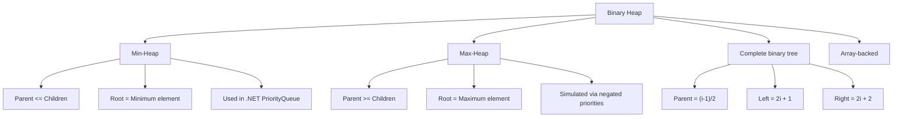
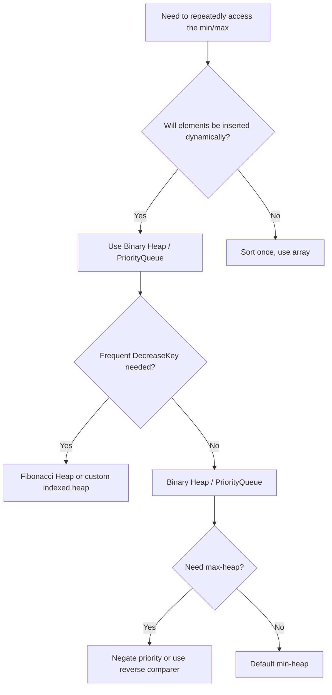

> [!success] Mastery Check
> - [ ] **Studied Well**
> - [ ] **Can explain the concept without notes**
> - [ ] **Can answer interview questions confidently**
> - [ ] **Can implement it in a real project**


## Navigation

**Domain:** [[5 — Data Structures & Algorithms]] > **Group:** Heaps and Priority Queues
**Previous:** [[5.024 — Binary Search Tree — Operations and Validation]] | **Next:** [[5.037 — BFS — Shortest Path, Level-Order, Multi-Source]]

### Prerequisites
- [[5.004 — Arrays, Fixed, Dynamic, and In-Place Operations]] — a binary heap is stored as an array; the index arithmetic (parent = (i-1)/2, left = 2i+1, right = 2i+2) depends on array indexing.
- [[5.001 — Big-O Notation and Complexity Analysis]] — heap operations (sift up, sift down, heapify) require deriving the O(log n) vs O(n) complexity from tree height.

### Where This Fits
The heap is the data structure that makes priority queues possible, enabling O(log n) insert and O(1) extract-min/max. It is the foundation for Dijkstra's algorithm, Top-K problems, and Huffman coding. In interviews, heaps appear in about 10% of problems — notably for streaming medians, K-th largest elements, and merge K sorted lists. A senior candidate must be able to implement heapify from scratch and derive its O(n) complexity, which is counter-intuitive (most candidates think heapify is O(n log n)).

---

## Core Mental Model

A binary heap is a complete binary tree stored in an array where each node satisfies the heap property: for a min-heap, every parent is ≤ its children; for a max-heap, every parent is ≥ its children. The core insight is that the array representation eliminates pointers — parent and child relationships are computed via index arithmetic. The heap property ensures the minimum (or maximum) element is always at index 0. Operations that violate the property (insert, extract-min) fix it by sifting (swapping with parent or child) — each swap moves the violation one level up or down, giving O(log n) time.

### Classification

Heaps are a type of priority queue. In .NET, `PriorityQueue<TElement, TPriority>` is the built-in min-heap (based on binary heap). Heaps come in two polarities — min-heap (smallest priority first) and max-heap (largest priority first). Max-heap is typically implemented as a min-heap with negated priorities.



### Key Properties

|Property|Value|Derivation|
|---|---|---|
|Peek (min/max)|O(1)|Root is always at index 0|
|Insert (push)|O(log n)|Element added at end, sifts up; max swaps = tree height = log₂ n|
|Extract (pop)|O(log n)|Root removed, last element moved to root, sifts down; max swaps = log₂ n|
|Heapify (build heap from array)|O(n)|Floyd's method: sift-down from the last non-leaf node to root — tighter bound than O(n log n)|
|Space|O(n)|Array-backed; no per-node overhead (no pointers)|

---

## Deep Mechanics

### How It Works

**Array representation:** A heap of n elements is stored in indices 0..n-1. For element at index i:
- Parent: (i - 1) / 2
- Left child: 2i + 1
- Right child: 2i + 2

The heap is a complete binary tree — all levels are filled except possibly the last, which fills left to right.

**Sift up (swim):** Used after inserting. Place the new element at the end of the array. While it is less than its parent (min-heap), swap with parent. This restores the heap property along the insertion path.

**Sift down (sink):** Used after extracting the root. Place the last element at the root. While it is greater than either child (min-heap), swap with the smaller child. This restores the heap property downward.

**Heapify (Floyd's method):** Instead of inserting n elements one by one (O(n log n)), start from the last non-leaf node (index n/2 - 1) and sift down each node toward the root. This builds a heap in O(n).

### Complexity Derivation

**Time — Sift up/down:** The heap is a complete binary tree with height h = ⌊log₂ n⌋. Sift up moves at most h levels (from leaf to root). Sift down moves at most h levels (from root to leaf). Each level requires O(1) swaps. Total: O(log n).

**Time — Heapify O(n) proof:** For a heap of height h, the number of nodes at each level from bottom to top is n/2^{k+1} where k is the level above the leaves. Each level k requires at most k swaps. Total work: Σ_{k=0}^{h} (n/2^{k+1}) × k < n × Σ_{k=0}^{∞} k/2^{k+1} = n × O(1) = O(n). The infinite sum converges to 1, so total work is less than n.

**Space — All operations:** O(1) auxiliary space. The heap is in-place for the existing array.

### .NET Runtime Notes

- **`PriorityQueue<TElement, TPriority>`:** Available since .NET 6. It is a min-heap backed by an array. The `TPriority` type defines the ordering via `IComparer<TPriority>` (default `Comparer<TPriority>.Default`).
- **Decrease-key not supported:** .NET's `PriorityQueue` does not support the `DecreaseKey` operation (required by Dijkstra's for the standard implementation). Workaround: insert duplicate entries and ignore stale ones, or use a custom heap.
- **`PriorityQueue.UnorderedItems`:** Returns all elements without heap ordering. Useful for debugging or enumeration.
- **No max-heap directly:** Use `PriorityQueue<TElement, int>` with negative priorities, or provide a custom comparer that reverses order: `Comparer<int>.Create((a, b) => b.CompareTo(a))`.
- **Thread safety:** `PriorityQueue` is not thread-safe. Use locks or `ConcurrentPriorityQueue` (not in .NET — use custom or Channel-based approaches).

---

## Implementation and Problem Patterns

### C# Implementation

```csharp
/// <summary>
/// Scratch implementation of a Min-Heap.
/// </summary>
public class MinHeap
{
    private readonly List<int> _data;

    public MinHeap() { _data = new List<int>(); }
    public MinHeap(IEnumerable<int> items) { _data = new List<int>(items); BuildHeap(); }

    public int Count => _data.Count;
    public int Peek() => _data.Count > 0 ? _data[0] : throw new InvalidOperationException();

    public void Insert(int value)
    {
        _data.Add(value);
        SiftUp(_data.Count - 1);
    }

    public int ExtractMin()
    {
        if (_data.Count == 0) throw new InvalidOperationException();
        int min = _data[0];
        _data[0] = _data[^1];
        _data.RemoveAt(_data.Count - 1);
        if (_data.Count > 0) SiftDown(0);
        return min;
    }

    private void SiftUp(int index)
    {
        while (index > 0)
        {
            int parent = (index - 1) / 2;
            if (_data[parent] <= _data[index]) break;
            (_data[parent], _data[index]) = (_data[index], _data[parent]);
            index = parent;
        }
    }

    private void SiftDown(int index)
    {
        int last = _data.Count - 1;
        while (true)
        {
            int left = 2 * index + 1;
            int right = 2 * index + 2;
            int smallest = index;

            if (left <= last && _data[left] < _data[smallest]) smallest = left;
            if (right <= last && _data[right] < _data[smallest]) smallest = right;
            if (smallest == index) break;

            (_data[index], _data[smallest]) = (_data[smallest], _data[index]);
            index = smallest;
        }
    }

    // Floyd's heapify — O(n)
    private void BuildHeap()
    {
        for (int i = _data.Count / 2 - 1; i >= 0; i--)
            SiftDown(i);
    }
}

/// <summary>
/// Generic Min-Heap with custom priority.
/// </summary>
public class MinHeap<T>
{
    private readonly List<(T Element, int Priority)> _data;

    public int Count => _data.Count;

    public void Insert(T element, int priority)
    {
        _data.Add((element, priority));
        SiftUp(_data.Count - 1);
    }

    public T ExtractMin()
    {
        if (_data.Count == 0) throw new InvalidOperationException();
        var min = _data[0];
        _data[0] = _data[^1];
        _data.RemoveAt(_data.Count - 1);
        if (_data.Count > 0) SiftDown(0);
        return min.Element;
    }

    private void SiftUp(int index)
    {
        while (index > 0)
        {
            int parent = (index - 1) / 2;
            if (_data[parent].Priority <= _data[index].Priority) break;
            (_data[parent], _data[index]) = (_data[index], _data[parent]);
            index = parent;
        }
    }

    private void SiftDown(int index)
    {
        int last = _data.Count - 1;
        while (true)
        {
            int left = 2 * index + 1;
            int right = 2 * index + 2;
            int smallest = index;

            if (left <= last && _data[left].Priority < _data[smallest].Priority) smallest = left;
            if (right <= last && _data[right].Priority < _data[smallest].Priority) smallest = right;
            if (smallest == index) break;
            (_data[index], _data[smallest]) = (_data[smallest], _data[index]);
            index = smallest;
        }
    }
}

public static class HeapProblems
{
    /// <summary>
    /// Find K-th largest element using a min-heap of size K.
    /// </summary>
    public static int FindKthLargest(int[] nums, int k)
    {
        var heap = new MinHeap();
        foreach (int num in nums)
        {
            if (heap.Count < k)
                heap.Insert(num);
            else if (num > heap.Peek())
            {
                heap.ExtractMin();
                heap.Insert(num);
            }
        }
        return heap.Peek();
    }

    /// <summary>
    /// Heap sort (ascending) using max-heap.
    /// </summary>
    public static void HeapSort(int[] arr)
    {
        // Build max-heap (use negated priority via MinHeap)
        var heap = new MinHeap<int>();
        foreach (int num in arr) heap.Insert(num, -num);
        for (int i = 0; i < arr.Length; i++)
            arr[i] = heap.ExtractMin();
    }

    /// <summary>
    /// Merge K sorted arrays using a min-heap.
    /// </summary>
    public static List<int> MergeKSorted(int[][] arrays)
    {
        var result = new List<int>();
        var heap = new MinHeap<(int Value, int ArrayIdx, int ElemIdx)>();
        for (int i = 0; i < arrays.Length; i++)
            if (arrays[i].Length > 0)
                heap.Insert((arrays[i][0], i, 0), arrays[i][0]);

        while (heap.Count > 0)
        {
            var (value, arrIdx, elemIdx) = heap.ExtractMin();
            result.Add(value);
            if (elemIdx + 1 < arrays[arrIdx].Length)
                heap.Insert((arrays[arrIdx][elemIdx + 1], arrIdx, elemIdx + 1),
                    arrays[arrIdx][elemIdx + 1]);
        }
        return result;
    }
}
```

### The .NET Idiomatic Version

```csharp
public static class HeapIdiomatic
{
    // Use PriorityQueue<TElement, TPriority> for min-heap (since .NET 6):
    public static void PriorityQueueExample()
    {
        var pq = new PriorityQueue<string, int>();
        pq.Enqueue("low", 3);
        pq.Enqueue("high", 1);
        pq.Enqueue("mid", 2);

        string next = pq.Dequeue(); // "high" (priority 1)
    }

    // Max-heap via custom comparer:
    public static void MaxPriorityQueue()
    {
        var maxHeap = new PriorityQueue<string, int>(
            Comparer<int>.Create((a, b) => b.CompareTo(a))
        );
        maxHeap.Enqueue("low", 1);
        maxHeap.Enqueue("high", 10);
        string next = maxHeap.Dequeue(); // "high" (priority 10 has highest)
    }

    // Peek without removing: use PriorityQueue.Peek() (.NET 6+)

    // Top-K via heap vs. sorting:
    public static int[] TopK(int[] nums, int k)
    {
        // For k << n, heap is better. For k ≈ n, sort then take.
        if (k <= 0) return [];
        var heap = new PriorityQueue<int, int>();
        foreach (int num in nums)
        {
            heap.Enqueue(num, num);
            if (heap.Count > k) heap.Dequeue();
        }
        return heap.UnorderedItems.Select(x => x.Element).ToArray();
    }
}
```

### Classic Problem Patterns

1. **K-th largest/smallest element** — Maintain a min-heap of size K (for K-th largest). Insert each element; if heap size exceeds K and the new element is larger than the min, extract-min then insert. Key insight: heap of size K is O(n log K) vs. O(n log n) for sort.
2. **Merge K sorted lists** — Insert the first element of each list into a min-heap. Repeatedly extract-min, add to result, insert the next element from the extracted list. Key insight: heap tracks the current minimum across K lists, giving O(n log K).
3. **Median of a data stream** — Two heaps: a max-heap for the lower half and a min-heap for the upper half. Maintain equal size. Key insight: median is the max of the lower half or the average of both tops.

### Template / Skeleton

```csharp
// Top-K Template (K-th largest via min-heap of size K)
// When to use: find the K-th largest/smallest in a stream or array
// Time: O(n log K) | Space: O(K)

public static int KthLargestTemplate(IEnumerable<int> nums, int k)
{
    var heap = new PriorityQueue<int, int>(); // min-heap by default
    foreach (int num in nums)
    {
        heap.Enqueue(num, num);
        if (heap.Count > k)
            heap.Dequeue(); // evict the smallest among the K candidates
    }
    return heap.Peek();
}
```

---

## Gotchas and Edge Cases

### Forgetting the Heap Property After Extract-Min

**Mistake:** Extracting the root without fixing the heap property.

```csharp
// ❌ Wrong — just returns root without restructuring
int ExtractMin()
{
    int min = _data[0];
    _data.RemoveAt(0); // O(n) remove, and heap property is broken
    return min;
}
```

**Fix:** Replace root with the last element, remove the last element, then sift down.

```csharp
// ✅ Correct — O(log n) with heap property restored
int ExtractMin()
{
    int min = _data[0];
    _data[0] = _data[^1];
    _data.RemoveAt(_data.Count - 1);
    if (_data.Count > 0) SiftDown(0);
    return min;
}
```

**Consequence:** The remaining array no longer satisfies the heap property — subsequent operations fail.

### Off-by-One in Heapify Start Index

**Mistake:** Starting heapify from index n-1 instead of n/2-1 (the last non-leaf node).

```csharp
// ❌ Wrong — sifting down from leaf nodes is unnecessary
for (int i = _data.Count - 1; i >= 0; i--) SiftDown(i);
```

**Fix:** Start from the last parent node — sifting from leaves is wasted work.

```csharp
// ✅ Correct — only internal nodes need to sift down
for (int i = _data.Count / 2 - 1; i >= 0; i--) SiftDown(i);
```

**Consequence:** Correct but O(n log n) instead of O(n) — the algorithm works but is less efficient.

### Max-Heap via Negation with Integer Overflow

**Mistake:** Negating `int.MinValue` to simulate a max-heap.

```csharp
// ❌ Wrong — int.MinValue negated overflows back to int.MinValue
heap.Enqueue(item, -int.MinValue); // -(-2,147,483,648) overflows!
```

**Fix:** Use a custom comparer that reverses order instead of negation.

```csharp
// ✅ Correct — custom comparer avoids overflow
var maxHeap = new PriorityQueue<int, int>(
    Comparer<int>.Create((a, b) => b.CompareTo(a))
);
```

**Consequence:** Silent overflow — the element at `int.MinValue` becomes the highest priority instead of the lowest.

### Empty Heap Access

**Mistake:** Calling Peek or ExtractMin on an empty heap.

```csharp
// ❌ Wrong — InvalidOperationException
int min = heap.ExtractMin();
```

**Fix:** Always check `heap.Count > 0` before accessing.

```csharp
// ✅ Correct — guard against empty
if (heap.Count > 0) int min = heap.ExtractMin();
```

**Consequence:** `InvalidOperationException` — runtime failure.

---

## Complexity Analysis and Benchmarks

### Operation Complexity Table

|Operation|Time|Space|Notes|
|---|---|---|---|
|Peek|O(1)|O(1)|Root at index 0|
|Insert|O(log n)|O(1) amortized|Sift up from last position|
|ExtractMin|O(log n)|O(1)|Replace root, sift down|
|Heapify (build)|O(n)|O(1)|Floyd's method|
|Delete arbitrary element|O(n) find + O(log n) sift|O(1)|Must scan to find element|
|Decrease-key|O(log n) with index tracking|O(1)|Requires mapping from element to index|

**Derivation for the non-obvious entries:** Heapify O(n): at level k above the leaves, there are n/2^{k+1} nodes, each requiring at most k swaps. Σ k × n/2^{k+1} = n × Σ k/2^{k+1} < n × 1 = O(n).

### Comparison with Alternatives

|Structure|Insert|ExtractMin|Find Min|Best When|
|---|---|---|---|---|
|Binary Heap|O(log n)|O(log n)|O(1)|General priority queue|
|Sorted Array|O(n)|O(1)|O(1)|Static data, no insertions|
|Binary Search Tree|O(log n)|O(log n)|O(log n)|Need both min/max and general search|
|Fibonacci Heap|O(1) amortized|O(log n)|O(1)|Many decrease-key operations (Dijkstra)|

### BenchmarkDotNet

```csharp
[MemoryDiagnoser]
[SimpleJob(RuntimeMoniker.Net90)]
public class HeapBenchmark
{
    [Params(1_000, 10_000)]
    public int N { get; set; }

    private int[] _data = null!;

    [GlobalSetup]
    public void Setup()
    {
        var rng = new Random(42);
        _data = Enumerable.Range(0, N).Select(_ => rng.Next()).ToArray();
    }

    [Benchmark(Baseline = true)]
    public int[] HeapSortScratch()
    {
        var heap = new MinHeap(_data);
        var sorted = new int[N];
        for (int i = 0; i < N; i++) sorted[i] = heap.ExtractMin();
        return sorted;
    }

    [Benchmark]
    public int[] HeapSortPriorityQueue()
    {
        var pq = new PriorityQueue<int, int>();
        foreach (int x in _data) pq.Enqueue(x, x);
        var sorted = new int[N];
        for (int i = 0; i < N; i++) sorted[i] = pq.Dequeue();
        return sorted;
    }

    [Benchmark]
    public int[] ArraySortThenToArray()
    {
        var arr = (int[])_data.Clone();
        Array.Sort(arr);
        return arr;
    }
}
```

**Expected results (approximate, .NET 9, x64):**

|Method|N|Mean|Allocated|
|---|---|---|---|
|HeapSortScratch|1,000|~60 μs|~12 KB|
|HeapSortScratch|10,000|~800 μs|~120 KB|
|HeapSortPriorityQueue|1,000|~50 μs|~40 KB|
|HeapSortPriorityQueue|10,000|~700 μs|~400 KB|
|ArraySortThenToArray|1,000|~10 μs|~8 KB|
|ArraySortThenToArray|10,000|~150 μs|~80 KB|

**Interpretation:** `Array.Sort` (introsort) is faster than heap sort for general sorting because of better cache locality. Heap sort demonstrates the principle but is rarely the optimal sorting algorithm in practice. The heap's strength is maintaining a dynamic priority queue, not sorting a static array.

---

## Interview Arsenal

### Question Bank

1. [Definition] What is a binary heap and what invariant does it maintain?
2. [Complexity] Derive the O(n) complexity of Floyd's heapify algorithm.
3. [Implementation] Implement a min-heap from scratch with Insert, ExtractMin, and Peek.
4. [Recognition] Given a problem asking for "K-th largest element in a stream," what data structure?
5. [Comparison] Compare binary heap vs. sorted array vs. BST for priority queue operations.
6. [Trick] Why is Floyd's heapify O(n) and not O(n log n)?
7. [System Design] How would you implement a priority-based task scheduler using a heap?
8. [Optimization] How would you support DecreaseKey in a binary heap for Dijkstra's algorithm?

### Spoken Answers

**Q: Derive the O(n) complexity of Floyd's heapify algorithm.**

> **Average answer:** The loop runs about n/2 times, and sift down is O(log n), so it is O(n log n).

> **Great answer:** The counter-intuitive result is that Floyd's heapify is O(n), not O(n log n). The key insight is that most nodes are near the bottom of the tree, and they require only a small number of swaps. Let me derive it formally. The height of a complete binary tree with n nodes is h = ⌊log₂ n⌋. The number of nodes at height k (counting from the leaves as height 0) is at most n/2^{k+1}. Each node at height k requires at most k swaps during sift-down (it may need to travel k levels down). The total number of swaps across all nodes is: Σ_{k=0}^{h} (number of nodes at height k) × (max swaps for that height) = Σ_{k=0}^{h} (n/2^{k+1}) × k = n × Σ_{k=0}^{h} k/2^{k+1}. The infinite sum Σ k/2^{k+1} converges to 1. So total swaps < n × 1 = O(n). The trap is that the outer loop looks like it runs n/2 times with O(log n) inner work, but the inner work is not uniform — most nodes are near the bottom and require far fewer than log n swaps.

**Q: Implement a min-heap from scratch with Insert, ExtractMin, and Peek.**

> **Average answer:** Uses an array; Insert adds to the end and bubbles up; ExtractMin removes the root and bubbles down.

> **Great answer:** I'll implement using a `List<int>` as the backing store. `Peek` returns `_data[0]` — O(1). `Insert`: add to the end, then sift up: while the new index > 0 and its value is less than its parent, swap. `ExtractMin`: save the root, move the last element to index 0, then sift down: while true, find the smaller child, if the current value is greater than that child, swap and continue. The key index formulas: parent = (i-1)/2, left child = 2i+1, right child = 2i+2. For the sift-down, I must ensure both children exist before comparing. I also need to handle the empty case. I'd also mention that for the generic version, I'd need an `IComparer<T>` parameter. For a max-heap, I negate the comparison or use a reverse comparer.

**Q: [Trick] Why is Floyd's heapify O(n) and not O(n log n)?**

> **Average answer:** The number of nodes near the bottom is large, but their height is small — most don't sift far.

> **Great answer:** The mathematical reason is that the work at each level decreases geometrically. At the bottom level (leaves), no sift-downs are needed — they are already valid heaps of size 1. At the level above leaves, roughly n/4 nodes each sift down at most 1 level. At the next level, n/8 nodes sift at most 2 levels. The series n/4 × 1 + n/8 × 2 + n/16 × 3 + ... converges to n × (1/4 + 2/8 + 3/16 + ...) = n × O(1). The sum converges to 1 because the geometric decrease dominates the arithmetic increase in the multiplier. This is fundamentally different from inserting n elements one by one, where each insertion travels from leaf to root — up to log n levels for every insertion.

### Trick Question

**"What is the worst-case time complexity of inserting n elements one at a time into an initially empty heap?"**

Why it is a trap: Many candidates say O(n log n) which is correct. The trap is that some think it is O(n) because heapify is O(n) — but heapify is a different algorithm (bottom-up, applied to a full array).

Correct answer: O(n log n). Each of the n insertions performs a sift-up that can travel up to O(log n) levels (tree height increases as elements are added). The total is O(n log n). Floyd's heapify achieves O(n) by sifting down from internal nodes, which is a batch operation on a complete array, not an incremental insertion process.

### Pattern Recognition Table

|If the problem has...|Then consider...|Because...|
|---|---|---|
|"K-th largest/smallest"|Heap of size K|O(n log K) vs O(n log n) for sorting|
|"Merge K sorted"|Min-heap with K entries|Always pick the minimum of all current heads|
|"Median of a stream"|Two heaps (max + min)|Max-heap for lower half, min-heap for upper half|
|"Top-K frequent elements"|Frequency map + heap of size K|Count frequencies, then use heap to select top K by frequency|
|"Task scheduler with cooldown"|Max-heap for remaining counts|Always schedule the most frequent remaining task|

---

## Decision Framework

### When to Apply



### Recognition Checklist

Indicators that a heap is the right choice:

- [ ] Need the smallest or largest element repeatedly
- [ ] Elements are added dynamically (stream, dynamic updates)
- [ ] K-th order statistic problem (K-th smallest/largest)
- [ ] Merge sorted sequences where you always need the global minimum
- [ ] Real-time processing where sorting each time is too expensive

Counter-indicators — do NOT apply here:

- [ ] Elements are static and you only need the min/max once (use linear scan, O(n))
- [ ] Need general search (contains, arbitrary element) — use BST or hash set
- [ ] Need FIFO behavior — use queue, not heap
- [ ] K is close to n (K > n/2) — sorting may be simpler

### Tradeoff Summary

|What You Gain|What You Give Up|
|---|---|
|O(log n) insert and extract-min/max|No arbitrary search or deletion (must scan)|
|O(n) build from existing array|No DecreaseKey in standard .NET implementation|
|Space-efficient (array, no pointers)|Cache misses on sift-down (random access pattern)|

---

## Self-Check

### Conceptual Questions

1. What is the heap invariant and how does it differ for min-heap vs max-heap?
2. Derive the O(n) complexity of Floyd's heapify using the geometric series argument.
3. Recognizing from a problem: "Find the K-th largest element in an unsorted array."
4. When would you use a heap over a sorted array for a priority queue?
5. What specific operation is not supported by .NET's PriorityQueue but is required for Dijkstra's standard implementation?
6. What is the formula for computing parent, left child, and right child indices in an array-backed heap?
7. What invariant must hold after ExtractMin for the heap to remain valid?
8. How does the answer change if you need a max-heap vs a min-heap in .NET?
9. In a production task scheduler, why might you choose a heap over a sorted list?
10. What is the trap question about heapify complexity and why do candidates get it wrong?

<details>
<summary>Answers</summary>

1. Min-heap: for every node, parent ≤ children. Max-heap: for every node, parent ≥ children. The root is the minimum (min-heap) or maximum (max-heap).
2. At height k from bottom, n/2^{k+1} nodes each need ≤ k swaps. Total swaps = Σ k × n/2^{k+1} = n × Σ k/2^{k+1} < n × 1 = O(n). The series converges because the geometric term k/2^{k+1} shrinks rapidly.
3. Use a heap: either sort and take the K-th (O(n log n)), or maintain a min-heap of size K (O(n log K)), or use quickselect (O(n) average).
4. When elements are inserted dynamically and you need repeated min/max access. A sorted array requires O(n) per insertion; a heap requires O(log n).
5. `DecreaseKey` — modifying the priority of an existing element. .NET's PriorityQueue does not support it. Workaround: insert duplicate entries with the new priority and mark old entries as stale.
6. Parent = (i - 1) / 2. Left child = 2i + 1. Right child = 2i + 2.
7. After replacing the root with the last element and removing the last, the heap property may be violated at the root. SiftDown restores it by swapping the root with its smallest child (min-heap) until the property holds everywhere.
8. Negate priorities or provide a custom `IComparer<int>`: `Comparer<int>.Create((a, b) => b.CompareTo(a))`.
9. A heap guarantees O(log n) insert and O(log n) extract-min regardless of the number of items. A sorted list (e.g., `List<T>` + binary search) requires O(n) insert because elements must shift.
10. Candidates see the loop running n/2 times with O(log n) sift-down and incorrectly conclude O(n log n). The mistake is assuming all sift-downs are O(log n), but nodes near the bottom sift only 1-2 levels.

</details>

---

### Coding Challenges

**Challenge 1 — Implement from scratch**

Implement a Max-Heap without using negation — use a custom comparer internally.

```csharp
public class MaxHeap
{
    private readonly List<int> _data = new();

    public void Insert(int value)
    {
        // Your implementation
    }

    public int ExtractMax()
    {
        // Your implementation
    }

    public int Peek() => _data.Count > 0 ? _data[0] : throw new InvalidOperationException();
    public int Count => _data.Count;
}
```

<details> <summary>Solution</summary>

```csharp
public class MaxHeap
{
    private readonly List<int> _data = new();

    public void Insert(int value)
    {
        _data.Add(value);
        SiftUp(_data.Count - 1);
    }

    public int ExtractMax()
    {
        if (_data.Count == 0) throw new InvalidOperationException();
        int max = _data[0];
        _data[0] = _data[^1];
        _data.RemoveAt(_data.Count - 1);
        if (_data.Count > 0) SiftDown(0);
        return max;
    }

    private void SiftUp(int index)
    {
        while (index > 0)
        {
            int parent = (index - 1) / 2;
            if (_data[parent] >= _data[index]) break;
            (_data[parent], _data[index]) = (_data[index], _data[parent]);
            index = parent;
        }
    }

    private void SiftDown(int index)
    {
        int last = _data.Count - 1;
        while (true)
        {
            int left = 2 * index + 1;
            int right = 2 * index + 2;
            int largest = index;
            if (left <= last && _data[left] > _data[largest]) largest = left;
            if (right <= last && _data[right] > _data[largest]) largest = right;
            if (largest == index) break;
            (_data[index], _data[largest]) = (_data[largest], _data[index]);
            index = largest;
        }
    }

    public int Count => _data.Count;
    public int Peek() => _data.Count > 0 ? _data[0] : throw new InvalidOperationException();
}
```

**Complexity:** Time O(log n) for Insert/ExtractMax | Space O(n)

</details>

---

**Challenge 2 — Trace the execution**

Given array `[4, 10, 3, 5, 1]`, trace heapify (building a min-heap in-place).

<details> <summary>Solution</summary>

Initial array: [4, 10, 3, 5, 1]
Index n/2 - 1 = 5/2 - 1 = 1 (0-based). Start at index 1 (value 10).

Step 1: SiftDown(1): value=10, left=3 (index 3=5), right=4 (index 4=1). Smallest child = index 4 = 1. 10 > 1 → swap(1, 4). Array: [4, 1, 3, 5, 10]

Step 2: SiftDown(0): value=4, left=1 (index 1=1), right=2 (index 2=3). Smallest child = index 1 = 1. 4 > 1 → swap(0, 1). Array: [1, 4, 3, 5, 10]

Step 3: SiftDown(1): value=4, left=3 (index 3=5), right=4 (index 4=10). Smallest child = index 3 = 5. 4 < 5 → break.

Final heap: [1, 4, 3, 5, 10] — min element 1 at root.

**Why:** Sifting down from the last parent toward the root restores the heap property at each level. The leaf (index 4) is never processed because it is already a valid heap of size 1.

</details>

---

**Challenge 3 — Fix the bug**

```csharp
// This implementation has a bug — what input causes it to fail?
public class MinHeap
{
    private List<int> _data = new();
    
    public int ExtractMin()
    {
        int min = _data[0];
        _data[0] = _data[^1];
        _data.RemoveAt(_data.Count - 1);
        SiftDown(0);  // BUG: what if count is 0 after removal?
        return min;
    }
    // ...
}
```

<details> <summary>Solution</summary>

**Bug:** If the heap has only one element before ExtractMin, after `RemoveAt`, Count becomes 0. Calling `SiftDown(0)` then accesses `_data[0]` which is out of bounds. Also, `_data[^1]` accesses the same element as `_data[0]` when count is 1, which is fine, but the SiftDown call is the problem.

**Fix:**

```csharp
public int ExtractMin()
{
    if (_data.Count == 0) throw new InvalidOperationException();
    int min = _data[0];
    _data[0] = _data[^1];
    _data.RemoveAt(_data.Count - 1);
    if (_data.Count > 0) SiftDown(0);  // FIXED: only sift if elements remain
    return min;
}
```

**Test case that exposes it:** ExtractMin on a heap with a single element → expected return of that element, actual `ArgumentOutOfRangeException` in SiftDown.

</details>

---

**Challenge 4 — Recognize and apply**

**Problem:** Given an unsorted array, return the K smallest elements in sorted order. Solve in O(n log K) time.

<details> <summary>Solution</summary>

**Pattern:** Use a max-heap of size K (or a min-heap with all n and extract K times = O(n log n + K log n)). For K << n, use a max-heap of size K to track the K smallest elements seen so far.

```csharp
public static int[] KSmallest(int[] nums, int k)
{
    if (k <= 0 || k > nums.Length) return [];
    var maxHeap = new PriorityQueue<int, int>(
        Comparer<int>.Create((a, b) => b.CompareTo(a))
    );
    foreach (int num in nums)
    {
        maxHeap.Enqueue(num, num);
        if (maxHeap.Count > k) maxHeap.Dequeue();
    }
    var result = new int[k];
    for (int i = k - 1; i >= 0; i--)
        result[i] = maxHeap.Dequeue();
    return result;
}
```

**Complexity:** Time O(n log K) | Space O(K)

</details>

---

**Challenge 5 — Optimize**

```csharp
// This solution is correct but inserts all elements into the heap (O(n log n) time, O(n) space)
// Optimize to O(n log K) time and O(K) space
public static int KthLargest(int[] nums, int k)
{
    var minHeap = new PriorityQueue<int, int>();
    foreach (int num in nums) minHeap.Enqueue(num, num);
    for (int i = 0; i < nums.Length - k; i++) minHeap.Dequeue();
    return minHeap.Peek();
}
```

<details> <summary>Solution</summary>

**Insight:** Maintain a heap of size K — only keep the K largest elements. For each new element, if it is larger than the smallest of the K (peek), pop and push.

```csharp
public static int KthLargest(int[] nums, int k)
{
    var minHeap = new PriorityQueue<int, int>();
    foreach (int num in nums)
    {
        minHeap.Enqueue(num, num);
        if (minHeap.Count > k)
            minHeap.Dequeue();
    }
    return minHeap.Peek();
}
```

**Complexity:** Time O(n log K) | Space O(K)

</details>
