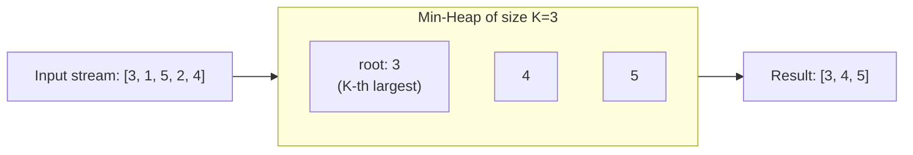
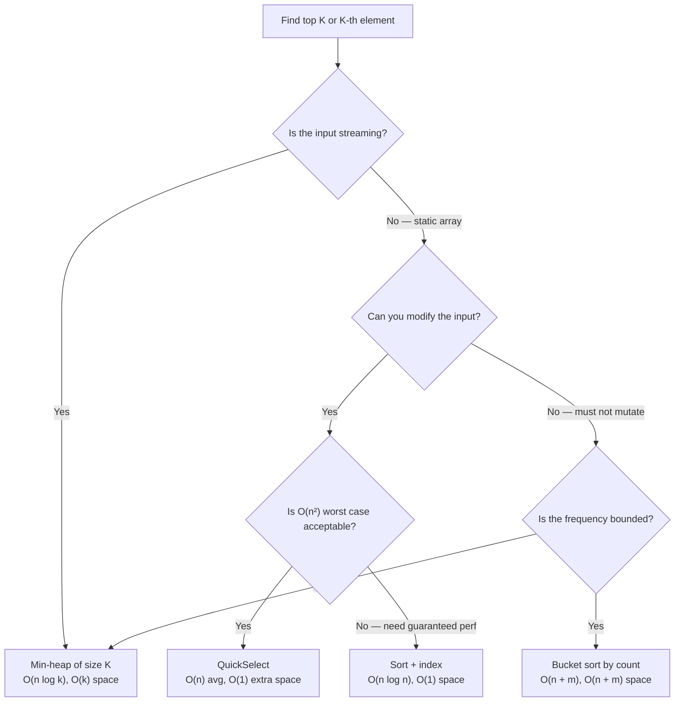

> [!success] Mastery Check
> - [ ] **Studied Well**
> - [ ] **Can explain the concept without notes**
> - [ ] **Can answer interview questions confidently**
> - [ ] **Can implement it in a real project**


## Navigation

**Domain:** [[5 — Data Structures & Algorithms]] > **Group:** Heaps and Priority Queues
**Previous:** [[5.031 — Min-Heap and Max-Heap — Structure and Heapify]] | **Next:** [[5.034 — Merge K Sorted Lists]]

### Prerequisites
- [[5.031 — Min-Heap and Max-Heap — Structure and Heapify]] — the heap's O(log k) insert and O(1) peek/remove are the mechanisms that make the min-heap-of-size-k pattern work.
- [[5.021 — Frequency Counting and Grouping]] — Top K Frequent Elements depends on building a frequency histogram first; the heap operates on frequency counts, not raw elements.

### Where This Fits
Top-K is one of the most frequently tested patterns in coding interviews, appearing in roughly 15% of senior-level rounds. The core question — "find the K largest/smallest elements" — has three canonical solutions (sort, heap, QuickSelect), and the interview tests your ability to choose the right one based on constraints (streaming vs. static, K vs. N, memory limits). The pattern extends to "K-th largest," "K closest," "K frequent," and "K smallest" variants, all of which reduce to the same decision: maintain a heap of size K. In system design, Top-K appears in trending topics, leaderboards, top-N recommendations, and any ranking system where only the top results matter.

---

## Core Mental Model

Maintain a min-heap of size K. For each element, add it to the heap. If the heap exceeds size K, remove the smallest element (the root of the min-heap). After processing all elements, the heap contains the K largest elements, and its root is the K-th largest.

The invariant is: **the heap always contains the K largest elements seen so far.** The root is the smallest of those K — which is exactly the K-th largest overall. This works because the heap discards elements that are smaller than the current K-th largest, keeping only candidates that could be in the top K.



---

### Classification

- **Paradigm:** Streaming selection — process each element once, maintain a bounded-size candidate set.
- **Family:** Selection algorithms — finding the K-th order statistic.
- **Key property:** A min-heap of size K keeps the K largest elements and drops the rest. A max-heap of size K keeps the K smallest elements.
- **Nearest alternatives:**
  - **Sort + index:** O(n log n). Simple, works for small n. Does not support streaming.
  - **QuickSelect:** O(n) average, O(n²) worst. Best for a single query on a static array. Returns the K-th element directly, not the top K.
  - **Bucket sort:** O(n) when frequency is bounded. Best for "top K frequent" when element count is close to n.

### Key Properties

|Operation|Value|Derivation|
|---|---|---|
|Insert into heap of size k|O(log k)|Sift-up from leaf: at most log₂ k levels|
|Extract-min from heap of size k|O(log k)|Sift-down from root: at most log₂ k levels|
|Peek at root|O(1)|Array index [0]|
|Build heap from n elements (heapify)|O(n)|Bottom-up sift-down: aggregate cost is O(n)|
|Full top-K via heap|O(n log k)|n inserts at O(log k) each; total O(n log k)|
|Full top-K via sort|O(n log n)|Full sort then take first K; no streaming support|
|Full top-K via QuickSelect|O(n) avg, O(n²) worst|Partition-based; single pass; modifies array|
|Full top-K via bucket sort|O(n + m)|Requires bounded frequency range [0, m]|

---

## Deep Mechanics

### How It Works

**Min-heap of size K for K largest:**

1. Iterate each element x.
2. Add x to a min-heap (smallest element at root).
3. If heap.Count > K, remove the root (the smallest element in the heap).
4. After processing all elements, the heap contains the K largest. The root is the K-th largest.

**Why it works:** The heap always discards the smallest element when it exceeds size K. This guarantees that every element still in the heap is larger than any element that was discarded. After n steps, the heap contains exactly the K largest among all n elements.

**Example — find K=3 largest from [3, 1, 5, 2, 4]:**
1. x=3: heap=[3]
2. x=1: heap=[1, 3]
3. x=5: heap=[1, 3, 5]
4. x=2: heap=[1, 3, 5] → add 2 → [1, 3, 5, 2] → pop min (1) → [2, 3, 5]
5. x=4: heap=[2, 3, 5] → add 4 → [2, 3, 5, 4] → pop min (2) → [3, 4, 5]

Root of final heap = 3 (K-th largest). Heap contents = {3, 4, 5} (top K).

**QuickSelect approach (for K-th smallest):**

1. Choose a pivot (random or median-of-three).
2. Partition the array around the pivot: elements ≤ pivot on left, > pivot on right.
3. If pivot index == K-1, return pivot.
4. If pivot index > K-1, recurse on left half.
5. If pivot index < K-1, recurse on right half.

QuickSelect is to selection what QuickSort is to sorting — same partition logic, but recurses into only one side instead of both.

### Complexity Derivation

**Time (Heap approach, O(n log k)):**
- For each of n elements: one heap insert (O(log k)) and at most one heap remove (O(log k)), but the remove only happens when heap exceeds k, which happens at most n times total. Each element is inserted once and removed at most once: O(n log k) total.
- When k is small (e.g., k=10) and n is large (e.g., n=10⁶), this is essentially O(n × small_constant) — much better than O(n log n).

**Time (QuickSelect, O(n) average):**
- Each partition step visits O(n) elements. On average, the problem size halves each time: O(n + n/2 + n/4 + ...) = O(2n) = O(n).
- Worst case: each partition reduces the problem by only 1 element (bad pivot choices): O(n + (n-1) + (n-2) + ...) = O(n²).
- Random pivot makes the worst case extremely unlikely.

**Space:**
- Heap: O(k) — the heap stores exactly k elements.
- QuickSelect: O(log n) for recursion stack (average) or O(1) for iterative version. In-place — modifies the input array.

### .NET Runtime Notes

- **PriorityQueue<TElement, TPriority>** (.NET 6+) is the idiomatic heap in .NET. It is a min-heap by default. For Top-K of largest elements, use a min-heap where the *priority* is the element value (or frequency). The root gives the K-th largest.
- **PriorityQueue for max-heap:** There is no max-heap in .NET. For a max-heap, use `int.MaxValue - value` as priority, or `PriorityQueue<TElement, int>` with a custom comparer: `new PriorityQueue<TElement, int>(Comparer<int>.Create((a, b) => b.CompareTo(a)))`.
- **Negative and zero priorities:** `PriorityQueue` handles any `int` priority, including negative values and zero. The default comparer is `Comparer<int>.Default` which provides ascending order.
- **QuickSelect in .NET:** `Array.Sort` uses introsort (hybrid). There is no built-in `nth_element` (C++'s partial sort algorithm). You must implement QuickSelect manually. `Array.Sort` and `Array.BinarySearch` can be combined: sort, then index, but that's O(n log n).
- **LINQ alternatives:** `.OrderByDescending(x => x).Take(k)` is O(n log n) — it fully sorts. For small k, `.OrderBy().Take()`. is fine. For large n and small k, the heap approach is faster.
- **Memory:** `PriorityQueue` stores its elements in an internal array that grows by doubling. For k elements, it allocates approximately 2k slots. Each `Enqueue`/`Dequeue` pair does not cause allocation after the initial growth (in-place sift operations).

---

## Implementation and Problem Patterns

### C# Implementation

```csharp
/// <summary>
/// Returns the K-th largest element using a min-heap of size K.
/// O(n log k) time, O(k) space.
/// </summary>
public static int FindKthLargest(int[] nums, int k)
{
    var heap = new PriorityQueue<int, int>();  // min-heap

    foreach (int num in nums)
    {
        heap.Enqueue(num, num);
        if (heap.Count > k)
            heap.Dequeue();  // remove smallest of the K+1
    }

    return heap.Peek();  // root is the K-th largest
}

/// <summary>
/// Returns the top K frequent elements using frequency + min-heap.
/// O(n log k) time, O(n + k) space.
/// </summary>
public static int[] TopKFrequent(int[] nums, int k)
{
    // 1. Build frequency map
    var freq = new Dictionary<int, int>();
    foreach (int num in nums)
    {
        freq.TryGetValue(num, out int count);
        freq[num] = count + 1;
    }

    // 2. Min-heap by frequency, keep top K
    var heap = new PriorityQueue<int, int>();
    foreach (var (num, count) in freq)
    {
        heap.Enqueue(num, count);
        if (heap.Count > k)
            heap.Dequeue();
    }

    // 3. Extract
    var result = new int[k];
    for (int i = k - 1; i >= 0; i--)
        result[i] = heap.Dequeue();
    return result;
}

/// <summary>
/// Returns the K closest points to the origin using a max-heap.
/// O(n log k) time, O(k) space.
/// </summary>
public static int[][] KClosest(int[][] points, int k)
{
    var heap = new PriorityQueue<int[], double>(
        Comparer<double>.Create((a, b) => b.CompareTo(a)));  // max-heap

    foreach (var p in points)
    {
        double dist = Math.Sqrt(p[0] * p[0] + p[1] * p[1]);
        heap.Enqueue(p, dist);
        if (heap.Count > k)
            heap.Dequeue();  // remove farthest
    }

    var result = new int[k][];
    for (int i = 0; i < k; i++)
        result[i] = heap.Dequeue();
    return result;
}

/// <summary>
/// QuickSelect — finds the K-th smallest element in O(n) average.
/// </summary>
public static int QuickSelectKthSmallest(int[] nums, int k)
{
    var arr = (int[])nums.Clone();  // avoid mutating input
    return QuickSelect(arr, 0, arr.Length - 1, k - 1);
}

private static int QuickSelect(int[] arr, int left, int right, int k)
{
    if (left == right) return arr[left];

    int pivotIndex = Partition(arr, left, right);

    if (k == pivotIndex)
        return arr[k];
    else if (k < pivotIndex)
        return QuickSelect(arr, left, pivotIndex - 1, k);
    else
        return QuickSelect(arr, pivotIndex + 1, right, k);
}

private static int Partition(int[] arr, int left, int right)
{
    int pivot = arr[right];
    int i = left;

    for (int j = left; j < right; j++)
    {
        if (arr[j] <= pivot)
        {
            (arr[i], arr[j]) = (arr[j], arr[i]);
            i++;
        }
    }
    (arr[i], arr[right]) = (arr[right], arr[i]);
    return i;
}
```

### The .NET Idiomatic Version

For single-use queries on small-to-medium arrays, LINQ is acceptable:

```csharp
// Quick and simple — O(n log n) but zero extra code
int kthLargest = nums.OrderByDescending(x => x).ElementAt(k - 1);

// Top K frequent — O(n log n)
var topK = nums
    .GroupBy(x => x)
    .OrderByDescending(g => g.Count())
    .Take(k)
    .Select(g => g.Key)
    .ToArray();
```

**When to use each approach:** Use LINQ for quick exploration, scripting, or when n is small (n < 10,000). Use the explicit `PriorityQueue` approach for production code, large n, or when k << n. Use QuickSelect only when O(1) additional space is required and the input can be modified.

### Classic Problem Patterns

1. **Kth Largest Element in an Array (LeetCode 215)** — The canonical Top-K problem. Use a min-heap of size K. The root is the K-th largest. Key insight: a min-heap keeps the largest elements and drops the smallest; after all elements, the heap's root is exactly the K-th largest.

2. **Top K Frequent Elements (LeetCode 347)** — Combine frequency counting with a min-heap of size K. Build frequency map, then use a min-heap keyed by frequency. Key insight: the heap compares by frequency, not by element value. Remove the least frequent when exceeding size K.

3. **K Closest Points to Origin (LeetCode 973)** — Use a max-heap of size K (since we want the K smallest distances). Key insight: a max-heap keeps the smallest distances by removing the largest. The comparator is reversed.

4. **Kth Largest Element in a Stream (LeetCode 703)** — Maintain a min-heap of size K. Add each new element and automatically eject the smallest if size exceeds K. The root is always the K-th largest. Key insight: this is the streaming version — the heap persists across queries.

5. **Top K Frequent Words (LeetCode 692)** — Frequency counting + min-heap with custom comparator (frequency ascending, then alphabetical descending for tie-breaking). Key insight: when two words have the same frequency, the lexicographically smaller word should be kept in the heap.

6. **Sort Characters By Frequency (LeetCode 451)** — Frequency counting + bucket sort. Since the maximum frequency is bounded by string length, you can use an array of buckets (list of characters at each frequency) for O(n) instead of O(n log k). Key insight: bucket sort avoids the heap entirely when the frequency range is known.

### Template / Skeleton

```csharp
// Top K Template (Min-Heap of Size K)
// When to use: "find the K largest / K-th largest / top K frequent"
// Time: O(n log k) | Space: O(k)

public static List<T> TopKTemplate<T>(IEnumerable<T> items, int k,
    Func<T, int> prioritySelector)   // lower = smaller priority
{
    var heap = new PriorityQueue<T, int>();  // min-heap

    foreach (var item in items)
    {
        int priority = prioritySelector(item);
        heap.Enqueue(item, priority);
        if (heap.Count > k)
            heap.Dequeue();  // discard the smallest priority
    }

    var result = new List<T>(heap.Count);
    while (heap.Count > 0)
        result.Add(heap.Dequeue());
    result.Reverse();  // Optional: largest first
    return result;
}

// QuickSelect Template (K-th Smallest)
// When to use: single query, static array, O(1) extra space
// Time: O(n) avg, O(n²) worst | Space: O(log n)

public static int QuickSelectTemplate(int[] nums, int k)
{
    // TODO: clone array if input must not be mutated
    int Partition(int[] arr, int lo, int hi)
    {
        int pivot = arr[hi];
        int i = lo;
        for (int j = lo; j < hi; j++)
        {
            if (arr[j] <= pivot)
            {
                (arr[i], arr[j]) = (arr[j], arr[i]);
                i++;
            }
        }
        (arr[i], arr[hi]) = (arr[hi], arr[i]);
        return i;
    }

    int Select(int lo, int hi, int kIdx)
    {
        if (lo == hi) return nums[lo];
        int p = Partition(nums, lo, hi);
        if (kIdx == p) return nums[kIdx];
        return kIdx < p
            ? Select(lo, p - 1, kIdx)
            : Select(p + 1, hi, kIdx);
    }

    return Select(0, nums.Length - 1, k - 1);
}
```

---

## Gotchas and Edge Cases

### Min-heap vs. max-heap confusion

**Mistake:** Using a max-heap for K-th largest, which keeps the K largest at the root — but you want the K-th largest at the root, not the largest.

```csharp
// ❌ Wrong — max-heap keeps largest at root, not K-th largest
var heap = new PriorityQueue<int, int>(Comparer<int>.Create((a, b) => b.CompareTo(a)));
// After inserting all n, root is the largest, not K-th largest
```

**Fix:** Use a min-heap of size K. The root is the smallest of the K largest — which is the K-th largest.

```csharp
// ✅ Correct — min-heap of size K
var heap = new PriorityQueue<int, int>();  // min-heap default
// Root is the K-th largest after processing all elements
```

**Consequence:** A max-heap stores all elements (size = n) and gives the largest at root. To get K-th largest, you would need to pop K-1 times. A min-heap of size K gives the K-th largest at the root in O(n log k) instead of O(n log n + K log n).

### K = 1 or K = n

**Mistake:** Not handling the edge cases where K = 1 or K = n.

```csharp
// ❌ Wrong — heap of size 1 or n works but is suboptimal
if (k == 1) return nums.Max();  // O(n) is better than O(n log 1) = O(n)
if (k == nums.Length) return nums.Min();  // K-th largest of all = smallest
```

**Fix:** The heap approach handles these correctly (O(n log 1) = O(n) and O(n log n)), but it is worth noting the optimization.

```csharp
// ✅ Correct — special cases are worth mentioning
if (k == 1) return nums.Max();        // O(n)
if (k == nums.Length) return nums.Min(); // O(n)
```

**Consequence:** The heap approach still works for K=1 (empty loop body after first insert since heap never exceeds size 1). No functional bug, but the interviewer expects you to know the simpler alternatives.

### Forgetting to remove after exceeding size K

**Mistake:** Inserting without checking the size, causing the heap to contain all n elements.

```csharp
// ❌ Wrong — heap grows unbounded
foreach (int num in nums)
    heap.Enqueue(num, num);
// heap now has n elements, not k
```

**Fix:** Always remove after insert when size exceeds K.

```csharp
// ✅ Correct — bounded heap of size K
heap.Enqueue(num, num);
if (heap.Count > k)
    heap.Dequeue();
```

**Consequence:** O(n log n) instead of O(n log k), and O(n) space instead of O(k). The algorithm degrades to sort-like performance.

### QuickSelect mutates the input

**Mistake:** Not cloning the array before applying QuickSelect, silently corrupting the caller's data.

```csharp
// ❌ Wrong — modifies the input array
return QuickSelect(nums, 0, nums.Length - 1, k - 1);
```

**Fix:** Clone the array if the caller expects it to be unmodified.

```csharp
// ✅ Correct — defensive clone
var arr = (int[])nums.Clone();
return QuickSelect(arr, 0, arr.Length - 1, k - 1);
```

**Consequence:** The caller's array is reordered. In an interview, ask whether mutating the input is acceptable. In production, always clone (or document the mutation).

### Heap with custom objects and wrong priority

**Mistake:** For Top K Frequent Words, using the word as priority instead of the frequency.

```csharp
// ❌ Wrong — priority should be frequency, not the word
heap.Enqueue(word, word.Length);  // or word.GetHashCode()
```

**Fix:** Use frequency as priority. For tie-breaking, use a custom comparer.

```csharp
// ✅ Correct — frequency is the priority
heap.Enqueue(word, freq[word]);
```

**Consequence:** Heap stores words sorted alphabetically (or by hash code) instead of by frequency. The "top K" result will be wrong.

### Integer overflow in QuickSelect median-of-three

**Mistake:** Computing `(lo + hi) / 2` for median-of-three pivot selection causes overflow for large arrays.

```csharp
// ❌ Wrong — overflow for large arrays
int mid = (lo + hi) / 2;
```

**Fix:** Use the safe midpoint formula.

```csharp
// ✅ Correct — no overflow
int mid = lo + (hi - lo) / 2;
```

**Consequence:** For arrays larger than ~1 billion elements, overflow wraps to a negative index, causing `IndexOutOfRangeException`. Unlikely in interviews but a production concern.

---

## Complexity Analysis and Benchmarks

### Operation Complexity Table

| Approach | Time | Space | Streaming? | In-Place? | Stable? |
|---|---|---|---|---|---|
| Sort + index | O(n log n) | O(1) or O(n) | No | Yes | Sort-dependent |
| Min-heap of size K | O(n log k) | O(k) | Yes | N/A | No |
| Max-heap of size K | O(n log k) | O(k) | Yes | N/A | No |
| QuickSelect | O(n) avg, O(n²) worst | O(log n) avg | No | Yes | No |
| Bucket sort | O(n + m) | O(n + m) | No | No | Yes |
| SortedSet (balanced BST) | O(n log n) | O(n) | Yes | N/A | Yes |
| PriorityQueue (full extract) | O(n log n) | O(n) | Yes | N/A | No |

**Derivation for the non-obvious entries:**
- Bucket sort is O(n + m) where m is the maximum frequency. For "Top K Frequent" on an array of n integers, m = n (all same element). Building frequency is O(n). Placing into buckets indexed by frequency is O(k_distinct). Reading top K from buckets is O(m). Total: O(n + m). This beats O(n log k) when m << n or when the frequency distribution is dense.
- QuickSelect is O(n) average because the partition function visits each element once per recursion level, and the average recursion depth is logarithmic with a pivot that splits the array into roughly equal halves. Sum: n + n/2 + n/4 + ... = 2n.

### Comparison with Alternatives

| Approach | Time | Space | Best When |
|---|---|---|---|
| Sort + Take | O(n log n) | O(1) (in-place sort) | n is small (n < 10⁴) or K is close to n |
| Min-heap of size K | O(n log k) | O(k) | k << n, streaming input, or both |
| QuickSelect | O(n) avg | O(1) (in-place) | Single query, static array, need fastest possible |
| Bucket sort | O(n + m) | O(n + m) | Frequencies are bounded and dense (character frequency) |
| PriorityQueue (all n) | O(n log n) | O(n) | You already need all elements in the heap for another reason |

### BenchmarkDotNet

```csharp
[MemoryDiagnoser]
[SimpleJob(RuntimeMoniker.Net90)]
public class TopKBenchmark
{
    private int[] _data = default!;

    [Params(1_000, 10_000, 100_000)]
    public int N { get; set; }

    [Params(10, 100)]
    public int K { get; set; }

    [GlobalSetup]
    public void Setup()
    {
        var rng = new Random(42);
        _data = new int[N];
        for (int i = 0; i < N; i++)
            _data[i] = rng.Next(0, N);
    }

    [Benchmark(Baseline = true)]
    public int[] SortAndTake()
    {
        Array.Sort(_data);
        return _data[^K..];
    }

    [Benchmark]
    public int MinHeapOfSizeK()
    {
        var heap = new PriorityQueue<int, int>();
        foreach (int num in _data)
        {
            heap.Enqueue(num, num);
            if (heap.Count > K) heap.Dequeue();
        }
        return heap.Peek();  // K-th largest
    }

    [Benchmark]
    public int QuickSelect()
    {
        var arr = (int[])_data.Clone();
        return QuickSelectKthSmallest(arr, arr.Length - K + 1);
    }
}
```

**Expected results (approximate, .NET 9, x64):**

| Method | N | K | Mean | Allocated |
|---|---|---|---|---|
| SortAndTake | 1_000 | 10 | ~15 μs | 0 B |
| MinHeapOfSizeK | 1_000 | 10 | ~10 μs | 3 KB |
| QuickSelect | 1_000 | 10 | ~5 μs | 4 KB |
| SortAndTake | 100_000 | 10 | ~4 ms | 0 B |
| MinHeapOfSizeK | 100_000 | 10 | ~200 μs | 3 KB |
| QuickSelect | 100_000 | 10 | ~80 μs | 400 KB |

**Interpretation:** Sort is competitive for small arrays but degrades to O(n log n) as N grows. Min-heap of size K stays at O(n log K) — the gap widens with larger N. QuickSelect is fastest for single queries but allocates if cloning. For K=100 (close to N), the gap narrows: sort is O(n log n) ≈ O(100k × 17) = 1.7M comparisons, while heap is O(n log 100) ≈ O(100k × 7) = 700k comparisons — heap still wins but less dramatically.

---

## Interview Arsenal

### Question Bank

1. [Definition] "What is the Top-K pattern and what problem does it solve?"
2. [Complexity] "Derive the time complexity of finding the K-th largest element using a min-heap of size K."
3. [Implementation] "Implement FindKthLargest using a PriorityQueue."
4. [Recognition] "Given a real-time stream of stock prices, maintain the top 10 highest prices seen so far. Which pattern applies?"
5. [Comparison] "Compare the min-heap and QuickSelect approaches for finding the K-th largest element. When would you choose each?"
6. [Trick] "In the Top K Frequent Elements problem, why do you use a min-heap instead of a max-heap? What changes if you use a max-heap?"
7. [System design integration] "Design a system that tracks the top 10 trending hashtags on Twitter in a rolling 1-hour window. How would you update the top-K list in real-time?"
8. [Optimization] "How would you modify the Top-K frequent algorithm to handle a tie where two elements have the same frequency? The result should return the lexicographically smaller element first."

### Spoken Answers

**Q: "Implement FindKthLargest using a PriorityQueue."**

> **Average answer:** Inserts all elements into a max-heap, then pops K-1 times and returns the next one.

> **Great answer:** I'll use a min-heap of size K, which is the standard pattern for finding the K-th largest. I create a `PriorityQueue<int, int>` (min-heap by default). For each element, I enqueue it with the element itself as priority. After each insertion, if the heap exceeds K elements, I dequeue — this removes the smallest element in the heap, which is guaranteed not to be in the top K. After processing all elements, the heap contains exactly the K largest elements, and its root (accessed via `Peek()`) is the K-th largest. This is O(n log k) time and O(k) space. I also handle edge cases: if K=1, I could use `nums.Max()` for O(n) with no heap overhead. If K equals the array length, the K-th largest is the minimum, which is O(n). For the general case, the min-heap approach supports streaming — I can process elements one at a time without storing the full input.

**Q: "Compare the min-heap and QuickSelect approaches."**

> **Average answer:** Heap uses O(n log k), QuickSelect uses O(n). QuickSelect is faster but doesn't work on streams.

> **Great answer:** There are three key dimensions: streaming support, worst-case behavior, and side effects. The heap approach supports streaming — you can process elements one at a time without knowing the total count. It has a guaranteed O(n log k) time regardless of input distribution. It does not modify the input. QuickSelect is O(n) average but O(n²) worst case — extremely unlikely with random pivot but possible with adversarial input. QuickSelect does not support streaming; it requires random access to the full array. It also modifies the array in-place (which may or may not be acceptable). My rule of thumb: if it's a single query on a static array and I don't mind mutating it, use QuickSelect. If it's streaming, if K is very small relative to N, or if I need guaranteed performance, use the heap. A third option is bucket sort when the frequency is bounded — for Top K Frequent Elements on a string, the max frequency is the string length, so bucket sort gives O(n) with no heap at all.

**Trick Q: "In Top K Frequent Elements, why use a min-heap instead of a max-heap?"**

> **Average answer:** Because you only need to keep K elements.

> **Great answer:** If you use a max-heap and push all elements, it grows to size n — O(n log n) and O(n) space. A min-heap of size K stays bounded at K because you eject the smallest (least frequent) element whenever you exceed K. The ejected element is guaranteed not to be in the top K, so nothing is lost. If you did use a max-heap instead, you would need to extract K elements from it, which is O(n log n + K log n) — worse in both time and space. The min-heap-of-size-K pattern is specifically designed for this: it inverts the natural "keep the largest" intuition by using a min-heap that drops the smallest, maintaining exactly the K largest candidates at all times.

### Trick Question

**"What is the worst-case time complexity of QuickSelect and what causes it?"**

Why it is a trap: The candidate says O(n log n) (confusing with QuickSort) or O(n) (the average case they memorized).

Correct answer: O(n²) in the worst case. This occurs when the pivot selection consistently picks the smallest or largest element (e.g., always picking the first element on an already-sorted array). Each partition reduces the problem size by only 1 element: O(n + (n-1) + (n-2) + ... + 1) = O(n²). Mitigations: use a random pivot, median-of-three, or the "ninther" (median of three medians). In practice with random pivots, the probability of O(n²) is astronomically small.

### Pattern Recognition Table

| If the problem has... | Then consider... | Because... |
|---|---|---|
| "K-th largest/smallest element" | Min-heap of size K (for largest) or max-heap of size K (for smallest) | Heap keeps K candidates; root is the K-th |
| "Top K frequent / words / points" | Frequency count + min-heap of size K | Frequency first; heap by frequency; comparator customizations for ties |
| "Stream of data, need top K so far" | Min-heap of size K (update on each element) | Streaming insert + auto-eject; O(log k) per element |
| "K-th element, static array, fastest possible" | QuickSelect | O(n) average; in-place; no heap allocation |
| "Sort by frequency / count" | Bucket sort (list per frequency) | Frequency range = [0, n]; avoid heap entirely |
| "K closest / farthest from origin" | Max-heap of size K (for closest) — keep smallest distances by dropping largest | Reversed comparator; max-heap drops the farthest |

---

## Decision Framework

### When to Apply



### Recognition Checklist

Indicators that the Top-K pattern applies:

- [ ] Problem mentions "K-th largest," "K-th smallest," "top K," "K closest," "K most frequent"
- [ ] Input is or can be streaming (API responses, log streams, sensor data)
- [ ] K is small relative to the total input size (k << n or k ≈ log n)
- [ ] Only the top or bottom portion of sorted order is needed, not the full sort

Counter-indicators — do NOT apply here:

- [ ] All elements must be returned in sorted order — use full sort
- [ ] Only the median is needed — use Two Heaps (5.035)
- [ ] K is close to n — sort is simpler and has better constants
- [ ] Existence check only (is X in top K?) — use a threshold after finding K-th

### Tradeoff Summary

| What You Gain | What You Give Up |
|---|---|
| O(n log k) time — much better than sort for k << n | O(k) space for the heap |
| Streaming — process data without storing all of it | QuickSelect is faster (O(n) avg) for single static queries |
| Guaranteed O(n log k) — no worst-case degradation like QuickSelect | Bucket sort is O(n) when frequency bound is known |
| No mutation of input (heap creates its own storage) | Must implement QuickSelect manually — no .NET built-in |

---

## Self-Check

### Conceptual Questions

1. What is the Top-K pattern? How does a min-heap of size K find the K largest elements?
2. Derive the time complexity of finding the K-th largest element using a min-heap of size K. Why is it O(n log k) and not O(n log n)?
3. Given a stream of integers, maintain the K-th largest seen so far. Which approach works and why can't QuickSelect be used?
4. Compare the heap approach with QuickSelect. What are the tradeoffs in time, space, streaming support, and worst-case behavior?
5. In Top K Frequent Elements, you build a frequency map and then use a heap of size K. Why is the heap keyed by frequency and not by element value?
6. What is the default heap type in .NET's `PriorityQueue<TElement, TPriority>`? How do you create a max-heap?
7. What invariant does the min-heap maintain throughout the Top-K algorithm? How does removing the smallest element when exceeding size K preserve correctness?
8. How does the algorithm change if the problem changes from "K-th largest" to "K-th smallest"?
9. In a real-time leaderboard system, how often should the heap be rebuilt vs. incrementally updated? What is the tradeoff?
10. The QuickSelect algorithm uses a partition function. What happens if the pivot is always the smallest element? What is the resulting time complexity and how do you mitigate it?

<details>
<summary>Answers</summary>

1. The Top-K pattern finds the K largest elements (or K-th largest) by maintaining a min-heap of size K. For each element, insert it into the heap. If the heap exceeds K, remove the smallest (root). After all elements, the heap contains the K largest; the root is the K-th largest.

2. Each of n elements triggers one O(log k) heap insert. At most n O(log k) removals. Total: O(2n log k) = O(n log k). It is not O(n log n) because the heap size is capped at K, not N. When K << N, O(n log k) ≈ O(n).

3. Min-heap of size K. Each new element is inserted (O(log k)) and the smallest is ejected if size exceeds K. QuickSelect requires random access to the full array and cannot process elements one at a time without storing them all.

4. Heap: O(n log k) guaranteed, O(k) space, streaming, no mutation. QuickSelect: O(n) average / O(n²) worst, O(1) space, no streaming, mutates input. Choose heap for streaming or guaranteed performance; choose QuickSelect for fastest single static query.

5. The heap must compare elements by their *frequency* (count) to determine which elements are in the top K. Using element value as priority would sort alphabetically, not by frequency. The priority is the frequency; the element value is the stored data.

6. `PriorityQueue<TElement, TPriority>` is a min-heap by default (smallest priority dequeued first). For a max-heap, use `Comparer<int>.Create((a, b) => b.CompareTo(a))` for int priorities, or negate the priority value.

7. The invariant: "the heap contains the K largest elements seen so far." When a new element arrives, insert it (heap now has K+1). Remove the root (the smallest) — this element is smaller than all K remaining, so it cannot be in the top K. The invariant is restored.

8. For K-th smallest, use a *max*-heap of size K (keep the K smallest, discard the largest). The root is the K-th smallest. Alternatively, negate priorities: find K-th largest of `-x` for array `x`.

9. Incremental update (heap insert + auto-eject) is O(log k) per element — suitable for real-time updates. Rebuilding from scratch is O(n) (heapify) but requires the full dataset. For a real-time leaderboard, incremental updates are preferred. Rebuild is used for periodic batch processing or when the heap becomes stale.

10. Worst-case: O(n²). Each partition reduces the problem by only 1 element because the pivot is the smallest in the remaining range. Mitigations: (a) random pivot — select `arr[random.Next(lo, hi)]` instead of `arr[hi]`. (b) median-of-three — pivot = median of first, middle, last. (c) use introsafe — switch to heap sort if recursion depth exceeds threshold.

</details>

---

### Coding Challenges

**Challenge 1 — Implement from scratch**

Implement `FindKthLargest` without using `PriorityQueue`. Use an array as a binary heap and implement the sift-down operation manually.

```csharp
public static int FindKthLargestManualHeap(int[] nums, int k)
{
    // Your implementation here — maintain a min-heap of size k in an array
}
```

<details> <summary>Solution</summary>

```csharp
public static int FindKthLargestManualHeap(int[] nums, int k)
{
    var heap = new int[k];
    int size = 0;

    foreach (int num in nums)
    {
        if (size < k)
        {
            heap[size] = num;
            SiftUp(heap, size);
            size++;
        }
        else if (num > heap[0])
        {
            heap[0] = num;
            SiftDown(heap, 0, k);
        }
    }

    return heap[0];
}

private static void SiftUp(int[] heap, int idx)
{
    while (idx > 0)
    {
        int parent = (idx - 1) / 2;
        if (heap[idx] >= heap[parent]) break;
        (heap[idx], heap[parent]) = (heap[parent], heap[idx]);
        idx = parent;
    }
}

private static void SiftDown(int[] heap, int idx, int size)
{
    while (true)
    {
        int smallest = idx;
        int left = 2 * idx + 1;
        int right = 2 * idx + 2;

        if (left < size && heap[left] < heap[smallest]) smallest = left;
        if (right < size && heap[right] < heap[smallest]) smallest = right;
        if (smallest == idx) break;

        (heap[idx], heap[smallest]) = (heap[smallest], heap[idx]);
        idx = smallest;
    }
}
```

**Complexity:** Time O(n log k) | Space O(k). **Key insight:** Manual heap implementation avoids the `PriorityQueue` abstraction overhead. Each insert triggers sift-up (O(log k)); each replacement of root triggers sift-down (O(log k)).

</details>

---

**Challenge 2 — Trace the execution**

Given `nums = [3, 2, 1, 5, 6, 4]` and `k = 3`, trace the min-heap of size K algorithm step by step. Show the heap contents after each element.

<details> <summary>Solution</summary>

| Step | Element | Heap (before trim) | Heap (after trim, size ≤ 3) |
|---|---|---|---|
| 1 | 3 | [3] | [3] |
| 2 | 2 | [2, 3] | [2, 3] |
| 3 | 1 | [1, 3, 2] | [1, 3, 2] |
| 4 | 5 | [1, 3, 2, 5] → pop 1 | [2, 3, 5] |
| 5 | 6 | [2, 3, 5, 6] → pop 2 | [3, 5, 6] |
| 6 | 4 | [3, 5, 6, 4] → pop 3 | [4, 5, 6] |

K-th largest = root of final heap = 4.
Top K elements = {4, 5, 6}.

**Why:** Each step either adds to the heap (if size < K) or replaces the root (if x > root). The root is always the smallest of the K largest seen so far.

</details>

---

**Challenge 3 — Fix the bug**

```csharp
// This implementation of Top K Frequent Elements has a bug.
// It returns elements sorted by frequency but may return the wrong elements.
public static int[] TopKFrequent(int[] nums, int k)
{
    var freq = new Dictionary<int, int>();
    foreach (int num in nums)
        freq[num] = freq.GetValueOrDefault(num) + 1;

    var heap = new PriorityQueue<int, int>(
        Comparer<int>.Create((a, b) => b.CompareTo(a)));  // max-heap?

    foreach (var (num, count) in freq)
        heap.Enqueue(num, count);

    var result = new int[k];
    for (int i = 0; i < k; i++)
        result[i] = heap.Dequeue();
    return result;
}
```

<details> <summary>Solution</summary>

**Bug:** The code uses a max-heap (custom comparer reverses order). It inserts all frequency-distinct elements into the heap (size = number of distinct elements), then extracts the top K. This works correctly in terms of output but uses O(n) space instead of O(k) and O(n log n) time instead of O(n log k). The heap stores all distinct elements, defeating the purpose of the bounded-heap optimization.

Additionally, there is no functional bug — the max-heap extraction correctly gives the highest-frequency elements first. The bug is a *performance* bug: the algorithm scales as O(n log n) with O(n) space.

**Fix:** Use a min-heap of size K to keep only K candidates.

```csharp
public static int[] TopKFrequent(int[] nums, int k)
{
    var freq = new Dictionary<int, int>();
    foreach (int num in nums)
        freq[num] = freq.GetValueOrDefault(num) + 1;

    var heap = new PriorityQueue<int, int>();  // min-heap
    foreach (var (num, count) in freq)
    {
        heap.Enqueue(num, count);
        if (heap.Count > k)
            heap.Dequeue();  // remove least frequent
    }

    var result = new int[k];
    for (int i = k - 1; i >= 0; i--)
        result[i] = heap.Dequeue();
    return result;
}
```

**Test case that exposes the performance bug:** `nums = [1..1_000_000]` (all distinct), `k = 10`. Original: heap with 1M elements, O(1M log 1M) = ~20M operations. Fixed: heap with 10 elements, O(1M log 10) = ~3.3M operations.

</details>

---

**Challenge 4 — Recognize and apply**

**Problem:** Given an array of points where `points[i] = [xi, yi]` represents a point on the X-Y plane and an integer `k`, return the `k` closest points to the origin `(0, 0)`. The distance is Euclidean, `sqrt(x² + y²)`. You may return the answer in any order.

<details> <summary>Solution</summary>

**Pattern:** Top K (smallest distance) — use a max-heap of size K. For each point, compute the squared distance (avoid sqrt to save computation). Add to a max-heap keyed by distance. If heap exceeds K, remove the farthest (root of max-heap). The heap contains the K closest points.

```csharp
public static int[][] KClosest(int[][] points, int k)
{
    // Max-heap: keep the K smallest distances by removing the farthest
    var heap = new PriorityQueue<int[], int>(
        Comparer<int>.Create((a, b) => b.CompareTo(a)));

    foreach (var p in points)
    {
        int distSq = p[0] * p[0] + p[1] * p[1];
        heap.Enqueue(p, distSq);
        if (heap.Count > k)
            heap.Dequeue();
    }

    var result = new int[k][];
    for (int i = 0; i < k; i++)
        result[i] = heap.Dequeue();
    return result;
}
```

**Complexity:** Time O(n log k) | Space O(k). **Key insight:** Use squared distance (integers) instead of sqrt (doubles) to avoid floating-point precision issues and sqrt cost. Squared distance preserves the ordering (sqrt is monotonic).

</details>

---

**Challenge 5 — Optimize**

```csharp
// This solution sorts all elements to find the top K. Optimize it to avoid
// sorting the entire array. The method takes a list of product sales counts
// and returns the top K product IDs.
public static int[] TopKProducts(Dictionary<int, int> productSales, int k)
{
    return productSales
        .OrderByDescending(kvp => kvp.Value)
        .Take(k)
        .Select(kvp => kvp.Key)
        .ToArray();
}
```

<details> <summary>Solution</summary>

**Insight:** Replace O(n log n) full sort with O(n log k) min-heap. The heap of size K discards products with lower sales counts, keeping only the top K candidates.

```csharp
public static int[] TopKProducts(Dictionary<int, int> productSales, int k)
{
    var heap = new PriorityQueue<int, int>();  // min-heap

    foreach (var (productId, sales) in productSales)
    {
        heap.Enqueue(productId, sales);
        if (heap.Count > k)
            heap.Dequeue();
    }

    var result = new int[k];
    for (int i = k - 1; i >= 0; i--)
        result[i] = heap.Dequeue();
    return result;
}
```

**Complexity:** Time O(n log k) | Space O(k). For n = 1M products and k = 10: sort takes ~20M comparisons, heap takes ~1M × 3.3 = 3.3M comparisons. The gap widens as n grows.

</details>
