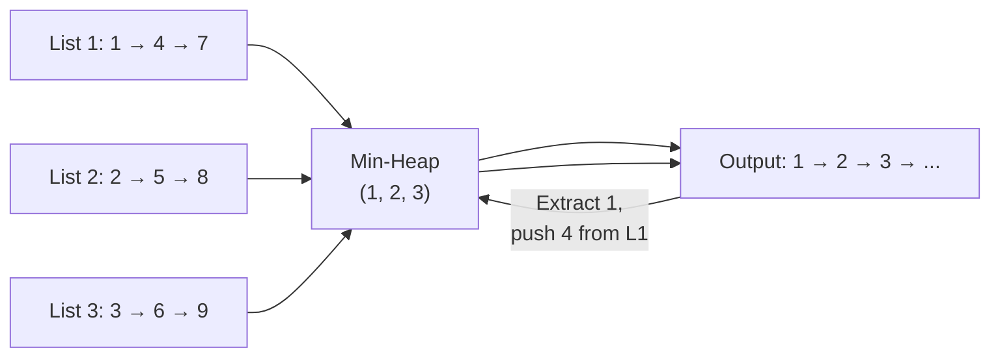
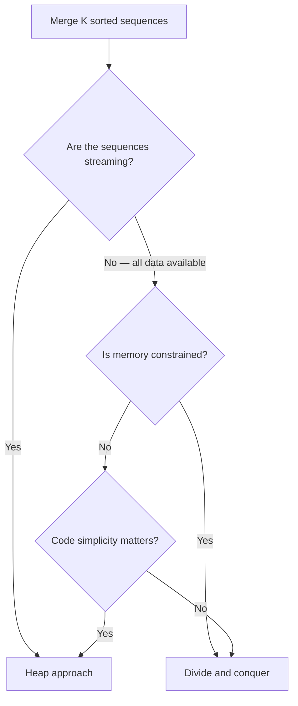

> [!success] Mastery Check
> - [ ] **Studied Well**
> - [ ] **Can explain the concept without notes**
> - [ ] **Can answer interview questions confidently**
> - [ ] **Can implement it in a real project**


## Navigation

**Domain:** [[5 — Data Structures & Algorithms]] > **Group:** Heaps and Priority Queues
**Previous:** [[5.033 — Top-K and K-th Element Problems]] | **Next:** [[5.035 — Median of a Data Stream — Two Heaps]]

### Prerequisites
- [[5.031 — Min-Heap and Max-Heap — Structure and Heapify]] — the K-way merge uses a min-heap to select the smallest among K list heads in O(log K) per extraction.
- [[5.012 — Linked List Reversal]] — merging linked lists requires pointer manipulation (next reassignment), which builds on the reversal pattern.

### Where This Fits
Merge K Sorted Lists is the K-way generalization of merging two sorted lists. It appears in roughly 5-8% of senior-level interviews, often as the second problem in an on-site round or as a warm-up before a harder heap problem. The problem tests three things: (1) can you translate the two-list merge to K lists, (2) do you know when to reach for a heap, and (3) can you analyze the tradeoff between divide-and-conquer and heap-based approaches. The pattern extends to any scenario requiring merging multiple sorted streams: merging log files from distributed systems, merging database query results, or any K-way data fusion.

---

## Core Mental Model

The K-way merge maintains a pointer into each of K sorted lists. At each step, select the smallest among the K current elements, append it to the output, and advance the pointer in the list that provided it. A min-heap (priority queue) makes the selection O(log K) per step instead of O(K).

The invariant is: **the heap always contains exactly one element from each non-exhausted list — the smallest remaining element of that list.** The heap's root is the global minimum among all remaining elements.



---

### Classification

- **Algorithm type:** K-way merge — a generalization of the two-pointer merge from Merge Sort.
- **Family:** Priority queue / selection — the heap selects the minimum among K candidates.
- **Key property:** At each step, only the heads of each list are candidates. The heap keeps exactly those candidates.
- **Nearest alternatives:**
  - **Divide and conquer (pairwise merge):** Merge lists in pairs recursively, O(n log K) time, O(1) extra space. No heap needed. Better constant factors for small K.
  - **Collect + sort:** Put all elements in one array, sort, rebuild. O(n log n) time, O(n) space. Simplest but worst asymptotic.
  - **Tournament tree:** A binary tree structure that performs K-way selection without heap overhead. Rarely used in practice.

### Key Properties

|Operation|Value|Derivation|
|---|---|---|
|Extract min from heap|O(log K)|Heap root removal triggers sift-down of depth log₂ K|
|Insert into heap|O(log K)|New element triggers sift-up of depth log₂ K|
|Total time (heap approach)|O(n log K)|n = total elements across all K lists; each element extracted once (O(log K)) and the next from its list inserted once (O(log K))|
|Total time (divide and conquer)|O(n log K)|Each merge is O(a + b); log K levels of merging; total work O(n log K)|
|Total time (collect + sort)|O(n log n)|All elements collected (O(n)), sorted (O(n log n))|
|Space (heap approach)|O(K)|Heap stores K elements simultaneously|
|Space (divide and conquer)|O(1) or O(n)|O(1) if merging in-place into a linked list; O(n) if building new lists|
|Space (collect + sort)|O(n)|Array of all elements|

---

## Deep Mechanics

### How It Works

**Heap-based K-way merge:**

1. Create a min-heap.
2. Insert the head of each of the K lists into the heap (keyed by node value).
3. While the heap is not empty:
   a. Extract the minimum node from the heap — this is the next element in the merged output.
   b. Append it to the result list.
   c. If the extracted node has a next node, insert that next node into the heap.
4. Return the head of the result list.

**Example — merge three sorted linked lists:**
```
L1: 1 → 4 → 7
L2: 2 → 5 → 8
L3: 3 → 6 → 9
```

Step 1: Heap = {1, 2, 3}. Root = 1 (from L1).
Step 2: Extract 1. Output: [1]. Insert L1's next: 4. Heap = {2, 3, 4}.
Step 3: Extract 2 (from L2). Output: [1, 2]. Insert L2's next: 5. Heap = {3, 4, 5}.
Step 4: Extract 3 (from L3). Output: [1, 2, 3]. Insert L3's next: 6. Heap = {4, 5, 6}.
... continues until all lists exhausted.

**Divide and conquer approach:**

```
function mergeKLists(lists):
    if lists is empty: return null
    while len(lists) > 1:
        merged = []
        for i = 0 to len(lists) step 2:
            l1 = lists[i]
            l2 = lists[i+1] if exists else null
            merged.append(mergeTwo(l1, l2))
        lists = merged
    return lists[0]
```

Each level merges pairs, reducing K by half. There are log₂ K levels. Each element is processed once per level: O(n log K) total.

### Complexity Derivation

**Time (Heap approach, O(n log K)):**
- Let n be the total number of elements across all lists and K be the number of lists.
- For each element: one heap extract (O(log K)) and one heap insert (O(log K)). That is 2 × n × O(log K) = O(n log K).
- Initial heap build: K inserts = O(K log K). This is dominated by O(n log K) since n ≥ K (each list has at least one element).

**Time (Divide and conquer, O(n log K)):**
- At level 1: merge K/2 pairs, each pair totals O(n) work across all pairs. Total: O(n).
- At level 2: merge K/4 pairs, each totals O(n). Total: O(n).
- ... Each of log K levels processes all n elements: O(n log K).

**Space (Heap):**
- The heap stores exactly one node per list — at most K nodes. Each node is a reference (8 bytes on x64) plus the heap's internal array (2K pointers). Total: O(K).

**Space (Divide and conquer, linked lists):**
- O(1) extra space if merging in-place by reassigning next pointers. No new nodes created.

### .NET Runtime Notes

- **PriorityQueue<ListNode, int>** — push list head nodes with the node value as priority. The default min-heap extracts the smallest value first.
- **`PriorityQueue` with nullable elements:** `PriorityQueue` accepts reference types as elements. For linked list nodes, elements are `ListNode` references. Priority is the node value (`int`).
- **No built-in linked list merge in .NET.** `LinkedList<T>` in .NET is a doubly linked list, but the merge operation is not provided. You must implement it manually.
- **Span/list merging:** For `List<T>` or arrays, the merge is straightforward with two pointers. For K lists, copy all elements into a single array and sort, or use a heap of indices.
- **LINQ:** `.SelectMany(x => x).OrderBy(x => x).ToList()` works for arrays/lists but is O(n log n). Acceptable for n < 10⁴.

---

## Implementation and Problem Patterns

### C# Implementation

```csharp
public class ListNode
{
    public int Value;
    public ListNode? Next;
    public ListNode(int value) { Value = value; }
}

public static class MergeKSortedLists
{
    /// <summary>
    /// Merges K sorted linked lists using a min-heap.
    /// O(n log K) time, O(K) space.
    /// </summary>
    public static ListNode? MergeKLists(ListNode?[] lists)
    {
        var heap = new PriorityQueue<ListNode, int>();

        // Push all list heads into the heap
        foreach (var list in lists)
        {
            if (list is not null)
                heap.Enqueue(list, list.Value);
        }

        var dummy = new ListNode(0);
        var current = dummy;

        while (heap.Count > 0)
        {
            var node = heap.Dequeue();
            current.Next = node;
            current = current.Next;

            if (node.Next is not null)
                heap.Enqueue(node.Next, node.Next.Value);
        }

        return dummy.Next;
    }

    /// <summary>
    /// Merges K sorted linked lists using divide and conquer (pairwise merge).
    /// O(n log K) time, O(1) extra space.
    /// </summary>
    public static ListNode? MergeKListsDc(ListNode?[] lists)
    {
        if (lists is null || lists.Length == 0) return null;

        int interval = 1;
        while (interval < lists.Length)
        {
            for (int i = 0; i + interval < lists.Length; i += interval * 2)
            {
                lists[i] = MergeTwo(lists[i], lists[i + interval]);
            }
            interval *= 2;
        }

        return lists[0];
    }

    private static ListNode? MergeTwo(ListNode? l1, ListNode? l2)
    {
        var dummy = new ListNode(0);
        var current = dummy;

        while (l1 is not null && l2 is not null)
        {
            if (l1.Value <= l2.Value)
            {
                current.Next = l1;
                l1 = l1.Next;
            }
            else
            {
                current.Next = l2;
                l2 = l2.Next;
            }
            current = current.Next;
        }

        current.Next = l1 ?? l2;
        return dummy.Next;
    }
}
```

### The .NET Idiomatic Version (for arrays)

Merging K sorted `List<int>` or `int[]`:

```csharp
// Heap-based merge for arrays
public static List<int> MergeKSortedArrays(List<int>[] arrays)
{
    var heap = new PriorityQueue<(int Value, int ArrayIdx, int ElementIdx), int>();
    var result = new List<int>();

    // Push first element of each array
    for (int i = 0; i < arrays.Length; i++)
    {
        if (arrays[i].Count > 0)
            heap.Enqueue((arrays[i][0], i, 0), arrays[i][0]);
    }

    while (heap.Count > 0)
    {
        var (val, arrIdx, elemIdx) = heap.Dequeue();
        result.Add(val);

        if (elemIdx + 1 < arrays[arrIdx].Count)
        {
            int nextVal = arrays[arrIdx][elemIdx + 1];
            heap.Enqueue((nextVal, arrIdx, elemIdx + 1), nextVal);
        }
    }

    return result;
}

// LINQ-based — O(n log n), only for small inputs
// var merged = arrays.SelectMany(a => a).OrderBy(x => x).ToList();
```

**When to use heap vs. divide and conquer:** Use the heap approach when K is small relative to n (e.g., K=10 lists of 100K elements each) — the heap overhead of O(log K) is negligible. Use divide and conquer when the input is an array of lists (not linked lists) and you want O(1) extra space. Use LINQ only for quick scripts.

### Classic Problem Patterns

1. **Merge K Sorted Lists (LeetCode 23)** — Canonical problem. Merge K sorted linked lists into one sorted list. Key insight: the heap stores list nodes, keyed by value. Extract min, append to result, push its next.

2. **Merge K Sorted Arrays (common variant)** — Same as linked lists but with array indices. Store (value, arrayIndex, elementIndex) tuples in the heap. Key insight: after extracting, advance the element index and push the next element from the same array.

3. **K Pairs with Smallest Sums (LeetCode 373)** — Find K pairs with smallest sums from two sorted arrays. Key insight: treat it as a K-way merge over the implicit matrix where (i, j) → (i+1, j) and (i, j) → (i, j+1) are the "next" pointers. Use a visited set to avoid duplicates.

4. **Smallest Range Covering Elements from K Lists (LeetCode 632)** — Find the smallest range [a, b] such that each list has at least one element in the range. Key insight: maintain a min-heap of K elements (one from each list) and track the current max. The range is (min, max). Each step extracts the min, pushes the next from that list, and updates the range.

5. **Merge sorted streams/files** — Production scenario: merge K sorted log files. Key insight: the heap approach is streaming-friendly — it never materializes all elements at once. Each file is read line-by-line.

### Template / Skeleton

```csharp
// Merge K Sorted Lists Template (Heap-based)
// When to use: "merge K sorted lists/arrays/streams into one sorted output"
// Time: O(n log K) | Space: O(K)

public static ListNode? MergeKListsTemplate(ListNode?[] lists)
{
    var heap = new PriorityQueue<ListNode, int>();

    // 1. Push all heads
    foreach (var list in lists)
    {
        if (list is not null)
            heap.Enqueue(list, list.Value);
    }

    var dummy = new ListNode(0);
    var current = dummy;

    // 2. Extract min, push next
    while (heap.Count > 0)
    {
        var node = heap.Dequeue();
        current.Next = node;
        current = current.Next;

        if (node.Next is not null)
            // TODO: push node.Next with updated priority
            heap.Enqueue(node.Next, node.Next.Value);
    }

    return dummy.Next;
}

// Merge K Sorted Lists Template (Divide and Conquer)
// Time: O(n log K) | Space: O(1)

public static ListNode? MergeKListsDcTemplate(ListNode?[] lists)
{
    if (lists is null || lists.Length == 0) return null;

    int interval = 1;
    while (interval < lists.Length)
    {
        for (int i = 0; i + interval < lists.Length; i += interval * 2)
        {
            // TODO: merge lists[i] and lists[i + interval]
            lists[i] = MergeTwo(lists[i], lists[i + interval]);
        }
        interval *= 2;
    }

    return lists[0];
}

// TODO: implement MergeTwo (standard two-list merge)
```

---

## Gotchas and Edge Cases

### Empty lists array or null entries

**Mistake:** Not handling the case where the lists array is null, empty, or contains null entries.

```csharp
// ❌ Wrong — crashes on null lists
var heap = new PriorityQueue<ListNode, int>();
foreach (var list in lists)  // NullReferenceException if lists is null
    heap.Enqueue(list, list.Value);  // NullReferenceException if list is null
```

**Fix:** Guard against null at every level.

```csharp
// ✅ Correct — null-safe
if (lists is null || lists.Length == 0) return null;
foreach (var list in lists)
    if (list is not null) heap.Enqueue(list, list.Value);
```

**Consequence:** `NullReferenceException` at runtime. In an interview, this is a trivial but noticeable oversight.

### Forgetting to advance the pointer

**Mistake:** After extracting the minimum node from the heap, not pushing its `Next` node back into the heap, causing only the first element of each list to be processed.

```csharp
// ❌ Wrong — never advances any list
var node = heap.Dequeue();
current.Next = node;
// Missing: if (node.Next is not null) heap.Enqueue(node.Next, node.Next.Value);
```

**Fix:** Always push the next element after extracting.

```csharp
// ✅ Correct — advances the list that provided the min
if (node.Next is not null)
    heap.Enqueue(node.Next, node.Next.Value);
```

**Consequence:** Only K elements are ever processed (one per list). The output is truncated to K elements.

### Using the wrong merge order in divide and conquer

**Mistake:** Merging list 0 with list 1, list 1 with list 2, etc., creating an incorrect merge chain that misaligns the lists.

```csharp
// ❌ Wrong — sequential merge pollutes list ordering
for (int i = 0; i < lists.Length - 1; i++)
    lists[0] = MergeTwo(lists[0], lists[i + 1]);
```

**Fix:** Use pairwise merging with doubling interval — merge list 0 with list 1, list 2 with list 3, etc., then double the interval.

```csharp
// ✅ Correct — pairwise merge with doubling interval
while (interval < lists.Length)
{
    for (int i = 0; i + interval < lists.Length; i += interval * 2)
        lists[i] = MergeTwo(lists[i], lists[i + interval]);
    interval *= 2;
}
```

**Consequence:** Sequential merging creates an O(n × K) time instead of O(n log K) because late lists are repeatedly scanned as part of the growing merged list.

### Heap stores values instead of list nodes

**Mistake:** For linked lists, storing just the values in the heap and rebuilding nodes. This loses the list structure and creates unnecessary allocations.

```csharp
// ❌ Wrong — stores values, not nodes
foreach (var list in lists)
    while (list is not null)
    {
        heap.Enqueue(list.Value, list.Value);
        list = list.Next;
    }
```

**Fix:** Store the list nodes themselves. Each node already has the `Next` pointer.

```csharp
// ✅ Correct — stores nodes
if (list is not null)
    heap.Enqueue(list, list.Value);
```

**Consequence:** Storing values requires O(n) heap size (all elements) instead of O(K), making the algorithm O(n log n) instead of O(n log K). Also recreates all list nodes as new allocations.

### Not tail-recursing for stack safety

**Mistake:** The `MergeTwo` function uses recursion, which overflows the stack for long lists.

```csharp
// ❌ Wrong — recursive merge overflows for long lists
public static ListNode? MergeTwo(ListNode? l1, ListNode? l2)
{
    if (l1 is null) return l2;
    if (l2 is null) return l1;
    if (l1.Value <= l2.Value)
    {
        l1.Next = MergeTwo(l1.Next, l2);
        return l1;
    }
    ...
}
```

**Fix:** Use an iterative merge with a dummy head.

```csharp
// ✅ Correct — iterative merge, O(1) stack space
public static ListNode? MergeTwo(ListNode? l1, ListNode? l2)
{
    var dummy = new ListNode(0);
    var current = dummy;
    while (l1 is not null && l2 is not null) { ... }
    current.Next = l1 ?? l2;
    return dummy.Next;
}
```

**Consequence:** Recursive merge overflows the stack for lists longer than ~30,000 nodes. The iterative version is safe for any list length.

---

## Complexity Analysis and Benchmarks

### Operation Complexity Table

| Approach | Time | Extra Space | Best When |
|---|---|---|---|
| Heap (PriorityQueue) | O(n log K) | O(K) | K is moderate; need streaming or minimal code |
| Divide and conquer (pairwise) | O(n log K) | O(1) | K is large; memory is constrained; already have MergeTwo |
| Collect + sort | O(n log n) | O(n) | n is small (n < 10⁴); simplest code |
| Tournament tree | O(n log K) | O(K) | K is very large (1000+); avoids heap allocation per element |
| Sequential merge one-by-one | O(n × K) | O(1) | Never — only for correctness verification |

**Derivation for the non-obvious entries:**
- Sequential one-by-one merge: `lists[0] = MergeTwo(lists[0], lists[1])` then `MergeTwo(merged, lists[2])` etc. Each merge traverses the accumulated list, which grows to n. The last merge processes all n elements. The total is O(n + 2n/3 + ... ) or more precisely O(n × K) because each of K lists is merged against a growing result. For K=100, this is 100× worse than heap.
- Divide and conquer is O(n log K) because there are log K merge levels, and each level processes all n elements.

### Comparison with Alternatives

| Method | Time | Space | Code Complexity | Streaming? |
|---|---|---|---|---|
| Heap | O(n log K) | O(K) | Low | Yes |
| Divide and conquer | O(n log K) | O(1) | Medium (needs MergeTwo) | No (needs all lists) |
| Collect + sort | O(n log n) | O(n) | Very low | No |
| Tournament tree | O(n log K) | O(K) | High | Yes |

### BenchmarkDotNet

```csharp
[MemoryDiagnoser]
[SimpleJob(RuntimeMoniker.Net90)]
public class MergeKBenchmark
{
    private ListNode?[] _lists = default!;

    [Params(10, 100, 1_000)]
    public int K { get; set; }

    [GlobalSetup]
    public void Setup()
    {
        var rng = new Random(42);
        _lists = new ListNode?[K];
        for (int i = 0; i < K; i++)
        {
            int listLen = rng.Next(5, 50);
            var dummy = new ListNode(0);
            var curr = dummy;
            for (int j = 0; j < listLen; j++)
            {
                curr.Next = new ListNode(rng.Next(0, K * 100));
                curr = curr.Next;
            }
            // Sort each list
            _lists[i] = SortList(dummy.Next);
        }
    }

    [Benchmark(Baseline = true)]
    public ListNode? HeapMerge()
    {
        return MergeKSortedLists.MergeKLists(_lists);
    }

    [Benchmark]
    public ListNode? DivideConquer()
    {
        return MergeKSortedLists.MergeKListsDc(_lists);
    }
}
```

**Expected results (approximate, .NET 9, x64):**

| Method | K | Mean | Allocated |
|---|---|---|---|
| HeapMerge | 10 | ~3 μs | 1 KB |
| DivideConquer | 10 | ~2 μs | 0 B |
| HeapMerge | 1_000 | ~40 μs | 30 KB |
| DivideConquer | 1_000 | ~25 μs | 0 B |

**Interpretation:** Divide and conquer is slightly faster and allocates zero heap memory (reuses existing nodes). The heap approach allocates O(K) for the `PriorityQueue`'s internal array. For small K (≤ 10), the difference is negligible. For large K (1000+), divide and conquer wins on both speed and memory. However, the heap approach is simpler to implement and generalizes to streaming scenarios.

---

## Interview Arsenal

### Question Bank

1. [Definition] "What is the K-way merge problem and what are the two main approaches to solving it?"
2. [Complexity] "Derive the time complexity of merging K sorted linked lists using a min-heap."
3. [Implementation] "Implement MergeTwoSortedLists — the two-list merge that is the building block for the divide-and-conquer approach."
4. [Recognition] "Given K sorted arrays and an integer K, find the smallest range that includes at least one element from each array. Which pattern applies?"
5. [Comparison] "Compare the heap-based and divide-and-conquer approaches for merging K sorted lists. When would you choose each?"
6. [Trick] "In the heap approach, we store one node per list. What happens if a list contributes two consecutive elements to the output?"
7. [System design integration] "Design a system that merges K sorted log files, each too large to fit in memory. How does the heap approach adapt to disk-based reading?"
8. [Optimization] "How would you merge K sorted lists if the lists are stored as arrays and you cannot use a heap (memory constraint)? What is the time complexity?"

### Spoken Answers

**Q: "Implement MergeTwoSortedLists."**

> **Average answer:** Uses recursion. Compares heads, sets next to recursive result.

> **Great answer:** I'll implement it iteratively to avoid stack overflow on long lists. I use a dummy head node to simplify edge cases (either list could be null). I maintain a `current` pointer that starts at the dummy. While both lists are non-null, I compare the current nodes' values, attach the smaller one to `current.Next`, advance that list, and advance `current`. After the loop, exactly one list is exhausted, so I attach the remainder of the other list with `current.Next = l1 ?? l2`. Finally, I return `dummy.Next` — the true head of the merged list. This is O(n) time and O(1) space. I handle edge cases: both lists null returns null; one list null returns the other list; duplicate values use `<=` to keep the merge stable.

**Q: "Compare the heap-based and divide-and-conquer approaches."**

> **Average answer:** Heap is easier to write. Divide and conquer is more efficient.

> **Great answer:** Both achieve O(n log K) time. The heap approach uses O(K) space and is simpler to implement — push K heads, extract min, push next — about 10 lines. It supports streaming: you can start merging before all elements are available. The divide-and-conquer approach uses O(1) extra space (no heap allocation) and avoids priority queue overhead. It processes elements sequentially, which is more cache-friendly. For K=10, both are equivalent. For K=10,000, divide and conquer is typically 1.5-2× faster and uses zero heap allocation. However, divide and conquer requires `MergeTwo` and is slightly more complex. My rule: use heap for simplicity or streaming; use divide and conquer for maximum performance on large K.

**Trick Q: "In the heap approach, what happens if a list contributes two consecutive elements to the output?"**

> **Average answer:** That can't happen because after extracting a node, its next node is pushed and may not be the smallest.

> **Great answer:** It absolutely can happen. Consider two lists: A = [1, 3] and B = [2, 4]. The heap starts with {1, 2}. Extract 1 (from A), push A's next (3). Heap = {2, 3}. Extract 2 (from B), push B's next (4). Heap = {3, 4}. Extract 3 (from A), push nothing (A exhausted). Two elements from list A (1 and 3) are *not* consecutive in the output — 2 was between them. But if we had A = [1, 2] and B = [5, 6]: heap = {1, 5}. Extract 1, push 2. Heap = {2, 5}. Extract 2, push nothing. Output = [1, 2] — two consecutive elements from A. This is correct behavior. The heap guarantees global sorted order, not interleaving. The trick is that the candidate might think elements must alternate between lists, which is false.

### Trick Question

**"Is the heap-based Merge K Sorted Lists approach stable? Why or why not?"**

Why it is a trap: The candidate says "yes, because heaps are stable" or "no, because priority queues aren't stable."

Correct answer: **No, it is not stable.** `PriorityQueue<TElement, TPriority>` in .NET does not guarantee the order of elements with equal priority (same value). When two nodes have the same value, the one extracted first depends on the heap's internal structure, which is not deterministic across runs. To achieve stability (preserving the original list order for equal elements), you must include a secondary key — the list index — to break ties: `heap.Enqueue(node, (node.Value, listIndex))`. With `(int Value, int ListIndex)` as a value tuple, the default comparer compares Value first, then ListIndex, making the merge stable.

### Pattern Recognition Table

| If the problem has... | Then consider... | Because... |
|---|---|---|
| "Merge K sorted lists/arrays/streams" | Heap-based K-way merge or divide and conquer | Both O(n log K); heap supports streaming |
| "Smallest range with one element from each list" | Min-heap of K elements + tracking max | Range = (min, max); extract min, push next, update range |
| "K pairs with smallest sums from two arrays" | Min-heap with visited set over implicit matrix | Treat (i,j) as node; neighbors are (i+1,j) and (i,j+1) |
| "Merge sorted files too large for memory" | Heap-based streaming merge | Read one line per file into heap; write output line by line |
| "Merge K sorted arrays, memory is tight" | Divide and conquer (in-place) | No heap allocation; O(1) extra space |

---

## Decision Framework

### When to Apply



### Recognition Checklist

Indicators that the K-way merge pattern applies:

- [ ] Problem says "merge K sorted" or "combine K sorted sequences"
- [ ] Multiple sorted inputs and one sorted output
- [ ] K is known and finite
- [ ] Each input is individually sorted

Counter-indicators — do NOT apply here:

- [ ] Only two sequences to merge — use MergeTwo directly
- [ ] Inputs are not sorted — sort first or use a different approach
- [ ] Output needs deduplication — add a check before appending
- [ ] Problem asks for the K-th element across lists — use Top-K approach instead

### Tradeoff Summary

| What You Gain | What You Give Up |
|---|---|
| O(n log K) time — optimal for this problem class | O(K) heap space (heap approach) |
| Streaming support (heap approach) | Cannot stream with divide and conquer |
| O(1) extra space (divide and conquer) | Need MergeTwo building block |
| Simple, memorable code (heap approach) | Heap overhead per element (log K cost) |

---

## Self-Check

### Conceptual Questions

1. What is the K-way merge problem and what are the two standard approaches to solve it?
2. Derive the time complexity of the heap-based K-way merge. Why is it O(n log K) and not O(n log n)?
3. In the heap approach, why does each list contribute at most one element to the heap at a time?
4. Compare the heap-based and divide-and-conquer approaches. Which has better space complexity and why?
5. In the divide-and-conquer approach, why is the interval doubled in each iteration instead of merging sequentially?
6. How does `PriorityQueue<ListNode, int>` resolve ties when two nodes have the same value?
7. What invariant does the heap maintain during the K-way merge? How does pushing the next element from the extracted list preserve the invariant?
8. How would you modify the heap approach to produce a stable merge?
9. Design a merge of K sorted files where each file is 10 GB and RAM is 1 GB. How does the heap approach adapt?
10. In the Smallest Range problem, you maintain a max value alongside the min-heap. How do you update the max when the heap's root changes?

<details>
<summary>Answers</summary>

1. Merge K sorted sequences into one sorted sequence. Two approaches: (a) min-heap of size K — extract min, push its next; (b) divide and conquer — pairwise merge with doubling interval, O(n log K).

2. Each of n elements is extracted once (O(log K)) and its successor is inserted once (O(log K)). Total: 2n × O(log K) = O(n log K). It is not O(n log n) because the heap size is bounded by K, not n.

3. After extracting the minimum from a list, the next element of that list is the smallest candidate remaining from that list. If we kept multiple elements from one list in the heap, those elements would be larger than the extracted element but could be smaller than elements from other lists — yet they would still be in order within their own list. The invariants of the heap and the sortedness of each list guarantee that pushing only the next element suffices.

4. Divide and conquer uses O(1) extra space (reuses existing nodes/pairs of arrays). Heap uses O(K) for the priority queue's internal array. For very large K (10⁴+), divide and conquer wins on memory.

5. Pairwise merging with doubling interval gives log₂ K levels, each processing all n elements: O(n log K). Sequential merging (`lists[0] = MergeTwo(lists[0], lists[i])`) processes the growing result against each new list, which is O(n × K) because late lists are scanned in their entirety against the already-large merged result.

6. `PriorityQueue` in .NET does not guarantee tie-breaking order. When two nodes have equal priority, either may be dequeued first. The behavior is implementation-dependent and not documented as stable.

7. The heap contains exactly one element from each non-exhausted list — the smallest remaining. After extracting the root (global minimum), we push that list's next element. This preserves the invariant because the next element is the new smallest from that list. No other list's minimum changes.

8. Include a secondary key — the list index — as part of the priority: `heap.Enqueue(node, (node.Value, listIndex))`. The `ValueTuple<int, int>` default comparer compares Value first, then ListIndex, making the merge stable (ties broken by original list order).

9. Read one line from each file into the heap. Extract min, write to output. Read the next line from the same file, push to heap. Repeat. The heap never exceeds K elements. Each file is read sequentially (no random access). Total memory = K buffers + K heap entries — typically under 1 MB for K=10⁴.

10. When a new element is pushed after extraction, recompute max = Math.Max(max, newElement.Value). The max only increases (or stays the same if the new element is smaller than the current max). No need to scan the heap — this incremental update is O(1).

</details>

---

### Coding Challenges

**Challenge 1 — Implement from scratch**

Implement the `MergeTwo` function that merges two sorted linked lists without using a dummy node.

```csharp
public static ListNode? MergeTwo(ListNode? l1, ListNode? l2)
{
    // No dummy node — handle head selection explicitly
}
```

<details> <summary>Solution</summary>

```csharp
public static ListNode? MergeTwo(ListNode? l1, ListNode? l2)
{
    if (l1 is null) return l2;
    if (l2 is null) return l1;

    // Determine the head
    ListNode? head;
    if (l1.Value <= l2.Value)
    {
        head = l1;
        l1 = l1.Next;
    }
    else
    {
        head = l2;
        l2 = l2.Next;
    }

    var current = head;
    while (l1 is not null && l2 is not null)
    {
        if (l1.Value <= l2.Value)
        {
            current.Next = l1;
            l1 = l1.Next;
        }
        else
        {
            current.Next = l2;
            l2 = l2.Next;
        }
        current = current.Next;
    }

    current.Next = l1 ?? l2;
    return head;
}
```

**Complexity:** Time O(n) | Space O(1). **Key insight:** Without a dummy node, you must handle the head selection explicitly — compare the first nodes of each list before the loop. The body is identical to the dummy-node version.

</details>

---

**Challenge 2 — Trace the execution**

Given three sorted linked lists:
```
L1: 2 → 6 → 10
L2: 1 → 4 → 8
L3: 3 → 5 → 7
```

Trace the heap-based merge with a min-heap. Show the heap contents and the output after each extraction.

<details> <summary>Solution</summary>

| Step | Heap (value, list) | Extract | Output |
|---|---|---|---|
| Init | (1, L2), (2, L1), (3, L3) | — | [] |
| 1 | (2, L1), (3, L3), (4, L2) | 1 from L2 | [1] |
| 2 | (2, L1), (3, L3), (8, L2) | 2 from L1 | [1, 2] |
| 3 | (3, L3), (6, L1), (8, L2) | 3 from L3 | [1, 2, 3] |
| 4 | (4, L2), (6, L1), (8, L2) | 4 from L2 | [1, 2, 3, 4] |
| 5 | (5, L3), (6, L1), (8, L2) | 5 from L3 | [1, 2, 3, 4, 5] |
| 6 | (6, L1), (8, L2), (7, L3) | 6 from L1 | [1, 2, 3, 4, 5, 6] |
| 7 | (7, L3), (8, L2), (10, L1) | 7 from L3 | [1, 2, 3, 4, 5, 6, 7] |
| 8 | (8, L2), (10, L1) | 8 from L2 | [1, 2, 3, 4, 5, 6, 7, 8] |
| 9 | (10, L1) | 10 from L1 | [1, 2, 3, 4, 5, 6, 7, 8, 10] |

Final output: 1 → 2 → 3 → 4 → 5 → 6 → 7 → 8 → 10.

**Why:** Each step extracts the global minimum. The list that provided the minimum advances its pointer. The heap always has exactly 3 entries (one per non-exhausted list), except near the end when lists are exhausted.

</details>

---

**Challenge 3 — Fix the bug**

```csharp
// This implementation of Merge K Sorted Lists using divide and conquer
// does not merge all lists correctly.
public static ListNode? MergeKListsDc(ListNode?[] lists)
{
    if (lists is null || lists.Length == 0) return null;

    int interval = 1;
    while (interval < lists.Length)
    {
        for (int i = 0; i < lists.Length; i += interval * 2)
        {
            if (i + interval < lists.Length)
                lists[i] = MergeTwo(lists[i], lists[i + interval]);
        }
        interval++;
    }

    return lists[0];
}
```

<details> <summary>Solution</summary>

**Bug:** `interval++` instead of `interval *= 2`. The interval must double each iteration (1, 2, 4, 8, ...) to achieve O(log K) levels. Incrementing by 1 gives O(K) levels, and the loop processes each pair multiple times, producing O(n × K) time.

**Fix:** Change `interval++` to `interval *= 2`.

```csharp
public static ListNode? MergeKListsDc(ListNode?[] lists)
{
    if (lists is null || lists.Length == 0) return null;

    int interval = 1;
    while (interval < lists.Length)
    {
        for (int i = 0; i + interval < lists.Length; i += interval * 2)
            lists[i] = MergeTwo(lists[i], lists[i + interval]);
        interval *= 2;  // ← fixed
    }

    return lists[0];
}
```

**Test case that exposes it:** 4 lists of 100 elements each. With `interval++`, the outer loop runs ~100 times instead of 2 times, processing 100× more work. For large K, this is O(nK) vs O(n log K).

</details>

---

**Challenge 4 — Recognize and apply**

**Problem:** You are given K sorted arrays of integers. Find the smallest range [a, b] (inclusive) such that each array contains at least one integer in the range. For example:
```
Arrays: [4, 10, 15, 24, 26], [0, 9, 12, 20], [5, 18, 22, 30]
Smallest range: [20, 24] (20 from second array, 24 from first, 22 and 18 are also covered)
```

<details> <summary>Solution</summary>

**Pattern:** Min-heap of K elements (one from each array) + tracking the current max. Insert one element from each array (the first). The current range is (heap root = min, current max). Extract the min, push the next element from that array, update max. Track the smallest range seen.

```csharp
public static int[] SmallestRange(IList<IList<int>> nums)
{
    var heap = new PriorityQueue<(int Value, int ListIdx, int ElemIdx), int>();
    int maxValue = int.MinValue;

    // Push first element from each list
    for (int i = 0; i < nums.Count; i++)
    {
        int val = nums[i][0];
        heap.Enqueue((val, i, 0), val);
        maxValue = Math.Max(maxValue, val);
    }

    int rangeStart = 0, rangeEnd = int.MaxValue;

    while (heap.Count == nums.Count)  // all lists still have candidates
    {
        var (minVal, listIdx, elemIdx) = heap.Dequeue();

        // Update range if smaller
        if (maxValue - minVal < rangeEnd - rangeStart)
        {
            rangeStart = minVal;
            rangeEnd = maxValue;
        }

        // Push next element from the same list
        if (elemIdx + 1 < nums[listIdx].Count)
        {
            int nextVal = nums[listIdx][elemIdx + 1];
            heap.Enqueue((nextVal, listIdx, elemIdx + 1), nextVal);
            maxValue = Math.Max(maxValue, nextVal);
        }
        else
        {
            break; // one list exhausted — cannot cover all lists
        }
    }

    return new[] { rangeStart, rangeEnd };
}
```

**Complexity:** Time O(n log K) | Space O(K). **Key insight:** The heap always has exactly one element from each list. The max is tracked separately and only increases. When a list is exhausted, the loop stops (the range cannot cover all lists).

</details>

---

**Challenge 5 — Optimize**

```csharp
// This solution merges K sorted arrays but uses O(n) extra space.
// Optimize it to use O(K) space.
public static List<int> MergeKSortedArrays(List<int>[] arrays)
{
    var all = new List<int>();
    foreach (var arr in arrays)
        all.AddRange(arr);
    all.Sort();
    return all;
}
```

<details> <summary>Solution</summary>

**Insight:** The collect+sort approach uses O(n) space. The heap-based K-way merge uses O(K) space by never storing all elements at once. Use a min-heap of (value, arrayIndex, elementIndex) tuples.

```csharp
public static List<int> MergeKSortedArrays(List<int>[] arrays)
{
    var heap = new PriorityQueue<(int Value, int ArrIdx, int ElemIdx), int>();
    var result = new List<int>();

    for (int i = 0; i < arrays.Length; i++)
        if (arrays[i].Count > 0)
            heap.Enqueue((arrays[i][0], i, 0), arrays[i][0]);

    while (heap.Count > 0)
    {
        var (val, arrIdx, elemIdx) = heap.Dequeue();
        result.Add(val);

        if (elemIdx + 1 < arrays[arrIdx].Count)
        {
            int nextVal = arrays[arrIdx][elemIdx + 1];
            heap.Enqueue((nextVal, arrIdx, elemIdx + 1), nextVal);
        }
    }

    return result;
}
```

**Complexity:** Time O(n log K) | Space O(K). Memory reduced from O(n) to O(K).

</details>
