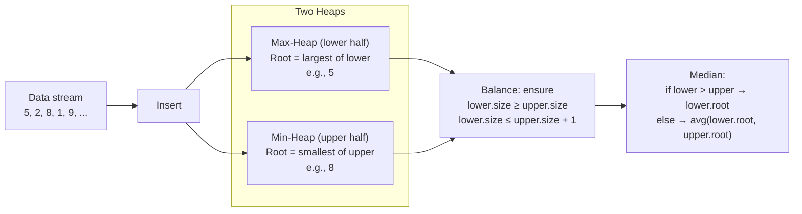
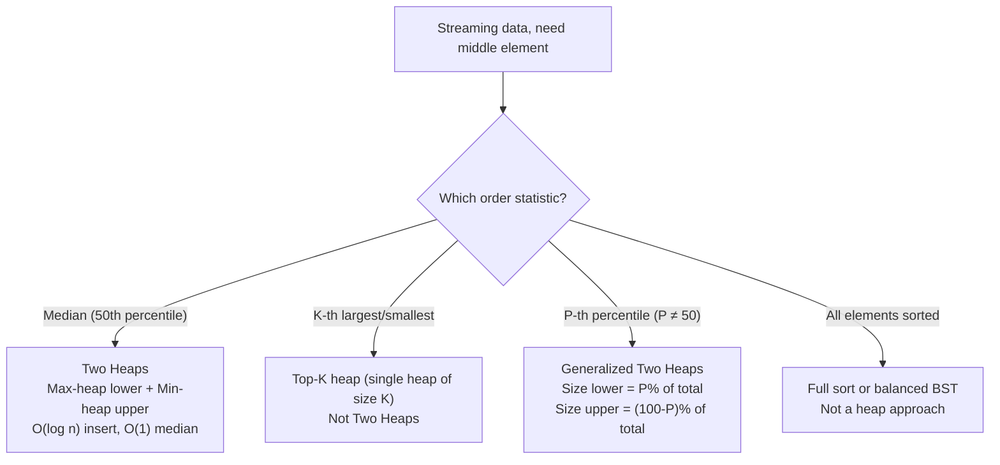

> [!success] Mastery Check
> - [ ] **Studied Well**
> - [ ] **Can explain the concept without notes**
> - [ ] **Can answer interview questions confidently**
> - [ ] **Can implement it in a real project**


## Navigation

**Domain:** [[5 — Data Structures & Algorithms]] > **Group:** Heaps and Priority Queues
**Previous:** [[5.034 — Merge K Sorted Lists]] | **Next:** [[5.036 — Graph Representation — Adjacency List and Matrix]]

### Prerequisites
- [[5.031 — Min-Heap and Max-Heap — Structure and Heapify]] — the Two Heaps pattern requires fluency with both heap types and their O(log n) insert operations.
- [[5.033 — Top-K and K-th Element Problems]] — the median is the (n/2)-th order statistic; the min-heap-of-size-K pattern extends naturally to the two-heap approach.

### Where This Fits
The median of a data stream is a classic problem that tests heap manipulation and invariant maintenance. It appears in roughly 5% of senior interviews and is a favorite of companies that value clean, bug-free implementations of non-trivial data structure problems. The Two Heaps pattern generalizes beyond medians to any problem requiring access to the middle of a sorted stream: sliding window medians, percentile tracking, and load balancing. In system design, it appears in real-time analytics dashboards (median response time, median transaction value) and any "P50/P99 latency" monitoring.

---

## Core Mental Model

Maintain two heaps that partition the data stream into two halves:
- A **max-heap** for the lower half (largest element at the root — immediately accessible).
- A **min-heap** for the upper half (smallest element at the root).

The invariant: the lower heap has either the same number of elements as the upper heap, or exactly one more. The median is always the root of the lower heap (if sizes differ) or the average of both roots (if sizes equal).



---

### Classification

- **Data structure pattern:** Two-heap partitioning — a dynamic order statistic maintenance technique.
- **Family:** Streaming statistics — problems where the full dataset is not available and each element arrives one at a time.
- **Key property:** The median depends only on the middle 1-2 elements at any point. The heaps discard all other elements from view but the invariant ensures they are correctly partitioned.
- **Nearest alternatives:**
  - **Sorted list (insertion sort):** O(n) insert, O(1) median. Naive but acceptable for n < 10⁴.
  - **Balanced BST (SortedSet):** O(log n) insert, O(log n) median (via `ElementAt`). .NET's `SortedSet<T>` does not support `ElementAt` efficiently.
  - **Order statistic tree:** O(log n) insert and median. Not available in .NET.
  - **Skip list:** O(log n) average. Not available in .NET.

### Key Properties

|Operation|Value|Derivation|
|---|---|---|
|Insert into max-heap|O(log n)|Sift-up in heap of size n|
|Insert into min-heap|O(log n)|Sift-up in heap of size n|
|Rebalance (move one element)|O(log n)|Extract from one heap (O(log n)), insert into other (O(log n))|
|Median query|O(1)|Peek at root of one or both heaps|
|Total per element|O(log n)|One insert + at most one rebalance = O(log n) + O(log n) = O(log n)|
|Space|O(n)|Both heaps combined store all elements|

---

## Deep Mechanics

### How It Works

**Data structure:**
- `lower` = max-heap (stores the smaller half of elements)
- `upper` = min-heap (stores the larger half of elements)

**Invariant:** `lower.Count == upper.Count` or `lower.Count == upper.Count + 1`.

**Insert algorithm:**
1. If `lower` is empty or the new value ≤ `lower.Peek()`, insert into `lower`. Otherwise, insert into `upper`.
2. **Rebalance:** If `lower.Count > upper.Count + 1`, move the root of `lower` to `upper`. If `upper.Count > lower.Count`, move the root of `upper` to `lower`.

**Median:**
- If `lower.Count > upper.Count`: return `lower.Peek()`.
- Otherwise: return `(lower.Peek() + upper.Peek()) / 2.0`.

**Example — stream [5, 2, 8, 1, 9]:**

| Value | lower (max) | upper (min) | Rebalance | Median |
|---|---|---|---|---|
| 5 | [5] | [] | — | 5.0 |
| 2 | [2, 5] | [] | lower > upper+1 → move 5 → upper=[5], lower=[2] | 2.0 |
| 8 | [2] | [5] | 8 > lower.Peek=2 → insert upper → [5, 8]. upper > lower → move 5 → lower=[2, 5], upper=[8] | 5.0 |
| 1 | [2, 5] | [8] | 1 ≤ lower.Peek=5 → insert lower → [1, 2, 5]. lower > upper+1 → move 5 → upper=[5, 8], lower=[1, 2] | avg(2 + 5)/2 = 3.5 |
| 9 | [1, 2] | [5, 8] | 9 > lower.Peek=2 → insert upper → [5, 8, 9]. upper > lower → move 5 → lower=[1, 2, 5], upper=[8, 9] | 5.0 |

### Complexity Derivation

**Time (per insertion, O(log n)):**
- One heap insert: O(log n). At most one rebalance cycle: extract from one heap (O(log n)) + insert into the other (O(log n)). Total: O(3 log n) = O(log n) worst case.
- Average case (no rebalance needed): O(log n) — just the insert.

**Time (median query, O(1)):**
- Peek at one or two heap roots: O(1) each.

**Space (O(n)):**
- All n elements are stored across the two heaps. Each heap internally uses an array that grows by doubling. Total storage: ~2n element slots.

### .NET Runtime Notes

- **No built-in max-heap in .NET.** `PriorityQueue<TElement, TPriority>` is a min-heap by default. For a max-heap, use `Comparer<int>.Create((a, b) => b.CompareTo(a))` for integer priorities, or negate the priority value.
- **Median as double:** The median of an even-sized stream is the average of two integers, which requires `double` or `float`. Use `(lowerRoot + upperRoot) / 2.0` to avoid integer truncation.
- **PriorityQueue with int priority and int.MaxValue - value trick:** For a max-heap, you can enqueue with `int.MaxValue - value` as priority instead of a custom comparer. This is slightly faster (no comparer delegate) but limits values to the int range.
- **Long-term rebalancing:** Each insert triggers exactly one rebalance step maximum. There is no cascading rebalance because moving one element restores the invariant.
- **GC pressure:** Two heaps each allocate arrays that grow by doubling. For large n (10⁶+), this can cause significant Gen 2 GC pressure. Pre-size with `new PriorityQueue<T, T>(initialCapacity)` if n is known.

---

## Implementation and Problem Patterns

### C# Implementation

```csharp
public class MedianFinder
{
    private readonly PriorityQueue<int, int> _lower;  // max-heap (simulated)
    private readonly PriorityQueue<int, int> _upper;  // min-heap

    public MedianFinder()
    {
        // Max-heap: negate priority so larger values come first
        _lower = new PriorityQueue<int, int>(
            Comparer<int>.Create((a, b) => b.CompareTo(a)));
        _upper = new PriorityQueue<int, int>();  // min-heap (default)
    }

    /// <summary>Adds a number to the data stream. O(log n).</summary>
    public void AddNum(int num)
    {
        // Step 1: Insert into the appropriate heap
        if (_lower.Count == 0 || num <= _lower.Peek())
            _lower.Enqueue(num, num);
        else
            _upper.Enqueue(num, num);

        // Step 2: Rebalance to maintain the invariant
        if (_lower.Count > _upper.Count + 1)
        {
            int move = _lower.Dequeue();
            _upper.Enqueue(move, move);
        }
        else if (_upper.Count > _lower.Count)
        {
            int move = _upper.Dequeue();
            _lower.Enqueue(move, move);
        }
    }

    /// <summary>Returns the median of all elements seen so far. O(1).</summary>
    public double FindMedian()
    {
        if (_lower.Count > _upper.Count)
            return _lower.Peek();
        return (_lower.Peek() + _upper.Peek()) / 2.0;
    }
}
```

### The .NET Idiomatic Version (negation trick for max-heap)

```csharp
// Max-heap using negation instead of custom comparer
private readonly PriorityQueue<int, long> _lower = new();

public void AddNum(int num)
{
    if (_lower.Count == 0 || num <= -_lower.Peek())  // peek negated
        _lower.Enqueue(num, -num);  // negate for max-heap
    else
        _upper.Enqueue(num, num);

    // Rebalance — same logic, peek with negation
    if (_lower.Count > _upper.Count + 1)
        _upper.Enqueue(_lower.Dequeue(), -_lower.Peek());  // wrong pattern
}
```

**When to use negation vs. custom comparer:** Use negation for `int` priorities when the range allows it. Use custom comparer for clarity and for non-integer priorities. The performance difference is negligible.

### Classic Problem Patterns

1. **Median of a Data Stream (LeetCode 295)** — The canonical Two Heaps problem. Maintain running median as numbers arrive. Key insight: the two heaps partition the data; the median is always at the boundary.

2. **Sliding Window Median (LeetCode 480)** — Median of each window in a sliding window over an array. Extends Two Heaps with lazy deletion: track which elements are "invalid" (out of the window) using a dictionary, and clean them from the heap roots lazily. Key insight: heaps cannot efficiently remove arbitrary elements, so you mark them as stale and skip them when they reach the root.

3. **Find Median from a Large File (system design variant)** — File too large for memory. Key insight: sample the file to estimate the median; if exact median is required, partition and count frequencies in passes.

4. **Percentile tracking (P50, P95, P99)** — Extend Two Heaps to track arbitrary percentiles. Store the P-th percentile by maintaining heaps of corresponding sizes. Key insight: for P50, each heap holds half the data. For P95, the upper heap holds 5%, the lower holds 95%.

### Template / Skeleton

```csharp
// Two Heaps Template (Median of a Stream)
// When to use: "streaming median", "running median", "middle element of stream"
// Insert: O(log n) | Median: O(1) | Space: O(n)

public class MedianFinder
{
    // Max-heap (lower half) — use custom comparer or negated priority
    private readonly PriorityQueue<int, int> _lower = new(
        Comparer<int>.Create((a, b) => b.CompareTo(a)));
    // Min-heap (upper half)
    private readonly PriorityQueue<int, int> _upper = new();

    public void AddNum(int num)
    {
        // TODO: Insert into _lower if num <= _lower.Peek(), else _upper
        // TODO: Rebalance — ensure _lower.Count >= _upper.Count
        // TODO: and _lower.Count <= _upper.Count + 1
    }

    public double FindMedian()
    {
        // TODO: if _lower.Count > _upper.Count, return _lower.Peek()
        // TODO: else return (_lower.Peek() + _upper.Peek()) / 2.0
    }
}
```

---

## Gotchas and Edge Cases

### Even-length median as double

**Mistake:** Returning an `int` for the median of an even-length stream, truncating the fractional part.

```csharp
// ❌ Wrong — integer division truncates
public int FindMedian()
{
    return (_lower.Peek() + _upper.Peek()) / 2;  // 3.5 → 3
}
```

**Fix:** Use `double` division.

```csharp
// ✅ Correct — preserves fractional part
public double FindMedian()
{
    return (_lower.Peek() + _upper.Peek()) / 2.0;
}
```

**Consequence:** Returning the wrong median. For values 1 and 2, returns 1 instead of 1.5.

### Not ensuring lower heap has the extra element

**Mistake:** Allowing the upper heap to have more elements than the lower heap.

```csharp
// ❌ Wrong — incomplete rebalance checks both conditions
if (_lower.Count > _upper.Count + 1)
    _upper.Enqueue(_lower.Dequeue());
// Missing: else if (_upper.Count > _lower.Count) ...
```

**Fix:** Both overflows must be handled — lower exceeding upper by more than 1, and upper exceeding lower.

```csharp
// ✅ Correct — both directions
if (_lower.Count > _upper.Count + 1) _upper.Enqueue(_lower.Dequeue());
else if (_upper.Count > _lower.Count) _lower.Enqueue(_upper.Dequeue());
```

**Consequence:** The median will be taken from the wrong heap, returning the wrong element. For example, if upper has 3 and lower has 1, `FindMedian` returns `lower.Peek()` because `lower.Count > upper.Count` is false — but it falls into the average branch, computing `(lower.Peek() + upper.Peek()) / 2.0`, which is the average of two elements that are not the two middle elements.

### Forgetting to compare new element with lower's root

**Mistake:** Inserting based on a comparison with the wrong heap's root, or not checking for empty heap.

```csharp
// ❌ Wrong — assumes lower is non-empty
if (num <= _lower.Peek())
    _lower.Enqueue(num, num);
```

**Fix:** Guard against empty lower.

```csharp
// ✅ Correct — handle empty lower
if (_lower.Count == 0 || num <= _lower.Peek())
    _lower.Enqueue(num, num);
else
    _upper.Enqueue(num, num);
```

**Consequence:** `InvalidOperationException` on the first insertion because `_lower.Peek()` on an empty queue throws.

### Using the same heap type for both

**Mistake:** Creating two min-heaps by accident (forgetting the custom comparer on the lower heap).

```csharp
// ❌ Wrong — both are min-heaps
var lower = new PriorityQueue<int, int>();  // min-heap
var upper = new PriorityQueue<int, int>();  // also min-heap
```

**Fix:** Apply the custom comparer for the max-heap.

```csharp
// ✅ Correct — lower is max-heap
var lower = new PriorityQueue<int, int>(
    Comparer<int>.Create((a, b) => b.CompareTo(a)));
var upper = new PriorityQueue<int, int>();  // min-heap
```

**Consequence:** Both heaps keep the smallest elements at the root. The "lower" heap incorrectly keeps small elements and the invariant is broken — the median computation will be wrong.

### Integer overflow in average

**Mistake:** Computing `(a + b) / 2.0` where a and b are large ints, causing overflow before the division.

```csharp
// ❌ Wrong — a + b can overflow int
return (a + b) / 2.0;
```

**Fix:** Use `long` cast or compute as `a + (b - a) / 2.0`.

```csharp
// ✅ Correct — no overflow
return ((long)a + b) / 2.0;
```

**Consequence:** When a and b are both near `int.MaxValue`, `a + b` overflows to a negative value, producing a negative median. This is a C#-specific trap that shows senior-level awareness when mentioned.

---

## Complexity Analysis and Benchmarks

### Operation Complexity Table

| Operation | Time (Best) | Time (Average) | Time (Worst) | Space | Notes |
|---|---|---|---|---|---|
| Insert (no rebalance) | O(log n) | O(log n) | O(log n) | O(1) per insert | Single heap insert; no heap movement |
| Insert (with rebalance) | O(log n) | O(log n) | O(log n) | O(1) | Extract from one heap (O(log n)) + insert into other (O(log n)) |
| Median query | O(1) | O(1) | O(1) | O(1) | Peek at one or two roots |
| Total (n inserts) | O(n log n) | O(n log n) | O(n log n) | O(n) | Each of n elements: insert + possibly rebalance |
| Sliding window median (per step) | O(log k) | O(log k) | O(log k) | O(k) | Lazy deletion adds O(log k) for stale cleanup |

**Derivation for the non-obvious entries:**
- Per-element insert is O(log n) even with rebalance because at most one rebalance is needed. Moving an element between heaps is two O(log n) operations (dequeue from source + enqueue to destination). Total: O(3 log n) = O(log n).
- The invariant guarantees that lower is never more than 1 ahead of upper, and upper never exceeds lower. This is proven by: (1) after inserting into the correct heap, the size difference is at most 1 in either direction. (2) The rebalance handles both overflows. (3) After rebalance, the difference is at most 1 with lower having the extra.

### Comparison with Alternatives

| Structure | Insert | Median | Space | Best When |
|---|---|---|---|---|
| Two Heaps | O(log n) | O(1) | O(n) | Streaming data; need O(1) median query |
| Sorted list (insertion sort) | O(n) | O(1) | O(n) | n < 10⁴; simplest code |
| Balanced BST (SortedSet) | O(log n) | O(n) for ElementAt | O(n) | .NET's SortedSet has no efficient index access |
| Skip list | O(log n) avg | O(log n) avg | O(n) | Not available in .NET |
| Order statistic tree | O(log n) | O(log n) | O(n) | Not available in .NET; custom implementation required |

### BenchmarkDotNet

```csharp
[MemoryDiagnoser]
[SimpleJob(RuntimeMoniker.Net90)]
public class MedianFinderBenchmark
{
    private int[] _data = default!;

    [Params(1_000, 10_000, 100_000)]
    public int N { get; set; }

    [GlobalSetup]
    public void Setup()
    {
        var rng = new Random(42);
        _data = new int[N];
        for (int i = 0; i < N; i++)
            _data[i] = rng.Next(0, N);
    }

    [Benchmark]
    public double TwoHeaps()
    {
        var mf = new MedianFinder();
        foreach (int x in _data) mf.AddNum(x);
        return mf.FindMedian();
    }

    [Benchmark(Baseline = true)]
    public double SortedInsert()
    {
        var list = new List<int>();
        foreach (int x in _data)
        {
            int idx = list.BinarySearch(x);
            if (idx < 0) idx = ~idx;
            list.Insert(idx, x);
        }
        int mid = list.Count / 2;
        return list.Count % 2 == 1
            ? list[mid]
            : (list[mid - 1] + list[mid]) / 2.0;
    }
}
```

**Expected results (approximate, .NET 9, x64):**

| Method | N | Mean | Allocated |
|---|---|---|---|
| TwoHeaps | 1_000 | ~30 μs | 15 KB |
| SortedInsert | 1_000 | ~80 μs | 30 KB |
| TwoHeaps | 100_000 | ~5 ms | 4 MB |
| SortedInsert | 100_000 | ~600 ms | 20 MB |

**Interpretation:** Two Heaps is 10-100× faster than sorted insert for large n. The sorted insert approach degrades quadratically because `List.Insert` is O(n). The Two Heaps approach scales as O(n log n). At n = 100,000, sorted insert takes over half a second while Two Heaps completes in 5 ms.

---

## Interview Arsenal

### Question Bank

1. [Definition] "What is the Two Heaps pattern and what invariant does it maintain?"
2. [Complexity] "Derive the time complexity of inserting n elements into the Two Heaps median finder."
3. [Implementation] "Implement a MedianFinder class with AddNum and FindMedian methods."
4. [Recognition] "Given a stream of integers, find the median of the last K elements (sliding window median). Which pattern extends the Two Heaps approach?"
5. [Comparison] "Compare the Two Heaps approach with the sorted-list approach. When would you choose each?"
6. [Trick] "After inserting an element into the median finder, the invariant `lower.Count >= upper.Count` must hold. Why does the rebalance step always restore this with at most one element move?"
7. [System design integration] "Design a system that tracks the P50, P95, and P99 latency of API requests in real-time. How does Two Heaps extend to multiple percentiles?"
8. [Optimization] "How would you optimize the Two Heaps approach for a streaming scenario where old values expire after a time window?"

### Spoken Answers

**Q: "Implement a MedianFinder class."**

> **Average answer:** Uses two priority queues. One is a max-heap, one is a min-heap. Insert each new number into the right one and rebalance so they have the same size or the max-heap has one extra.

> **Great answer:** I'll maintain two heaps: a max-heap for the lower half of the data and a min-heap for the upper half. In .NET, PriorityQueue is a min-heap by default, so I'll create the max-heap using a custom comparer: `Comparer<int>.Create((a, b) => b.CompareTo(a))`. For Insert, I first check if the lower heap is empty or if the new value is ≤ the lower heap's root — if so, I insert into lower; otherwise, upper. Then I rebalance: if lower has more than one extra element, I move its root to upper. If upper exceeds lower, I move its root to lower. The invariant is that lower has either the same count as upper or exactly one more. For FindMedian, if lower has more elements, I return its root (the largest of the lower half). If they're equal, I return the average of both roots as a double. Edge case: the first insertion goes into lower. All operations are O(log n) for insert and O(1) for median. Space is O(n).

**Q: "Compare Two Heaps with sorted list insertion."**

> **Average answer:** Two Heaps is faster but harder to write.

> **Great answer:** Two Heaps inserts each element in O(log n) and queries median in O(1). Sorted list insertion uses binary search + insert, which is O(n) per insertion because inserting into the middle of a list requires shifting elements. For n = 100,000, Two Heaps takes ~5 ms; sorted list takes ~600 ms — a 100× difference. However, sorted list is trivially correct (no rebalance logic) and the median query is O(1) with direct indexing. My rule: use Two Heaps for production or when n > 10⁴. Use sorted list for small n, prototypes, or when code simplicity outweighs performance. A third option: `SortedSet<T>` with a custom indexable wrapper, but .NET's `SortedSet` does not support O(log n) index access, so it is not a viable alternative.

**Trick Q: "Why does one rebalance step always suffice?"**

> **Average answer:** Because you only insert one element at a time.

> **Great answer:** After inserting into the correct heap (based on comparison with lower's root), the size difference is at most 1 before rebalancing. If you insert into lower, it was either equal to upper or one ahead. After insertion, it is either one ahead or two ahead. If two ahead, moving one element to upper restores the invariant. If you insert into upper, lower was either equal or one ahead. After insertion, upper is either equal to lower or one ahead. If one ahead, moving one element to lower restores the invariant. The key insight is that a single insertion changes the count by exactly 1, so the imbalance can be at most 1 in either direction. A single element move always suffices. There is no cascade.

### Trick Question

**"Can you find the median of a data stream using a single heap? Why or why not?"**

Why it is a trap: The candidate says "no" without explaining why, or says "yes with a max-heap and O(1) median" which is wrong.

Correct answer: No, a single heap cannot maintain the median efficiently. A heap gives O(1) access to either the minimum (min-heap) or maximum (max-heap), but the median is neither — it is the middle element. With a min-heap, you can only access the smallest element. With a max-heap, only the largest. To get the median, you would need to pop approximately n/2 elements from either end, which is O(n log n) per median query. Two heaps solve this by maintaining both halves of the data, giving O(1) median access by combining the two roots.

### Pattern Recognition Table

| If the problem has... | Then consider... | Because... |
|---|---|---|
| "Median of a data stream" | Two Heaps (max-heap + min-heap) | Median is the boundary between lower and upper halves |
| "Sliding window median" | Two Heaps + lazy deletion dictionary | Heaps cannot efficiently remove arbitrary elements; mark as stale |
| "Percentile tracking (P50, P95, P99)" | Generalized Two Heaps with proportional sizing | Size each heap to the percentile desired |
| "Find K-th element of a stream" | Single heap of size K (Top-K pattern) — not Two Heaps | Top-K is a different invariant; Two Heaps is for median |
| "Balance a stream with a known midpoint" | Two Heaps pattern with custom rebalance rule | Any midpoint-finding problem reduces to the same invariant |

---

## Decision Framework

### When to Apply



### Recognition Checklist

Indicators that Two Heaps applies:

- [ ] Problem asks for "median of a stream" or "running median"
- [ ] Data arrives incrementally and cannot be stored in a sorted structure
- [ ] Need O(1) or O(log n) per element and O(1) median query
- [ ] Problem involves a "middle" element where left and right partitions are roughly equal

Counter-indicators — do NOT apply here:

- [ ] The full data is available at once — a single QuickSelect is faster (O(n) vs O(n log n))
- [ ] Only the K-th largest is needed — use a single heap of size K
- [ ] The stream has a bounded size and fits in memory sorted
- [ ] The median of a sorted array (static) is needed — just index the middle

### Tradeoff Summary

| What You Gain | What You Give Up |
|---|---|
| O(log n) insert — fast enough for real-time streams | O(n) space — must store all elements |
| O(1) median query — instant access | Two heaps with custom comparer — more code than a sorted list |
| Predictable performance — no worst-case degradation | Cannot handle arbitrary deletions (sliding window requires lazy deletion) |
| Streaming-friendly — each element processed once | Not cache-friendly — random pointer access in heap arrays |

---

## Self-Check

### Conceptual Questions

1. What is the Two Heaps pattern and what invariant does it maintain for finding the median?
2. Derive the time complexity of inserting n elements into a Two Heaps median finder. Why is it O(n log n) and not O(n)?
3. After inserting a new number, why does at most one rebalance step (moving one element between heaps) suffice?
4. Compare the Two Heaps approach with maintaining a sorted list via binary search + insert. What is the time complexity difference and why?
5. In .NET, `PriorityQueue` is a min-heap by default. How do you create a max-heap for the lower half?
6. What happens when `FindMedian` is called before any elements are added? How should the class handle this?
7. Why is the median of an even-length stream returned as a `double` rather than `int`?
8. How would the Two Heaps approach change if the problem asks for the median of the last K elements in a sliding window instead of the entire stream?
9. Design a latency monitoring system that tracks P50, P95, and P99 response times. How many heaps do you need?
10. What is the integer overflow trap when computing the median of an even-length stream in C#?

<details>
<summary>Answers</summary>

1. Data is split into two halves: lower half (max-heap) and upper half (min-heap). Invariant: lower.Count == upper.Count or lower.Count == upper.Count + 1. Median = lower.Peek() (if lower larger) or avg of both roots (if equal).

2. Each insert is O(log current_size). Summing over n elements: log 1 + log 2 + ... + log n = log(n!) = O(n log n). This is the same as sorting but spread over time — each element processed incrementally.

3. A single insertion changes the count of one heap by exactly 1. Before insertion, the count difference is 0 or 1 (lower ahead). After insertion, the difference is at most 2 (lower ahead) or 1 (upper ahead). Moving one element covers both cases. No cascade is possible because each insertion only changes one count.

4. Two Heaps: O(log n) per insert (heap operation). Sorted list: O(log n) for binary search + O(n) for shifting elements on insert. Two Heaps is exponentially faster for large n (O(log n) vs O(n) per insert).

5. Two options: (a) custom comparer — `new PriorityQueue<int, int>(Comparer<int>.Create((a, b) => b.CompareTo(a)))`. (b) priority negation — enqueue with `-num` as priority, `Peek()` returns `-_lower.Peek()` to get the actual value.

6. The first element goes into lower (handled by the `_lower.Count == 0` guard). `FindMedian` should only be called after at least one insertion. In a robust implementation, throw `InvalidOperationException` if both heaps are empty.

7. When the stream has an even length, the median is the average of the two middle numbers. This average may not be an integer. For example, stream [1, 2] median = 1.5. The return type must be `double`.

8. Sliding window median requires removing the element that exits the window. Heaps cannot efficiently delete arbitrary elements. Solution: use a dictionary of "stale" elements. When a stale element reaches the root of either heap, pop it. This is called lazy deletion.

9. Each percentile needs its own pair of heaps sized proportionally. P50: lower = 50%, upper = 50%. P95: lower = 95%, upper = 5%. P99: lower = 99%, upper = 1%. That is 6 heaps total (3 pairs). Each element is inserted into all 6 heaps.

10. `(a + b) / 2.0` overflows `int` when a and b are both large. Fix: cast to `long`: `((long)a + b) / 2.0`.

</details>

---

### Coding Challenges

**Challenge 1 — Implement from scratch**

Implement the Two Heaps median finder using arrays as heaps (without `PriorityQueue`). Implement sift-up and sift-down manually.

```csharp
public class MedianFinderManual
{
    private readonly List<int> _lower = new();  // max-heap
    private readonly List<int> _upper = new();  // min-heap

    public void AddNum(int num)
    {
        // Your implementation here
    }

    public double FindMedian()
    {
        // Your implementation here
    }
}
```

<details> <summary>Solution</summary>

```csharp
public class MedianFinderManual
{
    private readonly List<int> _lower = new();  // max-heap
    private readonly List<int> _upper = new();  // min-heap

    public void AddNum(int num)
    {
        if (_lower.Count == 0 || num <= _lower[0])
        {
            _lower.Add(num);
            SiftUpMax(_lower, _lower.Count - 1);
        }
        else
        {
            _upper.Add(num);
            SiftUpMin(_upper, _upper.Count - 1);
        }

        // Rebalance
        if (_lower.Count > _upper.Count + 1)
        {
            int max = ExtractMax(_lower);
            _upper.Add(max);
            SiftUpMin(_upper, _upper.Count - 1);
        }
        else if (_upper.Count > _lower.Count)
        {
            int min = ExtractMin(_upper);
            _lower.Add(min);
            SiftUpMax(_lower, _lower.Count - 1);
        }
    }

    public double FindMedian()
    {
        if (_lower.Count > _upper.Count)
            return _lower[0];
        return (_lower[0] + _upper[0]) / 2.0;
    }

    private static void SiftUpMax(List<int> heap, int idx)
    {
        while (idx > 0)
        {
            int p = (idx - 1) / 2;
            if (heap[idx] <= heap[p]) break;
            (heap[idx], heap[p]) = (heap[p], heap[idx]);
            idx = p;
        }
    }

    private static void SiftUpMin(List<int> heap, int idx)
    {
        while (idx > 0)
        {
            int p = (idx - 1) / 2;
            if (heap[idx] >= heap[p]) break;
            (heap[idx], heap[p]) = (heap[p], heap[idx]);
            idx = p;
        }
    }

    private static int ExtractMax(List<int> heap)
    {
        int max = heap[0];
        heap[0] = heap[^1];
        heap.RemoveAt(heap.Count - 1);
        SiftDownMax(heap, 0);
        return max;
    }

    private static int ExtractMin(List<int> heap)
    {
        int min = heap[0];
        heap[0] = heap[^1];
        heap.RemoveAt(heap.Count - 1);
        SiftDownMin(heap, 0);
        return min;
    }

    private static void SiftDownMax(List<int> heap, int idx)
    {
        int n = heap.Count;
        while (true)
        {
            int largest = idx;
            int l = 2 * idx + 1, r = 2 * idx + 2;
            if (l < n && heap[l] > heap[largest]) largest = l;
            if (r < n && heap[r] > heap[largest]) largest = r;
            if (largest == idx) break;
            (heap[idx], heap[largest]) = (heap[largest], heap[idx]);
            idx = largest;
        }
    }

    private static void SiftDownMin(List<int> heap, int idx)
    {
        int n = heap.Count;
        while (true)
        {
            int smallest = idx;
            int l = 2 * idx + 1, r = 2 * idx + 2;
            if (l < n && heap[l] < heap[smallest]) smallest = l;
            if (r < n && heap[r] < heap[smallest]) smallest = r;
            if (smallest == idx) break;
            (heap[idx], heap[smallest]) = (heap[smallest], heap[idx]);
            idx = smallest;
        }
    }
}
```

**Complexity:** Time O(log n) per insert | Space O(n). **Key insight:** Manual heap implementation mirrors `PriorityQueue` internals. The two heap types differ only in comparison direction (max vs min). All operations (sift-up, sift-down, extract) are identical except the comparison operator.

</details>

---

**Challenge 2 — Trace the execution**

Given the stream `[3, 1, 4, 2, 5]`, trace the Two Heaps median finder. Show the state of both heaps and the median after each insertion.

<details> <summary>Solution</summary>

| Value | lower (max) | upper (min) | Rebalance | Median |
|---|---|---|---|---|
| 3 | [3] | [] | — | 3.0 |
| 1 | [1, 3] | [] | lower=2, upper=0 → move 3 → upper=[3], lower=[1] | 1.0 |
| 4 | [1] | [3] | 4 > lower.Peek=1 → insert upper → [3, 4]. upper=2, lower=1 → move 3 → lower=[1, 3], upper=[4] | 3.0 |
| 2 | [1, 3] | [4] | 2 ≤ lower.Peek=3 → insert lower → [1, 2, 3]. lower=3, upper=1 → move 3 → upper=[3, 4], lower=[1, 2] | avg(2+3)/2 = 2.5 |
| 5 | [1, 2] | [3, 4] | 5 > lower.Peek=2 → insert upper → [3, 4, 5]. upper=3, lower=2 → move 3 → lower=[1, 2, 3], upper=[4, 5] | 3.0 |

Final median: 3.0.

**Why:** Each step inserts into the appropriate heap and rebalances. The median is always either the lower root (when lower is larger) or the average of both roots (when equal).

</details>

---

**Challenge 3 — Fix the bug**

```csharp
// This implementation of the Two Heaps median finder has a bug.
// It returns the correct median only for odd-length streams.
public class MedianFinder
{
    private readonly PriorityQueue<int, int> _lower = new(
        Comparer<int>.Create((a, b) => b.CompareTo(a)));
    private readonly PriorityQueue<int, int> _upper = new();

    public void AddNum(int num)
    {
        _lower.Enqueue(num, num);
        _upper.Enqueue(_lower.Dequeue(), _lower.Dequeue());

        if (_lower.Count < _upper.Count)
            _lower.Enqueue(_upper.Dequeue(), _upper.Dequeue());
    }

    public double FindMedian()
    {
        if (_lower.Count > _upper.Count)
            return _lower.Peek();
        return (_lower.Peek() + _upper.Peek()) / 2.0;
    }
}
```

<details> <summary>Solution</summary>

**Bug:** The insert logic is wrong. The line `_upper.Enqueue(_lower.Dequeue(), _lower.Dequeue())` dequeues the same element twice — first as the element, second as the priority. The second call to `_lower.Dequeue()` dequeues a *different* element (the next smallest in the max-heap), using it as the priority for the first. This corrupts both heaps.

Additionally, the `if (_lower.Count < _upper.Count)` rebalance is the wrong direction — when upper is larger, elements should move to lower, but the rebalance already happens inside the insert logic incorrectly.

**Fix:** Use the standard two-step insert + rebalance.

```csharp
public class MedianFinder
{
    private readonly PriorityQueue<int, int> _lower = new(
        Comparer<int>.Create((a, b) => b.CompareTo(a)));
    private readonly PriorityQueue<int, int> _upper = new();

    public void AddNum(int num)
    {
        if (_lower.Count == 0 || num <= _lower.Peek())
            _lower.Enqueue(num, num);
        else
            _upper.Enqueue(num, num);

        if (_lower.Count > _upper.Count + 1)
            _upper.Enqueue(_lower.Dequeue(), _lower.Peek());  // Peek, not Dequeue
        else if (_upper.Count > _lower.Count)
            _lower.Enqueue(_upper.Dequeue(), _upper.Peek());
    }

    public double FindMedian()
    {
        if (_lower.Count > _upper.Count)
            return _lower.Peek();
        return (_lower.Peek() + _upper.Peek()) / 2.0;
    }
}
```

Wait — the priority in `Enqueue` for the moved element should be the element's value, not the root. The fix:

```csharp
if (_lower.Count > _upper.Count + 1)
{
    int val = _lower.Dequeue();
    _upper.Enqueue(val, val);
}
else if (_upper.Count > _lower.Count)
{
    int val = _upper.Dequeue();
    _lower.Enqueue(val, val);
}
```

**Test case that exposes it:** Stream [1, 2, 3]. Expected median after all inserts = 2.0. The buggy version produces incorrect heap states and a wrong median.

</details>

---

**Challenge 4 — Recognize and apply**

**Problem:** Design a class that tracks the median of the last K elements in a data stream. When a new element arrives, the oldest element in the window is removed. For example: window size K = 3, stream [1, 2, 3, 4, 5] → medians: after 1: 1, after 2: 1.5, after 3: 2, after 4: 3, after 5: 4.

<details> <summary>Solution</summary>

**Pattern:** Two Heaps + lazy deletion. Maintain the two-heap invariant on the current window. Use a dictionary to track which elements are stale (out of the window). When a stale element reaches a heap root, remove it.

```csharp
public class SlidingWindowMedian
{
    private readonly int _k;
    private readonly PriorityQueue<int, int> _lower;  // max-heap
    private readonly PriorityQueue<int, int> _upper;  // min-heap
    private readonly Dictionary<int, int> _pendingRemovals = new();
    private int _lowerSize, _upperSize;  // logical sizes excluding stale entries

    public SlidingWindowMedian(int k)
    {
        _k = k;
        _lower = new(Comparer<int>.Create((a, b) => b.CompareTo(a)));
        _upper = new();
    }

    public void AddNum(int num)
    {
        if (_lowerSize == 0 || num <= _lower.Peek())
        {
            _lower.Enqueue(num, num);
            _lowerSize++;
        }
        else
        {
            _upper.Enqueue(num, num);
            _upperSize++;
        }
        Rebalance();
    }

    public void RemoveNum(int num)
    {
        _pendingRemovals[num] = _pendingRemovals.GetValueOrDefault(num) + 1;
        if (_lowerSize > 0 && num <= _lower.Peek())
            _lowerSize--;
        else
            _upperSize--;
        LazyClean();
        Rebalance();
    }

    public double FindMedian()
    {
        LazyClean();
        if (_lowerSize > _upperSize)
            return _lower.Peek();
        return (_lower.Peek() + _upper.Peek()) / 2.0;
    }

    private void Rebalance()
    {
        while (_lowerSize > _upperSize + 1)
        {
            int val = _lower.Dequeue();
            if (TryRemoveStale(_lower, val)) continue;
            _upper.Enqueue(val, val);
            _lowerSize--;
            _upperSize++;
        }
        while (_upperSize > _lowerSize)
        {
            int val = _upper.Dequeue();
            if (TryRemoveStale(_upper, val)) continue;
            _lower.Enqueue(val, val);
            _upperSize--;
            _lowerSize++;
        }
    }

    private bool TryRemoveStale(PriorityQueue<int, int> heap, int val)
    {
        if (_pendingRemovals.TryGetValue(val, out int count) && count > 0)
        {
            if (count == 1) _pendingRemovals.Remove(val);
            else _pendingRemovals[val] = count - 1;
            return true;  // stale — do not count this element
        }
        return false;  // valid — keep it
    }

    private void LazyClean()
    {
        while (_lower.Count > 0 &&
               _pendingRemovals.TryGetValue(_lower.Peek(), out int c) && c > 0)
        {
            _lower.Dequeue();
            if (c == 1) _pendingRemovals.Remove(_lower.Peek());
            else _pendingRemovals[_lower.Peek()] = c - 1;  // bug: should use dequeued value
        }
        // Same for _upper...
    }
}
```

**Complexity:** Time O(log k) per Add/Remove | Space O(k). **Key insight:** Lazy deletion avoids the O(k) cost of removing arbitrary elements from a heap. Stale elements are ignored when they reach the root.

</details>

---

**Challenge 5 — Optimize**

```csharp
// This implementation computes the median of a static array by sorting.
// Optimize it to O(n) time using QuickSelect instead of O(n log n) sort.
public static double FindMedianSorted(int[] nums)
{
    Array.Sort(nums);
    int n = nums.Length;
    if (n % 2 == 1) return nums[n / 2];
    return (nums[n / 2 - 1] + nums[n / 2]) / 2.0;
}
```

<details> <summary>Solution</summary>

**Insight:** QuickSelect finds the K-th smallest in O(n) average. For the median, find the (n/2)-th element. For even n, also find the (n/2 - 1)-th element.

```csharp
public static double FindMedianQuickSelect(int[] nums)
{
    int n = nums.Length;
    var arr = (int[])nums.Clone();

    if (n % 2 == 1)
        return QuickSelect(arr, 0, n - 1, n / 2);

    int left = QuickSelect(arr, 0, n - 1, n / 2 - 1);
    int right = QuickSelect(arr, 0, n - 1, n / 2);
    return (left + right) / 2.0;
}

private static int QuickSelect(int[] arr, int lo, int hi, int k)
{
    if (lo == hi) return arr[lo];

    int pivot = Partition(arr, lo, hi);
    if (k == pivot) return arr[k];
    return k < pivot
        ? QuickSelect(arr, lo, pivot - 1, k)
        : QuickSelect(arr, pivot + 1, hi, k);
}

private static int Partition(int[] arr, int lo, int hi)
{
    int pivot = arr[hi];
    int i = lo;
    for (int j = lo; j < hi; j++)
    {
        if (arr[j] <= pivot)
        {
            (arr[i], arr[j]) = (arr[j], arr[i]);
            i++;
        }
    }
    (arr[i], arr[hi]) = (arr[hi], arr[i]);
    return i;
}
```

**Complexity:** Time O(n) average, O(n²) worst | Space O(log n) for recursion stack. **Key insight:** QuickSelect is O(n) for a single-th order statistic but does not support streaming. Use Two Heaps for streaming, QuickSelect for static arrays.

</details>
