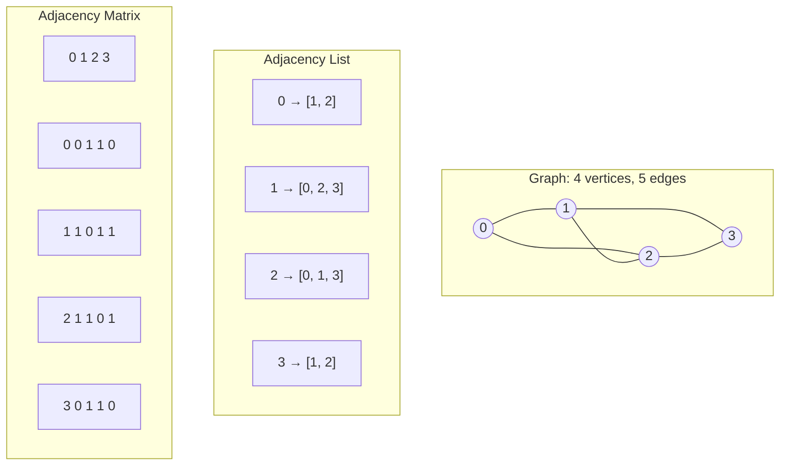

> [!success] Mastery Check
> - [ ] **Studied Well**
> - [ ] **Can explain the concept without notes**
> - [ ] **Can answer interview questions confidently**
> - [ ] **Can implement it in a real project**


## Navigation

**Domain:** [[5 — Data Structures & Algorithms]] > **Group:** Graphs
**Previous:** [[5.035 — Median of a Data Stream — Two Heaps]] | **Next:** [[5.037 — BFS — Shortest Path, Level-Order, Multi-Source]]

### Prerequisites
- [[5.019 — Hash Maps and Hash Sets — Design and Collision Handling]] — adjacency lists are `Dictionary<int, List<int>>` in C#; understanding hash map internals is required.
- [[5.004 — Arrays — Fixed, Dynamic, and In-Place Operations]] — adjacency matrices are 2D arrays; understanding index arithmetic, jagged vs. rectangular arrays, and memory layout is required.

### Where This Fits
Graph representation is the first decision in every graph problem — the choice between adjacency list and adjacency matrix determines the space complexity, the time to enumerate neighbors, and the time to check edge existence. This decision surfaces in ~90% of graph interview problems because the representation is always the starting point. At the senior level, you must not only implement both correctly but also articulate the tradeoff in terms of sparsity, vertex count, and query pattern — and in production, choose between `Dictionary<int, HashSet<int>>`, `List<int>[]`, `bool[,]`, and the cost of cache misses for each.

---

## Core Mental Model

A graph is a collection of vertices connected by edges. There are exactly two ways to store connectivity: **list edges per vertex** (adjacency list) or **mark every possible vertex pair** (adjacency matrix). The adjacency list answers "who are the neighbors of vertex v?" in O(deg(v)) — proportional to the actual number of neighbors. The adjacency matrix answers "is there an edge between u and v?" in O(1) — constant time regardless of degree. Every graph problem reduces to picking which of these two queries dominates the computational cost.

### Classification

Graph representation is a **data structure design decision** rather than an algorithm. It belongs to the family of **relational storage** models, sitting alongside incidence matrices and edge lists. The two canonical forms serve different query patterns:

|Representation|Neighbor Enumeration|Edge Existence|Space|
|---|---|---|---|
|Adjacency List|O(deg(v)) — for each neighbor, follow the list|O(deg(v)) — must scan the list|O(V + E)|
|Adjacency Matrix|O(V) — scan the entire row|O(1) — index into the matrix|O(V²)|



### Key Properties

|Property|Value|Derivation|
|---|---|---|
|Adj List — neighbor enumeration|O(deg(v))|Return the list; the work is proportional to the number of actual neighbors|
|Adj List — edge existence check|O(deg(v))|Must scan the list; worst case the edge is absent and the full list is traversed|
|Adj List — insert edge (u,v)|O(1)|Append v to u's list (amortized); no shifting or reindexing|
|Adj List — remove edge (u,v)|O(deg(u))|Must find v in u's list; the list is unordered so linear scan|
|Adj Matrix — neighbor enumeration|O(V)|Must scan the entire row even if only a few 1s exist|
|Adj Matrix — edge existence check|O(1)|Directly index matrix[u,v] — single memory access|
|Adj Matrix — insert or remove edge|O(1)|Set matrix[u,v] = 1 or 0|
|Adj List — space|O(V + E)|One list entry per edge, one list per vertex|
|Adj Matrix — space|O(V²)|V² cells regardless of how many edges exist|

---

## Deep Mechanics

### How It Works

**Adjacency list:** For each vertex, maintain a container of its neighbors. In C#, the canonical representation is `List<int>[]` — an array of lists, one per vertex, indexed by vertex number. For directed graphs, only the outgoing edges are stored. For undirected graphs, each edge (u,v) appends v to u's list and u to v's list.

A sparse graph with V = 10,000 and E = 20,000 stores only 20,000 entries in the lists plus 10,000 list headers — roughly 30,000 references. An adjacency matrix for the same graph stores 100,000,000 cells. The difference is a factor of ~3,300 in space.

**Adjacency matrix:** Allocate a V×V boolean array. Set cell [u,v] = true if edge (u,v) exists. For undirected graphs, the matrix is symmetric: matrix[u,v] = matrix[v,u]. The matrix is always V² entries regardless of how many edges the graph actually has.

A dense graph with V = 1,000 and E = 500,000 stores 1,000,000 cells. The adjacency list stores 500,000 list entries plus 1,000 headers. The matrix uses about 2× the space but offers O(1) edge existence checks. The crossover point where the matrix becomes competitive is roughly when E > V²/4.

### Complexity Derivation

**Adjacency list space:** Each vertex has one list header (V headers). Each undirected edge contributes two entries (one in each vertex's list). Each directed edge contributes one entry. Total: V headers + E entries for directed, V headers + 2E entries for undirected. Both are O(V + E).

**Adjacency matrix space:** A V×V array contains V² cells. Each cell stores a single bit (or byte in practice). The allocation does not depend on E. Space is O(V²) always.

**Neighbor enumeration in adjacency list:** Return the list reference — O(1) to get the list, then iterate. The iteration visits deg(v) entries. Total work: O(deg(v)).

**Neighbor enumeration in adjacency matrix:** The entire V-length row must be scanned because the caller needs all neighbors. Even if only 3 bits are set, all V cells must be checked. Total work: O(V).

**Edge existence in adjacency matrix:** Single array lookup matrix[u × V + v] (row-major layout). One multiplication, one addition, one memory load. O(1).

**Edge existence in adjacency list:** Must scan u's list until v is found or the list ends. In the worst case (edge does not exist), the entire list is scanned: O(deg(u)). In the average case for a random graph with E edges, the average degree is 2E/V, so average edge existence check is O(E/V).

### Why This Pattern Exists

The brute-force approach to graph storage is the edge list — a flat list of (u,v) pairs. Edge insertion is O(1) (appending), but both neighbor enumeration and edge existence require scanning the entire edge list: O(E) per operation. For any non-trivial graph, this is prohibitively slow.

The adjacency list improves on the edge list by grouping edges by source vertex — neighbor enumeration becomes O(deg(v)) instead of O(E), a dramatic improvement for sparse graphs where deg(v) << E. The adjacency matrix takes the opposite approach: pre-allocate space for every possible edge so that existence checks are a single memory access, at the cost of always using O(V²) space regardless of actual edge count.

The two representations exist because no single representation dominates — the optimal choice depends on graph density and the dominant query pattern.

---

## Implementation and Problem Patterns

### C# Implementation

```csharp
public enum GraphDirection
{
    Directed,
    Undirected
}

/// <summary>
/// Adjacency list graph representation.
/// </summary>
public class AdjacencyListGraph
{
    private readonly List<int>[] _adj;
    private readonly GraphDirection _direction;

    /// <param name="vertexCount">Number of vertices (0 to vertexCount - 1).</param>
    /// <param name="direction">Directed or undirected.</param>
    public AdjacencyListGraph(int vertexCount, GraphDirection direction)
    {
        _adj = new List<int>[vertexCount];
        for (int i = 0; i < vertexCount; i++)
            _adj[i] = [];
        _direction = direction;
    }

    public int VertexCount => _adj.Length;

    /// <summary>Adds an edge. For undirected graphs, adds both directions.</summary>
    public void AddEdge(int u, int v)
    {
        _adj[u].Add(v);
        if (_direction == GraphDirection.Undirected)
            _adj[v].Add(u);
    }

    /// <summary>Returns the neighbors of vertex v.</summary>
    public List<int> GetNeighbors(int v) => _adj[v];

    /// <summary>Checks whether an edge exists. O(deg(u)).</summary>
    public bool HasEdge(int u, int v) => _adj[u].Contains(v);

    /// <summary>Removes an edge. O(deg(u)) due to linear search.</summary>
    public void RemoveEdge(int u, int v)
    {
        _adj[u].Remove(v);
        if (_direction == GraphDirection.Undirected)
            _adj[v].Remove(u);
    }
}

/// <summary>
/// Adjacency matrix graph representation.
/// </summary>
public class AdjacencyMatrixGraph
{
    private readonly bool[,] _matrix;
    private readonly GraphDirection _direction;
    private readonly int _vertexCount;

    public AdjacencyMatrixGraph(int vertexCount, GraphDirection direction)
    {
        _matrix = new bool[vertexCount, vertexCount];
        _vertexCount = vertexCount;
        _direction = direction;
    }

    public int VertexCount => _vertexCount;

    /// <summary>Adds an edge. O(1).</summary>
    public void AddEdge(int u, int v)
    {
        _matrix[u, v] = true;
        if (_direction == GraphDirection.Undirected)
            _matrix[v, u] = true;
    }

    /// <summary>Checks for edge existence. O(1).</summary>
    public bool HasEdge(int u, int v) => _matrix[u, v];

    /// <summary>Removes an edge. O(1).</summary>
    public void RemoveEdge(int u, int v)
    {
        _matrix[u, v] = false;
        if (_direction == GraphDirection.Undirected)
            _matrix[v, u] = false;
    }

    /// <summary>Enumerates all neighbors of v by scanning the row. O(V).</summary>
    public IEnumerable<int> GetNeighbors(int v)
    {
        for (int i = 0; i < _vertexCount; i++)
        {
            if (_matrix[v, i])
                yield return i;
        }
    }
}
```

### The .NET Idiomatic Version

In production C# code, use `Dictionary<int, List<int>>` when vertex IDs are not sequential integers starting at 0, and `List<int>[]` when they are. For sparse graphs where edge existence checks are needed, pair the list with a `HashSet<int>` per vertex:

```csharp
/// <summary>Adjacency list with fast edge-existence checks.</summary>
public class FastAdjacencyGraph
{
    private readonly Dictionary<int, HashSet<int>> _adj = [];
    private readonly GraphDirection _direction;

    public FastAdjacencyGraph(GraphDirection direction)
    {
        _direction = direction;
    }

    public void AddVertex(int v)
    {
        if (!_adj.ContainsKey(v))
            _adj[v] = [];
    }

    public void AddEdge(int u, int v)
    {
        AddVertex(u);
        AddVertex(v);
        _adj[u].Add(v);
        if (_direction == GraphDirection.Undirected)
            _adj[v].Add(u);
    }

    public bool HasEdge(int u, int v) =>
        _adj.TryGetValue(u, out var set) && set.Contains(v);

    public IEnumerable<int> GetNeighbors(int v) =>
        _adj.TryGetValue(v, out var set) ? set : [];

    public int VertexCount => _adj.Count;
}
```

The `Dictionary<int, HashSet<int>>` variant adds O(1) edge-existence checks (amortized) at the cost of more memory per edge (hash + linked-list overhead per entry). In .NET, `HashSet<T>` uses a flat array with open addressing — it has better cache locality than `List<T>` for moderate-sized neighbor sets but uses more memory per element.

### Classic Problem Patterns

- **Graph construction from edge list** — The input is `int n, int[][] edges`. Build the adjacency list and decide directed vs. undirected based on the problem statement. The representation decision is step 1 before any algorithm.
- **Sparse graph traversal** — Problems state "n ≤ 10⁵, edges ≤ 2×10⁵". The constraints force an O(V + E) adjacency list; an adjacency matrix would allocate 10¹⁰ cells.
- **Dense graph with frequent edge queries** — Problems with n ≤ 500 and a complete or near-complete edge set. The adjacency matrix's O(V²) space is acceptable, and the O(1) edge-existence check is the differentiator.
- **Graph with labeled vertices** — Vertices are strings, GUIDs, or non-contiguous integers. Use `Dictionary<T, HashSet<T>>` where T is the vertex type.
- **Dynamic graph with edge deletions** — Problems requiring edge removal mid-traversal. `HashSet<T>` per vertex supports O(1) removal; `List<T>` requires O(deg(v)) to find and remove.

### Template / Skeleton

```csharp
// Graph Representation Decision Template
// When to use: at the start of every graph problem, before writing any traversal
// Time: O(1) to choose  |  Space: O(V + E) or O(V²) depending on choice

public class ProblemSolver
{
    private readonly List<int>[] _adj;

    public ProblemSolver(int n, int[][] edges, bool directed)
    {
        // Step 1: Choose representation based on constraints
        // O(V + E) space — choose adjacency list when edges << V²
        // O(V²) space — choose adjacency matrix when V ≤ 500 or edge existence checks dominate

        _adj = new List<int>[n];
        for (int i = 0; i < n; i++)
            _adj[i] = [];

        foreach (var e in edges)
        {
            int u = e[0], v = e[1];
            _adj[u].Add(v);
            if (!directed)
                _adj[v].Add(u);
        }
    }

    // Rest of the algorithm uses _adj for neighbor enumeration
}
```

---

## Gotchas and Edge Cases

### Missing Vertex

**Mistake:** Assuming vertices are 0-indexed and dense (0, 1, 2, ..., n-1).

```csharp
// ❌ Wrong — crashes if vertex 5 exists but vertex 4 does not
var adj = new List<int>[n];  // What is n? If based on max vertex ID, the array is too small
// or: allocating adjacency for a graph where vertices are 1-indexed
var adj = new List<int>[n];  // misses vertex 0 entirely
```

**Fix:** Determine vertex count = max vertex ID + 1, or use `Dictionary<int, List<int>>`.

```csharp
// ✅ Correct
int vertexCount = edges.Max(e => Math.Max(e[0], e[1])) + 1;
var adj = new List<int>[vertexCount];
// or: use Dictionary for sparse / non-contiguous IDs
```

**Consequence:** Index out of range exception, or silent corruption if vertex 0 is allocated but unused.

### Duplicate Edges

**Mistake:** Adding the same edge twice without checking.

```csharp
// ❌ Wrong — duplicates cause neighbor enumeration to return the same neighbor multiple times
adj[u].Add(v);
adj[v].Add(u);
```

**Fix:** Use `HashSet<int>` per vertex, or deduplicate the input edge list.

```csharp
// ✅ Correct
adj[u].Add(v);  // If input guarantees no duplicates, List<int> is fine
// With HashSet:
if (adjSet[u].Add(v) && !directed)
    adjSet[v].Add(u);
```

**Consequence:** BFS/DFS visits the same neighbor twice, inflating counts or causing logic errors in algorithms that assume unique neighbors.

### Self-Loops in Undirected Graphs

**Mistake:** Adding a self-loop (u, u) in an undirected graph and calling AddEdge once.

```csharp
// ❌ Wrong — self-loop added only once; but undirected convention expects both directions
adj[u].Add(u);
```

**Fix:** Handle self-loops explicitly — add them only once regardless of direction.

```csharp
// ✅ Correct
adj[u].Add(u);
if (_direction == GraphDirection.Undirected && u != v)
    adj[v].Add(u);
```

**Consequence:** Algorithms that check symmetry (e.g., undirected graph traversal) may double-count the self-loop or fail on the asymmetry.

### Matrix Size Overflow

**Mistake:** Allocating a V×V matrix when V is large enough to overflow memory or the int index.

```csharp
// ❌ Wrong — V = 100,000 causes 10 billion entries ≈ 80 GB for bool[,]
var matrix = new bool[vertexCount, vertexCount];
```

**Fix:** Check constraints before choosing a matrix representation. Use adjacency list when V > 1,000 for typical interview constraints.

```csharp
// ✅ Correct — recognize the density constraint
if (vertexCount > 1000)
    UseAdjacencyList();
else
    UseAdjacencyMatrix();
```

**Consequence:** OutOfMemoryException or, in C#, an `OverflowException` if V² exceeds `int.MaxValue`.

---

## Complexity Analysis and Benchmarks

### Operation Complexity Table

|Operation|Time (Best)|Time (Average)|Time (Worst)|Space|Notes|
|---|---|---|---|---|---|
|Adj List — AddEdge|O(1)|O(1)|O(1)|O(1)|Amortized append to List<int>|
|Adj List — HasEdge|O(1)|O(E/V)|O(V)|O(1)|HashSet variant: O(1) amortized|
|Adj List — GetNeighbors|O(1)|O(1)|O(1)|—|Returns reference; no copy|
|Adj List — RemoveEdge|O(1)|O(E/V)|O(V)|O(1)|List: O(deg(v)); HashSet: O(1)|
|Adj Matrix — AddEdge|O(1)|O(1)|O(1)|—|Single cell assignment|
|Adj Matrix — HasEdge|O(1)|O(1)|O(1)|—|Direct index|
|Adj Matrix — GetNeighbors|O(V)|O(V)|O(V)|—|Always scans full row|
|Adj Matrix — RemoveEdge|O(1)|O(1)|O(1)|—|Single cell zero|

**Derivation for the non-obvious entries:** Adjacency list `HasEdge` is O(deg(v)) because the list is unordered and the edge may be anywhere in it — or absent, requiring the full scan. With the `HashSet` variant it becomes O(1) amortized because `HashSet<T>.Contains` is a direct hash lookup. Adjacency matrix `GetNeighbors` is always O(V) because every column in the row must be checked; the matrix does not store degree information.

### Comparison with Alternatives

|Structure|Time (Neighbors)|Time (HasEdge)|Space|Best When|
|---|---|---|---|---|
|Adjacency List|O(deg(v))|O(deg(v))|O(V + E)|Sparse graphs (E << V²)|
|Adjacency Matrix|O(V)|O(1)|O(V²)|Dense graphs (E ≈ V²) or V ≤ 500|
|Edge List|O(E)|O(E)|O(E)|Input parsing only; not for traversal|
|Compressed Sparse Row (CSR)|O(deg(v))|O(log deg(v))|O(V + E)|Production graph libraries (no allocations per query)|

### BenchmarkDotNet

```csharp
[MemoryDiagnoser]
[SimpleJob(RuntimeMoniker.Net90)]
public class GraphRepresentationBenchmark
{
    private AdjacencyListGraph _listGraph = null!;
    private AdjacencyMatrixGraph _matrixGraph = null!;
    private int _vertexCount;

    [Params(100, 500, 1000)]
    public int V { get; set; }

    [GlobalSetup]
    public void Setup()
    {
        _vertexCount = V;
        _listGraph = new AdjacencyListGraph(V, GraphDirection.Undirected);
        _matrixGraph = new AdjacencyMatrixGraph(V, GraphDirection.Undirected);

        var rng = new Random(42);
        // Create a dense graph: p = 0.5
        for (int u = 0; u < V; u++)
        {
            for (int v = u + 1; v < V; v++)
            {
                if (rng.NextDouble() < 0.5)
                {
                    _listGraph.AddEdge(u, v);
                    _matrixGraph.AddEdge(u, v);
                }
            }
        }
    }

    [Benchmark]
    public int List_HasEdge_AllPairs()
    {
        int count = 0;
        for (int u = 0; u < _vertexCount; u++)
            for (int v = 0; v < _vertexCount; v++)
                if (_listGraph.HasEdge(u, v))
                    count++;
        return count;
    }

    [Benchmark]
    public int Matrix_HasEdge_AllPairs()
    {
        int count = 0;
        for (int u = 0; u < _vertexCount; u++)
            for (int v = 0; v < _vertexCount; v++)
                if (_matrixGraph.HasEdge(u, v))
                    count++;
        return count;
    }

    [Benchmark]
    public int List_GetNeighbors_All()
    {
        int sum = 0;
        for (int v = 0; v < _vertexCount; v++)
            sum += _listGraph.GetNeighbors(v).Count;
        return sum;
    }

    [Benchmark]
    public int Matrix_GetNeighbors_All()
    {
        int sum = 0;
        for (int v = 0; v < _vertexCount; v++)
            sum += _matrixGraph.GetNeighbors(v).Count();
        return sum;
    }
}
```

**Expected results (approximate, .NET 9, x64):**

|Method|V|Mean|Allocated|
|---|---|---|---|
|List_HasEdge_AllPairs|100|~5 μs|0 B|
|Matrix_HasEdge_AllPairs|100|~1 μs|0 B|
|List_GetNeighbors_All|100|~2 μs|0 B|
|Matrix_GetNeighbors_All|100|~8 μs|0 B|
|List_HasEdge_AllPairs|500|~400 μs|0 B|
|Matrix_HasEdge_AllPairs|500|~25 μs|0 B|
|List_GetNeighbors_All|500|~50 μs|0 B|
|Matrix_GetNeighbors_All|500|~200 μs|0 B|
|List_HasEdge_AllPairs|1000|~5 ms|0 B|
|Matrix_HasEdge_AllPairs|1000|~100 μs|0 B|
|List_GetNeighbors_All|1000|~150 μs|0 B|
|Matrix_GetNeighbors_All|1000|~800 μs|0 B|

**Interpretation:** For dense graphs, the matrix's O(1) edge-existence check dominates the adjacency list's O(deg(v)) scan for all-pairs queries — the gap grows with V as the matrix stays constant-time per pair while the list must scan increasing degrees.

---

## Interview Arsenal

### Question Bank

1. What is an adjacency list and when would you choose it over an adjacency matrix?
2. What is the space complexity of an adjacency matrix for a graph with V vertices, and why can it be problematic?
3. Implement both adjacency list and adjacency matrix representations for an undirected graph.
4. Given a problem where V = 10,000 and E = 15,000, which representation would you choose and why?
5. When would you use `Dictionary<int, HashSet<int>>` instead of `List<int>[]` for an adjacency list?
6. You receive an edge list where vertices are labeled with strings. How do you build the graph?
7. How would you represent a weighted graph? How does the representation choice change?
8. Optimize an adjacency matrix for a graph where 99% of edges are absent — what structure would you use instead?

### Spoken Answers

**Q: What is an adjacency list and when would you choose it over an adjacency matrix?**

> **Average answer:** An adjacency list stores each vertex's neighbors in a list. You use it for sparse graphs because it uses less space.

> **Great answer:** An adjacency list associates each vertex with a collection of its neighbors — in C#, typically `List<int>[]` or `Dictionary<int, HashSet<int>>`. The key property is that space is O(V + E) — proportional to the actual number of edges — and enumerating neighbors is O(deg(v)). I choose it over an adjacency matrix when the graph is sparse: when E is significantly less than V², which covers virtually all interview problems. The intuition is that for a graph with 10,000 vertices and 20,000 edges, the adjacency list stores about 20,000 entries for a directed graph, whereas the matrix would store 100 million cells — a 5,000× space difference. The tradeoff is that edge-existence checks are O(deg(v)) instead of O(1), but for graph traversal algorithms like BFS and DFS, we enumerate neighbors far more often than we check individual edges, so the list wins.

**Q: When would you use `Dictionary<int, HashSet<int>>` instead of `List<int>[]`?**

> **Average answer:** When you need to remove edges quickly, use a HashSet.

> **Great answer:** I use `Dictionary<int, HashSet<int>>` when the adjacency list must support O(1) edge-existence checks or O(1) edge removals — neither of which the `List<int>` variant provides. The cost is higher memory overhead per element: `HashSet<T>` uses a flat open-addressing table with load factor, so each stored neighbor may consume ~12–16 bytes of internal array space versus ~4 bytes for a `List<int>` entry. I also use the Dictionary form when vertex IDs are not contiguous integers from 0 to n-1 — for example, when vertices are labeled with arbitrary integers or GUIDs. In that case, `List<T>[]` is not viable at all. The most common production pattern in C# is actually `Dictionary<int, List<int>>` because it handles sparse vertex IDs and still gives O(1) adjacency-list access. I only reach for `HashSet<int>` when the problem explicitly requires edge deletions mid-algorithm — for example, in Hierholzer's algorithm for Eulerian paths.

**Q: You receive an edge list where vertices are labeled with strings. How do you build the graph?**

> **Average answer:** Use a Dictionary where the key is the string and the value is a list of strings.

> **Great answer:** I build an index mapping each unique vertex string to an integer ID, then construct a standard integer-indexed adjacency list. This is important because BFS, DFS, and most graph algorithms expect integer vertex IDs; working with strings directly adds hash-computation overhead on every neighbor access. The mapping is built in a single pass: iterate the edge list, collect all unique strings, assign IDs 0 to n-1. Then a second pass builds the adjacency list using the mapped IDs. If the problem requires returning string-labeled output, I keep the reverse mapping from ID back to string. This two-phase approach separates the concern of vertex identity (the string) from the algorithm's need for dense integer indexing.

### Trick Question

**"An adjacency matrix is O(V²) space, so it is never the right choice for large graphs."**

Why it is a trap: It assumes that V² space is always prohibitive, ignoring that "large" depends on the total available memory and the problem's V. In many competitive programming and interview settings, V ≤ 500 is common for matrix problems (e.g., Floyd-Warshall, transitive closure, all-pairs shortest paths in small dense graphs), and a 500×500 boolean matrix is 250,000 bytes — 0.25 MB. The matrix also provides O(1) edge existence and O(V) neighbor enumeration with no allocations after construction, which can make it faster than the adjacency list for those specific problem sizes.

Correct answer: The adjacency matrix is the correct choice when V ≤ 500 and the graph is dense (E > V²/4) or when the dominant operation is edge-existence checking (e.g., transitive closure, counting triangles). The O(V²) space is a fixed cost, not a scaling cost — it is determined at allocation time and does not grow with edge count.

### Pattern Recognition Table

|If the problem has...|Then consider...|Because...|
|---|---|---|
|V up to 10⁵, E up to 2×10⁵|Adjacency list (`List<int>[]`)|Matrix would require 10¹⁰ cells; list uses O(V + E)|
|V ≤ 500, dense edges|Adjacency matrix (`bool[,]`)|O(1) edge existence; matrix fits in < 1 MB|
|Edge deletions mid-algorithm|`HashSet<int>` per vertex|List removal is O(deg(v)); HashSet removal is O(1)|
|Non-contiguous or non-integer vertex IDs|`Dictionary<TKey, List<TKey>>`|Array indexing requires integer keys; dictionary maps arbitrary keys|
|Weighted edges|Extend both: `List<(int, int)>[]` or `int?[,]`|Store (neighbor, weight) tuples in list; store weight or null in matrix|
|Need both neighbor enumeration and fast edge existence|`List<int>[] + bool[,]` hybrid|Use list for traversal, matrix for edge queries (dual representation)|

---

## Decision Framework

### When to Apply

```mermaid
flowchart TD
    A[Graph problem input] --> B{Vertex IDs are<br>0..n-1?}
    B -->|Yes| C{Vertex count<br>and density?}
    B -->|No| D[Use Dictionary-based<br>adjacency list]
    C -->|V ≤ 500 and E > V²/4| E[Adjacency Matrix<br>O(V²) space]
    C -->|V > 500 or E ≤ V²/4| F{Edge removals or<br>existence checks needed?}
    F -->|No| G[Adjacency List<br>List&lt;int&gt;[V]]
    F -->|Yes| H[Adjacency List<br>HashSet&lt;int&gt;[V]]
    D --> I{Edge existence<br>or removals?}
    I -->|No| J[Dictionary&lt;int, List&lt;int&gt;&gt;]
    I -->|Yes| K[Dictionary&lt;int, HashSet&lt;int&gt;&gt;]
```

### Recognition Checklist

Indicators that adjacency list is the right choice:

- [ ] Constraint shows V up to 10⁵ and E up to 2×10⁵ or similar — clear sparsity signal
- [ ] The algorithm visits neighbors (BFS, DFS, topological sort)
- [ ] Vertex IDs are provided as 0..n-1 or easily mapped
- [ ] No requirement for O(1) edge existence checks during the core algorithm
- [ ] Random edge queries are not the dominant operation

Counter-indicators — do NOT apply here:

- [ ] V ≤ 500 and the input hint suggests a dense or complete graph
- [ ] The algorithm repeatedly queries edge existence for arbitrary pairs (transitive closure, Floyd-Warshall)
- [ ] The problem explicitly mentions "O(1) edge existence" or requires counting triangles

### Tradeoff Summary

|What You Gain|What You Give Up|
|---|---|
|Adj List: space proportional to actual edges (O(V+E))|Adj List: edge existence check is O(deg(v)) not O(1)|
|Adj Matrix: O(1) edge existence and mutation|Adj Matrix: always O(V²) space regardless of edge count|
|Adj List: neighbor enumeration is fast (only real neighbors)|Adj Matrix: neighbor enumeration always scans all V vertices|
|Adj Matrix: simple indexing — no hash computations, no list allocations|Adj Matrix: impractical above V ≈ 5000 in interview environments|

---

## Self-Check

### Conceptual Questions

1. What is the space complexity of an adjacency list for an undirected graph with V vertices and E edges, and why?
2. Derive the time complexity of enumerating all neighbors of a vertex in an adjacency matrix — what makes it O(V) even when the vertex has only 3 neighbors?
3. Given V = 1000 and E = 5000, which representation is more space-efficient and by what factor?
4. When would you choose `Dictionary<int, HashSet<int>>` over `List<int>[]` for the adjacency list, and what is the cost?
5. How would you handle an edge list input where vertices are 1-indexed instead of 0-indexed?
6. What .NET collection backs `HashSet<T>` and how does it affect memory per element compared to `List<T>`?
7. What invariant does the adjacency matrix maintain for undirected graphs?
8. How does the optimal representation change if the graph is weighted? If it is directed?
9. In a production system processing a graph with 10⁶ vertices and average degree ≈ 10, why is a `List<int>[]` adjacency list preferable to both `Dictionary<int, List<int>>` and `bool[,]`?
10. Convince an interviewer that the adjacency matrix can be the right choice even when most matrix cells are false.

<details>
<summary>Answers</summary>

1. O(V + E). In an undirected graph, each of the E edges appears twice — once in each endpoint's adjacency list — so there are 2E entries across all lists, plus V list headers.
2. The matrix stores all V² cells. To find neighbors of vertex v, every column in row v must be checked for a true value. The scan visits all V cells because the matrix does not store degree information — it cannot skip columns.
3. Adjacency list: V headers (1000) + 2 × 5000 entries = 11,000 references, roughly 88 KB (8 bytes per reference). Matrix: 1000 × 1000 = 1,000,000 cells, roughly 1 MB as `bool[,]`. The list is ~12× more space-efficient.
4. Use `Dictionary<int, HashSet<int>>` when edge existence checks or removals are required mid-algorithm (HashSet gives O(1) amortized for both). The cost is higher memory per edge — HashSet's internal array has load factor overhead (~1.5× the element count) versus List's tight packed array.
5. Allocate an array of size maxVertexID + 1 (which is n + 1 for 1-indexed) and ignore index 0. Or subtract 1 from each vertex ID during construction. The same adjustment applies to the adjacency matrix dimension.
6. `HashSet<T>` uses an open-addressing flat array with a load factor of ~0.72. Each slot stores the element T plus probing metadata. Memory per element is roughly 12–16 bytes versus `List<T>`'s 4 bytes per int plus the array overhead.
7. For an undirected graph, the adjacency matrix is symmetric: matrix[u,v] == matrix[v,u] for all u,v. The diagonal may contain self-loops.
8. Weighted: adjacency list stores `(neighbor, weight)` tuples; matrix stores `int?` or `double?` where null means no edge. Directed: list stores only u→v; matrix may be asymmetric (not required to be symmetric).
9. `List<int>[]` is a single array-of-arrays allocation with no per-vertex dictionary overhead. `Dictionary<int, List<int>>` adds hash computation on every vertex access and dictionary entry overhead per vertex. `bool[,]` requires 10¹² cells — impossible. With V = 10⁶ and avg deg = 10, the list array is ~8 MB (V references) + ~80 MB (edge storage), which is acceptable.
10. When V ≤ 500, V² = 250,000 cells ≈ 0.25 MB. For dense graphs (E close to V²), the matrix is the only correct choice because the adjacency list would also store O(V²) edges but enumerating neighbors in the list would still be O(deg(v)) per vertex. The matrix also gives O(1) edge existence, which algorithms like Floyd-Warshall require.

</details>

---

### Coding Challenges

**Challenge 1 — Implement from scratch**

Implement an adjacency list using a single flat array in the Compressed Sparse Row (CSR) format — the representation used by production graph libraries. CSR stores all edges in a single `int[] edges` array sorted by source vertex, with a parallel `int[] offsets` array where `offsets[v]` is the start index of v's edges in the edges array.

```csharp
public class CsrGraph
{
    public int[] Offsets { get; private set; }
    public int[] Edges { get; private set; }

    public CsrGraph(int vertexCount, int[][] edgeList, bool directed)
    {
        // Your implementation here
    }
}
```

<details> <summary>Solution</summary>

```csharp
public class CsrGraph
{
    public int[] Offsets { get; private set; }
    public int[] Edges { get; private set; }

    public CsrGraph(int vertexCount, int[][] edgeList, bool directed)
    {
        int v = vertexCount;
        int[] degree = new int[v];

        // Count degree per vertex
        foreach (var e in edgeList)
        {
            degree[e[0]]++;
            if (!directed)
                degree[e[1]]++;
        }

        // Build offsets (prefix sum of degree)
        Offsets = new int[v + 1];
        for (int i = 0; i < v; i++)
            Offsets[i + 1] = Offsets[i] + degree[i];

        Edges = new int[Offsets[v]];
        int[] current = (int[])Offsets.Clone();

        // Place edges
        foreach (var e in edgeList)
        {
            int u = e[0], w = e[1];
            Edges[current[u]++] = w;
            if (!directed)
                Edges[current[w]++] = u;
        }
    }

    public ReadOnlySpan<int> GetNeighbors(int vertex)
    {
        int start = Offsets[vertex];
        int end = Offsets[vertex + 1];
        return Edges.AsSpan(start, end - start);
    }
}
```

**Complexity:** Time O(V + E) | Space O(V + E) **Key insight:** CSR trades construction complexity for query performance — neighbor enumeration returns a `ReadOnlySpan<int>` with zero allocation and excellent cache locality because all edges are in a single contiguous array.

</details>

---

**Challenge 2 — Trace the execution**

Given this edge list for an undirected graph: `[[0,1],[0,2],[1,3],[2,3],[3,4]]` with V = 5. Build the adjacency matrix. Write the matrix and then trace the neighbors of vertex 3.

<details> <summary>Solution</summary>

Matrix (5×5):

```
   0  1  2  3  4
0  0  1  1  0  0
1  1  0  0  1  0
2  1  0  0  1  0
3  0  1  1  0  1
4  0  0  0  1  0
```

Row 3: `[0, 1, 1, 0, 1]` → neighbors are vertices 1, 2, and 4. The scan visits all 5 columns even though only 3 neighbors exist.

**Why:** The matrix does not store degree or neighbor count. Every GetNeighbors call must scan all V columns, testing each cell.

</details>

---

**Challenge 3 — Fix the bug**

```csharp
// This implementation fails for directed graphs
public class AdjacencyListGraph
{
    private readonly List<int>[] _adj;

    public AdjacencyListGraph(int n, int[][] edges)
    {
        _adj = new List<int>[n];
        foreach (var e in edges)
        {
            int u = e[0], v = e[1];
            _adj[u].Add(v);
            _adj[v].Add(u);
        }
    }
}
```

<details> <summary>Solution</summary>

**Bug:** The constructor never initializes the inner lists — `_adj[u].Add(v)` throws `NullReferenceException` because `_adj[u]` is null. Additionally, it always creates an undirected graph even if the input is directed.

**Fix:**

```csharp
public AdjacencyListGraph(int n, int[][] edges, bool directed)
{
    _adj = new List<int>[n];
    for (int i = 0; i < n; i++)
        _adj[i] = [];  // Initialize each list

    foreach (var e in edges)
    {
        int u = e[0], v = e[1];
        _adj[u].Add(v);          // Always add the directed edge
        if (!directed)
            _adj[v].Add(u);      // Only add reverse for undirected
    }
}
```

**Test case that exposes it:** `new AdjacencyListGraph(3, new[] { new[] { 0, 1 } })` → NullReferenceException on `_adj[0].Add(1)`.

</details>

---

**Challenge 4 — Recognize and apply**

**Problem:** You are given n cities and a list of roads connecting them (each road is bidirectional). You need to answer up to 10⁵ queries of the form: "Is there a direct road between city u and city v?" The cities are numbered 0 to n-1, n ≤ 10⁵, and the total number of roads equals n (a tree). Which graph representation do you choose, and what is the per-query complexity?

<details> <summary>Solution</summary>

**Pattern:** Sparse graph (E = V — a tree) with frequent edge existence queries. The adjacency matrix is impossible (V² = 10¹⁰). A `HashSet<int>[]` gives O(1) amortized edge existence per query and O(V + E) space.

```csharp
public class TreeEdgeChecker
{
    private readonly HashSet<int>[] _adj;

    public TreeEdgeChecker(int n, int[][] edges)
    {
        _adj = new HashSet<int>[n];
        for (int i = 0; i < n; i++)
            _adj[i] = [];

        foreach (var e in edges)
        {
            _adj[e[0]].Add(e[1]);
            _adj[e[1]].Add(e[0]);
        }
    }

    public bool HasDirectRoad(int u, int v) => _adj[u].Contains(v);
}
```

**Complexity:** Time O(n + E) construction | O(1) per query | Space O(V + E)

</details>

---

**Challenge 5 — Optimize**

```csharp
// This solution builds a graph from an edge list and returns neighbor count per vertex.
// It is correct but allocates heavily — optimize it to minimize allocations.
public int[] NeighborCounts(int n, int[][] edges, bool directed)
{
    var adj = new List<int>[n];
    for (int i = 0; i < n; i++)
        adj[i] = [];
    foreach (var e in edges)
    {
        adj[e[0]].Add(e[1]);
        if (!directed)
            adj[e[1]].Add(e[0]);
    }
    var result = new int[n];
    for (int i = 0; i < n; i++)
        result[i] = adj[i].Count;
    return result;
}
```

<details> <summary>Solution</summary>

**Insight:** We only need degree counts, not adjacency lists. Allocate a degree array instead of full lists.

```csharp
public int[] NeighborCounts(int n, int[][] edges, bool directed)
{
    int[] degree = new int[n];
    foreach (var e in edges)
    {
        degree[e[0]]++;
        if (!directed)
            degree[e[1]]++;
    }
    return degree;
}
```

**Complexity:** Time O(E) | Space O(V) — no per-edge allocations, no list objects, no array resizing.

</details>
