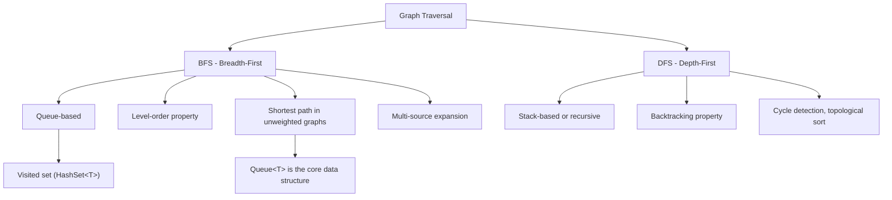
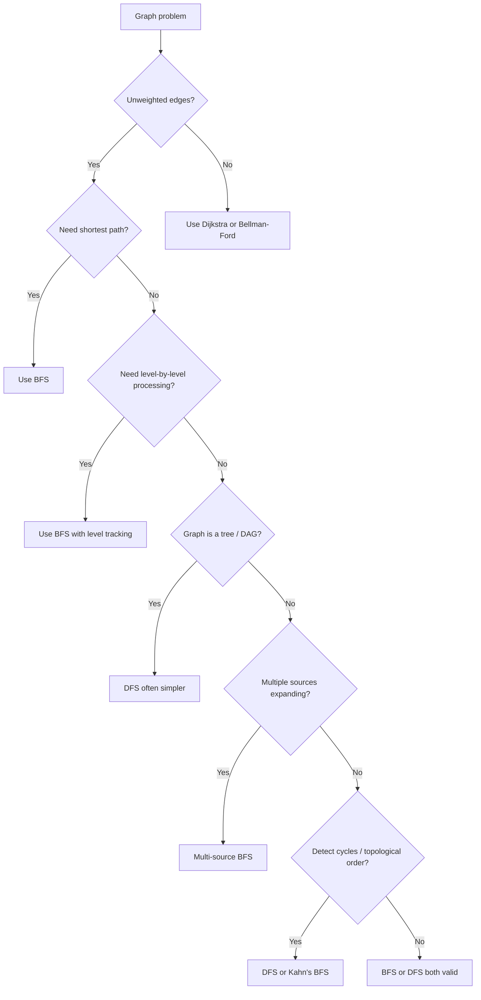

> [!success] Mastery Check
> - [ ] **Studied Well**
> - [ ] **Can explain the concept without notes**
> - [ ] **Can answer interview questions confidently**
> - [ ] **Can implement it in a real project**


## Navigation

**Domain:** [[5 — Data Structures & Algorithms]] > **Group:** Graphs
**Previous:** [[5.031 — Min-Heap and Max-Heap — Structure and Heapify]] | **Next:** [[5.038 — DFS — Cycle Detection, Connected Components, Islands]]

### Prerequisites
- [[5.016 — Queue — FIFO Applications]] — BFS uses a queue as its core data structure; the FIFO property guarantees level-by-level processing.
- [[5.036 — Graph Representation — Adjacency List and Matrix]] — BFS operates on a graph; the adjacency list representation determines how neighbors are enumerated.

### Where This Fits
BFS is the fundamental algorithm for exploring a graph level by level — meaning it visits all nodes at distance k before any node at distance k+1. This level-order property makes BFS the canonical algorithm for shortest path in unweighted graphs (each edge counts as 1), serializing a tree level by level, and solving multi-source problems where multiple starting points expand simultaneously. It appears in ~20% of graph interview problems — from simple "clone graph" to "walls and gates" to "word ladder." A senior candidate must be able to write the BFS skeleton from memory, adapt it for visited-state tracking, and recognize when the level-order property is the differentiator between BFS and DFS.

---

## Core Mental Model

BFS processes nodes in order of their distance from the source — all nodes at distance 0 (the source itself), then distance 1 (neighbors of the source), then distance 2, and so on. The queue enforces this order: when a node is discovered, it is enqueued; when dequeued, its undiscovered neighbors are enqueued. The critical invariant is that the queue never contains nodes at more than two consecutive distance levels at any moment — that is what guarantees the shortest-path property.

### Classification

BFS is a graph traversal algorithm in the **Breadth-First** paradigm. It solves:
- **Reachability** — can you reach node B from node A?
- **Shortest path (unweighted)** — what is the minimum number of edges from A to B?
- **Connected components** — which nodes belong to the same component?
- **Level-order** — what are the nodes at each depth?

It contrasts with DFS (depth-first), which exhausts one branch before backtracking.



### Key Properties

|Property|Value|Derivation|
|---|---|---|
|Visit all reachable nodes|O(V + E)|Each vertex enqueued at most once; each edge examined once when its source is dequeued|
|Shortest path (unweighted)|O(V + E)|First time a node is discovered is via the shortest path — queue FIFO guarantees this|
|Level-order traversal|O(V + E)|Processing of all nodes at distance k completes before any at distance k+1 begins|
|Space (visited + queue)|O(V)|Queue holds at most V nodes; visited set requires V entries in the worst case|
|Multi-source BFS|O(V + E)|Same as standard BFS — initial queue contains multiple source nodes|

---

## Deep Mechanics

### How It Works

Given a graph represented as an adjacency list `Dictionary<int, List<int>>` and a starting node `source`:

1. Initialize a `Queue<int>` with the source node.
2. Initialize a `HashSet<int>` visited containing the source node.
3. While the queue is not empty:
   a. Dequeue the front node — this is the current node.
   b. Process the node (record distance, check target, etc.).
   c. For each neighbor of the current node in the adjacency list:
      - If the neighbor has not been visited, mark it visited and enqueue it.

**Why it finds shortest paths:** When a node is first discovered (visited and enqueued), the number of edges traversed to reach it is minimal. This holds because the queue processes nodes in FIFO order — all nodes at distance k are dequeued before any node at distance k+1. The first time a node is visited, it is reached via a path of minimal length.

**Multi-source variant:** Instead of initializing the queue with a single source, initialize it with all source nodes. Each source is at distance 0 from itself. The BFS then expands outward from all sources simultaneously — the first source to reach an unvisited node claims the shortest distance from that node to any source.

**Level-order tracking:** To know when a level ends (e.g., for tree level-order or for distance tracking), record the queue size before processing each level. Dequeue exactly that many nodes — they all belong to the current level. After draining them, the next level's nodes are in the queue.

### Complexity Derivation

**Time:** Each vertex is enqueued and dequeued exactly once — O(V). For each dequeued vertex, all its edges are examined. Summing over all vertices, each edge is examined twice (once from each endpoint in an undirected graph, once from the source in a directed graph) — O(E). Total: O(V + E).

**Space:** The visited set stores one entry per vertex — O(V). The queue in the worst case holds the entire breadth of the graph — for a complete binary tree, the queue holds at most the widest level (up to V/2 nodes). Upper bound: O(V). Total: O(V).

### .NET Runtime Notes

- **`Queue<T>`:** BFS uses `Queue<T>` from `System.Collections.Generic`. Enqueue is O(1) amortized; Dequeue is O(1). The internal implementation uses a circular buffer — it resizes when full (doubles the capacity).
- **`HashSet<T>`:** The visited set is best implemented as `HashSet<T>`. Add and Contains are O(1) average. For integer vertices, a `bool[]` array is faster and more cache-friendly when the vertex count is known in advance and vertices are 0-indexed contiguous integers.
- **No built-in BFS:** .NET does not provide a BFS API. You implement it manually — which is the interview expectation.
- **Concurrent scenarios:** For producer-consumer BFS (e.g., web crawler), use `ConcurrentQueue<T>` from `System.Collections.Concurrent`. The pattern is: enqueue discovered URLs from multiple producer threads, dequeue and process from consumer threads.

---

## Implementation and Problem Patterns

### C# Implementation

```csharp
/// <summary>
/// Standard BFS on an adjacency-list graph.
/// Returns all nodes reachable from source in BFS order.
/// </summary>
public static List<int> Bfs(Dictionary<int, List<int>> graph, int source)
{
    var visited = new HashSet<int> { source };
    var queue = new Queue<int>();
    queue.Enqueue(source);
    var result = new List<int>();

    while (queue.TryDequeue(out int node))
    {
        result.Add(node);

        if (!graph.TryGetValue(node, out var neighbors)) continue;

        foreach (int neighbor in neighbors)
        {
            if (visited.Add(neighbor))
                queue.Enqueue(neighbor);
        }
    }

    return result;
}

/// <summary>
/// BFS returning shortest distances from source to all reachable nodes.
/// Unreachable nodes have distance -1.
/// </summary>
public static Dictionary<int, int> ShortestDistances(
    Dictionary<int, List<int>> graph, int source)
{
    var dist = new Dictionary<int, int>();
    foreach (int v in graph.Keys) dist[v] = -1;
    dist[source] = 0;

    var queue = new Queue<int>();
    queue.Enqueue(source);

    while (queue.TryDequeue(out int node))
    {
        if (!graph.TryGetValue(node, out var neighbors)) continue;

        foreach (int neighbor in neighbors)
        {
            if (dist[neighbor] == -1)
            {
                dist[neighbor] = dist[node] + 1;
                queue.Enqueue(neighbor);
            }
        }
    }

    return dist;
}

/// <summary>
/// Multi-source BFS — finds distance from the nearest source node to all others.
/// </summary>
public static Dictionary<int, int> MultiSourceBfs(
    Dictionary<int, List<int>> graph, HashSet<int> sources)
{
    var dist = new Dictionary<int, int>();
    var queue = new Queue<int>();

    foreach (int s in sources)
    {
        dist[s] = 0;
        queue.Enqueue(s);
    }

    while (queue.TryDequeue(out int node))
    {
        if (!graph.TryGetValue(node, out var neighbors)) continue;

        foreach (int neighbor in neighbors)
        {
            if (!dist.ContainsKey(neighbor))
            {
                dist[neighbor] = dist[node] + 1;
                queue.Enqueue(neighbor);
            }
        }
    }

    return dist;
}

/// <summary>
/// Level-order BFS — returns nodes grouped by their distance from source.
/// </summary>
public static List<List<int>> LevelOrder(
    Dictionary<int, List<int>> graph, int source)
{
    var result = new List<List<int>>();
    var visited = new HashSet<int> { source };
    var queue = new Queue<int>();
    queue.Enqueue(source);

    while (queue.Count > 0)
    {
        int levelSize = queue.Count;
        var level = new List<int>(levelSize);

        for (int i = 0; i < levelSize; i++)
        {
            int node = queue.Dequeue();
            level.Add(node);

            if (!graph.TryGetValue(node, out var neighbors)) continue;

            foreach (int neighbor in neighbors)
            {
                if (visited.Add(neighbor))
                    queue.Enqueue(neighbor);
            }
        }

        result.Add(level);
    }

    return result;
}
```

### The .NET Idiomatic Version

```csharp
public static class BfsIdiomatic
{
    // For integer vertices with known count, bool[] is faster than HashSet<int>:
    public static List<int> BfsBoolArray(Dictionary<int, List<int>> graph,
        int source, int vertexCount)
    {
        var visited = new bool[vertexCount];
        visited[source] = true;
        var queue = new Queue<int>();
        queue.Enqueue(source);
        var result = new List<int>();

        while (queue.TryDequeue(out int node))
        {
            result.Add(node);
            if (!graph.TryGetValue(node, out var neighbors)) continue;
            foreach (int neighbor in neighbors)
            {
                if (!visited[neighbor])
                {
                    visited[neighbor] = true;
                    queue.Enqueue(neighbor);
                }
            }
        }

        return result;
    }

    // For multi-dimensional grids (matrix BFS), use direction arrays:
    private static readonly (int dr, int dc)[] Dirs =
        [(1, 0), (-1, 0), (0, 1), (0, -1)];

    public static int[,] DistancesInGrid(int[][] grid,
        List<(int r, int c)> sources)
    {
        int rows = grid.Length, cols = grid[0].Length;
        var dist = new int[rows, cols];
        for (int r = 0; r < rows; r++)
            for (int c = 0; c < cols; c++)
                dist[r, c] = -1;

        var queue = new Queue<(int, int)>();
        foreach (var (sr, sc) in sources)
        {
            dist[sr, sc] = 0;
            queue.Enqueue((sr, sc));
        }

        while (queue.TryDequeue(out (int r, int c) cell))
        {
            foreach (var (dr, dc) in Dirs)
            {
                int nr = cell.r + dr, nc = cell.c + dc;
                if (nr < 0 || nr >= rows || nc < 0 || nc >= cols) continue;
                if (grid[nr][nc] == 0 || dist[nr, nc] != -1) continue; // 0 = obstacle
                dist[nr, nc] = dist[cell.r, cell.c] + 1;
                queue.Enqueue((nr, nc));
            }
        }

        return dist;
    }
}
```

### Classic Problem Patterns

1. **Shortest path in an unweighted graph** — Find the minimum number of edges from node A to node B. BFS guarantees the first time B is discovered is via the shortest path. Key insight: BFS on unweighted graphs is equivalent to Dijkstra's where all edge weights are 1.
2. **Level-order tree traversal** — Return nodes of a binary tree grouped by depth. BFS with level-size tracking (record queue count before processing each level). Key insight: the queue's contents at any point span at most two consecutive levels.
3. **Multi-source expansion — Walls and Gates** — Given a 2D grid with gates (sources), walls (blockers), and empty rooms, fill each room with the distance to the nearest gate. Key insight: enqueue all gates simultaneously to start BFS from all sources at once.
4. **Word ladder** — Given a start word, end word, and dictionary, find the shortest transformation sequence changing one letter at a time. Key insight: each word is a node; words differing by one letter has an edge; BFS finds shortest path in the implicit graph.
5. **Clone graph** — Deep copy of a graph with all connections. Key insight: BFS traverses the original graph; a dictionary maps original nodes to cloned nodes so edges can be reconstructed without duplication.
6. **Bipartite graph detection** — Assign nodes to one of two colors such that every edge connects opposite colors. Key insight: BFS with two-color labeling — if a neighbor already has the same color as the current node, the graph is not bipartite.

### Template / Skeleton

```csharp
// BFS Template (shortest path / level-order / multi-source)
// When to use: graph/tree where you need shortest path (unweighted)
//              or level-by-level processing
// Time: O(V + E) | Space: O(V)

public static ReturnType BfsTemplate(GraphType graph, SourceType source)
{
    // TODO: choose visited structure — HashSet<T> or bool[] for integer vertices
    var visited = new HashSet<T>();
    visited.Add(source);

    var queue = new Queue<T>();
    queue.Enqueue(source);

    // TODO: initialize distance map, parent map, or result list as needed

    while (queue.Count > 0)
    {
        // For level-order: int levelSize = queue.Count; then loop levelSize times
        T node = queue.Dequeue();

        // TODO: process node — check target, record distance, add to result

        // TODO: get neighbors from graph adjacency or implicit structure (grid dirs)
        foreach (T neighbor in GetNeighbors(node))
        {
            if (visited.Add(neighbor)) // Add returns true if not already present
            {
                // TODO: set dist[neighbor] = dist[node] + 1 for shortest path
                queue.Enqueue(neighbor);
            }
        }
    }

    // TODO: return result, distance map, or boolean
}
```

---

## Gotchas and Edge Cases

### Not Visiting the Source

**Mistake:** Forgetting to mark the source as visited before the loop, causing the source to be enqueued and processed again via a cycle back to it.

```csharp
// ❌ Wrong — source not marked visited; if graph has an edge back to source, it re-enqueues
var visited = new HashSet<int>();
var queue = new Queue<int>();
queue.Enqueue(source);
```

**Fix:** Always mark the source visited before the first dequeue.

```csharp
// ✅ Correct — source is visited before the loop
var visited = new HashSet<int> { source };
queue.Enqueue(source);
```

**Consequence:** Infinite loop if the graph contains a cycle back to the source — the source gets re-processed on every cycle.

### Using a Stack Instead of a Queue

**Mistake:** Using `Stack<T>` (or `List<T>` with `Last` and `RemoveAt`) instead of `Queue<T>`, which turns BFS into DFS and loses the shortest-path guarantee.

```csharp
// ❌ Wrong — Stack<T> makes this DFS, not BFS
var stack = new Stack<int>();
stack.Push(source);
while (stack.TryPop(out int node)) { /* ... */ }
```

**Fix:** Use `Queue<T>` — the FIFO order is the entire mechanism.

```csharp
// ✅ Correct — Queue<T> enforces level-order
var queue = new Queue<int>();
queue.Enqueue(source);
```

**Consequence:** The algorithm no longer finds the shortest path — it becomes DFS that happens to use an explicit stack instead of recursion.

### Forgetting to Check Graph.ContainsKey(node)

**Mistake:** Iterating neighbors of a node that has no entry in the adjacency list.

```csharp
// ❌ Wrong — KeyNotFoundException if node is not in the dictionary
foreach (int neighbor in graph[node]) { /* ... */ }
```

**Fix:** Use `TryGetValue` or check `ContainsKey` before iterating neighbors.

```csharp
// ✅ Correct — handles nodes with no outgoing edges
if (graph.TryGetValue(node, out var neighbors))
{
    foreach (int neighbor in neighbors) { /* ... */ }
}
```

**Consequence:** `KeyNotFoundException` at runtime — the algorithm crashes on leaf nodes or nodes with no outgoing edges.

### Not Accounting for Disconnected Components

**Mistake:** Assuming BFS from a single source reaches all vertices in the graph.

```csharp
// ❌ Wrong — only nodes reachable from source are discovered
var result = Bfs(graph, source); // returns [source, ...reachable...]
```

**Fix:** Run BFS from every unvisited vertex when the graph may be disconnected.

```csharp
// ✅ Correct — BFS loop over all vertices covers disconnected components
var visited = new HashSet<int>();
var components = new List<List<int>>();
foreach (int v in graph.Keys)
{
    if (visited.Add(v))
    {
        var component = BfsFrom(graph, v, visited);
        components.Add(component);
    }
}
```

**Consequence:** In connected-components counting or bipartite checking, missing disconnected regions gives a wrong answer.

---

## Complexity Analysis and Benchmarks

### Operation Complexity Table

|Operation|Time (Best)|Time (Average)|Time (Worst)|Space|Notes|
|---|---|---|---|---|---|
|Single-source BFS|O(V + E)|O(V + E)|O(V + E)|O(V)|Every vertex and edge visited exactly once|
|Shortest path (unweighted)|O(V + E)|O(V + E)|O(V + E)|O(V)|Same as BFS — distance is tracked during the traversal|
|Multi-source BFS|O(V + E)|O(V + E)|O(V + E)|O(V)|Same complexity — just a larger initial queue|
|Level-order traversal|O(V + E)|O(V + E)|O(V + E)|O(V + queue width)|Queue holds at most the widest level|
|Bipartite detection|O(V + E)|O(V + E)|O(V + E)|O(V)|Color array of size V + standard BFS|

**Derivation for the non-obvious entries:** All BFS variants visit every vertex exactly once and examine each edge exactly once (when the source vertex is dequeued). The visited set prevents re-queuing. No variant changes this fundamental bound — they only differ in how initialization (single vs. multiple sources) or result collection (levels vs. flat order) is handled.

### Comparison with Alternatives

|Algorithm|Time|Space|Best When|
|---|---|---|---|
|BFS|O(V + E)|O(V)|Unweighted graph, need shortest path, level-order property required|
|DFS|O(V + E)|O(V) worst-case (call stack)|Need cycle detection, topological sort, connected components in a tree, or limited memory for queue|
|Dijkstra|O((V + E) log V)|O(V)|Weighted graph with non-negative weights — generalizes BFS|
|Bellman-Ford|O(V × E)|O(V)|Graph with negative weights — detects negative cycles|

### BenchmarkDotNet

```csharp
[MemoryDiagnoser]
[SimpleJob(RuntimeMoniker.Net90)]
public class BfsBenchmark
{
    private Dictionary<int, List<int>> _chain = null!;
    private Dictionary<int, List<int>> _complete = null!;

    [Params(1_000, 10_000)]
    public int V { get; set; }

    [GlobalSetup]
    public void Setup()
    {
        _chain = new Dictionary<int, List<int>>();
        _complete = new Dictionary<int, List<int>>();
        for (int i = 0; i < V; i++)
        {
            _chain[i] = i < V - 1 ? [i + 1] : [];
            _complete[i] = Enumerable.Range(0, V).Where(x => x != i).ToList();
        }
    }

    [Benchmark(Baseline = true)]
    public List<int> BfsChain() => Bfs(_chain, 0);

    [Benchmark]
    public List<int> BfsComplete() => Bfs(_complete, 0);

    private static List<int> Bfs(Dictionary<int, List<int>> graph, int source)
    {
        var visited = new HashSet<int> { source };
        var queue = new Queue<int>();
        queue.Enqueue(source);
        var result = new List<int>();
        while (queue.TryDequeue(out int node))
        {
            result.Add(node);
            if (!graph.TryGetValue(node, out var neighbors)) continue;
            foreach (int neighbor in neighbors)
                if (visited.Add(neighbor)) queue.Enqueue(neighbor);
        }
        return result;
    }
}
```

**Expected results (approximate, .NET 9, x64):**

|Method|V|Mean|Allocated|
|---|---|---|---|
|BfsChain|1,000|~5 μs|~16 KB|
|BfsChain|10,000|~50 μs|~160 KB|
|BfsComplete|1,000|~200 μs|~80 KB|
|BfsComplete|10,000|~20 ms|~8 MB|

**Interpretation:** BFS on a sparse graph (chain, E = V - 1) is linear with a small constant. On a dense graph (complete, E ≈ V²), the edge enumeration dominates — the O(E) factor becomes visible. For dense graphs, adjacency matrix may be faster for neighbor enumeration, but adjacency list BFS remains the standard for sparse real-world graphs.

---

## Interview Arsenal

### Question Bank

1. [Definition] What is the key difference between BFS and DFS, and when does it matter?
2. [Complexity] Derive the time and space complexity of BFS from the algorithm itself.
3. [Implementation] Implement BFS to find the shortest path in an unweighted graph.
4. [Recognition] Given a problem asking "minimum number of moves to reach a target," what algorithm?
5. [Comparison] When would you choose BFS over Dijkstra's algorithm?
6. [Trick] Why does the first time BFS discovers a node give the shortest path, but DFS does not?
7. [System Design] How would you design a web crawler that respects robots.txt and avoids overwhelming servers?
8. [Optimization] How would you parallelize BFS for a very large graph?

### Spoken Answers

**Q: Derive the time and space complexity of BFS from the algorithm itself.**

> **Average answer:** It is O(V + E) time and O(V) space because you visit each node and edge once, and the queue can hold all nodes.

> **Great answer:** Let me derive it from the code. The while loop dequeues each reachable vertex exactly once — that gives us O(V) for the dequeues. Inside each iteration, we iterate over the neighbors of that vertex. In an adjacency list, iterating neighbors costs O(degree(v)). Summing across all vertices: Σ degree(v) = 2E for undirected graphs, E for directed. That gives the O(E) term. Total: O(V + E). For space: the visited set holds at most V entries. The queue at its widest holds the number of nodes at the current level. In a complete binary tree of depth d, the bottom level has about V/2 nodes. Upper bound: O(V). The key nuance is that V + E is not the same as max(V, E) — in a dense graph E dominates (V²), in a sparse graph V dominates (V > E for a connected tree where E = V - 1).

**Q: Implement BFS to find the shortest path in an unweighted graph.**

> **Average answer:** Uses a queue, a visited set, and a distance map. Enqueues source, processes until queue empty.

> **Great answer:** I will model the graph as `Dictionary<int, List<int>>` for generality. The goal is a distance map where `dist[node] = shortest number of edges from source`. I initialize all distances to -1 (meaning unreachable), set `dist[source] = 0`, and enqueue source. In the loop, I dequeue, and for each neighbor, if `dist[neighbor] == -1`, I set `dist[neighbor] = dist[current] + 1` and enqueue it. The reason this works is that BFS processes nodes in non-decreasing order of distance — the first time a node is discovered is via the shortest path. I would also mention the optimization: for integer vertices 0..n-1, use an `int[]` array instead of `Dictionary<int, int>` for the distance — it eliminates hashing overhead and improves cache locality.

**Q: [Trick] Why does BFS guarantee shortest path on an unweighted graph but DFS does not?**

> **Average answer:** BFS explores level by level, so the first time it reaches a node is the fewest edges.

> **Great answer:** The queue's FIFO property enforces that all nodes at distance k are dequeued and processed before any node at distance k+1. When we discover a node at distance k, we set its distance to k and never visit it again. Any alternative path to this node would have to go through a node at distance k-1 (to reach the node at distance k via a different route), but all such nodes have already been processed. In contrast, DFS follows a single branch to its end first — it may discover a node via a path of length 10, backtrack, and then find a path of length 3 to the same node, but by then it would be marked visited and skipped. This is why for shortest path: use BFS. For existence of any path: use either.

### Trick Question

**"Does BFS always require O(V) additional memory?"**

Why it is a trap: The intuitive answer is yes — the visited set and the queue hold up to V entries. But in graphs where only the existence of a path matters (not the shortest), BFS can use bit arrays or bloom filters to reduce memory. For tree BFS specifically (e.g., binary tree level-order), the queue holds at most the width of the widest level — which is at most V/2 for a binary tree, but could be O(V) for a complete tree. The real trap is that candidates forget the visited set is also O(V) on top of the queue — most say the queue is the only memory consumer.

Correct answer: O(V) is the worst-case bound for the queue (complete graph, all nodes discovered early) and the visited set together. For trees, the queue holds at most O(V/2). But for implicit graphs where you generate neighbors on the fly (e.g., Word Ladder), the visited set could be as large as the entire search space — not just V in the explicit graph sense.

### Pattern Recognition Table

|If the problem has...|Then consider...|Because...|
|---|---|---|
|"Minimum number of moves/steps/edges"|BFS|Unweighted shortest path — BFS guarantees the first discovery is the shortest|
|"Level-order" or "by level"|BFS with level-size tracking|Queue size before processing gives the exact number of nodes at the current level|
|"Distance from nearest [source type]"|Multi-source BFS|Initialize queue with all sources at distance 0 — the nearest source claims each node first|
|"Clone" or "copy" with connections|BFS + dictionary mapping original to clone|BFS traverses the original graph; dictionary prevents duplicate node creation|
|"Word transformation with one-letter changes"|BFS on implicit graph|Each word is a node; edges connect words differing by one letter; shortest transformation = BFS|
|"Is it possible to divide into two groups where..."|BFS with two-color labeling|Bipartite graph detection — BFS assigns alternating colors; a conflict means not bipartite|

---

## Decision Framework

### When to Apply



### Recognition Checklist

Indicators that BFS is the right choice:

- [ ] Problem asks for "minimum number of moves / steps / transformations"
- [ ] Graph is unweighted (or all edges have weight 1)
- [ ] Output requires level-by-level ordering
- [ ] Multiple starting points need to expand simultaneously
- [ ] Input is a 2D grid (matrix) with sources, obstacles, and empty cells

Counter-indicators — do NOT apply here:

- [ ] Graph has weighted edges with non-uniform weights (use Dijkstra or Bellman-Ford)
- [ ] Problem requires exploring all nodes in topological order (use Kahn's algorithm — BFS variant — or DFS)
- [ ] Memory is severely constrained and graph is deep (DFS uses less memory in sparse deep graphs)
- [ ] Problem asks "does a path exist" without needing shortest — both work, DFS may be simpler

### Tradeoff Summary

|What You Gain|What You Give Up|
|---|---|
|Shortest path in unweighted graphs (first discovery = shortest)|No shortest-path guarantee for weighted graphs|
|Level-order property (nodes grouped by distance)|Requires more memory than DFS for wide graphs (queue vs. stack/recursion)|
|Deterministic, predictable exploration order|Cannot detect cycles as naturally as DFS (DFS back edge = cycle)|
|Natural multi-source expansion|Not suitable for topological ordering (Kahn's is BFS but requires in-degree tracking)|

---

## Self-Check

### Conceptual Questions

1. What is the key invariant that makes BFS find the shortest path in an unweighted graph?
2. Derive the O(V + E) time complexity of BFS from the code, not from memory.
3. Recognizing from a problem: "Given a 2D grid with gates, walls, and empty rooms, fill each empty room with its distance to the nearest gate."
4. When would you use BFS over Dijkstra's algorithm given that Dijkstra's also finds shortest paths?
5. What specific data structure makes BFS different from DFS, and what happens if you use the wrong one?
6. In .NET, which collection should be used for the visited set when vertices are 0-indexed integers vs. arbitrary objects?
7. What invariant does the queue maintain about distance levels during BFS execution?
8. How does multi-source BFS differ from single-source BFS in initialization, and how does the complexity change?
9. In a production web crawler, why might you choose BFS over DFS?
10. What is the trap question about BFS memory usage that candidates get wrong?

<details>
<summary>Answers</summary>

1. The queue's FIFO property guarantees all nodes at distance k are processed before any node at distance k+1. The first time a node is discovered, it is reached via the fewest edges.
2. The while loop dequeues each reachable vertex exactly once — O(V). For each dequeued vertex, its adjacency list is iterated. Summing across all vertices: Σ degree(v) = 2E (undirected) or E (directed) → O(E). Total: O(V + E). Space: visited set (V) + queue (at most V) = O(V).
3. Multi-source BFS — initialize the queue with all gate positions at distance 0. Walls are impassable (skip them). Each empty room's distance is set the first time BFS reaches it.
4. When the graph is unweighted (all edges weight 1). BFS is O(V + E) and uses a simple Queue; Dijkstra's is O((V + E) log V) with a priority queue. BFS is strictly faster and simpler for unweighted graphs.
5. BFS uses a queue (FIFO); DFS uses a stack (LIFO) or recursion (implicit stack). Using a stack instead of a queue turns BFS into DFS — the level-order property is lost and the algorithm no longer finds shortest paths.
6. For 0-indexed contiguous integers: `bool[]` array — O(1) access, cache-friendly, no hashing overhead. For arbitrary objects: `HashSet<T>` — O(1) average, handles any type.
7. At any point, the queue contains nodes from at most two consecutive distance levels — the current level being processed and the next level (neighbors of the current-level nodes). This invariant is what guarantees the shortest-path property.
8. Initialization: enqueue all source nodes instead of one, setting each to distance 0. Complexity is the same: O(V + E) — the initial queue size does not change the asymptotic bound.
9. BFS limits the distance from the starting page — it discovers pages in order of link-distance. DFS would follow a single chain deep, potentially exhausting a single server. BFS also respects politeness better (bounded depth per domain).
10. Candidates say BFS uses O(V) for the queue but forget the visited set also uses O(V). Total is O(V) for both combined. The trap is underestimating the visited set's memory — especially for implicit graphs where the state space is much larger than V.

</details>

---

### Coding Challenges

**Challenge 1 — Implement from scratch**

Given a grid of `1`s (land) and `0`s (water), find the distance from each cell to the nearest land cell. If a cell is land, its distance is 0.

```csharp
public static int[,] DistancesToNearestLand(int[][] grid)
{
    // Your implementation here
}
```

<details> <summary>Solution</summary>

```csharp
public static int[,] DistancesToNearestLand(int[][] grid)
{
    int rows = grid.Length, cols = grid[0].Length;
    var dist = new int[rows, cols];
    var queue = new Queue<(int r, int c)>();

    for (int r = 0; r < rows; r++)
    {
        for (int c = 0; c < cols; c++)
        {
            if (grid[r][c] == 1)
            {
                dist[r, c] = 0;
                queue.Enqueue((r, c));
            }
            else
            {
                dist[r, c] = -1;
            }
        }
    }

    int[] dr = [1, -1, 0, 0];
    int[] dc = [0, 0, 1, -1];

    while (queue.TryDequeue(out (int r, int c) cell))
    {
        for (int d = 0; d < 4; d++)
        {
            int nr = cell.r + dr[d], nc = cell.c + dc[d];
            if (nr < 0 || nr >= rows || nc < 0 || nc >= cols) continue;
            if (dist[nr, nc] != -1) continue;
            dist[nr, nc] = dist[cell.r, cell.c] + 1;
            queue.Enqueue((nr, nc));
        }
    }

    return dist;
}
```

**Complexity:** Time O(rows × cols) | Space O(rows × cols) **Key insight:** Multi-source BFS initializes all land cells at distance 0 simultaneously — the first time BFS reaches a water cell is via the nearest land cell.

</details>

---

**Challenge 2 — Trace the execution**

Given this graph as an adjacency list:

```
0 → [1, 2]
1 → [0, 3, 4]
2 → [0, 5]
3 → [1]
4 → [1]
5 → [2]
```

Trace BFS from source node 0, recording the state of the queue and visited set after each dequeue.

<details> <summary>Solution</summary>

Initialization: queue = [0], visited = {0}

Dequeue 0:
- Process 0. Neighbors: 1, 2. Both unvisited → enqueue 1, 2.
- queue = [1, 2], visited = {0, 1, 2}

Dequeue 1:
- Process 1. Neighbors: 0 (visited), 3, 4. Enqueue 3, 4.
- queue = [2, 3, 4], visited = {0, 1, 2, 3, 4}

Dequeue 2:
- Process 2. Neighbors: 0 (visited), 5. Enqueue 5.
- queue = [3, 4, 5], visited = {0, 1, 2, 3, 4, 5}

Dequeue 3:
- Process 3. Neighbors: 1 (visited). No enqueue.
- queue = [4, 5]

Dequeue 4:
- Process 4. Neighbors: 1 (visited). No enqueue.
- queue = [5]

Dequeue 5:
- Process 5. Neighbors: 2 (visited). No enqueue.
- queue = []

BFS order: 0, 1, 2, 3, 4, 5

Distances: d[0]=0, d[1]=1, d[2]=1, d[3]=2, d[4]=2, d[5]=2

**Why:** Notice the queue never contains nodes from more than two distance levels. After dequeueing the source (level 0), only level-1 nodes (1, 2) are in the queue. After draining level 1, only level-2 nodes (3, 4, 5) remain.

</details>

---

**Challenge 3 — Fix the bug**

```csharp
// This implementation attempts to find the shortest path in an unweighted graph
// but has a bug. What input causes it to fail?
public static int ShortestPathLength(
    Dictionary<int, List<int>> graph, int source, int target)
{
    var queue = new Queue<int>();
    queue.Enqueue(source);
    int steps = 0;

    while (queue.Count > 0)
    {
        int levelSize = queue.Count;
        for (int i = 0; i < levelSize; i++)
        {
            int node = queue.Dequeue();
            if (node == target) return steps;

            if (!graph.TryGetValue(node, out var neighbors)) continue;
            foreach (int neighbor in neighbors)
                queue.Enqueue(neighbor);
        }
        steps++;
    }

    return -1;
}
```

<details> <summary>Solution</summary>

**Bug:** There is no visited set. If the graph contains a cycle (e.g., edge from 1 back to 0), the algorithm re-enqueues already-processed nodes, causing an infinite loop. Even without cycles, it may overcount steps because the same node can be reached via multiple paths and processed multiple times — the level tracking becomes wrong.

**Fix:**

```csharp
public static int ShortestPathLength(
    Dictionary<int, List<int>> graph, int source, int target)
{
    var visited = new HashSet<int> { source };
    var queue = new Queue<int>();
    queue.Enqueue(source);
    int steps = 0;

    while (queue.Count > 0)
    {
        int levelSize = queue.Count;
        for (int i = 0; i < levelSize; i++)
        {
            int node = queue.Dequeue();
            if (node == target) return steps;

            if (!graph.TryGetValue(node, out var neighbors)) continue;
            foreach (int neighbor in neighbors)
            {
                if (visited.Add(neighbor))
                    queue.Enqueue(neighbor);
            }
        }
        steps++;
    }

    return -1;
}
```

**Test case that exposes it:** Graph: `0 → [1], 1 → [0]`, source=0, target=1. The buggy version enqueues 0 (again) when processing 1, producing an infinite loop or incorrect steps.

</details>

---

**Challenge 4 — Recognize and apply**

**Problem:** Given two words `beginWord` and `endWord`, and a dictionary `wordList`, return the length of the shortest transformation sequence from `beginWord` to `endWord` such that only one letter can be changed at a time and each transformed word must exist in `wordList`. You cannot use `beginWord` as a transformed word (unless it is already in `wordList`). `beginWord` and `endWord` have the same length. Which pattern applies? Write the solution.

<details> <summary>Solution</summary>

**Pattern:** BFS on an implicit graph — each word is a node; an edge exists between words that differ by exactly one character. BFS guarantees the shortest transformation length.

```csharp
public static int LadderLength(string beginWord, string endWord,
    IList<string> wordList)
{
    var wordSet = new HashSet<string>(wordList);
    if (!wordSet.Contains(endWord)) return 0;

    var queue = new Queue<string>();
    queue.Enqueue(beginWord);
    wordSet.Remove(beginWord); // visited set = removal from wordSet
    int steps = 1;

    while (queue.Count > 0)
    {
        int levelSize = queue.Count;
        for (int i = 0; i < levelSize; i++)
        {
            string current = queue.Dequeue();
            if (current == endWord) return steps;

            char[] chars = current.ToCharArray();
            for (int j = 0; j < chars.Length; j++)
            {
                char original = chars[j];
                for (char c = 'a'; c <= 'z'; c++)
                {
                    if (c == original) continue;
                    chars[j] = c;
                    string next = new string(chars);
                    if (wordSet.Remove(next))
                        queue.Enqueue(next);
                }
                chars[j] = original;
            }
        }
        steps++;
    }

    return 0;
}
```

**Complexity:** Time O(L × 26 × N) = O(26 × L × N) where L is word length and N is the number of words. Each word generates 26L neighbors; checking existence in the HashSet is O(1). Space O(N) for the wordSet.

</details>

---

**Challenge 5 — Optimize**

```csharp
// This solution finds the distance to the nearest gate in a grid.
// It is correct but runs BFS separately from each gate — O(k × rows × cols) for k gates.
// Optimize to O(rows × cols).
public static int[,] DistancesToGates(int[][] grid)
{
    int rows = grid.Length, cols = grid[0].Length;
    var dist = new int[rows, cols];
    for (int r = 0; r < rows; r++)
        for (int c = 0; c < cols; c++)
            dist[r, c] = int.MaxValue;

    for (int r = 0; r < rows; r++)
    {
        for (int c = 0; c < cols; c++)
        {
            if (grid[r][c] == 0) // gate
            {
                var localDist = BfsFromGate(grid, r, c);
                for (int i = 0; i < rows; i++)
                    for (int j = 0; j < cols; j++)
                        dist[i, j] = Math.Min(dist[i, j], localDist[i, j]);
            }
        }
    }

    return dist;
}
```

<details> <summary>Solution</summary>

**Insight:** Multi-source BFS initializes all gates simultaneously at distance 0. The first time BFS reaches a cell, it is via the nearest gate — no separate BFS runs needed.

```csharp
public static int[,] DistancesToGates(int[][] grid)
{
    int rows = grid.Length, cols = grid[0].Length;
    var dist = new int[rows, cols];
    var queue = new Queue<(int r, int c)>();

    for (int r = 0; r < rows; r++)
    {
        for (int c = 0; c < cols; c++)
        {
            if (grid[r][c] == 0) // gate
            {
                dist[r, c] = 0;
                queue.Enqueue((r, c));
            }
            else
            {
                dist[r, c] = -1; // -1 = unvisited
            }
        }
    }

    int[] dr = [1, -1, 0, 0];
    int[] dc = [0, 0, 1, -1];

    while (queue.TryDequeue(out (int r, int c) cell))
    {
        for (int d = 0; d < 4; d++)
        {
            int nr = cell.r + dr[d], nc = cell.c + dc[d];
            if (nr < 0 || nr >= rows || nc < 0 || nc >= cols) continue;
            if (grid[nr][nc] == -1 || dist[nr][nc] != -1) continue; // -1 = wall
            dist[nr][nc] = dist[cell.r, cell.c] + 1;
            queue.Enqueue((nr, nc));
        }
    }

    return dist;
}
```

**Complexity:** Time O(rows × cols) — each cell visited once | Space O(rows × cols)

</details>
