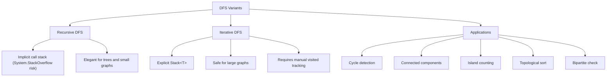
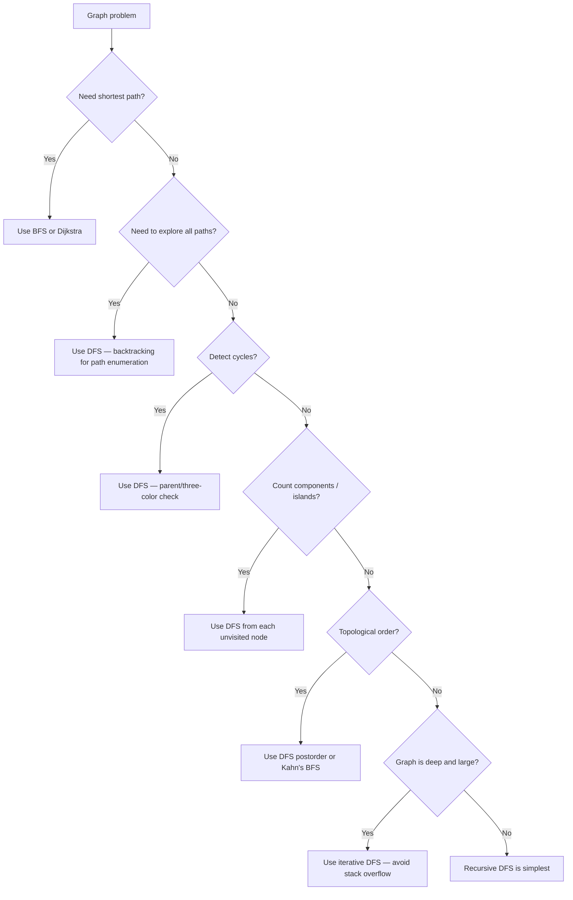

> [!success] Mastery Check
> - [ ] **Studied Well**
> - [ ] **Can explain the concept without notes**
> - [ ] **Can answer interview questions confidently**
> - [ ] **Can implement it in a real project**


## Navigation

**Domain:** [[5 — Data Structures & Algorithms]] > **Group:** Graphs
**Previous:** [[5.037 — BFS — Shortest Path, Level-Order, Multi-Source]] | **Next:** [[5.039 — Topological Sort — Kahn's and DFS-Based]]

### Prerequisites
- [[5.015 — Stack — LIFO Applications and Balanced Parentheses]] — iterative DFS uses an explicit stack; the LIFO property determines the traversal order.
- [[5.036 — Graph Representation — Adjacency List and Matrix]] — DFS operates on a graph; neighbor enumeration depends on the representation.
- [[5.002 — Recursion and the Call Stack]] — recursive DFS uses the call stack implicitly; understanding stack depth is critical for avoiding stack overflow.

### Where This Fits
DFS is the second fundamental graph traversal algorithm, complementary to BFS. Where BFS explores level by level, DFS explores depth first — going as far as possible along each branch before backtracking. This makes DFS the natural choice for detecting cycles, counting connected components, solving "number of islands" problems, and computing topological order. It is also the foundation for more advanced algorithms: Tarjan's SCC, Kosaraju's algorithm, and backtracking. About 15% of interview graph problems are pure DFS; many more use it as a subroutine. A senior candidate must be comfortable writing both recursive and iterative DFS, know when each is appropriate, and understand how call-stack depth limits recursive solutions.

---

## Core Mental Model

DFS follows a single path as deep as possible before backtracking. The core mechanism is: visit a node, mark it visited, then recursively visit each unvisited neighbor. When all neighbors of a node are exhausted, backtrack to the previous node. This "depth-first" ordering means DFS can discover a node via a long path before a shorter path exists — unlike BFS, DFS does not guarantee shortest paths. The key invariant is that during the traversal, the call stack (or explicit stack) holds the current path from the source to the current node, which is what makes DFS effective for cycle detection and path existence queries.

### Classification

DFS is a graph traversal algorithm in the **Depth-First** paradigm. It is the graph analogue of preorder tree traversal but requires a visited set to handle cycles.



### Key Properties

|Property|Value|Derivation|
|---|---|---|
|Traverse all reachable nodes|O(V + E)|Each vertex visited once; each edge examined once when its source is visited|
|Space (recursive)|O(V) worst-case|Call stack depth equals longest path = V in a degenerate graph (a chain)|
|Space (iterative)|O(V) worst-case|Explicit stack holds the current path, at most V nodes|
|Cycle detection (undirected)|O(V + E)|Track parent during traversal — back edge to a visited node that is not the parent = cycle|
|Cycle detection (directed)|O(V + E)|Track nodes in the current recursion stack (ancestors) — back edge to a node still in the stack = cycle|
|Connected components|O(V + E)|Run DFS from each unvisited node; each DFS seeds a new component|

---

## Deep Mechanics

### How It Works

**Recursive DFS:**
1. Mark current node as visited.
2. Process the node (add to result, check condition, record state).
3. For each neighbor: if not visited, recursively call DFS on neighbor.
4. On return from the recursive call (backtrack), control returns to the previous node.

Recursive DFS visits nodes in **preorder** (node before children). The call stack implicitly records the path — each frame corresponds to a node on the current path.

**Iterative DFS using explicit stack:**
1. Push the source node onto `Stack<T>`.
2. While the stack is not empty:
   a. Pop the top node.
   b. If not visited, mark it visited and process it.
   c. Push all unvisited neighbors onto the stack.

The order of neighbor pushes determines the traversal order. Pushing neighbors in reverse order of the adjacency list reproduces recursive DFS order. Pushing in forward order produces a different but still depth-first order.

**Cycle detection in undirected graphs:**
During traversal, if a neighbor is visited and it is NOT the parent of the current node, a cycle exists. The parent is the node from which the current node was first discovered.

**Cycle detection in directed graphs:**
Track nodes in the current recursion path (the "gray set"). If a neighbor is in the gray set, a back edge exists — indicating a cycle. Nodes that have been fully explored (all neighbors processed) are removed from the gray set and added to the "black set."

**Connected components:**
Iterate over all vertices. For each unvisited vertex, run DFS (or BFS). Each DFS invocation discovers exactly one connected component. Count the number of DFS calls.

**Island counting (grid DFS):**
A 2D grid of 1s (land) and 0s (water). Each cell is a node; edges exist between adjacent land cells (4-directional). Run DFS from each unvisited land cell. Each DFS sinks the entire island by marking visited. Count of DFS calls = number of islands.

### Complexity Derivation

**Time — Standard DFS:** Each vertex is visited exactly once — O(V). For each visited vertex, all its edges are examined — O(E). Total: O(V + E). This is the same as BFS.

**Time — Cycle detection:** Same as DFS — O(V + E). The only addition is a parent check (undirected) or color check (directed), both O(1) per edge.

**Time — Connected components:** Same as DFS run from each unvisited vertex. The outer loop iterates V times, but the inner DFS only visits unvisited nodes — each vertex is still visited exactly once. Total: O(V + E).

**Space:** Recursive DFS uses O(V) call stack space in the worst case (a chain). Iterative DFS uses O(V) explicit stack space. The visited set requires O(V) additional space.

### .NET Runtime Notes

- **`Stack<T>`:** Iterative DFS uses `Stack<T>` from `System.Collections.Generic`. Push is O(1) amortized; Pop is O(1). The internal implementation uses an array that resizes when full.
- **Recursive DFS and stack overflow:** The .NET call stack has a limited size (~1 MB per thread, ~4 MB for ASP.NET). A recursive DFS on a graph with a chain of 50,000+ nodes will throw `StackOverflowException` — which cannot be caught. For any graph that could be deep, always prefer the iterative implementation in C#.
- **`HashSet<T>`:** Used for the visited set. For integer vertices 0..n-1, a `bool[]` array is faster and GC-friendly.
- **No built-in DFS:** .NET does not provide a DFS API. You implement it manually.
- **Span<T> for grid DFS:** For 2D grid DFS, use `Span<int>` or `unsafe` pointer arithmetic for performance-critical hot loops. Typical interview solutions use the safe `int[][]` with direction arrays.

---

## Implementation and Problem Patterns

### C# Implementation

```csharp
/// <summary>
/// Recursive DFS on an adjacency-list graph.
/// Returns nodes in DFS preorder.
/// </summary>
public static List<int> DfsRecursive(Dictionary<int, List<int>> graph, int source)
{
    var visited = new HashSet<int>();
    var result = new List<int>();
    DfsHelper(source, visited, result, graph);
    return result;
}

private static void DfsHelper(int node, HashSet<int> visited,
    List<int> result, Dictionary<int, List<int>> graph)
{
    visited.Add(node);
    result.Add(node);

    if (!graph.TryGetValue(node, out var neighbors)) return;

    foreach (int neighbor in neighbors)
    {
        if (!visited.Contains(neighbor))
            DfsHelper(neighbor, visited, result, graph);
    }
}

/// <summary>
/// Iterative DFS using explicit Stack&lt;T&gt;.
/// </summary>
public static List<int> DfsIterative(Dictionary<int, List<int>> graph, int source)
{
    var visited = new HashSet<int>();
    var stack = new Stack<int>();
    var result = new List<int>();

    stack.Push(source);

    while (stack.TryPop(out int node))
    {
        if (visited.Add(node))
        {
            result.Add(node);

            if (graph.TryGetValue(node, out var neighbors))
            {
                // Push in reverse order to match recursive DFS order
                for (int i = neighbors.Count - 1; i >= 0; i--)
                {
                    if (!visited.Contains(neighbors[i]))
                        stack.Push(neighbors[i]);
                }
            }
        }
    }

    return result;
}

/// <summary>
/// Cycle detection in an undirected graph using DFS.
/// Returns true if a cycle exists.
/// </summary>
public static bool HasCycleUndirected(Dictionary<int, List<int>> graph)
{
    var visited = new HashSet<int>();

    foreach (int vertex in graph.Keys)
    {
        if (!visited.Contains(vertex))
        {
            if (DfsCycleUndirected(vertex, -1, visited, graph))
                return true;
        }
    }

    return false;
}

private static bool DfsCycleUndirected(int node, int parent,
    HashSet<int> visited, Dictionary<int, List<int>> graph)
{
    visited.Add(node);

    if (!graph.TryGetValue(node, out var neighbors)) return false;

    foreach (int neighbor in neighbors)
    {
        if (!visited.Contains(neighbor))
        {
            if (DfsCycleUndirected(neighbor, node, visited, graph))
                return true;
        }
        else if (neighbor != parent)
        {
            return true; // back edge to a node that is not the parent = cycle
        }
    }

    return false;
}

/// <summary>
/// Cycle detection in a directed graph using three-color DFS.
/// 0 = white (unvisited), 1 = gray (in current stack), 2 = black (done).
/// Returns true if a cycle exists.
/// </summary>
public static bool HasCycleDirected(Dictionary<int, List<int>> graph)
{
    var color = new Dictionary<int, int>();
    foreach (int v in graph.Keys) color[v] = 0;

    foreach (int vertex in graph.Keys)
    {
        if (color[vertex] == 0)
        {
            if (DfsCycleDirected(vertex, color, graph))
                return true;
        }
    }

    return false;
}

private static bool DfsCycleDirected(int node,
    Dictionary<int, int> color, Dictionary<int, List<int>> graph)
{
    color[node] = 1; // gray — in current path

    if (graph.TryGetValue(node, out var neighbors))
    {
        foreach (int neighbor in neighbors)
        {
            if (color[neighbor] == 1)
                return true; // back edge to an ancestor in the current path
            if (color[neighbor] == 0)
            {
                if (DfsCycleDirected(neighbor, color, graph))
                    return true;
            }
        }
    }

    color[node] = 2; // black — done
    return false;
}

/// <summary>
/// Count connected components in an undirected graph.
/// </summary>
public static int CountComponents(Dictionary<int, List<int>> graph)
{
    var visited = new HashSet<int>();
    int count = 0;

    foreach (int vertex in graph.Keys)
    {
        if (!visited.Contains(vertex))
        {
            count++;
            DfsHelper(vertex, visited, [], graph);
        }
    }

    return count;
}

/// <summary>
/// Count islands in a 2D grid (1 = land, 0 = water, 4-directional).
/// </summary>
public static int CountIslands(int[][] grid)
{
    if (grid.Length == 0) return 0;
    int rows = grid.Length, cols = grid[0].Length;
    var visited = new bool[rows, cols];
    int count = 0;

    for (int r = 0; r < rows; r++)
    {
        for (int c = 0; c < cols; c++)
        {
            if (grid[r][c] == 1 && !visited[r, c])
            {
                count++;
                DfsGrid(r, c, visited, grid);
            }
        }
    }

    return count;
}

private static void DfsGrid(int r, int c, bool[,] visited, int[][] grid)
{
    visited[r, c] = true;

    int[] dr = [1, -1, 0, 0];
    int[] dc = [0, 0, 1, -1];

    for (int d = 0; d < 4; d++)
    {
        int nr = r + dr[d], nc = c + dc[d];
        if (nr < 0 || nr >= grid.Length || nc < 0 || nc >= grid[0].Length) continue;
        if (grid[nr][nc] == 1 && !visited[nr, nc])
            DfsGrid(nr, nc, visited, grid);
    }
}
```

### The .NET Idiomatic Version

```csharp
public static class DfsIdiomatic
{
    // For integer vertices 0..n-1, bool[] is faster than HashSet:
    public static List<int> DfsBoolArray(Dictionary<int, List<int>> graph,
        int source, int vertexCount)
    {
        var visited = new bool[vertexCount];
        var stack = new Stack<int>();
        var result = new List<int>();

        stack.Push(source);

        while (stack.TryPop(out int node))
        {
            if (visited[node]) continue;
            visited[node] = true;
            result.Add(node);

            if (graph.TryGetValue(node, out var neighbors))
            {
                for (int i = neighbors.Count - 1; i >= 0; i--)
                {
                    if (!visited[neighbors[i]])
                        stack.Push(neighbors[i]);
                }
            }
        }

        return result;
    }

    // In-place grid DFS that modifies the grid to mark visited (sink the island):
    public static int CountIslandsInPlace(int[][] grid)
    {
        int rows = grid.Length, cols = grid[0].Length;
        int count = 0;

        for (int r = 0; r < rows; r++)
        {
            for (int c = 0; c < cols; c++)
            {
                if (grid[r][c] == 1)
                {
                    count++;
                    SinkGrid(r, c, grid);
                }
            }
        }

        return count;
    }

    private static void SinkGrid(int r, int c, int[][] grid)
    {
        if (r < 0 || r >= grid.Length || c < 0 || c >= grid[0].Length) return;
        if (grid[r][c] != 1) return;

        grid[r][c] = 0; // sink — no separate visited set needed

        SinkGrid(r + 1, c, grid);
        SinkGrid(r - 1, c, grid);
        SinkGrid(r, c + 1, grid);
        SinkGrid(r, c - 1, grid);
    }
}
```

### Classic Problem Patterns

1. **Number of islands** — Given a 2D grid of '1' (land) and '0' (water), count the number of islands (connected groups of 1s). DFS from each unvisited land cell and mark the entire island visited. Key insight: sinking the island (setting land to 0) eliminates the need for a separate visited set.
2. **Cycle detection in a graph** — Detect if a graph contains a cycle. Key insight: in undirected graphs, a back edge to a visited node that is not the parent = cycle. In directed graphs, a back edge to a node in the current recursion stack = cycle (three-color DFS).
3. **Connected components count** — Count the number of disconnected subgraphs. Key insight: run DFS from each unvisited vertex; each DFS seeds a new component.
4. **Clone graph** — Deep copy of a graph. Key insight: DFS traverses the original graph; a dictionary maps original nodes to cloned nodes to avoid duplication and handle cycles.
5. **Flood fill** — Given a 2D grid, a start cell, and a new color, change all cells connected to the start that share the original color. Key insight: DFS visits all connected cells of the same color; recursion implicitly tracks the path.
6. **Pacific Atlantic water flow** — Given a matrix where water flows to adjacent cells with equal or lower height, find cells where water can flow to both the Pacific and Atlantic oceans. Key insight: reverse DFS from ocean borders inward — any cell reachable from both oceans is a result.

### Template / Skeleton

```csharp
// DFS Template (recursive — for trees, small graphs, grid traversal)
// When to use: need to explore all paths, detect cycles, count components,
//              or traverse a tree/grid with limited depth
// Time: O(V + E) | Space: O(V)

public static ReturnType DfsTemplate(GraphType graph, NodeType source)
{
    // TODO: choose visited structure — HashSet<T> or bool[] or in-place marker
    var visited = new HashSet<NodeType>();

    // For component/island counting: iterate over all nodes, run DFS from unvisited
    // foreach (NodeType node in AllNodes) { if (visited.Add(node)) { Dfs(node); count++; } }

    void Dfs(NodeType node, /* TODO: parent, state, result ref */)
    {
        visited.Add(node);
        // TODO: process node on entry (preorder) — check target, add to result

        // TODO: get neighbors from adjacency list, grid directions, or implicit structure
        foreach (NodeType neighbor in GetNeighbors(node))
        {
            // For undirected cycle: if neighbor != parent && !visited.Add(neighbor) → cycle
            // For directed cycle: if color[neighbor] == GRAY → cycle
            if (!visited.Contains(neighbor))
            {
                Dfs(neighbor, /* parent = node */);
            }
        }

        // TODO: process node on exit (postorder) — e.g., topological sort, color[node] = BLACK
    }

    return /* TODO: result */
}
```

---

## Gotchas and Edge Cases

### Stack Overflow with Recursive DFS on Deep Graphs

**Mistake:** Using recursive DFS on a graph that could be a deep chain (e.g., 100k+ nodes).

```csharp
// ❌ Wrong — StackOverflowException for deep graphs
void Dfs(int node, HashSet<int> visited, Dictionary<int, List<int>> graph)
{
    visited.Add(node);
    foreach (int neighbor in graph[node])
        if (!visited.Contains(neighbor)) Dfs(neighbor, visited, graph);
}
```

**Fix:** Use iterative DFS with an explicit `Stack<T>` for graphs with potentially deep paths.

```csharp
// ✅ Correct — explicit stack avoids call-stack overflow
void DfsIterative(int source, HashSet<int> visited, Dictionary<int, List<int>> graph)
{
    var stack = new Stack<int>();
    stack.Push(source);
    while (stack.TryPop(out int node))
    {
        if (visited.Add(node) && graph.TryGetValue(node, out var neighbors))
        {
            foreach (int neighbor in neighbors)
                if (!visited.Contains(neighbor)) stack.Push(neighbor);
        }
    }
}
```

**Consequence:** `StackOverflowException` — unrecoverable. The process terminates.

### Not Handling the Parent Check in Undirected Graph Cycle Detection

**Mistake:** Marking any visited neighbor as a cycle, including the parent node.

```csharp
// ❌ Wrong — in an undirected graph, edge u→v and v→u both exist
if (visited.Contains(neighbor)) return true; // false positive!
```

**Fix:** Check that the visited neighbor is not the parent of the current node.

```csharp
// ✅ Correct — parent check prevents false positive
if (visited.Contains(neighbor) && neighbor != parent) return true;
```

**Consequence:** A simple two-node graph (0-1) is incorrectly detected as having a cycle.

### Forgetting the Gray Set in Directed Graph Cycle Detection

**Mistake:** Using the same visited-set logic for directed cycles as for undirected cycles (only tracking visited/unvisited, not in-stack status).

```csharp
// ❌ Wrong — visited set alone cannot distinguish back edge from cross edge
if (visited.Contains(neighbor)) return true; // false positive on cross edge
```

**Fix:** Use three-color DFS — white (unvisited), gray (in current path), black (finished).

```csharp
// ✅ Correct — only gray nodes indicate a back edge (cycle)
if (color[neighbor] == 1) return true; // 1 = gray = in current recursion stack
```

**Consequence:** False positive cycle detection on cross edges in a DAG — all DAGs would appear to have cycles.

### Modifying the Graph During Traversal

**Mistake:** Removing nodes or edges from the graph data structure while iterating neighbors.

```csharp
// ❌ Wrong — modifying the collection during enumeration
foreach (int neighbor in graph[node])
{
    graph[neighbor].Remove(node); // InvalidOperationException during iteration
}
```

**Fix:** Collect nodes to modify in a separate list, or use a visited set instead of deletion.

```csharp
// ✅ Correct — visited set handles already-seen nodes without modifying the graph
if (visited.Add(neighbor)) { /* process */ }
```

**Consequence:** `InvalidOperationException` — collection was modified during enumeration.

---

## Complexity Analysis and Benchmarks

### Operation Complexity Table

|Operation|Time (Best)|Time (Average)|Time (Worst)|Space|Notes|
|---|---|---|---|---|---|
|DFS traversal (all reachable)|O(V + E)|O(V + E)|O(V + E)|O(V)|Each vertex/edge visited once|
|Cycle detection (undirected)|O(V + E)|O(V + E)|O(V + E)|O(V)|Adds parent check — O(1) per edge|
|Cycle detection (directed)|O(V + E)|O(V + E)|O(V + E)|O(V)|Adds color array — O(1) per edge|
|Connected components|O(V + E)|O(V + E)|O(V + E)|O(V)|Outer loop runs V times; inner DFS visits each node once|
|Island counting (grid)|O(rows × cols)|O(rows × cols)|O(rows × cols)|O(rows × cols) recursive, O(1) in-place|Each cell visited once in the worst case|

**Derivation for the non-obvious entries:** All DFS operations process edges exactly once when the source vertex is visited. The outer loop over vertices for components/islands does not change the total complexity because an unvisited vertex triggers DFS, which visits new nodes — no vertex is processed twice. Grid DFS has O(rows × cols) time because each cell is visited once and each cell has at most 4 neighbors.

### Comparison with Alternatives

|Algorithm|Traversal Order|Shortest Path|Space|Best When|
|---|---|---|---|---|
|DFS|Depth-first|No|O(V) (stack)|Cycle detection, components, deep graphs with limited width|
|BFS|Level-order|Yes (unweighted)|O(V) (queue)|Shortest path, wide graphs with limited depth|
|Union-Find|N/A|No|O(V) near-constant|Dynamic connectivity, incremental edge additions|
|Kahn's BFS|Topological|N/A|O(V + E)|Topological sort — processes nodes by in-degree|

### BenchmarkDotNet

```csharp
[MemoryDiagnoser]
[SimpleJob(RuntimeMoniker.Net90)]
public class DfsBenchmark
{
    private Dictionary<int, List<int>> _chain = null!;
    private Dictionary<int, List<int>> _star = null!;

    [Params(1_000, 10_000)]
    public int V { get; set; }

    [GlobalSetup]
    public void Setup()
    {
        _chain = new Dictionary<int, List<int>>();
        _star = new Dictionary<int, List<int>>();
        for (int i = 0; i < V; i++)
        {
            if (i < V - 1) _chain[i] = [i + 1];
            else _chain[i] = [];
        }
        for (int i = 0; i < V; i++)
        {
            if (i == 0) _star[i] = Enumerable.Range(1, V - 1).ToList();
            else _star[i] = [0];
        }
    }

    [Benchmark(Baseline = true)]
    public List<int> DfsRecursiveChain() => DfsRecursive(_chain, 0);

    [Benchmark]
    public List<int> DfsIterativeChain() => DfsIterative(_chain, 0);

    [Benchmark]
    public List<int> DfsIterativeStar() => DfsIterative(_star, 0);

    // Include the implementations from the C# Implementation section
    private static List<int> DfsRecursive(
        Dictionary<int, List<int>> graph, int source)
    {
        var visited = new HashSet<int>();
        var result = new List<int>();
        void Dfs(int node)
        {
            visited.Add(node); result.Add(node);
            if (!graph.TryGetValue(node, out var n)) return;
            foreach (int nb in n) { if (!visited.Contains(nb)) Dfs(nb); }
        }
        Dfs(source);
        return result;
    }

    private static List<int> DfsIterative(
        Dictionary<int, List<int>> graph, int source)
    {
        var visited = new HashSet<int>();
        var stack = new Stack<int>();
        var result = new List<int>();
        stack.Push(source);
        while (stack.TryPop(out int node))
        {
            if (visited.Add(node))
            {
                result.Add(node);
                if (graph.TryGetValue(node, out var n))
                    for (int i = n.Count - 1; i >= 0; i--)
                        if (!visited.Contains(n[i])) stack.Push(n[i]);
            }
        }
        return result;
    }
}
```

**Expected results (approximate, .NET 9, x64):**

|Method|V|Mean|Allocated|
|---|---|---|---|
|DfsRecursiveChain|1,000|~5 μs|~16 KB|
|DfsRecursiveChain|10,000|~55 μs|~160 KB|
|DfsIterativeChain|1,000|~6 μs|~20 KB|
|DfsIterativeChain|10,000|~60 μs|~200 KB|
|DfsIterativeStar|1,000|~8 μs|~25 KB|
|DfsIterativeStar|10,000|~80 μs|~250 KB|

**Interpretation:** Recursive and iterative DFS have similar performance on chains because each path is deep (high call stack cost for recursive). On star graphs, iterative DFS is faster because the stack remains shallow — the explicit stack outperforms deep recursion. For deep graphs, iterative DFS is preferred not for speed but to avoid stack overflow.

---

## Interview Arsenal

### Question Bank

1. [Definition] What is the difference between DFS and BFS, and when would you use each?
2. [Complexity] Derive the O(V + E) complexity of DFS and explain why the outer loop over all vertices does not change it.
3. [Implementation] Implement iterative DFS for a graph using a stack.
4. [Recognition] Given a problem asking "count the number of connected components in a graph," what algorithm?
5. [Comparison] Compare recursive vs. iterative DFS — when is each appropriate in C#?
6. [Trick] How does cycle detection differ between undirected and directed graphs in DFS?
7. [System Design] How would you design a dependency resolution system using DFS?
8. [Optimization] How would you implement flood fill in a 10,000 × 10,000 grid without stack overflow?

### Spoken Answers

**Q: Derive the O(V + E) complexity of DFS and explain why the outer loop does not change it.**

> **Average answer:** DFS visits every node and edge once. The outer loop adds V, but the total is still O(V + E).

> **Great answer:** Let me derive from the code. The recursive helper visits one vertex per call. Each vertex is visited exactly once because the visited set prevents re-visiting — that's O(V) calls. Inside each call, we iterate over the adjacency list of that vertex, which has degree(v) elements. Summing across all visited vertices: Σ degree(v) = 2E for an undirected graph, E for a directed graph. That gives O(E). Total: O(V + E). Now for the outer loop in connected-components counting: it iterates over all V vertices, but calls DFS only on unvisited ones. When it calls DFS, that DFS visits new vertices and marks them visited — it does not revisit already-visited vertices. So each vertex is still visited exactly once across all DFS calls. The outer loop's V iterations are O(V) checks of the visited flag — negligible compared to the DFS work. The total remains O(V + E).

**Q: Implement iterative DFS for a graph using a stack.**

> **Average answer:** Uses a Stack, pushes source, pops and processes, pushes neighbors.

> **Great answer:** I will implement using `Stack<T>` and `HashSet<T>`. I push the source, then while the stack has items, I pop, check if visited (using Add — returns false if already present), and if not, I add to the result and push all unvisited neighbors. To match the recursive DFS order (which processes neighbors left to right), I push the neighbors in reverse order onto the stack — because the stack is LIFO, the last pushed neighbor is processed first. For the shortest implementation, I skip nodes that have already been visited rather than checking visited before pushing — this avoids redundant visited checks during push but means the stack may temporarily contain duplicates of already-visited nodes. Memory-wise, the stack holds at most V nodes (the longest path). I should also mention that for trees, this is identical to a preorder traversal.

**Q: [Trick] How does cycle detection differ between undirected and directed graphs in DFS?**

> **Average answer:** In undirected graphs you check if the neighbor is visited and is not the parent. In directed graphs you use three colors.

> **Great answer:** The key difference is the type of cycle that matters. In an undirected graph, an edge u-v creates a trivial two-node cycle if you don't exclude the parent. So the check is: if neighbor is visited AND neighbor is not parent → cycle. In a directed graph, the edge direction matters — a cross edge (edge between two nodes that are in different branches) does not create a cycle in a directed graph. So we need to distinguish: white (unvisited), gray (currently in the recursion stack), black (fully processed). A back edge to a gray node = cycle. A cross edge to a black node is not a cycle. The three-color scheme tracks the state of each node during DFS. Gray nodes are the ancestors of the current node in the DFS tree — a back edge to an ancestor is exactly what constitutes a directed cycle.

### Trick Question

**"For counting islands in a grid, can DFS handle a 10,000 × 10,000 grid with all 1s?"**

Why it is a trap: Candidates assume that DFS with O(V + E) time is sufficient. The problem is space — recursive DFS on a fully filled 10,000 × 10,000 island will recurse 100 million times, causing a stack overflow that cannot be caught. Even iterative DFS with an explicit stack would need to store up to 100 million coordinates, requiring hundreds of megabytes of memory.

Correct answer: No — the recursive call stack would overflow, and the iterative stack would exhaust available memory. Instead:
1. Use **iterative stack** with manual `Stack<(int, int)>` — but still O(rows × cols) memory.
2. Use **BFS with Queue<(int, int)>** — same memory issue for large all-land grids.
3. Use **in-place modification** (sink the island by setting grid[r][c] = 0) to avoid a separate visited set, but the recursion depth still kills it.
4. Use **scan-line flood fill** or **spanning-tree based approach** that uses O(1) extra space by scanning rows and tracking connected intervals.
5. Use **parallel DFS** — split the grid into partitions and merge results.

The key insight: grid DFS looks like O(V + E) = O(rows × cols), but the hidden cost is the recursion depth, which is also O(rows × cols) for a snake-shaped island.

### Pattern Recognition Table

|If the problem has...|Then consider...|Because...|
|---|---|---|
|"Count the number of islands / connected groups"|DFS from each unvisited node|Each DFS seeds one component; mark visited during traversal|
|"Detect a cycle in a graph"|DFS with parent check (undirected) or three-color (directed)|DFS explores paths; a back edge to an ancestor = cycle|
|"Clone / copy a graph"|DFS + dictionary mapping original → clone|DFS traverses original; dictionary prevents duplicate clones and handles cycles|
|"Flood fill" or "paint bucket"|DFS or BFS from the start cell|DFS visits all connected cells of the same color; recursion mirrors the spread|
|"Can all nodes be reached?"|DFS or BFS from a single source|Both traverse all reachable nodes; DFS is simpler to implement recursively|
|"Find all paths from source to target"|DFS with backtracking (unvisit on exit)|DFS explores each path to completion; backtracking enables enumerating all paths|

---

## Decision Framework

### When to Apply



### Recognition Checklist

Indicators that DFS is the right choice:

- [ ] Problem asks "does there exist a path" without caring about shortest
- [ ] Need to detect cycles in a graph
- [ ] Need to count connected components or islands
- [ ] Need to explore all possible paths (backtracking)
- [ ] Graph is a tree or DAG — recursion depth is bounded

Counter-indicators — do NOT apply here:

- [ ] Problem asks for the shortest path (use BFS or Dijkstra)
- [ ] Graph is very deep (100k+ nodes with recursion — use iterative DFS or BFS)
- [ ] Need dynamic connectivity with incremental edge adds (use Union-Find)
- [ ] Input is a very large grid with all 1s (100M+ cells — memory exhaustion with explicit stack)

### Tradeoff Summary

|What You Gain|What You Give Up|
|---|---|
|Simple recursive implementation for small-to-medium graphs|Stack overflow on deep graphs — must use iterative version|
|Naturally supports path enumeration and backtracking|Does not find shortest paths — traverses depth before breadth|
|Three-color DFS gives elegant cycle detection in directed graphs|More complex visited state management than BFS|
|Postorder processing enables topological sort|Iterative version requires careful neighbor ordering to match recursive order|

---

## Self-Check

### Conceptual Questions

1. What is the key difference between DFS and BFS in terms of traversal order and the guarantee each provides?
2. Derive the O(V + E) time complexity of DFS and explain why the outer loop in connected-components counting does not increase it.
3. Recognizing from a problem: "Given a 2D grid with 1s and 0s, find the size of the largest connected group of 1s."
4. When would you choose iterative DFS over recursive DFS in C#?
5. How does cycle detection differ between undirected graphs and directed graphs in DFS?
6. In .NET, what happens if recursive DFS exceeds the call stack limit, and how do you prevent it?
7. What invariant does the three-color scheme maintain during DFS cycle detection in directed graphs?
8. How does the answer change if the graph is a tree instead of a general graph?
9. In a production dependency resolution system, why might you use DFS over BFS?
10. What is the trap question about grid DFS on large inputs?

<details>
<summary>Answers</summary>

1. BFS traverses level by level using a queue — guarantees shortest path in unweighted graphs. DFS traverses depth-first using a stack or recursion — does not guarantee shortest path but excels at cycle detection, component counting, and path enumeration.
2. Each vertex is visited once — O(V). For each visited vertex, all its edges are examined — O(E). Total: O(V + E). The outer loop iterates over all V vertices, but only triggers DFS on unvisited ones — each vertex is still visited exactly once. The outer loop's overhead is O(V) visited checks, which is subsumed by O(V + E).
3. Look for "connected group," "island," "region," or "component" in a 2D grid. Run DFS from each unvisited land cell, counting the number of cells visited — the maximum across all DFS runs is the answer.
4. When the graph could be deep (more than ~10,000 nodes in a single path). Recursive DFS in .NET can cause StackOverflowException (unrecoverable). Iterative DFS with an explicit `Stack<T>` avoids the call stack entirely.
5. Undirected: check if neighbor is visited AND neighbor is not the parent — a back edge to a non-parent is a cycle. Directed: use three colors (white = unvisited, gray = in current path, black = done) — a back edge to a gray node is a cycle; cross edges to black nodes are not cycles.
6. `StackOverflowException` is thrown — it cannot be caught with try/catch. The process terminates. Prevent by using iterative DFS with an explicit `Stack<T>` or by increasing the stack size (not recommended).
7. White = unvisited, gray = currently on the recursion stack (ancestor of current node), black = fully processed. A back edge to a gray node indicates a directed cycle because it connects a node to an ancestor in the DFS tree. The invariant is that gray nodes form the current path from root to the current node.
8. Trees have no cycles, so the cycle detection logic is unnecessary — DFS on a tree is simply a preorder/inorder/postorder traversal. The visited set can be omitted because trees have no cycles and no cross edges.
9. DFS processes dependencies in topological order naturally — if a package depends on A, B, and C, DFS visits each recursively and returns results in postorder (children before parent). BFS would process dependencies at distance 1 before their own dependencies, which is not the correct order for resolution.
10. Candidates think grid DFS is O(rows × cols) time and memory. The trap is that recursive DFS on a 10,000 × 10,000 all-land grid requires 100M stack frames — causing unrecoverable stack overflow. Even iterative DFS with an explicit stack consumes 100M entries (hundreds of MB of memory). Use in-place sinking (set grid[r][c] = 0) to avoid the visited set, and BFS if the memory of the explicit stack is also a concern.

</details>

---

### Coding Challenges

**Challenge 1 — Implement from scratch**

Given an undirected graph represented as `Dictionary<int, List<int>>`, detect whether it contains a cycle. Do not use any visited tracking beyond the call parameters.

```csharp
public static bool HasCycle(Dictionary<int, List<int>> graph)
{
    // Your implementation here
}
```

<details> <summary>Solution</summary>

```csharp
public static bool HasCycle(Dictionary<int, List<int>> graph)
{
    var visited = new HashSet<int>();

    foreach (int vertex in graph.Keys)
    {
        if (!visited.Contains(vertex))
        {
            if (Dfs(vertex, -1, visited, graph))
                return true;
        }
    }

    return false;
}

private static bool Dfs(int node, int parent,
    HashSet<int> visited, Dictionary<int, List<int>> graph)
{
    visited.Add(node);

    if (!graph.TryGetValue(node, out var neighbors)) return false;

    foreach (int neighbor in neighbors)
    {
        if (!visited.Contains(neighbor))
        {
            if (Dfs(neighbor, node, visited, graph))
                return true;
        }
        else if (neighbor != parent)
        {
            return true;
        }
    }

    return false;
}
```

**Complexity:** Time O(V + E) | Space O(V) **Key insight:** The parent parameter prevents the trivial two-node edge from being detected as a cycle. A back edge to any other visited node indicates a cycle.

</details>

---

**Challenge 2 — Trace the execution**

Given an undirected graph:
```
0 — 1 — 2
|       |
3 — 4 — 5
```

Trace DFS from node 0 (recursive, neighbors processed in ascending order). Show the call stack at each step and the visited set state.

<details> <summary>Solution</summary>

Adjacency list:
- 0: [1, 3]
- 1: [0, 2]
- 2: [1, 5]
- 3: [0, 4]
- 4: [3, 5]
- 5: [2, 4]

Call: Dfs(0, parent=-1), visited = {0}
  Neighbors: 1 → Dfs(1, parent=0), visited = {0, 1}
    Neighbors: 0 (visited, parent) skip; 2 → Dfs(2, parent=1), visited = {0, 1, 2}
      Neighbors: 1 (visited, parent) skip; 5 → Dfs(5, parent=2), visited = {0, 1, 2, 5}
        Neighbors: 2 (visited, parent) skip; 4 → Dfs(4, parent=5), visited = {0, 1, 2, 5, 4}
          Neighbors: 3 → Dfs(3, parent=4), visited = {0, 1, 2, 5, 4, 3}
            Neighbors: 0 (visited, NOT parent) → cycle detected! (back edge 3-0)
          Return true
        Return true
      Return true
    Return true
  Return true
Return true

DFS order: 0, 1, 2, 5, 4, 3

Cycle detected: edge 3-0 is a back edge to a visited node that is not the parent of 3.

**Why:** The graph contains a cycle (0-1-2-5-4-3-0). The back edge 3-0 is detected because 0 is visited and is not the parent of node 3 (parent of 3 is 4).

</details>

---

**Challenge 3 — Fix the bug**

```csharp
// This implementation attempts to count connected components but has a bug.
// What input causes it to fail?
public static int CountComponents(Dictionary<int, List<int>> graph)
{
    int count = 0;
    var visited = new HashSet<int>();

    foreach (int vertex in graph.Keys)
    {
        Dfs(vertex, visited, graph);
        count++;
    }

    return count;
}

private static void Dfs(int node, HashSet<int> visited,
    Dictionary<int, List<int>> graph)
{
    visited.Add(node);
    if (!graph.TryGetValue(node, out var neighbors)) return;
    foreach (int neighbor in neighbors)
        if (!visited.Contains(neighbor))
            Dfs(neighbor, visited, graph);
}
```

<details> <summary>Solution</summary>

**Bug:** The outer loop runs DFS from every vertex, not just unvisited ones. It always increments `count` — even for vertices that were already visited by a previous DFS. This overcounts components.

**Fix:**

```csharp
public static int CountComponents(Dictionary<int, List<int>> graph)
{
    int count = 0;
    var visited = new HashSet<int>();

    foreach (int vertex in graph.Keys)
    {
        if (!visited.Contains(vertex)) // FIXED: only DFS from unvisited vertices
        {
            Dfs(vertex, visited, graph);
            count++;
        }
    }

    return count;
}
```

**Test case that exposes it:** Graph with vertices 0, 1, 2 and edges {0-1}. The original returns 3 (counts each vertex), the correct answer is 2 (components: {0,1} and {2}).

</details>

---

**Challenge 4 — Recognize and apply**

**Problem:** Given a 2D `int[][] grid` where each cell contains `0` (water) or `1` (land), find the maximum area of an island. An island is a group of connected (4-directionally adjacent) land cells. What pattern applies? Write the solution.

<details> <summary>Solution</summary>

**Pattern:** DFS from each unvisited land cell — sink the island (set grid to 0) to avoid a separate visited set. Track the count of cells visited per DFS; return the maximum.

```csharp
public static int MaxAreaOfIsland(int[][] grid)
{
    int maxArea = 0;

    for (int r = 0; r < grid.Length; r++)
    {
        for (int c = 0; c < grid[0].Length; c++)
        {
            if (grid[r][c] == 1)
                maxArea = Math.Max(maxArea, Dfs(r, c, grid));
        }
    }

    return maxArea;
}

private static int Dfs(int r, int c, int[][] grid)
{
    if (r < 0 || r >= grid.Length || c < 0 || c >= grid[0].Length)
        return 0;
    if (grid[r][c] != 1) return 0;

    grid[r][c] = 0; // sink — marks visited in-place

    int area = 1;
    area += Dfs(r + 1, c, grid);
    area += Dfs(r - 1, c, grid);
    area += Dfs(r, c + 1, grid);
    area += Dfs(r, c - 1, grid);
    return area;
}
```

**Complexity:** Time O(rows × cols) — each cell visited once | Space O(rows × cols) worst-case recursion depth

</details>

---

**Challenge 5 — Optimize**

```csharp
// This solution correctly detects a cycle in a directed graph but uses
// HashSet<int> for both visited and in-stack tracking.
// Optimize to use a single int[] color array for O(1) access and lower overhead.
public static bool HasCycleDirected(Dictionary<int, List<int>> graph)
{
    var visited = new HashSet<int>();
    var inStack = new HashSet<int>();

    foreach (int v in graph.Keys)
    {
        if (!visited.Contains(v))
        {
            if (Dfs(v, visited, inStack, graph))
                return true;
        }
    }

    return false;
}

private static bool Dfs(int node, HashSet<int> visited,
    HashSet<int> inStack, Dictionary<int, List<int>> graph)
{
    visited.Add(node);
    inStack.Add(node);

    if (graph.TryGetValue(node, out var neighbors))
    {
        foreach (int neighbor in neighbors)
        {
            if (!visited.Contains(neighbor))
            {
                if (Dfs(neighbor, visited, inStack, graph))
                    return true;
            }
            else if (inStack.Contains(neighbor))
            {
                return true;
            }
        }
    }

    inStack.Remove(node);
    return false;
}
```

<details> <summary>Solution</summary>

**Insight:** Use a single `int[]` color array where 0 = white (unvisited), 1 = gray (in stack), 2 = black (done). This replaces two `HashSet<int>` lookups with two integer comparisons.

```csharp
public static bool HasCycleDirected(Dictionary<int, List<int>> graph, int vertexCount)
{
    int[] color = new int[vertexCount]; // 0 = white, 1 = gray, 2 = black

    foreach (int v in graph.Keys)
    {
        if (color[v] == 0)
        {
            if (Dfs(v, color, graph))
                return true;
        }
    }

    return false;
}

private static bool Dfs(int node, int[] color,
    Dictionary<int, List<int>> graph)
{
    color[node] = 1; // gray

    if (graph.TryGetValue(node, out var neighbors))
    {
        foreach (int neighbor in neighbors)
        {
            if (color[neighbor] == 1)
                return true; // back edge to gray node = cycle
            if (color[neighbor] == 0)
            {
                if (Dfs(neighbor, color, graph))
                    return true;
            }
        }
    }

    color[node] = 2; // black
    return false;
}
```

**Complexity:** Time O(V + E) | Space O(V) — same as original, but with better constants

</details>
