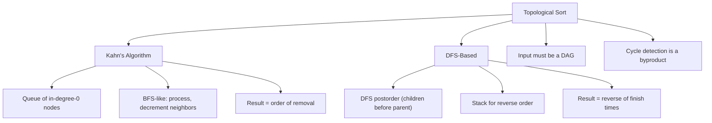
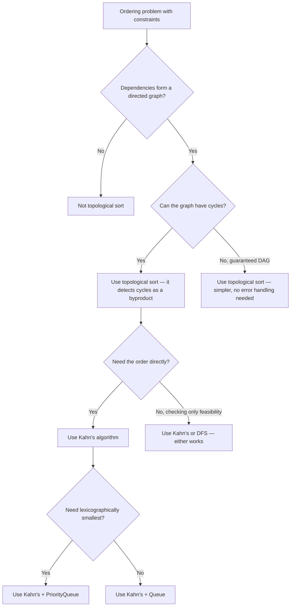

> [!success] Mastery Check
> - [ ] **Studied Well**
> - [ ] **Can explain the concept without notes**
> - [ ] **Can answer interview questions confidently**
> - [ ] **Can implement it in a real project**


## Navigation

**Domain:** [[5 — Data Structures & Algorithms]] > **Group:** Graphs
**Previous:** [[5.038 — DFS — Cycle Detection, Connected Components, Islands]] | **Next:** [[5.040 — Union-Find (Disjoint Set Union)]]

### Prerequisites
- [[5.037 — BFS — Shortest Path, Level-Order, Multi-Source]] — Kahn's algorithm is a BFS variant that uses in-degree tracking instead of a visited set.
- [[5.038 — DFS — Cycle Detection, Connected Components, Islands]] — the DFS-based topological sort uses postorder processing; the three-color scheme extends naturally to topological ordering.
- [[5.015 — Stack — LIFO Applications and Balanced Parentheses]] — the DFS-based approach pushes nodes onto a stack after all their dependencies are processed; the stack then yields the topological order.

### Where This Fits
Topological sort orders the vertices of a directed acyclic graph (DAG) such that for every directed edge u→v, u comes before v. It is the essential algorithm for scheduling problems: course prerequisites, build system dependencies, task scheduling, and package manager resolution. It appears in about 5% of graph interview problems, but its system design relevance is disproportionate — dependency resolution is a recurring theme at senior level. Two standard approaches exist: Kahn's algorithm (BFS with in-degree tracking, O(V + E), produces a valid order directly) and DFS-based (postorder stack, O(V + E), produces reverse order naturally). A senior candidate must be able to implement both, articulate why the graph must be a DAG, and detect cycles as a byproduct.

---

## Core Mental Model

Topological sort exploits the property of a DAG that there exists at least one vertex with in-degree 0 (no incoming edges). Kahn's algorithm repeatedly removes such vertices: find a vertex with in-degree 0, remove it (add to the result), decrement the in-degree of its neighbors, repeat. The DFS-based approach inverts this: run DFS from each unvisited node; after processing all descendants of a node, add the node to the front of the result (or push onto a stack). In both approaches, if the graph has a cycle, the algorithm terminates with nodes remaining in the graph — cycle detection is a byproduct.

### Classification

Topological sort is a **graph ordering** algorithm applicable only to **DAGs** (Directed Acyclic Graphs). It is neither a traversal nor a search — it produces a linear ordering respecting partial order constraints.



### Key Properties

|Property|Value|Derivation|
|---|---|---|
|Kahn's algorithm|O(V + E)|Each vertex processed once (dequeued, result added); each edge examined once (neighbor in-degree decremented)|
|DFS-based|O(V + E)|Each vertex visited once by DFS; each edge examined once|
|Cycle detection|O(V + E) byproduct|If Kahn's terminates with vertices unprocessed → cycle. If DFS visits a gray node → cycle|
|Space (Kahn's)|O(V)|Queue holds at most V nodes; in-degree array of size V|
|Space (DFS-based)|O(V)|Call stack + visited set + result stack — each at most V|

---

## Deep Mechanics

### How It Works

**Kahn's algorithm:**
1. Compute in-degree for every vertex (number of incoming edges).
2. Enqueue all vertices with in-degree 0.
3. While the queue is not empty:
   a. Dequeue a vertex — add it to the topological order.
   b. For each neighbor of the dequeued vertex, decrement its in-degree.
   c. If a neighbor's in-degree becomes 0, enqueue it.
4. If the topological order contains fewer vertices than the graph, a cycle exists.

The queue determines the ordering among nodes at the same "level" — using a queue gives a BFS-like order; using a priority queue produces a lexicographically smallest order.

**DFS-based approach:**
1. Run DFS from each unvisited vertex.
2. In the DFS, after processing all neighbors of a vertex (postorder), add the vertex to a result list (or push onto a stack).
3. The result (or stack popped in order) gives the topological order.

The intuition: a node must appear after all its descendants. By adding a node after its DFS subtree finishes, we guarantee all nodes reachable from it appear after it. Reversing this (or popping the stack) gives the correct order.

**Example trace on a DAG:**
```
5 → 0 ← 4
↓       ↓
2 → 3 → 1
```

Kahn's:
- In-degrees: 0:2, 1:2, 2:1, 3:1, 4:0, 5:0
- Queue: [4, 5]
- Dequeue 4 → result [4]. Neighbors: 0 (in-degree 2→1), 1 (in-degree 2→1). No new zeros.
- Dequeue 5 → result [4, 5]. Neighbors: 0 (in-degree 1→0) → enqueue 0. 2 (in-degree 1→0) → enqueue 2.
- Queue: [0, 2]. Dequeue 0 → result [4, 5, 0]. Neighbors: 1 (in-degree 1→0) → enqueue 1.
- Queue: [2, 1]. Dequeue 2 → result [4, 5, 0, 2]. Neighbors: 3 (in-degree 1→0) → enqueue 3.
- Queue: [1, 3]. Dequeue 1 → result [4, 5, 0, 2, 1]. Neighbors: none.
- Dequeue 3 → result [4, 5, 0, 2, 1, 3]. Neighbors: 1 (already done).
- Result size = 6 = total vertices. No cycle.

A valid topological order: [4, 5, 0, 2, 1, 3]

### Complexity Derivation

**Time — Kahn's:** Each vertex is enqueued exactly once and dequeued exactly once — O(V). Each edge is examined exactly once when its source vertex is dequeued and its neighbor's in-degree is decremented — O(E). Total: O(V + E).

**Time — DFS:** Each vertex is visited once by DFS — O(V). Each edge is examined once — O(E). The postorder append is O(1) per vertex. Total: O(V + E).

**Time — Cycle detection:** Both algorithms detect cycles in the same pass. Kahn's: if result.Count < V, a cycle exists. DFS: if a gray node is encountered during DFS, a cycle exists.

**Space — Kahn's:** In-degree array: O(V). Queue: at most O(V). Result: O(V). Total: O(V).

**Space — DFS:** Visited array: O(V). Recursion stack (explicit or implicit): at most O(V) in a chain. Result: O(V). Total: O(V).

### .NET Runtime Notes

- **`Queue<T>` in Kahn's:** Standard `Queue<T>` from `System.Collections.Generic` is the idiomatic choice. For lexicographically smallest topological order, replace with `SortedSet<T>` or `PriorityQueue<TElement, TPriority>` (both O(log V) per operation).
- **`Stack<T>` in DFS approach:** Use `Stack<T>` or simply `List<T>` with `Insert(0, ...)` — but `Insert(0)` is O(n). Prefer `Add` and then `Reverse()` or use `Stack<T>.Push` and `Pop`.
- **No built-in topological sort:** .NET does not provide this as a library function — you must implement it.
- **Large DAGs:** For very large graphs, use iterative DFS (explicit `Stack<T>`) to avoid stack overflow; Kahn's is inherently iterative and safe.

---

## Implementation and Problem Patterns

### C# Implementation

```csharp
/// <summary>
/// Kahn's algorithm — BFS-based topological sort.
/// Returns null if a cycle is detected.
/// </summary>
public static List<int>? TopologicalSortKahn(Dictionary<int, List<int>> graph)
{
    var inDegree = new Dictionary<int, int>();
    foreach (int v in graph.Keys) inDegree[v] = 0;

    // Compute in-degrees
    foreach (int v in graph.Keys)
    {
        if (graph.TryGetValue(v, out var neighbors))
        {
            foreach (int neighbor in neighbors)
            {
                if (!inDegree.ContainsKey(neighbor))
                    inDegree[neighbor] = 0;
                inDegree[neighbor]++;
            }
        }
    }

    var queue = new Queue<int>();
    foreach (var (v, deg) in inDegree)
    {
        if (deg == 0) queue.Enqueue(v);
    }

    var result = new List<int>(graph.Count);

    while (queue.TryDequeue(out int node))
    {
        result.Add(node);

        if (!graph.TryGetValue(node, out var neighbors)) continue;

        foreach (int neighbor in neighbors)
        {
            inDegree[neighbor]--;
            if (inDegree[neighbor] == 0)
                queue.Enqueue(neighbor);
        }
    }

    return result.Count == graph.Count ? result : null; // null = cycle detected
}

/// <summary>
/// DFS-based topological sort using postorder recursion.
/// Returns null if a cycle is detected.
/// </summary>
public static List<int>? TopologicalSortDfs(Dictionary<int, List<int>> graph)
{
    var color = new Dictionary<int, int>(); // 0=white, 1=gray, 2=black
    foreach (int v in graph.Keys) color[v] = 0;

    var result = new Stack<int>();

    foreach (int v in graph.Keys)
    {
        if (color[v] == 0)
        {
            if (!Dfs(v, color, result, graph))
                return null; // cycle detected
        }
    }

    return result.ToList();
}

private static bool Dfs(int node, Dictionary<int, int> color,
    Stack<int> result, Dictionary<int, List<int>> graph)
{
    color[node] = 1; // gray

    if (graph.TryGetValue(node, out var neighbors))
    {
        foreach (int neighbor in neighbors)
        {
            if (color[neighbor] == 1)
                return false; // back edge = cycle
            if (color[neighbor] == 0)
            {
                if (!Dfs(neighbor, color, result, graph))
                    return false;
            }
        }
    }

    color[node] = 2; // black — all descendants processed
    result.Push(node); // postorder — add after all children
    return true;
}

/// <summary>
/// Kahn's algorithm returning the lexicographically smallest topological order
/// (useful for problems requiring a specific ordering among equal candidates).
/// </summary>
public static List<int>? TopologicalSortLexicographic(Dictionary<int, List<int>> graph)
{
    var inDegree = new Dictionary<int, int>();
    foreach (int v in graph.Keys) inDegree[v] = 0;

    foreach (int v in graph.Keys)
    {
        if (graph.TryGetValue(v, out var neighbors))
        {
            foreach (int neighbor in neighbors)
            {
                if (!inDegree.ContainsKey(neighbor)) inDegree[neighbor] = 0;
                inDegree[neighbor]++;
            }
        }
    }

    var set = new SortedSet<int>(inDegree.Where(kv => kv.Value == 0).Select(kv => kv.Key));
    var result = new List<int>(graph.Count);

    while (set.Count > 0)
    {
        int node = set.Min;
        set.Remove(node);
        result.Add(node);

        if (!graph.TryGetValue(node, out var neighbors)) continue;

        foreach (int neighbor in neighbors)
        {
            inDegree[neighbor]--;
            if (inDegree[neighbor] == 0)
                set.Add(neighbor);
        }
    }

    return result.Count == graph.Count ? result : null;
}
```

### The .NET Idiomatic Version

```csharp
public static class TopologicalSortIdiomatic
{
    // For integer vertices 0..n-1, use arrays instead of dictionaries:
    public static List<int>? KahnArray(List<int>[] graph)
    {
        int n = graph.Length;
        var inDegree = new int[n];
        for (int v = 0; v < n; v++)
            foreach (int neighbor in graph[v])
                inDegree[neighbor]++;

        var queue = new Queue<int>();
        for (int v = 0; v < n; v++)
            if (inDegree[v] == 0) queue.Enqueue(v);

        var result = new List<int>(n);

        while (queue.TryDequeue(out int v))
        {
            result.Add(v);
            foreach (int neighbor in graph[v])
            {
                inDegree[neighbor]--;
                if (inDegree[neighbor] == 0)
                    queue.Enqueue(neighbor);
            }
        }

        return result.Count == n ? result : null;
    }

    // Lexicographically smallest via PriorityQueue:
    public static List<int>? LexicographicSmallest(List<int>[] graph)
    {
        int n = graph.Length;
        var inDegree = new int[n];
        for (int v = 0; v < n; v++)
            foreach (int neighbor in graph[v])
                inDegree[neighbor]++;

        var pq = new PriorityQueue<int, int>();
        for (int v = 0; v < n; v++)
            if (inDegree[v] == 0) pq.Enqueue(v, v);

        var result = new List<int>(n);

        while (pq.TryDequeue(out int v, out _))
        {
            result.Add(v);
            foreach (int neighbor in graph[v])
            {
                inDegree[neighbor]--;
                if (inDegree[neighbor] == 0)
                    pq.Enqueue(neighbor, neighbor);
            }
        }

        return result.Count == n ? result : null;
    }
}
```

### Classic Problem Patterns

1. **Course schedule** — Given n courses and prerequisite pairs, determine if all courses can be taken (detect cycle) and return the order. Key insight: courses are vertices, prerequisites are directed edges; topological sort gives the order; if a cycle exists, it is impossible.
2. **Dependency resolution / build order** — Given a set of packages with dependencies, determine a valid installation order. Key insight: the dependency graph must be a DAG; topological sort produces the installation order respecting all dependencies.
3. **Alien dictionary** — Given a sorted list of words from an alien language, determine the order of characters in that language. Key insight: compare adjacent words to extract character ordering constraints; build a graph and topologically sort it.
4. **Task scheduling with constraints** — Given tasks with dependencies, schedule them while respecting constraints. Key insight: topological sort gives a valid order for processing tasks; using a priority queue instead of a simple queue allows incorporating priority among tasks with no remaining dependencies.
5. **Find all possible topological orders** — Given a DAG, list all valid topological orderings. Key insight: backtracking + Kahn's — at each step, try each available in-degree-0 node; the count of orders can grow exponentially (factorial).

### Template / Skeleton

```csharp
// Kahn's Algorithm Template
// When to use: need a topological order of a DAG (course schedule, build order)
// Time: O(V + E) | Space: O(V)

public static List<int>? KahnTemplate(int n, int[][] prerequisites)
{
    // 1. Build graph and in-degree array
    var graph = new List<int>[n];
    for (int i = 0; i < n; i++) graph[i] = new List<int>();
    var inDegree = new int[n];

    foreach (int[] edge in prerequisites) // edge = [from, to]
    {
        int from = edge[1], to = edge[0]; // TODO: adjust direction as needed
        graph[from].Add(to);
        inDegree[to]++;
    }

    // 2. Enqueue all nodes with in-degree 0
    var queue = new Queue<int>();
    for (int i = 0; i < n; i++)
        if (inDegree[i] == 0) queue.Enqueue(i);

    // 3. Process
    var result = new List<int>(n);
    while (queue.TryDequeue(out int node))
    {
        result.Add(node);
        foreach (int neighbor in graph[node])
        {
            if (--inDegree[neighbor] == 0)
                queue.Enqueue(neighbor);
        }
    }

    // 4. Check for cycle
    return result.Count == n ? result : null;
}
```

---

## Gotchas and Edge Cases

### Missing Vertex with Zero In-Degree at Start (Disconnected DAG)

**Mistake:** Starting Kahn's with only vertices that appear on the right side of an edge, missing isolated vertices.

```csharp
// ❌ Wrong — only initializes in-degree for vertices with incoming edges
var inDegree = new Dictionary<int, int>();
foreach (int[] prereq in prerequisites)
{
    inDegree.TryAdd(prereq[0], 0);
    inDegree.TryAdd(prereq[1], 0);
    inDegree[prereq[1]]++;
}
// This misses vertices that never appear in any prerequisite pair
```

**Fix:** Initialize in-degree for all known vertices first, or use a separate vertex set.

```csharp
// ✅ Correct — initialize all vertices to degree 0 first
for (int i = 0; i < numCourses; i++) inDegree[i] = 0;
```

**Consequence:** Isolated vertices are never added to the result — the algorithm reports a cycle (result count < vertex count) when there is none.

### Not Checking for Cycle in DFS-Based Approach

**Mistake:** Assuming the graph is a DAG and not checking for back edges during DFS.

```csharp
// ❌ Wrong — no cycle detection
void Dfs(int node, HashSet<int> visited, Stack<int> result)
{
    visited.Add(node);
    foreach (int neighbor in graph[node]) Dfs(neighbor, visited, result);
    result.Push(node);
}
```

**Fix:** Use three-color DFS and return false on encountering a gray node.

```csharp
// ✅ Correct — cycle detection built into the traversal
bool Dfs(int node, int[] color, Stack<int> result)
{
    color[node] = 1; // gray
    foreach (int neighbor in graph[node])
    {
        if (color[neighbor] == 1) return false; // cycle
        if (color[neighbor] == 0 && !Dfs(neighbor, color, result)) return false;
    }
    color[node] = 2; // black
    result.Push(node);
    return true;
}
```

**Consequence:** The algorithm produces an incorrect order for graphs with cycles — the result is meaningless because the ordering constraints cannot be satisfied for a cyclic graph.

### Using Insert(0) for the Result Instead of a Stack

**Mistake:** Using `List.Insert(0, node)` to build the topological order in the DFS approach (to avoid a stack).

```csharp
// ❌ Wrong — Insert(0) is O(n), making the algorithm O(V²)
result.Insert(0, node); // O(n) per insertion
```

**Fix:** Use `Stack<T>.Push` (O(1)) and convert to list at the end, or use `Add` and reverse.

```csharp
// ✅ Correct — O(1) push, O(V) reverse at the end
result.Push(node);
// ... later: return result.Reverse().ToList();
```

**Consequence:** The algorithm becomes O(V²) instead of O(V + E) — a hidden performance trap that will TLE (Time Limit Exceeded) for large graphs.

### Forgetting the Graph May Have Disconnected Components

**Mistake:** Running DFS from only one source node in the DFS-based approach.

```csharp
// ❌ Wrong — misses disconnected components
Dfs(0, color, result, graph);
```

**Fix:** Iterate over all vertices and run DFS from each unvisited one.

```csharp
// ✅ Correct — loop over all vertices
for (int i = 0; i < n; i++)
    if (color[i] == 0) Dfs(i, color, result, graph);
```

**Consequence:** Disconnected components are entirely missing from the topological order — the result is incomplete.

---

## Complexity Analysis and Benchmarks

### Operation Complexity Table

|Operation|Time|Space|Notes|
|---|---|---|---|
|Kahn's (standard)|O(V + E)|O(V)|Queue + in-degree array + result list|
|Kahn's (lexicographic)|O((V + E) log V)|O(V)|PriorityQueue/SortedSet replaces Queue — O(log V) per operation|
|DFS-based|O(V + E)|O(V)|Call stack + color array + result stack|
|Cycle detection (byproduct)|O(V + E)|O(V)|Both methods detect cycles without additional cost|

**Derivation for the non-obvious entries:** Lexicographic topological sort replaces the O(1) queue dequeue with O(log V) priority queue dequeue. Each of the V vertices is dequeued once (O(V log V)), and each of the E edges still processes neighbor in-degree decrements (O(E)). Total: O((V + E) log V).

### Comparison with Alternatives

|Algorithm|Time|Space|Cycle Detection|Best When|
|---|---|---|---|---|
|Kahn's (queue)|O(V + E)|O(V)|Byproduct (result count)|Simple, iterative, produces order directly|
|Kahn's (priority queue)|O((V + E) log V)|O(V)|Byproduct|Need lexicographically smallest order|
|DFS-based|O(V + E)|O(V)|Byproduct (three-color)|Already doing DFS for other reasons; elegance|
|Floyd-Warshall reachability|O(V³)|O(V²)|Yes|All-pairs reachability (overkill for topo sort)|

### BenchmarkDotNet

```csharp
[MemoryDiagnoser]
[SimpleJob(RuntimeMoniker.Net90)]
public class TopologicalSortBenchmark
{
    [Params(1_000, 10_000)]
    public int V { get; set; }

    private Dictionary<int, List<int>> _dag = null!;

    [GlobalSetup]
    public void Setup()
    {
        // A chain DAG: 0 → 1 → 2 → ... → V-1
        _dag = new Dictionary<int, List<int>>();
        for (int i = 0; i < V; i++)
            _dag[i] = i < V - 1 ? [i + 1] : [];
    }

    [Benchmark(Baseline = true)]
    public List<int>? Kahn() => TopologicalSortKahn(_dag);

    [Benchmark]
    public List<int>? DfsBased() => TopologicalSortDfs(_dag);

    // Include implementations from the C# Implementation section
    private static List<int>? TopologicalSortKahn(Dictionary<int, List<int>> graph)
    {
        var inDegree = new Dictionary<int, int>();
        foreach (int v in graph.Keys) inDegree[v] = 0;
        foreach (int v in graph.Keys)
        {
            if (!graph.TryGetValue(v, out var n)) continue;
            foreach (int nb in n)
            {
                if (!inDegree.ContainsKey(nb)) inDegree[nb] = 0;
                inDegree[nb]++;
            }
        }
        var queue = new Queue<int>();
        foreach (var (v, deg) in inDegree)
            if (deg == 0) queue.Enqueue(v);
        var result = new List<int>(graph.Count);
        while (queue.TryDequeue(out int node))
        {
            result.Add(node);
            if (!graph.TryGetValue(node, out var neighbors)) continue;
            foreach (int neighbor in neighbors)
            {
                inDegree[neighbor]--;
                if (inDegree[neighbor] == 0) queue.Enqueue(neighbor);
            }
        }
        return result.Count == graph.Count ? result : null;
    }

    private static List<int>? TopologicalSortDfs(Dictionary<int, List<int>> graph)
    {
        var color = new Dictionary<int, int>();
        foreach (int v in graph.Keys) color[v] = 0;
        var result = new Stack<int>();
        bool Dfs(int node)
        {
            color[node] = 1;
            if (graph.TryGetValue(node, out var n))
            {
                foreach (int nb in n)
                {
                    if (color[nb] == 1) return false;
                    if (color[nb] == 0 && !Dfs(nb)) return false;
                }
            }
            color[node] = 2;
            result.Push(node);
            return true;
        }
        foreach (int v in graph.Keys)
            if (color[v] == 0 && !Dfs(v)) return null;
        return result.ToList();
    }
}
```

**Expected results (approximate, .NET 9, x64):**

|Method|V|Mean|Allocated|
|---|---|---|---|
|Kahn|1,000|~6 μs|~20 KB|
|Kahn|10,000|~60 μs|~200 KB|
|DfsBased|1,000|~8 μs|~24 KB|
|DfsBased|10,000|~80 μs|~240 KB|

**Interpretation:** Kahn's is slightly faster due to the iterative queue vs. recursive function calls. Both are O(V + E) with similar constants. For chain-like DAGs, the difference is minimal. For deep DAGs, Kahn's avoids any stack overflow risk.

---

## Interview Arsenal

### Question Bank

1. [Definition] What is a topological sort and what kind of graph does it apply to?
2. [Complexity] Derive the time and space complexity of Kahn's algorithm.
3. [Implementation] Implement Kahn's algorithm for topological sort.
4. [Recognition] Given a problem about "whether all courses can be taken" with prerequisite pairs, what algorithm?
5. [Comparison] Compare Kahn's algorithm vs. DFS-based topological sort — tradeoffs.
6. [Trick] How does topological sort detect cycles, and what happens if you run it on a graph with a cycle?
7. [System Design] How would you design a build system that orders compilation units by dependency?
8. [Optimization] How would you produce a lexicographically smallest topological order?

### Spoken Answers

**Q: Derive the time and space complexity of Kahn's algorithm.**

> **Average answer:** O(V + E) time and O(V) space because you process each vertex and edge once.

> **Great answer:** Let me walk through the algorithm. First, computing in-degrees: we iterate over all vertices and their adjacency lists — that is O(V + E). The in-degree dictionary or array stores one entry per vertex — O(V). Then we initialize the queue with all zero-in-degree vertices — at most V enqueues, O(V). The main loop runs once per vertex — each vertex is dequeued exactly once, giving O(V) dequeues. For each dequeued vertex, we iterate its adjacency list — each edge is examined exactly once when its source vertex is dequeued, giving O(E). For each neighbor, we decrement its in-degree in O(1) and optionally enqueue it. The total is O(V) for vertex operations + O(E) for edge operations = O(V + E). Space: the in-degree array is O(V), the queue holds at most O(V) nodes, and the result list is O(V). Total: O(V). The critical detail is that the queue never holds more than the number of vertices, even in a dense graph.

**Q: Implement Kahn's algorithm for topological sort.**

> **Average answer:** Compute in-degrees, enqueue zeros, dequeue and decrement neighbors, repeat.

> **Great answer:** I will represent the graph as an array of lists for O(1) access by vertex ID. First, build the adjacency list and initialize an in-degree array of size n. For each edge (from, to), add 'to' to graph[from] and increment inDegree[to]. Then enqueue all vertices with in-degree 0. Now the main loop: dequeue, add to result, and for each neighbor, decrement its in-degree. If it reaches 0, enqueue it. After the loop, if the result length is less than n, the graph contains a cycle — return null or an empty list. A key edge case: the graph may have isolated vertices (no edges) — they should be included in the result with in-degree 0. Another: the graph may be disconnected — the algorithm still works because we enqueue all zero-in-degree vertices initially, covering all components. For lexicographically smallest order, I swap the Queue for a PriorityQueue or SortedSet.

**Q: [Trick] How does topological sort detect cycles?**

> **Average answer:** Kahn's checks if result count equals vertex count; DFS checks for back edges.

> **Great answer:** Let me explain both. In Kahn's, the invariant is that we only process vertices whose all prerequisites have been processed — that is, in-degree 0. If a cycle exists, every vertex in the cycle has at least one incoming edge from another vertex in the cycle — so none of them ever reach in-degree 0. The algorithm terminates with those vertices remaining in the in-degree map but never enqueued. Result count < total vertices = cycle detected. In the DFS approach, we use three colors: white (unvisited), gray (currently on the recursion stack), black (done). If we encounter a gray neighbor during DFS, that means we have a back edge — a vertex that depends on itself transitively — which is a cycle. Note that encountering a black neighbor is fine — that is a cross edge or forward edge, not a cycle. The three-color scheme is essential because the two-color (visited/unvisited) scheme cannot distinguish between back edges (cycle) and cross edges (no cycle) in directed graphs.

### Trick Question

**"Is topological sort unique for a given DAG?"**

Why it is a trap: The intuitive answer is "yes" — the ordering seems determined by the dependencies. But most DAGs have multiple valid topological orderings. The only case where the order is unique is when the graph has a Hamiltonian path (a linear chain where every consecutive pair is connected by an edge).

Correct answer: No, topological sort is not unique for a given DAG (except for trivial cases). Any DAG where multiple vertices have in-degree 0 at the same time admits multiple valid orders. For example, a DAG with two independent prerequisites A → C and B → C has two valid orders: [A, B, C] and [B, A, C]. The problem "find any topological order" is easier than "find the lexicographically smallest topological order" (which requires a priority queue) or "count the number of topological orders" (which is #P-complete).

### Pattern Recognition Table

|If the problem has...|Then consider...|Because...|
|---|---|---|
|"Prerequisites" / "dependencies" / "must be done before"|Topological sort|Edges define partial order; topological sort produces a valid execution order|
|"Whether all courses can be taken"|Topological sort with cycle detection|A cycle means the constraints are impossible to satisfy|
|"Valid order of compilation / installation"|Topological sort (Kahn's)|Dependency graph is a DAG; topological sort gives the build order|
|"Alien dictionary — order of characters"|Extract edges from adjacent words + topological sort|Adjacent words give character precedence constraints|
|"Schedule tasks with dependencies and priorities"|Lexicographic topological sort|Priority queue among available tasks picks the highest-priority unblocked task|

---

## Decision Framework

### When to Apply



### Recognition Checklist

Indicators that topological sort is the right choice:

- [ ] Problem mentions prerequisites, dependencies, constraints on order
- [ ] Input is a set of pairs (A, B) meaning "A must come before B"
- [ ] Output is an ordering of items respecting all constraints
- [ ] Problem asks "is it possible to complete all tasks" — cycle detection
- [ ] Graph is explicitly or implicitly directed

Counter-indicators — do NOT apply here:

- [ ] Graph is undirected — topological sort is undefined
- [ ] No ordering constraints — just find any path, shortest path, or connected components
- [ ] Constraints are not transitive — use a different scheduling algorithm
- [ ] Need to minimize total time, not just satisfy dependencies — use critical path method

### Tradeoff Summary

|What You Gain|What You Give Up|
|---|---|
|Linear-time ordering of a DAG (O(V + E))|Requires a DAG — cannot handle cycles (detects them, fails gracefully)|
|Simple implementation (Kahn's = queue + in-degree array)|Not applicable to undirected graphs or weighted dependency graphs|
|Cycle detection is free (byproduct of the algorithm)|Unique order not guaranteed — need priority queue for deterministic ordering|
|Two independent approaches (Kahn's + DFS) for verification|Large DAGs with deep chains may overflow the call stack with DFS-based approach|

---

## Self-Check

### Conceptual Questions

1. What is a topological sort and what property of the input graph does it require?
2. Derive the time complexity of Kahn's algorithm by tracing the operations on each vertex and edge.
3. Recognizing from a problem: "Given n courses labeled 0..n-1 and a list of prerequisite pairs, return a valid order to take all courses."
4. When would you choose Kahn's algorithm over the DFS-based approach for topological sort?
5. How does Kahn's algorithm detect cycles without any additional data structures?
6. In .NET, why is `List.Insert(0, ...)` problematic in the DFS-based topological sort?
7. What invariant does Kahn's algorithm maintain about the in-degree of vertices in the queue?
8. How does the answer change if the problem asks for "any valid order" vs. "the lexicographically smallest valid order"?
9. In a production build system, why might you prefer Kahn's algorithm over DFS-based topological sort?
10. What is the trap question about uniqueness of topological sort?

<details>
<summary>Answers</summary>

1. A topological sort is a linear ordering of vertices in a DAG such that for every directed edge u→v, u appears before v. It requires the graph to be a directed acyclic graph (DAG).
2. Computing in-degrees: O(V + E). Enqueueing zero-degree vertices: O(V). Main loop: each vertex dequeued once (O(V)), each edge examined once when its source is dequeued (O(E)). Total: O(V + E).
3. Build a graph where courses are vertices and edges represent prerequisites. Run Kahn's algorithm. If the result contains all courses, return it; otherwise, an empty list (cycle detected).
4. Kahn's when: the graph may be deep (stack overflow risk with recursion), need lexicographic order, or want a simple iterative implementation. DFS when: already using DFS for other purposes, prefer the elegance of postorder processing, or the graph is guaranteed shallow.
5. After the main loop, if the result list contains fewer vertices than the graph, at least one cycle exists. Vertices in cycles never reach in-degree 0 because each has an incoming edge from another vertex in the cycle.
6. `List.Insert(0, node)` is O(n) per operation. With V insertions, this becomes O(V²), making the entire algorithm quadratic instead of O(V + E). Use `Stack<T>.Push` (O(1)) or `List<T>.Add` followed by `Reverse` (O(V)).
7. The queue always contains vertices whose all prerequisites have already been processed — their remaining in-degree is 0. This invariant guarantees that adding them to the result does not violate any ordering constraint.
8. "Any valid order" → standard Kahn's with a Queue (O(V + E)). "Lexicographically smallest" → Kahn's with a PriorityQueue or SortedSet (O((V + E) log V)). The priority queue picks the smallest available vertex when multiple have in-degree 0.
9. Kahn's algorithm is iterative — no risk of stack overflow on deep dependency chains. It also naturally supports progress tracking (you can report remaining items) and can be parallelized (process multiple zero-degree items simultaneously).
10. The trap is thinking topological sort produces a unique order. Most DAGs have multiple valid orders. The order is unique only when the DAG has a Hamiltonian path — every consecutive pair is connected by a dependency edge.

</details>

---

### Coding Challenges

**Challenge 1 — Implement from scratch**

Implement a function that takes the number of courses and an array of prerequisite pairs `[course, prerequisite]` and returns a valid course ordering or an empty array if impossible.

```csharp
public static int[] FindOrder(int numCourses, int[][] prerequisites)
{
    // Your implementation here
}
```

<details> <summary>Solution</summary>

```csharp
public static int[] FindOrder(int numCourses, int[][] prerequisites)
{
    var graph = new List<int>[numCourses];
    for (int i = 0; i < numCourses; i++) graph[i] = new List<int>();
    var inDegree = new int[numCourses];

    foreach (int[] prereq in prerequisites)
    {
        int course = prereq[0], prereqCourse = prereq[1];
        graph[prereqCourse].Add(course);
        inDegree[course]++;
    }

    var queue = new Queue<int>();
    for (int i = 0; i < numCourses; i++)
        if (inDegree[i] == 0) queue.Enqueue(i);

    var result = new List<int>(numCourses);

    while (queue.TryDequeue(out int course))
    {
        result.Add(course);
        foreach (int next in graph[course])
        {
            inDegree[next]--;
            if (inDegree[next] == 0)
                queue.Enqueue(next);
        }
    }

    return result.Count == numCourses ? result.ToArray() : [];
}
```

**Complexity:** Time O(V + E) | Space O(V + E) **Key insight:** The direction matters — prerequisite → course (take the prerequisite before the course). The in-degree of a course is the number of prerequisites it needs.

</details>

---

**Challenge 2 — Trace the execution**

Given the following prerequisite pairs: `[[1,0], [2,0], [3,1], [3,2]]`, trace Kahn's algorithm step by step. Show the state of the in-degree array, queue, and result after each dequeue.

<details> <summary>Solution</summary>

Graph: 0 → [1, 2], 1 → [3], 2 → [3]
In-degree: 0:0, 1:1, 2:1, 3:2

Initialize queue with vertices with in-degree 0: [0]

Dequeue 0 → result [0]
  Neighbors: 1 (inDegree[1] = 1→0) → enqueue 1
             2 (inDegree[2] = 1→0) → enqueue 2
  queue: [1, 2], in-degree: [0, 0, 0, 2]

Dequeue 1 → result [0, 1]
  Neighbors: 3 (inDegree[3] = 2→1)
  queue: [2], in-degree: [0, 0, 0, 1]

Dequeue 2 → result [0, 1, 2]
  Neighbors: 3 (inDegree[3] = 1→0) → enqueue 3
  queue: [3], in-degree: [0, 0, 0, 0]

Dequeue 3 → result [0, 1, 2, 3]
  Neighbors: none
  queue: []

Result: [0, 1, 2, 3] (or [0, 2, 1, 3] depending on queue order)

**Why:** At each step, only vertices whose prerequisites have all been processed are in the queue. Vertex 0 has no prerequisites and is first. After 0 is processed, 1 and 2 become available. After both 1 and 2 are processed, 3 becomes available.

</details>

---

**Challenge 3 — Fix the bug**

```csharp
// This implementation attempts to detect a cycle using Kahn's algorithm.
// It has a bug that causes false positives.
public static bool CanFinish(int numCourses, int[][] prerequisites)
{
    var graph = new List<int>[numCourses];
    var inDegree = new int[numCourses];

    foreach (int[] prereq in prerequisites)
    {
        int a = prereq[0], b = prereq[1];
        if (graph[a] == null) graph[a] = new List<int>();
        graph[a].Add(b);
        inDegree[b]++;
    }

    var queue = new Queue<int>();
    for (int i = 0; i < numCourses; i++)
        if (inDegree[i] == 0) queue.Enqueue(i);

    int processed = 0;
    while (queue.TryDequeue(out int course))
    {
        processed++;
        if (graph[course] == null) continue;
        foreach (int next in graph[course])
        {
            inDegree[next]--;
            if (inDegree[next] == 0) queue.Enqueue(next);
        }
    }

    return processed == numCourses;
}
```

<details> <summary>Solution</summary>

**Bug:** The edge direction is reversed. The problem says `prerequisites = [[ai, bi]]` meaning "you must take bi before ai" — the edge should be bi → ai, but the code adds ai → bi. If ai → bi is used, a prerequisite relationship like "must take course 0 before course 1" would be added as 1 → 0, which reverses the dependency.

**Fix:**

```csharp
public static bool CanFinish(int numCourses, int[][] prerequisites)
{
    var graph = new List<int>[numCourses];
    for (int i = 0; i < numCourses; i++) graph[i] = new List<int>();
    var inDegree = new int[numCourses];

    foreach (int[] prereq in prerequisites)
    {
        int course = prereq[0], prereqCourse = prereq[1];
        graph[prereqCourse].Add(course); // FIXED: prerequisite → course
        inDegree[course]++;
    }

    var queue = new Queue<int>();
    for (int i = 0; i < numCourses; i++)
        if (inDegree[i] == 0) queue.Enqueue(i);

    int processed = 0;
    while (queue.TryDequeue(out int course))
    {
        processed++;
        foreach (int next in graph[course])
        {
            if (--inDegree[next] == 0)
                queue.Enqueue(next);
        }
    }

    return processed == numCourses;
}
```

**Test case that exposes it:** `prerequisites = [[1,0]]` (must take course 0 before course 1). The buggy version creates an edge 1→0: inDegree[0] = 1, queue starts with course 1 (inDegree[1] = 0). Processing 1 does not affect 0's in-degree. The loop finishes with processed = 1 (only course 1), but numCourses = 2 — false positive cycle detection.

</details>

---

**Challenge 4 — Recognize and apply**

**Problem:** Given a list of words sorted lexicographically in an alien language, determine the order of characters in that language. For example, given `["baa", "abcd", "abca", "cab", "cad"]`, the characters follow the order: `b, d, a, c`.

<details> <summary>Solution</summary>

**Pattern:** Compare adjacent words character by character. The first differing character gives a precedence constraint (char before word1[i] comes before word2[i]). Build a directed graph of character constraints and run topological sort.

```csharp
public static string AlienOrder(string[] words)
{
    var graph = new Dictionary<char, List<char>>();
    var inDegree = new Dictionary<char, int>();

    foreach (string w in words)
        foreach (char c in w)
        {
            if (!graph.ContainsKey(c)) graph[c] = new List<char>();
            if (!inDegree.ContainsKey(c)) inDegree[c] = 0;
        }

    for (int i = 0; i < words.Length - 1; i++)
    {
        string w1 = words[i], w2 = words[i + 1];
        int minLen = Math.Min(w1.Length, w2.Length);

        // If w1 is a prefix of w2 and longer, invalid
        if (w1.Length > w2.Length && w1.StartsWith(w2)) return "";

        for (int j = 0; j < minLen; j++)
        {
            if (w1[j] != w2[j])
            {
                if (!graph[w1[j]].Contains(w2[j]))
                {
                    graph[w1[j]].Add(w2[j]);
                    inDegree[w2[j]]++;
                }
                break;
            }
        }
    }

    var queue = new Queue<char>();
    foreach (var (c, deg) in inDegree)
        if (deg == 0) queue.Enqueue(c);

    var result = new StringBuilder();

    while (queue.TryDequeue(out char c))
    {
        result.Append(c);
        foreach (char neighbor in graph[c])
        {
            inDegree[neighbor]--;
            if (inDegree[neighbor] == 0) queue.Enqueue(neighbor);
        }
    }

    return result.Length == graph.Count ? result.ToString() : "";
}
```

**Complexity:** Time O(C) where C is the total number of characters across all words | Space O(1) — at most 26 characters

</details>

---

**Challenge 5 — Optimize**

```csharp
// This solution returns the topological order using DFS-based approach,
// but it uses List.Insert(0, ...) for building the result.
// Optimize to avoid the O(n) insertion cost.
public static List<int> TopologicalOrder(Dictionary<int, List<int>> graph)
{
    var visited = new HashSet<int>();
    var result = new List<int>();

    void Dfs(int node)
    {
        visited.Add(node);
        if (graph.TryGetValue(node, out var neighbors))
        {
            foreach (int neighbor in neighbors)
            {
                if (!visited.Contains(neighbor))
                    Dfs(neighbor);
            }
        }
        result.Insert(0, node); // O(n) each time!
    }

    foreach (int v in graph.Keys)
    {
        if (!visited.Contains(v)) Dfs(v);
    }

    return result;
}
```

<details> <summary>Solution</summary>

**Insight:** Use a Stack or use Add with Reverse. Stack.Push is O(1), and converting to a list at the end reverses automatically. Alternatively, use Add (appending) and then Reverse() once at the end.

```csharp
public static List<int> TopologicalOrder(Dictionary<int, List<int>> graph)
{
    var color = new Dictionary<int, int>(); // 0=white, 1=gray, 2=black
    foreach (int v in graph.Keys) color[v] = 0;
    var stack = new Stack<int>();

    bool Dfs(int node)
    {
        color[node] = 1;
        if (graph.TryGetValue(node, out var neighbors))
        {
            foreach (int neighbor in neighbors)
            {
                if (color[neighbor] == 1) return false; // cycle
                if (color[neighbor] == 0 && !Dfs(neighbor)) return false;
            }
        }
        color[node] = 2;
        stack.Push(node); // O(1)
        return true;
    }

    foreach (int v in graph.Keys)
    {
        if (color[v] == 0)
        {
            if (!Dfs(v)) return []; // cycle
        }
    }

    return stack.ToList(); // stack.ToList() produces list in pop order = reverse of push order
}
```

**Complexity:** Time O(V + E) | Space O(V) — same as original for time, but now the constant is much better

</details>
