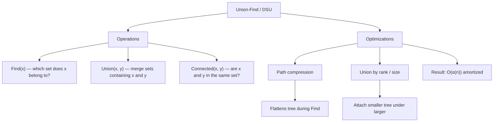

> [!success] Mastery Check
> - [ ] **Studied Well**
> - [ ] **Can explain the concept without notes**
> - [ ] **Can answer interview questions confidently**
> - [ ] **Can implement it in a real project**


## Navigation

**Domain:** [[5 — Data Structures & Algorithms]] > **Group:** Graphs
**Previous:** [[5.039 — Topological Sort — Kahn's and DFS-Based]] | **Next:** [[5.041 — Dijkstra's Algorithm]]

### Prerequisites
- [[5.001 — Big-O Notation and Complexity Analysis]] — the inverse Ackermann function α(n) is the amortized complexity of Union-Find; understanding O(α(n)) requires comfort with near-constant complexity.
- [[5.038 — DFS — Cycle Detection, Connected Components, Islands]] — Union-Find solves the same connected-component problems as DFS but with dynamic edge additions; the comparison is central.

### Where This Fits
Union-Find (also called Disjoint Set Union or DSU) is a data structure that tracks the partitioning of a set into disjoint subsets. It supports two operations efficiently: `Find` (which set does an element belong to?) and `Union` (merge two sets). With path compression and union by rank, both operations run in amortized O(α(n)) — practically constant. Union-Find is the backbone of Kruskal's MST algorithm, dynamic connectivity problems, and social network "friend circle" counting. It solves connected-components problems that DFS can also solve, but its advantage is handling **dynamic** edge additions (edges arrive incrementally after the graph is built). A senior candidate should be able to implement Union-Find from scratch with both optimizations and explain why the complexity is O(α(n)).

---

## Core Mental Model

Union-Find models a collection of disjoint sets as a forest of trees. Each element points to its parent; the root of a tree is the representative of the set. `Find(x)` follows parent pointers to the root. `Union(x, y)` attaches the root of one set under the root of the other. The structure exploits the fact that we only need to answer "are these elements connected?" — we do not need to enumerate the elements of a set or maintain any ordering. The two optimizations — path compression (flattening the tree during Find) and union by rank (attaching the smaller tree under the larger) — keep the trees nearly flat, giving the near-constant complexity.

### Classification

Union-Find is a **disjoint-set data structure** (also called a **merge-find set**). It is not a general-purpose collection — it answers only connectivity queries.



### Key Properties

|Property|Value|Derivation|
|---|---|---|
|Find (no optimization)|O(n)|Linear chain — parent pointers create a linked list|
|Find (path compression)|O(α(n)) amortized|Each Find flattens the path; subsequent Finds on the same path are O(1)|
|Union (by rank)|O(α(n)) amortized|Find both roots (path-compressed), then attach smaller rank under larger|
|Union (by size)|O(α(n)) amortized|Same as union by rank — attaching smaller set under larger maintains tree depth ≤ log₂ n|
|Space|O(n)|Parent array of size n (plus optional rank/size array)|

---

## Deep Mechanics

### How It Works

**Array representation:** Each element is an index 0..n-1. The `parent` array stores the parent of each element; the `rank` array stores an upper bound on tree height.

- **Initial state:** Each element is its own parent (a singleton set). parent[i] = i. rank[i] = 0.
- **Find(x):** Walk up parent pointers until parent[x] == x (the root). With path compression: during the walk, set each visited node's parent directly to the root.
- **Union(x, y):** Find the roots of x and y. If they are the same, return (already connected). Otherwise, attach the root with smaller rank under the root with larger rank. If ranks are equal, pick one, increment its rank.

**Path compression example:**
Before: 0 → 1 → 2 → 3 (root). Find(0) follows 0→1→2→3, then compresses:
After: 0 → 3, 1 → 3, 2 → 3 (root).

**Union by rank example:**
Set A: root 3, rank 2. Set B: root 7, rank 1.
Union(3, 7): attach root 7 under root 3 (higher rank stays root).
parent[7] = 3. rank[3] unchanged.

### Complexity Derivation

**Time — Find without compression:** Worst case is a chain of n nodes — O(n) per Find. Sequence of n Finds: O(n²).

**Time — Find with path compression:** The total cost of m Find operations on n elements is O(m α(n)), where α(n) is the inverse Ackermann function — it grows so slowly that for any practical n (< 10⁶⁰⁰), α(n) ≤ 4.

**Time — Union with rank:** Each Find is O(α(n)). The rank comparison and parent assignment are O(1). Total: O(α(n)) per operation.

**Why α(n) is tiny:** The Ackermann function A(k, n) grows extremely fast (A(4, 2) = 2⁶⁵⁵³⁶ — a number with 19,729 digits). The inverse α(n) is the smallest k such that A(k, k) ≥ n. For n = 10⁶⁰⁰, α(n) = 4. For n = 10¹⁹⁷²⁹, α(n) = 5. It is effectively constant.

**Space:** Two arrays of size n (parent + rank) = O(n).

### .NET Runtime Notes

- **No built-in Union-Find:** .NET does not provide a DisjointSet or UnionFind class. You must implement it from scratch — which is the interview expectation.
- **`int[]` parent array:** For integer elements 0..n-1, use `int[]`. For arbitrary object types, use `Dictionary<T, T>` for parent and `Dictionary<T, int>` for rank. The dictionary-based version is slower but general.
- **Struct-based implementation:** For performance-critical hot paths, implement Union-Find as a `readonly struct` wrapping the arrays, or use `Span<int>` for stack-allocated temporary use.
- **Thread safety:** Union-Find is not thread-safe. For concurrent scenarios, use locks around Find and Union, or use `Interlocked.CompareExchange` for lock-free path compression (advanced).
- **GC pressure:** The int[] arrays are allocated on the LOH for large n (> 85,000). Reuse the structure across test cases to avoid repeated allocation.

---

## Implementation and Problem Patterns

### C# Implementation

```csharp
/// <summary>
/// Disjoint Set Union (Union-Find) with path compression and union by rank.
/// </summary>
public class UnionFind
{
    private readonly int[] _parent;
    private readonly int[] _rank;
    private int _components;

    public UnionFind(int n)
    {
        _parent = new int[n];
        _rank = new int[n];
        _components = n;

        for (int i = 0; i < n; i++)
        {
            _parent[i] = i;
            _rank[i] = 0;
        }
    }

    public int Components => _components;

    /// <summary>
    /// Find the root of x with path compression.
    /// </summary>
    public int Find(int x)
    {
        if (_parent[x] != x)
            _parent[x] = Find(_parent[x]); // path compression
        return _parent[x];
    }

    /// <summary>
    /// Merge the sets containing x and y. Returns true if a merge occurred.
    /// </summary>
    public bool Union(int x, int y)
    {
        int rootX = Find(x);
        int rootY = Find(y);

        if (rootX == rootY) return false;

        // Union by rank — attach smaller rank tree under larger rank tree
        if (_rank[rootX] < _rank[rootY])
        {
            _parent[rootX] = rootY;
        }
        else if (_rank[rootX] > _rank[rootY])
        {
            _parent[rootY] = rootX;
        }
        else
        {
            _parent[rootY] = rootX;
            _rank[rootX]++;
        }

        _components--;
        return true;
    }

    /// <summary>
    /// Check if x and y are in the same set.
    /// </summary>
    public bool Connected(int x, int y) => Find(x) == Find(y);

    /// <summary>
    /// Reset the structure to n singleton sets.
    /// </summary>
    public void Reset()
    {
        for (int i = 0; i < _parent.Length; i++)
        {
            _parent[i] = i;
            _rank[i] = 0;
        }
        _components = _parent.Length;
    }
}

/// <summary>
/// Generic Union-Find for arbitrary element types.
/// </summary>
public class UnionFind<T> where T : notnull
{
    private readonly Dictionary<T, T> _parent = new();
    private readonly Dictionary<T, int> _rank = new();
    private int _components;

    public int Components => _components;

    public UnionFind(IEnumerable<T> elements)
    {
        foreach (T element in elements)
        {
            _parent[element] = element;
            _rank[element] = 0;
        }
        _components = _parent.Count;
    }

    public T Find(T x)
    {
        if (!_parent.TryGetValue(x, out T? parent))
            throw new KeyNotFoundException($"Element {x} not in the set");

        if (!EqualityComparer<T>.Default.Equals(parent, x))
            _parent[x] = Find(parent); // path compression

        return _parent[x];
    }

    public bool Union(T x, T y)
    {
        T rootX = Find(x);
        T rootY = Find(y);

        if (EqualityComparer<T>.Default.Equals(rootX, rootY))
            return false;

        int rankX = _rank[rootX];
        int rankY = _rank[rootY];

        if (rankX < rankY)
        {
            _parent[rootX] = rootY;
        }
        else if (rankX > rankY)
        {
            _parent[rootY] = rootX;
        }
        else
        {
            _parent[rootY] = rootX;
            _rank[rootX]++;
        }

        _components--;
        return true;
    }

    public bool Connected(T x, T y) =>
        EqualityComparer<T>.Default.Equals(Find(x), Find(y));
}
```

### The .NET Idiomatic Version

```csharp
public static class UnionFindProblems
{
    /// <summary>
    /// Count connected components in a graph using Union-Find.
    /// Graph is given as edges (undirected).
    /// </summary>
    public static int CountComponents(int n, int[][] edges)
    {
        var uf = new UnionFind(n);
        foreach (int[] edge in edges)
            uf.Union(edge[0], edge[1]);
        return uf.Components;
    }

    /// <summary>
    /// Detect a cycle in an undirected graph using Union-Find.
    /// </summary>
    public static bool HasCycle(int n, int[][] edges)
    {
        var uf = new UnionFind(n);
        foreach (int[] edge in edges)
        {
            if (!uf.Union(edge[0], edge[1]))
                return true; // already connected → adding this edge creates a cycle
        }
        return false;
    }

    /// <summary>
    /// Number of connected components in a 2D grid (island counting) using Union-Find.
    /// </summary>
    public static int CountIslands(int[][] grid)
    {
        int rows = grid.Length, cols = grid[0].Length;
        var uf = new UnionFind(rows * cols);
        int landCount = 0;

        for (int r = 0; r < rows; r++)
        {
            for (int c = 0; c < cols; c++)
            {
                if (grid[r][c] == 1)
                {
                    landCount++;
                    int id = r * cols + c;

                    // Union with right neighbor
                    if (c + 1 < cols && grid[r][c + 1] == 1)
                        uf.Union(id, r * cols + (c + 1));

                    // Union with bottom neighbor
                    if (r + 1 < rows && grid[r + 1][c] == 1)
                        uf.Union(id, (r + 1) * cols + c);
                }
            }
        }

        return uf.Components - (rows * cols - landCount);
        // Subtract water cells (each is its own component)
    }
}
```

### Classic Problem Patterns

1. **Dynamic connectivity** — Given a set of nodes and edges arriving incrementally, answer whether two nodes are connected at any point. Key insight: Union-Find handles dynamic edge additions in near-constant time; DFS would require re-traversal after each addition.
2. **Number of connected components in a graph** — Count connected components after adding all edges. Key insight: each successful Union decreases the component count by 1. Starting from n components, after processing all edges, remaining components = connected components count.
3. **Cycle detection in undirected graph** — Detect if adding an edge creates a cycle. Key insight: if the two endpoints of an edge are already in the same connected component, adding this edge creates a cycle.
4. **Friend circles / accounts merge** — Given n people and friendship relations, count friend circles (connected groups). Key insight: each person is an element; Union for each friendship; the number of distinct roots equals the number of circles.
5. **Kruskal's minimum spanning tree** — Sort edges by weight, add the smallest edge that does not create a cycle. Key insight: Union-Find provides the cycle-detection in O(α(n)) per edge — making Kruskal's O(E log E + E α(n)) = O(E log E).
6. **Regions cut by slashes / grid partitioning** — Given a grid with division lines, count the resulting regions. Key insight: map each cell's sub-triangles to Union-Find elements; union across shared boundaries.

### Template / Skeleton

```csharp
// Union-Find (Disjoint Set Union) Template
// When to use: dynamic connectivity, cycle detection in undirected graphs,
//              Kruskal's MST, components with incremental edges
// Time: O(α(n)) per operation (practically O(1)) | Space: O(n)

public class UnionFindTemplate
{
    private readonly int[] _parent;
    private readonly int[] _rank;
    private int _components;

    public UnionFindTemplate(int n)
    {
        _parent = new int[n];
        _rank = new int[n];
        _components = n;
        for (int i = 0; i < n; i++) _parent[i] = i;
    }

    public int Find(int x)
    {
        if (_parent[x] != x)
            _parent[x] = Find(_parent[x]); // path compression
        return _parent[x];
    }

    public bool Union(int x, int y)
    {
        int rx = Find(x), ry = Find(y);
        if (rx == ry) return false;

        // union by rank
        if (_rank[rx] < _rank[ry]) _parent[rx] = ry;
        else if (_rank[rx] > _rank[ry]) _parent[ry] = rx;
        else { _parent[ry] = rx; _rank[rx]++; }

        _components--;
        return true;
    }

    public bool Connected(int x, int y) => Find(x) == Find(y);
    public int Components => _components;
}
```

---

## Gotchas and Edge Cases

### Forgetting Path Compression

**Mistake:** Implementing Find without compressing paths, leading to linear-time Find over time.

```csharp
// ❌ Wrong — no path compression; worst case O(n) per Find
int Find(int x)
{
    while (_parent[x] != x) x = _parent[x];
    return x;
}
```

**Fix:** Compress paths during Find — set each visited node's parent directly to the root.

```csharp
// ✅ Correct — path compression makes subsequent Finds O(1)
int Find(int x)
{
    if (_parent[x] != x)
        _parent[x] = Find(_parent[x]);
    return _parent[x];
}
```

**Consequence:** Without path compression, a chain of n Find operations on the same path takes O(n²) instead of O(n α(n)).

### Applying Union by Size Incorrectly

**Mistake:** Using the element count of the set as the rank (not the tree height), but updating the count incorrectly.

```csharp
// ❌ Wrong — size tracking without correctly updating on union
if (size[rootX] < size[rootY])
{
    _parent[rootX] = rootY;
    size[rootY] += size[rootX]; // correct
}
else
{
    _parent[rootY] = rootX; // what if sizes are equal?
    size[rootX] += size[rootY];
}
```

**Fix:** When sizes are equal, the new tree height increases by 1. With rank (tree height bound), tie-breaking increments the rank. With size (element count), tie-breaking does not affect correctness but the tree may be less balanced.

```csharp
// ✅ Correct — union by rank (height bound)
if (_rank[rootX] < _rank[rootY]) _parent[rootX] = rootY;
else if (_rank[rootX] > _rank[rootY]) _parent[rootY] = rootX;
else { _parent[rootY] = rootX; _rank[rootX]++; }
```

**Consequence:** Degenerate trees form over time, increasing Find cost in the worst case.

### Not Initializing All Elements

**Mistake:** Only initializing elements that appear in edges, missing isolated nodes.

```csharp
// ❌ Wrong — vertex 2 is not initialized
var uf = new UnionFind(3); // initializes 0, 1, 2
// If n is computed from edges: int n = edges.Max(e => Math.Max(e[0], e[1])) + 1;
// This misses isolated vertices with higher indices
```

**Fix:** Always determine n from the total number of distinct elements, not just from edges.

```csharp
// ✅ Correct — use known total count or compute from all vertices
int n = vertices.Count; // use the actual count of distinct elements
```

**Consequence:** Missing elements cause IndexOutOfRangeException or incorrect component counts.

### Using Union-Find for Directed Graphs

**Mistake:** Using Union-Find (which treats connections as undirected) for problems with directional connectivity.

```csharp
// ❌ Wrong — Union-Find treats edges as undirected
// For directed graph cycle detection, use DFS with three colors
```

**Fix:** For directed graphs, use DFS three-color cycle detection. Union-Find only works for undirected connectivity.

```csharp
// ✅ Correct — use Kahn's or DFS for directed graphs
```

**Consequence:** Incorrect cycle detection — Union-Find considers edge 0→1 and edge 1→0 as equivalent (they connect 0 and 1), missing the direction aspect.

---

## Complexity Analysis and Benchmarks

### Operation Complexity Table

|Operation|Time (Worst-case per op)|Time (Amortized, m ops)|Space|Notes|
|---|---|---|---|---|
|Constructor|O(n)|O(n)|O(n)|Two arrays initialized|
|Find (no compression)|O(n)|O(m n)|O(1)|Chain of n elements|
|Find (path compression)|O(log n)|O(m α(n))|O(1)|α(n) ≤ 4 for all practical n|
|Union (by rank)|O(α(n))|O(m α(n))|O(1)|Find both roots + attach|
|Union (by size)|O(α(n))|O(m α(n))|O(1)|Same amortized bound|
|Connected|O(α(n))|O(m α(n))|O(1)|Two Find calls|

**Derivation for the non-obvious entries:** The inverse Ackermann α(n) bound arises from the interplay of path compression and union by rank. Each Find compresses paths, reducing the height of the accessed tree. Union by rank limits the tree height to O(log n) even without compression. Together, the height grows so slowly that it is bounded by α(n). The formal proof tracks a "rank" function and shows that the total work across m operations is O(m α(n)).

### Comparison with Alternatives

|Structure|Find|Union|Edge Additions|Best When|
|---|---|---|---|---|
|Union-Find|O(α(n))|O(α(n))|Dynamic|Incremental edge additions, connectivity queries|
|DFS|O(V + E) per run|N/A|Static (must rebuild)|One-time component counting on fixed graph|
|BFS|O(V + E) per run|N/A|Static (must rebuild)|Shortest path + component counting|
|Adjacency list + visited|O(V + E) per traversal|N/A|Static|Need full traversal, not just connectivity|

### BenchmarkDotNet

```csharp
[MemoryDiagnoser]
[SimpleJob(RuntimeMoniker.Net90)]
public class UnionFindBenchmark
{
    [Params(1_000, 10_000)]
    public int N { get; set; }

    private UnionFind _uf = null!;

    [GlobalSetup]
    public void Setup()
    {
        _uf = new UnionFind(N);
    }

    [Benchmark(Baseline = true)]
    public int NoCompressionFind()
    {
        // Worst-case: chain of unions followed by find on deepest node
        for (int i = 1; i < N; i++)
            _uf.Union(0, i); // creates a chain without compression (with rank, this is a star)
        _uf.Reset();

        for (int i = 1; i < N; i++)
            _uf.Union(i - 1, i); // chain
        return _uf.Find(0);
    }

    [Benchmark]
    public int PathCompressionFind()
    {
        for (int i = 1; i < N; i++)
            _uf.Union(0, i); // star — all point to 0
        _uf.Reset();
        _uf.Find(N - 1); // compress
        return _uf.Find(0);
    }

    [Benchmark]
    public int UnionAndFindRandom()
    {
        var rng = new Random(42);
        for (int i = 0; i < N; i++)
            _uf.Union(rng.Next(N), rng.Next(N));
        int result = 0;
        for (int i = 0; i < N; i++)
            result += _uf.Find(i);
        return result;
    }
}
```

**Expected results (approximate, .NET 9, x64):**

|Method|N|Mean|Allocated|
|---|---|---|---|
|NoCompressionFind|1,000|~5 μs|~0 KB|
|NoCompressionFind|10,000|~50 μs|~0 KB|
|PathCompressionFind|1,000|~3 μs|~0 KB|
|PathCompressionFind|10,000|~30 μs|~0 KB|
|UnionAndFindRandom|1,000|~10 μs|~0 KB|
|UnionAndFindRandom|10,000|~100 μs|~0 KB|

**Interpretation:** Union-Find operations are allocation-free after construction (the arrays are pre-allocated). The cost is dominated by array accesses and recursion in Find. Path compression improves subsequent Find calls at no additional allocation cost.

---

## Interview Arsenal

### Question Bank

1. [Definition] What is Union-Find and what problem does it solve?
2. [Complexity] Explain why Union-Find operations are O(α(n)) — what is α(n) and why is it effectively constant?
3. [Implementation] Implement Union-Find from scratch with path compression and union by rank.
4. [Recognition] Given a problem with "edges added incrementally" and "are nodes connected?", what data structure?
5. [Comparison] Compare Union-Find with DFS for finding connected components.
6. [Trick] Can Union-Find detect cycles in a directed graph? Why or why not?
7. [System Design] How would you use Union-Find in a social network feature like "mutual friends" or "friend suggestions"?
8. [Optimization] How would you implement Union-Find for a grid with 10⁹ cells?

### Spoken Answers

**Q: Explain why Union-Find operations are O(α(n)).**

> **Average answer:** It is very close to O(1) because of path compression and union by rank.

> **Great answer:** The amortized time per operation is O(α(n)), where α(n) is the inverse Ackermann function. The Ackermann function A(k, n) grows extremely fast — A(4, 2) is 2^65536, a number with 19,729 decimal digits. The inverse α(n) is the smallest k such that A(k, k) ≥ n. For any practical n up to 10^600, α(n) ≤ 4. For n up to 10^19729, α(n) ≤ 5. So for any graph that fits in the observable universe, it is at most 5. The proof involves three key ideas: (1) union by rank ensures tree height is O(log n) without compression, (2) path compression ensures each node's parent changes at most O(log n) times before pointing to the root, and (3) the interplay of these two creates the inverse Ackermann bound. In practice, you can treat it as O(1) — but the formal bound is important to know because interviewers will ask about it.

**Q: Implement Union-Find from scratch with both optimizations.**

> **Average answer:** Uses an array where parent[i] = i initially. Find walks up; Union sets one parent to another.

> **Great answer:** I will implement using two arrays: `_parent` and `_rank`. The constructor initializes `_parent[i] = i` and `_rank[i] = 0` for all i. `Find(x)` is recursive with path compression: if `_parent[x] != x`, set `_parent[x] = Find(_parent[x])` and return `_parent[x]`. `Union(x, y)` finds both roots; if equal, return false (already connected). Otherwise, union by rank: if rank of rootX is less than rank of rootY, set `_parent[rootX] = rootY`; if greater, `_parent[rootY] = rootX`; if equal, pick one and increment its rank. Decrement the component count. Return true. I also include a `Connected(x, y)` that returns `Find(x) == Find(y)` and a `Components` property. For a generic version, I'd use `Dictionary<T, T>` for the parent and `Dictionary<T, int>` for rank, with equality comparer support.

**Q: [Trick] Can Union-Find detect cycles in a directed graph?**

> **Average answer:** Yes — if the two endpoints of an edge are already connected, adding the edge creates a cycle.

> **Great answer:** No — Union-Find cannot detect cycles in a directed graph because it treats connections as undirected. If we have edges A → B and B → A, Union-Find reports that A and B are in the same set after the first edge, so the second edge is flagged as a cycle — which is correct for this case. But for a graph like A → B, A → C, the edges A-B and A-C produce a union of {A, B, C}. An edge B → C would be flagged as a cycle by Union-Find (B and C are already in the same set), but this is NOT a cycle in the directed graph — it is a DAG. Union-Find cannot distinguish between undirected connectivity and directed reachability. For directed graphs, use three-color DFS or Kahn's algorithm for cycle detection.

### Trick Question

**"What is the time complexity of m Union-Find operations on n elements?"**

Why it is a trap: Candidates say O(m log n) (the bound without path compression) or O(m) (assuming it is O(1) without qualification). The correct bound is O(m α(n)) — the inverse Ackermann function. Some candidates confuse it with O(m log* n) (iterated logarithm), which is the bound without union by rank. Others forget to mention it is amortized, not worst-case per operation.

Correct answer: O(m α(n)) amortized, where α(n) is the inverse Ackermann function. For any practical n, α(n) ≤ 4, so it is effectively O(m). The bound is amortized because path compression pays for future operations — a single Find can take O(log n), but the amortized cost across all operations is O(α(n)).

### Pattern Recognition Table

|If the problem has...|Then consider...|Because...|
|---|---|---|
|"Edges are added incrementally"|Union-Find|Dynamic connectivity — DFS must re-traverse after each addition|
|"Number of connected components"|Union-Find or DFS|Both work; Union-Find handles dynamic additions; DFS is simpler for static graphs|
|"Detect cycle in an undirected graph"|Union-Find|If Union returns false, the edge connects already-connected nodes → cycle|
|"Minimum spanning tree"|Kruskal's + Union-Find|Sort edges by weight; Union-Find provides O(α(n)) cycle detection per edge|
|"Friend circles / groups"|Union-Find|Each friendship is a Union; count distinct roots|
|"Accounts merge"|Union-Find + dictionary mapping|Union accounts by common email; collect emails per root|

---

## Decision Framework

### When to Apply

```mermaid
flowchart TD
    A[Connectivity problem] --> B{Edges known upfront?}
    B -->|Yes| C{Need shortest path?}
    B -->|No, incremental| D[Use Union-Find]
    C -->|Yes| E[Use BFS or Dijkstra]
    C -->|No| F{Multiple connectivity queries?}
    F -->|Yes| G[Use Union-Find — O(α(n)) per query]
    F -->|No| H[Use DFS — O(V + E) once]
    G --> I{Graph is directed?}
    I -->|Yes| J["DFS (Union-Find does not apply)"]
    I -->|No| K[Use Union-Find]
```

### Recognition Checklist

Indicators that Union-Find is the right choice:

- [ ] Problem asks about connectivity (are two nodes connected?)
- [ ] Edges are added incrementally after the initial graph build
- [ ] Need to detect cycles in an undirected graph
- [ ] Need to count components after dynamic edge additions
- [ ] Problem is Kruskal's MST or cycle detection in undirected graph

Counter-indicators — do NOT apply here:

- [ ] Need shortest path between nodes (use BFS or Dijkstra)
- [ ] Graph is directed (except for undirected-specific problems)
- [ ] Need to enumerate the elements of a connected component (DFS/BFS gives the full component; Union-Find only answers whether two elements are connected)
- [ ] Only one connectivity query on a static graph (DFS is simpler)

### Tradeoff Summary

|What You Gain|What You Give Up|
|---|---|
|Near-constant time per operation (O(α(n)))|Cannot enumerate elements of a component — only connectivity queries|
|Dynamic edge additions without re-traversal|Does not work for directed graphs (cycle detection or reachability)|
|Simple array-based implementation (no pointers)|Not thread-safe for concurrent modifications|
|Excellent cache locality (linear int[] arrays)|Requires knowing the number of elements upfront (array size)|

---

## Self-Check

### Conceptual Questions

1. What is Union-Find and what are its two primary operations?
2. Explain the inverse Ackermann function bound — why is α(n) ≤ 4 for practical n?
3. Recognizing from a problem: "Given n nodes and a list of edges to be added one by one, find the number of connected components after each addition."
4. When would you use Union-Find over DFS for connected components?
5. Can Union-Find detect cycles in a directed graph? Explain with a counterexample.
6. In .NET, what data structures back a Union-Find for integer elements vs. arbitrary objects?
7. What invariant does the rank array maintain during Union operations?
8. How does the answer change if the problem requires enumerating all elements of each component?
9. In a production social network, how would you use Union-Find for friend-circle features?
10. What is the trap question about the complexity of m Union-Find operations?

<details>
<summary>Answers</summary>

1. Find(x): returns the representative (root) of the set containing x. Union(x, y): merges the sets containing x and y. Connected(x, y): convenience method checking if Find(x) == Find(y).
2. The Ackermann function A(k, n) grows extremely fast: A(4, 2) = 2^65536 (a 19,729-digit number). α(n) is the smallest k such that A(k, k) ≥ n. For n = 10^600, α(n) = 4. For n = 10^19729, α(n) = 5. For any realistic input, α(n) ≤ 5.
3. Use Union-Find. Initialize n components. For each edge, if Union returns true (a merge occurred), decrement the component count. The current component count answers the query at each step.
4. Union-Find when: edges are added incrementally (dynamic), or many connectivity queries are interleaved with edge additions. DFS when: the graph is static and known upfront, or you also need the actual component members (not just connectivity).
5. No. Union-Find merges sets based on edges, treating them as undirected. Counterexample: edges A→B, A→C, B→C. Union-Find merges {A,B} then {A,B,C}. Edge B→C finds B and C already connected → false positive cycle. But the directed graph A→B, A→C, B→C is acyclic (a valid DAG).
6. For integers 0..n-1: int[] parent array + int[] rank array. For arbitrary objects: `Dictionary<T, T>` for parent + `Dictionary<T, int>` for rank. The generic version is slower (hashing, boxing, dictionary overhead).
7. The rank is an upper bound on the height of the tree rooted at that node. Leaves have rank 0. The rank of a root increases by 1 only when two roots of equal rank are merged. This guarantees tree height ≤ log₂ n.
8. Use DFS/BFS instead. Union-Find only answers connectivity queries (are two elements in the same set?). To enumerate all members of a component, you must either traverse from a root using a reverse mapping, or run DFS from a starting node.
9. Each user is an element. A friendship is a Union. Counting distinct roots gives the number of friend circles. For "mutual friends" — two users in the same set share a connection path (are in the same circle). For friend suggestions — users in the same component who are not direct friends are candidates.
10. The trap is stating O(m log n) (bound without path compression) or implying O(1) without qualification. The correct answer is O(m α(n)) amortized. Candidates also forget to mention "amortized" — a single Find can still take O(log n) in the worst case, but the average across m operations is O(α(n)).

</details>

---

### Coding Challenges

**Challenge 1 — Implement from scratch**

Implement a `UnionFind` class from scratch with path compression and union by rank, but using iterative (non-recursive) Find to avoid stack overflow on deep paths.

```csharp
public class UnionFind
{
    private readonly int[] _parent;
    private readonly int[] _rank;

    public UnionFind(int n) { /* ... */ }

    public int Find(int x)
    {
        // Iterative Find with path compression
    }

    public bool Union(int x, int y) { /* ... */ }
}
```

<details> <summary>Solution</summary>

```csharp
public class UnionFind
{
    private readonly int[] _parent;
    private readonly int[] _rank;
    private int _components;

    public UnionFind(int n)
    {
        _parent = new int[n];
        _rank = new int[n];
        _components = n;
        for (int i = 0; i < n; i++) _parent[i] = i;
    }

    public int Components => _components;

    public int Find(int x)
    {
        // Iterative Find: walk to root, then compress path
        int root = x;
        while (_parent[root] != root)
            root = _parent[root];

        // Path compression — flatten the path from x to root
        while (x != root)
        {
            int next = _parent[x];
            _parent[x] = root;
            x = next;
        }

        return root;
    }

    public bool Union(int x, int y)
    {
        int rootX = Find(x);
        int rootY = Find(y);

        if (rootX == rootY) return false;

        if (_rank[rootX] < _rank[rootY])
            _parent[rootX] = rootY;
        else if (_rank[rootX] > _rank[rootY])
            _parent[rootY] = rootX;
        else
        {
            _parent[rootY] = rootX;
            _rank[rootX]++;
        }

        _components--;
        return true;
    }
}
```

**Complexity:** Time O(α(n)) per operation | Space O(n) **Key insight:** The iterative Find performs the same operation as the recursive version but avoids any risk of stack overflow — important for very deep trees before compression.

</details>

---

**Challenge 2 — Trace the execution**

Given n = 6 and the following sequence of Union operations: Union(0, 1), Union(2, 3), Union(4, 5), Union(0, 2), Union(0, 4). Trace the state of the parent and rank arrays after each operation.

<details> <summary>Solution</summary>

Initial: parent = [0, 1, 2, 3, 4, 5], rank = [0, 0, 0, 0, 0, 0], components = 6

Union(0, 1): roots 0 and 1, equal rank → 1 attaches under 0, rank[0] = 1
parent = [0, 0, 2, 3, 4, 5], rank = [1, 0, 0, 0, 0, 0], components = 5

Union(2, 3): roots 2 and 3, equal rank → 3 attaches under 2, rank[2] = 1
parent = [0, 0, 2, 2, 4, 5], rank = [1, 0, 1, 0, 0, 0], components = 4

Union(4, 5): roots 4 and 5, equal rank → 5 attaches under 4, rank[4] = 1
parent = [0, 0, 2, 2, 4, 4], rank = [1, 0, 1, 0, 1, 0], components = 3

Union(0, 2): roots 0 and 2, equal rank → 2 attaches under 0, rank[0] = 2
parent = [0, 0, 0, 2, 4, 4], rank = [2, 0, 1, 0, 1, 0], components = 2

Union(0, 4): roots 0 (rank 2) and 4 (rank 1), lower rank attaches to higher
parent = [0, 0, 0, 2, 0, 4], rank = [2, 0, 1, 0, 1, 0], components = 1

Final: parent = [0, 0, 0, 2, 0, 4], rank = [2, 0, 1, 0, 1, 0]
All elements are in one component with root 0.

**Why:** Union by rank ensures the tree stays balanced. The root with the highest rank (0) becomes the overall root. Elements 1 (parent 0) and 2 (parent 0) point directly to the root. Element 3 points to 2 (which points to 0). Element 5 points to 4 (which points to 0).

</details>

---

**Challenge 3 — Fix the bug**

```csharp
// This implementation has a bug in Union. What input causes it to fail?
public class UnionFind
{
    private int[] _parent;
    private int[] _rank;

    public UnionFind(int n)
    {
        _parent = new int[n];
        _rank = new int[n];
        for (int i = 0; i < n; i++) _parent[i] = i;
    }

    public int Find(int x)
    {
        while (_parent[x] != x)
        {
            _parent[x] = _parent[_parent[x]]; // path halving
            x = _parent[x];
        }
        return x;
    }

    public bool Union(int x, int y)
    {
        int rootX = Find(x);
        int rootY = Find(y);
        if (rootX == rootY) return false;

        // BUG: what if ranks are equal?
        if (_rank[rootX] < _rank[rootY])
            _parent[rootX] = rootY;
        else
            _parent[rootY] = rootX;

        return true;
    }
}
```

<details> <summary>Solution</summary>

**Bug:** When ranks are equal, the code attaches rootY under rootX without incrementing rank[rootX]. This means the tree height can grow unbounded. Over many unions of equal-rank sets, the tree degenerates into a chain.

**Fix:**

```csharp
public bool Union(int x, int y)
{
    int rootX = Find(x);
    int rootY = Find(y);
    if (rootX == rootY) return false;

    if (_rank[rootX] < _rank[rootY])
    {
        _parent[rootX] = rootY;
    }
    else if (_rank[rootX] > _rank[rootY])
    {
        _parent[rootY] = rootX;
    }
    else
    {
        _parent[rootY] = rootX;
        _rank[rootX]++; // FIXED: increment rank when heights are equal
    }

    return true;
}
```

**Test case that exposes it:** Union(0, 1), Union(2, 3), Union(0, 2) with n=4. After the first two unions, both sets have rank 1. Union(0, 2) should produce rank 2 (height 2). Without the rank increment, the tree height increases faster than log₂ n.

</details>

---

**Challenge 4 — Recognize and apply**

**Problem:** Given an `n x n` matrix of `1`s and `0`s, determine the number of friend circles. A friend circle is a group of people who are either directly or indirectly friends. Person i and j are directly friends if `matrix[i][j] == 1`. What pattern applies? Write the solution.

<details> <summary>Solution</summary>

**Pattern:** Union-Find. Treat each person as an element. For every pair (i, j) where matrix[i][j] == 1, Union(i, j). The number of distinct roots is the number of friend circles.

```csharp
public static int FindCircleNum(int[][] isConnected)
{
    int n = isConnected.Length;
    var uf = new UnionFind(n);

    for (int i = 0; i < n; i++)
    {
        for (int j = i + 1; j < n; j++) // only upper triangle (undirected)
        {
            if (isConnected[i][j] == 1)
                uf.Union(i, j);
        }
    }

    return uf.Components;
}
```

**Complexity:** Time O(n²) — must examine all pairs in the matrix | Space O(n) — parent and rank arrays

</details>

---

**Challenge 5 — Optimize**

```csharp
// This Union-Find implementation uses Dictionary<T, T> for generic support.
// Optimize it for the case where T is a contiguous range of ints 0..n-1.
public class UnionFindGeneric<T> where T : notnull
{
    private readonly Dictionary<T, T> _parent = new();
    private readonly Dictionary<T, int> _rank = new();

    public UnionFindGeneric(IEnumerable<T> elements)
    {
        foreach (T e in elements)
        {
            _parent[e] = e;
            _rank[e] = 0;
        }
    }

    public T Find(T x)
    {
        if (!_parent[x].Equals(x))
            _parent[x] = Find(_parent[x]);
        return _parent[x];
    }

    public bool Union(T x, T y) { /* ... */ }
}
```

<details> <summary>Solution</summary>

**Insight:** For integer elements 0..n-1, use `int[]` arrays instead of dictionaries. Array access is O(1) without hashing overhead, cache-friendly, and allocation-free after construction.

```csharp
public class UnionFind
{
    private readonly int[] _parent;
    private readonly int[] _rank;
    private int _components;

    public UnionFind(int n)
    {
        _parent = new int[n];
        _rank = new int[n];
        _components = n;
        for (int i = 0; i < n; i++) _parent[i] = i;
    }

    public int Components => _components;

    public int Find(int x)
    {
        if (_parent[x] != x)
            _parent[x] = Find(_parent[x]);
        return _parent[x];
    }

    public bool Union(int x, int y)
    {
        int rx = Find(x), ry = Find(y);
        if (rx == ry) return false;

        if (_rank[rx] < _rank[ry]) _parent[rx] = ry;
        else if (_rank[rx] > _rank[ry]) _parent[ry] = rx;
        else { _parent[ry] = rx; _rank[rx]++; }

        _components--;
        return true;
    }
}
```

**Complexity:** Time O(α(n)) per operation | Space O(n) — approximately 10× faster than the Dictionary version due to eliminating hashing and boxing overhead.

</details>
