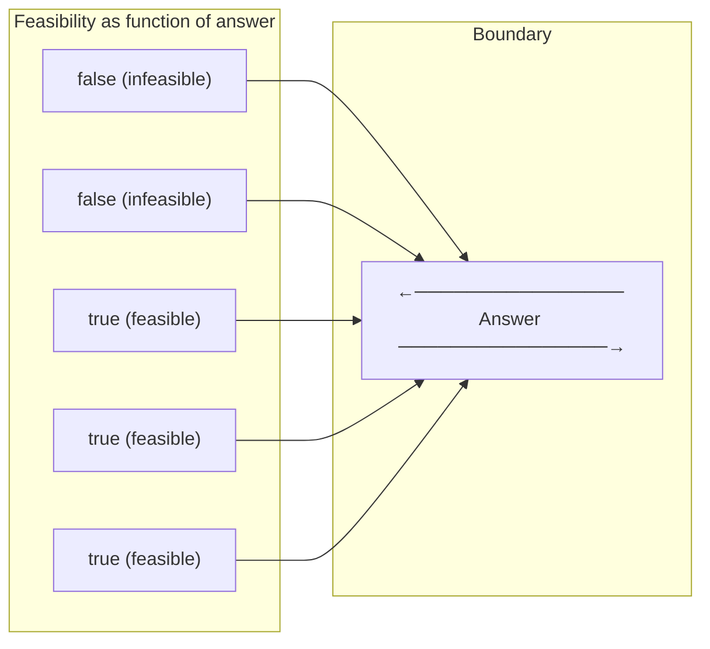

> [!success] Mastery Check
> - [ ] **Studied Well**
> - [ ] **Can explain the concept without notes**
> - [ ] **Can answer interview questions confidently**
> - [ ] **Can implement it in a real project**


## Navigation

**Domain:** [[5 — Data Structures & Algorithms]] > **Group:** Binary Search
**Previous:** [[5.046 — Binary Search — Classic Implementation and Off-by-One Discipline]] | **Next:** [[5.049 — Comparison-Based Sorting — Merge Sort, Quick Sort, Heap Sort]]

### Prerequisites
- [[5.046 — Binary Search — Classic Implementation and Off-by-One Discipline]] — binary search on the answer is the same algorithm applied to a predicate space rather than an array; the off-by-one discipline transfers directly.

### Where This Fits
Binary search on the answer transforms an optimization problem ("find the minimum X such that...") into a decision problem ("can we achieve X?"). This technique is the single most important extension of binary search — it applies when the answer space is monotonic: if a candidate answer works, then any larger (or smaller) answer also works. It appears in problems ranging from "split array largest sum" to "koko eating bananas" to "ship packages within D days" — all of which share the structure of finding a threshold value in a continuous or discrete search space. A senior candidate must recognize the monotonic predicate pattern and write the feasible() function with confidence.

---

## Core Mental Model

Binary search on the answer treats the solution space as a sorted array of candidate answers. Instead of searching for a target value in an existing array, you define a predicate function `bool Feasible(candidate)` that is monotonic — once it becomes true for some value, it stays true for all values on one side. The binary search then finds the boundary where the predicate flips from false to true (or true to false). The answer is the first (or last) value where the predicate holds.

### Classification

Binary search on the answer is an **optimization-to-decision reduction** within the search paradigm. It exploits the property of **monotonicity** in the answer space. It belongs to the broader class of **parametric search** algorithms.



The boundary is always a transition from false to true (or true to false). Binary search finds this boundary in O(log R) evaluations of the predicate, where R is the size of the answer space.

### Key Properties

|Property|Value|Derivation|
|---|---|---|
|Predicate evaluations|O(log R)|Each evaluation halves the answer search range; R is the range of possible answers|
|Feasibility check complexity|Depends on problem|The function Feasible(mid) is a greedy simulation or simple O(n) validation|
|Space|O(1)|No auxiliary data structure; only left, right, mid indices|
|Answer space must be|Bounded|Lower and upper bounds on the answer must be computable|

---

## Deep Mechanics

### How It Works

Binary search on the answer replaces the question "is X at index i?" with "is answer X feasible?" The search proceeds over the integer or real-valued answer space.

**Step-by-step on "Koko Eating Bananas" example:**

Problem: Given piles = [3, 6, 7, 11] and h = 8, find the minimum integer eating speed k such that all bananas are eaten in at most 8 hours.

Answer space: k ranges from 1 to max(piles) = 11.

```
Initial range: left = 1, right = 11
mid = (1+11)/2 = 6

Feasible(6)? Hours needed: ceil(3/6)+ceil(6/6)+ceil(7/6)+ceil(11/6)
                        = 1 + 1 + 2 + 2 = 6 hours. 6 ≤ 8 → feasible.
Too fast — can we go slower? Set right = mid = 6.

mid = (1+6)/2 = 3
Feasible(3)? Hours: ceil(3/3)+ceil(6/3)+ceil(7/3)+ceil(11/3)
                 = 1 + 2 + 3 + 4 = 10 hours. 10 > 8 → not feasible.
Too slow. Set left = mid + 1 = 4.

mid = (4+6)/2 = 5
Feasible(5)? Hours: ceil(3/5)+ceil(6/5)+ceil(7/5)+ceil(11/5)
                 = 1 + 2 + 2 + 3 = 8 hours. 8 ≤ 8 → feasible.
Can we go slower? Set right = mid = 5.

mid = (4+5)/2 = 4
Feasible(4)? Hours: ceil(3/4)+ceil(6/4)+ceil(7/4)+ceil(11/4)
                 = 1 + 2 + 2 + 3 = 8 hours. 8 ≤ 8 → feasible.
Set right = mid = 4.

left = 4, right = 4 → convergence. Answer = 4.
```

The predicate `Feasible(k)` is monotonic: once a speed k works, all speeds > k also work (more bananas per hour cannot hurt).

### Complexity Derivation

**Time:** Each iteration narrows the range from R to R/2. Number of iterations: O(log R). Each iteration evaluates the predicate — typically O(n) for a linear scan of the input (e.g., summing hours across all piles). Total: O(n log R).

For integer answer spaces, log₂(R) iterations where R = upper - lower bound. R is typically max(input) - 1 or sum(input) - 1, so log R ≤ 30 for R ≤ 10⁹ — the constant is tiny. The real work is always in the feasibility function.

**Space:** O(1) — only the search boundaries. The feasibility function may allocate O(1) or O(n) depending on the problem, but in the standard pattern it uses only a few loop variables.

### Why This Pattern Exists

The brute force for optimization problems is to try every possible answer from 1 to R, evaluating the predicate each time — O(R × FeasibleCost). For R up to 10⁹ (e.g., a sum of array elements or a range of weights), this is impossible. Binary search reduces the number of evaluations from R to log R — turning 10⁹ trials into ~30. The insight is that most optimization problems have a monotonic feasibility function, and once you observe that property, you can shrink the search space exponentially.

---

## Implementation and Problem Patterns

### C# Implementation

```csharp
/// <summary>
/// Binary search on the answer template.
/// Finds the minimum feasible value in [low, high] where Feasible is monotonic.
/// </summary>
public static int BinarySearchOnAnswer(int low, int high, Func<int, bool> feasible)
{
    int left = low, right = high;

    while (left < right)
    {
        int mid = left + (right - left) / 2;  // Prevents overflow

        if (feasible(mid))
            right = mid;   // mid works, try lower
        else
            left = mid + 1; // mid does not work, must go higher
    }

    return left;  // left == right == first feasible value
}

// Variant: maximum feasible value (predicate goes true→false)
public static int BinarySearchMaxFeasible(int low, int high, Func<int, bool> feasible)
{
    int left = low, right = high;

    while (left < right)
    {
        int mid = left + (right - left + 1) / 2;  // Upper mid to avoid infinite loop

        if (feasible(mid))
            left = mid;   // mid works, try higher
        else
            right = mid - 1; // mid does not work, must go lower
    }

    return left;
}

/// <summary>
/// Koko Eating Bananas — find minimum integer speed.
/// </summary>
public int MinEatingSpeed(int[] piles, int h)
{
    int low = 1;
    int high = piles.Max();  // Upper bound: eat the largest pile in 1 hour

    return BinarySearchOnAnswer(low, high, k =>
    {
        long hours = 0;
        foreach (int pile in piles)
            hours += (pile + k - 1) / k;  // ceiling division

        return hours <= h;
    });
}

/// <summary>
/// Split Array Largest Sum — find minimized largest sum.
/// </summary>
public int SplitArray(int[] nums, int k)
{
    int low = nums.Max();               // At least the max element
    int high = nums.Sum();              // At most the total sum

    return BinarySearchOnAnswer(low, high, maxSum =>
    {
        int count = 1;
        int current = 0;

        foreach (int num in nums)
        {
            if (current + num > maxSum)
            {
                count++;
                current = num;
            }
            else
            {
                current += num;
            }
        }

        return count <= k;
    });
}

/// <summary>
/// Capacity To Ship Packages Within D Days — find minimum capacity.
/// </summary>
public int ShipWithinDays(int[] weights, int days)
{
    int low = weights.Max();             // At least the heaviest package
    int high = weights.Sum();            // At most one trip

    return BinarySearchOnAnswer(low, high, capacity =>
    {
        int count = 1;
        int current = 0;

        foreach (int w in weights)
        {
            if (current + w > capacity)
            {
                count++;
                current = w;
            }
            else
            {
                current += w;
            }
        }

        return count <= days;
    });
}
```

### The .NET Idiomatic Version

Binary search on the answer does not map to a built-in .NET method because the "array" is the abstract answer space, not a physical collection. However, `Array.BinarySearch` and `List<T>.BinarySearch` embody the same logic — they search an abstract index space `[0, n-1]` using a predicate (the comparer). The mental model is identical: reduce the search range until the transition point is found.

### Classic Problem Patterns

- **Minimize maximum** — "Find the minimum X such that the array can be split into k subarrays with each sum ≤ X." The feasibility check greedily splits, and X is the max sum allowed. Feasibility is monotonic: larger max sum always makes splitting easier.
- **Maximize minimum** — "Find the maximum distance X such that cows can be placed at stalls with distance ≥ X." Feasibility checks if we can place all cows with at least X gap. Monotonic: larger distance is harder to satisfy.
- **Rate problems** — "Find the minimum rate/speed X such that a task completes within a time limit." The feasibility function simulates the process at rate X. Monotonic: higher speed always finishes faster.
- **Threshold search** — "Find the smallest X such that f(X) ≥ target." The feasibility function computes f(X). Monotonic: f is non-decreasing.
- **Real-valued answer** — "Find the square root of N to 10⁻⁶ precision." The answer space is continuous; the binary search runs for a fixed number of iterations (e.g., 60 for double precision) or until the range is narrow enough.

### Template / Skeleton

```csharp
// Binary Search on the Answer
// When to use: optimization problem asking for min X or max X with a monotonic feasibility check
// Time: O(log R × FeasibleCost) | Space: O(1)

public int MinimizeX(int[] input, int constraint)
{
    // Step 1: Define bounds
    int low = ComputeLowerBound(input);   // Smallest possible answer
    int high = ComputeUpperBound(input);  // Largest possible answer

    // Step 2: Binary search over [low, high]
    while (low < high)
    {
        int mid = low + (high - low) / 2;  // Lower mid for min-feasible pattern

        if (Feasible(input, mid, constraint))
            high = mid;   // mid works, try lower
        else
            low = mid + 1; // mid fails, must go higher
    }

    return low;  // Minimum feasible value

    // ————————————————————
    // Feasibility function — problem-specific
    // ————————————————————
    static bool Feasible(int[] input, int candidate, int constraint)
    {
        // TODO: implement the greedy check
        // Return true if "candidate" satisfies the constraint
        return true;
    }

    static int ComputeLowerBound(int[] input)
    {
        // TODO: return the theoretical minimum answer
        return 0;
    }

    static int ComputeUpperBound(int[] input)
    {
        // TODO: return the theoretical maximum answer
        return int.MaxValue;
    }
}
```

---

## Gotchas and Edge Cases

### Wrong Mid Computation

**Mistake:** Using `mid = (left + right) / 2` which overflows for large ranges.

```csharp
// ❌ Wrong — overflows when left + right > int.MaxValue
int mid = (left + right) / 2;
```

**Fix:** Use the safe pattern `mid = left + (right - left) / 2`.

```csharp
// ✅ Correct
int mid = left + (right - left) / 2;  // Never overflows
```

**Consequence:** Integer overflow wraps to negative, causing mid < left and breaking the search — either infinite loop or wrong result.

### Infinite Loop in Max-Feasible Pattern

**Mistake:** Using the lower-mid formula when searching for the maximum feasible value.

```csharp
// ❌ Wrong — infinite loop when left + 1 == right and feasible(mid) is true
int mid = left + (right - left) / 2;  // Lower mid
if (feasible(mid)) left = mid;        // left stays same → infinite loop
```

**Fix:** Use the upper-mid formula for the max-feasible pattern.

```csharp
// ✅ Correct
int mid = left + (right - left + 1) / 2;  // Upper mid
if (feasible(mid)) left = mid;
else right = mid - 1;
```

**Consequence:** When `left + 1 == right` and `feasible(left)` is true, the lower-mid rounds down to `left`, `left = mid` does not move, and the loop never terminates.

### Wrong Bounds on Answer Space

**Mistake:** Setting `low` too low or `high` too high, causing incorrect results or unnecessary iterations.

```csharp
// ❌ Wrong — low = 0 allows an infeasible answer to be returned
int low = 0;  // Eating speed 0 is impossible
```

**Fix:** Ensure the bounds are tight and correct — `low` must be feasible for some (but not necessarily all) cases, and `high` must always be feasible.

```csharp
// ✅ Correct — low is the minimum possible answer that could work
int low = 1;  // Minimum eating speed must be at least 1
```

**Consequence:** If `low` is infeasible and the predicate is never true at `mid`, the search returns `low` — a wrong answer that may pass basic tests but fail edge cases.

### Feasibility Function Not Monotonic

**Mistake:** Applying binary search on the answer when the predicate is not monotonic.

```csharp
// ❌ Wrong — isFeasible(k) may be true, false, true for increasing k
// Binary search will converge to a wrong value
```

**Fix:** Verify monotonicity before writing the binary search. The predicate must satisfy: if `feasible(x)` is true, then `feasible(x + delta)` is also true (for min-feasible pattern). If the function oscillates, binary search is incorrect.

```csharp
// ✅ Correct — prove monotonicity first
// For eating speed: if speed k works, speed k+1 also works (strictly faster)
```

**Consequence:** Binary search converges but to an arbitrary value — the predicate violation means the answer is meaningless.

---

## Complexity Analysis and Benchmarks

### Operation Complexity Table

|Operation|Time (Best)|Time (Average)|Time (Worst)|Space|Notes|
|---|---|---|---|---|---|
|Predicate evaluation (Koko)|O(n)|O(n)|O(n)|O(1)|Single pass over piles; ceiling division per element|
|Predicate evaluation (Split Array)|O(n)|O(n)|O(n)|O(1)|Greedy split simulation|
|Binary search iterations|O(1)|O(log R)|O(log R)|O(1)|~30 iterations for 10⁹ range|
|Overall (Koko)|O(n log R)|O(n log R)|O(n log R)|O(1)|n passes × log R iterations|

**Derivation for the non-obvious entries:** The number of binary search iterations is `ceil(log₂(high - low + 1))`. For `Split Array`, the range is `[max(nums), sum(nums)]`. In the worst case, `max ≈ sum/n`, so the range is ~sum. For sum ≤ 10⁹, iterations ≤ 30.

### Comparison with Alternatives

|Approach|Time|Space|Best When|
|---|---|---|---|
|Binary Search on Answer|O(n log R)|O(1)|Monotonic predicate; answer space is large|
|Greedy (single pass)|O(n)|O(1)|Answer is directly computable without search|
|Brute force enumeration|O(n × R)|O(1)|R is tiny (≤ 10⁴)|
|DP|O(n × R)|O(nR)|N ≤ 100 and no monotonic property|

### BenchmarkDotNet

```csharp
[MemoryDiagnoser]
[SimpleJob(RuntimeMoniker.Net90)]
public class BinarySearchAnswerBenchmark
{
    private int[] _weights = null!;

    [Params(1_000, 10_000, 100_000)]
    public int N { get; set; }

    [GlobalSetup]
    public void Setup()
    {
        var rng = new Random(42);
        _weights = new int[N];
        for (int i = 0; i < N; i++)
            _weights[i] = rng.Next(1, 500);
    }

    [Benchmark(Baseline = true)]
    public int BruteForce_ShipWithinDays()
    {
        int low = _weights.Max();
        int high = _weights.Sum();

        for (int cap = low; cap <= high; cap++)
        {
            int days = 1, current = 0;
            foreach (int w in _weights)
            {
                if (current + w > cap) { days++; current = w; }
                else current += w;
            }
            if (days <= N / 10)  // target: ship in N/10 days
                return cap;
        }
        return high;
    }

    [Benchmark]
    public int BinarySearch_ShipWithinDays()
    {
        int low = _weights.Max();
        int high = _weights.Sum();

        while (low < high)
        {
            int mid = low + (high - low) / 2;
            int days = 1, current = 0;
            foreach (int w in _weights)
            {
                if (current + w > mid) { days++; current = w; }
                else current += w;
            }
            if (days <= N / 10)
                high = mid;
            else
                low = mid + 1;
        }
        return low;
    }
}
```

**Expected results (approximate, .NET 9, x64):**

|Method|N|Mean|Allocated|
|---|---|---|---|
|BruteForce|1,000|~250 μs|0 B|
|BinarySearch|1,000|~1 μs|0 B|
|BruteForce|10,000|~25 ms|0 B|
|BinarySearch|10,000|~12 μs|0 B|
|BruteForce|100,000|~2.5 s|0 B|
|BinarySearch|100,000|~120 μs|0 B|

**Interpretation:** At N = 100,000, the brute force evaluates up to 50,000 capacities (sum of weights ≈ 250,000) — each is O(n), totaling O(n²). Binary search evaluates ~18 (log₂ 250,000) capacities — each O(n), totaling O(n log R). The scaling difference is visible even at N = 1,000 where binary search is 250× faster.

---

## Interview Arsenal

### Question Bank

1. What is binary search on the answer and what property must the problem have?
2. What is the time complexity of binary search on the answer and how do you derive it?
3. Implement the "capacity to ship packages within D days" solution.
4. Given a problem asking for "minimum X such that ...", how do you determine the bounds?
5. Compare binary search on the answer with dynamic programming — when would you use each?
6. The predicate in binary search on the answer is not monotonic — what does that mean and how do you detect it?
7. How would you adapt binary search on the answer to find a real-valued answer (e.g., square root)?
8. Optimize the feasibility function of the "split array largest sum" problem — can it be faster than O(n) per evaluation?

### Spoken Answers

**Q: What is binary search on the answer and what property must the problem have?**

> **Average answer:** It's binary search but on the answer space instead of an array. The answer must be monotonic — if a value works, bigger values also work.

> **Great answer:** Binary search on the answer transforms an optimization problem into a decision problem: instead of asking "what is the minimum X?" directly, we ask "is X feasible?" and binary search over the space of possible X values. The critical property it requires is monotonicity of the feasibility predicate — if a candidate answer x satisfies the constraint, then every candidate larger than x (for a minimization problem) or smaller than x (for a maximization problem) must also satisfy it. Without monotonicity, binary search converges to an arbitrary value and the answer is meaningless. I check monotonicity before writing the search: I ask myself, "if I increase the candidate by 1, does feasibility flip from true to false? If so, is it guaranteed to stay false?" Only when the transition is a single clean boundary can binary search find it.

**Q: How do you determine the bounds for binary search on the answer?**

> **Average answer:** Low is the smallest possible answer, high is the largest possible answer.

> **Great answer:** The lower bound is the theoretical minimum answer that could possibly work — for Koko eating bananas it's 1 (must eat at least 1 banana per hour), for split array largest sum it's the maximum individual element (the largest sum must be at least the biggest single element). The upper bound is the value that is guaranteed to be feasible — for Koko it's the largest pile (eating the whole pile in one hour), for split array it's the total sum (all elements in one subarray). I compute these efficiently: `max` is O(n), `sum` is O(n). I also consider whether tighter bounds improve performance — for example, if the array has 10⁶ elements, `low = max` is already tight, but for some problems I may use prefix sums or binary search the input domain itself to shrink the range.

**Q: How would you adapt binary search on the answer for a real-valued (floating point) answer?**

> **Average answer:** Use double instead of int and loop for 60 iterations.

> **Great answer:** For real-valued answer spaces, I use a fixed iteration count instead of a while loop, because floating-point comparison is imprecise and can lead to infinite loops. Typically, 60 iterations of binary search narrow a double-precision range from [0, 10⁹] to well below 10⁻¹² — more than enough for any interview problem. The feasibility function stays the same. The formula changes slightly: `mid = left + (right - left) / 2.0`, and the mid is not rounded. After the loop, I return left (or mid). The key difference from the integer version is that I don't need to worry about the `+1` / `-1` adjustments — the halving naturally converges. For precision-sensitive problems, I verify: `right - left > 1e-6` and continue; for consistent behavior, I just loop 60 times.

### Trick Question

**"Binary search on the answer always requires integer bounds — you cannot binary search a continuous answer space."**

Why it is a trap: It confuses the implementation (which typically uses ints in interview problems) with the concept. Binary search works on any totally ordered space with a monotone predicate, including real numbers, rational numbers, and even discrete non-integer values. For real-valued answers, you adapt the loop to use a fixed number of iterations (e.g., 60 for double precision) or a precision threshold (`while (high - low > 1e-6)`). The same monotonicity requirement applies, but the convergence criterion changes.

Correct answer: Binary search works on any bounded totally-ordered set with a monotonic predicate — integers, floats, or even custom comparables. For floats, use a fixed iteration count to avoid precision issues.

### Pattern Recognition Table

|If the problem has...|Then consider...|Because...|
|---|---|---|
|"minimize the maximum X"|Binary search on answer (min-feasible)|The predicate "can we keep max ≤ candidate?" is monotonic|
|"maximize the minimum X"|Binary search on answer (max-feasible)|The predicate "can we keep min ≥ candidate?" is monotonic|
|"capacity to ship/split/process"|Greedy feasibility + binary search|The capacity constraint is a natural threshold with monotonic behavior|
|n ≤ 10⁵ and answer space ≤ 10⁹|Binary search on answer|Brute force is O(n × R) — impossible; binary search makes it O(n log R)|
|Real-valued output with epsilon precision|Binary search on answer with 60 iterations|Double precision converges in ~60 iterations regardless of range|

---

## Decision Framework

### When to Apply

```mermaid
flowchart TD
    A[Optimization problem: find min/max X] --> B{Is there an efficient<br>Feasible(X) function?}
    B -->|Yes| C{Is Feasible monotonic?}
    B -->|No| D[Not a binary search problem<br>— try DP or greedy]
    C -->|Yes| E[Binary search on answer]
    C -->|No| D
    E --> F{Integer or real answer?}
    F -->|Integer| G[while low < high]
    F -->|Real| H[for _ in range(60)]
    G --> I[Return first feasible]
    H --> I
```

### Recognition Checklist

Indicators that binary search on the answer is the right choice:

- [ ] The problem asks for a minimum value X such that a constraint is satisfied (or maximum X such that it is satisfied)
- [ ] A candidate X can be verified efficiently (Feasible(X) is O(n) or better)
- [ ] The constraint is monotonic — if X works, any larger/smaller X also works
- [ ] The answer range is bounded by a computable lower and upper bound
- [ ] Brute force over the answer range would be too slow

Counter-indicators — do NOT apply here:

- [ ] The predicate is not monotonic (e.g., it oscillates between feasible and infeasible)
- [ ] No efficient feasibility check exists — verification is as hard as the original problem
- [ ] The answer is trivially computable without search (greedy closed-form solution exists)
- [ ] The answer space is unbounded

### Tradeoff Summary

|What You Gain|What You Give Up|
|---|---|
|Exponential speedup over brute force (R → log R)|Must define a monotonic predicate and verify it|
|O(1) space regardless of input size|Predicate evaluation is typically O(n) per call|
|Eliminates combinatorial search (DP, backtracking)|Only works for problems with the monotonicity property|
|Simple, bug-resistant implementation|Bounds must be carefully computed — too loose adds iterations, too tight excludes the answer|

---

## Self-Check

### Conceptual Questions

1. What is binary search on the answer and what property of the problem does it require?
2. Derive the time complexity for binary search on the answer on a problem with answer range R and predicate cost P.
3. Given a problem asking for "minimum ship capacity to deliver packages within D days," what are the lower and upper bounds on capacity?
4. When would you use binary search on the answer instead of dynamic programming for an optimization problem?
5. What happens if the feasibility function is not monotonic — what test case exposes the bug?
6. How does the .NET `Array.BinarySearch` method relate to binary search on the answer?
7. In the "split array largest sum" problem, what invariant must the greedy feasibility function maintain?
8. How would you adapt binary search on the answer for a maximization problem (find largest feasible X)?
9. In a production system, when would you prefer binary search on the answer over a simple O(n) pass?
10. Explain the counter-intuitive result that binary search on the answer can be faster than a single-pass greedy for some problems.

<details>
<summary>Answers</summary>

1. Binary search on the answer converts an optimization problem (find min/max X) into a decision problem (is X feasible?) and searches the answer space. It requires monotonicity: if x is feasible, all values on one side of x are also feasible.
2. O(P × log R). Each of the log R iterations evaluates the predicate once. P is typically O(n) for a linear scan or O(n log n) if sorting is required. The log R factor is ≤ 30 for R ≤ 10⁹.
3. Lower bound: the heaviest single package (max weight). Upper bound: the sum of all package weights (all in one day).
4. Use binary search on the answer when R is large (up to 10⁹) and the predicate is cheap and monotonic. Use DP when the predicate is not monotonic or when the constraint is bounded by a small value (e.g., k ≤ 100).
5. The binary search converges but returns an arbitrary value — not the true optimum. A test case where feasibility oscillates (e.g., feasible at x = 5, not feasible at x = 6, feasible again at x = 7) would expose the bug; binary search could converge to 5 or 7 depending on the search path.
6. `Array.BinarySearch` searches an index space [0, n-1] using a comparer — the same concept as searching an answer space [low, high] using a predicate. The difference is that the array is pre-materialized; the answer space is computed on demand via the predicate.
7. The greedy must split when current + next > maxSum, and reset current = next. This guarantees that each segment sum ≤ maxSum. The invariant is: we never exceed the candidate maxSum on any segment.
8. Use the upper-mid formula `mid = left + (right - left + 1) / 2` and `if (feasible(mid)) left = mid else right = mid - 1`. Return `left`.
9. When checking every element once is not enough — e.g., a rate-limiting service where the rate R must be tuned up/down based on latency feedback. Binary search on the answer can find the optimal rate in O(log R) iterations rather than scanning the entire rate range.
10. For problems where the predicate is O(n) and R is large (10⁹), a single-pass greedy would require iterating over all R possible values (e.g., trying each possible capacity). Binary search evaluates the predicate only ~30 times — 30n operations vs. Rn operations. Even if the greedy is O(n) and the brute force could short-circuit, the 30× factor wins for large R.

</details>

---

### Coding Challenges

**Challenge 1 — Implement from scratch**

Implement the "maximum minimum distance" problem: Given an integer array `stalls` (positions of stalls) and an integer `k` (cows), find the largest minimum distance between any two cows such that k cows can be placed in stalls.

```csharp
public int MaxMinDistance(int[] stalls, int k)
{
    // Your implementation here
}
```

<details> <summary>Solution</summary>

```csharp
public int MaxMinDistance(int[] stalls, int k)
{
    Array.Sort(stalls);

    int low = 1;  // Minimum possible distance
    int high = stalls[^1] - stalls[0];  // Maximum possible distance

    while (low < high)
    {
        int mid = low + (high - low + 1) / 2;  // Upper mid for max-feasible

        if (CanPlace(stalls, k, mid))
            low = mid;
        else
            high = mid - 1;
    }

    return low;
}

private static bool CanPlace(int[] stalls, int k, int minDist)
{
    int count = 1;
    int last = stalls[0];

    for (int i = 1; i < stalls.Length; i++)
    {
        if (stalls[i] - last >= minDist)
        {
            count++;
            last = stalls[i];
            if (count >= k)
                return true;
        }
    }

    return false;
}
```

**Complexity:** Time O(n log n + n log R) | Space O(1) **Key insight:** The greedily place-as-far-as-possible strategy is optimal because placing a cow earlier never helps — it only reduces room for later cows.

</details>

---

**Challenge 2 — Trace the execution**

Given `nums = [7, 2, 5, 10, 8]` and `k = 2`, trace binary search on the answer for "split array largest sum." Initial bounds: low = 10, high = 32. Show each iteration.

<details> <summary>Solution</summary>

```
low = 10, high = 32

Iteration 1: mid = (10+32)/2 = 21
  Feasible(21)? Greedy split: [7,2,5] sum=14, [10,8] sum=18 → 2 subarrays ≤ 2. Feasible.
  high = 21

Iteration 2: mid = (10+21)/2 = 15
  Feasible(15)? Greedy: [7,2,5] sum=14, [10] sum=10, [8] sum=8 → 3 subarrays > 2. Not feasible.
  low = 16

Iteration 3: mid = (16+21)/2 = 18
  Feasible(18)? Greedy: [7,2,5] sum=14, [10,8] sum=18 → 2 subarrays ≤ 2. Feasible.
  high = 18

Iteration 4: mid = (16+18)/2 = 17
  Feasible(17)? Greedy: [7,2,5] sum=14, [10] sum=10, [8] → 3 > 2. Not feasible.
  low = 18

low = 18, high = 18 → convergence. Answer = 18.
```

**Why:** The greedy split is optimal because it is safe to maximize each segment before splitting — the earliest possible split guarantees the minimum number of segments for a given max-sum constraint.

</details>

---

**Challenge 3 — Fix the bug**

```csharp
// This tries to find the minimum feasible value but has a bug
public int FindMinFeasible(int low, int high, Func<int, bool> feasible)
{
    while (low < high)
    {
        int mid = (low + high) / 2;

        if (feasible(mid))
            low = mid;
        else
            high = mid - 1;
    }

    return low;
}
```

<details> <summary>Solution</summary>

**Bug:** Two bugs: (1) `mid = (low + high) / 2` can overflow for large ints; (2) When feasible(mid) is true, the code sets `low = mid` (max-feasible pattern), but the problem asks for min-feasible — it should set `high = mid`.

**Fix:**

```csharp
public int FindMinFeasible(int low, int high, Func<int, bool> feasible)
{
    while (low < high)
    {
        int mid = low + (high - low) / 2;  // Safe mid, lower mid

        if (feasible(mid))
            high = mid;   // mid works, try lower
        else
            low = mid + 1; // mid fails, must go higher
    }
    return low;
}
```

**Test case that exposes it:** `FindMinFeasible(1, 100, x => x >= 10)` — original returns 1 (wrong, due to the max-pattern logic); corrected returns 10.

</details>

---

**Challenge 4 — Recognize and apply**

**Problem:** You are given an array of integers and a threshold k. You need to find the minimum integer x such that when you replace every element greater than x with x, the sum of the modified array is ≤ k. Which pattern applies? Write the solution.

<details> <summary>Solution</summary>

**Pattern:** Binary search on the answer (threshold search). The answer is the cap value x. Feasibility: sum(min(num, x)) for all nums ≤ k. Monotonic: larger cap → larger sum.

```csharp
public int FindCap(int[] nums, int k)
{
    int low = 0;
    int high = nums.Max();

    while (low < high)
    {
        int mid = low + (high - low) / 2;
        long sum = 0;

        foreach (int num in nums)
            sum += Math.Min(num, mid);

        if (sum <= k)
            low = mid + 1;   // sum is under threshold, try higher cap
        else
            high = mid;      // sum exceeds threshold, cap must be lower
    }

    return low;
}
```

**Complexity:** Time O(n log max) | Space O(1)

</details>

---

**Challenge 5 — Optimize**

```csharp
// This solution finds the minimum eating speed for Koko but is slower than necessary.
// Optimize the feasibility function for a 10× speedup.
public long HoursToEat(int[] piles, int k)
{
    long hours = 0;
    foreach (int pile in piles)
        hours += (int)Math.Ceiling((double)pile / k);
    return hours;
}
```

<details> <summary>Solution</summary>

**Insight:** `Math.Ceiling((double)pile / k)` allocates a double, performs a division, and calls Math.Ceiling. Replace with integer ceiling: `(pile + k - 1) / k` — pure integer arithmetic, no floating point.

```csharp
// ✅ Correct — integer ceiling, no allocations, no floating point
public long HoursToEat(int[] piles, int k)
{
    long hours = 0;
    foreach (int pile in piles)
        hours += (pile + k - 1) / k;
    return hours;
}
```

**Complexity:** Time O(n) | Space O(1) — same time complexity, but the constant factor drops by ~10× due to eliminating floating-point operations.

</details>
