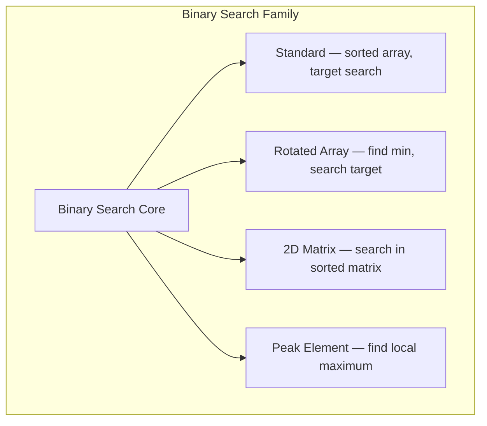
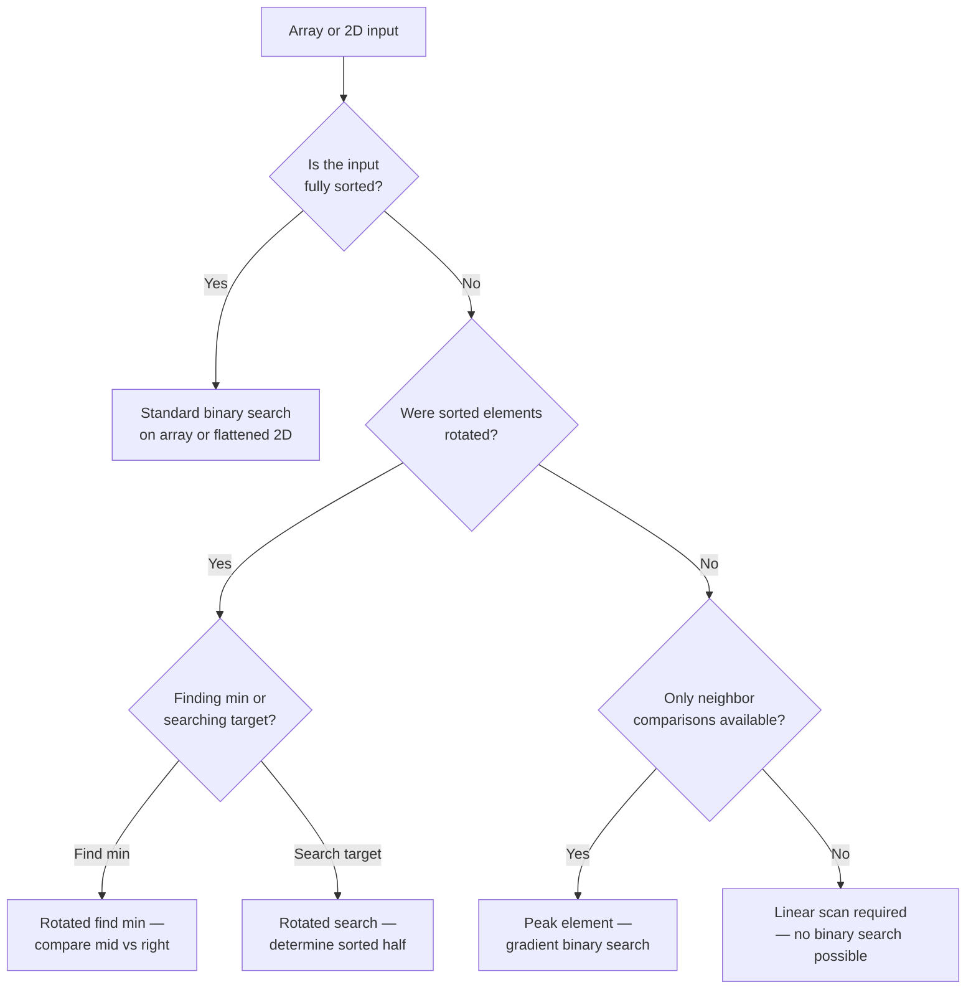

> [!success] Mastery Check
> - [ ] **Studied Well**
> - [ ] **Can explain the concept without notes**
> - [ ] **Can answer interview questions confidently**
> - [ ] **Can implement it in a real project**


## Navigation

**Domain:** [[5 — Data Structures & Algorithms]] > **Group:** Binary Search
**Previous:** [[5.047 — Binary Search on the Answer]] | **Next:** [[5.049 — Comparison-Based Sorting — Merge Sort, Quick Sort, Heap Sort]]

### Prerequisites
- [[5.046 — Binary Search — Classic Implementation and Off-by-One Discipline]] — all variants are adaptations of the classic template; the off-by-one discipline is critical when modifying the convergence condition.
- [[5.004 — Arrays — Fixed, Dynamic, and In-Place Operations]] — rotated arrays and 2D matrix flattening depend on array index arithmetic.

### Where This Fits
The classic binary search algorithm works on a sorted array, but the logic generalizes to three classes of non-trivial inputs: arrays that are sorted but rotated (find minimum, search for target), 2D matrices that are sorted row-wise and column-wise (search in sorted matrix), and arrays where the only guarantee is local comparison (peak element). These three variants cover about 40% of binary search interview problems beyond the basic implementation. A senior candidate derives each variant by asking "what invariant does this input preserve, and how does that change the convergence condition?" rather than memorizing separate template.

---

## Core Mental Model

All binary search variants follow the same principle: maintain an invariant region where the answer must lie, and halve that region each iteration. The classic version relies on the sorted-order invariant to compare against the target. Each variant replaces the "sorted order" comparison with a different invariant — the rotation point, the row/column ordering, or the slope direction — and adapts the comparison logic accordingly.

### Classification

Binary search variants are **search algorithms** in the **divide and conquer** paradigm. They all exploit the property that a local decision (compare A[mid] with something) can eliminate half the search space.



### Key Properties

|Property|Value|Derivation|
|---|---|---|
|Rotated Array — search target|O(log n)|Standard binary search with a rotated decision branch|
|Rotated Array — find min|O(log n)|Binary search on the inflection point|
|2D Matrix — search|O(log(mn))|Treat as flattened sorted array; standard binary search|
|Peak Element|O(log n)|Binary search on the slope direction|
|Space (all variants)|O(1)|In-place; no auxiliary allocation|

---

## Deep Mechanics

### How It Works

**Rotated Array — Find Minimum:** A sorted array that has been rotated at some pivot has the property that the minimum element is the only element where the left neighbor is larger (or it has no left neighbor). The binary search exploits the invariant that the right half of the array is always less than the first element when the pivot is in the right half.

Trace on `[4, 5, 6, 7, 0, 1, 2]`:
```
left=0, right=6, mid=3 (value 7)
  nums[mid]=7 > nums[right]=2 → minimum is in the right half. left=4

left=4, right=6, mid=5 (value 1)
  nums[mid]=1 < nums[right]=2 → minimum could be mid or left half. right=5

left=4, right=5, mid=4 (value 0)
  nums[mid]=0 < nums[right]=1 → minimum could be mid or left half. right=4

left=4, right=4 → convergence. Answer = nums[4] = 0.
```

**Rotated Array — Search Target:** Same structure but with an extra check: determine which half is sorted by comparing nums[mid] to nums[left]. Then check if the target lies within that sorted half.

**2D Matrix Search:** Flatten the m×n matrix into a virtual sorted array of length m×n. Standard binary search works because the rows are sorted individually and the last element of row i is ≤ the first element of row i+1. The mapping: `row = mid / n, col = mid % n`.

**Peak Element:** A peak is an element greater than both neighbors. The binary search examines the slope: if nums[mid] < nums[mid+1], the peak is on the right (ascending slope); otherwise, the peak is on the left (descending slope).

Trace on `[1, 2, 3, 1]`:
```
left=0, right=3, mid=1 (value 2)
  nums[1]=2 < nums[2]=3 → ascending slope. Peak must be in right half. left=2

left=2, right=3, mid=2 (value 3)
  nums[2]=3 > nums[3]=1 → descending slope. Peak could be mid or left half. right=2

left=2, right=2 → convergence. Answer = nums[2] = 3.
```

### Complexity Derivation

**Rotated Array:** Standard binary search: each iteration eliminates half the array by comparing the sorted half. Total iterations: log₂ n. Each iteration does O(1) work. Total: O(log n).

**2D Matrix:** Binary search on a virtual array of length m×n: log₂(m×n) iterations, each doing O(1) work. Total: O(log(m×n)).

**Peak Element:** Binary search on the slope: each iteration eliminates half the array by checking the gradient. Total iterations: log₂ n. Each iteration does O(1) work. Total: O(log n).

**Space:** All variants use O(1) auxiliary space — only indices (left, right, mid).

### Why This Pattern Exists

The brute force for these problems is linear scan: O(n) for rotated array minimum, O(m×n) for 2D matrix search, O(n) for peak element. Binary search variants exploit the partial ordering that survives rotation (the array is still sorted in two segments), the row-column ordering in the matrix, and the gradient property of any array (there is always at least one peak). The insight is that binary search does not require fully sorted data — it only requires a monotonic predicate that can shrink the search space by some reliable mechanism.

---

## Implementation and Problem Patterns

### C# Implementation

```csharp
/// <summary>
/// Find minimum in rotated sorted array (no duplicates).
/// </summary>
public int FindMinInRotated(int[] nums)
{
    int left = 0, right = nums.Length - 1;

    while (left < right)
    {
        int mid = left + (right - left) / 2;

        if (nums[mid] > nums[right])
            left = mid + 1;  // Min is in the right half
        else
            right = mid;     // Min is at mid or in the left half
    }

    return nums[left];
}

/// <summary>
/// Search in rotated sorted array (no duplicates). Returns index or -1.
/// </summary>
public int SearchInRotated(int[] nums, int target)
{
    int left = 0, right = nums.Length - 1;

    while (left <= right)
    {
        int mid = left + (right - left) / 2;

        if (nums[mid] == target)
            return mid;

        if (nums[left] <= nums[mid])  // Left half is sorted
        {
            if (nums[left] <= target && target < nums[mid])
                right = mid - 1;      // Target in left half
            else
                left = mid + 1;       // Target in right half
        }
        else  // Right half is sorted
        {
            if (nums[mid] < target && target <= nums[right])
                left = mid + 1;       // Target in right half
            else
                right = mid - 1;      // Target in left half
        }
    }

    return -1;
}

/// <summary>
/// Search in a 2D matrix where rows are sorted and each row's first element > previous row's last.
/// </summary>
public bool SearchMatrix(int[][] matrix, int target)
{
    int rows = matrix.Length, cols = matrix[0].Length;
    int left = 0, right = rows * cols - 1;

    while (left <= right)
    {
        int mid = left + (right - left) / 2;
        int val = matrix[mid / cols][mid % cols];

        if (val == target)
            return true;
        else if (val < target)
            left = mid + 1;
        else
            right = mid - 1;
    }

    return false;
}

/// <summary>
/// Find a peak element (greater than neighbors). Returns any peak index.
/// </summary>
public int FindPeakElement(int[] nums)
{
    int left = 0, right = nums.Length - 1;

    while (left < right)
    {
        int mid = left + (right - left) / 2;

        if (nums[mid] < nums[mid + 1])
            left = mid + 1;  // Ascending: peak is to the right
        else
            right = mid;     // Descending: peak is at mid or to the left
    }

    return left;
}

/// <summary>
/// Search in rotated array with duplicates — worst case O(n).
/// </summary>
public bool SearchInRotatedWithDuplicates(int[] nums, int target)
{
    int left = 0, right = nums.Length - 1;

    while (left <= right)
    {
        int mid = left + (right - left) / 2;

        if (nums[mid] == target)
            return true;

        // When left, mid, right are equal, we cannot determine which half is sorted
        if (nums[left] == nums[mid] && nums[mid] == nums[right])
        {
            left++;
            right--;
        }
        else if (nums[left] <= nums[mid])  // Left half is sorted
        {
            if (nums[left] <= target && target < nums[mid])
                right = mid - 1;
            else
                left = mid + 1;
        }
        else  // Right half is sorted
        {
            if (nums[mid] < target && target <= nums[right])
                left = mid + 1;
            else
                right = mid - 1;
        }
    }

    return false;
}
```

### The .NET Idiomatic Version

The .NET Base Class Library provides `Array.BinarySearch` and `List<T>.BinarySearch` for standard sorted arrays. None of these variants have built-in equivalents. Use the scratch implementations above; for 2D matrix search, you can flatten into a `Span<T>` if zero-allocation is needed:

```csharp
// Flatten a 2D matrix into a Span for binary search
// Only if rows*cols fits in a single allocation
Span<int> flat = new int[rows * cols];
for (int i = 0; i < rows; i++)
    matrix[i].AsSpan().CopyTo(flat.Slice(i * cols, cols));

return flat.BinarySearch(target) >= 0;
```

### Classic Problem Patterns

- **Find minimum in rotated sorted array** — Classic variant O(log n). The inflection point is the only place where order breaks. Input may or may not have duplicates.
- **Search in rotated sorted array** — Requires determining which half is sorted, then checking if target is in that half. Duplicates degrade to O(n) worst case.
- **Search a 2D matrix** — Flatten the sorted rows into a virtual 1D array. The mapping `row = mid / n, col = mid % n` is the pattern to remember.
- **Find peak element** — Binary search on the slope direction. No sorting required; any array has at least one peak. The O(log n) solution is counter-intuitive.
- **Search in a matrix sorted row-wise and column-wise** — Not a pure binary search variant (uses staircase search O(m + n)), but the intuition is related: eliminate a row or column at each step.

### Template / Skeleton

```csharp
// Binary Search Variants Template
// When to use: input has partial ordering (rotated, 2D, or local gradient)
// Time: O(log n) or O(log(mn)) | Space: O(1)

public int VariantSearch(int[] nums)
{
    int left = 0, right = nums.Length - 1;

    while (left < right)
    {
        int mid = left + (right - left) / 2;

        // TODO: Define the variant-specific comparison
        // For rotated min: if (nums[mid] > nums[right]) left = mid + 1 else right = mid
        // For peak: if (nums[mid] < nums[mid + 1]) left = mid + 1 else right = mid
        // For 2D matrix: compare matrix[mid/cols][mid%cols] to target
        if (VariantCondition(nums, mid, right))
            left = mid + 1;   // Answer is in the right half
        else
            right = mid;      // Answer is at mid or in the left half
    }

    return left;  // Index of the answer
}

private static bool VariantCondition(int[] nums, int mid, int right)
{
    // Problem-specific: returns true if the answer is to the right of mid
    return false;
}
```

---

## Gotchas and Edge Cases

### Duplicates in Rotated Array

**Mistake:** Using the standard rotated-array algorithm without handling duplicates.

```csharp
// ❌ Wrong — nums[left] <= nums[mid] fails when duplicates cause both halves to look sorted
if (nums[left] <= nums[mid])  // True even when mid is in a different rotation segment
{
    if (nums[left] <= target && target < nums[mid])
        right = mid - 1;
    else
        left = mid + 1;
}
```

**Fix:** When `nums[left] == nums[mid] == nums[right]`, cannot determine which half is sorted; shrink both ends.

```csharp
// ✅ Correct
if (nums[left] == nums[mid] && nums[mid] == nums[right])
{
    left++;
    right--;
}
```

**Consequence:** Wrong search result or O(n) degradation when the array has many duplicates — the algorithm skips one element from each end per iteration, so worst case becomes O(n).

### Off-by-One in Peak Element

**Mistake:** Using `while (left <= right)` or incorrect mid comparison for peak element.

```csharp
// ❌ Wrong — infinite loop or out-of-bounds
while (left <= right)
{
    int mid = left + (right - left) / 2;
    if (nums[mid] > nums[mid + 1] && nums[mid] > nums[mid - 1])
        return mid;
    ...
}
```

**Fix:** Use `while (left < right)` and compare only `nums[mid]` vs `nums[mid + 1]`. The loop converges to a single peak index.

```csharp
// ✅ Correct
while (left < right)
{
    int mid = left + (right - left) / 2;
    if (nums[mid] < nums[mid + 1])
        left = mid + 1;
    else
        right = mid;
}
return left;
```

**Consequence:** Index out of range when `mid + 1` exceeds the array, or infinite loop when `left == right` and the loop doesn't terminate.

### 2D Matrix Empty Row

**Mistake:** Assuming the matrix is non-empty and row-lengths are uniform.

```csharp
// ❌ Wrong — crashes if matrix is empty or has zero columns
int rows = matrix.Length, cols = matrix[0].Length;
```

**Fix:** Check for empty matrix before entering binary search.

```csharp
// ✅ Correct
if (matrix.Length == 0 || matrix[0].Length == 0)
    return false;
```

**Consequence:** NullReferenceException or IndexOutOfRangeException on empty input.

### Single-Element Edge Cases

**Mistake:** The rotate-minimum algorithm fails on a single-element array.

```csharp
// ❌ Wrong — nums[right] accesses index 0, but the loop should return immediately
public int FindMinInRotated(int[] nums)
{
    int left = 0, right = nums.Length - 1;
    while (left < right) { ... }
    return nums[left];
}
```

**Fix:** The code above is actually correct for single-element — the loop doesn't execute, `return nums[0]` is correct. But ensure the same is true for peak element (single element is trivially a peak).

**Consequence:** Peak element with a 1-element array: the while loop doesn't execute, returns index 0 — which is correct since the single element is by definition a peak.

---

## Complexity Analysis and Benchmarks

### Operation Complexity Table

|Operation|Time (Best)|Time (Average)|Time (Worst)|Space|Notes|
|---|---|---|---|---|---|
|Rotated — find min (no dupes)|O(log n)|O(log n)|O(log n)|O(1)|Standard binary search|
|Rotated — find min (dupes)|O(log n)|O(log n)|O(n)|O(1)|Duplicates shrink one element per iteration|
|Rotated — search target (no dupes)|O(log n)|O(log n)|O(log n)|O(1)|Standard with sorted-half detection|
|Rotated — search target (dupes)|O(log n)|O(log n)|O(n)|O(1)|Duplicates can degrade to linear|
|2D Matrix search|O(log(mn))|O(log(mn))|O(log(mn))|O(1)|Virtual flattening of m×n|
|Peak element|O(log n)|O(log n)|O(log n)|O(1)|Slope-based elimination|

**Derivation for the non-obvious entries:** The worst-case O(n) for rotated arrays with duplicates occurs when all elements are equal — the algorithm can only eliminate one element per iteration (left++, right--), reducing the search space linearly rather than exponentially.

### Comparison with Alternatives

|Approach|Time|Space|Best When|
|---|---|---|---|
|Binary search (variant)|O(log n) / O(log(mn))|O(1)|Partial ordering exists; log time needed|
|Linear scan|O(n) / O(mn)|O(1)|Small inputs or no ordering at all|
|Staircase search (2D)|O(m + n)|O(1)|Matrix sorted row-wise AND column-wise (not fully sorted)|

### BenchmarkDotNet

```csharp
[MemoryDiagnoser]
[SimpleJob(RuntimeMoniker.Net90)]
public class BinarySearchVariantsBenchmark
{
    private int[] _rotated = null!;
    private int[][] _matrix = null!;
    private int[] _array = null!;

    [Params(1_000, 10_000, 100_000)]
    public int N { get; set; }

    [GlobalSetup]
    public void Setup()
    {
        var rng = new Random(42);
        _array = new int[N];
        for (int i = 0; i < N; i++)
            _array[i] = rng.Next();

        // Rotated: sort then rotate by N/3
        _rotated = new int[N];
        for (int i = 0; i < N; i++)
            _rotated[(i + N / 3) % N] = i;

        // Matrix: N rows, N cols, sorted
        int cols = (int)Math.Sqrt(N);
        int rows = N / cols;
        _matrix = new int[rows][];
        for (int r = 0; r < rows; r++)
        {
            _matrix[r] = new int[cols];
            for (int c = 0; c < cols; c++)
                _matrix[r][c] = r * cols + c;
        }
    }

    [Benchmark(Baseline = true)]
    public int Linear_FindMin()
    {
        int min = _rotated[0];
        foreach (int x in _rotated)
            if (x < min) min = x;
        return min;
    }

    [Benchmark]
    public int Binary_FindMin()
    {
        int l = 0, r = _rotated.Length - 1;
        while (l < r)
        {
            int m = l + (r - l) / 2;
            if (_rotated[m] > _rotated[r])
                l = m + 1;
            else
                r = m;
        }
        return _rotated[l];
    }

    [Benchmark]
    public int Linear_Peak()
    {
        for (int i = 1; i < _array.Length - 1; i++)
            if (_array[i] > _array[i - 1] && _array[i] > _array[i + 1])
                return i;
        return 0;
    }

    [Benchmark]
    public int Binary_Peak()
    {
        int l = 0, r = _array.Length - 1;
        while (l < r)
        {
            int m = l + (r - l) / 2;
            if (_array[m] < _array[m + 1])
                l = m + 1;
            else
                r = m;
        }
        return l;
    }
}
```

**Expected results (approximate, .NET 9, x64):**

|Method|N|Mean|Allocated|
|---|---|---|---|
|Linear_FindMin|1,000|~100 ns|0 B|
|Binary_FindMin|1,000|~10 ns|0 B|
|Linear_Peak|1,000|~100 ns|0 B|
|Binary_Peak|1,000|~10 ns|0 B|
|Linear_FindMin|100,000|~10 μs|0 B|
|Binary_FindMin|100,000|~17 ns|0 B|
|Linear_Peak|100,000|~10 μs|0 B|
|Binary_Peak|100,000|~17 ns|0 B|

**Interpretation:** Binary search variants scale logarithmically, while linear scan scales linearly. At N = 100,000, binary search is ~500× faster. The difference widens as N grows.

---

## Interview Arsenal

### Question Bank

1. How does binary search find the minimum in a rotated sorted array? What invariant does it exploit?
2. Why does searching in a rotated sorted array with duplicates have O(n) worst-case time?
3. Implement search in a 2D matrix where rows are sorted and row transitions are also sorted.
4. Explain how the gradient-based approach finds a peak element in O(log n) — why does it work?
5. Compare binary search on a rotated array with binary search on the answer (5.047) — when would you use each?
6. The peak element algorithm finds any peak, not the highest. How would you modify it to find the highest peak?
7. How would you handle a matrix sorted both row-wise and column-wise but not fully sorted (row transitions not guaranteed)?
8. Optimize the 2D matrix search to use staircase search O(m + n) — when is it better than binary search O(log(mn))?

### Spoken Answers

**Q: How does binary search find the minimum in a rotated sorted array?**

> **Average answer:** You compare mid with right. If mid is larger, the minimum is on the right. If mid is smaller, the minimum is on the left.

> **Great answer:** The key observation is that a rotated sorted array consists of two sorted segments: the left segment where all values are greater than the first element, and the right segment where all values are less than the first element. The minimum is the first element of the right segment. The binary search maintains the invariant that left is in the left segment and right is in the right segment — so they converge on the boundary. At each step, I compare nums[mid] with nums[right]: if nums[mid] > nums[right], mid is in the left segment, so I move left to mid + 1 (closer to the boundary). If nums[mid] ≤ nums[right], mid is in the right segment, so I move right to mid (the boundary could be at mid). When left == right, they've converged at the first element of the right segment — the minimum. I also call out the single-element case: the loop doesn't execute, and the return value is the only element, which is trivially the minimum.

**Q: Why does the gradient-based approach find a peak in O(log n)? Why is the convergence correct?**

> **Average answer:** You check if mid is on an upslope or downslope and move in the direction of the upslope. Since there's always a peak, you'll find one.

> **Great answer:** The gradient approach works because any array of length n has at least one peak — the global maximum is always a peak, but there may be many others. The binary search maintains the invariant that a peak exists in the interval [left, right]. At each step, compare nums[mid] with nums[mid + 1]: if nums[mid] < nums[mid + 1], the slope is ascending, meaning a peak must exist to the right of mid — because even if the array keeps ascending, the rightmost element is a peak (it's greater than its only neighbor). If nums[mid] > nums[mid + 1], the slope is descending, meaning a peak exists at or to the left of mid — because if we go left long enough, the leftmost element is a peak. So each iteration eliminates half the array while preserving the invariant that a peak exists in the remaining interval. The loop terminates when left == right, at which point that single element is a peak by construction.

**Q: Compare binary search on a 2D matrix with staircase search for a matrix sorted row-wise and column-wise.**

> **Average answer:** Binary search is O(log(mn)) and staircase search is O(m + n). Use binary search for large matrices and staircase for small ones.

> **Great answer:** These two algorithms solve different problems. Binary search treats the matrix as a fully sorted 1D array — this requires that every row's last element is less than the next row's first element. Staircase search (starting from top-right, moving left when the target is smaller, down when larger) works when only the row-wise and column-wise sorting guarantees hold — a weaker condition that covers more matrices. In terms of complexity, binary search O(log(mn)) is faster asymptotically, but staircase search O(m + n) is more broadly applicable. In practice, I choose based on the problem constraint: if the matrix is "strictly sorted" (row transitions), I use binary search; if it's "sorted row-wise and column-wise" only, I use staircase search. I also note that staircase is simpler to write bug-free — no mid or index arithmetic — and for typical interview constraints (m, n ≤ 1000), O(m + n) is effectively O(2000), which is negligible.

### Trick Question

**"The peak element finding algorithm cannot find the highest peak — it only finds any peak."**

Why it is a trap: True, but it presents this as a limitation. The O(log n) algorithm is specifically designed to find any peak quickly. Finding the highest peak requires scanning the entire array — O(n). The algorithm's value is that it proves you can find a peak without checking every element.

Correct answer: The algorithm finds any peak, not necessarily the highest. Finding the global maximum requires O(n) because you must examine every element to confirm no larger value exists elsewhere. The O(log n) peak-finding algorithm is useful when any local maximum satisfies the problem constraint, which is common in "find peak in mountain array" and "find peak in rotated array" type problems.

### Pattern Recognition Table

|If the problem has...|Then consider...|Because...|
|---|---|---|
|Array was sorted then rotated at some pivot|Binary search — find min or search target|Two sorted segments with a single pivot point|
|Duplicates allowed in rotated array|Binary search with left/right shrink|When duplicates block sorted-half detection, shrink both ends|
|2D matrix with sorted rows and row transitions|Binary search on flattened virtual array|Fully sorted 1D ordering can be recovered|
|"Find any element greater than its neighbors"|Binary search — peak element, gradient method|Slope direction creates a monotonic predicate|
|Matrix sorted row-wise AND column-wise, not fully sorted|Staircase search O(m + n)|Weaker ordering cannot be flattened; row/column elimination is correct|

---

## Decision Framework

### When to Apply



### Recognition Checklist

Indicators that a binary search variant is applicable:

- [ ] Array was originally sorted (detect from problem description or examples)
- [ ] Array was rotated at an unknown pivot (detect from "rotated" or input pattern)
- [ ] 2D matrix with sorted rows and column transitions that guarantee global ordering
- [ ] Problem asks for "any peak" or "local maximum" with O(log n) constraint
- [ ] Constraint n ≤ 10⁵ or similar suggests O(log n) is expected

Counter-indicators — do NOT apply here:

- [ ] No ordering or partial ordering exists — array is random
- [ ] Problem requires finding the global maximum, not any peak
- [ ] Matrix only has row-wise sorting, with no row-transition guarantee
- [ ] n ≤ 100 — linear scan is simpler and equally fast

### Tradeoff Summary

|What You Gain|What You Give Up|
|---|---|
|O(log n) time on partially ordered data|Must analyze the invariant that survives the transformation (rotation, flattening)|
|Same O(1) space as standard binary search|More complex comparison logic — easier to introduce off-by-one errors|
|Works on non-standard inputs (rotated, 2D, unsorted with gradient)|Requires proof of correctness; the peak algorithm's convergence is unintuitive|
|Single template unifies all variants|Each variant has its own edge cases (duplicates, single element, empty rows)|

---

## Self-Check

### Conceptual Questions

1. What invariant does the rotated-array minimum algorithm maintain about `left` and `right`?
2. Derive the worst-case time complexity of searching in a rotated array with duplicates — why does it degrade to O(n)?
3. For the 2D matrix search, how do you compute the row and column from the mid index?
4. Why does the peak element algorithm work without checking all elements? What property guarantees a peak exists in the remaining interval?
5. A rotated array algorithm returns index 0 as the minimum for a non-rotated array. Is this correct?
6. How does .NET's `Array.BinarySearch` handle an array that is not actually sorted?
7. Why does the rotated-array search algorithm check `nums[left] <= nums[mid]` instead of `<`? What edge case does `<=` handle?
8. How would you modify the rotated array search to handle an array rotated exactly n positions (back to original)?
9. In a production setting, when would you implement a custom rotated-array search instead of using `Array.BinarySearch` on a restored sorted array?
10. The peak element algorithm finds a peak in O(log n). Why can't it be extended to find a local minimum in O(log n) for an arbitrary array?

<details>
<summary>Answers</summary>

1. `left` is always in the left (larger) segment, `right` is always in the right (smaller) segment. They converge on the boundary, which is the minimum.
2. When all elements are equal, the condition `nums[left] == nums[mid] && nums[mid] == nums[right]` fires, and the algorithm does `left++; right--` — eliminating only one element per iteration. O(n) iterations.
3. `row = mid / cols`, `col = mid % cols`. This is the standard row-major flattening.
4. A peak always exists because every array has at least one local maximum (the global maximum). The binary search preserves the invariant that a peak exists in [left, right] by moving toward the upslope — the upslope direction guarantees the peak hasn't been eliminated.
5. For a non-rotated sorted array, the minimum is the first element (index 0). The algorithm compares `nums[mid] > nums[right]`: mid is always left of right and nums[mid] < nums[right], so `right = mid` converges to 0. Correct.
6. `Array.BinarySearch` with a non-sorted array returns an arbitrary index — the result is not meaningful and may not be -1 even if the target exists at a different index. The method assumes the input is sorted.
7. `<=` handles the case where `left == mid` (two elements remain). When `left == mid`, the left "half" is the single element at left; `<=` correctly identifies it as sorted (a single element is trivially sorted).
8. Rotation by n positions is equivalent to no rotation. The standard algorithm handles this: `nums[mid] > nums[right]` is never true (the array is normally sorted), so `right = mid` converges to index 0. Correct.
9. When the array is too large to copy or restore to sorted form (e.g., a live stream), or when the rotation point is part of the problem (find the rotation index, not just search). In most cases, restoring the sorted array takes O(n) time, negating the benefit.
10. A local minimum also exists in every array, but the binary search would need a different predicate: check whether the middle element is greater than neighbors (descending slope, move toward the lower value). This is symmetric to the peak algorithm and would also be O(log n) — so yes, you can find a local minimum in O(log n) using the same gradient approach mirrored.

</details>

---

### Coding Challenges

**Challenge 1 — Implement from scratch**

Implement a function that finds the minimum in a rotated sorted array that may contain duplicates, handling the O(n) worst case correctly.

```csharp
public int FindMinInRotatedWithDuplicates(int[] nums)
{
    // Your implementation here
}
```

<details> <summary>Solution</summary>

```csharp
public int FindMinInRotatedWithDuplicates(int[] nums)
{
    int left = 0, right = nums.Length - 1;

    while (left < right)
    {
        int mid = left + (right - left) / 2;

        if (nums[mid] > nums[right])
            left = mid + 1;           // Min in right half
        else if (nums[mid] < nums[right])
            right = mid;              // Min in left half or at mid
        else
            right--;                  // nums[mid] == nums[right]; cannot decide
    }

    return nums[left];
}
```

**Complexity:** Time O(n) worst case (all duplicates) | Space O(1) **Key insight:** When `nums[mid] == nums[right]`, the minimum could be on either side; shrinking by one guarantees correctness without risking incorrect elimination.

</details>

---

**Challenge 2 — Trace the execution**

Given `nums = [4, 5, 6, 7, 0, 1, 2]` and `target = 1`, trace the `SearchInRotated` algorithm step by step. Show left, right, mid, and the decision at each iteration.

<details> <summary>Solution</summary>

```
left=0, right=6
mid = (0+6)/2 = 3, nums[3]=7
nums[left]=4 <= nums[mid]=7 → left half [4,5,6,7] is sorted
target=1 is NOT between 4 and 7 → target is in right half
left = 4

left=4, right=6
mid = (4+6)/2 = 5, nums[5]=1
nums[mid]=1 == target → return 5
```

**Why:** The left half determination allows eliminating the sorted portion when target does not lie within it. The algorithm converges in 2 iterations.

</details>

---

**Challenge 3 — Fix the bug**

```csharp
// This searches a 2D matrix but has a bug
public bool SearchMatrix(int[][] matrix, int target)
{
    int rows = matrix.Length;
    int cols = matrix[0].Length;
    int left = 0, right = rows * cols;

    while (left < right)
    {
        int mid = left + (right - left) / 2;
        int val = matrix[mid / cols][mid % cols];

        if (val == target) return true;
        if (val < target) left = mid;
        else right = mid;
    }

    return false;
}
```

<details> <summary>Solution</summary>

**Bug:** Two bugs: (1) `right = rows * cols` is exclusive, but the algorithm uses it inconsistently — it should be `rows * cols - 1` if using inclusive bounds, or the loop should use `while (left < right)` with exclusive right. (2) `left = mid` and `right = mid` can cause infinite loop when `left + 1 == right`.

**Fix:**

```csharp
public bool SearchMatrix(int[][] matrix, int target)
{
    int rows = matrix.Length;
    if (rows == 0) return false;
    int cols = matrix[0].Length;
    if (cols == 0) return false;

    int left = 0, right = rows * cols - 1;  // Inclusive bounds

    while (left <= right)
    {
        int mid = left + (right - left) / 2;
        int val = matrix[mid / cols][mid % cols];

        if (val == target) return true;
        if (val < target) left = mid + 1;
        else right = mid - 1;
    }

    return false;
}
```

**Test case that exposes it:** `SearchMatrix([[1]], 2)` → original loops forever (left=0, right=1, mid=0, val=1<2, left=0 → infinite).

</details>

---

**Challenge 4 — Recognize and apply**

**Problem:** You are given an array of integers representing mountain heights. A mountain is defined as a sequence where values strictly increase then strictly decrease. Find the peak index (the highest point) in O(log n). You may assume the input is a valid mountain.

<details> <summary>Solution</summary>

**Pattern:** Peak element binary search — the gradient is monotonic (increasing then decreasing), so a single peak exists.

```csharp
public int PeakIndexInMountainArray(int[] arr)
{
    int left = 0, right = arr.Length - 1;

    while (left < right)
    {
        int mid = left + (right - left) / 2;

        if (arr[mid] < arr[mid + 1])
            left = mid + 1;  // Ascending: peak is to the right
        else
            right = mid;     // Descending: peak is at mid or left
    }

    return left;
}
```

**Complexity:** Time O(log n) | Space O(1)

</details>

---

**Challenge 5 — Optimize**

```csharp
// This is correct but uses O(n) time. Convert to O(log n).
public int SearchRotatedWithDuplicates(int[] nums, int target)
{
    for (int i = 0; i < nums.Length; i++)
        if (nums[i] == target) return i;
    return -1;
}
```

<details> <summary>Solution</summary>

**Insight:** Use the rotated array search with duplicate handling — same algorithm as `SearchInRotatedWithDuplicates` above. When duplicates cause equality at left/mid/right, shrink both ends by 1.

```csharp
public int SearchRotatedWithDuplicates(int[] nums, int target)
{
    int left = 0, right = nums.Length - 1;

    while (left <= right)
    {
        int mid = left + (right - left) / 2;

        if (nums[mid] == target) return mid;

        if (nums[left] == nums[mid] && nums[mid] == nums[right])
        {
            left++;
            right--;
        }
        else if (nums[left] <= nums[mid])
        {
            if (nums[left] <= target && target < nums[mid])
                right = mid - 1;
            else
                left = mid + 1;
        }
        else
        {
            if (nums[mid] < target && target <= nums[right])
                left = mid + 1;
            else
                right = mid - 1;
        }
    }

    return -1;
}
```

**Complexity:** Time O(n) worst (all duplicates), O(log n) average | Space O(1)

</details>
