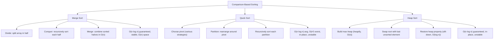

> [!success] Mastery Check
> - [ ] **Studied Well**
> - [ ] **Can explain the concept without notes**
> - [ ] **Can answer interview questions confidently**
> - [ ] **Can implement it in a real project**


## Navigation

**Domain:** [[5 — Data Structures & Algorithms]] > **Group:** Sorting
**Previous:** [[5.046 — Binary Search — Classic Implementation and Off-by-One Discipline]] | **Next:** [[5.050 — Non-Comparison Sorting — Counting, Radix, Bucket Sort]]

### Prerequisites
- [[5.002 — Recursion and the Call Stack]] — merge sort and quick sort are recursive; the recurrence T(n) = 2T(n/2) + O(n) uses the Master Theorem.
- [[5.031 — Min-Heap and Max-Heap — Structure and Heapify]] — heap sort is built on the heap data structure; heapify is the core operation.
- [[5.001 — Big-O Notation and Complexity Analysis]] — the O(n log n) lower bound for comparison-based sorting and Master Theorem analysis of recurrences.

### Where This Fits
Comparison-based sorting is one of the most fundamental topics in computer science. Three algorithms dominate the interview landscape: merge sort (stable, O(n) space, divide-and-conquer), quick sort (in-place, O(log n) space average, the practical king), and heap sort (in-place, O(1) space, O(n log n) guaranteed). Together they illustrate the core algorithmic paradigms: divide-and-conquer, partitioning, and heap-based selection. The O(n log n) lower bound for comparison-based sorting is a classic information-theoretic argument. Interview questions about sorting appear in ~30% of coding rounds — directly (sort colors, merge sorted arrays) and indirectly (sorting as a subroutine). A senior candidate must be able to implement all three from scratch, articulate the tradeoffs, and explain what .NET's Array.Sort uses internally.

---

## Core Mental Model

Sorting places elements in a defined order. The three canonical comparison-based sorts each take a different approach: merge sort divides the array in half, sorts each half, then merges the sorted halves (guaranteed O(n log n), stable, O(n) space). Quick sort picks a pivot, partitions the array around it, then recursively sorts each partition (O(n log n) average, O(n²) worst, in-place, unstable). Heap sort builds a max-heap, then repeatedly extracts the maximum element to the end (guaranteed O(n log n), in-place, unstable). The information-theoretic lower bound: there are n! permutations; each comparison eliminates at most half the remaining permutations, so at least log₂(n!) ≈ n log₂ n comparisons are required in the worst case.

### Classification

All three are **comparison-based** (they use pairwise comparisons) and **in-place** (except merge sort requires O(n) auxiliary space). All are **comparison sorts** — they rely only on the relative ordering of elements.



### Key Properties

|Property|Merge Sort|Quick Sort|Heap Sort|
|---|---|---|---|
|Best case|O(n log n)|O(n log n)|O(n log n)|
|Average case|O(n log n)|O(n log n)|O(n log n)|
|Worst case|O(n log n)|O(n²)|O(n log n)|
|Space|O(n)|O(log n) (call stack)|O(1)|
|Stable|Yes|No|No|
|In-place|No (O(n) auxiliary)|Yes|Yes|
|Cache performance|Good (sequential merge)|Good (sequential partition)|Poor (random access sift-down)|

---

## Deep Mechanics

### How It Works

**Merge Sort:**
1. If the array has ≤ 1 element, it is already sorted.
2. Divide: find the middle index, split into left and right halves.
3. Conquer: recursively sort each half.
4. Combine: merge the two sorted halves into a single sorted array. Walk two pointers (one per half), compare elements, and copy the smaller to a temporary buffer, then back to the original array.

Example trace on [3, 1, 4, 1, 5, 9]:
- Split: [3, 1, 4], [1, 5, 9]
- Split [3, 1, 4]: [3], [1, 4]
- Sort [3]: base case → [3]
- Split [1, 4]: [1], [4] → base cases → merge [1, 4] → [1, 4]
- Merge [3] and [1, 4]: compare 3 vs 1 → [1]; compare 3 vs 4 → [1, 3, 4]
- Split [1, 5, 9]: [1, 5], [9]
- Split [1, 5]: [1], [5] → merge → [1, 5]
- Merge [1, 5] and [9]: [1, 5, 9]
- Merge [1, 3, 4] and [1, 5, 9]: [1, 1, 3, 4, 5, 9]

**Quick Sort:**
1. If the array has ≤ 1 element, done.
2. Choose a pivot (commonly the last element, median-of-three, or random).
3. Partition: rearrange so elements < pivot are before it, elements > pivot are after it. The pivot ends up at its final sorted position.
4. Recursively quick-sort the left partition (indices less than pivot) and the right partition (indices greater than pivot).

Partitioning (Lomuto scheme): track a `wall` index for the boundary of elements < pivot. Iterate from `low` to `high - 1`; for each element less than the pivot, swap it with the element at `wall` and advance `wall`. Finally, swap the pivot into position at `wall`.

**Heap Sort:**
1. Build a max-heap from the array (heapify, O(n)).
2. For i = n-1 down to 1:
   a. Swap the root (maximum element at index 0) with the element at index i.
   b. The heap size decreases by 1 (i is now part of the sorted suffix).
   c. Sift-down the new root to restore the max-heap property.

After the loop, the array is sorted in ascending order (the max-heap extracts elements from largest to smallest, placing them at the end).

### Complexity Derivation

**Merge Sort recurrence:**
T(n) = 2T(n/2) + O(n). By the Master Theorem: a = 2, b = 2, f(n) = O(n). Compare n^(log_b a) = n^(log₂ 2) = n¹ with f(n) = O(n) = Θ(n). This is Case 2: T(n) = Θ(n log n).

**Quick Sort recurrence (average case):**
T(n) = T(k) + T(n - k - 1) + O(n) where k is the size of the left partition. For a good pivot (splits near n/2): T(n) = 2T(n/2) + O(n) = Θ(n log n). For a bad pivot (one partition is size 0): T(n) = T(0) + T(n-1) + O(n) = T(n-1) + O(n) = O(n²).

**Heap Sort:**
Heapify is O(n). There are n - 1 extractions; each sift-down is O(log n). Total: O(n) + (n - 1) × O(log n) = O(n log n).

**Space:**
Merge sort allocates a temporary array of size n for merging. Quick sort uses O(log n) call stack on average (balanced recursion). Heap sort is O(1).

**O(n log n) lower bound:**
There are n! possible permutations. Each comparison between two elements can eliminate at most half of the remaining permutations (the decision tree is binary). A binary tree with n! leaves has minimum height log₂(n!). Using Stirling's approximation: log₂(n!) = n log₂ n - n log₂ e + O(log n) = Θ(n log n).

### .NET Runtime Notes

- **`Array.Sort`:** Uses **introsort** — a hybrid: quick sort normally, switches to heap sort if recursion depth exceeds 2 × log₂ n (guards against O(n²) worst case), and uses insertion sort for small partitions (≤ 16 elements) for better constant factors.
- **`List<T>.Sort`:** Same introsort implementation as `Array.Sort`.
- **Stability:** `Array.Sort` and `List<T>.Sort` are **not stable** for primitive types (integers, etc.). For reference types, they ARE stable since .NET Core 3.0+ (they use an internal stable sort when the element type is a reference type).
- **`Enumerable.OrderBy`:** LINQ's `OrderBy` is **stable** (it uses a merge-sort-like algorithm internally). It is slower than `Array.Sort` but guarantees stability.
- **`Array.Sort` with custom comparer:** Uses the same introsort algorithm with `IComparer<T>` for comparisons.
- **Parallel sorting:** Use `Parallel.ForEach` with custom sort logic; there is no `Array.ParallelSort`. For very large arrays, partitioning and merging in parallel can improve throughput.
- **`Comparison<T>` delegate:** Can pass a lambda instead of an `IComparer<T>`: `Array.Sort(arr, (a, b) => a.CompareTo(b))`.

---

## Implementation and Problem Patterns

### C# Implementation

```csharp
public static class Sorting
{
    /// <summary>
    /// Merge Sort — recursive, stable, O(n) auxiliary space.
    /// </summary>
    public static void MergeSort(int[] arr)
    {
        if (arr.Length <= 1) return;
        var temp = new int[arr.Length];
        MergeSortRec(arr, 0, arr.Length - 1, temp);
    }

    private static void MergeSortRec(int[] arr, int left, int right, int[] temp)
    {
        if (left >= right) return;

        int mid = left + (right - left) / 2;
        MergeSortRec(arr, left, mid, temp);
        MergeSortRec(arr, mid + 1, right, temp);
        Merge(arr, left, mid, right, temp);
    }

    private static void Merge(int[] arr, int left, int mid, int right, int[] temp)
    {
        int i = left, j = mid + 1, k = left;

        while (i <= mid && j <= right)
            temp[k++] = arr[i] <= arr[j] ? arr[i++] : arr[j++];

        while (i <= mid) temp[k++] = arr[i++];
        while (j <= right) temp[k++] = arr[j++];

        for (int t = left; t <= right; t++)
            arr[t] = temp[t];
    }

    /// <summary>
    /// Quick Sort — in-place, unstable, O(n²) worst case, O(n log n) average.
    /// Uses median-of-three pivot selection for better average performance.
    /// </summary>
    public static void QuickSort(int[] arr)
    {
        QuickSortRec(arr, 0, arr.Length - 1);
    }

    private static void QuickSortRec(int[] arr, int low, int high)
    {
        if (low >= high) return;

        // Insertion sort for small partitions (improves performance)
        if (high - low <= 16)
        {
            InsertionSortRange(arr, low, high);
            return;
        }

        int pivotIndex = Partition(arr, low, high);
        QuickSortRec(arr, low, pivotIndex - 1);
        QuickSortRec(arr, pivotIndex + 1, high);
    }

    private static int Partition(int[] arr, int low, int high)
    {
        // Median-of-three: median of arr[low], arr[mid], arr[high]
        int mid = low + (high - low) / 2;
        int pivot = MedianOfThree(arr, low, mid, high);
        // Swap pivot to high (Lomuto expects pivot at end)
        (arr[pivot], arr[high]) = (arr[high], arr[pivot]);

        int pivotValue = arr[high];
        int wall = low;

        for (int i = low; i < high; i++)
        {
            if (arr[i] < pivotValue)
            {
                (arr[wall], arr[i]) = (arr[i], arr[wall]);
                wall++;
            }
        }

        (arr[wall], arr[high]) = (arr[high], arr[wall]);
        return wall;
    }

    private static int MedianOfThree(int[] arr, int a, int b, int c)
    {
        if (arr[a] > arr[b]) (arr[a], arr[b]) = (arr[b], arr[a]);
        if (arr[b] > arr[c]) (arr[b], arr[c]) = (arr[c], arr[b]);
        if (arr[a] > arr[b]) (arr[a], arr[b]) = (arr[b], arr[a]);
        return b;
    }

    private static void InsertionSortRange(int[] arr, int low, int high)
    {
        for (int i = low + 1; i <= high; i++)
        {
            int key = arr[i];
            int j = i - 1;
            while (j >= low && arr[j] > key)
            {
                arr[j + 1] = arr[j];
                j--;
            }
            arr[j + 1] = key;
        }
    }

    /// <summary>
    /// Heap Sort — in-place, unstable, O(n log n) guaranteed.
    /// </summary>
    public static void HeapSort(int[] arr)
    {
        int n = arr.Length;

        // Build max-heap
        for (int i = n / 2 - 1; i >= 0; i--)
            SiftDown(arr, i, n);

        // Extract max one by one
        for (int i = n - 1; i > 0; i--)
        {
            (arr[0], arr[i]) = (arr[i], arr[0]);
            SiftDown(arr, 0, i);
        }
    }

    private static void SiftDown(int[] arr, int index, int heapSize)
    {
        while (true)
        {
            int left = 2 * index + 1;
            int right = 2 * index + 2;
            int largest = index;

            if (left < heapSize && arr[left] > arr[largest]) largest = left;
            if (right < heapSize && arr[right] > arr[largest]) largest = right;
            if (largest == index) break;

            (arr[index], arr[largest]) = (arr[largest], arr[index]);
            index = largest;
        }
    }
}
```

### The .NET Idiomatic Version

```csharp
public static class SortingIdiomatic
{
    // In production, always use the built-in sort:
    public static void BuiltInSort(int[] arr)
    {
        Array.Sort(arr);
    }

    // For descending order:
    public static void SortDescending(int[] arr)
    {
        Array.Sort(arr, (a, b) => b.CompareTo(a));
    }

    // Custom comparer:
    public static void SortWithComparer(int[] arr)
    {
        Array.Sort(arr, Comparer<int>.Create((a, b) => a.CompareTo(b)));
    }

    // LINQ OrderBy (stable):
    public static int[] StableSort(int[] arr)
    {
        return arr.OrderBy(x => x).ToArray();
    }

    // Sort a range (slice):
    public static void SortRange(int[] arr, int index, int length)
    {
        Array.Sort(arr, index, length);
    }

    // Sort parallel arrays (one by values of another):
    public static void SortByKey<TValue>(int[] keys, TValue[] values)
    {
        Array.Sort(keys, values); // sorts both arrays by keys
    }
}
```

### Classic Problem Patterns

1. **Sort an array of 0s, 1s, and 2s (Dutch national flag)** — Three-way partitioning (quick sort variant). Key insight: maintain three pointers (low, mid, high) — arr[low..mid-1] = 0, arr[mid..high] = unknown, arr[high+1..] = 2.
2. **Merge K sorted arrays** — Use a min-heap to extract the smallest among the K current heads. Key insight: heap handles dynamic comparisons; merge sort's merge step generalizes to K lists.
3. **K-th largest element** — Use quick select (quick sort partitioning without full sort) — O(n) average, O(n²) worst. Or use a heap of size K. Key insight: partitioning finds the k-th element without sorting the rest.
4. **Count inversions** — Count pairs (i, j) where i < j and arr[i] > arr[j]. Key insight: merge sort — during the merge step, when an element from the right half is placed before elements from the left half, each remaining left element contributes an inversion.
5. **Sort by frequency** — Count frequencies, then sort by count. Key insight: can use bucket sort for linear time (frequency is bounded by array length).

### Template / Skeleton

```csharp
// Quick Sort Template (partition-based selection)
// When to use: sorting in-place, or finding k-th element (quick select)
// Time: O(n log n) average | Space: O(log n) average

public static void QuickSortTemplate(int[] arr)
{
    void Sort(int low, int high)
    {
        if (low >= high) return;

        // TODO: choose pivot — last element, random, or median-of-three
        int pivotIndex = Partition(arr, low, high);

        // TODO: for quick select of k-th smallest, check pivotIndex == k
        Sort(low, pivotIndex - 1);
        Sort(pivotIndex + 1, high);
    }

    Sort(0, arr.Length - 1);
}

// Partition helper (Lomuto scheme):
int Partition(int[] arr, int low, int high)
{
    int pivot = arr[high];
    int wall = low;
    for (int i = low; i < high; i++)
    {
        if (arr[i] < pivot)
        {
            (arr[wall], arr[i]) = (arr[i], arr[wall]);
            wall++;
        }
    }
    (arr[wall], arr[high]) = (arr[high], arr[wall]);
    return wall;
}
```

---

## Gotchas and Edge Cases

### Quick Sort Worst Case on Already-Sorted Input

**Mistake:** Using the first or last element as the pivot on an already-sorted array.

```csharp
// ❌ Wrong — pivot = last element, sorted array → O(n²)
int pivot = arr[high]; // always the largest in a sorted array
// Each partition splits n-1 and 0 elements → O(n²) comparisons
```

**Fix:** Use median-of-three or random pivot selection.

```csharp
// ✅ Correct — median of low, mid, high (or random pivot)
int mid = low + (high - low) / 2;
int pivot = MedianOfThree(arr, low, mid, high);
```

**Consequence:** O(n²) time complexity — sorting 100,000 elements takes 10 billion comparisons instead of ~1.7 million.

### Merge Sort's Temporary Array Allocation in Each Call

**Mistake:** Allocating a new temporary array in each recursive call.

```csharp
// ❌ Wrong — allocating temp in each call → O(n log n) total space and GC pressure
void MergeSort(int[] arr, int left, int right)
{
    var temp = new int[arr.Length]; // allocated every call!
    // ...
}
```

**Fix:** Allocate a single temporary array at the top level and pass it down.

```csharp
// ✅ Correct — single temp array reused across all calls
void MergeSort(int[] arr)
{
    var temp = new int[arr.Length];
    MergeSortRec(arr, 0, arr.Length - 1, temp);
}
```

**Consequence:** O(n log n) memory allocation and GC pressure — can cause noticeable pauses for large arrays.

### Heap Sort Not Stable

**Mistake:** Assuming heap sort is stable.

```csharp
// ❌ Wrong — heap sort is not stable
// Array.Sort is not stable for primitive types either
```

**Fix:** Use LINQ's `OrderBy` (stable) or a custom stable sort when ordering of equal elements matters.

```csharp
// ✅ Correct — stable sort
int[] sorted = arr.OrderBy(x => x).ToArray(); // stable
```

**Consequence:** Equal elements may appear in different order than their original positions. For primitive types this does not matter; for objects it may break secondary sorting.

### Integer Overflow in Mid Calculation (Merge Sort)

**Mistake:** Using `(left + right) / 2` which can overflow.

```csharp
// ❌ Wrong — overflow for large arrays
int mid = (left + right) / 2;
```

**Fix:** Use the safe formula.

```csharp
// ✅ Correct — no overflow
int mid = left + (right - left) / 2;
```

**Consequence:** Mid becomes negative for arrays near int.MaxValue size; IndexOutOfRangeException.

---

## Complexity Analysis and Benchmarks

### Operation Complexity Table

|Operation|Merge Sort|Quick Sort|Heap Sort|
|---|---|---|---|
|Time (best)|O(n log n)|O(n log n)|O(n log n)|
|Time (average)|O(n log n)|O(n log n)|O(n log n)|
|Time (worst)|O(n log n)|O(n²)|O(n log n)|
|Space (total)|O(n)|O(log n) stack|O(1)|
|Stable|Yes|No|No|
|Adaptive|No|No|No|

**Derivation for the non-obvious entries:** Merge sort always divides evenly — the recurrence is T(n) = 2T(n/2) + O(n) regardless of input, giving O(n log n) in all cases. Quick sort's worst case (already sorted with bad pivot) gives T(n) = T(n-1) + O(n) = O(n²). Heap sort's O(n log n) is guaranteed because heapify is O(n) and each of the n extractions runs sift-down in O(log n).

### Comparison with Alternatives

|Sort|Time Avg|Time Worst|Space|Stable|Best When|
|---|---|---|---|---|---|
|Merge Sort|O(n log n)|O(n log n)|O(n)|Yes|Need stability, linked lists, external sorting|
|Quick Sort|O(n log n)|O(n²)|O(log n)|No|General purpose in-memory, best average performance|
|Heap Sort|O(n log n)|O(n log n)|O(1)|No|Need guaranteed O(n log n) with O(1) space|
|Introsort (.NET)|O(n log n)|O(n log n)|O(log n)|No*|Production — hybrid avoids quicksort worst case|
|Insertion Sort|O(n²)|O(n²)|O(1)|Yes|Small arrays (≤ 16), nearly sorted data|
|Counting Sort|O(n + k)|O(n + k)|O(k)|Yes|Small integer range, special cases|

### BenchmarkDotNet

```csharp
[MemoryDiagnoser]
[SimpleJob(RuntimeMoniker.Net90)]
public class SortingBenchmark
{
    [Params(1_000, 10_000)]
    public int N { get; set; }

    private int[] _data = null!;

    [GlobalSetup]
    public void Setup()
    {
        var rng = new Random(42);
        _data = Enumerable.Range(0, N).Select(_ => rng.Next()).ToArray();
    }

    [Benchmark(Baseline = true)]
    public int[] BuiltInSort()
    {
        var arr = (int[])_data.Clone();
        Array.Sort(arr);
        return arr;
    }

    [Benchmark]
    public int[] MergeSort()
    {
        var arr = (int[])_data.Clone();
        Sorting.MergeSort(arr);
        return arr;
    }

    [Benchmark]
    public int[] QuickSort()
    {
        var arr = (int[])_data.Clone();
        Sorting.QuickSort(arr);
        return arr;
    }

    [Benchmark]
    public int[] HeapSort()
    {
        var arr = (int[])_data.Clone();
        Sorting.HeapSort(arr);
        return arr;
    }

    [Benchmark]
    public int[] LinqOrderBy()
    {
        return _data.OrderBy(x => x).ToArray();
    }
}
```

**Expected results (approximate, .NET 9, x64):**

|Method|N|Mean|Allocated|
|---|---|---|---|
|BuiltInSort|1,000|~15 μs|~4 KB|
|BuiltInSort|10,000|~180 μs|~40 KB|
|QuickSort|1,000|~20 μs|~0 KB (in-place)|
|QuickSort|10,000|~250 μs|~0 KB|
|MergeSort|1,000|~45 μs|~8 KB|
|MergeSort|10,000|~550 μs|~80 KB|
|HeapSort|1,000|~30 μs|~0 KB|
|HeapSort|10,000|~400 μs|~0 KB|
|LinqOrderBy|1,000|~60 μs|~12 KB|
|LinqOrderBy|10,000|~700 μs|~120 KB|

**Interpretation:** `Array.Sort` (introsort) is the fastest due to JIT optimizations and the hybrid strategy. Quick sort is close behind. Merge sort allocates more memory (temporary array). Heap sort is slightly slower than quick sort due to poor cache locality (random access patterns in sift-down). LINQ `OrderBy` is the slowest due to delegate overhead and extra allocations.

---

## Interview Arsenal

### Question Bank

1. [Definition] What is the O(n log n) lower bound for comparison-based sorting — how is it derived?
2. [Complexity] Derive the recurrence for merge sort and solve it.
3. [Implementation] Implement quick sort with in-place partitioning.
4. [Recognition] Given a problem with "sort colors (0s, 1s, 2s)," what algorithm variant applies?
5. [Comparison] Compare merge sort vs. quick sort — when would you choose each?
6. [Trick] How does .NET's Array.Sort avoid O(n²) worst case in quick sort?
7. [System Design] How would you sort a 100 GB file on a machine with 16 GB RAM?
8. [Optimization] How would you sort an array that is nearly sorted?

### Spoken Answers

**Q: Derive the recurrence for merge sort and solve it.**

> **Average answer:** T(n) = 2T(n/2) + O(n), which solves to O(n log n).

> **Great answer:** The recurrence is T(n) = 2T(n/2) + cn, where the cn term represents the merge step — merging two sorted halves of total size n requires comparing and copying each element. To solve, I use the Master Theorem. Here, a = 2 (two recursive calls), b = 2 (each subproblem is n/2), and f(n) = cn. Compute n^(log_b a) = n^(log₂ 2) = n¹. Compare f(n) = cn with n^(log_b a) = n. They are equal in asymptotic growth: f(n) = Θ(n^(log_b a)). This is Master Theorem Case 2: T(n) = Θ(n^(log_b a) log n) = Θ(n log n). I can also expand the recurrence: T(n) = 2T(n/2) + cn = 4T(n/4) + 2cn = ... = 2^k T(n/2^k) + k·cn. At the base case n/2^k = 1, so k = log₂ n. Then T(n) = n·T(1) + (log₂ n)·cn = O(n log n). The space is O(n) from the temporary array needed for merging.

**Q: Implement quick sort with in-place partitioning.**

> **Average answer:** Picks a pivot, partitions, recurses on left and right.

> **Great answer:** I will implement using the Lomuto partition scheme with median-of-three pivot selection. The main function calls `Sort(arr, 0, arr.Length - 1)`. In the recursive function, I first check if the partition is small (≤ 16 elements) and use insertion sort for those — this improves performance. I select the pivot using median-of-three (median of arr[low], arr[mid], arr[high]) and swap it to the end for the Lomuto scheme. The partition function maintains a `wall` pointer representing the boundary of elements less than the pivot. I iterate from `low` to `high - 1`; if `arr[i] < pivot`, I swap it with the element at `wall` and increment `wall`. After the loop, I swap the pivot (at `high`) to position `wall` — this places the pivot in its final sorted position. I then recursively sort `[low, wall - 1]` and `[wall + 1, high]`. The median-of-three pivot ensures O(n log n) performance even on nearly sorted input.

**Q: [Trick] How does .NET's Array.Sort avoid O(n²) worst case?**

> **Average answer:** It uses introsort — switches to heap sort if recursion depth exceeds a threshold.

> **Great answer:** `Array.Sort` in .NET uses the introsort algorithm, which is a hybrid of three sorts. The primary algorithm is quick sort with median-of-three pivot selection. Introsort tracks the recursion depth — if it exceeds 2 × log₂(n), it switches to heap sort for the current partition. This guarantees O(n log n) worst-case complexity because heap sort has that guarantee. Finally, for small partitions (fewer than 16 elements), introsort switches to insertion sort, which has better constant factors for small n. The combination gives the best of all three: quick sort's average speed, heap sort's worst-case guarantee, and insertion sort's efficiency on small arrays. This is the standard hybrid approach used in most production-grade sort implementations (C++ std::sort, .NET Array.Sort, Java Arrays.sort for primitives).

### Trick Question

**"Can you sort n integers in O(n) time using comparison-based sorting?"**

Why it is a trap: The candidate starts trying to invent a faster comparison-based sort. The question tests knowledge of the O(n log n) information-theoretic lower bound — which applies to all comparison-based sorts.

Correct answer: No — comparison-based sorting has a proven lower bound of Ω(n log n) in the worst case. There are n! possible permutations of n distinct elements. A binary decision tree that distinguishes all n! orderings must have at least log₂(n!) leaves. By Stirling's approximation, log₂(n!) = n log₂ n - n log₂ e + O(log n) = Θ(n log n). To sort in O(n) time, you would need a non-comparison-based algorithm like counting sort (requires integer range) or radix sort (requires bounded key length). The trap is recognizing when the lower bound applies and when it does not.

### Pattern Recognition Table

|If the problem has...|Then consider...|Because...|
|---|---|---|
|"Sort an array" with no constraints|Array.Sort (introsort)|Best average performance, guaranteed O(n log n)|
|"Sort 0s, 1s, 2s" (three distinct values)|Dutch national flag / three-way partition|Single pass, O(n), no comparison sort needed|
|"Find the k-th smallest/largest"|Quick select (partition-based)|O(n) average — no need to sort the whole array|
|"Merge K sorted arrays"|Min-heap + merge|Always extract the smallest among K heads|
|"Count inversions" / "count smaller after self"|Merge sort modification|Merge step naturally counts cross-inversions|
|"Sort by frequency"|Frequency map + bucket sort|Frequency is bounded by array length — bucket sort in O(n)|

---

## Decision Framework

### When to Apply

```mermaid
flowchart TD
    A[Need to sort data] --> B{Array size?}
    B -->|Small (≤ 16)| C[Insertion sort]
    B -->|Large| D{Memory constraints?}
    D -->|O(1) space required| E{Need stability?}
    D -->|O(n) space acceptable| F{Merge sort is the choice}
    E -->|Yes| G[Use stable merge sort or .NET OrderBy]
    E -->|No| H{Guaranteed O(n log n)?}
    H -->|Yes| I[Heap sort]
    H -->|No| J["Quick sort (pivot with median-of-three)"]
    F --> K{External / linked list?}
    K -->|Yes| L[Merge sort — sequential access friendly]
    K -->|No| M["In production: Array.Sort (introsort)"]
```

### Recognition Checklist

Indicators for the correct sorting algorithm:

- [ ] Need guaranteed O(n log n) + O(1) space → heap sort
- [ ] Need stable sort → merge sort (or LINQ OrderBy)
- [ ] Need best average performance → quick sort (or Array.Sort)
- [ ] List is small or nearly sorted → insertion sort
- [ ] Need k-th element without full sort → quick select

### Tradeoff Summary

|What You Gain|What You Give Up|
|---|---|
|Merge sort: stable, guaranteed O(n log n), external-sort friendly|Merge sort: O(n) auxiliary space, not in-place|
|Quick sort: in-place, fast average, simple partitioning|Quick sort: unstable, O(n²) worst case (mitigated by introsort)|
|Heap sort: in-place, O(1) space, guaranteed O(n log n)|Heap sort: unstable, poor cache locality, not adaptive|
|Array.Sort: production-tested hybrid, best all-around|Any custom sort: more code, more bugs, less optimized than built-in|

---

## Self-Check

### Conceptual Questions

1. Derive the O(n log n) lower bound for comparison-based sorting.
2. Solve the merge sort recurrence T(n) = 2T(n/2) + O(n) using the Master Theorem.
3. Recognizing from a problem: "Given an array of integers, sort it such that all even numbers appear before odd numbers, maintaining relative order within each group."
4. When would you choose merge sort over quick sort, and vice versa?
5. How does .NET's Array.Sort avoid the O(n²) worst case of quick sort?
6. In .NET, which sorting methods are stable and which are not?
7. What invariant does the Lomuto partition scheme maintain during the partition loop?
8. How does the answer change if the input is a linked list instead of an array?
9. In a production data pipeline that processes 100 GB of log files, what sorting approach would you use?
10. What is the trap question about O(n) comparison-based sorting?

<details>
<summary>Answers</summary>

1. There are n! possible permutations of n distinct elements. Each comparison yields a binary result — the decision tree is a binary tree with at most 2^h leaves for height h. To distinguish n! permutations, 2^h ≥ n! → h ≥ log₂(n!). By Stirling's approximation: log₂(n!) = n log₂ n - n log₂ e + O(log n) = Θ(n log n).
2. T(n) = 2T(n/2) + cn. a = 2, b = 2, f(n) = cn. n^(log_b a) = n¹. f(n) = Θ(n) = Θ(n^(log_b a)). Case 2 applies: T(n) = Θ(n^(log_b a) log n) = Θ(n log n).
3. Use a stable partition: iterate through the array; build output by taking evens in order, then odds in order. Merge sort's stable merge can also be used if sorting by parity key.
4. Merge sort: stable, guaranteed O(n log n), better for linked lists or external sorting. Quick sort: faster in practice for in-memory arrays, in-place, better cache performance. Use merge sort when stability is required or input is a linked list; use quick sort for general in-memory array sorting.
5. Introsort tracks recursion depth. If it exceeds 2 × log₂(n), it switches from quick sort to heap sort for the current partition. Heap sort guarantees O(n log n). This prevents the O(n²) worst case.
6. `Array.Sort` and `List<T>.Sort`: not stable for primitive types, stable for reference types since .NET Core 3.0+. `Enumerable.OrderBy`: always stable. `Array.Sort` with keys and values: stable.
7. The `wall` pointer divides the array into two regions: arr[low..wall-1] < pivot (processed), arr[wall..i-1] ≥ pivot (processed), arr[i..high-1] = unchecked. After the loop, the pivot (at high) is swapped into position wall.
8. Merge sort is naturally suited for linked lists — it requires only O(log n) space (recursion) and sequential access (no random access needed). Quick sort and heap sort depend on random access (arr[mid], arr[i]) and perform poorly on linked lists.
9. External merge sort: split the 100 GB file into chunks that fit in RAM (e.g., 1 GB each), sort each chunk using in-memory sort (Array.Sort), store sorted chunks, then merge the sorted chunks using a K-way merge (heap-based). This is the standard external sorting approach.
10. The trap is that the candidate tries to invent a faster comparison sort. The correct answer is "no" — Ω(n log n) is a proven lower bound. Non-comparison sorts (counting, radix) can achieve O(n) but only under specific constraints (bounded integer range, fixed key length).

</details>

---

### Coding Challenges

**Challenge 1 — Implement from scratch**

Implement the Dutch national flag (three-way partition) to sort an array containing only 0s, 1s, and 2s.

```csharp
public static void SortColors(int[] nums)
{
    // Your implementation here
}
```

<details> <summary>Solution</summary>

```csharp
public static void SortColors(int[] nums)
{
    int low = 0, mid = 0, high = nums.Length - 1;

    while (mid <= high)
    {
        if (nums[mid] == 0)
        {
            (nums[low], nums[mid]) = (nums[mid], nums[low]);
            low++;
            mid++;
        }
        else if (nums[mid] == 1)
        {
            mid++;
        }
        else // nums[mid] == 2
        {
            (nums[mid], nums[high]) = (nums[high], nums[mid]);
            high--;
        }
    }
}
```

**Complexity:** Time O(n) — single pass | Space O(1) **Key insight:** Three pointers partition the array into four zones: 0s, 1s, unknown, 2s. The unknown zone shrinks each iteration.

</details>

---

**Challenge 2 — Trace the execution**

Trace heap sort on the array [7, 3, 5, 1, 9, 4]. Show the heap structure or array state after heapify and after each extraction.

<details> <summary>Solution</summary>

Build max-heap (heapify from index n/2 - 1 = 2):

Index 2 (value 5): left=5, right=6 (both out of bounds) → no change.
Index 1 (value 3): left=3 (value 1), right=4 (value 9). Largest = index 4 (9). Swap(1, 4): [7, 9, 5, 1, 3, 4]
Index 0 (value 7): left=1 (value 9), right=2 (value 5). Largest = index 1 (9). Swap(0, 1): [9, 7, 5, 1, 3, 4]

After heapify: [9, 7, 5, 1, 3, 4]

Heap sort — extract max:

Swap 0↔5: [4, 7, 5, 1, 3, 9], sift-down 0: heap size 5
  left=1 (7), right=2 (5). Largest = 1. Swap(0,1): [7, 4, 5, 1, 3, 9]
  left=3 (1), right=4 (3). Largest = 2 (5). 5 > 4 → break.
  State: [7, 4, 5, 1, 3 | 9]

Swap 0↔4: [3, 4, 5, 1, 7, 9], sift-down 0: heap size 4
  left=1 (4), right=2 (5). Largest = 2. Swap(0,2): [5, 4, 3, 1, 7, 9]
  left=5 → out. State: [5, 4, 3, 1 | 7, 9]

Swap 0↔3: [1, 4, 3, 5, 7, 9], sift-down 0: heap size 3
  left=1 (4), right=2 (3). Largest = 1. Swap(0,1): [4, 1, 3, 5, 7, 9]
  left=3 → out. State: [4, 1, 3 | 5, 7, 9]

Swap 0↔2: [3, 1, 4, 5, 7, 9], sift-down 0: heap size 2
  left=1 (1). 3 > 1 → break. State: [3, 1 | 4, 5, 7, 9]

Swap 0↔1: [1, 3, 4, 5, 7, 9], sift-down 0: heap size 1 → break.

Final sorted: [1, 3, 4, 5, 7, 9]

**Why:** The max-heap always has the largest element at index 0. Swapping it to the end and restoring the heap extracts the maximum each time, building the sorted suffix from right to left.

</details>

---

**Challenge 3 — Fix the bug**

```csharp
// This quick sort implementation has a bug that causes stack overflow.
// What input causes it to fail?
public static void QuickSort(int[] arr)
{
    QuickSortRec(arr, 0, arr.Length - 1);
}

private static void QuickSortRec(int[] arr, int low, int high)
{
    if (low >= high) return;

    int pivot = Partition(arr, low, high);
    QuickSortRec(arr, low, pivot - 1);
    QuickSortRec(arr, pivot + 1, high);
}

private static int Partition(int[] arr, int low, int high)
{
    int pivot = arr[high];
    int wall = low;

    for (int i = low; i < high - 1; i++) // BUG: off by one
    {
        if (arr[i] < pivot)
        {
            (arr[wall], arr[i]) = (arr[i], arr[wall]);
            wall++;
        }
    }

    (arr[wall], arr[high]) = (arr[high], arr[wall]);
    return wall;
}
```

<details> <summary>Solution</summary>

**Bug:** The loop condition `i < high - 1` should be `i < high`. It skips the element at index `high - 1`, which means that element is never compared with the pivot. For some inputs, this causes incorrect partitioning and may lead to stack overflow (degenerate recursion).

**Fix:**

```csharp
private static int Partition(int[] arr, int low, int high)
{
    int pivot = arr[high];
    int wall = low;

    for (int i = low; i < high; i++) // FIXED: i < high, not i < high - 1
    {
        if (arr[i] < pivot)
        {
            (arr[wall], arr[i]) = (arr[i], arr[wall]);
            wall++;
        }
    }

    (arr[wall], arr[high]) = (arr[high], arr[wall]);
    return wall;
}
```

**Test case that exposes it:** `QuickSort([2, 1, 3])`. The buggy version: low=0, high=2, pivot=3. Loop: i=0 (< 1), arr[0]=2 < 3 → swap(0,0), wall=1. i=1, not < 1 → exit. Swap(arr[1], arr[2]) = swap(1, 3) → [2, 1, 3]. Partition returns 1. Recursively sort [0,0] (done) and [2,2] (done). Array NOT sorted. For [3, 2, 1]: pivot=1, wall stays at 0, swap(arr[0], arr[2]) → [1, 2, 3]. Actually that works by luck. For larger arrays, the skipped element causes incorrect sorting.

</details>

---

**Challenge 4 — Recognize and apply**

**Problem:** Given an unsorted array, find the k-th largest element. Do not sort the entire array. For example, nums = [3, 2, 1, 5, 6, 4], k = 2 → return 5.

<details> <summary>Solution</summary>

**Pattern:** Quick select — use quick sort partitioning but only recurse into the partition containing the k-th element. Average O(n), worst O(n²). Can be made O(n) worst-case with median-of-medians pivot selection.

```csharp
public static int FindKthLargest(int[] nums, int k)
{
    int target = nums.Length - k; // k-th largest = (n-k)-th smallest
    return QuickSelect(nums, 0, nums.Length - 1, target);
}

private static int QuickSelect(int[] arr, int low, int high, int k)
{
    if (low == high) return arr[low];

    int pivotIndex = Partition(arr, low, high);

    if (k == pivotIndex) return arr[k];
    if (k < pivotIndex)
        return QuickSelect(arr, low, pivotIndex - 1, k);
    else
        return QuickSelect(arr, pivotIndex + 1, high, k);
}

private static int Partition(int[] arr, int low, int high)
{
    int pivot = arr[high];
    int wall = low;

    for (int i = low; i < high; i++)
    {
        if (arr[i] < pivot)
        {
            (arr[wall], arr[i]) = (arr[i], arr[wall]);
            wall++;
        }
    }

    (arr[wall], arr[high]) = (arr[high], arr[wall]);
    return wall;
}
```

**Complexity:** Time O(n) average, O(n²) worst | Space O(log n) for the call stack **Key insight:** Only one recursive call per level (not two), and on average the partition eliminates half the remaining elements. The Worst-case can be mitigated by random pivot selection.

</details>

---

**Challenge 5 — Optimize**

```csharp
// This merge sort implementation allocates a new temporary array for
// every recursive call. Optimize it to allocate once.
public static void MergeSort(int[] arr)
{
    if (arr.Length <= 1) return;
    MergeSortRec(arr, 0, arr.Length - 1);
}

private static void MergeSortRec(int[] arr, int left, int right)
{
    if (left >= right) return;

    int mid = left + (right - left) / 2;
    MergeSortRec(arr, left, mid);
    MergeSortRec(arr, mid + 1, right);

    var temp = new int[arr.Length]; // ← allocated every call
    int i = left, j = mid + 1, k = left;

    while (i <= mid && j <= right)
        temp[k++] = arr[i] <= arr[j] ? arr[i++] : arr[j++];

    while (i <= mid) temp[k++] = arr[i++];
    while (j <= right) temp[k++] = arr[j++];

    for (int t = left; t <= right; t++)
        arr[t] = temp[t];
}
```

<details> <summary>Solution</summary>

**Insight:** Allocate a single temporary array at the top level and pass it through all recursive calls. The merge step always merges into this same buffer.

```csharp
public static void MergeSort(int[] arr)
{
    if (arr.Length <= 1) return;
    var temp = new int[arr.Length]; // single allocation
    MergeSortRec(arr, 0, arr.Length - 1, temp);
}

private static void MergeSortRec(int[] arr, int left, int right, int[] temp)
{
    if (left >= right) return;

    int mid = left + (right - left) / 2;
    MergeSortRec(arr, left, mid, temp);
    MergeSortRec(arr, mid + 1, right, temp);

    int i = left, j = mid + 1, k = left;

    while (i <= mid && j <= right)
        temp[k++] = arr[i] <= arr[j] ? arr[i++] : arr[j++];

    while (i <= mid) temp[k++] = arr[i++];
    while (j <= right) temp[k++] = arr[j++];

    for (int t = left; t <= right; t++)
        arr[t] = temp[t];
}
```

**Complexity:** Time O(n log n) | Space O(n) — same as before, but now only one allocation instead of O(log n) allocations. This reduces GC pressure and improves performance for large arrays.

</details>
