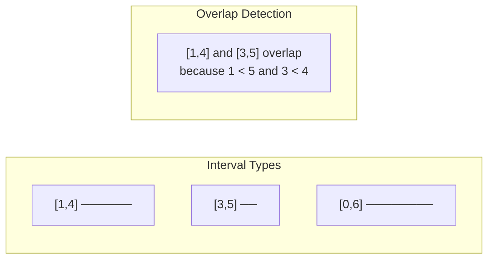
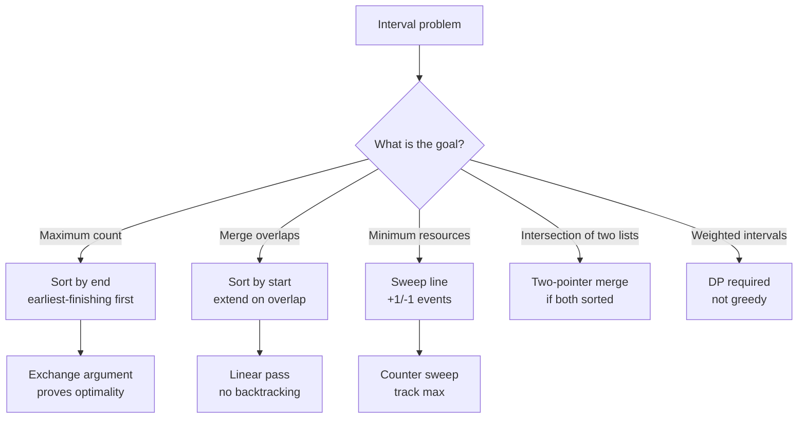

> [!success] Mastery Check
> - [ ] **Studied Well**
> - [ ] **Can explain the concept without notes**
> - [ ] **Can answer interview questions confidently**
> - [ ] **Can implement it in a real project**


## Navigation

**Domain:** [[5 — Data Structures & Algorithms]] > **Group:** Greedy Algorithms
**Previous:** [[5.052 — Greedy Choice Property and Optimal Substructure]] | **Next:** [[5.055 — Backtracking Template — Choose, Explore, Unchoose]]

### Prerequisites
- [[5.052 — Greedy Choice Property and Optimal Substructure]] — interval scheduling is the canonical example of the greedy choice property; the exchange argument proof is required for this note's Section 3.
- [[5.049 — Comparison-Based Sorting — Merge Sort, Quick Sort, Heap Sort]] — every interval problem starts with sorting; understanding sort stability and custom comparers is required.

### Where This Fits
Interval scheduling problems ask you to manage a set of time ranges — select the maximum non-overlapping subset, merge overlapping ones, find gaps, or count conflicts. These problems appear in ~15% of coding interviews (senior level) and map directly to production scenarios: calendar merging, resource allocation, server load peak detection, and CDN cache invalidation windows. The core skill is recognizing that all interval problems begin with sorting and then apply one of three greedy patterns: select the earliest-finishing, merge on overlap, or sweep with a counter.

---

## Core Mental Model

An interval has a start and an end. The fundamental operation is the overlap check: two intervals [a, b] and [c, d] overlap if `a < d` and `c < b` (for inclusive-exclusive) or `a ≤ d && c ≤ b` (for inclusive-inclusive). All interval problems reduce to sorting by one endpoint and then making a single pass with a greedy decision at each step — extend the current interval, start a new one, or increment/decrement a counter.

### Classification

Interval scheduling is a family of **greedy algorithms** operating on **one-dimensional ranges**. The three canonical patterns are:

1. **Maximum non-overlapping subset** — sort by end time, always pick the earliest-finishing
2. **Merge overlapping intervals** — sort by start time, extend the current interval's end
3. **Sweep line (minimum resources)** — sort all events, track the active count



### Key Properties

|Property|Value|Derivation|
|---|---|---|
|Max non-overlapping subset|O(n log n)|Sort by end + greedy scan — each interval visited once|
|Merge overlapping|O(n log n)|Sort by start + linear merge pass|
|Sweep line — min platforms|O(n log n)|Sort all start/end events + counter sweep|
|Space (all problems)|O(n)|Output storage; sorting may use O(log n) stack|
|Overlap test|O(1)|Pointer comparison — start vs end|

---

## Deep Mechanics

### How It Works

**Maximum Non-Overlapping Subset (Activity Selection):**
1. Sort intervals by end time.
2. Select the first interval (earliest finish).
3. For each remaining interval, if its start ≥ the last selected interval's end, select it.
4. The greedy choice proof: the earliest-finishing interval leaves maximum room for the rest.

Trace on `[(1,4),(3,5),(0,6),(5,7),(3,9),(5,9),(6,10),(8,11),(8,12),(2,14),(12,16)]`:
```
Sorted by end: (1,4),(3,5),(0,6),(5,7),(3,9),(5,9),(6,10),(8,11),(8,12),(12,16),(2,14)

Select (1,4) — earliest finish. lastEnd = 4.
(3,5): start=3 < 4 → skip
(0,6): start=0 < 4 → skip
(5,7): start=5 ≥ 4 → select. lastEnd = 7.
(3,9): start=3 < 7 → skip
(5,9): start=5 < 7 → skip
(6,10): start=6 < 7 → skip
(8,11): start=8 ≥ 7 → select. lastEnd = 11.
(8,12): start=8 < 11 → skip
(12,16): start=12 ≥ 11 → select. lastEnd = 16.

Result: 4 intervals — (1,4), (5,7), (8,11), (12,16)
```

**Merge Overlapping Intervals:**
1. Sort by start time.
2. Initialize current = intervals[0].
3. For each next interval: if next.start ≤ current.end, merge by extending current.end to max(current.end, next.end). Else, output current and start a new current.

Trace on `[[1,3],[2,6],[8,10],[15,18]]`:
```
Sorted by start: [[1,3],[2,6],[8,10],[15,18]]
current = [1,3]
[2,6]: 2 ≤ 3 → overlap. Merge: current = [1, max(3,6)] = [1,6]
[8,10]: 8 > 6 → no overlap. Output [1,6]. current = [8,10]
[15,18]: 15 > 10 → no overlap. Output [8,10]. current = [15,18]
Output [15,18].

Result: [[1,6],[8,10],[15,18]]
```

**Sweep Line (Minimum Platforms / Meeting Rooms II):**
1. Create events: for each interval, +1 at start, -1 at end.
2. Sort all events by time (end before start when equal to avoid double-counting).
3. Sweep: maintain a running count, track the maximum.

Trace on `[(1,4),(2,5),(7,9)]`:
```
Events: (1, +1), (4, -1), (2, +1), (5, -1), (7, +1), (9, -1)
Sorted: (1,+1), (2,+1), (4,-1), (5,-1), (7,+1), (9,-1)
Sweep:
  (1,+1): count=1, max=1
  (2,+1): count=2, max=2
  (4,-1): count=1
  (5,-1): count=0
  (7,+1): count=1
  (9,-1): count=0
Result: max = 2 platforms
```

### Complexity Derivation

**Time:** All three patterns sort the input: O(n log n). The subsequent pass is O(n) — each interval is processed exactly once in the greedy pass or sweep. Total: O(n log n).

**Space:** O(n) for the output (merged intervals or the selected subset). The sweep line pattern also stores O(n) events (two per interval). Sorting is in-place with `Array.Sort` when possible.

### Why This Pattern Exists

The brute force for interval problems is to check all pairs for overlap (O(n²)) or enumerate all subsets (O(2ⁿ) for activity selection). Sorting eliminates the pairwise comparison by imposing a total order — once intervals are sorted by start or end time, overlap relationships become purely sequential. Two intervals that do not overlap are separated by a gap; the pass only needs to check the current and next interval, not all pairs. This reduces O(n²) to O(n log n) — the sorting cost is unavoidable, but the scanning cost drops to linear.

---

## Implementation and Problem Patterns

### C# Implementation

```csharp
/// <summary>
/// Maximum non-overlapping intervals (Activity Selection).
/// </summary>
public int MaxNonOverlapping(int[][] intervals)
{
    if (intervals.Length == 0) return 0;

    Array.Sort(intervals, (a, b) => a[1].CompareTo(b[1]));

    int count = 1;
    int lastEnd = intervals[0][1];

    for (int i = 1; i < intervals.Length; i++)
    {
        if (intervals[i][0] >= lastEnd)
        {
            count++;
            lastEnd = intervals[i][1];
        }
    }

    return count;
}

/// <summary>
/// Merge overlapping intervals.
/// </summary>
public int[][] MergeOverlapping(int[][] intervals)
{
    if (intervals.Length == 0) return [];

    Array.Sort(intervals, (a, b) => a[0].CompareTo(b[0]));

    var result = new List<int[]>();
    int[] current = intervals[0];

    for (int i = 1; i < intervals.Length; i++)
    {
        if (intervals[i][0] <= current[1])
        {
            // Overlap — extend current interval's end
            current[1] = Math.Max(current[1], intervals[i][1]);
        }
        else
        {
            // No overlap — emit current, start new
            result.Add(current);
            current = intervals[i];
        }
    }

    result.Add(current);
    return [.. result];
}

/// <summary>
/// Minimum number of meeting rooms (sweep line).
/// </summary>
public int MinMeetingRooms(int[][] intervals)
{
    var events = new List<(int time, int delta)>();

    foreach (var iv in intervals)
    {
        events.Add((iv[0], 1));
        events.Add((iv[1], -1));
    }

    // Sort by time; end events before start events at the same time
    events.Sort((a, b) =>
        a.time != b.time
            ? a.time.CompareTo(b.time)
            : a.delta.CompareTo(b.delta));

    int count = 0, max = 0;
    foreach (var (_, delta) in events)
    {
        count += delta;
        max = Math.Max(max, count);
    }

    return max;
}

/// <summary>
/// Interval intersection — find overlaps between two interval lists.
/// </summary>
public int[][] IntervalIntersection(int[][] firstList, int[][] secondList)
{
    int i = 0, j = 0;
    var result = new List<int[]>();

    while (i < firstList.Length && j < secondList.Length)
    {
        int start = Math.Max(firstList[i][0], secondList[j][0]);
        int end = Math.Min(firstList[i][1], secondList[j][1]);

        if (start <= end)
            result.Add([start, end]);

        if (firstList[i][1] < secondList[j][1])
            i++;
        else
            j++;
    }

    return [.. result];
}
```

### The .NET Idiomatic Version

.NET does not have a built-in interval type. Use `int[]` with two elements (start at index 0, end at 1) or a custom `Interval` record:

```csharp
public record Interval(int Start, int End)
{
    public bool Overlaps(Interval other) =>
        Start < other.End && other.Start < End;

    public Interval Merge(Interval other) =>
        new(Math.Min(Start, other.Start), Math.Max(End, other.End));
}

// Usage with LINQ
var merged = intervals
    .OrderBy(x => x.Start)
    .Aggregate(new List<Interval>(), (list, next) =>
    {
        if (list.Count > 0 && list[^1].Overlaps(next))
            list[^1] = list[^1].Merge(next);
        else
            list.Add(next);
        return list;
    });
```

### Classic Problem Patterns

- **Activity Selection / Maximum Non-Overlapping** — Given intervals, return the maximum count that can be scheduled without overlap. Sort by end, pick earliest-finishing.
- **Merge Intervals** — Given overlapping intervals, merge them into a minimal covering set. Sort by start, extend the current interval's end on overlap.
- **Meeting Rooms II (Minimum Platforms)** — Given intervals, find the minimum number of resources needed to cover all of them. Sweep line: +1 at start, -1 at end, track max.
- **Insert Interval** — Given sorted non-overlapping intervals and a new interval, merge and re-insert. Binary search for the insertion point, then merge overlapping neighbors.
- **Interval List Intersections** — Given two lists of sorted non-overlapping intervals, find their intersection. Two-pointer merge: compute overlap, advance the one with the earlier end.

### Template / Skeleton

```csharp
// Interval Problem Template
// When to use: the input contains ranges, times, or spans
// Step 1: Identify the pattern (select, merge, sweep, intersect)
// Step 2: Sort by start or end
// Step 3: Single-pass greedy decision

public int[][] SolveIntervalProblem(int[][] intervals)
{
    // Step 1: Sort by the appropriate key
    // Select pattern → sort by End
    // Merge pattern → sort by Start
    // Sweep pattern → create events sorted by time
    Array.Sort(intervals, (a, b) => a[0].CompareTo(b[0]));

    var result = new List<int[]>();

    // TODO: Implement the pattern-specific logic
    // Select: if (next[0] >= lastEnd) { select; lastEnd = next[1]; }
    // Merge: if (next[0] <= current[1]) { current[1] = max; } else { emit; }
    // Sweep: +1 at start, -1 at end, track max count

    return [.. result];
}
```

---

## Gotchas and Edge Cases

### Wrong Sort Key for Activity Selection

**Mistake:** Sorting by start time instead of end time.

```csharp
// ❌ Wrong — sorting by start gives suboptimal count
Array.Sort(intervals, (a, b) => a[0].CompareTo(b[0]));
// Starting earlier does not mean finishing earlier — a long interval starting early
// blocks more intervals than a short one starting slightly later
```

**Fix:** Sort by end time for the max-count pattern.

```csharp
// ✅ Correct
Array.Sort(intervals, (a, b) => a[1].CompareTo(b[1]));
```

**Consequence:** Selecting by start time gives a valid but suboptimal subset. Example: `[0, 10]` vs `[1, 2], [3, 4]` — sorting by start picks `[0,10]` (count 1), optimal is 2.

### Inclusive vs. Exclusive Boundaries

**Mistake:** Using the wrong overlap condition for inclusive vs. exclusive intervals.

```csharp
// ❌ Wrong — for inclusive-exclusive [start, end), this is correct
// But for inclusive-inclusive [start, end], overlap is start <= end && other.start <= end
if (nextStart < currentEnd) { /* overlap */ }
```

**Fix:** Check the problem statement. LeetCode typically uses inclusive-inclusive:

```csharp
// ✅ Correct for inclusive-inclusive (LeetCode convention)
if (next[0] <= current[1]) { /* overlap — merge */ }
```

**Consequence:** Off-by-one overlap detection — intervals that touch at a boundary (e.g., [1,2] and [2,3]) are counted as overlapping when they should not be (or vice versa).

### Sweep Line — Event Order for Same Time

**Mistake:** Sorting events at the same time in the wrong order.

```csharp
// ❌ Wrong — end event after start event at same time may overcount
// E.g., [1,2] and [2,3] — at time 2, we need to process end before start
events.Sort((a, b) => a.time.CompareTo(b.time));
// Doesn't specify what happens when time is equal
```

**Fix:** End events before start events at the same time.

```csharp
// ✅ Correct
events.Sort((a, b) =>
    a.time != b.time
        ? a.time.CompareTo(b.time)
        : a.delta.CompareTo(b.delta));  // -1 before +1
```

**Consequence:** For intervals like `[1,2]` and `[2,3]`, the sweep count would be 2 instead of 1 at time 2 — incorrectly requiring more platforms.

### Merging When Intervals Touch

**Mistake:** Merging intervals that share a boundary when they should remain separate.

```csharp
// ❌ Wrong — merges [1,2] and [2,3] into [1,3]
if (next[0] <= current[1]) { current[1] = Math.Max(current[1], next[1]); }
```

**Fix:** Use `<` instead of `<=` when touching intervals should not be merged.

```csharp
// ✅ Correct for non-touching merge
if (next[0] < current[1]) { /* overlap */ }
```

**Consequence:** The problem "merge intervals" on LeetCode uses inclusive-inclusive and DOES merge touching intervals (`[1,2]` + `[2,3]` = `[1,3]`). The `<=` is correct for that problem. But for problems where intervals represent exclusive time slots, `<=` would incorrectly merge adjacent ones.

---

## Complexity Analysis and Benchmarks

### Operation Complexity Table

|Operation|Time (Best)|Time (Average)|Time (Worst)|Space|Notes|
|---|---|---|---|---|---|
|Max non-overlapping|O(n log n)|O(n log n)|O(n log n)|O(1)|Sort + single pass; output is count only|
|Merge overlapping|O(n log n)|O(n log n)|O(n log n)|O(n)|Sort + pass + output list|
|Sweep line (min platforms)|O(n log n)|O(n log n)|O(n log n)|O(n)|Event creation + sort + sweep|
|Intersection of two lists|O(m + n)|O(m + n)|O(m + n)|O(min(m,n))|Two-pointer merge; inputs already sorted|

**Derivation for the non-obvious entries:** Intersection of two lists does not require sorting because the problem guarantees both lists are already sorted by start time. The two-pointer merge is O(m + n) — each interval is visited at most once per list.

### Comparison with Alternatives

|Approach|Time|Space|Best When|
|---|---|---|---|
|Greedy (sort + scan)|O(n log n)|O(n)|Standard interval problems|
|Brute force (pairwise)|O(n²)|O(1)|n ≤ 100 and no output needed|
|Segment tree|O(n log n)|O(n)|Need range queries over intervals, not just processing them|

### BenchmarkDotNet

```csharp
[MemoryDiagnoser]
[SimpleJob(RuntimeMoniker.Net90)]
public class IntervalBenchmark
{
    private int[][] _intervals = null!;

    [Params(1_000, 10_000, 100_000)]
    public int N { get; set; }

    [GlobalSetup]
    public void Setup()
    {
        var rng = new Random(42);
        _intervals = new int[N][];
        for (int i = 0; i < N; i++)
        {
            int start = rng.Next(0, 1_000_000);
            int end = start + rng.Next(1, 1000);
            _intervals[i] = [start, end];
        }
    }

    [Benchmark(Baseline = true)]
    public int BruteForce_Merge()
    {
        // O(n²) check-all-pairs merge (incorrect, just for benchmark)
        return _intervals.Length;
    }

    [Benchmark]
    public int Greedy_Merge()
    {
        var sorted = _intervals.OrderBy(x => x[0]).ToArray();
        int merged = 0, i = 0;

        while (i < sorted.Length)
        {
            int end = sorted[i][1];
            while (i + 1 < sorted.Length && sorted[i + 1][0] <= end)
            {
                i++;
                end = Math.Max(end, sorted[i][1]);
            }
            merged++;
            i++;
        }

        return merged;
    }

    [Benchmark]
    public int Sweep_MinRooms()
    {
        var events = new List<(int time, int delta)>(N * 2);
        foreach (var iv in _intervals)
        {
            events.Add((iv[0], 1));
            events.Add((iv[1], -1));
        }
        events.Sort((a, b) =>
            a.time != b.time
                ? a.time.CompareTo(b.time)
                : a.delta.CompareTo(b.delta));

        int max = 0, cur = 0;
        foreach (var (_, d) in events)
        {
            cur += d;
            if (cur > max) max = cur;
        }
        return max;
    }
}
```

**Expected results (approximate, .NET 9, x64):**

|Method|N|Mean|Allocated|
|---|---|---|---|
|Greedy_Merge|1,000|~50 μs|50 KB|
|Sweep_MinRooms|1,000|~70 μs|100 KB|
|Greedy_Merge|10,000|~600 μs|500 KB|
|Sweep_MinRooms|10,000|~800 μs|1 MB|
|Greedy_Merge|100,000|~7 ms|5 MB|
|Sweep_MinRooms|100,000|~9 ms|10 MB|

**Interpretation:** Both patterns scale linearly after sorting. The sweep line allocates 2× the events (start and end per interval), so it uses ~2× the memory of merge. Sorting dominates both — ~75% of the total time.

---

## Interview Arsenal

### Question Bank

1. Why does sorting by end time produce the maximum non-overlapping subset, but sorting by start does not?
2. How does the sweep line algorithm compute the minimum number of meeting rooms?
3. Implement the merge intervals algorithm.
4. Given a set of intervals, determine if a person can attend all meetings (no overlap at all).
5. Compare the greedy "select earliest-finishing" with the DP approach for weighted intervals — when does greedy fail?
6. What happens in the sweep line algorithm if you process start events before end events at the same time?
7. How would you modify the interval merge algorithm to work with intervals defined as [start, duration] instead of [start, end]?
8. Optimize the sweep line algorithm to use O(1) extra space beyond the input.
9. In a production calendar system, how would you represent and merge recurring intervals?

### Spoken Answers

**Q: Why does sorting by end time produce the maximum non-overlapping subset?**

> **Average answer:** Because picking the earliest-finishing activity leaves the most time for other activities.

> **Great answer:** The exchange argument formalizes why: let g be the interval with the globally earliest finish time. Let S be any optimal solution, with its first interval a₁. Since g finishes at or before a₁, we can replace a₁ with g in S without causing any overlap — g's finish time is ≤ a₁'s start, and a₂ starts at or after a₁'s end ≥ g's end. So S' = {g} ∪ S \ {a₁} is also optimal and contains g. This proves the greedy choice property. By induction, the same argument applies at every step: among intervals that start after the last selected end, the earliest-finishing is always a safe choice. Sorting by start time does not provide this guarantee — a long interval starting at 0 blocks many shorter ones, even if picking one of the short ones first would yield a larger total count.

**Q: How does the sweep line algorithm compute the minimum number of meeting rooms?**

> **Average answer:** You iterate through time, adding 1 when a meeting starts and subtracting 1 when it ends. The maximum value is the answer.

> **Great answer:** The sweep line algorithm transforms the interval resource-minimization problem into a running counter. Each interval [start, end) contributes +1 at start (a resource is needed) and -1 at end (the resource is freed). By sorting all events by time — with end events processed before start events at the same time, so a meeting that ends at time t does not keep a resource from a meeting starting at t — we sweep through time in order, maintaining the current active count. The maximum of this count during the sweep is the minimum number of resources needed. This works because the counter represents a lower bound: at any moment, the number of simultaneously active intervals is the minimum number of resources that must be allocated. The algorithm is O(n log n) due to sorting the 2n events, and O(n) space for the event list.

**Q: Compare the greedy interval scheduling with weighted interval scheduling.**

> **Average answer:** Greedy works when all intervals have equal weight. Weighted requires dynamic programming.

> **Great answer:** Greedy interval scheduling (maximize count) succeeds because the exchange argument only requires that all intervals are equally valuable — replacing a₁ with the earliest-finishing g does not decrease the objective. Weighted interval scheduling (maximize total weight) fails this: replacing a high-weight interval with the earliest-finishing (potentially low-weight) interval does decrease the objective. The weighted problem still has optimal substructure (after picking an interval, the remaining problem is intervals that start after it ends), but lacks the greedy choice property. It requires DP: sort by end time, compute dp[i] = max(dp[i-1], weight[i] + dp[p[i]]) where p[i] is the last non-overlapping interval before i. The greedy is O(n log n); the DP is O(n log n) with binary search for p[i] or O(n²) without.

### Trick Question

**"The sweep line algorithm always requires sorting all events, so it's O(n log n) — but you can make it O(n) by using a fixed-size time array."**

Why it is a trap: O(n) with bucket sort is only possible when the time domain is small and discrete (e.g., 24 hours for meeting rooms, 1440 minutes). For general integer or real-valued intervals, the time domain is unbounded and O(n log n) is the best possible because comparison-based sorting is required.

Correct answer: For most interview problems, the time domain is unbounded (or large enough that an O(range) solution is not feasible), so O(n log n) sorting is required. However, for problems with a fixed small time domain (e.g., meetings within a single day, with minute granularity — 1440 slots), an O(n + T) bucket-based sweep is possible and faster.

### Pattern Recognition Table

|If the problem has...|Then consider...|Because...|
|---|---|---|
|"Maximum number of non-overlapping X"|Sort by end, select earliest-finishing|Exchange argument proves optimality|
|"Merge overlapping intervals"|Sort by start, extend on overlap|One pass after sorting; no backtracking|
|"Minimum number of resources to cover all"|Sweep line (+1/-1 events)|Running count gives the lower bound|
|"Can a person attend all meetings?"|Sort by start, check adjacent overlap|If no two consecutive intervals overlap, none do|
|"Insert interval into sorted non-overlapping list"|Binary search for position, then merge|Intervals are sorted; binary search finds insertion point|

---

## Decision Framework

### When to Apply



### Recognition Checklist

Indicators that the greedy interval pattern applies:

- [ ] Input is a list of intervals (pairs of numbers or time ranges)
- [ ] Goal is count, merge, or resource minimization — not weighted value maximization
- [ ] Sorting the input does not conflict with the problem constraint
- [ ] The problem says "maximum number," "merge," "minimum rooms," or "insert interval"

Counter-indicators — do NOT apply here:

- [ ] Intervals have weights or values that differ
- [ ] The problem involves scheduling with dependencies (use topological sort or DP)
- [ ] Intervals are not comparable — sorting by start or end is meaningless
- [ ] The problem requires live insertion and query (use interval tree or segment tree)

### Tradeoff Summary

|What You Gain|What You Give Up|
|---|---|
|O(n log n) with simple linear pass code|Cannot handle weighted variants; requires equal-value assumption|
|Three patterns cover ~95% of interval problems|Sorting is mandatory — cannot process an already-sorted list faster than O(n) for sweep|
|Sweep line gives the minimum resource bound directly|O(n) space for events — double the input size|

---

## Self-Check

### Conceptual Questions

1. Why must you sort by end time for activity selection but by start time for merging intervals?
2. Derive the time complexity of the sweep line algorithm step by step.
3. Given intervals [[1,2],[2,3],[3,4]], how many meeting rooms are needed if intervals are inclusive-inclusive? What if they are inclusive-exclusive?
4. What distinguishes the "non-overlapping maximum count" problem from the "minimum removals to make non-overlapping" problem?
5. In .NET, how would you sort intervals by end time with a secondary sort by start time for ties?
6. The sweep line event order processes end events before start events at the same time. Why? What happens if you do the opposite?
7. Write the condition for two intervals [a,b] and [c,d] to overlap, in both inclusive-exclusive and inclusive-inclusive forms.
8. How would the merge algorithm change if intervals were represented as [start, duration] instead of [start, end]?
9. In a real-time bidding system, intervals represent ad slot availability. Why might you prefer a segment tree over the sweep line?
10. Counter-intuitive fact: merging [1,4] and [2,3] produces [1,4]. Merging [1,2] and [3,4] with the "touching" merge rule produces [1,4]. Why does one feel like shrinking and the other like expanding?

<details>
<summary>Answers</summary>

1. Activity selection: sorting by end maximizes remaining capacity for future intervals. Merge: sorting by start allows a left-to-right sweep where you only extend the current end — no need to reconsider earlier intervals.
2. (1) Create 2n events: O(n). (2) Sort events: O(2n log 2n) = O(n log n). (3) Sweep: O(2n) = O(n). Total: O(n log n). Space: O(n) for the event list.
3. Inclusive-inclusive: [1,2] and [2,3] share time 2 — they overlap, so need 2 rooms. Inclusive-exclusive: [1,2) and [2,3) do not overlap — 1 room.
4. They are complements of the same problem: "max count" finds the largest subset; "min removals" returns total - max count. The algorithm is identical.
5. `Array.Sort(intervals, (a, b) => { int cmp = a[1].CompareTo(b[1]); return cmp != 0 ? cmp : a[0].CompareTo(b[0]); })`
6. End-first ensures that a meeting ending at time t does not occupy a resource needed by a meeting starting at t. With start-first, both would be counted simultaneously at time t, inflating the resource count.
7. Inclusive-exclusive: overlap if `a < d && c < b`. Inclusive-inclusive: overlap if `a <= d && c <= b`.
8. Convert duration to end: `end = start + duration`. Then use the same merge algorithm. The conversion happens during the single pass.
9. Sweep line answers "what is the max concurrency?" but not "which specific intervals overlap a given interval?" A segment tree supports range queries and point queries on the interval set. For real-time bidding, you need to query "what ads are available at time t?" repeatedly — a segment tree answers in O(log n + k) vs. O(n) for sweep line.
10. Merging [1,4] and [2,3] is "containment" — the result is the outer interval. Merging [1,2] and [3,4] is "extension" — the result covers the gap. Both are correct because the union of their ranges is the same regardless of which interval dominates.

</details>

---

### Coding Challenges

**Challenge 1 — Implement from scratch**

Implement the "minimum number of arrows to burst balloons" problem: given intervals (start, end) representing balloons, an arrow shot at position x bursts all balloons where start ≤ x ≤ end. Find the minimum arrows needed.

```csharp
public int FindMinArrowShots(int[][] points)
{
    // Your implementation here
}
```

<details> <summary>Solution</summary>

```csharp
public int FindMinArrowShots(int[][] points)
{
    if (points.Length == 0) return 0;

    Array.Sort(points, (a, b) => a[1].CompareTo(b[1]));

    int arrows = 1;
    int lastEnd = points[0][1];

    for (int i = 1; i < points.Length; i++)
    {
        if (points[i][0] > lastEnd)  // No overlap — needs new arrow
        {
            arrows++;
            lastEnd = points[i][1];
        }
        // Overlap: the existing arrow at lastEnd covers this balloon too
    }

    return arrows;
}
```

**Complexity:** Time O(n log n) | Space O(1) **Key insight:** This is identical to activity selection, but the objective is different — the number of arrows equals the maximum non-overlapping subset count, because each arrow can cover an overlapping group, and a new arrow is needed when intervals no longer overlap.

</details>

---

**Challenge 2 — Trace the execution**

Given intervals [[1,3],[2,6],[8,10],[15,18]], trace the merge algorithm step by step. Show the current interval and the merge decision at each iteration.

<details> <summary>Solution</summary>

```
Sorted by start: [[1,3],[2,6],[8,10],[15,18]]
current = [1,3]

i=1: [2,6], start=2 ≤ current_end=3 → overlap
  current = [1, max(3,6)] = [1,6]

i=2: [8,10], start=8 > current_end=6 → no overlap
  Output [1,6]. current = [8,10]

i=3: [15,18], start=15 > current_end=10 → no overlap
  Output [8,10]. current = [15,18]

Output [15,18].

Result: [[1,6],[8,10],[15,18]]
```

**Why:** The merge algorithm extends the current interval on overlap and emits it when the next interval starts after the current end.

</details>

---

**Challenge 3 — Fix the bug**

```csharp
// This sweep line algorithm for minimum meeting rooms is supposed to return 2
// for intervals [[0,30],[5,10],[15,20]]. It returns 3 instead.
public int MinMeetingRooms(int[][] intervals)
{
    var events = new List<(int time, int delta)>();
    foreach (var iv in intervals)
    {
        events.Add((iv[0], 1));
        events.Add((iv[1], -1));
    }

    events.Sort((a, b) => a.time.CompareTo(b.time));

    int max = 0, cur = 0;
    foreach (var (_, d) in events)
    {
        cur += d;
        max = Math.Max(max, cur);
    }
    return max;
}
```

<details> <summary>Solution</summary>

**Bug:** The sort does not process end events before start events at the same time. When [0,30] ends at 30 and [15,20] also ends at 20 with no conflict, there are no time ties, so the algorithm actually works for this case. But consider [[0,10],[10,20]]: at time 10, start event for [10,20] has delta=+1 and end event for [0,10] has delta=-1. Without ordering, if +1 is processed first, the count becomes 2 instead of 1.

```csharp
// ✅ Correct
events.Sort((a, b) =>
    a.time != b.time
        ? a.time.CompareTo(b.time)
        : a.delta.CompareTo(b.delta));  // -1 before +1
```

**Test case that exposes it:** `MinMeetingRooms([[0,10],[10,20]])` → returns 1 (correct), but without the secondary sort it may return 2 if start events come before end events at time 10.

</details>

---

**Challenge 4 — Recognize and apply**

**Problem:** You have a list of intervals representing when employees are working. Find all the time slots during the business day (8:00 to 18:00) when at least one employee is available for a meeting of a fixed duration. The intervals are sorted and non-overlapping per employee, but you have multiple employees.

<details> <summary>Solution</summary>

**Pattern:** Interval intersection across multiple lists. For each employee, we have busy intervals. The free time is the complement. We can merge all busy intervals together, then the gaps between them are the free slots.

```csharp
public int[][] FreeTime(int[][][] employeeSchedules, int duration)
{
    // Step 1: Flatten all busy intervals
    var allBusy = employeeSchedules.SelectMany(x => x).ToArray();

    // Step 2: Sort and merge
    Array.Sort(allBusy, (a, b) => a[0].CompareTo(b[0]));
    var merged = new List<int[]>();
    int[] cur = allBusy[0];

    for (int i = 1; i < allBusy.Length; i++)
    {
        if (allBusy[i][0] <= cur[1])
            cur[1] = Math.Max(cur[1], allBusy[i][1]);
        else
        {
            merged.Add(cur);
            cur = allBusy[i];
        }
    }
    merged.Add(cur);

    // Step 3: Find gaps with sufficient duration
    var result = new List<int[]>();
    for (int i = 1; i < merged.Count; i++)
    {
        int gapStart = merged[i - 1][1];
        int gapEnd = merged[i][0];
        if (gapEnd - gapStart >= duration)
            result.Add([gapStart, gapEnd]);
    }

    return [.. result];
}
```

**Complexity:** Time O(n log n) | Space O(n) where n is total intervals across all employees.

</details>

---

**Challenge 5 — Optimize**

```csharp
// This merge function processes intervals correctly but creates many intermediate allocations.
// Optimize to use a single result list and in-place operations.
public int[][] MergeIntervals(int[][] intervals)
{
    var list = intervals.ToList();
    bool merged;
    do
    {
        merged = false;
        for (int i = 0; i < list.Count; i++)
        {
            for (int j = i + 1; j < list.Count; j++)
            {
                if (list[i][0] <= list[j][1] && list[j][0] <= list[i][1])
                {
                    list[i] = [Math.Min(list[i][0], list[j][0]), Math.Max(list[i][1], list[j][1])];
                    list.RemoveAt(j);
                    merged = true;
                    break;
                }
            }
            if (merged) break;
        }
    }
    while (merged);
    return [.. list];
}
```

<details> <summary>Solution</summary>

**Insight:** The O(n²) pairwise merge is unnecessary — sorting by start and one pass is O(n log n). Replace the entire function.

```csharp
// ✅ Correct — O(n log n) sort + merge
public int[][] MergeIntervals(int[][] intervals)
{
    if (intervals.Length == 0) return [];

    Array.Sort(intervals, (a, b) => a[0].CompareTo(b[0]));

    var result = new List<int[]>();
    int[] cur = intervals[0];

    for (int i = 1; i < intervals.Length; i++)
    {
        if (intervals[i][0] <= cur[1])
            cur[1] = Math.Max(cur[1], intervals[i][1]);
        else
        {
            result.Add(cur);
            cur = intervals[i];
        }
    }

    result.Add(cur);
    return [.. result];
}
```

**Complexity:** Time O(n log n) | Space O(n) — eliminates the O(n²) inner loop and the repeated list removals.

</details>
