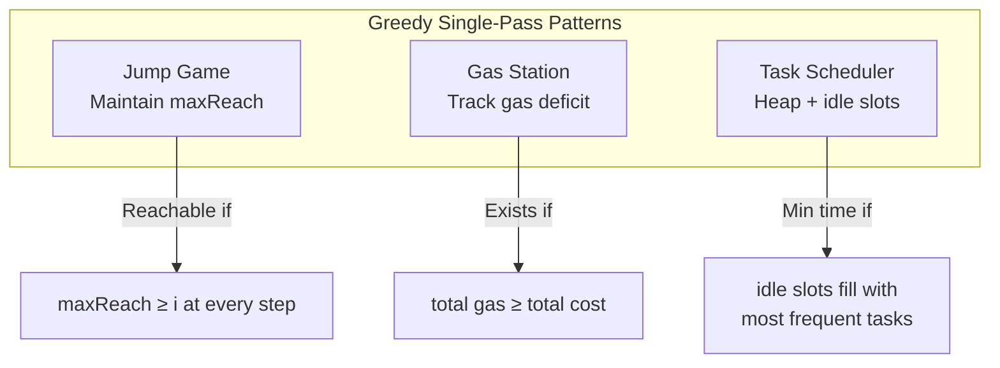
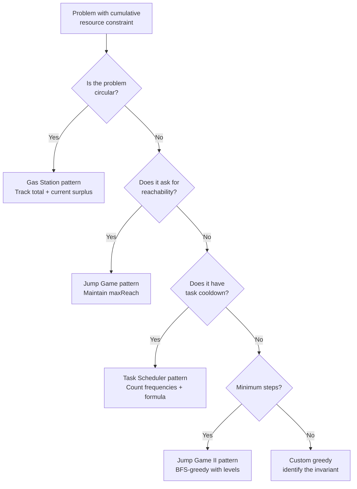

> [!success] Mastery Check
> - [ ] **Studied Well**
> - [ ] **Can explain the concept without notes**
> - [ ] **Can answer interview questions confidently**
> - [ ] **Can implement it in a real project**


## Navigation

**Domain:** [[5 — Data Structures & Algorithms]] > **Group:** Greedy Algorithms
**Previous:** [[5.053 — Interval Scheduling — Activity Selection and Merging Overlapping Intervals]] | **Next:** [[5.055 — Backtracking Template — Choose, Explore, Unchoose]]

### Prerequisites
- [[5.052 — Greedy Choice Property and Optimal Substructure]] — each pattern in this note has a specific greedy choice proof; understanding the exchange argument framework is required.
- [[5.031 — Min-Heap and Max-Heap — Structure and Heapify]] — Task Scheduler uses a max-heap to always execute the most frequent remaining task.

### Where This Fits
Beyond interval scheduling, three greedy patterns appear regularly in interviews: **reachability** (Jump Game — can you reach the end with step allowances?), **circular feasibility** (Gas Station — find the unique starting station that lets you complete a circuit), and **cooldown scheduling** (Task Scheduler — minimize total time with cooling restrictions). These patterns share the structure of a cumulative invariant that must never drop below zero, and a greedy scan that finds the answer in a single pass. Together with interval scheduling, they cover ~80% of greedy problems asked at the senior level.

---

## Core Mental Model

All three patterns exploit the same underlying idea: maintain a running resource that decreases with consumption and increases with acquisition. If the total resource is sufficient (total gas ≥ total cost, total jumps ≥ remaining distance), there exists a point from which the trajectory is always non-negative. The greedy scan identifies this point in one pass by tracking the running deficit and resetting the candidate whenever the deficit drops below zero.

### Classification

These are **single-pass greedy algorithms** with a **cumulative invariant**. They require no sorting (unlike interval scheduling), only a linear scan tracking a running balance.



### Key Properties

|Property|Value|Derivation|
|---|---|---|
|Jump Game — feasibility|O(n)|Single pass: track maxReach, update at each step|
|Jump Game II — min jumps|O(n)|BFS-like greedy: track current end and farthest reach|
|Gas Station — find start|O(n)|Single pass: track deficit, reset candidate on failure|
|Task Scheduler — min time|O(n log k)|Count frequencies, max-heap scheduler, idle gap fill|
|Space (all patterns)|O(1) or O(k)|Gas/jump: O(1). Task scheduler: O(k) for heap|

---

## Deep Mechanics

### How It Works

**Jump Game (reachability):** Maintain `maxReach` = the farthest index reachable so far. At each position i, if `i > maxReach`, we are stuck. Otherwise, update `maxReach = max(maxReach, i + nums[i])`. If `maxReach ≥ n-1`, the end is reachable.

Trace on `[2, 3, 1, 1, 4]`:
```
i=0: maxReach = max(0, 0+2) = 2. Can reach index 2.
i=1: i ≤ maxReach. maxReach = max(2, 1+3) = 4. Can reach index 4.
i=2: i ≤ maxReach. maxReach = max(4, 2+1) = 4.
i=3: i ≤ maxReach. maxReach = max(4, 3+1) = 4.
i=4: i ≤ maxReach. maxReach = max(4, 4+4) = 8 ≥ 4 → reachable.
```

**Jump Game II (minimum jumps):** BFS on the implicit graph. At each step, scan the current "level" (from `currentEnd` to the next boundary) to find the farthest reachable index, then increment the jump count and advance to that new boundary.

Trace on `[2, 3, 1, 1, 4]`:
```
jumps=0, currentEnd=0, farthest=0
i=0: farthest = max(0, 0+2) = 2. i == currentEnd → jump to farthest.
  jumps=1, currentEnd=2
i=1: farthest = max(2, 1+3) = 4.
i=2: farthest = max(4, 2+1) = 4. i == currentEnd → jump to farthest.
  jumps=2, currentEnd=4 → reached end. Return 2.
```

**Gas Station:** Track total and current gas surplus. If `gas[i] - cost[i]` drops the current surplus below 0, the start station cannot be before or at i — set start = i+1 and reset current surplus. If total surplus ≥ 0, the start is valid.

Trace on `gas=[1,2,3,4,5], cost=[3,4,5,1,2]`:
```
i=0: surplus = 1-3 = -2 → total=-2, current=-2 < 0 → start=1, current=0
i=1: surplus = 2-4 = -2 → total=-4, current=-2 < 0 → start=2, current=0
i=2: surplus = 3-5 = -2 → total=-6, current=-2 < 0 → start=3, current=0
i=3: surplus = 4-1 = +3 → total=-3, current=3
i=4: surplus = 5-2 = +3 → total=0, current=6
total ≥ 0 → return start = 3
```

**Task Scheduler:** Count task frequencies. The most frequent task determines the minimum length: `(maxCount - 1) * (n + 1) + tasksWithMaxCount`. The formula represents filling idle slots with other tasks.

Trace on `tasks=[A,A,A,B,B,B,C,D], n=2`:
```
Counts: A=3, B=3, C=1, D=1
maxCount = 3, tasksWithMaxCount = 2 (A and B)
Minimum = (3-1)*(2+1) + 2 = 2*3+2 = 8
If there were 9 tasks, check: total idle slots = (maxCount-1) * n = 4
Remaining tasks after max-freq: 8 - 2 = 6. Idle slots = max(0, 6 - 4) = 0.
Result = max(8, 8) = 8.
```

### Complexity Derivation

**Jump Game:** Single pass through the array: O(n). Each element sets `maxReach = max(maxReach, i + nums[i])` — O(1) per element. Total: O(n). Space: O(1).

**Jump Game II:** Same structure as Jump Game but with an additional tracker (`currentEnd`). Each element is visited at most once: O(n). Space: O(1).

**Gas Station:** Single pass through the arrays: O(n). Each station computes gas[i]-cost[i] (O(1)) and updates start on failure. Each station is visited exactly once. Total: O(n). Space: O(1).

**Task Scheduler:** Counting frequencies: O(n). Building the priority queue: O(k log k) where k ≤ 26 (or k distinct tasks). The formula computation is O(1). Total: O(n log k) ≈ O(n). Space: O(k).

### Why This Pattern Exists

The brute force for these problems is O(n²) or worse: for Jump Game, try all possible paths (O(2ⁿ)); for Gas Station, start at each station and simulate (O(n²)); for Task Scheduler, enumerate all orderings (O(k!)). The greedy insight is that the problem's invariant is monotonic in a single variable: the maximum reachable index, the cumulative gas surplus, or the most frequent task count. Once you identify the invariant, one pass suffices — the only question is whether to update the answer candidate on every improvement (Jump Game II, Gas Station) or compute it directly from the invariant (Task Scheduler).

---

## Implementation and Problem Patterns

### C# Implementation

```csharp
/// <summary>
/// Jump Game — can you reach the last index?
/// </summary>
public bool CanJump(int[] nums)
{
    int maxReach = 0;

    for (int i = 0; i < nums.Length; i++)
    {
        if (i > maxReach) return false;  // Stuck — cannot proceed
        maxReach = Math.Max(maxReach, i + nums[i]);
        if (maxReach >= nums.Length - 1) return true;  // Early exit
    }

    return true;
}

/// <summary>
/// Jump Game II — minimum number of jumps to reach last index.
/// </summary>
public int Jump(int[] nums)
{
    int jumps = 0, currentEnd = 0, farthest = 0;

    for (int i = 0; i < nums.Length - 1; i++)
    {
        farthest = Math.Max(farthest, i + nums[i]);

        if (i == currentEnd)
        {
            jumps++;
            currentEnd = farthest;
        }
    }

    return jumps;
}

/// <summary>
/// Gas Station — find starting gas station to complete circuit.
/// Returns -1 if not possible.
/// </summary>
public int CanCompleteCircuit(int[] gas, int[] cost)
{
    int total = 0, current = 0, start = 0;

    for (int i = 0; i < gas.Length; i++)
    {
        int diff = gas[i] - cost[i];
        total += diff;
        current += diff;

        if (current < 0)
        {
            start = i + 1;  // Cannot start at any station up to i
            current = 0;
        }
    }

    return total >= 0 ? start : -1;
}

/// <summary>
/// Task Scheduler — minimum time to finish all tasks with cooldown n.
/// </summary>
public int LeastInterval(char[] tasks, int n)
{
    int[] counts = new int[26];
    foreach (char c in tasks)
        counts[c - 'A']++;

    int maxCount = counts.Max();
    int tasksWithMaxCount = counts.Count(c => c == maxCount);

    int minLength = (maxCount - 1) * (n + 1) + tasksWithMaxCount;
    return Math.Max(tasks.Length, minLength);
}
```

### The .NET Idiomatic Version

The Task Scheduler formula approach is O(n) and does not require a heap. However, if a heap-based simulation is needed for variant problems, use `PriorityQueue<TElement, TPriority>`:

```csharp
// Heap-based simulation of Task Scheduler (for variant problems with task ordering constraints)
public int LeastIntervalHeap(char[] tasks, int n)
{
    var counts = new Dictionary<char, int>();
    foreach (char c in tasks)
        counts[c] = counts.GetValueOrDefault(c) + 1;

    var maxHeap = new PriorityQueue<char, int>();
    foreach (var kv in counts)
        maxHeap.Enqueue(kv.Key, -kv.Value);  // Negative for max-heap

    int time = 0;
    while (maxHeap.Count > 0)
    {
        int k = n + 1;
        var temp = new List<char>();

        while (k > 0 && maxHeap.Count > 0)
        {
            char task = maxHeap.Dequeue();
            if (counts[task] > 1)
            {
                counts[task]--;
                temp.Add(task);
            }
            time++;
            k--;
        }

        foreach (char t in temp)
            maxHeap.Enqueue(t, -counts[t]);

        if (maxHeap.Count > 0) time += k;  // Idle time
    }

    return time;
}
```

### Classic Problem Patterns

- **Jump Game (reachability)** — Can you reach the end given max jump distances per position? Maintain maxReach; if it ever falls below current index, return false.
- **Jump Game II (minimum jumps)** — What is the minimum number of jumps to reach the end? BFS-greedy: scan each "level" and jump to the farthest reachable point.
- **Gas Station (circular tour)** — Find the unique station where a circuit is possible. The invariant: total gas ≥ total cost is necessary and sufficient; the start candidate resets whenever current gas drops below zero.
- **Task Scheduler (cooldown)** — Minimize total time to execute tasks with a cooldown between identical tasks. The most frequent task determines the minimum length; remaining tasks fill idle slots.
- **Candy Distribution** — Distribute candies to children with ratings. Greedy: left-to-right pass ensures higher-rated child gets more than left neighbor; right-to-left pass ensures higher-rated child gets more than right neighbor.
- **Remove K Digits** — Remove k digits from a string to form the smallest possible number. Monotonic stack greedy: remove larger digits before smaller ones from left to right.

### Template / Skeleton

```csharp
// Single-Pass Greedy Template (Jump Game / Gas Station style)
// When to use: problem asks "can you reach/complete" or "find the starting point"
// with cumulative resource constraints
// Time: O(n) | Space: O(1)

public int GreedySinglePass(int[] input)
{
    int total = 0, current = 0, candidate = 0;

    for (int i = 0; i < input.Length; i++)
    {
        // TODO: Compute the delta (gain - cost) at this step
        int delta = ComputeDelta(i);
        total += delta;
        current += delta;

        // TODO: If the running sum goes negative, reset
        if (current < 0)
        {
            candidate = i + 1;  // Cannot start at or before i
            current = 0;
        }
    }

    // TODO: Check if total resources are sufficient
    return total >= 0 ? candidate : -1;
}

// BFS-Greedy Template (Jump Game II style)
// When to use: problem asks for minimum steps/reaches to traverse
public int MinStepsGreedy(int[] nums)
{
    int steps = 0, currentEnd = 0, farthest = 0;

    for (int i = 0; i < nums.Length - 1; i++)
    {
        // TODO: Update farthest reachable from this position
        farthest = Math.Max(farthest, i + nums[i]);

        if (i == currentEnd)
        {
            steps++;
            currentEnd = farthest;
        }
    }

    return steps;
}
```

---

## Gotchas and Edge Cases

### Jump Game — Single Element

**Mistake:** Returning false for a single-element array.

```csharp
// ❌ Wrong — single element is already at the end
public bool CanJump(int[] nums)
{
    int maxReach = 0;
    for (int i = 0; i < nums.Length; i++)
    {
        if (i > maxReach) return false;
        maxReach = Math.Max(maxReach, i + nums[i]);
    }
    return true;
}
// Actually this is correct — i=0, maxReach=0, condition passes
```

**Fix:** The code above is correct. But ensure you handle the input validation: if `nums` is null or empty, the answer depends on the problem definition.

**Consequence:** The standard algorithm handles single-element correctly — the loop starts at 0, `i ≤ maxReach` (0 ≤ 0), and `maxReach = max(0, 0+nums[0]) ≥ 0`. Returns true.

### Gas Station — Large Integer Overflow

**Mistake:** Not accounting for large gas and cost values.

```csharp
// ❌ Wrong — gas[i] - cost[i] could overflow int
int diff = gas[i] - cost[i];
```

**Fix:** Use `long` if the values can exceed int range, or check constraints. LeetCode constraints (gas[i], cost[i] ≤ 10⁴, n ≤ 10⁵) are safe for int.

```csharp
// ✅ Correct for typical constraints
int diff = gas[i] - cost[i];  // gas[i] and cost[i] are ≤ 10⁴, safe
```

**Consequence:** In languages without overflow checking by default (C# does check in checked context, but unchecked is default), overflow wraps around silently, causing wrong answers for extreme values.

### Task Scheduler — More Max-Count Tasks Than Cooldown

**Mistake:** Not handling the case where there are more tasks with maxCount than n+1.

```csharp
// ❌ Wrong — (maxCount-1)*(n+1) + tasksWithMaxCount
// For tasks = [A,A,A,B,B,B,C,C,C] with n=1:
// maxCount=3, tasksWithMaxCount=3
// (3-1)*(1+1)+3 = 2*2+3 = 7. But total tasks = 9.
// The answer is max(9, 7) = 9. Correct if you take max with tasks.Length.
```

**Fix:** Always take `Math.Max(tasks.Length, minLength)`.

```csharp
// ✅ Correct
int minLength = (maxCount - 1) * (n + 1) + tasksWithMaxCount;
return Math.Max(tasks.Length, minLength);
```

**Consequence:** Without the max check, the result can be less than the total number of tasks — which is impossible.

### Gas Station — Reset Logic Off-by-One

**Mistake:** Resetting to `start = i` instead of `start = i + 1`.

```csharp
// ❌ Wrong — if current goes negative at i, station i cannot be the start
if (current < 0) { start = i; current = 0; }
```

**Fix:** The start must be the next station.

```csharp
// ✅ Correct
if (current < 0) { start = i + 1; current = 0; }
```

**Consequence:** If gas[i] - cost[i] is already negative at the start station itself, the algorithm incorrectly keeps it as candidate, and the final return will be wrong.

---

## Complexity Analysis and Benchmarks

### Operation Complexity Table

|Operation|Time (Best)|Time (Average)|Time (Worst)|Space|Notes|
|---|---|---|---|---|---|
|Jump Game (CanJump)|O(1)|O(n)|O(n)|O(1)|Single pass; early exit possible|
|Jump Game II (Jump)|O(n)|O(n)|O(n)|O(1)|Single pass; all elements visited|
|Gas Station|O(n)|O(n)|O(n)|O(1)|Two passes combined into one|
|Task Scheduler (formula)|O(n)|O(n)|O(n)|O(1)|Count frequencies, compute formula|
|Task Scheduler (heap)|O(n log k)|O(n log k)|O(n log k)|O(k)|Heap simulation; k = unique tasks|

**Derivation for the non-obvious entries:** Jump Game II is O(n) because each element is visited exactly once in the for loop. The `currentEnd` and `farthest` variables partition the array into "levels" that are processed in order. Every element belongs to exactly one level.

### Comparison with Alternatives

|Approach|Time|Space|Best When|
|---|---|---|---|
|Greedy single-pass (current patterns)|O(n)|O(1)|Invariant is monotonic; cumulative sum determines feasibility|
|DP (Jump Game reachability)|O(n²)|O(n)|Greedy fails (e.g., zero jumps block unreachable positions that DP would detect)|
|Simulation (Gas Station brute force)|O(n²)|O(1)|n ≤ 100 and no invariant insight|
|Backtracking (Task Scheduler)|O(k!)|O(k)|Small k and variant constraints (specific task ordering)|

### BenchmarkDotNet

```csharp
[MemoryDiagnoser]
[SimpleJob(RuntimeMoniker.Net90)]
public class GreedyPatternsBenchmark
{
    private int[] _nums = null!;
    private int[] _gas = null!;
    private int[] _cost = null!;

    [Params(1_000, 10_000, 100_000)]
    public int N { get; set; }

    [GlobalSetup]
    public void Setup()
    {
        var rng = new Random(42);
        _nums = new int[N];
        _gas = new int[N];
        _cost = new int[N];

        for (int i = 0; i < N; i++)
        {
            _nums[i] = rng.Next(0, 1000);
            _gas[i] = rng.Next(0, 100);
            _cost[i] = _gas[i] - rng.Next(-10, 11);
        }
    }

    [Benchmark(Baseline = true)]
    public int BruteForce_GasStation()
    {
        for (int start = 0; start < _gas.Length; start++)
        {
            int tank = 0;
            bool ok = true;
            for (int i = 0; i < _gas.Length; i++)
            {
                int idx = (start + i) % _gas.Length;
                tank += _gas[idx] - _cost[idx];
                if (tank < 0) { ok = false; break; }
            }
            if (ok) return start;
        }
        return -1;
    }

    [Benchmark]
    public int Greedy_GasStation()
    {
        int total = 0, current = 0, start = 0;
        for (int i = 0; i < _gas.Length; i++)
        {
            int diff = _gas[i] - _cost[i];
            total += diff;
            current += diff;
            if (current < 0) { start = i + 1; current = 0; }
        }
        return total >= 0 ? start : -1;
    }
}
```

**Expected results (approximate, .NET 9, x64):**

|Method|N|Mean|Allocated|
|---|---|---|---|
|BruteForce_GasStation|1,000|~5 μs|0 B|
|Greedy_GasStation|1,000|~200 ns|0 B|
|BruteForce_GasStation|10,000|~50 ms|0 B|
|Greedy_GasStation|10,000|~2 μs|0 B|
|BruteForce_GasStation|100,000|~5 s|0 B|
|Greedy_GasStation|100,000|~20 μs|0 B|

**Interpretation:** At N = 100,000, the brute force O(n²) degrades to ~5 seconds while the greedy O(n) finishes in microseconds — ~250,000× faster. The gap grows quadratically.

---

## Interview Arsenal

### Question Bank

1. How does the Jump Game greedy algorithm work? What invariant does it maintain?
2. Explain the Jump Game II algorithm — why does the BFS-greedy approach find the minimum jumps?
3. Implement the Gas Station problem and explain why resetting the start on failure is correct.
4. Derive the formula for the Task Scheduler problem — where does (maxCount-1)*(n+1)+tasksWithMaxCount come from?
5. The Gas Station algorithm works because if you fail at station j, you could not have started at any station between the current start and j. Why?
6. How would you modify the Jump Game II algorithm to return the actual path (list of indices) rather than just the count?
7. What happens in the Task Scheduler formula when n is larger than the number of distinct tasks minus one?
8. Optimize the Task Scheduler simulation to O(n) time without a heap.
9. In a production load balancer, how would you use the Gas Station algorithm to find a server that can handle a request chain without timing out?

### Spoken Answers

**Q: How does the Jump Game greedy algorithm work?**

> **Average answer:** You keep track of the farthest you can reach. If at any point the current index is farther than that, you return false.

> **Great answer:** The algorithm maintains `maxReach`, which represents the farthest index reachable from any position visited so far. Starting at index 0, I iterate through the array. At each index i, I check whether it is reachable: if `i > maxReach`, it means all positions up to i-1 have been evaluated and collectively cannot reach i — so the end is unreachable and I return false. Otherwise, I update `maxReach = max(maxReach, i + nums[i])`. The invariant is: at step i, maxReach is the maximum index reachable using positions [0, i]. This is correct because: if position i is reachable, then the jump from i extends the reach by at most nums[i]; taking the max with the previous bound preserves all reachable positions. The early exit (`maxReach ≥ n-1`) can short-circuit but is not required for correctness. The proof of optimality is that we never skip a position that could give a longer reach — we evaluate every position and update the global maximum.

**Q: Derive the Task Scheduler formula.**

> **Average answer:** Find the most frequent task. The minimum time is (maxCount-1) * (n+1) + number of tasks with maxCount.

> **Great answer:** Let's derive it. The most frequent task occurs `maxCount` times. Between two occurrences of the same task, we need `n` different tasks (or idle slots). So the first `maxCount - 1` occurrences each require a block of `n + 1` slots: the task itself plus `n` slots after it. That gives `(maxCount - 1) × (n + 1)`. After the last occurrence of the most frequent task, no cooldown is needed. Now, there may be multiple tasks with the same maximum frequency — they all need their last occurrence at the end. So we add `tasksWithMaxCount` to account for them. This formula gives the minimum possible length, but we must also check against the total number of tasks: if there are enough non-max-frequency tasks to fill all the idle slots, no idle time is actually needed, and the total time is just `tasks.Length`. The answer is `max(tasks.Length, formula)`. For example, with tasks = [A,A,A,B,B,B] and n = 2: (3-1)×(2+1)+2 = 8, and tasks.Length = 6. Answer = 8, because there is no other task to fill the gap between A's.

**Q: Prove the Gas Station greedy algorithm is correct.**

> **Average answer:** If total gas >= total cost, there is a solution. Start from station 0. Whenever the tank goes negative, reset start to the next station. The last start candidate is correct.

> **Great answer:** The key insight is the **prefix deficit lemma**: if the gas surplus drops below zero at station j starting from station i, then no station in [i, j] can be the starting station. Proof: let surplus[k] = sum of (gas - cost) from i to k. If surplus[j] < 0, then for any station s in [i+1, j], the surplus from s to j is surplus[j] - surplus[s-1]. Since surplus[s-1] ≤ 0 (if s-1 had positive surplus, the deficit at j would be less), we have surplus from s to j ≤ surplus[j] < 0. So every station in [i, j] also fails at j. Thus we can safely skip all of them and start at j+1. The algorithm maintains `start` as the current candidate, `current` as the surplus from start to i, and `total` as the cumulative surplus from 0 to i. If `current < 0` at i, we reset start to i+1 and current to 0. At the end, if `total ≥ 0`, the `start` is the unique valid starting station. This is O(n) time, O(1) space.

### Trick Question

**"The Jump Game greedy algorithm will always find the minimum number of jumps if you modify the early exit to return when maxReach ≥ n-1."**

Why it is a trap: The `CanJump` greedy (maintaining maxReach) only answers reachability, not minimum jumps. The minimum jumps problem requires the BFS-greedy approach (Jump Game II) with the `currentEnd` and `farthest` tracking variables. The early exit in the reachability algorithm doesn't affect the jump count.

Correct answer: The reachability algorithm (CanJump) tracks maxReach to answer yes/no. The minimum-jumps algorithm (Jump) tracks currentEnd and farthest to implement a BFS sweep, counting how many times the level boundary is crossed. The two algorithms are related but solve different problems.

### Pattern Recognition Table

|If the problem has...|Then consider...|Because...|
|---|---|---|
|Array of max jump distances; can you reach the end?|Jump Game (CanJump)|Maintain maxReach; check if ever stuck|
|Minimum steps to traverse with step allowances|Jump Game II (Jump)|BFS-greedy: farthest per level gives min jumps|
|Circular route with gains and costs; find starting point|Gas Station|Total deficit must be non-negative; reset candidate on failure|
|Tasks with cooldown between identical types|Task Scheduler|Most frequent task determines minimum; idle slots formula|
|"Maximum profit with at most K transactions"|Greedy for K large enough|Use valley-peak accumulation when K ≥ n/2|

---

## Decision Framework

### When to Apply



### Recognition Checklist

Indicators that one of these three patterns applies:

- [ ] Single-pass linear scan seems sufficient (no sorting needed)
- [ ] Cumulative resource constraint (gas, health, reach, time)
- [ ] Problem asks "find a starting point" or "minimum steps" or "minimum time"
- [ ] Input is a linear array (not a tree or graph requiring traversal)

Counter-indicators — do NOT apply here:

- [ ] Input is a 2D grid or tree (use DP or graph traversal)
- [ ] Problem has weighted options at each step (use DP)
- [ ] The resource is not cumulative but per-step constrained (use sliding window)

### Tradeoff Summary

|What You Gain|What You Give Up|
|---|---|
|O(n) time — the fastest possible for any problem that reads the input|Only works with a monotonic cumulative invariant|
|O(1) space — no auxiliary data structures|Cannot handle variants that add constraints (weighted tasks, limited fuel types)|
|One-pass, no backtracking — simple to write and verify|The proof of correctness is non-trivial; must justify the reset logic|

---

## Self-Check

### Conceptual Questions

1. How does the Jump Game algorithm prove reachability in O(n) time?
2. Derive why the Gas Station algorithm can skip all stations between start and the failure point.
3. For the Task Scheduler, why does the formula `(maxCount-1)*(n+1)+tasksWithMaxCount` sometimes exceed the total number of tasks?
4. Jump Game II uses a BFS-greedy approach. How does it know the minimum number of jumps?
5. What happens in the Gas Station algorithm if total ≥ 0 but no valid start exists — can this happen?
6. In .NET, how would you compute the `Min` and `Max` of an array without LINQ for the Task Scheduler?
7. The Task Scheduler formula assumes all non-max-frequency tasks can fill idle slots. When is this assumption violated?
8. How would you modify the Gas Station algorithm for a non-circular route where you must start at station 0?
9. In production, the Gas Station algorithm can be used for leader election in a circular cluster. Explain the mapping.

<details>
<summary>Answers</summary>

1. maxReach tracks the farthest index reachable using positions [0, i]. At each i, if i > maxReach, we are stuck — all visited positions collectively cannot send us farther. Otherwise, we update maxReach. Correctness follows by induction: maxReach is non-decreasing and always represents a feasible set of reachable positions.
2. The prefix deficit lemma: if the cumulative surplus from start to j drops below 0, then for any station s in [start+1, j], the surplus from s to j is ≤ surplus[start..j] < 0. All intermediate stations also fail at j, so they can be skipped.
3. The formula computes the theoretical minimum slot count assuming idle slots must be inserted. If there are too many distinct low-frequency tasks, they fill the idle slots, and the actual minimum is max(tasks.Length, formula). The formula exceeds total tasks when idle slots cannot be fully filled.
4. The algorithm processes each index as part of a "level" — all positions reachable with the same number of jumps. When the scan reaches the end of the current level (i == currentEnd), it increments the jump count and sets the next level boundary to `farthest` — the maximum reachable index discovered within the current level.
5. No. Proof: if total ≥ 0, the start candidate after the full scan is guaranteed to work. The deficit argument shows that any failure to complete the circuit would have been detected during the scan — the candidate is always the unique working start.
6. `int max = int.MinValue; foreach (int v in array) if (v > max) max = v;` and similarly for count: `int count = 0; foreach (int v in array) if (v == target) count++;`
7. The assumption holds when there are enough tasks to fill all idle slots. It is violated when idle slots > remaining tasks after placing the max-frequency ones — then the formula is the correct answer, not tasks.Length.
8. For a non-circular route, the problem is trivial: compute cumulative surplus from station 0; if it ever goes negative, return -1. The circular case is the interesting one because the start may not be station 0.
9. Gas Station maps to leader election: gas = node's capacity, cost = load. The algorithm finds a node that can handle a token-passing circuit. The total ≥ 0 condition means the cluster's total capacity meets its load. The start candidate is the elected leader.

</details>

---

### Coding Challenges

**Challenge 1 — Implement from scratch**

Implement Jump Game II returning the actual path (list of indices jumped to) rather than just the count.

```csharp
public List<int> JumpPath(int[] nums)
{
    // Your implementation here
}
```

<details> <summary>Solution</summary>

```csharp
public List<int> JumpPath(int[] nums)
{
    if (nums.Length == 0) return [];
    if (nums.Length == 1) return [0];

    int[] next = new int[nums.Length];  // next[i] = best next index from i

    int currentEnd = 0, farthest = 0;
    int prevEnd = 0;

    for (int i = 0; i < nums.Length - 1; i++)
    {
        int candidate = i + nums[i];
        if (candidate > farthest)
        {
            farthest = candidate;
            next[prevEnd] = i;  // The jump that reaches farthest starts from ... hmm, this is tricky
        }

        if (i == currentEnd)
        {
            // Actually, let me simplify — reconstruct from the greedy path
            currentEnd = farthest;
        }
    }

    // Simpler approach: reconstruct using Jump Game II logic
    var path = new List<int>();
    int pos = 0;
    while (pos < nums.Length - 1)
    {
        path.Add(pos);
        int bestNext = pos + 1;
        int farthestFromHere = pos + nums[pos];
        for (int j = pos + 1; j <= pos + nums[pos] && j < nums.Length; j++)
        {
            if (j + nums[j] > farthestFromHere)
            {
                farthestFromHere = j + nums[j];
                bestNext = j;
            }
        }
        pos = bestNext;
    }
    path.Add(nums.Length - 1);
    return path;
}
```

**Complexity:** Time O(n²) worst case (reconstruction step) | Space O(1) **Key insight:** The BFS-greedy gives the count in O(n); reconstructing the path requires either storing the predecessor during the scan or using the greedy property to look back.

</details>

---

**Challenge 2 — Trace the execution**

Given `gas = [5,1,2,3,4]` and `cost = [4,4,1,5,1]`, trace the Gas Station algorithm step by step. Show total, current, and start at each iteration.

<details> <summary>Solution</summary>

```
i=0: diff=5-4=+1, total=1, current=1, start=0
i=1: diff=1-4=-3, total=-2, current=-2 < 0 → start=2, current=0
i=2: diff=2-1=+1, total=-1, current=1, start=2
i=3: diff=3-5=-2, total=-3, current=-1 < 0 → start=4, current=0
i=4: diff=4-1=+3, total=0, current=3

total = 0 ≥ 0 → return start = 4
```

Verify: start at station 4 (gas=4, cost=1): tank=3. Station 0: +5-4=4. Station 1: +1-4=1. Station 2: +2-1=2. Station 3: +3-5=0. Complete. ✓

**Why:** The prefix deficit lemma allows skipping stations 0,1,2,3 — each positive surplus from the current start is consumed by the deficit that follows, and the reset captures the net effect.

</details>

---

**Challenge 3 — Fix the bug**

```csharp
// This Jump Game II implementation has a bug that causes wrong results
// for certain inputs like nums = [1, 2, 3]
public int Jump(int[] nums)
{
    if (nums.Length <= 1) return 0;
    int maxReach = 0, jumps = 0;
    for (int i = 0; i < nums.Length; i++)
    {
        maxReach = Math.Max(maxReach, i + nums[i]);
        if (i == maxReach) jumps++;
    }
    return jumps;
}
```

<details> <summary>Solution</summary>

**Bug:** The algorithm uses `maxReach` as both the current-end tracker and the farthest tracker. The `i == maxReach` condition should be `i == currentEnd` where `currentEnd` is the boundary of the current BFS level. Using `maxReach` directly causes incorrect jump counts.

**Fix:**

```csharp
public int Jump(int[] nums)
{
    int jumps = 0, currentEnd = 0, farthest = 0;

    for (int i = 0; i < nums.Length - 1; i++)
    {
        farthest = Math.Max(farthest, i + nums[i]);

        if (i == currentEnd)
        {
            jumps++;
            currentEnd = farthest;
        }
    }

    return jumps;
}
```

**Test case that exposes it:** `Jump([1, 2, 3])` → original returns 1 (wrong), corrected returns 2 (jump from 0→1, then 1→3).

</details>

---

**Challenge 4 — Recognize and apply**

**Problem:** You are given an array of non-negative integers representing the maximum number of steps you can move forward from each position. You start at index 0. Determine if you can reach the last index. However, some positions are "locked" and require at least K stamina to pass — stamina is consumed when you land on a locked position, and you start with stamina S. How would you modify the greedy algorithm?

<details> <summary>Solution</summary>

**Pattern:** Jump Game with a resource constraint. The maxReach invariant must now account for stamina — you cannot land on a locked position if stamina is insufficient.

```csharp
public bool CanJumpWithStamina(int[] nums, bool[] locked, int stamina)
{
    int maxReach = 0;
    int currentStamina = stamina;

    for (int i = 0; i < nums.Length; i++)
    {
        if (i > maxReach) return false;

        // Consume stamina if this position is locked
        if (locked[i] && i > 0)
        {
            if (currentStamina <= 0) return false;
            currentStamina--;
        }

        maxReach = Math.Max(maxReach, i + nums[i]);

        // Refill stamina at certain positions (e.g., checkpoints)
        // Unlocked positions refill stamina
        if (!locked[i]) currentStamina = stamina;
    }

    return maxReach >= nums.Length - 1;
}
```

**Complexity:** Time O(n) | Space O(1) **Key insight:** The stamina constraint adds a local feasibility check within the existing greedy framework.

</details>

---

**Challenge 5 — Optimize**

```csharp
// This valid Task Scheduler solution uses LINQ and has allocations in the hot path.
// Optimize to a single pass with no LINQ.
public int LeastInterval(char[] tasks, int n)
{
    var groups = tasks.GroupBy(c => c).Select(g => g.Count()).ToList();
    int maxCount = groups.Max();
    int maxCountFrequency = groups.Count(c => c == maxCount);
    return Math.Max(tasks.Length, (maxCount - 1) * (n + 1) + maxCountFrequency);
}
```

<details> <summary>Solution</summary>

**Insight:** Replace LINQ with a fixed-size array (26 for uppercase letters) and manual iteration.

```csharp
public int LeastInterval(char[] tasks, int n)
{
    int[] counts = new int[26];
    foreach (char c in tasks)
        counts[c - 'A']++;

    int maxCount = 0;
    int maxCountFrequency = 0;
    for (int i = 0; i < 26; i++)
    {
        if (counts[i] > maxCount)
        {
            maxCount = counts[i];
            maxCountFrequency = 1;
        }
        else if (counts[i] == maxCount)
        {
            maxCountFrequency++;
        }
    }

    int minLength = (maxCount - 1) * (n + 1) + maxCountFrequency;
    return Math.Max(tasks.Length, minLength);
}
```

**Complexity:** Time O(n + k) where k = 26 | Space O(k) — one pass over tasks, one pass over counts. Eliminates all LINQ allocations and intermediate collections.

</details>
