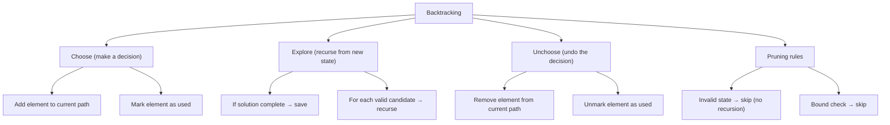

> [!success] Mastery Check
> - [ ] **Studied Well**
> - [ ] **Can explain the concept without notes**
> - [ ] **Can answer interview questions confidently**
> - [ ] **Can implement it in a real project**


## Navigation

**Domain:** [[5 — Data Structures & Algorithms]] > **Group:** Backtracking
**Previous:** [[5.049 — Comparison-Based Sorting — Merge Sort, Quick Sort, Heap Sort]] | **Next:** [[5.056 — Permutations and Combinations]]

### Prerequisites
- [[5.002 — Recursion and the Call Stack]] — backtracking is recursive by definition; the call stack frames represent the decision path.
- [[5.038 — DFS — Cycle Detection, Connected Components, Islands]] — backtracking is DFS on an implicit state-space graph; the visited-set concept translates to the used-set or index pointer.

### Where This Fits
Backtracking is the systematic way to explore all possible solutions to a problem by building candidates incrementally and abandoning (pruning) a candidate as soon as it is determined to be invalid. It is the algorithm behind permutations, combinations, subsets, N-Queens, Sudoku, constraint satisfaction, and path-finding in implicit graphs. The pattern is universally the same: **choose, explore, unchoose**. About 15% of LeetCode problems use backtracking. A senior candidate must be able to write the backtracking skeleton from memory — the three lines (add, recurse, remove) that form the core of every backtracking solution — and recognize when pruning is needed versus brute-force enumeration.

---

## Core Mental Model

Backtracking is a depth-first search of the solution space. At each step, you make a choice (adding an element, placing a queen), recursively explore all possibilities from that state, and then undo the choice (backtrack) to try the next option. The template is: (1) check if the current state is a valid complete solution — if so, add to results; (2) for each candidate option at this step, if it is valid, make the choice, recurse, then unmake the choice. The power of backtracking comes from **pruning** — skipping invalid candidates early, which transforms brute-force enumeration into an efficient search.

### Classification

Backtracking is a **state-space search** algorithm in the **DFS paradigm**. It is distinct from divide-and-conquer (which subdivides and combines) and dynamic programming (which caches subproblem results). Backtracking explores all possibilities but can be optimized with pruning.



### Key Properties

|Property|Value|Derivation|
|---|---|---|
|Subsets (n elements)|O(n × 2ⁿ)|2ⁿ subsets; O(n) to copy each|
|Permutations (n elements)|O(n × n!)|n! permutations; O(n) to copy each|
|Combinations (n choose k)|O(k × C(n,k))|C(n,k) combinations; O(k) to copy each|
|Space (recursion depth)|O(n)|Call stack depth = length of a complete candidate|
|Space (path storage)|O(n)|Current path being built|

---

## Deep Mechanics

### How It Works

**The universal backtracking skeleton:**
```
void Backtrack(path, options):
    if IsValidComplete(path):
        result.Add(copy of path)
        return
    
    for each option in options:
        if IsValidChoice(option, path):
            path.Add(option)         // choose
            Backtrack(path, options)  // explore
            path.RemoveLast()         // unchoose
```

**Three canonical examples:**

**Subsets** ([1, 2, 3]): At each index, decide whether to include the element. The decision tree has 2ⁿ leaves.

**Permutations** ([1, 2, 3]): Choose any remaining element at each position. The branching factor decreases: 3, 2, 1.

**Combinations** (n=5, k=3): Choose elements in increasing order. Pass a start index to avoid reordering — each option picks from remaining elements greater than the last pick.

**Pruning:**
- Subsets: no pruning needed — all paths are valid.
- Permutations: cannot reuse an element — track used set.
- Combinations: must maintain order — pass start index.
- N-Queens: cannot place queen in same column, row, or diagonal — O(1) checks.
- Sudoku: row, column, and 3×3 box constraints.

### Complexity Derivation

**Time — Subsets:** Each of n elements can be included or excluded — 2ⁿ total subsets. Building each subset costs O(n) to copy. Total: O(n × 2ⁿ).

**Time — Permutations:** n choices for position 0, (n-1) for position 1, ... 1 for position n-1. Total leaf nodes: n!. Each leaf costs O(n) to copy. Total: O(n × n!).

**Time — Combinations C(n, k):** The number of combinations is n! / (k! × (n-k)!). The recursion tree from the start-index approach visits exactly C(n, k) leaf nodes, each costing O(k) to copy. Total: O(k × C(n, k)).

**Space:** The call stack depth is O(n) (the length of a complete solution). The current path is also O(n). For result storage, O(number of solutions × n) — but this is required by the problem, not the algorithm.

### .NET Runtime Notes

- **`List<T>` for path building:** Use `List<T>` with `Add` and `RemoveAt(path.Count - 1)` for the path. The `Add`/`RemoveAt` pattern is O(1) amortized.
- **Passing by value vs. reference:** Always pass the path as a mutable list (reference type) and unchoose after recursion. Do NOT create a new list at each recursive call — that would be O(n) per call, making the algorithm O(n² × n!).
- **Copy on save:** When adding the current solution to results, copy the path: `result.Add(new List<T>(path))`. Without this, subsequent modifications corrupt the saved result.
- **`HashSet<T>` for used tracking:** For permutations, use a `HashSet<T>` or a `bool[]` array (when elements are distinct integers 0..n-1) to track which elements have been used.
- **Stack depth:** For n up to 30, recursion depth of 30 is fine. For n > 10,000, the computational cost (2ⁿ) kills feasibility long before stack depth becomes an issue.
- **`IEnumerable<T>` vs. `List<T>`:** For large result sets, using `yield return` with iterator blocks can defer computation — but the standard interview pattern is to fill a `List<List<T>>`.

---

## Implementation and Problem Patterns

### C# Implementation

```csharp
public static class Backtracking
{
    /// <summary>
    /// Subsets — all possible subsets of distinct integers.
    /// </summary>
    public static IList<IList<int>> Subsets(int[] nums)
    {
        var result = new List<IList<int>>();
        var path = new List<int>();
        SubsetsDfs(nums, 0, path, result);
        return result;
    }

    private static void SubsetsDfs(int[] nums, int start,
        List<int> path, IList<IList<int>> result)
    {
        result.Add(new List<int>(path)); // every path is a valid subset

        for (int i = start; i < nums.Length; i++)
        {
            path.Add(nums[i]);           // choose
            SubsetsDfs(nums, i + 1, path, result); // explore
            path.RemoveAt(path.Count - 1); // unchoose
        }
    }

    /// <summary>
    /// Permutations — all possible orderings of distinct integers.
    /// </summary>
    public static IList<IList<int>> Permute(int[] nums)
    {
        var result = new List<IList<int>>();
        var path = new List<int>();
        var used = new bool[nums.Length];
        PermuteDfs(nums, used, path, result);
        return result;
    }

    private static void PermuteDfs(int[] nums, bool[] used,
        List<int> path, IList<IList<int>> result)
    {
        if (path.Count == nums.Length)
        {
            result.Add(new List<int>(path));
            return;
        }

        for (int i = 0; i < nums.Length; i++)
        {
            if (used[i]) continue;

            used[i] = true;
            path.Add(nums[i]);
            PermuteDfs(nums, used, path, result);
            path.RemoveAt(path.Count - 1);
            used[i] = false;
        }
    }

    /// <summary>
    /// Permutations with duplicates — avoid duplicate permutations.
    /// </summary>
    public static IList<IList<int>> PermuteUnique(int[] nums)
    {
        Array.Sort(nums); // sort to detect duplicates
        var result = new List<IList<int>>();
        var path = new List<int>();
        var used = new bool[nums.Length];
        PermuteUniqueDfs(nums, used, path, result);
        return result;
    }

    private static void PermuteUniqueDfs(int[] nums, bool[] used,
        List<int> path, IList<IList<int>> result)
    {
        if (path.Count == nums.Length)
        {
            result.Add(new List<int>(path));
            return;
        }

        for (int i = 0; i < nums.Length; i++)
        {
            if (used[i]) continue;
            // Skip duplicates: if same value as previous and previous not used in this branch
            if (i > 0 && nums[i] == nums[i - 1] && !used[i - 1]) continue;

            used[i] = true;
            path.Add(nums[i]);
            PermuteUniqueDfs(nums, used, path, result);
            path.RemoveAt(path.Count - 1);
            used[i] = false;
        }
    }

    /// <summary>
    /// Combinations — all combinations of k elements from n (1..n).
    /// </summary>
    public static IList<IList<int>> Combine(int n, int k)
    {
        var result = new List<IList<int>>();
        var path = new List<int>();
        CombineDfs(1, n, k, path, result);
        return result;
    }

    private static void CombineDfs(int start, int n, int k,
        List<int> path, IList<IList<int>> result)
    {
        if (path.Count == k)
        {
            result.Add(new List<int>(path));
            return;
        }

        // Pruning: if remaining elements are insufficient, skip
        int remainingNeeded = k - path.Count;
        for (int i = start; i <= n - remainingNeeded + 1; i++)
        {
            path.Add(i);
            CombineDfs(i + 1, n, k, path, result);
            path.RemoveAt(path.Count - 1);
        }
    }

    /// <summary>
    /// Combination Sum — find all unique combinations where candidates sum to target.
    /// Each candidate can be used unlimited times.
    /// </summary>
    public static IList<IList<int>> CombinationSum(int[] candidates, int target)
    {
        Array.Sort(candidates); // enables pruning
        var result = new List<IList<int>>();
        var path = new List<int>();
        CombinationSumDfs(candidates, 0, target, path, result);
        return result;
    }

    private static void CombinationSumDfs(int[] candidates, int start, int remaining,
        List<int> path, IList<IList<int>> result)
    {
        if (remaining == 0)
        {
            result.Add(new List<int>(path));
            return;
        }

        for (int i = start; i < candidates.Length; i++)
        {
            if (candidates[i] > remaining) break; // pruning (sorted)

            path.Add(candidates[i]);
            CombinationSumDfs(candidates, i, remaining - candidates[i], path, result);
            path.RemoveAt(path.Count - 1);
        }
    }
}
```

### The .NET Idiomatic Version

```csharp
public static class BacktrackingIdiomatic
{
    // There is no built-in backtracking in .NET.
    // The idiomatic approach is the manual List<T> + recursion pattern shown above.
    // For very large state spaces, use IEnumerable + yield return:

    public static IEnumerable<IList<int>> SubsetsYield(int[] nums)
    {
        return SubsetsYieldInner(nums, 0);
    }

    private static IEnumerable<IList<int>> SubsetsYieldInner(int[] nums, int start)
    {
        yield return new List<int>(); // empty subset

        for (int i = start; i < nums.Length; i++)
        {
            foreach (var subset in SubsetsYieldInner(nums, i + 1))
            {
                var withCurrent = new List<int> { nums[i] };
                withCurrent.AddRange(subset);
                yield return withCurrent;
            }
        }
    }

    // However, the yield-return approach creates many small List allocations.
    // The recursive List<T> + copy-on-save approach is preferred in interviews
    // for clarity and performance.
}
```

### Classic Problem Patterns

1. **Subsets (power set)** — Generate all possible subsets of a set of distinct integers. Key insight: at each element, decide include/exclude. Use start index to avoid revisiting.
2. **Permutations** — Generate all possible orderings of a set of integers. Key insight: track used elements via a boolean array. Branching factor decreases each level.
3. **Combinations C(n, k)** — Generate all subsets of size k from 1..n. Key insight: pass start index to enforce order. Prune when remaining elements are insufficient to reach k.
4. **Combination sum** — Find all unique combinations that sum to a target. Key insight: sort to enable early pruning. Allow reuse of the same element (pass i, not i+1).
5. **Subsets with duplicates** — Generate all subsets when the input contains duplicates. Key insight: sort and skip duplicates at the same recursion level: `if (i > start && nums[i] == nums[i-1]) continue`.
6. **Palindrome partitioning** — Partition a string such that every substring is a palindrome. Key insight: backtrack over split positions; check palindrome at each candidate.

### Template / Skeleton

```csharp
// Backtracking Template (Choose, Explore, Unchoose)
// When to use: need to enumerate all combinations, permutations, subsets,
//              or solve constraint satisfaction problems
// Time: O(branching_factor^depth × copy_cost) | Space: O(depth)

public static IList<IList<T>> BacktrackTemplate<T>(/* problem inputs */)
{
    var result = new List<IList<T>>();
    var path = new List<T>();
    // TODO: initialize state (used array, start index, sum, etc.)

    void Dfs(/* state parameters */)
    {
        // TODO: check if path is a valid complete solution
        if (/* is complete */)
        {
            result.Add(new List<T>(path)); // copy!
            return;
        }

        // TODO: iterate over candidates
        for (int i = /* start */; i < /* max */; i++)
        {
            // TODO: prune — skip invalid candidates
            if (/* invalid */) continue;

            // Choose
            path.Add(/* candidate */);
            // TODO: update state (used[i] = true, etc.)

            // Explore — recurse
            Dfs(/* new state */);

            // Unchoose
            path.RemoveAt(path.Count - 1);
            // TODO: restore state (used[i] = false, etc.)
        }
    }

    Dfs(/* initial state */);
    return result;
}
```

---

## Gotchas and Edge Cases

### Not Copying the Path When Saving

**Mistake:** Adding the path reference directly to the result list.

```csharp
// ❌ Wrong — all results reference the same mutable List
result.Add(path); // path is modified after this line!
```

**Fix:** Copy the path before adding.

```csharp
// ✅ Correct — snapshot of the current state
result.Add(new List<T>(path));
```

**Consequence:** All entries in the result list are the same (the final state of path after all backtracking) or corrupted intermediate states.

### Not Skipping Duplicates After Sorting (Duplicate Input)

**Mistake:** Generating duplicate subsets or permutations when the input contains duplicate values.

```csharp
// ❌ Wrong — nums = [1, 2, 2] generates duplicate subsets
for (int i = start; i < nums.Length; i++)
{
    path.Add(nums[i]);
    SubsetsDfs(nums, i + 1, path, result);
    path.RemoveAt(path.Count - 1);
}
```

**Fix:** Sort the input and skip duplicates at the same recursion level.

```csharp
// ✅ Correct — skip duplicates at the same level
for (int i = start; i < nums.Length; i++)
{
    if (i > start && nums[i] == nums[i - 1]) continue; // skip duplicates
    path.Add(nums[i]);
    SubsetsDfs(nums, i + 1, path, result);
    path.RemoveAt(path.Count - 1);
}
```

**Consequence:** Exponential blow-up — the algorithm explores and stores redundant solutions. For [1, 2, 2], subsets would include [1,2], [1,2] and [1,2,2], [1,2,2] — duplicates doubling the work.

### Infinite Recursion (No Base Case or State Progress)

**Mistake:** Forgetting to advance the state, causing infinite recursion.

```csharp
// ❌ Wrong — never advances; infinite recursion
void Dfs(int[] nums, int start, List<int> path)
{
    result.Add(new List<int>(path));
    for (int i = 0; i < nums.Length; i++) // always starts from 0
    {
        path.Add(nums[i]);
        Dfs(nums, start, path); // using 'start' instead of 'i + 1'
        path.RemoveAt(path.Count - 1);
    }
}
```

**Fix:** Ensure each recursive call advances the state (start = i + 1, or i changes, or remaining decreases).

```csharp
// ✅ Correct — state advances
for (int i = start; i < nums.Length; i++)
{
    path.Add(nums[i]);
    Dfs(nums, i + 1, path); // advances start to i + 1
    path.RemoveAt(path.Count - 1);
}
```

**Consequence:** StackOverflowException from unbounded recursion.

### Pruning Condition After Recursion (Instead of Before)

**Mistake:** Checking validity inside the recursive call instead of before it — wastes function calls.

```csharp
// ❌ Wrong — prunes after recursing (wasteful)
for (int i = start; i < nums.Length; i++)
{
    path.Add(nums[i]);
    Dfs(nums, i + 1, path, result); // recurses even for invalid paths
    path.RemoveAt(path.Count - 1);
}
```

**Fix:** Check validity before recursing.

```csharp
// ✅ Correct — prune before recursing
for (int i = start; i < nums.Length; i++)
{
    if (/* invalid */) continue; // prune before recursion
    path.Add(nums[i]);
    Dfs(nums, i + 1, path, result);
    path.RemoveAt(path.Count - 1);
}
```

**Consequence:** Unnecessary recursive calls for invalid candidates — exponential increase in run time.

---

## Complexity Analysis and Benchmarks

### Operation Complexity Table

|Operation|Time|Space (stack)|Notes|
|---|---|---|---|
|Subsets (distinct)|O(n × 2ⁿ)|O(n)|2ⁿ leaves; O(n) per leaf for copy|
|Permutations (distinct)|O(n × n!)|O(n)|n! leaves; O(n) per leaf|
|Combinations C(n,k)|O(k × C(n,k))|O(k)|C(n,k) = n!/(k!(n-k)!)|
|Subsets with duplicates|O(n × 2ⁿ)|O(n)|Same bound but fewer actual leaves|
|Combination sum|Exponential (depends on target)|O(target/min(candidate))|Branching factor = candidates; depth = target/min|

**Derivation for the non-obvious entries:** The branching factor for permutations starts at n and decreases by 1 each level: total calls = n!/(n-1)! + n!/(n-2)! + ... + n! which is less than e × n!. Each leaf costs O(n) to copy. Total: O(n × n!). The copy dominates — without it, the time is O(n!); with it, O(n × n!).

### Comparison with Alternatives

|Approach|Time|Space|Best When|
|---|---|---|---|
|Backtracking|Exponential|O(n)|Need all solutions — enumeration is required|
|DP with memoization|Polynomial (for some)|Polynomial|Problem has overlapping subproblems (counting paths, not listing them)|
|Iterative (bitmask)|O(n × 2ⁿ)|O(n)|Subsets only — compact, no recursion overhead|
|Next permutation|O(n! × n)|O(1)|Permutations one at a time, lexicographic order, O(1) space|

### BenchmarkDotNet

```csharp
[MemoryDiagnoser]
[SimpleJob(RuntimeMoniker.Net90)]
public class BacktrackingBenchmark
{
    [Params(8, 10)]
    public int N { get; set; }

    private int[] _nums = null!;

    [GlobalSetup]
    public void Setup()
    {
        _nums = Enumerable.Range(1, N).ToArray();
    }

    [Benchmark(Baseline = true)]
    public IList<IList<int>> Subsets() => Backtracking.Subsets(_nums);

    [Benchmark]
    public IList<IList<int>> Permutations() => Backtracking.Permute(_nums);

    [Benchmark]
    public IList<IList<int>> CombinationsKHalf()
    {
        return Backtracking.Combine(N, N / 2);
    }
}
```

**Expected results (approximate, .NET 9, x64):**

|Method|N|Mean|Allocated|
|---|---|---|---|
|Subsets|8|~2 μs|~3 KB|
|Subsets|10|~8 μs|~12 KB|
|Permutations|8|~80 μs|~150 KB|
|Permutations|10|~4,000 μs|~8 MB|
|CombinationsKHalf|8 (k=4)|~5 μs|~8 KB|
|CombinationsKHalf|10 (k=5)|~25 μs|~40 KB|

**Interpretation:** Permutations explode the fastest (n! grows faster than 2ⁿ). For n=10, there are 3.6M permutations vs. 1,024 subsets. The memory allocation tracks the number of results. For any n > 12, permutations become infeasible for an interview context.

---

## Interview Arsenal

### Question Bank

1. [Definition] What is the general backtracking pattern and what three steps does it repeat?
2. [Complexity] Derive the time complexity of generating all subsets of n elements.
3. [Implementation] Implement a function that generates all permutations of distinct integers.
4. [Recognition] Given a problem asking for "all possible letter combinations of a phone number," what algorithm?
5. [Comparison] Compare backtracking vs. dynamic programming — when would you use one vs. the other?
6. [Trick] How do you handle duplicate elements in the input for subsets and permutations?
7. [System Design] How would you generate all valid IP addresses from a digit string?
8. [Optimization] How would you prune the search space for N-Queens?

### Spoken Answers

**Q: Derive the time complexity of generating all subsets of n elements.**

> **Average answer:** There are 2ⁿ subsets, and each takes O(n) to copy, so O(n × 2ⁿ).

> **Great answer:** Let me derive from the recursion tree. At each of the n levels, we make a binary decision: include or exclude the current element. The tree has 2ⁿ leaf nodes, each representing a complete subset. But we also have internal nodes — every prefix of a subset. The total number of nodes in the tree is 2^(n+1) - 1, which is O(2ⁿ). For each leaf, we make a copy of the path (O(n)) to add to the result. That gives O(n × 2ⁿ) for the copies. The recursion itself (building the path) is O(2ⁿ) because each node does O(1) work (add, recurse, remove). So the dominant term is the copy cost: O(n × 2ⁿ). In practice, the recursion overhead matters more than the copy cost for small n because of function call overhead. The space is O(n) for the call stack and path, plus O(n × 2ⁿ) for the result storage (which is required by the problem).

**Q: Implement a function that generates all permutations of distinct integers.**

> **Average answer:** Uses recursion, swaps elements, or uses a used-set.

> **Great answer:** I will use the used-set approach. I maintain a `bool[] used` array and a `List<int> path`. In the recursive function, if `path.Count == nums.Length`, I add a copy of the path to the result. Otherwise, I iterate over all indices: if `used[i]` is false, I mark it true, add `nums[i]` to the path, recurse, then unmark and remove. The time complexity is O(n × n!) as derived. An alternative approach uses swapping: at each position `start`, swap each element from start to n-1 into position `start`, then recurse on `start + 1`. The swap approach avoids the used array and works in-place on the array, but the used-set approach is more intuitive and generalizes more easily to problems with additional constraints. I prefer the used-set for interviews because it clearly separates the decision state from the input.

**Q: [Trick] How do you handle duplicate elements in the input for subsets and permutations?**

> **Average answer:** Sort the input first, then skip duplicates.

> **Great answer:** The key insight is that duplicates should only be skipped at the **same recursion level**. For subsets and combinations, I sort the input first, then in the for loop, if `i > start && nums[i] == nums[i - 1]`, I continue — this skips using the same value at the same position in the decision tree but allows duplicates in different positions. For permutations, the condition is slightly different: I still sort, but I skip if `used[i]` is false AND the previous element has the same value AND was not used in this branch: `i > 0 && nums[i] == nums[i - 1] && !used[i - 1]`. This ensures that when we have duplicate values, only the first one starts the branch — subsequent duplicates in the current recursion level are skipped. This is a common interview pitfall — candidates skip duplicates globally instead of at the same level, which eliminates valid solutions.

### Trick Question

**"Can backtracking be implemented iteratively?"**

Why it is a trap: The candidate says "no" because the choose-explore-unchoose pattern is inherently recursive. But backtracking can be implemented iteratively using an explicit stack (mimicking the call stack) — it is just more complex and less readable.

Correct answer: Yes — any recursive backtracking can be converted to iterative form using an explicit stack that stores the state (path, used array, current index). The stack frame corresponds to a recursive call. However, the recursive version is almost always preferred for clarity. The iterative version is useful when the recursion depth could exceed the call stack limit (e.g., very deep recursion with n > 10,000 — but at that point the exponential time is the real problem). In practice, recursive backtracking is the standard; iterative backtracking is a curiosity.

### Pattern Recognition Table

|If the problem has...|Then consider...|Because...|
|---|---|---|
|"All possible combinations"|Backtracking with start index|Enumerate all subsets — binary include/exclude per element|
|"All permutations"|Backtracking with used array|Every arrangement — track which elements are placed|
|"All ways to reach a target sum"|Backtracking with sum tracking|Build candidates; prune when sum exceeds target|
|"Constraint satisfaction" (N-Queens, Sudoku)|Backtracking with constraint checks|Place one item, check constraints, recurse, remove|
|"Letter combinations of phone number"|Backtracking with digit-to-letter mapping|DFS through the implicit decision tree of letters|
|"Generate all valid parentheses"|Backtracking with open/close counts|Track remaining opens and closes; prune invalid states|

---

## Decision Framework

### When to Apply

```mermaid
flowchart TD
    A[Problem asks for all solutions] --> B{Number of solutions?}
    B -->|Exponential (2ⁿ, n!, etc.)| C[Backtracking is the standard approach]
    B -->|Polynomial| D[Consider DP or greedy]
    C --> E{Can we prune invalid paths?}
    E -->|Yes| F[Backtracking with pruning — efficient]
    E -->|No| G[Brute-force enumeration — still backtracking]
    G --> H{Overlapping subproblems?}
    H -->|Yes| I[Consider memoization → DP]
    H -->|No| J[Pure backtracking is correct]
```

### Recognition Checklist

Indicators that backtracking is the right choice:

- [ ] Problem asks for "all possible" solutions (all subsets, all permutations, all combinations)
- [ ] Problem involves constraint satisfaction with partial candidates
- [ ] Problem is a decision tree where each path represents a complete solution
- [ ] Brute-force enumeration is acceptable (input size is small: n ≤ 15-20 for permutations, n ≤ 30 for subsets)

Counter-indicators — do NOT apply here:

- [ ] Problem asks for the "number of ways" without listing them → DP may be sufficient (and polynomial)
- [ ] Problem asks for the optimal solution among all possibilities → consider DP or greedy
- [ ] Input size is large (n > 20 for permutations, n > 30 for subsets) → backtracking is infeasible
- [ ] Problem can be solved with a simple formula (e.g., C(n, k) without listing them)

### Tradeoff Summary

|What You Gain|What You Give Up|
|---|---|
|Enumerates all solutions — complete search|Exponential time — only feasible for small inputs|
|Simple, unified template (choose-explore-unchoose)|Can be slow without good pruning|
|Naturally handles constraints (pruning)|Deep recursion may cause stack overflow (mitigated by iterative stack)|
|Easily generalizes (subsets → permutations → combinations)|Cannot easily parallelize (shared mutable path)|

---

## Self-Check

### Conceptual Questions

1. What three steps define the backtracking pattern? Give the code template.
2. Derive the time complexity of generating all permutations of n distinct elements.
3. Recognizing from a problem: "Given a string containing digits from 2-9, return all possible letter combinations that the number could represent."
4. When would you use backtracking vs. dynamic programming for a problem that asks for "the number of ways"?
5. How do you handle duplicate elements in the input for subsets vs. permutations?
6. In .NET, why must you copy the path list when saving a solution?
7. What invariant does the start-index parameter maintain in subset/combination backtracking?
8. How does the answer change if the problem asks for "all combinations" vs. "the number of combinations"?
9. How would you generate all valid IP addresses from a digit string using backtracking?
10. What is the trap question about iterative backtracking?

<details>
<summary>Answers</summary>

1. Choose (add to path / mark used), Explore (recurse with updated state), Unchoose (remove from path / unmark used). Template: `path.Add(x); Dfs(...); path.RemoveAt(path.Count - 1);`.
2. The recursion tree has branching factor n at level 0, n-1 at level 1, ..., 1 at level n-1. Total leaf nodes: n!. Each leaf costs O(n) to copy to the result. Total: O(n × n!).
3. Map each digit to its letters (2→"abc", 3→"def", etc.). Use backtracking: at each position in the digit string, try each letter for that digit. Accumulate the string and recurse for the next digit.
4. DP if the problem has overlapping subproblems and asks only for the count (polynomial time). Backtracking if the problem asks to list all solutions (exponential but necessary). For counting subsets: DP with combinatorial formulas (2ⁿ). For counting permutations: DP with factorials. For listing: backtracking.
5. Subsets/combinations: sort input, skip when `i > start && nums[i] == nums[i - 1]`. Permutations: sort input, skip when `i > 0 && nums[i] == nums[i - 1] && !used[i - 1]`. The key difference is that for permutations, you skip only when the previous duplicate was NOT used in the current branch — this ensures you only start the first duplicate at each level.
6. The `path` list is a mutable reference. Without copying, all results would reference the same list object, which is modified as backtracking continues. By the end, every entry in the result would contain the same final (empty) path.
7. The start index ensures elements are only considered in increasing index order. This prevents permutations of the same subset (e.g., [1,2] and [2,1] would both appear if start were not used). It enforces that the current element is chosen at or after the previous choice.
8. "All combinations" → backtracking with O(k × C(n,k)) time and O(n) space for the recursion. "The number of combinations" → O(min(k, n-k)) time using the combinatorial formula C(n,k) = n!/(k!(n-k)!) without enumeration.
9. Split the digit string into 4 parts separated by dots. Each part must be 1-3 digits, between 0 and 255, and cannot have leading zeros (unless the part is "0"). Backtrack over split positions — at each step, try taking 1, 2, or 3 digits as the next part, validate, and recurse for the remaining string.
10. The trap is saying that backtracking is inherently recursive. Any recursive backtracking can be converted to iterative form using an explicit stack. The recursive form is preferred for clarity. For extremely deep recursion, the iterative form may be necessary.

</details>

---

### Coding Challenges

**Challenge 1 — Implement from scratch**

Given a string containing digits from 2-9, return all possible letter combinations that the number could represent. Map: 2→"abc", 3→"def", 4→"ghi", 5→"jkl", 6→"mno", 7→"pqrs", 8→"tuv", 9→"wxyz".

```csharp
public static IList<string> LetterCombinations(string digits)
{
    // Your implementation here
}
```

<details> <summary>Solution</summary>

```csharp
private static readonly string[] DigitMap =
    ["", "", "abc", "def", "ghi", "jkl", "mno", "pqrs", "tuv", "wxyz"];

public static IList<string> LetterCombinations(string digits)
{
    var result = new List<string>();
    if (string.IsNullOrEmpty(digits)) return result;

    var path = new char[digits.Length];
    Dfs(0, digits, path, result);
    return result;
}

private static void Dfs(int index, string digits, char[] path, List<string> result)
{
    if (index == digits.Length)
    {
        result.Add(new string(path));
        return;
    }

    string letters = DigitMap[digits[index] - '0'];
    foreach (char c in letters)
    {
        path[index] = c;
        Dfs(index + 1, digits, path, result);
    }
}
```

**Complexity:** Time O(4ⁿ × n) | Space O(n) for path + recursion **Key insight:** Use a char array instead of a StringBuilder for O(1) per-character mutation. The branching factor is up to 4 (for digit 7 or 9).

</details>

---

**Challenge 2 — Trace the execution**

Trace the backtracking for subsets of [1, 2, 3]. Show the recursion tree with the path state at each node.

<details> <summary>Solution</summary>

Dfs(nums, start=0, path=[]):
  Save: []
  i=0 → path=[1] → Dfs(nums, start=1, path=[1])
    Save: [1]
    i=1 → path=[1,2] → Dfs(nums, start=2, path=[1,2])
      Save: [1,2]
      i=2 → path=[1,2,3] → Dfs(nums, start=3, path=[1,2,3])
        Save: [1,2,3]
        Return (start=3 ≥ n)
      Unchoose: path=[1,2]
    i=2 → path=[1,3] → Dfs(nums, start=3, path=[1,3])
      Save: [1,3]
      Return
    Unchoose: path=[1]
  i=1 → path=[2] → Dfs(nums, start=2, path=[2])
    Save: [2]
    i=2 → path=[2,3] → Dfs(nums, start=3, path=[2,3])
      Save: [2,3]
      Return
    Unchoose: path=[2]
  i=2 → path=[3] → Dfs(nums, start=3, path=[3])
    Save: [3]
    Return

Result: [[], [1], [1,2], [1,2,3], [1,3], [2], [2,3], [3]]

**Why:** The start-index parameter ensures that each element is only considered after the previous choice. This prevents [2,1] from appearing (since 2 comes after 1 in the array, and start advances past 1 once 2 is chosen).

</details>

---

**Challenge 3 — Fix the bug**

```csharp
// This permutation implementation has a bug with duplicate inputs.
// What input causes it to fail?
public static IList<IList<int>> PermuteUnique(int[] nums)
{
    var result = new List<IList<int>>();
    var path = new List<int>();
    var used = new bool[nums.Length];
    Dfs(nums, used, path, result);
    return result;
}

private static void Dfs(int[] nums, bool[] used,
    List<int> path, IList<IList<int>> result)
{
    if (path.Count == nums.Length)
    {
        result.Add(new List<int>(path));
        return;
    }

    for (int i = 0; i < nums.Length; i++)
    {
        if (used[i]) continue;
        if (i > 0 && nums[i] == nums[i - 1]) continue; // BUG: always skips duplicates

        used[i] = true;
        path.Add(nums[i]);
        Dfs(nums, used, path, result);
        path.RemoveAt(path.Count - 1);
        used[i] = false;
    }
}
```

<details> <summary>Solution</summary>

**Bug:** The duplicate check `i > 0 && nums[i] == nums[i - 1]` skips duplicate values even when the previous duplicate was used in a different branch. This incorrectly eliminates valid permutations that differ only in the order of duplicate values. For example, with nums = [1, 1, 2], the valid permutation [1(first), 2, 1(second)] would be skipped because when i=2 (second 1), used[1] (first 1) might be false, and the condition `nums[2] == nums[1]` triggers the skip.

**Fix:** Only skip if the previous duplicate has NOT been used in the current branch:

```csharp
// ✅ Correct — only skip if previous duplicate was not used (starts a new branch)
if (i > 0 && nums[i] == nums[i - 1] && !used[i - 1]) continue;
```

**Test case that exposes it:** `PermuteUnique([1, 1, 2])`. The buggy version generates only [1, 1, 2] (or similar) instead of all 3 unique permutations: [1,1,2], [1,2,1], [2,1,1].

</details>

---

**Challenge 4 — Recognize and apply**

**Problem:** Given n pairs of parentheses, write a function to generate all combinations of well-formed parentheses. For n = 3, the answer is ["((()))", "(()())", "(())()", "()(())", "()()()"].

<details> <summary>Solution</summary>

**Pattern:** Backtracking with two counters: `open` (number of opening parens used) and `close` (number of closing parens used). You can add '(' if open < n; you can add ')' if close < open.

```csharp
public static IList<string> GenerateParenthesis(int n)
{
    var result = new List<string>();
    var path = new char[2 * n];
    Dfs(0, 0, 0, n, path, result);
    return result;
}

private static void Dfs(int pos, int open, int close, int n,
    char[] path, List<string> result)
{
    if (pos == 2 * n)
    {
        result.Add(new string(path));
        return;
    }

    if (open < n)
    {
        path[pos] = '(';
        Dfs(pos + 1, open + 1, close, n, path, result);
    }

    if (close < open)
    {
        path[pos] = ')';
        Dfs(pos + 1, open, close + 1, n, path, result);
    }
}
```

**Complexity:** Time O(4ⁿ / √n) — the n-th Catalan number | Space O(n) for recursion + path **Key insight:** The constraint `close < open` is the pruning rule that ensures well-formed parentheses — you cannot close more than you have opened.

</details>

---

**Challenge 5 — Optimize**

```csharp
// This subset implementation is correct but creates a new list at each recursive
// call instead of mutating and unchoosing. Optimize it to use the standard
// add-recurse-remove pattern.
public static IList<IList<int>> Subsets(int[] nums)
{
    var result = new List<IList<int>>();
    Dfs(nums, 0, new List<int>(), result);
    return result;
}

private static void Dfs(int[] nums, int start, List<int> path,
    IList<IList<int>> result)
{
    result.Add(path);

    for (int i = start; i < nums.Length; i++)
    {
        var newPath = new List<int>(path) { nums[i] }; // creates new list each time!
        Dfs(nums, i + 1, newPath, result);
    }
}
```

<details> <summary>Solution</summary>

**Insight:** The original creates a new `List<int>` at every recursive call — O(n) allocation per call. Use a single mutable path with Add/RemoveAt instead.

```csharp
public static IList<IList<int>> Subsets(int[] nums)
{
    var result = new List<IList<int>>();
    var path = new List<int>();
    Dfs(nums, 0, path, result);
    return result;
}

private static void Dfs(int[] nums, int start,
    List<int> path, IList<IList<int>> result)
{
    result.Add(new List<int>(path)); // copy only when saving

    for (int i = start; i < nums.Length; i++)
    {
        path.Add(nums[i]);            // choose — O(1)
        Dfs(nums, i + 1, path, result); // explore
        path.RemoveAt(path.Count - 1);  // unchoose — O(1)
    }
}
```

**Complexity:** Same asymptotic O(n × 2ⁿ), but the constant factor is dramatically smaller — one allocation per result instead of one per recursive call.

</details>
