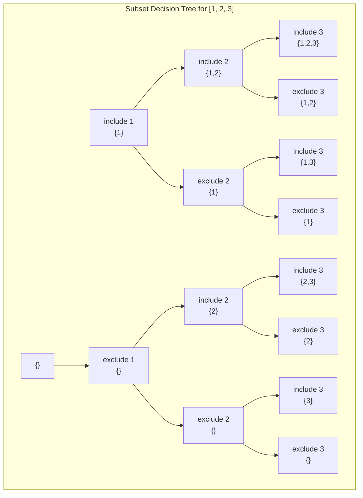
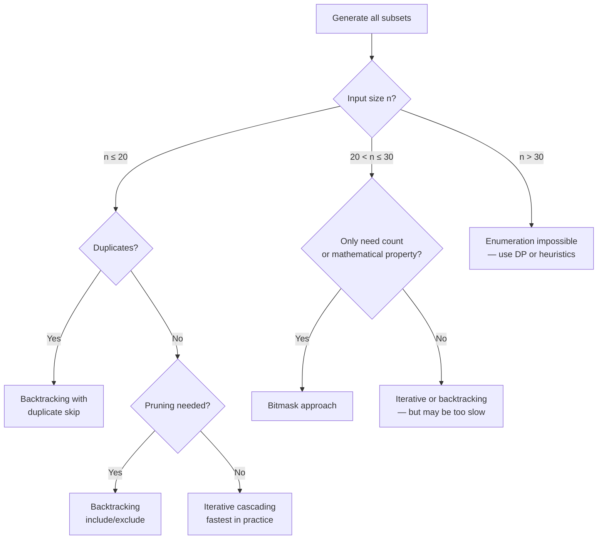

> [!success] Mastery Check
> - [ ] **Studied Well**
> - [ ] **Can explain the concept without notes**
> - [ ] **Can answer interview questions confidently**
> - [ ] **Can implement it in a real project**


## Navigation

**Domain:** [[5 — Data Structures & Algorithms]] > **Group:** Backtracking
**Previous:** [[5.056 — Permutations and Combinations]] | **Next:** [[5.059 — DP Fundamentals — Recognizing Problems, Memoization vs Tabulation]]

### Prerequisites
- [[5.055 — Backtracking Template — Choose, Explore, Unchoose]] — the subset generation pattern is the simplest application of the backtracking skeleton: at each element, include it or exclude it.

### Where This Fits
The power set (set of all subsets) contains 2ⁿ subsets for an n-element set. Generating all subsets is the simplest backtracking problem — the include/exclude binary decision at each element — and it serves as the foundation for subset-sum, combination sum, and partition problems. The pattern appears in ~8% of interviews, most frequently as a building block for more complex problems (subsets with constraints, subset-sum DP). A senior candidate must generate subsets both iteratively (bit manipulation) and recursively (backtracking), and must understand when each approach is appropriate.

---

## Core Mental Model

Every subset of {a₀, a₁, ..., aₙ₋₁} corresponds to a binary string of length n where bit i = 1 means "include aᵢ" and bit i = 0 means "exclude aᵢ." There are 2ⁿ such binary strings, and they map bijectively to the integers 0 through 2ⁿ-1. The backtracking approach mimics this: at each level, make two recursive calls — one with the element included, one without.

### Classification

Subset generation is a **backtracking** problem in the **combinatorial enumeration** paradigm. It is the simplest case of the include/exclude pattern, where the decision tree is a perfect binary tree of depth n.



### Key Properties

|Property|Value|Derivation|
|---|---|---|
|Total subsets|2ⁿ|Each of n elements: include or exclude — independent binary decisions|
|Backtracking time|O(n × 2ⁿ)|Each of 2ⁿ leaves costs O(n) to copy the current path|
|Iterative (bitmask) time|O(n × 2ⁿ)|Same — iterate 2ⁿ masks, each requiring O(n) to build the subset|
|Space (recursion depth)|O(n)|The call stack is at most n frames|
|Space (output)|O(n × 2ⁿ)|All subsets stored: 2ⁿ subsets, average length n/2|

---

## Deep Mechanics

### How It Works

**Backtracking approach (include/exclude):** At each index i in the input array, make two recursive calls: one adds nums[i] to the path and recurses on i+1; the other recurses on i+1 without adding. The base case is when i == nums.Length, at which point the current path is added to the result.

Trace on `[1, 2, 3]`:
```
i=0: start with []
  include 1 → path=[1], i=1
    include 2 → path=[1,2], i=2
      include 3 → path=[1,2,3], i=3 → output [1,2,3]
      exclude 3 → path=[1,2], i=3 → output [1,2]
    exclude 2 → path=[1], i=2
      include 3 → path=[1,3], i=3 → output [1,3]
      exclude 3 → path=[1], i=3 → output [1]
  exclude 1 → path=[], i=1
    include 2 → path=[2], i=2
      include 3 → path=[2,3], i=3 → output [2,3]
      exclude 3 → path=[2], i=3 → output [2]
    exclude 2 → path=[], i=2
      include 3 → path=[3], i=3 → output [3]
      exclude 3 → path=[], i=3 → output []
```

**Iterative approach (cascading):** Start with `[[]]`. For each element, create new subsets by adding the element to each existing subset.

Trace on `[1, 2, 3]`:
```
Start: [[]]
Process 1: add 1 to each → [[], [1]]
Process 2: add 2 to each → [[], [1], [2], [1,2]]
Process 3: add 3 to each → [[], [1], [2], [1,2], [3], [1,3], [2,3], [1,2,3]]
```

**Bitmask approach:** For mask from 0 to 2ⁿ-1, for bit i from 0 to n-1, if (mask & (1 << i)) != 0, include nums[i].

Trace for mask = 5 (binary 101) on `[1, 2, 3]`:
```
mask = 5 = 101₂
bit 0 (1): 101 & 001 = 1 → include 1
bit 1 (2): 101 & 010 = 0 → exclude 2
bit 2 (4): 101 & 100 = 1 → include 3
Subset: [1, 3]
```

### Complexity Derivation

**Time for backtracking:** There are exactly 2ⁿ leaves in the recursion tree (one per subset). Each leaf takes O(n) to copy the current path to the result list. Each internal node does O(1) work (add to path, recursive call, remove from path). The total number of nodes in a perfect binary tree of depth n is 2ⁿ⁺¹ - 1. Internal nodes: 2ⁿ - 1. So total work: O(2ⁿ) for internal nodes + O(n × 2ⁿ) for leaf copies = O(n × 2ⁿ).

**Time for bitmask:** Exactly 2ⁿ masks, each requiring O(n) to iterate bits. Total: O(n × 2ⁿ).

**Time for iterative (cascading):** At iteration i, the result list has 2ⁱ subsets. For each, a new subset of size i+1 is created. Total copies: sum_{i=0}^{n-1} 2ⁱ × (i+1) = O(n × 2ⁿ). Same complexity, but generally faster due to better memory locality.

**Space:** The recursion depth is n (each recursive call advances the index). The path list grows to at most n elements. Output storage: 2ⁿ subsets, each with average size n/2. Total output space: O(n × 2ⁿ).

### Why This Pattern Exists

The brute-force enumeration of all subsets is the direct translation of the definition: "all possible selections from a set." The 2ⁿ growth is unavoidable — any algorithm that generates all subsets must spend Ω(2ⁿ) time just to output them. The three approaches (backtracking, iterative cascading, bitmask) differ only in constant factors and in how naturally they support pruning for constrained subsets. The backtracking approach generalizes to subset-sum, partition, and combination problems where pruning conditions are added; the bitmask approach is useful when subsets are manipulated mathematically (XOR of subsets, sum over subsets).

---

## Implementation and Problem Patterns

### C# Implementation

```csharp
/// <summary>
/// Generate all subsets (power set) of distinct integers.
/// Backtracking approach — include/exclude at each element.
/// </summary>
public IList<IList<int>> Subsets(int[] nums)
{
    var result = new List<IList<int>>();
    var path = new List<int>();
    Backtrack(nums, 0, path, result);
    return result;
}

private void Backtrack(int[] nums, int index, List<int> path, List<IList<int>> result)
{
    if (index == nums.Length)
    {
        result.Add([.. path]);
        return;
    }

    // Exclude nums[index]
    Backtrack(nums, index + 1, path, result);

    // Include nums[index]
    path.Add(nums[index]);
    Backtrack(nums, index + 1, path, result);
    path.RemoveAt(path.Count - 1);
}

/// <summary>
/// Generate subsets iteratively (cascading approach).
/// </summary>
public IList<IList<int>> SubsetsIterative(int[] nums)
{
    var result = new List<IList<int>> { [] };

    foreach (int num in nums)
    {
        int count = result.Count;
        for (int i = 0; i < count; i++)
        {
            var subset = new List<int>(result[i]) { num };
            result.Add(subset);
        }
    }

    return result;
}

/// <summary>
/// Generate subsets using bitmask.
/// </summary>
public IList<IList<int>> SubsetsBitmask(int[] nums)
{
    int n = nums.Length;
    int total = 1 << n;  // 2ⁿ
    var result = new List<IList<int>>(total);

    for (int mask = 0; mask < total; mask++)
    {
        var subset = new List<int>();
        for (int i = 0; i < n; i++)
        {
            if ((mask & (1 << i)) != 0)
                subset.Add(nums[i]);
        }
        result.Add(subset);
    }

    return result;
}

/// <summary>
/// Subsets with duplicates — generate unique subsets.
/// </summary>
public IList<IList<int>> SubsetsWithDup(int[] nums)
{
    Array.Sort(nums);
    var result = new List<IList<int>>();
    var path = new List<int>();
    BacktrackWithDup(nums, 0, path, result);
    return result;
}

private void BacktrackWithDup(int[] nums, int index, List<int> path, List<IList<int>> result)
{
    if (index == nums.Length)
    {
        result.Add([.. path]);
        return;
    }

    // Include nums[index]
    path.Add(nums[index]);
    BacktrackWithDup(nums, index + 1, path, result);
    path.RemoveAt(path.Count - 1);

    // Skip all duplicates before making the exclude call
    while (index + 1 < nums.Length && nums[index + 1] == nums[index])
        index++;

    // Exclude nums[index] and all its duplicates
    BacktrackWithDup(nums, index + 1, path, result);
}
```

### The .NET Idiomatic Version

There is no built-in subset generator in .NET. For production code that needs combinatorial generation, prefer the iterative cascading method (efficient, no recursion limit, good cache locality) or use bit manipulation for mathematical operations.

```csharp
// LINQ-based subset generation for small n (n ≤ 20)
// Not recommended for n > 20 due to 2ⁿ growth
var subsets = Enumerable
    .Range(0, 1 << nums.Length)
    .Select(mask => nums.Where((_, i) => (mask & (1 << i)) != 0).ToList())
    .ToList();
```

### Classic Problem Patterns

- **Power Set (all subsets)** — Generate all subsets of distinct integers. Use any of the three approaches. The starting template for all subset problems.
- **Subsets with duplicates** — Input contains duplicates; output must not contain duplicate subsets. Sort the input, then skip duplicates after the exclude branch (while loop past same values).
- **Subset Sum** — Determine if any subset sums to a target value. This is NP-complete but solvable via DP for small constraints. The backtracking with pruning (stop when sum exceeds target) works for n ≤ 20.
- **Partition Equal Subset Sum** — Can the array be split into two subsets with equal sum? Subset sum DP with target = total/2. Backtracking without pruning would be O(2ⁿ).
- **Letter Tile Possibilities** — Count distinct sequences (permutations of subsets) from a set of letter tiles. Generate all subsets, then count permutations of each.
- **XOR Subsets** — Find XOR of every subset. Bit manipulation on the bitmask — the linear algebra property (each bit is independent) reduces this to checking if any element has that bit set.

### Template / Skeleton

```csharp
// Subsets (Power Set) Template
// When to use: generate all possible selections from a set
// Time: O(n × 2ⁿ) | Space: O(n)

public IList<IList<int>> SubsetsTemplate(int[] nums)
{
    var result = new List<IList<int>>();
    var path = new List<int>();
    Backtrack(nums, 0, path, result);
    return result;
}

private void Backtrack(int[] nums, int index, List<int> path, List<IList<int>> result)
{
    if (/* TODO: index == nums.Length — all elements processed */)
    {
        result.Add([.. path]);
        return;
    }

    // Option 1: Exclude the current element
    Backtrack(nums, index + 1, path, result);

    // Option 2: Include the current element
    path.Add(nums[index]);
    Backtrack(nums, index + 1, path, result);
    path.RemoveAt(path.Count - 1);

    // For duplicates, skip them before the exclude call:
    // while (index + 1 < nums.Length && nums[index + 1] == nums[index]) index++;
    // Backtrack(nums, index + 1, path, result);
}
```

---

## Gotchas and Edge Cases

### Duplicate Subsets — Wrong Skip Condition

**Mistake:** Using the permutation skip condition (`used[i-1]`) for subsets.

```csharp
// ❌ Wrong — subsets don't have a used[] array
if (i > 0 && nums[i] == nums[i - 1] && !used[i - 1]) continue;
```

**Fix:** Subsets with duplicates use a different skip strategy: sort the input, then skip duplicates after the "include" branch by advancing past all identical values before the "exclude" branch.

```csharp
// ✅ Correct — skip duplicates via while loop
path.Add(nums[index]);
BacktrackWithDup(nums, index + 1, path, result);
path.RemoveAt(path.Count - 1);

while (index + 1 < nums.Length && nums[index + 1] == nums[index])
    index++;
BacktrackWithDup(nums, index + 1, path, result);
```

**Consequence:** Without this skip, subsets with duplicates produce duplicate entries like [1, 2] appearing twice when there are two identical 2s in the input.

### Bitmask for n > 31

**Mistake:** Using `1 << n` when n > 31 — integer overflow.

```csharp
// ❌ Wrong — 1 << 32 overflows in C# (int is 32-bit)
int total = 1 << n;  // n = 32 → 1 << 32 = 1 (wraps around)
```

**Fix:** Use `long` (64-bit) or check n ≤ 30 before using the bitmask approach.

```csharp
// ✅ Correct
int total = 1 << n;  // n ≤ 30 is safe for int
// For n ≤ 62: long total = 1L << n;
```

**Consequence:** For n = 32, `1 << 32` in C# evaluates to 1 (the shift count is masked to 5 bits), so only the first element is iterated — massive under-generation.

### Modifying Path After Adding to Result

**Mistake:** Adding the path reference and then continuing to modify it.

```csharp
// ❌ Wrong — result stores a reference to path, which continues to be modified
result.Add(path);  // All entries will be the same final state of path
```

**Fix:** Add a copy.

```csharp
// ✅ Correct
result.Add([.. path]);
```

**Consequence:** All subsets in the result become identical — the final state of path (usually the last leaf, `[]` for the include/exclude pattern).

### Generating Only Non-Empty Subsets

**Mistake:** Including the empty set when the problem explicitly asks for non-empty subsets.

**Fix:** Add a length check: `if (index == nums.Length && path.Count > 0)` or filter the result after generation.

**Consequence:** The empty set `[]` is a valid subset of every set. If the problem specifies "non-empty subsets," it must be filtered out.

---

## Complexity Analysis and Benchmarks

### Operation Complexity Table

|Approach|Time|Space (output)|Space (auxiliary)|Notes|
|---|---|---|---|---|
|Backtracking (include/exclude)|O(n × 2ⁿ)|O(n × 2ⁿ)|O(n)|Recursion depth = n; path copy at each leaf|
|Iterative (cascading)|O(n × 2ⁿ)|O(n × 2ⁿ)|O(n)|Intermediate lists accumulate; no recursion|
|Bitmask|O(n × 2ⁿ)|O(n × 2ⁿ)|O(1)|Only loop variables; no recursion or intermediate state|

**Derivation for the non-obvious entries:** All three approaches are O(n × 2ⁿ) because there are 2ⁿ subsets and each takes O(n) to build. The constant factors differ: bitmask has minimal overhead (no list allocations until the final copy), while backtracking has recursion overhead and the iterative approach doubles the result list at each step.

### Comparison with Alternatives

|Approach|Time|Space|Best When|
|---|---|---|---|
|Backtracking (include/exclude)|O(n × 2ⁿ)|O(n)|Need to prune (subset-sum with early exit)|
|Iterative (cascading)|O(n × 2ⁿ)|O(n × 2ⁿ)|n ≤ 20; simple, no recursion depth limit|
|Bitmask|O(n × 2ⁿ)|O(1)|n ≤ 30; need mathematical properties (XOR, bit ops)|
|Gray code|O(2ⁿ)|O(n)|Need consecutive subsets to differ by one element|

### BenchmarkDotNet

```csharp
[MemoryDiagnoser]
[SimpleJob(RuntimeMoniker.Net90)]
public class SubsetBenchmark
{
    private int[] _nums = null!;

    [Params(10, 15, 20)]
    public int N { get; set; }

    [GlobalSetup]
    public void Setup()
    {
        _nums = new int[N];
        for (int i = 0; i < N; i++) _nums[i] = i;
    }

    [Benchmark]
    public int Backtracking()
    {
        var result = new List<IList<int>>();
        var path = new List<int>();
        void Dfs(int i)
        {
            if (i == _nums.Length) { result.Add([.. path]); return; }
            Dfs(i + 1);
            path.Add(_nums[i]); Dfs(i + 1); path.RemoveAt(path.Count - 1);
        }
        Dfs(0);
        return result.Count;
    }

    [Benchmark]
    public int Iterative()
    {
        var result = new List<IList<int>> { [] };
        foreach (int num in _nums)
        {
            int count = result.Count;
            for (int i = 0; i < count; i++)
            {
                var subset = new List<int>(result[i]) { num };
                result.Add(subset);
            }
        }
        return result.Count;
    }

    [Benchmark]
    public int Bitmask()
    {
        int total = 1 << _nums.Length;
        var result = new List<IList<int>>(total);
        for (int mask = 0; mask < total; mask++)
        {
            var subset = new List<int>();
            for (int i = 0; i < _nums.Length; i++)
                if ((mask & (1 << i)) != 0) subset.Add(_nums[i]);
            result.Add(subset);
        }
        return result.Count;
    }
}
```

**Expected results (approximate, .NET 9, x64):**

|Method|N|Mean|Allocated|
|---|---|---|---|
|Backtracking|10|~150 μs|~5 MB|
|Iterative|10|~100 μs|~5 MB|
|Bitmask|10|~300 μs|~5 MB|
|Backtracking|15|~5 ms|~160 MB|
|Iterative|15|~3 ms|~160 MB|
|Bitmask|15|~8 ms|~160 MB|
|Backtracking|20|~300 ms|~5 GB|
|Iterative|20|~200 ms|~5 GB|
|Bitmask|20|~500 ms|~5 GB|

**Interpretation:** The iterative (cascading) approach is consistently the fastest due to sequential memory access and no recursion overhead. The bitmask approach is the slowest because it rebuilds each subset from scratch rather than building on previous subsets. All approaches allocate the same amount of output memory (~n × 2ⁿ), which dominates at N ≥ 20.

---

## Interview Arsenal

### Question Bank

1. How many subsets does a set of n elements have, and why?
2. Compare the three approaches to generating subsets: backtracking, iterative cascading, and bitmask.
3. Implement subsets with duplicate handling.
4. Given a set of integers, find all subsets that sum to a target value.
5. When would you use the bitmask approach over the backtracking approach?
6. The iterative cascading approach starts with `[[]]` and doubles each iteration. Trace it for n = 3.
7. How would you generate subsets in gray code order (consecutive subsets differ by one element)?
8. Optimize the subset generation to minimize allocations — what would you change?
9. In a production machine learning feature selector, you need to evaluate all subsets of 30 features. Can you generate all 2³⁰ subsets? If not, how would you approach the problem?

### Spoken Answers

**Q: How many subsets does a set of n elements have, and why?**

> **Average answer:** 2 to the n. Each element is either included or not.

> **Great answer:** A set of n elements has exactly 2ⁿ subsets, including the empty set and the set itself. The reasoning is combinatorial: for each element, there are exactly two independent choices — include or exclude. These choices multiply: 2 × 2 × ... × 2 = 2ⁿ. This is also why the power set is often called the "2ⁿ set." The exponential growth is the fundamental constraint: for n = 10, there are 1,024 subsets; for n = 20, 1,048,576; for n = 30, over 1 billion — which is the practical limit for enumeration in an interview setting. Beyond that, the problem likely requires a DP or greedy approach instead of enumeration.

**Q: Compare the three approaches to generating subsets.**

> **Average answer:** Backtracking uses recursion, iterative uses loops, bitmask uses numbers.

> **Great answer:** The backtracking approach (include/exclude) follows the recursive structure of the problem directly: at each element, branch left (exclude) and right (include). It is the most natural for adding pruning conditions — for subset-sum, you stop when the sum exceeds the target. Its downside is recursion depth O(n) and the overhead of function calls. The iterative cascading approach starts with `[[]]` and for each element, creates new subsets by appending the element to all existing subsets. It is the fastest in practice because it has linear memory access patterns and no recursion, but it cannot prune early. The bitmask approach maps the integer range [0, 2ⁿ) to subsets: each bit of the mask determines inclusion. It requires no recursion and no intermediate state, making it the simplest to write correctly, but it is O(n × 2ⁿ) with no pruning possible. In an interview, I typically use the backtracking approach because it generalizes naturally to constrained subset problems.

**Q: How does subset generation with duplicates work?**

> **Average answer:** Sort the input, then skip duplicates.

> **Great answer:** For subsets with duplicates, the key insight is that duplicates at the same recursion level produce the same subset. I sort the input first so duplicates are adjacent. The backtracking uses a modified decision structure: the "include" branch proceeds normally to the next index. When returning from the include branch, before taking the "exclude" branch, I skip over all consecutive duplicates by advancing the index: `while (index + 1 < n && nums[index + 1] == nums[index]) index++`. This ensures that the exclude branch only considers the last duplicate in a run. The effect is: for a run of k identical values, we generate subsets containing 0, 1, 2, ..., k copies, but each count appears exactly once. This is different from the permutation duplicate handling (which uses the `!used[i-1]` condition) because subsets have a different symmetry — the order of elements within a subset does not matter.

### Trick Question

**"The bitmask approach to generating subsets is O(n × 2ⁿ), which is the same as backtracking. Therefore, they have identical performance."**

Why it is a trap: The asymptotic complexity is the same, but the constant factors differ significantly. The bitmask approach iterates over all 2ⁿ masks and for each mask iterates over all n bits — even bits corresponding to elements not in the subset. The backtracking approach only visits each leaf once, and internal nodes do O(1) work. For n = 20, the bitmask approach performs n × 2ⁿ = 20 × 1,048,576 ≈ 20M operations. The backtracking approach performs ~2ⁿ internal nodes + n × 2ⁿ leaf copies ≈ 1M + 20M operations — about the same total, but the bitmask's inner loop has branch mispredictions (checking each bit), while backtracking's `path.Add`/`path.RemoveAt` has allocation overhead.

Correct answer: The complexities are the same, but the iterative cascading approach is typically the fastest because it builds new subsets from existing ones (avoiding the inner loop of checking all bits) and has good cache locality (sequential writes to the result list).

### Pattern Recognition Table

|If the problem has...|Then consider...|Because...|
|---|---|---|
|"All possible subsets" or "power set"|Subsets (any approach)|Definition of the problem: generate 2ⁿ sets|
|Input contains duplicate values|Sort + skip duplicates after include|Skipping duplicates at the exclude branch prevents identical subsets|
|"Subset sum equals target"|Backtracking with pruning (or DP)|Include/exclude with early exit when sum exceeds target|
|"Maximum XOR subset"|Bitmask approach|XOR is bitwise independent; can use linear algebra on bit vectors|
|"Partition into k equal sum subsets"|Backtracking with bucket-filling|Not just subset generation — requires constraint satisfaction with early backtracking|

---

## Decision Framework

### When to Apply



### Recognition Checklist

Indicators that subset generation applies:

- [ ] "All possible subsets" or "power set" or "all combinations of any size"
- [ ] Problem asks for every possible selection from a set
- [ ] Constraints allow 2ⁿ enumeration (n ≤ 20 typically, n ≤ 30 borderline)

Counter-indicators — do NOT apply here:

- [ ] The problem asks for "number of subsets" without enumerating them (use combinatorics formula)
- [ ] n > 30 and enumeration would exceed time/memory limits (use DP or greedy)
- [ ] Subsets must satisfy a constraint that makes pruning non-trivial (but still backtracking)

### Tradeoff Summary

|What You Gain|What You Give Up|
|---|---|
|Complete enumeration — every subset is generated|2ⁿ growth — impossible for n > 30|
|Multiple implementation options (backtrack, bitmask, iterative)|O(n × 2ⁿ) time regardless of approach|
|Backtracking allows early pruning for constraint problems|Recursion requires O(n) stack space|

---

## Self-Check

### Conceptual Questions

1. How many subsets are there for a set of n elements? Derive the formula.
2. Why does the backtracking subsets approach use an `index` parameter instead of a `used[]` array?
3. Trace the iterative cascading approach on [a, b, c].
4. How does the duplicate-handling approach for subsets differ from the duplicate-handling for permutations?
5. What is the time and space complexity of the bitmask subset generation approach?
6. In .NET, what happens when you compute `1 << 32` and why?
7. You need to generate subsets of a set of 30 integers. Which approach would you choose and why?
8. How would you generate all subsets of size exactly k (not all sizes)?
9. In a production recommendation system, you need to select the best subset of 5 items from 100. Is subset enumeration feasible?

<details>
<summary>Answers</summary>

1. 2ⁿ. Each of n elements has two choices (include/exclude), and the choices are independent. The binomial sum ∑_{k=0}^{n} C(n, k) = 2ⁿ confirms this.
2. Subsets don't care about order — the index parameter ensures each element is considered exactly once, in original order. A used[] array would be redundant because the index already tracks which elements have been processed.
3. Start: [[]]. Process a: [[], [a]]. Process b: [[], [a], [b], [a,b]]. Process c: [[], [a], [b], [a,b], [c], [a,c], [b,c], [a,b,c]].
4. Subsets skip duplicates by advancing the index past identical values before the exclude branch (while loop): duplicates at the same recursion level produce identical subsets. Permutations skip duplicates using the `!used[i-1]` condition: they track which elements are placed, not which level they are at.
5. Time: O(n × 2ⁿ) — iterate 2ⁿ masks, for each mask iterate n bits. Space: O(n × 2ⁿ) for output, O(1) auxiliary.
6. `1 << 32` in C# evaluates to 1 because the shift count is masked to the lower 5 bits (32 & 31 = 0), so it is equivalent to `1 << 0`. For n > 30, use `long total = 1L << n` (n ≤ 62).
7. For n = 30, 2³⁰ = 1,073,741,824 subsets. Even at 1 μs per subset (optimistic), it would take ~18 minutes. No approach is feasible for n = 30 if full enumeration is needed. Use the bitmask approach only if mathematical operations on the bitmask itself (XOR, AND) avoid enumerating individual elements per subset.
8. Use the combination pattern (start-index backtracking) with an additional size parameter k, not the subset include/exclude pattern. The pruning `n - start + 1 >= k - path.Count` terminates early.
9. Not by enumeration — C(100, 5) ≈ 75 million, which is large but potentially feasible with pruning. However, a better approach is greedy or heuristic (feature importance scoring, beam search).

</details>

---

### Coding Challenges

**Challenge 1 — Implement from scratch**

Implement a function that generates all subsets of size exactly k using the include/exclude approach, but with pruning to skip impossible branches.

```csharp
public IList<IList<int>> SubsetsOfSizeK(int[] nums, int k)
{
    // Your implementation here
}
```

<details> <summary>Solution</summary>

```csharp
public IList<IList<int>> SubsetsOfSizeK(int[] nums, int k)
{
    var result = new List<IList<int>>();
    var path = new List<int>();
    Dfs(nums, k, 0, path, result);
    return result;
}

private void Dfs(int[] nums, int k, int index, List<int> path, List<IList<int>> result)
{
    if (path.Count == k)
    {
        result.Add([.. path]);
        return;
    }

    int remaining = k - path.Count;
    int available = nums.Length - index;
    if (remaining > available) return;  // Not enough elements left

    // Exclude
    Dfs(nums, k, index + 1, path, result);

    // Include
    path.Add(nums[index]);
    Dfs(nums, k, index + 1, path, result);
    path.RemoveAt(path.Count - 1);
}
```

**Complexity:** Time O(C(n, k) × k) | Space O(k) **Key insight:** The pruning `remaining > available` avoids exploring branches where even taking all remaining elements cannot fill the required size. This is identical to the `n - remaining + 1` early break in the combination pattern.

</details>

---

**Challenge 2 — Trace the execution**

Trace the backtracking subset generation on `[1, 2, 3]` and verify you get all 8 subsets. Show the recursion tree and the output order.

<details> <summary>Solution</summary>

```
Output order (include/exclude):
i=0: []
  i=1: exclude 1 → []
    i=2: exclude 2 → []
      i=3: exclude 3 → output []
      i=3: include 3 → output [3]
    i=2: include 2 → [2]
      i=3: exclude 3 → output [2]
      i=3: include 3 → output [2,3]
  i=1: include 1 → [1]
    i=2: exclude 2 → [1]
      i=3: exclude 3 → output [1]
      i=3: include 3 → output [1,3]
    i=2: include 2 → [1,2]
      i=3: exclude 3 → output [1,2]
      i=3: include 3 → output [1,2,3]

Result: [[], [3], [2], [2,3], [1], [1,3], [1,2], [1,2,3]]
```

**Why:** Each element branches into exclude (first) and include (second). The exclude-before-include order means subsets without the current element appear before subsets with it.

</details>

---

**Challenge 3 — Fix the bug**

```csharp
// This generates subsets but is missing some subsets for inputs with duplicates.
public IList<IList<int>> SubsetsWithDup(int[] nums)
{
    Array.Sort(nums);
    var result = new List<IList<int>>();
    var path = new List<int>();
    Dfs(nums, 0, path, result);
    return result;
}

private void Dfs(int[] nums, int index, List<int> path, List<IList<int>> result)
{
    if (index == nums.Length)
    {
        result.Add([.. path]);
        return;
    }

    // Include
    path.Add(nums[index]);
    Dfs(nums, index + 1, path, result);
    path.RemoveAt(path.Count - 1);

    // Exclude
    Dfs(nums, index + 1, path, result);
}
```

<details> <summary>Solution</summary>

**Bug:** The duplicate skip logic is missing. For nums = [1, 2, 2], this generates duplicate subsets like [2] appearing twice (once when excluding the first 2 and including the second, once when including the first 2 and excluding the second).

**Fix:** Add the while loop to skip duplicates before the exclude call.

```csharp
private void Dfs(int[] nums, int index, List<int> path, List<IList<int>> result)
{
    if (index == nums.Length)
    {
        result.Add([.. path]);
        return;
    }

    // Include
    path.Add(nums[index]);
    Dfs(nums, index + 1, path, result);
    path.RemoveAt(path.Count - 1);

    // Skip duplicates before exclude
    while (index + 1 < nums.Length && nums[index + 1] == nums[index])
        index++;

    // Exclude
    Dfs(nums, index + 1, path, result);
}
```

**Test case that exposes it:** `SubsetsWithDup([1, 2, 2])` → original returns 8 subsets (with duplicates like [2] twice); corrected returns 6 unique subsets.

</details>

---

**Challenge 4 — Recognize and apply**

**Problem:** Given an integer array nums and an integer k, return all possible subsets of nums whose sum equals k. The same number may be chosen unlimited times. Elements are distinct. Example: nums = [2, 3, 5], k = 8 → [[2,2,2,2],[2,3,3],[3,5]].

<details> <summary>Solution</summary>

**Pattern:** Combination Sum with subset enumeration — unlimited reuse, sum constraint.

```csharp
public IList<IList<int>> SubsetSumUnlimited(int[] nums, int k)
{
    Array.Sort(nums);
    var result = new List<IList<int>>();
    var path = new List<int>();
    Dfs(nums, k, 0, 0, path, result);
    return result;
}

private void Dfs(int[] nums, int target, int start, int sum, List<int> path, List<IList<int>> result)
{
    if (sum == target)
    {
        result.Add([.. path]);
        return;
    }

    for (int i = start; i < nums.Length; i++)
    {
        if (sum + nums[i] > target) break;
        path.Add(nums[i]);
        Dfs(nums, target, i, sum + nums[i], path, result);
        path.RemoveAt(path.Count - 1);
    }
}
```

**Complexity:** Time O(2^(k/min(nums))) | Space O(k/min(nums)) **Key insight:** This is identical to Combination Sum — the "unlimited reuse" means passing `i` instead of `i+1`.

</details>

---

**Challenge 5 — Optimize**

```csharp
// This generates all subsets but creates many intermediate List objects.
// Optimize to minimize allocations, especially during the path copy at leaves.
public IList<IList<int>> Subsets(int[] nums)
{
    var result = new List<IList<int>>();
    var path = new List<int>();
    Dfs(nums, 0, path, result);
    return result;
}

private void Dfs(int[] nums, int i, List<int> path, List<IList<int>> result)
{
    if (i == nums.Length)
    {
        result.Add(new List<int>(path));  // Allocates per leaf
        return;
    }
    path.Add(nums[i]);
    Dfs(nums, i + 1, path, result);
    path.RemoveAt(path.Count - 1);
    Dfs(nums, i + 1, path, result);
}
```

<details> <summary>Solution</summary>

**Insight:** Use the iterative cascading approach which has fewer allocations — it creates exactly 2ⁿ - 1 subset lists, one per non-empty subset, growing sequentially.

```csharp
// ✅ Correct — iterative cascading minimizes allocations
public IList<IList<int>> Subsets(int[] nums)
{
    var result = new List<IList<int>> { [] };

    foreach (int num in nums)
    {
        int count = result.Count;
        for (int i = 0; i < count; i++)
        {
            var subset = new List<int>(result[i]) { num };
            result.Add(subset);
        }
    }

    return result;
}
```

**Complexity:** Time O(n × 2ⁿ) | Space O(n × 2ⁿ) — same asymptotic, but the leaf-copy overhead per subset is eliminated because each subset is created once by appending to a previous subset's list.

</details>
