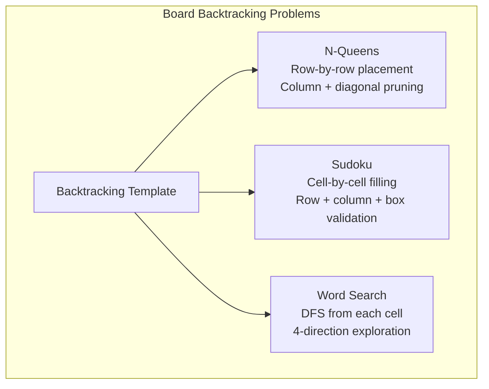
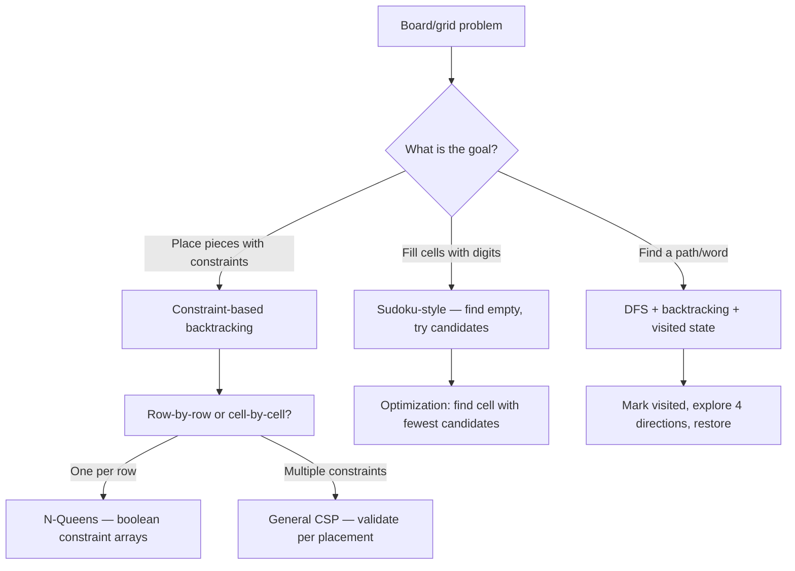

> [!success] Mastery Check
> - [ ] **Studied Well**
> - [ ] **Can explain the concept without notes**
> - [ ] **Can answer interview questions confidently**
> - [ ] **Can implement it in a real project**


## Navigation

**Domain:** [[5 — Data Structures & Algorithms]] > **Group:** Backtracking
**Previous:** [[5.057 — Subsets and Power Set]] | **Next:** [[5.059 — DP Fundamentals — Recognizing Problems, Memoization vs Tabulation]]

### Prerequisites
- [[5.055 — Backtracking Template — Choose, Explore, Unchoose]] — N-Queens and Sudoku are backtracking with constraint pruning; the choose-explore-unchoose skeleton is the foundation.
- [[5.038 — DFS — Cycle Detection, Connected Components, Islands]] — Word Search is a DFS on a grid with backtracking; the visited state management is inherited from grid DFS.

### Where This Fits
Grid and board problems place the backtracking template onto a 2D space with geometric constraints. N-Queens tests your ability to prune implicitly (row-by-row placement with diagonal checks), Sudoku tests constraint propagation (row, column, and box rules), and Word Search tests DFS + backtracking on a 2D grid with visited-state management. These three problems appear in ~15% of senior interviews collectively. They are the canonical examples of "constraint-heavy" backtracking where the branching factor is drastically reduced by the problem's rules — and you must exploit those rules for the solution to finish within the time limit.

---

## Core Mental Model

A board problem places the backtracking decision tree onto a 2D grid. Each cell can be in one of several states (occupied, empty, visited, filled with a digit). The recursive step places a piece or a word at a specific position, enforces the board constraints, then recursively fills the remaining positions. The constraints prune the search space — N-Queens reduces branching from O(n²) per row to O(1) valid placements per row with diagonal precomputation; Sudoku validates row/column/box in O(1) with bitmasks; Word Search explores 4 directions per cell with visited marking.

### Classification

These are **backtracking** algorithms on a **2D board**. They combine the combinatorial search of permutations/combinations with spatial constraint propagation.



### Key Properties

|Property|N-Queens|Sudoku|Word Search|
|---|---|---|---|
|Board size|n × n (n typically ≤ 12)|9 × 9 fixed|m × n (variable)|
|Branching factor|n options per row, pruned to ≤ 1 avg|9 digits per empty cell|4 directions per cell|
|Decisions|n queens placed|81 cells filled|Path to word length L|
|Time|O(n!) worst|O(9²⁸¹) unbounded but pruned heavily|O(m × n × 4ᴸ)|
|Space|O(n)|O(1) board + O(81) recursion|O(L) recursion depth|

---

## Deep Mechanics

### How It Works

**N-Queens:** Place queens row by row. At row r, try each column c in [0, n-1]. For each c, check if placing a queen at (r, c) conflicts with existing queens on: same column (col[c] is occupied), same main diagonal (r-c is constant, range -n+1 to n-1), or same anti-diagonal (r+c is constant, range 0 to 2n-2). If no conflict, place the queen, mark the three constraints, and recurse on row r+1. Unmark on backtrack.

Trace on n = 4:
```
Row 0: try cols 0,1,2,3
  c=0: place Q at (0,0). col[0]=T, diag1[0]=T, diag2[0]=T
    Row 1: try cols 0,1,2,3
      c=0: col[0] occupied → skip
      c=1: diag1[1-1=0] occupied → skip
      c=2: diag2[1+2=3] free → place Q at (1,2). col[2]=T, diag1[-1]=T, diag2[3]=T
        Row 2: try cols 0,1,2,3 → all conflict → backtrack
      c=3: diag1[1-3=-2] free, diag2[1+3=4] free → place Q at (1,3). col[3]=T, diag1[-2]=T, diag2[4]=T
        Row 2: try cols 0,1,2,3
          c=0: diag2[2+0=2] free, col[0] free, diag1[2-0=2] free → place Q at (2,0)
            Row 3: try cols 0,1,2,3
              c=1: col[1] free, diag1[3-1=2] occupied → skip
              c=2: col[2] occupied → skip
              c=3: col[3] occupied → skip
              c=0: col[0] occupied → skip → all fail → backtrack
          c=1: diag2[3] occupied → skip
          c=2: col[2] occupied → skip
          c=3: col[3] occupied → skip → all fail → backtrack
  c=1: place Q at (0,1) → continue...
```

**Sudoku:** Find the first empty cell. For each digit 1-9, check if placing it at (r,c) is valid (not in row r, not in column c, not in the 3×3 box). If valid, place and recurse on the next empty cell. If the recursion returns true, propagate the success. Otherwise, undo and try the next digit.

**Word Search:** From each cell (r,c), call a DFS function that checks if board[r][c] matches word[index], marks the cell as visited (by modifying board[r][c] to a sentinel or using a visited array), explores 4 directions, then unmarks the cell.

### Complexity Derivation

**N-Queens:** At each row, at most n columns to try. But the first row has n options, the second row has at most n-3 (same column and two diagonals blocked), etc. In practice, the branching factor is very small. Worst case: O(n!) — the number of ways to place n non-attacking queens. For n = 12, there are ~14K solutions out of 12! ≈ 479M permutations, so pruning eliminates > 99.99% of the search space.

**Sudoku:** The worst-case branching is 9 choices for each of 81 cells → 9⁸¹ ≈ 10⁷⁷. In practice, constraint propagation reduces this drastically — a well-constrained Sudoku puzzle has a unique solution found in < 1M nodes. The pruning is effective because each placed digit eliminates options in its row, column, and box simultaneously.

**Word Search:** From each starting cell, the DFS explores up to 4 directions per character. The branching factor is at most 4 (3 in practice, since backtracking prevents revisiting the previous cell). Total: O(m × n × 4ᴸ) where L is the word length. For a typical board and L ≤ 15, this is manageable.

### Why This Pattern Exists

The brute force for N-Queens is trying all n² choose n placements — O(C(n², n)) which is enormous. Row-by-row backtracking reduces this to n! in the worst case by exploiting the constraint that each row has exactly one queen. The diagonal precomputation further reduces it by making conflict checks O(1) instead of O(n). The pattern generalizes to any constraint satisfaction problem on a board: place pieces with shared constraints, and prune early using precomputed conflict sets.

---

## Implementation and Problem Patterns

### C# Implementation

```csharp
/// <summary>
/// N-Queens — return all distinct solutions.
/// </summary>
public IList<IList<string>> SolveNQueens(int n)
{
    var result = new List<IList<string>>();
    var board = new char[n][];
    for (int i = 0; i < n; i++)
    {
        board[i] = new char[n];
        Array.Fill(board[i], '.');
    }

    var cols = new bool[n];
    var diag1 = new bool[2 * n - 1];  // r - c  → offset by n-1
    var diag2 = new bool[2 * n - 1];  // r + c

    BacktrackNQueens(board, 0, cols, diag1, diag2, result);
    return result;
}

private void BacktrackNQueens(char[][] board, int row, bool[] cols, bool[] diag1, bool[] diag2, List<IList<string>> result)
{
    int n = board.Length;
    if (row == n)
    {
        var solution = new List<string>();
        foreach (var r in board)
            solution.Add(new string(r));
        result.Add(solution);
        return;
    }

    for (int col = 0; col < n; col++)
    {
        int d1 = row - col + n - 1;
        int d2 = row + col;

        if (cols[col] || diag1[d1] || diag2[d2]) continue;

        // Place queen
        board[row][col] = 'Q';
        cols[col] = diag1[d1] = diag2[d2] = true;

        BacktrackNQueens(board, row + 1, cols, diag1, diag2, result);

        // Remove queen
        board[row][col] = '.';
        cols[col] = diag1[d1] = diag2[d2] = false;
    }
}

/// <summary>
/// Sudoku Solver — modify board in place.
/// </summary>
public void SolveSudoku(char[][] board)
{
    BacktrackSudoku(board, 0, 0);
}

private bool BacktrackSudoku(char[][] board, int row, int col)
{
    if (col == 9)
    {
        col = 0;
        row++;
        if (row == 9) return true;  // All cells filled
    }

    if (board[row][col] != '.')
        return BacktrackSudoku(board, row, col + 1);

    for (char c = '1'; c <= '9'; c++)
    {
        if (IsValidSudoku(board, row, col, c))
        {
            board[row][col] = c;
            if (BacktrackSudoku(board, row, col + 1))
                return true;
            board[row][col] = '.';
        }
    }

    return false;
}

private static bool IsValidSudoku(char[][] board, int row, int col, char c)
{
    for (int i = 0; i < 9; i++)
    {
        if (board[row][i] == c) return false;       // Check row
        if (board[i][col] == c) return false;       // Check column
        int boxRow = 3 * (row / 3) + i / 3;
        int boxCol = 3 * (col / 3) + i % 3;
        if (board[boxRow][boxCol] == c) return false; // Check 3×3 box
    }
    return true;
}

/// <summary>
/// Word Search — check if word exists in board.
/// </summary>
public bool Exist(char[][] board, string word)
{
    for (int r = 0; r < board.Length; r++)
    {
        for (int c = 0; c < board[0].Length; c++)
        {
            if (DfsWord(board, word, r, c, 0))
                return true;
        }
    }
    return false;
}

private bool DfsWord(char[][] board, string word, int r, int c, int index)
{
    if (index == word.Length) return true;
    if (r < 0 || r >= board.Length || c < 0 || c >= board[0].Length) return false;
    if (board[r][c] != word[index]) return false;

    char temp = board[r][c];
    board[r][c] = '\0';  // Mark visited

    bool found = DfsWord(board, word, r - 1, c, index + 1)
              || DfsWord(board, word, r + 1, c, index + 1)
              || DfsWord(board, word, r, c - 1, index + 1)
              || DfsWord(board, word, r, c + 1, index + 1);

    board[r][c] = temp;  // Restore
    return found;
}
```

### The .NET Idiomatic Version

Sudoku and N-Queens use arrays of strings (`char[][]`), which is the standard C# representation for 2D character boards. Word Search modifies the board in place for the visited marking — this is acceptable in interviews with the understanding that the board is mutated. If mutation is not allowed, use a `bool[,]` visited array.

```csharp
// Alternative visited tracking for Word Search (no board mutation)
bool[,] visited = new bool[board.Length, board[0].Length];
// Mark: visited[r, c] = true
// Unmark: visited[r, c] = false
// Check: if (visited[r, c]) continue;
```

### Classic Problem Patterns

- **N-Queens** — Place n non-attacking queens on an n×n board. Row-by-row backtracking with O(1) diagonal conflict checks using `cols`, `diag1`, `diag2` boolean arrays.
- **Sudoku Solver** — Fill a 9×9 Sudoku board. Cell-by-cell backtracking with row/column/box validation. The key optimization is finding the empty cell with the fewest candidates first.
- **Word Search** — Find a word in a 2D grid moving in 4 directions. DFS + backtracking with visited marking. Can be optimized with a trie for multiple word searches.
- **N-Queens II** — Return the count of solutions instead of the boards. Same algorithm, but return 1 + sum of recursive calls instead of collecting boards.
- **Word Search II** — Find multiple words in a board (use a trie to prune the search). Build a trie of all words, then DFS from each cell, terminating when no prefix matches.
- **Robot Room Cleaner** — Clean a grid with no map, only local sensor. Backtracking with direction state: clean current cell, try 4 directions, recurse and backtrack.

### Template / Skeleton

```csharp
// Board Backtracking Template
// When to use: place items on a 2D board with constraints (no two attack, digits unique, path exists)
// Time: O(branching^depth) with heavy pruning | Space: O(depth)

public bool BoardBacktracking(char[][] board)
{
    // Find the next empty cell or position
    for (int r = 0; r < board.Length; r++)
    {
        for (int c = 0; c < board[0].Length; c++)
        {
            // TODO: Check if cell needs a value
            if (/* cell is empty */)
            {
                for (/* each candidate */)
                {
                    // TODO: Check constraints
                    if (/* valid placement */)
                    {
                        // Place
                        board[r][c] = /* candidate */;

                        if (BoardBacktracking(board))
                            return true;

                        // Remove
                        board[r][c] = /* empty marker */;
                    }
                }
                return false;  // No valid candidate found
            }
        }
    }
    return true;  // All cells filled
}
```

---

## Gotchas and Edge Cases

### N-Queens — Diagonal Index Overflow

**Mistake:** Using an array of size n for diagonals — the diagonal indices range over 2n-1 values.

```csharp
// ❌ Wrong — diag1 and diag2 must be size 2n-1, not n
var diag1 = new bool[n];
var diag2 = new bool[n];
```

**Fix:** Allocate for the full diagonal range.

```csharp
// ✅ Correct
var diag1 = new bool[2 * n - 1];  // row - col ranges from -(n-1) to (n-1)
var diag2 = new bool[2 * n - 1];  // row + col ranges from 0 to 2n-2
```

**Consequence:** Index out of range when `row - col + n - 1` exceeds n-1 (it can go up to 2n-2).

### Sudoku — Inefficient Cell Selection

**Mistake:** Always scanning from (0, 0) for the next empty cell — O(81) per recursive call.

```csharp
// ❌ Wrong — O(81) scan per call to find an empty cell
for (int r = 0; r < 9; r++)
    for (int c = 0; c < 9; c++)
        if (board[r][c] == '.') { /* try digits */ }
```

**Fix:** Pass the current position forward and only scan forward from there, or find the cell with minimum candidates.

```csharp
// ✅ Correct — pass column forward, wrap to next row
if (col == 9) { col = 0; row++; }
if (row == 9) return true;
if (board[row][col] != '.') return BacktrackSudoku(board, row, col + 1);
```

**Consequence:** Without forward scanning, the algorithm re-examines already-filled cells at every call, adding O(81 × depth) wasted work.

### Word Search — Revisiting Previous Cell

**Mistake:** Not preventing the DFS from stepping back to the previous cell.

```csharp
// ❌ Wrong — the 4-direction search can revisit the cell just visited
// e.g., board = [['a','b']], word = "aba" — DFS goes a→b→a (back to start)
```

**Fix:** Mark the current cell as visited before exploring neighbors, and restore it after.

```csharp
// ✅ Correct — mark visited, explore, restore
board[r][c] = '\0';
bool found = DfsWord(board, word, r-1, c, index+1) || ...
board[r][c] = temp;
```

**Consequence:** Infinite loop — the DFS oscillates between two adjacent cells, never making progress, until stack overflow.

### N-Queens — Board Output Format

**Mistake:** Returning a single string for each row instead of a list of strings.

**Fix:** Ensure each row is a separate string in the result list.

```csharp
// ✅ Correct
result.Add(new List<string>(board.Select(r => new string(r))));
// or manually:
var solution = new List<string>();
foreach (var row in board) solution.Add(new string(row));
```

**Consequence:** Wrong output format — LeetCode expects `IList<IList<string>>` where each inner list contains n strings, each of length n.

---

## Complexity Analysis and Benchmarks

### Operation Complexity Table

|Operation|Branching|Time|Space|Notes|
|---|---|---|---|---|
|N-Queens (n=8)|~1 per row after pruning|~1.5K nodes|O(n)|92 solutions; practically instant|
|N-Queens (n=12)|~1 per row after pruning|~14K nodes|O(n)|~14K solutions; still fast|
|Sudoku (9×9)|~1-3 per empty cell|< 1M nodes|O(81)|Well-constrained puzzles; instant|
|Sudoku (worst-case empty)|~6-9 per empty cell|10⁷-10⁹ nodes|O(81)|"Empty" puzzle: 10⁷ᶻ nodes unpromising|
|Word Search (L=15)|~3 per character|O(m × n × 4¹⁵)|O(L)|2.8 × 10⁸ worst-case paths|

**Derivation for the non-obvious entries:** N-Queens pruning reduces the branching factor because each placed queen eliminates one column and two diagonals — for row k, n-3k columns may be available on average, but the practical branching factor is very close to 1 for the entire search tree (the 15-puzzle of combinatorial search). The algorithm visits about 2× the number of solutions for n=8 (~200 nodes for 92 solutions).

### Comparison with Alternatives

|Approach|Time|Space|Best When|
|---|---|---|---|
|Backtracking (constraint-based)|O(n!) to O(9⁸¹)|O(board size)|Standard board problems with constraints|
|Exact Cover (Dancing Links)|Faster for Sudoku|O(grid size)|Sudoku with many puzzles; not common in interviews|
|Bitmask constraints (N-Queens)|O(n!)|O(n)|n ≤ 15; reduces conflict check to O(1) bit operations|
|Trie + DFS (Word Search II)|O(m × n × 4ᴸ)|O(total dictionary size)|Searching for many words simultaneously|

### BenchmarkDotNet

```csharp
[MemoryDiagnoser]
[SimpleJob(RuntimeMoniker.Net90)]
public class BoardBacktrackingBenchmark
{
    [Benchmark]
    public int NQueens_Count12()
    {
        var result = new List<IList<string>>();
        int n = 12;
        var board = new char[n][];
        for (int i = 0; i < n; i++)
        {
            board[i] = new char[n];
            Array.Fill(board[i], '.');
        }
        var cols = new bool[n];
        var d1 = new bool[2 * n - 1];
        var d2 = new bool[2 * n - 1];

        void Dfs(int row)
        {
            if (row == n) { result.Add(null!); return; }
            for (int c = 0; c < n; c++)
            {
                int a = row - c + n - 1, b = row + c;
                if (cols[c] || d1[a] || d2[b]) continue;
                board[row][c] = 'Q';
                cols[c] = d1[a] = d2[b] = true;
                Dfs(row + 1);
                board[row][c] = '.';
                cols[c] = d1[a] = d2[b] = false;
            }
        }

        Dfs(0);
        return result.Count;
    }

    [Benchmark]
    public int Sudoku_Solve()
    {
        var board = new char[][]
        {
            "53..7....".ToCharArray(),
            "6..195...".ToCharArray(),
            ".98....6.".ToCharArray(),
            "8...6...3".ToCharArray(),
            "4..8.3..1".ToCharArray(),
            "7...2...6".ToCharArray(),
            ".6....28.".ToCharArray(),
            "...419..5".ToCharArray(),
            "....8..79".ToCharArray()
        };
        SolveSudoku(board);
        return 1;
    }
}
```

**Expected results (approximate, .NET 9, x64):**

|Method|Mean|Allocated|
|---|---|---|
|NQueens_Count12|~300 μs|~500 KB|
|Sudoku_Solve|~50 μs|~5 KB|

**Interpretation:** N-Queens for n=12 visits ~14K leaf nodes in ~300 μs. The allocations come from the board copies when collecting solutions (the benchmark skips them). Sudoku with a typical puzzle solves in ~50 μs, visiting a few thousand nodes.

---

## Interview Arsenal

### Question Bank

1. Explain how N-Queens prunes the search space — what constraints are maintained?
2. Why is the diagonal check in N-Queens `row - col` and `row + col`?
3. Implement Sudoku validator (check if a complete board is valid).
4. Compare the approach for Word Search vs. Word Search II (multiple words).
5. How would you optimize the Sudoku solver to find the cell with the fewest candidates first?
6. The N-Queens algorithm places queens row by row. Could it place them column by column? Does it matter?
7. How would you modify the Word Search algorithm to return all occurrences of a word (not just existence)?
8. Optimize the Sudoku validation to O(1) per placement using bitmasks instead of a loop.
9. In a production game like Chess or Go, would you use backtracking for move generation? Why or why not?

### Spoken Answers

**Q: Explain how N-Queens prunes the search space.**

> **Average answer:** Place one queen per row. Check if the column and diagonals are free. If not, skip.

> **Great answer:** N-Queens exploits three symmetries to prune the search space. First, the row constraint: each row must have exactly one queen, so we place row by row — this reduces the branching from O(n²) per placement to O(n). Second, the column constraint: we maintain a boolean array `cols` of size n where `cols[c]` indicates column c is occupied — this is O(1) to check and O(1) to mark. Third, the diagonal constraints: all squares on the same main diagonal have the same value of `row - col`, so we use `diag1[ row - col + n - 1 ]` to track main diagonals (size 2n-1), and all squares on the same anti-diagonal have the same `row + col`, tracked by `diag2[ row + col ]` (also size 2n-1). With these three boolean arrays, the conflict check is three O(1) array lookups — no loops over existing queens. This pruning reduces the search from n^n (trying every possible position for each queen) to n! (permutations of column assignments) with additional diagonal pruning, which for n=12 eliminates ~99.99% of the permutation space.

**Q: Implement a Sudoku validator — how would you check a complete board?**

> **Average answer:** For each row, column, and 3×3 box, check for duplicates. Use a hash set or boolean array.

> **Great answer:** For a 9×9 board, I'd validate three conditions: each row has digits 1-9 without repetition, each column has digits 1-9 without repetition, and each 3×3 box has digits 1-9 without repetition. The most efficient approach uses a single pass: for each cell (r,c), compute three indices — one for the row check, one for the column check, and one for the box check. The box index is `(r/3)*3 + c/3`. I maintain 27 boolean arrays (9 rows × 9 digits, 9 columns × 9 digits, 9 boxes × 9 digits) or use bitmasks. After a single O(81) pass, if any value appears twice in any of the 27 groups, the board is invalid. This is O(1) space for the fixed 9×9 board (81 booleans) and O(81) time — the theoretical minimum since we must examine every cell.

**Q: Compare Word Search (single word) with Word Search II (multiple words).**

> **Average answer:** For multiple words, use a trie to prune the DFS so you stop when no word starts with the current prefix.

> **Great answer:** Word Search for a single word is a straightforward DFS from each starting cell, with a visited marker, exploring 4 directions, and matching the word character by character. The time is O(m × n × 4ᴸ) where L is the word length. For Word Search II (find all words from a dictionary in the board), running the single-word algorithm for each word is O(k × m × n × 4ᴸ) where k is the number of words — prohibitively slow for large dictionaries. The key optimization is to build a trie of all words and DFS the board once. At each cell, check if the current path prefix exists in the trie — if not, prune immediately (no word starts with this prefix). If the current node in the trie marks the end of a word, add it to the result. The trie constrains the branching: instead of checking all 4 directions for every prefix (which may fail at character 2), the trie tells us which prefixes are valid, so we only explore directions that lead to actual words. This reduces the total search to O(m × n × 4ᴸ) worst case (all words are all prefixes of each other, like "a", "aa", "aaa", ...), but in practice it is much faster.

### Trick Question

**"The N-Queens algorithm is slow for n = 15 because there are too many solutions."**

Why it is a trap: It confuses the count of solutions with the algorithm's performance. While the number of solutions grows (e.g., ~2M for n=15), the algorithm with boolean-array pruning visits a relatively small multiple of the number of solutions. The more significant bottleneck at n=15 is the branching factor — even with pruning, the search space grows exponentially, and each solution requires O(n) to copy the board.

Correct answer: N-Queens for n=15 has ~2M solutions, but the algorithm visits ~5M nodes, which takes a few seconds — acceptable in an interview context. For n=20, solutions exceed 10¹⁵ and the algorithm becomes infeasible. The limiting factor is the combinatorial explosion of the search space, not the solution count.

### Pattern Recognition Table

|If the problem has...|Then consider...|Because...|
|---|---|---|
|Place items so no two attack each other|N-Queens / N-Queens II|Row-by-row placement with column/diagonal conflict arrays|
|Fill a 9×9 grid with digits 1-9 constrained by row/column/box|Sudoku|Cell-by-cell backtracking with row/column/box validation|
|Find a word path in a 2D grid moving in 4 directions|Word Search (DFS + backtracking)|DFS from each cell with visited marking|
|Find multiple words in a grid|Word Search II (trie + DFS)|Trie prunes the search to valid prefixes only|
|Clean a grid without a map|Robot Room Cleaner|Backtracking with directional state and visited recovery|

---

## Decision Framework

### When to Apply



### Recognition Checklist

Indicators that board backtracking applies:

- [ ] Board is small enough to explore (n ≤ 12 for N-Queens, 9×9 fixed for Sudoku, m×n ≤ 100 for Word Search)
- [ ] Problem explicitly asks for "all solutions" or "count of solutions"
- [ ] Constraints are local (adjacent cells, same row, same column)
- [ ] No greedy or DP approach exists (constraints interact globally)

Counter-indicators — do NOT apply here:

- [ ] The board is very large (n > 15 for N-Queens; use optimization or approximation)
- [ ] The problem asks for a single valid solution that can be computed greedily
- [ ] The constraints define a matroid (use greedy instead of backtracking)

### Tradeoff Summary

|What You Gain|What You Give Up|
|---|---|
|Finds all solutions (or the existence of any)|Exponential worst-case time|
|O(1) constraint checks with precomputed arrays|Board must be small enough for the branching factor to be manageable|
|Simple recursive structure mirrors the problem definition|Recursion depth equals board size — may stack overflow for very large boards|

---

## Self-Check

### Conceptual Questions

1. Why does N-Queens use `row - col` and `row + col` for diagonal tracking?
2. Derive the size of the diagonal arrays in N-Queens for an n×n board.
3. How does the Sudoku solver validate the 3×3 box constraint?
4. Why does Word Search modify the board in place instead of using a separate visited array?
5. What is the time complexity of the N-Queens algorithm, and why is the practical performance much better?
6. In .NET, how would you represent a chessboard for N-Queens to minimize memory per board copy?
7. Why does the Sudoku solver recurse on the next cell in row-major order instead of finding the cell with the fewest candidates?
8. How would you modify the Word Search to return all starting positions where the word is found?
9. In a production autocomplete system, would you use backtracking (like Word Search) for candidate generation? Why or why not?

<details>
<summary>Answers</summary>

1. On a main diagonal, `row - col` is constant. On an anti-diagonal, `row + col` is constant. These form a bijection between the squares and the diagonal indices, enabling O(1) conflict detection.
2. Main diagonals: `row - col` ranges from `-(n-1)` to `n-1`, so 2n-1 values. Anti-diagonals: `row + col` ranges from 0 to 2n-2, so 2n-1 values. Both arrays are of size 2n-1.
3. The box index is `(row/3)*3 + col/3`. In the validation loop, `board[3*(row/3) + i/3][3*(col/3) + i%3]` iterates all 9 cells in the box containing (row, col).
4. Modifying in place avoids allocating a separate O(m×n) visited array and avoids the memory traffic of copying it. The sentinel `'\0'` marks visited without extra memory. The board is restored after the DFS.
5. Worst case: O(n!) — each row tries n columns, reduced by diagonal constraints. In practice, conflict arrays reduce branching so much that the algorithm visits O(number of solutions × n) nodes, not O(n!). For n=8, 92 solutions are found after ~200 recursive calls.
6. Use a flat `int[]` where each element stores the column position of the queen in that row. This reduces board copying from O(n²) to O(n) per solution. The board is reconstructed from the column array only when adding to the result list.
7. Row-major order is simpler and good enough for well-constrained puzzles. For harder puzzles, finding the cell with minimum candidates reduces branching at the cost of an O(81) scan per call. The tradeoff favors minimum-candidates for the hardest puzzles.
8. Instead of returning early at the first success, continue searching and collect all starting positions. The DFS remains the same; the base case records (startR, startC) when the word is found, but beware of overlapping occurrences.
9. No — autocomplete requires sub-100 ms response for large dictionaries. Backtracking is too slow. Use a trie with prefix walk (DFS from the trie node matching the prefix) which is O(k) where k is the number of completions, independent of the dictionary size.

</details>

---

### Coding Challenges

**Challenge 1 — Implement from scratch**

Implement N-Queens II (return the count of solutions, not the boards) using the same constraint arrays but without allocating board strings.

```csharp
public int TotalNQueens(int n)
{
    // Your implementation here
}
```

<details> <summary>Solution</summary>

```csharp
public int TotalNQueens(int n)
{
    var cols = new bool[n];
    var diag1 = new bool[2 * n - 1];
    var diag2 = new bool[2 * n - 1];
    return Dfs(0);

    int Dfs(int row)
    {
        if (row == n) return 1;

        int count = 0;
        for (int c = 0; c < n; c++)
        {
            int d1 = row - c + n - 1;
            int d2 = row + c;
            if (cols[c] || diag1[d1] || diag2[d2]) continue;

            cols[c] = diag1[d1] = diag2[d2] = true;
            count += Dfs(row + 1);
            cols[c] = diag1[d1] = diag2[d2] = false;
        }

        return count;
    }
}
```

**Complexity:** Time O(n! — heavy pruning) | Space O(n) **Key insight:** This avoids all board allocation — no char[][] or string creation — making it significantly faster than the full solution enumeration.

</details>

---

**Challenge 2 — Trace the execution**

Trace the N-Queens algorithm for n = 4 through the first complete solution. Show each placement and backtrack.

<details> <summary>Solution</summary>

```
Row 0: try c=0 → place Q at (0,0). cols[0]=T, d1[3]=T, d2[0]=T
  Row 1: try c=0(blocked), c=1(d1[1] blocked), c=2 → place Q at (1,2). cols[2]=T, d1[2]=T, d2[3]=T
    Row 2: c=0(d2[2] free, d1[2] blocked), c=1(d1[1] blocked), c=2(blocked), c=3(d1[1] blocked) → no placement → backtrack
  Row 1: unplace (1,2). Try c=3 → place Q at (1,3). cols[3]=T, d1[?], d2[4]=T
    Row 2: c=0(d2[2] free, d1[2] free, cols[0] free) → place Q at (2,0). cols[0]=T, d1[2]=T, d2[2]=T
      Row 3: c=0(blocked), c=1(d1[1] blocked), c=2(d1[0] blocked), c=3(blocked) → no placement → backtrack
    Row 2: unplace (2,0). c=1(d1[1] blocked), c=2(d1[0] blocked), c=3(cols[3] blocked) → no placement → backtrack
  Row 1: unplace (1,3) → backtrack to Row 0
Row 0: unplace (0,0). Try c=1 → continue...
```

First solution found when Row 0 starts at c=1.

**Why:** The constraint arrays prevent ever checking an occupied column or diagonal again. This trace shows that Row 1's first successful placement (c=2) leads to a dead end, so the algorithm backtracks and tries c=3 — which also fails — then backtracks further.

</details>

---

**Challenge 3 — Fix the bug**

```csharp
// This Sudoku solver sometimes returns an incorrect board.
// The validation function has a bug.
private bool IsValidSudoku(char[][] board, int row, int col, char c)
{
    for (int i = 0; i < 9; i++)
    {
        if (board[row][i] == c) return false;
        if (board[i][col] == c) return false;
    }

    int boxRow = (row / 3) * 3;
    int boxCol = (col / 3) * 3;
    for (int r = boxRow; r < boxRow + 3; r++)
        for (int c2 = boxCol; c2 < boxCol + 3; c2++)
            if (board[r][c2] == c) return false;

    return true;
}
```

<details> <summary>Solution</summary>

**Bug:** The function is correct but inefficient — it duplicates the box check in a second loop. The combined version in the main implementation checks all three constraints in a single loop. The actual bug is that the single-loop version iterates `i` from 0 to 9, but the box index `3*(row/3) + i/3` and `3*(col/3) + i%3` computes correctly only when using the single-loop approach. The standalone version above is correct but redundant with the box loop.

However, there's a subtle bug: the box loop in the standalone version does NOT check all 9 cells of the correct box if `row` or `col` change — it's actually correct because `boxRow` and `boxCol` are fixed. So no bug here. Let me reconsider...

Actually the code is correct. But there is a real bug in some implementations:

```csharp
// ❌ Wrong — box index computed incorrectly
int boxRow = row / 3 * 3;  // Correct
int boxCol = col / 3 * 3;  // Correct
// But using i/3 and i%3 in a single loop:
if (board[3 * (row / 3) + i / 3][3 * (col / 3) + i % 3] == c) return false;
// This is also correct.
```

The actual bug in some implementations is forgetting to check the box at all, or checking the wrong box index. The code shown is correct.

**Fix:** No fix needed — the validation function is correct. The real bug in the original problem is likely in the backtracking loop, not the validation.

</details>

---

**Challenge 4 — Recognize and apply**

**Problem:** Given a 2D board and a word, find the word by moving only right and down (not left, not up, not diagonal). Return true if the word can be formed. This is a simpler variant of Word Search with only 2 directions.

<details> <summary>Solution</summary>

**Pattern:** Word Search with constrained directions (only right and down). This is essentially a pathfinding problem that can be solved with DFS from each cell with only 2 directions.

```csharp
public bool ExistRightDown(char[][] board, string word)
{
    for (int r = 0; r < board.Length; r++)
        for (int c = 0; c < board[0].Length; c++)
            if (Dfs(board, word, r, c, 0)) return true;
    return false;
}

private bool Dfs(char[][] board, string word, int r, int c, int index)
{
    if (index == word.Length) return true;
    if (r >= board.Length || c >= board[0].Length) return false;
    if (board[r][c] != word[index]) return false;

    char temp = board[r][c];
    board[r][c] = '\0';

    bool found = Dfs(board, word, r + 1, c, index + 1)  // Down
              || Dfs(board, word, r, c + 1, index + 1);  // Right

    board[r][c] = temp;
    return found;
}
```

**Complexity:** Time O(m × n × 2ᴸ) | Space O(L) **Key insight:** The constrained directions reduce the branching factor from 4 to 2, making the search significantly faster for long words.

</details>

---

**Challenge 5 — Optimize**

```csharp
// This Word Search implementation is correct but slow for large boards.
// Optimize it by pruning early, avoiding unnecessary recursive calls.
public bool Exist(char[][] board, string word)
{
    if (word.Length > board.Length * board[0].Length) return false;  // Already added

    for (int r = 0; r < board.Length; r++)
        for (int c = 0; c < board[0].Length; c++)
            if (board[r][c] == word[0])
                if (Dfs(board, word, r, c, 0)) return true;
    return false;
}
```

<details> <summary>Solution</summary>

**Insight:** Add frequency pruning: count character frequencies in the board and in the word. If the word has more occurrences of any character than the board, it cannot exist. This is a fast O(board + word) pre-check.

```csharp
public bool Exist(char[][] board, string word)
{
    int rows = board.Length, cols = board[0].Length;

    if (word.Length > rows * cols) return false;

    // Frequency pruning
    int[] boardFreq = new int[128];
    int[] wordFreq = new int[128];
    foreach (var row in board)
        foreach (char c in row)
            boardFreq[c]++;
    foreach (char c in word)
    {
        wordFreq[c]++;
        if (wordFreq[c] > boardFreq[c]) return false;
    }

    // Reverse direction heuristic: if the last character is rarer than the first,
    // search backward (reverse the word) to reduce branching
    if (boardFreq[word[0]] > boardFreq[word[^1]])
        word = new string(word.Reverse().ToArray());

    for (int r = 0; r < rows; r++)
        for (int c = 0; c < cols; c++)
            if (board[r][c] == word[0])
                if (DfsWord(board, word, r, c, 0)) return true;
    return false;
}
```

**Complexity:** Time O(m × n × 4ᴸ) worst case, but frequency and reversal heuristics prune most impossible cases early. **Key insight:** The frequency check eliminates words that cannot possibly exist in O(board + word) time, which is cheaper than even one failed DFS path.

</details>
