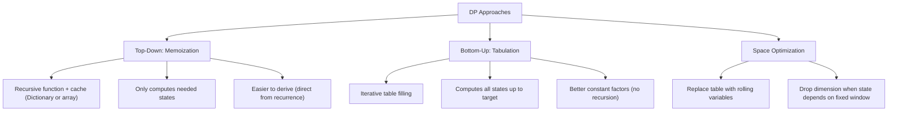

> [!success] Mastery Check
> - [ ] **Studied Well**
> - [ ] **Can explain the concept without notes**
> - [ ] **Can answer interview questions confidently**
> - [ ] **Can implement it in a real project**


## Navigation

**Domain:** [[5 — Data Structures & Algorithms]] > **Group:** Dynamic Programming
**Previous:** [[5.055 — Backtracking Template — Choose, Explore, Unchoose]] | **Next:** [[5.060 — 1D Dynamic Programming]]

### Prerequisites
- [[5.002 — Recursion and the Call Stack]] — top-down DP (memoization) is recursion with a cache; understanding the call tree and stack depth is essential.
- [[5.001 — Big-O Notation and Complexity Analysis]] — DP complexity analysis counts states and transitions; deriving O(states × transitions) requires comfort with Big-O.

### Where This Fits
Dynamic programming is the single most important interview topic — it appears in ~40% of senior coding rounds. It is the technique of solving problems by breaking them into overlapping subproblems, solving each subproblem once, and storing the results. The two key requirements for DP are **optimal substructure** (the optimal solution to a problem can be built from optimal solutions to its subproblems) and **overlapping subproblems** (the same subproblems are solved multiple times). There are two implementation approaches: **top-down** (memoization — recursion + cache) and **bottom-up** (tabulation — iterative table filling). A senior candidate must be able to recognize a DP problem from its description, derive the recurrence relation, and implement both approaches. The step-by-step framework is: (1) define the state, (2) define the recurrence, (3) define the base cases, (4) decide order of computation, (5) implement.

---

## Core Mental Model

DP is recursion with a cache. When a recursive algorithm solves the same subproblem multiple times (the call tree has overlapping branches), storing results in a memoization table eliminates redundant computation. The framework: **state** = function parameters that uniquely identify a subproblem; **recurrence** = how to compute the state from smaller states; **base case** = the smallest subproblem that can be answered directly. Bottom-up tabulation builds the table iteratively from smallest to largest, avoiding recursion overhead. The space optimization (removing the table and keeping only the last few values) is a follow-up for many problems.

### Classification

DP is an **algorithmic paradigm** (not a single algorithm) built on two properties: optimal substructure and overlapping subproblems. It is distinct from divide-and-conquer (subproblems do NOT overlap — no cache needed) and greedy (makes a single local choice without exploring all options).



### Key Properties

|Property|Value|Derivation|
|---|---|---|
|Time complexity|O(states × transitions)|Each state computed once; each transition is O(1) amortized|
|Space (top-down)|O(states) + O(recursion depth)|Cache stores one entry per state; call stack depth = max recursion depth|
|Space (bottom-up)|O(states)|Table for all states|
|Space (optimized)|O(window size)|Only keep the last k states where k is the recurrence window|

---

## Deep Mechanics

### How It Works

**Optimal substructure:** A problem has optimal substructure if the optimal solution can be constructed from optimal solutions to its subproblems. Example: the shortest path from A to C via B is the shortest path from A to B plus the shortest path from B to C. Counter-example: the longest simple path (no optimal substructure because subpaths overlap).

**Overlapping subproblems:** The same subproblems appear multiple times in the recursion tree. Example: Fibonacci — F(5) calls F(4) and F(3); F(4) also calls F(3). F(3) is solved twice without memoization.

**The DP framework:**
1. **Define the state:** What are the parameters that uniquely identify a subproblem? For a number problems: `dp[i]` = best value for first i elements. For 2D: `dp[i][j]` = best value considering first i of A and first j of B.
2. **Recurrence:** How does `dp[i]` relate to smaller states? For Fibonacci: `dp[i] = dp[i-1] + dp[i-2]`. For house robber: `dp[i] = max(dp[i-1], dp[i-2] + nums[i])`.
3. **Base case:** The smallest states that do not depend on others. `dp[0] = 0`, `dp[1] = nums[1]`.
4. **Order:** Bottom-up: iterate from smallest to largest state index. Top-down: recursion naturally goes from large to small.
5. **Implementation:** Top-down: function + cache. Bottom-up: loop + array.

**Top-down vs. bottom-up memoization:**
- Top-down: `if (memo.Contains(state)) return memo[state];` — only computes states reachable from the initial call.
- Bottom-up: `for (int i = 1; i <= n; i++) dp[i] = ...` — computes all states up to n.

**Space optimization:**
When `dp[i]` depends only on a fixed window of previous values (e.g., `dp[i-1]` and `dp[i-2]`), replace the array with individual variables.

### Complexity Derivation

**Time:** Each state is computed exactly once. For each state, the recurrence does O(1) work (for simple DP) or O(number of transitions) work. Total: O(states × transitions).

**Fibonacci:** States = n+1, transitions = 2 (dp[i-1] and dp[i-2]). Total: O(n × 2) = O(n).

**House robber:** States = n+1, transitions = 2 (dp[i-1] and dp[i-2] + nums[i]). Total: O(n).

**Coin change (min coins):** States = amount+1, transitions = coins.Length. Total: O(amount × coins).

**LIS:** States = n, transitions = O(n) (check all previous). Total: O(n²).

**Space:** Top-down uses O(n) for the memo table plus O(n) for the recursion stack (worst case). Bottom-up uses O(n) for the table. Optimized: O(1) for problems with a fixed recurrence window.

### .NET Runtime Notes

- **`Dictionary<TKey, TValue>` for memoization:** Use when state keys are not compact integers (e.g., string, tuple). Use `int[]` or `long[]` when state is a compact integer range.
- **`Array.Fill` for default values:** Use `Array.Fill(memo, -1)` to initialize a memo table with sentinel values. Default `0` is unreliable — the answer could be 0. Use `-1` or `null` for nullable types.
- **Recursion depth:** Top-down DP uses recursion. In .NET, the default call stack is ~1 MB — sufficient for ~10,000 frames. For DP with n > 10,000, prefer bottom-up.
- **`long` for intermediate values:** Summing or multiplying DP values can overflow `int`. Use `long` or `int` with modulo (1_000_000_007).
- **`ReadOnlySpan<T>` for table access:** For performance-critical tabulation, use `Span<T>` for stack-allocated temporary tables.
- **No DP library:** .NET has no built-in DP solver — you implement the recurrence manually.

---

## Implementation and Problem Patterns

### C# Implementation

```csharp
public static class DP
{
    /// <summary>
    /// Fibonacci — top-down (memoization).
    /// </summary>
    public static long FibonacciMemo(int n)
    {
        var memo = new long?[n + 1];
        return FibMemo(n, memo);
    }

    private static long FibMemo(int n, long?[] memo)
    {
        if (n <= 1) return n;
        if (memo[n].HasValue) return memo[n].Value;
        memo[n] = FibMemo(n - 1, memo) + FibMemo(n - 2, memo);
        return memo[n].Value;
    }

    /// <summary>
    /// Fibonacci — bottom-up (tabulation).
    /// </summary>
    public static long FibonacciTab(int n)
    {
        if (n <= 1) return n;

        var dp = new long[n + 1];
        dp[0] = 0;
        dp[1] = 1;

        for (int i = 2; i <= n; i++)
            dp[i] = dp[i - 1] + dp[i - 2];

        return dp[n];
    }

    /// <summary>
    /// Fibonacci — space-optimized (rolling variables).
    /// </summary>
    public static long FibonacciOpt(int n)
    {
        if (n <= 1) return n;

        long prev2 = 0, prev1 = 1;
        for (int i = 2; i <= n; i++)
        {
            long curr = prev1 + prev2;
            prev2 = prev1;
            prev1 = curr;
        }
        return prev1;
    }

    /// <summary>
    /// Climbing stairs — count ways to reach step n (same as Fibonacci).
    /// </summary>
    public static int ClimbStairs(int n)
    {
        if (n <= 2) return n;

        int prev2 = 1, prev1 = 2;
        for (int i = 3; i <= n; i++)
        {
            int curr = prev1 + prev2;
            prev2 = prev1;
            prev1 = curr;
        }
        return prev1;
    }

    /// <summary>
    /// Minimum coins to make amount (unbounded knapsack).
    /// Top-down memoization.
    /// </summary>
    public static int CoinChange(int[] coins, int amount)
    {
        var memo = new int[amount + 1];
        Array.Fill(memo, -2); // -2 = uncomputed
        return CoinChangeMemo(coins, amount, memo);
    }

    private static int CoinChangeMemo(int[] coins, int amount, int[] memo)
    {
        if (amount == 0) return 0;
        if (amount < 0) return -1;
        if (memo[amount] != -2) return memo[amount];

        int min = int.MaxValue;
        foreach (int coin in coins)
        {
            int result = CoinChangeMemo(coins, amount - coin, memo);
            if (result >= 0)
                min = Math.Min(min, result + 1);
        }

        memo[amount] = min == int.MaxValue ? -1 : min;
        return memo[amount];
    }

    /// <summary>
    /// Coin change — bottom-up tabulation.
    /// </summary>
    public static int CoinChangeTab(int[] coins, int amount)
    {
        var dp = new int[amount + 1];
        Array.Fill(dp, amount + 1); // sentinel > max possible
        dp[0] = 0;

        for (int i = 1; i <= amount; i++)
        {
            foreach (int coin in coins)
            {
                if (i >= coin)
                    dp[i] = Math.Min(dp[i], dp[i - coin] + 1);
            }
        }

        return dp[amount] > amount ? -1 : dp[amount];
    }
}
```

### The .NET Idiomatic Version

```csharp
public static class DPIdiomatic
{
    // There is no built-in DP solver in .NET.
    // The DP pattern is always implemented manually.

    // Use the following patterns as templates:

    // 1D DP with O(n) space:
    public static int OneDimDP(int n)
    {
        var dp = new int[n + 1];
        dp[0] = 0; // base case
        for (int i = 1; i <= n; i++)
        {
            // dp[i] = recurrence using dp[i-1], dp[i-2], etc.
        }
        return dp[n];
    }

    // 1D DP with O(1) space (rolling variables):
    public static int OneDimDPOpt(int n)
    {
        int prev2 = 0, prev1 = 1;
        for (int i = 2; i <= n; i++)
        {
            int curr = prev1 + prev2; // or other recurrence
            prev2 = prev1;
            prev1 = curr;
        }
        return prev1;
    }

    // 2D DP with O(n*m) space:
    public static int TwoDimDP(int n, int m)
    {
        var dp = new int[n + 1, m + 1];
        for (int i = 1; i <= n; i++)
            for (int j = 1; j <= m; j++)
                dp[i, j] = Math.Max(dp[i - 1, j], dp[i, j - 1]);
        return dp[n, m];
    }
}
```

### Classic Problem Patterns

1. **Fibonacci / climbing stairs** — Count ways to reach step n. Key insight: the recurrence dp[i] = dp[i-1] + dp[i-2] is the simplest DP. Optimize to O(1) space.
2. **House robber** — Maximum sum without adjacent elements. Key insight: at each house, decide to rob it (skip previous) or skip it (keep previous). dp[i] = max(dp[i-1], dp[i-2] + nums[i]).
3. **Coin change (minimum coins)** — Minimum number of coins to make an amount (unbounded knapsack). Key insight: for each coin, try using it and add 1 to the subproblem's answer. dp[i] = min over coins of dp[i - coin] + 1.
4. **Coin change 2 (number of ways)** — Number of ways to make an amount using unlimited coins. Key insight: order coins in the outer loop to avoid counting permutations of the same combination.
5. **Longest increasing subsequence** — For each element, find the longest increasing subsequence ending at that element. Key insight: dp[i] = 1 + max(dp[j] for j < i and nums[j] < nums[i]). O(n²) with optimization to O(n log n) via patience sorting.

### Template / Skeleton

```csharp
// DP Template (top-down / memoization)
// When to use: problem asks for optimal value or count, has overlapping subproblems
// Time: O(states × transitions) | Space: O(states)

// --- Top-Down (Memoization) ---
public static ReturnType DpTopDown(/* inputs */)
{
    // TODO: initialize memo structure
    // For integer state: var memo = new int?[n + 1];
    // For multi-dim: var memo = new int?[n + 1, m + 1];
    // For dictionary: var memo = new Dictionary<(int, int), int>();

    return Dfs(/* initial state */);

    int Dfs(/* state parameters */)
    {
        // TODO: base case — return known result for smallest states
        if (/* base */) return /* base value */;

        // TODO: check memo
        // if (memo[state] != sentinel) return memo[state];

        // TODO: compute result from subproblems
        int result = /* recurrence using Dfs(smaller states) */;

        // memo[state] = result;
        return result;
    }
}

// --- Bottom-Up (Tabulation) ---
public static ReturnType DpBottomUp(/* inputs */)
{
    // TODO: create dp table
    var dp = new int[n + 1]; // or int[n, m] for 2D

    // TODO: initialize base cases
    dp[0] = /* base */;

    // TODO: fill table in order (smallest to largest)
    for (int i = 1; i <= n; i++)
    {
        // dp[i] = recurrence using dp[smaller indices]
    }

    return dp[n];
}
```

---

## Gotchas and Edge Cases

### Using Default 0 as Uncomputed Sentinel

**Mistake:** Initializing the memo table with 0 and using 0 to check if a state has been computed.

```csharp
// ❌ Wrong — dp[i] could legitimately be 0
var memo = new int[n + 1]; // all 0
// if (memo[i] != 0) return memo[i]; // wrong if answer is 0
```

**Fix:** Use `int?` (nullable) or a sentinel like `-1` if values are non-negative, or a separate bool array.

```csharp
// ✅ Correct — use nullable int
var memo = new int?[n + 1];
if (memo[i].HasValue) return memo[i].Value;
```

**Consequence:** Returns incorrect result when the correct DP value is 0 (e.g., coin change with amount 0 or a path that has 0 ways).

### Incorrect Recurrence — Off-by-One in the State Definition

**Mistake:** Defining `dp[i]` as the best value for the first i elements (1-indexed) but accessing `nums[i]` instead of `nums[i-1]`.

```csharp
// ❌ Wrong — dp[i] uses nums[i] but should use nums[i-1]
dp[i] = Math.Max(dp[i - 1], dp[i - 2] + nums[i]); // index out of range
```

**Fix:** When dp[i] represents the first i elements (1-indexed), array access is `nums[i-1]`.

```csharp
// ✅ Correct — state and array indices are consistent
dp[i] = Math.Max(dp[i - 1], dp[i - 2] + nums[i - 1]);
```

**Consequence:** IndexOutOfRangeException at `nums[n]` or incorrect values from accessing the wrong element.

### Forgetting the Order of Iteration in Tabulation

**Mistake:** Iterating the outer loop over the wrong dimension for coin change (counting combinations vs. permutations).

```csharp
// ❌ Wrong — counts permutations (1+2 and 2+1 are counted separately)
for (int i = 0; i <= amount; i++)
    foreach (int coin in coins)
        if (i >= coin) dp[i] += dp[i - coin];
```

**Fix:** To count combinations (order does not matter), iterate coins in the outer loop and amounts in the inner loop.

```csharp
// ✅ Correct — counts combinations (1+2 and 2+1 are the same)
foreach (int coin in coins)
    for (int i = coin; i <= amount; i++)
        dp[i] += dp[i - coin];
```

**Consequence:** Combinatorial problems (coin change 2) return wrong answers — overcounting because permutations are included.

### Integer Overflow in DP Values

**Mistake:** Using `int` for DP values that can exceed int.MaxValue (e.g., counting paths, Fibonacci for n > 46).

```csharp
// ❌ Wrong — Fibonacci(50) overflows int
var dp = new int[n + 1]; // int cannot hold Fib(50) = 12,586,269,025
```

**Fix:** Use `long` for large values, or apply modulo (common in interview problems).

```csharp
// ✅ Correct — long handles larger values (or use modulo)
var dp = new long[n + 1];
// or dp[i] = (dp[i-1] + dp[i-2]) % 1_000_000_007;
```

**Consequence:** Integer overflow wraps to negative — the algorithm returns incorrect negative values for large n.

---

## Complexity Analysis and Benchmarks

### Operation Complexity Table

|Problem|States|Transitions|Time|Space (tab)|Space (opt)|
|---|---|---|---|---|---|
|Fibonacci|n|2|O(n)|O(n)|O(1)|
|Climbing stairs|n|2|O(n)|O(n)|O(1)|
|House robber|n|2|O(n)|O(n)|O(1)|
|Coin change (min)|amount|coins|O(amount × coins)|O(amount)|O(amount)|
|Coin change 2 (ways)|amount|coins|O(amount × coins)|O(amount)|O(amount)|
|Longest increasing subsequence|n|n|O(n²)|O(n)|O(n)|

**Derivation for the non-obvious entries:** The number of states is the number of distinct subproblems. For each state, the recurrence examines transitions (previous states). Fibonacci has 2 transitions per state (i-1 and i-2). Coin change has |coins| transitions per state (try each coin). LIS checks all previous elements (n transitions per state).

### Comparison with Alternatives

|Approach|Time|Space|Best When|
|---|---|---|---|
|Top-down DP|O(states × trans)|O(states + recursion)|Complex state transitions, only need some states|
|Bottom-up DP|O(states × trans)|O(states)|Need all states up to target, better constants|
|Memoization (dict)|O(states × trans)|O(states + lookup)|State is a non-integer (string, tuple)|
|Greedy|O(n)|O(1)|Problem has greedy choice property (local decisions are globally optimal)|
|Divide-and-conquer|O(n log n)|O(log n)|Subproblems do not overlap (no cache needed)|

### BenchmarkDotNet

```csharp
[MemoryDiagnoser]
[SimpleJob(RuntimeMoniker.Net90)]
public class DpBenchmark
{
    [Params(30, 40)]
    public int N { get; set; }

    [Benchmark(Baseline = true)]
    public long FibonacciTab() => DP.FibonacciTab(N);

    [Benchmark]
    public long FibonacciMemo() => DP.FibonacciMemo(N);

    [Benchmark]
    public long FibonacciOpt() => DP.FibonacciOpt(N);
}
```

**Expected results (approximate, .NET 9, x64):**

|Method|N|Mean|Allocated|
|---|---|---|---|
|FibonacciTab|30|~20 ns|~0 B (JIT removes allocation)|
|FibonacciTab|40|~25 ns|~0 B|
|FibonacciMemo|30|~80 ns|~1 KB|
|FibonacciMemo|40|~120 ns|~2 KB|
|FibonacciOpt|30|~5 ns|0 B|
|FibonacciOpt|40|~7 ns|0 B|

**Interpretation:** The space-optimized version is the fastest (no array allocation, simple loop). Bottom-up tabulation is faster than top-down (no recursion overhead, no hash lookups). For Fibonacci specifically, the difference is small; for complex DP with many states, bottom-up generally wins.

---

## Interview Arsenal

### Question Bank

1. [Definition] What are the two properties a problem must have for DP to apply?
2. [Complexity] Derive the time complexity of coin change (minimum coins) from the DP recurrence.
3. [Implementation] Implement the house robber problem using both top-down and bottom-up DP.
4. [Recognition] Given a problem about "minimum cost to reach the top of a staircase where each step has a cost," what technique?
5. [Comparison] Compare top-down vs. bottom-up DP — when would you choose each?
6. [Trick] How do you avoid counting permutations when counting coin combinations?
7. [System Design] How would you design an auto-complete feature using DP (edit distance)?
8. [Optimization] When can you optimize a DP from O(n) space to O(1) space?

### Spoken Answers

**Q: What are the two properties a problem must have for DP to apply?**

> **Average answer:** Optimal substructure and overlapping subproblems.

> **Great answer:** The two properties are optimal substructure and overlapping subproblems. Optimal substructure means the optimal solution to the problem contains optimal solutions to its subproblems. Formally: an optimal solution can be constructed from optimal solutions to subproblems. For example, the shortest path A→C through B is the shortest A→B plus the shortest B→C. Overlapping subproblems means the same subproblems are solved multiple times in the natural recursive decomposition. Fibonacci's recursion tree calls F(3) twice — that is overlap. Without overlap, divide-and-conquer (merge sort) is sufficient and a cache would never be hit. To test for DP: write the brute-force recursion; if the same function arguments appear multiple times in the call tree, you have overlapping subproblems. The third property sometimes mentioned is the **prefix property** — the state can be represented as a function of indices or prefixes, making the state space manageable.

**Q: Implement the house robber problem using both top-down and bottom-up DP.**

> **Average answer:** Uses dp[i] = max(dp[i-1], dp[i-2] + nums[i]).

> **Great answer:** I'll do both. For **top-down**: I define a function `Rob(int i)` that returns the maximum amount we can rob from houses 0..i. Base: if i < 0, return 0. Memo: if `memo[i]` is set, return it. Recurrence: `Rob(i) = max(Rob(i-1), Rob(i-2) + nums[i])` — either skip house i (keep the best from i-1) or rob it (take nums[i] plus the best from i-2). I store in memo and return. For **bottom-up**: I use an array `dp` where `dp[i]` is the best for the first i+1 houses. Initialize `dp[0] = nums[0]`, `dp[1] = max(nums[0], nums[1])`. Then for i from 2 to n-1: `dp[i] = max(dp[i-1], dp[i-2] + nums[i])`. Return `dp[n-1]`. The space-optimized version uses two variables instead of an array: `prev2` and `prev1`, updated in each iteration.

**Q: [Trick] How do you avoid counting permutations when counting coin combinations?**

> **Average answer:** Order the loops — coins outer, amount inner.

> **Great answer:** The standard unbounded knapsack double loop counts combinations if coins are in the outer loop and amount in the inner loop. The reason: by iterating coins first, we fix the order in which coin types are considered — we never go back to a previously processed coin type. Each combination is counted exactly once (the order of coins does not matter). If we swap the loops (amount outer, coins inner), we count permutations — because each amount tries all coins, and the same set of coins can be reached in different orders (1+2 vs 2+1). The key insight: the outer-loop variable determines what is "ordered" — outer=coins means coin types have a fixed order (combinations); outer=amount means coins can be added in any sequence (permutations).

### Trick Question

**"Is memoization always better than tabulation?"**

Why it is a trap: Many candidates say yes because top-down is easier to write. But bottom-up often has better performance (no recursion overhead, no cache misses, better cache locality when iterating sequentially through the dp array).

Correct answer: No — each has tradeoffs. Top-down: easier to derive from the recurrence, only computes reachable states, natural handling of complex state transitions. Bottom-up: no recursion overhead, no stack overflow risk, better cache locality (sequential array access), easier space optimization. For most interview problems, bottom-up is preferred for performance. Top-down is preferred when the state space is large but only a few states are reachable, or when the recurrence is easier to express recursively.

### Pattern Recognition Table

|If the problem has...|Then consider...|Because...|
|---|---|---|
|"Maximum / minimum / number of ways" + overlapping subproblems|DP|Optimal substructure + overlapping subproblems → DP|
|"Choose or skip" at each step|DP with 0/1 decision|House robber, knapsack — dp[i] = max(choose i, skip i)|
|"Unlimited usage of items"|Unbounded knapsack DP|Inner loop over items, outer loop over capacity (or vice versa for combinations vs. permutations)|
|"Count ways to make change"|Coin change DP|dp[i] = sum of dp[i - coin] for all coins|
|"Longest subsequence"|LIS or LCS DP|dp[i] = 1 + max(dp[j] for j < i with ordering constraint)|
|"Path in a grid"|2D DP|dp[i][j] = dp[i-1][j] + dp[i][j-1] (or min/max)|

---

## Decision Framework

### When to Apply

```mermaid
flowchart TD
    A[Problem: optimal value or count] --> B{Brute force recursion?}
    B --> C[Write the recursive solution]
    C --> D{Do subproblems overlap?}
    D -->|No| E[Use divide-and-conquer or greedy]
    D -->|Yes| F{Optimal substructure?}
    F -->|Yes| G[Use DP]
    F -->|No| H[Backtracking (enumeration)]
    G --> I{Number of states manageable?}
    I -->|Yes| J{Need all states?}
    J -->|Yes| K[Bottom-up tabulation]
    J -->|No| L[Top-down memoization]
    I -->|No| M[Consider greedy or approximation]
```

### Recognition Checklist

Indicators that DP is the right choice:

- [ ] Problem asks for max/min value or count (not enumeration)
- [ ] Solution to larger instances can be built from smaller instances
- [ ] Recursive solution solves the same subproblems repeatedly
- [ ] Input size suggests O(n²) or O(n × m) is acceptable
- [ ] Problem involves "choose or skip" or "prefix" decisions

Counter-indicators — do NOT apply here:

- [ ] Problem asks to enumerate all solutions (use backtracking)
- [ ] Problem has a greedy choice property (use greedy — simpler and faster)
- [ ] Subproblems do not overlap (divide-and-conquer is sufficient)
- [ ] State space is too large (10¹²+ states — DP is infeasible)
- [ ] Problem is a simple formula (e.g., C(n,k) without DP)

### Tradeoff Summary

|What You Gain|What You Give Up|
|---|---|
|Optimal solution in polynomial time (for well-structured problems)|Requires understanding of optimal substructure and recurrence derivation|
|Unified framework (recognize, derive, implement)|May have high constant factors (2D arrays, nested loops)|
|Space-time tradeoff (memoization caches for speed)|Memory can explode for complex state spaces|
|Easily verifiable (prove by induction on the recurrence)|Harder to debug than iterative or recursive without memoization|

---

## Self-Check

### Conceptual Questions

1. What two properties must a problem have for DP to apply? Give a counter-example for each.
2. Derive the time complexity of the coin change (minimum coins) DP.
3. Recognizing from a problem: "Given a 2D grid, count the number of unique paths from top-left to bottom-right moving only down or right."
4. When would you choose top-down DP over bottom-up DP, and vice versa?
5. How do you handle the coin change problem differently for "number of combinations" vs. "minimum number of coins"?
6. In .NET, what sentinel value should you use for memoization when 0 is a valid answer?
7. What invariant does the bottom-up tabulation loop maintain?
8. How does the answer change if the problem asks for "ways modulo 10⁹+7" vs. "exact count"?
9. In a production system, how would you implement a DP solution that needs to handle n = 10⁶?
10. What is the trap question about memoization vs. tabulation?

<details>
<summary>Answers</summary>

1. Optimal substructure: optimal solution contains optimal solutions to subproblems. Counter-example: longest simple path (subpaths may not be optimal for the same reason). Overlapping subproblems: the same subproblems are solved multiple times. Counter-example: merge sort (recursion tree has no overlap).
2. States = amount + 1. For each amount i, transitions = coins.Length (try each coin). Each transition is O(1). Total: O(amount × coins). Space: O(amount).
3. State: dp[i][j] = number of unique paths to reach (i, j). Recurrence: dp[i][j] = dp[i-1][j] + dp[i][j-1] (can only come from above or left). Base: dp[0][*] = dp[*][0] = 1. This is a 2D DP with O(rows × cols) time and space.
4. Top-down when: state is not a compact integer (string/tuple), only some states are reachable, or the recurrence is easier to express recursively. Bottom-up when: all states up to n are needed, need better constant factors, or the recursion depth could overflow the stack.
5. Minimum coins: recurrence dp[i] = min(dp[i], dp[i - coin] + 1) — for each amount, try each coin. Order of loops does not matter for minimum. Number of combinations: dp[i] += dp[i - coin] with coins in the outer loop and amount in the inner loop — this avoids counting permutations of the same coin set.
6. Use `int?` (nullable int) or `int[]` initialized to `-1` if all valid answers are non-negative. Never use `0` as the sentinel when 0 is a valid answer.
7. The loop processes states from smallest to largest. When computing dp[i], all dp[j] for j < i are already computed and final. This invariant guarantees the recurrence accesses fully computed subproblems.
8. Modulo 10⁹+7: apply `% MOD` at each addition/multiplication step to keep values within int range. Exact count: use `long` or `BigInteger` to avoid overflow. The recurrence structure is the same.
9. Use bottom-up with O(1) space if the recurrence has a fixed window (e.g., dp[i] depends on dp[i-1] and dp[i-2]). For O(n²) problems with n = 10⁶, the algorithm itself is infeasible — find a more efficient solution.
10. The trap is claiming memoization is always better. Bottom-up often has better performance (no recursion, better cache locality). The choice depends on the specific problem constraints.

</details>

---

### Coding Challenges

**Challenge 1 — Implement from scratch**

Implement the house robber problem: given an array of money in each house, find the maximum amount you can rob without robbing adjacent houses.

```csharp
public static int Rob(int[] nums)
{
    // Your implementation here
}
```

<details> <summary>Solution</summary>

```csharp
// Bottom-up with O(n) space:
public static int Rob(int[] nums)
{
    if (nums.Length == 0) return 0;
    if (nums.Length == 1) return nums[0];

    var dp = new int[nums.Length];
    dp[0] = nums[0];
    dp[1] = Math.Max(nums[0], nums[1]);

    for (int i = 2; i < nums.Length; i++)
        dp[i] = Math.Max(dp[i - 1], dp[i - 2] + nums[i]);

    return dp[^1];
}

// Space-optimized (O(1)):
public static int RobOpt(int[] nums)
{
    if (nums.Length == 0) return 0;

    int prev2 = 0, prev1 = 0;
    foreach (int num in nums)
    {
        int curr = Math.Max(prev1, prev2 + num);
        prev2 = prev1;
        prev1 = curr;
    }
    return prev1;
}
```

**Complexity:** Time O(n) | Space O(1) optimized **Key insight:** At each house, the only decision is rob (take this house + skip previous) or skip (keep previous best). The dp array is unnecessary — only two previous values matter.

</details>

---

**Challenge 2 — Trace the execution**

Trace bottom-up DP for coin change (minimum coins): coins = [1, 2, 5], amount = 11. Show the dp array after filling each amount.

<details> <summary>Solution</summary>

Initial: dp = [0, inf, inf, inf, inf, inf, inf, inf, inf, inf, inf, inf]
(Sentinel: amount + 1 = 12 represents infinity)

i=1: coin 1 → dp[1] = min(12, dp[0]+1) = 1. coin 2 → 1<2 skip. coin 5 → 1<5 skip. dp[1]=1
i=2: coin 1 → dp[2] = min(12, dp[1]+1) = 2. coin 2 → min(2, dp[0]+1) = 1. dp[2]=1
i=3: coin 1 → dp[3] = min(12, dp[2]+1) = 2. coin 2 → min(2, dp[1]+1) = 2. dp[3]=2
i=4: coin 1 → dp[4] = min(12, dp[3]+1) = 3. coin 2 → min(3, dp[2]+1) = 2. dp[4]=2
i=5: coin 1 → dp[5] = min(12, dp[4]+1) = 3. coin 2 → min(3, dp[3]+1) = 3. coin 5 → min(3, dp[0]+1) = 1. dp[5]=1
i=6: coin 1 → dp[6] = min(12, dp[5]+1) = 2. coin 2 → min(2, dp[4]+1) = 2. coin 5 → min(2, dp[1]+1) = 2. dp[6]=2
i=7: coin 1 → dp[7] = min(12, dp[6]+1) = 3. coin 2 → min(3, dp[5]+1) = 2. coin 5 → min(2, dp[2]+1) = 2. dp[7]=2
i=8: coin 1 → dp[8] = min(12, dp[7]+1) = 3. coin 2 → min(3, dp[6]+1) = 3. coin 5 → min(3, dp[3]+1) = 3. dp[8]=3
i=9: coin 1 → dp[9] = min(12, dp[8]+1) = 4. coin 2 → min(4, dp[7]+1) = 3. coin 5 → min(3, dp[4]+1) = 3. dp[9]=3
i=10: coin 1 → dp[10] = min(12, dp[9]+1) = 4. coin 2 → min(4, dp[8]+1) = 4. coin 5 → min(4, dp[5]+1) = 2. dp[10]=2
i=11: coin 1 → dp[11] = min(12, dp[10]+1) = 3. coin 2 → min(3, dp[9]+1) = 3. coin 5 → min(3, dp[6]+1) = 3. dp[11]=3

Final: dp[11] = 3 (11 = 5 + 5 + 1)

**Why:** dp[i] stores the minimum coins to make amount i. Each coin is tried: dp[i] = min(dp[i], dp[i - coin] + 1). The algorithm correctly finds that 11 requires 3 coins (two 5s and one 1).

</details>

---

**Challenge 3 — Fix the bug**

```csharp
// This implementation counts the number of ways to make change.
// It has a bug — what input causes it to return the wrong answer?
public static int Change(int amount, int[] coins)
{
    var dp = new int[amount + 1];
    dp[0] = 1;

    for (int i = 1; i <= amount; i++)
    {
        foreach (int coin in coins)
        {
            if (i >= coin)
                dp[i] += dp[i - coin];
        }
    }

    return dp[amount];
}
```

<details> <summary>Solution</summary>

**Bug:** The loop order is amount outer, coins inner — this counts **permutations** of coin usage, not combinations. For coins = [1, 2] and amount = 3, this code counts 1+2 and 2+1 as separate ways, giving 3 instead of 2.

**Fix:**

```csharp
public static int Change(int amount, int[] coins)
{
    var dp = new int[amount + 1];
    dp[0] = 1;

    foreach (int coin in coins) // FIXED: coins outer loop
    {
        for (int i = coin; i <= amount; i++)
        {
            dp[i] += dp[i - coin];
        }
    }

    return dp[amount];
}
```

**Test case that exposes it:** `Change(3, [1, 2])`. Buggy returns 3 (permutations: 1+1+1, 1+2, 2+1). Correct returns 2 (combinations: 1+1+1, 1+2).

</details>

---

**Challenge 4 — Recognize and apply**

**Problem:** You are climbing a staircase. It takes n steps to reach the top. Each time you can climb 1 or 2 steps. In how many distinct ways can you climb to the top? Now extend: what if you can take 1, 2, or 3 steps?

<details> <summary>Solution</summary>

**Pattern:** Fibonacci-like DP. dp[i] = number of ways to reach step i. Recurrence: dp[i] = dp[i-1] + dp[i-2] (for 1 or 2 steps). For 1, 2, or 3 steps: dp[i] = dp[i-1] + dp[i-2] + dp[i-3].

```csharp
// 1 or 2 steps — Fibonacci:
public static int ClimbStairs(int n)
{
    if (n <= 2) return n;

    int prev2 = 1, prev1 = 2;
    for (int i = 3; i <= n; i++)
    {
        int curr = prev1 + prev2;
        prev2 = prev1;
        prev1 = curr;
    }
    return prev1;
}

// 1, 2, or 3 steps:
public static int ClimbStairs3(int n)
{
    if (n <= 1) return 1;
    if (n == 2) return 2;
    if (n == 3) return 4; // 1+1+1, 1+2, 2+1, 3

    int prev3 = 1, prev2 = 2, prev1 = 4;
    for (int i = 4; i <= n; i++)
    {
        int curr = prev1 + prev2 + prev3;
        prev3 = prev2;
        prev2 = prev1;
        prev1 = curr;
    }
    return prev1;
}
```

**Complexity:** Time O(n) | Space O(1) **Key insight:** The recurrence changes based on the step set. For k steps, it is a k-th order recurrence; maintain k rolling variables.

</details>

---

**Challenge 5 — Optimize**

```csharp
// This solution finds the minimum cost to reach the top of a staircase.
// Each step has a cost; you can climb 1 or 2 steps at a time.
// It is correct but uses O(n) space. Optimize to O(1).
public static int MinCostClimbingStairs(int[] cost)
{
    int n = cost.Length;
    var dp = new int[n + 1];
    dp[0] = 0;
    dp[1] = 0;

    for (int i = 2; i <= n; i++)
    {
        dp[i] = Math.Min(dp[i - 1] + cost[i - 1], dp[i - 2] + cost[i - 2]);
    }

    return dp[n];
}
```

<details> <summary>Solution</summary>

**Insight:** dp[i] depends only on dp[i-1] and dp[i-2]. Replace the array with two rolling variables.

```csharp
public static int MinCostClimbingStairs(int[] cost)
{
    int n = cost.Length;
    int prev2 = 0; // dp[i-2]
    int prev1 = 0; // dp[i-1]

    for (int i = 2; i <= n; i++)
    {
        int curr = Math.Min(prev1 + cost[i - 1], prev2 + cost[i - 2]);
        prev2 = prev1;
        prev1 = curr;
    }

    return prev1;
}
```

**Complexity:** Time O(n) | Space O(1) **Key insight:** The recurrence only looks back 2 steps. This is the most common space optimization in 1D DP — always check if dp[i] depends on a fixed window of previous values.

</details>
