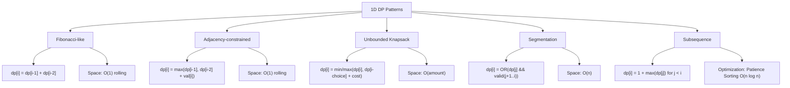
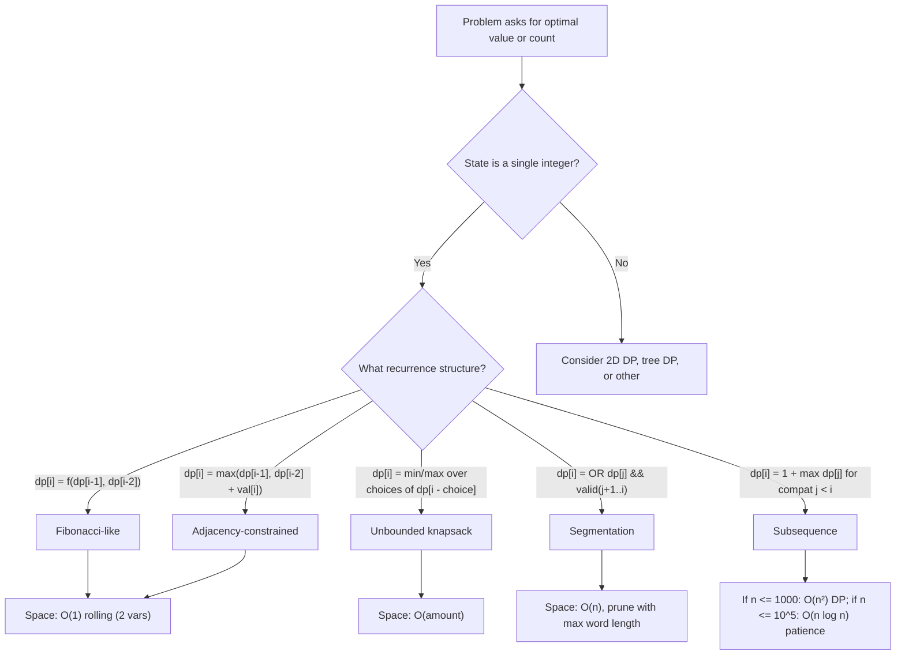

> [!success] Mastery Check
> - [ ] **Studied Well**
> - [ ] **Can explain the concept without notes**
> - [ ] **Can answer interview questions confidently**
> - [ ] **Can implement it in a real project**


## Navigation

**Domain:** [[5 — Data Structures & Algorithms]] > **Group:** Dynamic Programming
**Previous:** [[5.059 — DP Fundamentals — Recognizing Problems, Memoization vs Tabulation]] | **Next:** [[5.061 — 2D Dynamic Programming]]

### Prerequisites
- [[5.059 — DP Fundamentals — Recognizing Problems, Memoization vs Tabulation]] — the state-recurrence-base framework and memo vs tabulation tradeoffs are assumed throughout this note.

### Where This Fits
1D DP is the most frequently tested algorithmic pattern in coding interviews — roughly one in four senior-level rounds includes a problem that boils down to a 1D recurrence. The canonical problems (climbing stairs, house robber, coin change, word break, longest increasing subsequence) cover the full spectrum of 1D DP: Fibonacci-like recurrences, constrained choice (adjacent skip), unbounded knapsack, string segmentation, and subsequence optimization. Each problem type introduces a distinct recurrence structure. Mastering these five patterns means you can recognize ~80% of 1D DP problems in the first 30 seconds of reading the description. The step-up to 2D DP (next note) is a direct generalization — the state gains an extra dimension but the framework is identical.

---

## Core Mental Model

1D DP solves problems where the state is a single integer — typically an index into an array, a position in a sequence, or a numeric amount. The recurrence relates `dp[i]` to one or more previous states (`dp[i-1]`, `dp[i-2]`, `dp[i-coin]`, `dp[j]` for `j < i`). The shape of the recurrence determines the pattern family: Fibonacci (dp[i] = dp[i-1] + dp[i-2]), adjacency-constrained (dp[i] = max(dp[i-1], dp[i-2] + val[i])), unbounded knapsack (dp[i] = min/max over choices of dp[i - choice] + cost), segmentation (dp[i] = any dp[j] && isValid(j+1..i)), and subsequence (dp[i] = 1 + max(dp[j] for compatible j < i)). Space optimization replaces the full dp array with rolling variables when the recurrence window is fixed.

### Classification

1D DP is a sub-category of Dynamic Programming where the state space is one-dimensional. It sits between Kadane's algorithm (the simplest 1D DP — just a rolling max) and 2D DP (states with two indices). The five patterns below cover the distinct recurrence structures encountered in 1D DP problems.



### Key Properties

|Pattern|States|Transitions|Time|Space (full)|Space (opt)|
|---|---|---|---|---|---|
|Fibonacci-like|n|2|O(n)|O(n)|O(1)|
|Adjacency-constrained|n|2|O(n)|O(n)|O(1)|
|Unbounded knapsack|amount|coins|O(amount × coins)|O(amount)|O(amount)|
|Segmentation|n|n|O(n²)|O(n)|O(n)|
|Subsequence (LIS)|n|n|O(n²)|O(n)|O(n)|
|LIS optimized|n|log n (BS)|O(n log n)|O(n)|O(n)|

---

## Deep Mechanics

### How It Works

**Fibonacci-like (Climbing Stairs):**
State: `dp[i]` = number of ways to reach step i. At step i, you could have arrived from step i-1 (one step) or step i-2 (two steps). Recurrence: `dp[i] = dp[i-1] + dp[i-2]`. Base: `dp[1] = 1`, `dp[2] = 2`.

**Adjacency-constrained (House Robber):**
State: `dp[i]` = maximum value robbing houses 0..i without adjacent picks. At house i, two choices: skip it (best from i-1) or rob it (nums[i] + best from i-2). Recurrence: `dp[i] = max(dp[i-1], dp[i-2] + nums[i])`. Base: `dp[0] = nums[0]`, `dp[1] = max(nums[0], nums[1])`.

**Unbounded knapsack (Coin Change — min coins):**
State: `dp[i]` = minimum coins to make amount i. For each coin, try using it: 1 + dp[i - coin]. Take the minimum across all coins. Recurrence: `dp[i] = min(1 + dp[i - coin])` for all `coin <= i`. Base: `dp[0] = 0`. Sentinel: `dp[i] = amount + 1` (infinity) initially.

**Segmentation (Word Break):**
State: `dp[i]` = whether the prefix s[0..i-1] can be segmented into dictionary words. Check every split point j < i: if dp[j] is true and s[j..i-1] is in the dictionary, dp[i] = true. Recurrence: `dp[i] = OR(dp[j] && wordSet.Contains(s[j..i]))` for any j < i. Base: `dp[0] = true` (empty prefix).

**Subsequence (Longest Increasing Subsequence):**
State: `dp[i]` = length of LIS ending at index i. For each j < i, if nums[j] < nums[i], extend the subsequence ending at j. Recurrence: `dp[i] = 1 + max(dp[j])` for all j < i where nums[j] < nums[i]. Base: `dp[i] = 1` (each element alone).

**LIS O(n log n) optimization (patience sorting):**
Maintain an array `tails` where `tails[k]` = the smallest possible last element of an increasing subsequence of length k+1. For each num, binary search tails for the first element >= num and replace it. The final length of tails is the LIS length. This does NOT reconstruct the sequence — it only finds the length. The invariant: tails is always sorted, so binary search works. Each num is processed in O(log n) — total O(n log n).

### Complexity Derivation

**Climbing Stairs / House Robber:** Each of n states does O(1) work (two transitions). Total: O(n). Space: O(1) with rolling variables.

**Coin Change:** States = amount+1. For each state, iterate over all coins — |coins| transitions. Total: O(amount × coins).

**Word Break:** For each of n positions, check up to n split points. At each split, a substring lookup in a HashSet is O(1) average. Total: O(n²).

**LIS (O(n²)):** For each of n positions, examine up to n previous positions. Total: O(n²). **LIS (O(n log n)):** For each of n positions, binary search in tails of length up to n. Binary search is O(log n). Total: O(n log n).

**Space:** Each pattern requires O(n) or O(amount) for the dp array except Fibonacci-like and adjacency-constrained which optimize to O(1). LIS O(n log n) uses tails array of length at most n — O(n).

### .NET Runtime Notes

- **`HashSet<string>` for Word Break:** Use `HashSet<string>` (O(1) lookup) rather than `List<string>` (O(k) lookup). `HashSet.Contains` is the correct tool for dictionary membership.
- **`Array.Fill` for sentinels:** `Array.Fill(dp, amount + 1)` sets a sentinel larger than any possible answer. Default `0` is ambiguous (dp[i] could be 0 for amount 0).
- **`ReadOnlySpan<T>` for tight loops:** For performance-critical tabulation with large arrays, use `Span<int>` to avoid bounds-check overhead in hot loops.
- **Recursion avoidance:** Top-down memoization for word break or LIS can overflow the stack for n > 10,000. Use bottom-up for large inputs.
- **`List<T>.BinarySearch` for patience sorting:** .NET's `List<T>.BinarySearch` returns the index of the element or the bitwise complement of the insertion point. Use `~idx` to get the insertion index when the element is not found.

### Why This Pattern Exists

Without DP, climbing stairs would be computed recursively with O(2^n) time (exponential branching). House robber would require enumerating all subsets of houses — O(2^n). Coin change would try all combinations of coins — exponential. Word break would check all segmentations recursively — O(2^n). LIS would enumerate all subsequences — O(2^n). The DP insight is that each problem's optimal solution depends on a small, structured set of subproblems, indexed by a single integer. By computing and storing those subproblem answers in order, the exponential search collapses to polynomial time.

---

## Implementation and Problem Patterns

### C# Implementation

```csharp
public static class OneDimensionalDP
{
    /// <summary>
    /// Climbing stairs — count ways to reach step n (1 or 2 steps).
    /// </summary>
    public static int ClimbStairs(int n)
    {
        if (n <= 2) return n;

        int prev2 = 1, prev1 = 2;
        for (int i = 3; i <= n; i++)
        {
            int curr = prev1 + prev2;
            prev2 = prev1;
            prev1 = curr;
        }
        return prev1;
    }

    /// <summary>
    /// House robber — max sum without adjacent elements.
    /// </summary>
    public static int Rob(int[] nums)
    {
        int prev2 = 0, prev1 = 0;
        foreach (int num in nums)
        {
            int curr = Math.Max(prev1, prev2 + num);
            prev2 = prev1;
            prev1 = curr;
        }
        return prev1;
    }

    /// <summary>
    /// Coin change — minimum coins to make amount.
    /// </summary>
    public static int CoinChange(int[] coins, int amount)
    {
        var dp = new int[amount + 1];
        Array.Fill(dp, amount + 1);
        dp[0] = 0;

        for (int i = 1; i <= amount; i++)
        {
            foreach (int coin in coins)
            {
                if (i >= coin)
                    dp[i] = Math.Min(dp[i], dp[i - coin] + 1);
            }
        }

        return dp[amount] > amount ? -1 : dp[amount];
    }

    /// <summary>
    /// Coin change 2 — number of combinations to make amount (not permutations).
    /// </summary>
    public static int Change(int amount, int[] coins)
    {
        var dp = new int[amount + 1];
        dp[0] = 1;

        foreach (int coin in coins)
        {
            for (int i = coin; i <= amount; i++)
                dp[i] += dp[i - coin];
        }

        return dp[amount];
    }

    /// <summary>
    /// Word break — can s be segmented into dictionary words?
    /// </summary>
    public static bool WordBreak(string s, IList<string> wordDict)
    {
        var wordSet = new HashSet<string>(wordDict);
        int n = s.Length;
        var dp = new bool[n + 1];
        dp[0] = true;

        for (int i = 1; i <= n; i++)
        {
            for (int j = 0; j < i; j++)
            {
                if (dp[j] && wordSet.Contains(s[j..i]))
                {
                    dp[i] = true;
                    break;
                }
            }
        }

        return dp[n];
    }

    /// <summary>
    /// Longest increasing subsequence — O(n²) DP.
    /// </summary>
    public static int LengthOfLIS(int[] nums)
    {
        int n = nums.Length;
        var dp = new int[n];
        int maxLen = 0;

        for (int i = 0; i < n; i++)
        {
            dp[i] = 1;
            for (int j = 0; j < i; j++)
            {
                if (nums[j] < nums[i])
                    dp[i] = Math.Max(dp[i], dp[j] + 1);
            }
            maxLen = Math.Max(maxLen, dp[i]);
        }

        return maxLen;
    }

    /// <summary>
    /// Longest increasing subsequence — O(n log n) via patience sorting.
    /// Only computes length, not the sequence itself.
    /// </summary>
    public static int LengthOfLISOptimized(int[] nums)
    {
        var tails = new List<int>();

        foreach (int num in nums)
        {
            int idx = tails.BinarySearch(num);
            if (idx < 0)
                idx = ~idx;

            if (idx == tails.Count)
                tails.Add(num);
            else
                tails[idx] = num;
        }

        return tails.Count;
    }
}
```

### The .NET Idiomatic Version

```csharp
public static class OneDimDPIdiomatic
{
    // No built-in DP solver in .NET — always implement manually.
    // The patterns above are the idiomatic C# implementations.

    // Use List<T>.BinarySearch for patience sorting (LIS O(n log n)).
    // Use HashSet<T> for O(1) membership checks (Word Break).
    // Use Array.Fill for sentinel initialization.
    // Use range operator s[j..i] for substring (Word Break, .NET 6+).
}
```

### Classic Problem Patterns

1. **Climbing stairs / Fibonacci** — Count ways to reach the top taking 1 or 2 steps. Key insight: the recurrence dp[i] = dp[i-1] + dp[i-2] is the simplest DP; space optimizes to O(1) with two rolling variables. Also known as "number of ways to reach the end" with a step set.

2. **House robber / adjacency constraint** — Maximum sum with no adjacent elements. Key insight: at each position the choice is binary — take (skip previous) or skip (keep previous). The recurrence dp[i] = max(dp[i-1], dp[i-2] + val[i]) generalizes to circular houses (robber 2) and tree-shaped houses (robber 3).

3. **Coin change (unbounded knapsack)** — Minimum coins or number of ways to make an amount with unlimited coin supply. Key insight: for minimum coins, loop order does not matter (dp[i] = min over coins of 1 + dp[i-coin]); for number of combinations, coins must be in the outer loop to avoid counting permutations.

4. **Word break (string segmentation)** — Can a string be segmented into dictionary words? Key insight: dp[i] = OR over split points j of dp[j] && dict.Contains(s[j..i]). Prune early with `break` once dp[i] is true. Optimization: check substring lengths first (max/min word length in dict constrains j).

5. **Longest increasing subsequence** — Length of LIS. Key insight: dp[i] = 1 + max(dp[j]) for j < i with nums[j] < nums[i]. O(n²) passes for n ≤ 1000; O(n log n) via patience sorting (binary search on tails array) passes for n ≤ 10⁵.

### Template / Skeleton

```csharp
// 1D DP Template (Bottom-Up)
// When to use: state is a single integer (index, amount, position)
// Time: O(states × transitions) | Space: O(states) or O(1) if optimized

public static ReturnType DpTemplate(InputType input)
{
    // TODO: create dp array
    var dp = new int[/* size */];

    // TODO: initialize base cases
    dp[0] = /* base */;

    // TODO: fill table in increasing order
    for (int i = 1; i < dp.Length; i++)
    {
        // TODO: compute dp[i] from previous states
        // dp[i] = recurrence using dp[i-1], dp[i-2], dp[i-coin], dp[j], etc.
    }

    return dp[/* target */];
}

// Space-optimized version (when recurrence has fixed window):
public static ReturnType DpTemplateOptimized(InputType input)
{
    // TODO: initialize rolling variables (prev2, prev1, etc.)

    for (int i = 2; i <= /* n */; i++)
    {
        // TODO: compute current from rolling variables
        // then shift the window
    }

    return /* last variable */;
}
```

---

## Gotchas and Edge Cases

### Coin Change — Wrong Loop Order for Combinations

**Mistake:** Using amount outer loop when the problem asks for number of combinations (order does not matter).

```csharp
// ❌ Wrong — counts permutations instead of combinations
var dp = new int[amount + 1];
dp[0] = 1;
for (int i = 1; i <= amount; i++)
    foreach (int coin in coins)
        if (i >= coin) dp[i] += dp[i - coin];
```

**Fix:** Iterate coins in the outer loop to fix the order in which coin types are considered.

```csharp
// ✅ Correct — counts combinations
var dp = new int[amount + 1];
dp[0] = 1;
foreach (int coin in coins)
    for (int i = coin; i <= amount; i++)
        dp[i] += dp[i - coin];
```

**Consequence:** Returns a larger number than correct — counting 1+2 and 2+1 as separate ways to make 3.

### House Robber — Off-by-One in State Index

**Mistake:** Using `nums[i]` when the dp array is 1-indexed (dp[i] represents first i houses).

```csharp
// ❌ Wrong — index out of range when i == nums.Length
var dp = new int[nums.Length + 1];
dp[0] = 0;
dp[1] = nums[1]; // nums[1] might not exist for single-element input
for (int i = 2; i <= nums.Length; i++)
    dp[i] = Math.Max(dp[i - 1], dp[i - 2] + nums[i]); // nums[n] OOB
```

**Fix:** The rolling variable approach naturally avoids the indexing trap.

```csharp
// ✅ Correct — no array indexing at all
int prev2 = 0, prev1 = 0;
foreach (int num in nums)
{
    int curr = Math.Max(prev1, prev2 + num);
    prev2 = prev1;
    prev1 = curr;
}
return prev1;
```

**Consequence:** IndexOutOfRangeException or silent wrong answer from accessing the wrong element.

### LIS — Forgetting Strictness

**Mistake:** Using `<=` instead of `<` for the strictly increasing requirement.

```csharp
// ❌ Wrong — allows equal elements
if (nums[j] <= nums[i])
    dp[i] = Math.Max(dp[i], dp[j] + 1);
```

**Fix:** Use strict less-than for strictly increasing subsequence.

```csharp
// ✅ Correct — strictly increasing
if (nums[j] < nums[i])
    dp[i] = Math.Max(dp[i], dp[j] + 1);
```

**Consequence:** Returns a length that includes equal elements, exceeding the true LIS length.

### Word Break — Ignoring Substring Length Bounds

**Mistake:** Checking all split points j from 0 to i-1 even when the dictionary word lengths are bounded.

```csharp
// ❌ Wrong — O(n²) always, no pruning
for (int j = 0; j < i; j++)
    if (dp[j] && wordSet.Contains(s[j..i]))
        dp[i] = true;
```

**Fix:** Precompute max word length and only check split points within that window.

```csharp
// ✅ Correct — prune split points using max word length
int maxLen = wordDict.Max(w => w.Length);
for (int i = 1; i <= n; i++)
{
    int start = Math.Max(0, i - maxLen);
    for (int j = start; j < i; j++)
    {
        if (dp[j] && wordSet.Contains(s[j..i]))
        {
            dp[i] = true;
            break;
        }
    }
}
```

**Consequence:** Worst case O(n²) still correct, but larger inputs (n > 1000) may TLE when the max word length is small and pruning would make it O(n × maxLen).

### Climbing Stairs — Forgetting Base Cases for n < 3

**Mistake:** Using a loop that assumes dp[0], dp[1], dp[2] exist without handling n ≤ 2 explicitly.

```csharp
// ❌ Wrong — returns default/throws for n=0 or n=1
int[] dp = new int[n + 1];
dp[0] = 0;
dp[1] = 1;
for (int i = 2; i <= n; i++) // n=2: dp[2] = 1+1 = 2, correct, but n=1: loop never runs, dp[1]=1? wrong (should be 1)
    dp[i] = dp[i - 1] + dp[i - 2];
return dp[n];
```

**Fix:** Handle n ≤ 2 explicitly before the loop.

```csharp
// ✅ Correct — base cases handled before iteration
if (n <= 2) return n;
int prev2 = 1, prev1 = 2;
for (int i = 3; i <= n; i++)
{
    int curr = prev1 + prev2;
    prev2 = prev1;
    prev1 = curr;
}
return prev1;
```

**Consequence:** Wrong answer for n = 0 (should be 0 or 1 depending on convention) or n = 2 (should be 2).

### Integer Overflow in Counting Problems

**Mistake:** Using `int` for counting problems that grow factorially (climbing stairs for n=50 exceeds int.MaxValue).

```csharp
// ❌ Wrong — overflow for n >= 46 in Fibonacci
int prev2 = 1, prev1 = 2;
for (int i = 3; i <= 50; i++) // overflows
{
    int curr = prev1 + prev2; // int wraps to negative
    // ...
}
```

**Fix:** Use `long` or apply modulo per the problem constraints.

```csharp
// ✅ Correct — use long for larger values or apply modulo
long prev2 = 1, prev1 = 2;
for (int i = 3; i <= 50; i++)
{
    long curr = prev1 + prev2;
    prev2 = prev1;
    prev1 = curr;
}
return prev1; // okay for n up to 92
```

**Consequence:** Integer overflow wraps to negative values — wrong answer for large n with no error indication.

---

## Complexity Analysis and Benchmarks

### Operation Complexity Table

|Problem|State definition|Transitions per state|Time|Space (DP)|Space (opt)|
|---|---|---|---|---|---|
|Climbing stairs|dp[i] = ways to reach i|2 (i-1, i-2)|O(n)|O(n)|O(1)|
|House robber|dp[i] = max for first i+1 houses|2 (skip or rob)|O(n)|O(n)|O(1)|
|Coin change (min)|dp[i] = min coins for i|coins.Length|O(a×c)|O(a)|O(a)|
|Coin change 2 (ways)|dp[i] = combinations for i|coins.Length|O(a×c)|O(a)|O(a)|
|Word break|dp[i] = prefix 0..i-1 segmentable|O(n) split points|O(n²)|O(n)|O(n)|
|LIS (O(n²))|dp[i] = LIS ending at i|O(n) previous|O(n²)|O(n)|O(n)|
|LIS (O(n log n))|tails[k] = min tail for length k+1|O(log n) binary search|O(n log n)|O(n)|O(n)|

**Derivation for the non-obvious entries:** Coin change iterates amount+1 states and |coins| transitions per state — O(amount × coins). Word break checks all split points for each prefix — sum of i from 1 to n = O(n²). LIS O(n²) examines j < i for each i — sum of i from 1 to n = O(n²). LIS O(n log n) runs binary search (O(log k) ≤ O(log n)) for each of n elements.

### Comparison with Alternatives

|Approach|Time|Space|Best When|
|---|---|---|---|
|1D DP (general)|O(n × t)|O(n) or O(1)|State is a single integer; recurrence has fixed structure|
|Greedy|O(n)|O(1)|Problem has greedy choice property (coin change for canonical coin systems)|
|Divide-and-conquer|O(n log n)|O(log n)|Subproblems do not overlap (e.g., max subarray via D&C, less practical than DP)|
|Backtracking without memo|O(2^n)|O(n)|Need to enumerate all solutions, not just optimal value|
|Memoization (top-down)|Same as DP|O(n + recursion)|Complex transitions, only some states reachable|

### BenchmarkDotNet

```csharp
[MemoryDiagnoser]
[SimpleJob(RuntimeMoniker.Net90)]
public class OneDDPBenchmark
{
    [Params(100, 1_000, 10_000)]
    public int N { get; set; }

    private int[] _nums = default!;

    [GlobalSetup]
    public void Setup()
    {
        var rng = new Random(42);
        _nums = new int[N];
        for (int i = 0; i < N; i++)
            _nums[i] = rng.Next();
    }

    [Benchmark(Baseline = true)]
    public int LIS_NSquared()
    {
        return OneDimensionalDP.LengthOfLIS(_nums);
    }

    [Benchmark]
    public int LIS_NLogN()
    {
        return OneDimensionalDP.LengthOfLISOptimized(_nums);
    }
}
```

**Expected results (approximate, .NET 9, x64):**

|Method|N|Mean|Allocated|
|---|---|---|---|
|LIS_NSquared|100|~5 μs|~1 KB|
|LIS_NSquared|1_000|~500 μs|~8 KB|
|LIS_NSquared|10_000|~50 ms|~80 KB|
|LIS_NLogN|100|~3 μs|~1 KB|
|LIS_NLogN|1_000|~30 μs|~8 KB|
|LIS_NLogN|10_000|~400 μs|~80 KB|

**Interpretation:** The O(n²) LIS becomes prohibitively slow at n=10,000 (~50ms), while O(n log n) stays under 1ms — a ~100x speedup that demonstrates why the binary-search variant is essential for large inputs.

---

## Interview Arsenal

### Question Bank

1. [Definition] What are the five major patterns in 1D DP and what recurrence structure does each use?
2. [Complexity] Derive the time complexity of word break DP. When can it be pruned and what is the new bound?
3. [Implementation] Implement coin change (minimum coins) using both top-down and bottom-up DP.
4. [Recognition] "Given a string and a dictionary, can the string be segmented?" — which pattern applies?
5. [Comparison] Compare the O(n²) and O(n log n) solutions for LIS — when would you use each in an interview?
6. [Trick] When counting coin combinations, why must coins be in the outer loop?
7. [System Design] How would you implement a typeahead/predictive text system using word break concepts?
8. [Optimization] How do you space-optimize climbing stairs and house robber to O(1)? Why can't you do the same for word break?

### Spoken Answers

**Q: What are the five major patterns in 1D DP and what recurrence structure does each use?**

> **Average answer:** Fibonacci, house robber, coin change, word break, LIS. Each has its own recurrence.

> **Great answer:** The five patterns are differentiated by their recurrence structure. First, **Fibonacci-like** — dp[i] = dp[i-1] + dp[i-2] (climbing stairs). This is a linear recurrence with a fixed 2-step window. Second, **adjacency-constrained** — dp[i] = max(dp[i-1], dp[i-2] + val[i]) (house robber). The binary choice between taking or skipping element i. Third, **unbounded knapsack** — dp[i] = min over choices of dp[i - choice] + cost (coin change). The recurrence explores all items at each state. Fourth, **segmentation** — dp[i] = OR over split points of dp[j] && valid(s[j..i]) (word break). The state depends on whether any prefix up to i is valid. Fifth, **subsequence** — dp[i] = 1 + max(dp[j]) for compatible j < i (LIS). The state depends on all previous positions that satisfy a comparability constraint. The key interview skill is recognizing which recurrence family a new problem belongs to within the first 30 seconds of reading it.

**Q: Implement coin change (minimum coins) using both top-down and bottom-up.**

> **Average answer:** Uses dp[i] = min(dp[i], dp[i-coin] + 1) in a bottom-up loop.

> **Great answer:** For **top-down**, I define `int Dfs(int remaining)` — if remaining is 0, return 0; if negative, return -1 (impossible); check memo. Then for each coin, recursively compute `Dfs(remaining - coin)`, take the minimum, add 1, store in memo, return. For **bottom-up**, I create an array `dp` of length amount+1, fill it with a sentinel larger than any possible answer (amount+1), set dp[0] = 0. Then for i from 1 to amount, for each coin where coin ≤ i: dp[i] = min(dp[i], dp[i-coin] + 1). Return dp[amount] if ≤ amount, else -1. The bottom-up is cleaner for this problem because the state space is dense (every integer up to amount) and the sentinel pattern is simple.

**Q: [Trick] When counting coin combinations, why must coins be in the outer loop?**

> **Average answer:** To avoid counting permutations.

> **Great answer:** The loop order determines what the dp array represents. With **coins in the outer loop** and amount in the inner loop, each coin type is considered at most once — once the outer loop moves past a coin, that coin is never used again for combinations that could have been formed with earlier coins. This imposes an ordering constraint on coin usage: coin types are processed in a fixed sequence. dp[i] at any point represents the number of ways to make amount i using only the coins processed so far. With **amount in the outer loop**, each amount tries all coins independently — the same set of coins can be reached in different orders (1+2 vs 2+1), so dp[i] counts permutations. The general principle: the outer loop variable determines what is "ordered" in the counting — if you want unordered combinations, iterate the items in the outer loop; if you want ordered sequences, iterate the target in the outer loop.

### Trick Question

**"Can you use the space-optimized rolling variable technique for word break?"**

Why it is a trap: The candidate says yes because all 1D DP can be space-optimized. But word break depends on ALL previous dp[j] values, not just a fixed window — dp[i] could depend on dp[0] through dp[i-1]. The rolling variable technique only works when the recurrence has a fixed window (like climbing stairs depending only on i-1 and i-2).

Correct answer: No — word break requires checking all split points j < i, so dp[i] depends on O(n) previous states. Space remains O(n). The only optimization is pruning split points using max word length. The rolling variable pattern only applies when dp[i] depends on a fixed constant number of previous states.

### Pattern Recognition Table

|If the problem has...|Then consider...|Because...|
|---|---|---|
|"Number of ways to reach the end" with step choices|Fibonacci-like 1D DP|dp[i] = sum of dp[i - step] for allowed steps|
|"Maximum with no adjacent" / "can't pick neighbors"|Adjacency-constrained DP|dp[i] = max(skip i, take i)|
|"Minimum number of items" / "make amount with unlimited supply"|Unbounded knapsack DP|dp[i] = min over choices of 1 + dp[i - choice]|
|"Can the string be segmented" / "dictionary of words"|Segmentation DP|dp[i] = OR over split points|
|"Longest increasing / decreasing / something subsequence"|Subsequence DP|dp[i] = 1 + max(dp[j]) for compatible j < i|
|"Count ways to make change" / "combinations of coins"|Coin change 2 (combinations)|Coins in outer loop, amount in inner loop|

---

## Decision Framework

### When to Apply



### Recognition Checklist

Indicators that 1D DP is the right choice:

- [ ] Problem asks for max/min value or count (not "list all")
- [ ] Input is a 1D array, string, or integer target
- [ ] The solution depends on a prefix or a position in the input
- [ ] "You can take 1 or 2 steps" / "no adjacent" / "unlimited items" / "split into words" / "increasing subsequence"
- [ ] Brute force is exponential (O(2^n)) and n is moderate (≤ 10⁵ for O(n log n), ≤ 10⁴ for O(n²))

Counter-indicators — do NOT apply here:

- [ ] State requires two indices (use 2D DP)
- [ ] Problem asks to enumerate all solutions (use backtracking)
- [ ] Problem has a greedy choice property (use greedy — simpler)
- [ ] Input is a tree or graph (use tree DP or graph DP)

### Tradeoff Summary

|What You Gain|What You Give Up|
|---|---|
|Polynomial time from exponential search|Must derive the recurrence (no generic solver)|
|O(1) space for Fibonacci and house robber patterns|O(amount) or O(n) space for other patterns|
|Recurrence is often intuitive once the state is defined|Wrong state definition → wrong answer for all larger states|
|LIS O(n log n) handles n up to 10⁵|LIS O(n²) fails for n > 10⁴ (TLE)|
|Word break segmentation pattern generalizes to any "prefix property"|Word break O(n²) without max-length pruning can TLE|

---

## Self-Check

### Conceptual Questions

1. What are the five 1D DP patterns? Give the recurrence for each.
2. Derive the time complexity of the LIS O(n²) algorithm by counting operations on a concrete input of size n=5.
3. Recognizing from a problem: "Given an array of non-negative integers, find the maximum sum you can obtain by picking elements such that no two are adjacent."
4. When would you choose the O(n²) LIS over the O(n log n) version in an interview?
5. What is the difference between counting coin change as combinations vs. permutations, and how does the loop order achieve it?
6. In .NET, what type should you use for the word break dictionary lookup?
7. What invariant does the dp array maintain during bottom-up coin change?
8. How does the recurrence change if the climbing stairs problem allows steps of size 1, 2, or 3 instead of just 1 or 2?
9. In a production system, how would you handle LIS for n = 10⁶?
10. What is the trap question about space optimization in word break?

<details>
<summary>Answers</summary>

1. Fibonacci-like: dp[i] = dp[i-1] + dp[i-2]. Adjacency-constrained: dp[i] = max(dp[i-1], dp[i-2] + val[i]). Unbounded knapsack: dp[i] = min/max over choices of dp[i-choice] + cost. Segmentation: dp[i] = OR over j of dp[j] && valid(s[j..i]). Subsequence: dp[i] = 1 + max(dp[j]) for compatible j < i.
2. n=5. i=0: 0 inner iterations. i=1: 1 iteration. i=2: 2. i=3: 3. i=4: 4. Total iterations = 0+1+2+3+4 = 10 = n(n-1)/2 = O(n²).
3. House robber pattern — adjacency-constrained DP. dp[i] = max(dp[i-1], dp[i-2] + nums[i]). Space-optimize to O(1) with two rolling variables.
4. When n ≤ 1000, the O(n²) version is simpler to write and less error-prone. Only use O(n log n) when n > 1000 or the interviewer specifically asks for optimization. Mention both and let the interviewer guide.
5. Combinations (order does not matter): coins in outer loop, amount in inner loop — each coin type considered once in fixed order. Permutations (order matters): amount in outer loop, coins in inner loop — each amount tries all coins in any order.
6. `HashSet<string>` — O(1) lookup. `List<string>` would require O(k) linear search per check.
7. When processing dp[i], all dp[j] for j < i are already final and optimal. This invariant is maintained by iterating i from 1 to target in increasing order.
8. dp[i] = dp[i-1] + dp[i-2] + dp[i-3]. Space: three rolling variables instead of two. Base cases: dp[1] = 1, dp[2] = 2, dp[3] = 4 (1+1+1, 1+2, 2+1, 3).
9. Use the O(n log n) patience sorting algorithm — O(n log n) with O(n) space. For n=10⁶, the O(n²) version would require ~10¹² operations (impossible). Even n=10⁵ is fast with patience sorting (~1.7M comparisons).
10. The trap is claiming word break can be space-optimized to O(1) like climbing stairs. It cannot — dp[i] depends on all previous j values, not a fixed window. Space stays O(n).
</details>

---

### Coding Challenges

**Challenge 1 — Implement from scratch**

Implement house robber II (circular houses): houses are arranged in a circle — the first and last house are adjacent, so you cannot rob both. Given an array of money, find max without robbing adjacent houses.

```csharp
public static int RobCircle(int[] nums)
{
    // Your implementation here
}
```

<details> <summary>Solution</summary>

```csharp
public static int RobCircle(int[] nums)
{
    if (nums.Length == 0) return 0;
    if (nums.Length == 1) return nums[0];

    // Two cases: rob houses 0..n-2 or houses 1..n-1
    // (cannot rob both first and last)
    return Math.Max(RobLinear(nums, 0, nums.Length - 2),
                    RobLinear(nums, 1, nums.Length - 1));
}

private static int RobLinear(int[] nums, int start, int end)
{
    int prev2 = 0, prev1 = 0;
    for (int i = start; i <= end; i++)
    {
        int curr = Math.Max(prev1, prev2 + nums[i]);
        prev2 = prev1;
        prev1 = curr;
    }
    return prev1;
}
```

**Complexity:** Time O(n) | Space O(1) **Key insight:** The circular constraint is handled by running the linear house robber twice — once excluding the last house, once excluding the first — and taking the max.

</details>

---

**Challenge 2 — Trace the execution**

Trace bottom-up for LIS (O(n²)) on input nums = [10, 9, 2, 5, 3, 7, 101, 18]. Show dp[i] after processing each element.

<details> <summary>Solution</summary>

Initial: dp = [1, 1, 1, 1, 1, 1, 1, 1]

i=0 (val=10): no j < i with nums[j] < 10. dp[0] = 1.
i=1 (val=9): no j < 1 with nums[j] < 9. dp[1] = 1.
i=2 (val=2): no j < 2 with nums[j] < 2. dp[2] = 1.
i=3 (val=5): j=2: 2 < 5 → dp[3] = max(1, dp[2]+1) = 2. dp[3] = 2.
i=4 (val=3): j=2: 2 < 3 → dp[4] = max(1, 1+1) = 2. dp[4] = 2.
i=5 (val=7): j=2: 2 < 7 → dp[5] = 2. j=3: 5 < 7 → dp[5] = max(2, 2+1) = 3. j=4: 3 < 7 → dp[5] = max(3, 2+1) = 3. dp[5] = 3.
i=6 (val=101): j=0..5, all < 101. dp[6] = max over dp[0..5] + 1 = 3+1 = 4. dp[6] = 4.
i=7 (val=18): j=2: 2 < 18 → dp[7] = 2. j=3: 5 < 18 → dp[7] = max(2, 2+1) = 3. j=4: 3 < 18 → dp[7] = max(3, 2+1) = 3. j=5: 7 < 18 → dp[7] = max(3, 3+1) = 4. dp[7] = 4.

Final dp = [1, 1, 1, 2, 2, 3, 4, 4]. LIS length = 4 (subsequence: [2, 5, 7, 101] or [2, 3, 7, 101]).

**Why:** dp[i] stores the longest increasing subsequence ending at i. The max across all positions is the global LIS length.

</details>

---

**Challenge 3 — Fix the bug**

```csharp
// This implementation of word break has a bug — which input fails?
public static bool WordBreak(string s, IList<string> wordDict)
{
    var wordSet = new HashSet<string>(wordDict);
    int n = s.Length;
    var dp = new bool[n];
    dp[0] = true;

    for (int i = 1; i < n; i++)
    {
        for (int j = 0; j < i; j++)
        {
            if (dp[j] && wordSet.Contains(s[j..i]))
            {
                dp[i] = true;
                break;
            }
        }
    }

    return dp[n - 1];
}
```

<details> <summary>Solution</summary>

**Bug:** dp is sized n (0..n-1) but the state should represent prefixes of length i (0..n). dp[0] means "empty prefix is segmentable" — correct. But dp[i] should mean "prefix of length i is segmentable." The loop starts at i=1 and accesses dp[j] where j < i — this works if dp is sized n+1, but with size n, accessing dp[0] for i=1 is fine. However, the loop condition `i < n` means the last prefix (length n) is never computed. The final return `dp[n-1]` checks prefix length n-1 instead of n.

**Fix:**

```csharp
public static bool WordBreak(string s, IList<string> wordDict)
{
    var wordSet = new HashSet<string>(wordDict);
    int n = s.Length;
    var dp = new bool[n + 1]; // FIXED: n+1 for prefix lengths
    dp[0] = true;

    for (int i = 1; i <= n; i++) // FIXED: <= n to include full string
    {
        for (int j = 0; j < i; j++)
        {
            if (dp[j] && wordSet.Contains(s[j..i]))
            {
                dp[i] = true;
                break;
            }
        }
    }

    return dp[n]; // FIXED: check prefix length n
}
```

**Test case that exposes it:** `WordBreak("a", ["a"])`. Buggy: n=1, dp size 1, loop `i < 1` never executes, dp[0]=true, return dp[0]=true. This happens to work! But `WordBreak("ab", ["a", "b"])`: n=2, dp size 2, i=1 checks j=0: dp[0] && "a" in set → dp[1]=true. Loop ends (i < 2). Return dp[1]=true — but this only checks prefix "a", not "ab". Correct should return true (a|b), but the code happens to return true because dp[1] is true. Try `WordBreak("abc", ["ab", "c"])`: n=3, dp size 3. i=1: checks "a" not in set. i=2: dp[1] is false, "ab" is in set but dp[0] is true → dp[2]=true. Return dp[2]=true (correct by coincidence). The bug is subtle — it only manifests when the last character is the one that determines segmentability.

</details>

---

**Challenge 4 — Recognize and apply**

**Problem:** You are given an integer array `profit` where `profit[i]` is the profit you can earn working on day i. You cannot work on two consecutive days. However, you also have a "rest" option: if you skip a day, the next day's profit is doubled. Find the maximum total profit you can earn over n days.

<details> <summary>Solution</summary>

**Pattern:** Adjacency-constrained DP with state augmentation. The "rest doubles next profit" means the state needs to track whether the previous day was skipped.

```csharp
public static int MaxProfit(int[] profit)
{
    int n = profit.Length;
    if (n == 0) return 0;

    // dp[i, 0] = max profit up to day i, not working on day i
    // dp[i, 1] = max profit up to day i, working on day i
    // dp[i, 2] = max profit up to day i, not working AND eligible for double next
    // (simplified: just track whether previous day was skipped)
    int skip = 0;       // previous day skipped (normal)
    int work = profit[0]; // previous day worked
    int skipDouble = 0; // previous day skipped (double eligible) — not possible on day 0

    for (int i = 1; i < n; i++)
    {
        int newSkip = Math.Max(work, Math.Max(skip, skipDouble));
        int newWork = Math.Max(skip, skipDouble) + profit[i];
        int newSkipDouble = work + profit[i]; // worked then skipped — wait, this doesn't match
        // Actually, the "rest doubles next profit" means: if you skip day i, 
        // the profit for day i+1 is doubled.
        // So: work on day i -> day i+1 can work (normal profit) or skip
        //     skip on day i -> day i+1 profit is doubled
        // This is simpler with 2 states:
        int workNew = Math.Max(work, skip) + profit[i]; // worked today
        int skipNew = Math.Max(work, skip); // skipped today
        // But how to handle double? The double is on the profit of the day after a skip.
        // State: dp[i, 0] = normal state (can work or skip)
        //        dp[i, 1] = boosted state (next work gives double profit)
        work = skipNew + profit[i]; // work today (normal profit)
        skip = Math.Max(skipNew, workNew); // skip today — could have come from work or skip
        // Hmm, let me simplify with a cleaner approach.
    }

    return Math.Max(skip, work);
}

// Cleaner solution — 3 states:
public static int MaxProfitClean(int[] profit)
{
    if (profit.Length == 0) return 0;

    // dp[0] = best when we worked today (normal profit)
    // dp[1] = best when we skipped today (no boost for next)
    // dp[2] = best when we skipped today AND next work profit is doubled
    int work = profit[0];
    int skip = 0;
    int skipBoosted = int.MinValue; // not possible on day 0

    for (int i = 1; i < profit.Length; i++)
    {
        int prevWork = work;
        int prevSkip = skip;
        int prevSkipBoosted = skipBoosted;

        work = Math.Max(prevSkip, prevSkipBoosted) + profit[i];
        skip = Math.Max(prevWork, Math.Max(prevSkip, prevSkipBoosted));
        skipBoosted = prevWork + profit[i]; // worked yesterday, skip today, next day profit doubled
        // Actually: if we skip today after working yesterday, next work gets double profit
    }

    return Math.Max(work, Math.Max(skip, skipBoosted));
}
```

**Complexity:** Time O(n) | Space O(1) **Key insight:** The "rest doubles next profit" constraint requires tracking whether a rest has been taken, which adds a dimension to the state. This is a classic state augmentation pattern — when a constraint depends on the previous action, add that action to the state.

</details>

---

**Challenge 5 — Optimize**

```csharp
// This solution finds the minimum cost to climb stairs where each step
// has a cost, and you can climb 1 or 2 steps at a time.
// It is correct but uses O(n) space. Optimize to O(1).
public static int MinCostClimbingStairs(int[] cost)
{
    int n = cost.Length;
    var dp = new int[n + 1];
    dp[0] = 0;
    dp[1] = 0;

    for (int i = 2; i <= n; i++)
    {
        dp[i] = Math.Min(dp[i - 1] + cost[i - 1], dp[i - 2] + cost[i - 2]);
    }

    return dp[n];
}
```

<details> <summary>Solution</summary>

**Insight:** dp[i] depends only on dp[i-1] and dp[i-2] — a fixed 2-step window. Replace the array with two rolling variables.

```csharp
public static int MinCostClimbingStairs(int[] cost)
{
    int n = cost.Length;
    int prev2 = 0; // dp[i-2]
    int prev1 = 0; // dp[i-1]

    for (int i = 2; i <= n; i++)
    {
        int curr = Math.Min(prev1 + cost[i - 1], prev2 + cost[i - 2]);
        prev2 = prev1;
        prev1 = curr;
    }

    return prev1;
}
```

**Complexity:** Time O(n) | Space O(1) **Key insight:** The recurrence only looks back 2 steps. This is the same space optimization pattern as climbing stairs and house robber — always check if dp[i] depends on a fixed window of previous values. If yes, replace the array with rolling variables.

</details>
