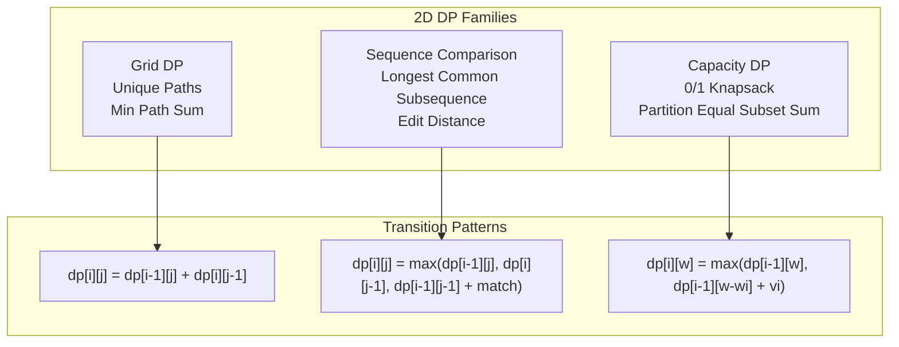

> [!success] Mastery Check
> - [ ] **Studied Well**
> - [ ] **Can explain the concept without notes**
> - [ ] **Can answer interview questions confidently**
> - [ ] **Can implement it in a real project**


## Navigation

**Domain:** [[5 — Data Structures & Algorithms]] > **Group:** Dynamic Programming
**Previous:** [[5.060 — 1D Dynamic Programming — Climbing Stairs, House Robber, Coin Change, Word Break, LIS]] | **Next:** [[5.062 — Interval DP — Burst Balloons, Palindromic Substrings, Matrix Chain]]

### Prerequisites
- [[5.060 — 1D Dynamic Programming — Climbing Stairs, House Robber, Coin Change, Word Break, LIS]] — 2D DP extends the 1D recurrence to two dimensions; understanding the state definition and transition pattern from 1D is required.
- [[5.059 — DP Fundamentals — Recognizing Problems, Memoization vs Tabulation]] — memoization vs. tabulation, state definition, and optimal substructure are prerequisites for any DP problem.

### Where This Fits
2D DP problems have two independent dimensions in the state: typically the indices into two sequences (LCS, Edit Distance), or the position on a grid and a remaining resource (knapsack, unique paths). These problems appear in ~20% of senior coding interviews and represent the transition from introductory DP to the level where you must define the state matrix yourself. The four canonical problems — Unique Paths, Longest Common Subsequence, Edit Distance, and 0/1 Knapsack — cover the three major 2D DP patterns: grid traversal, pairwise sequence comparison, and capacity-constrained selection.

---

## Core Mental Model

A 2D DP problem has a state defined by two independent parameters: `dp[i][j]` represents the optimal value for the subproblem defined by the first i elements of sequence A and the first j elements of sequence B (or the subgrid from (0,0) to (i,j)). The recurrence computes `dp[i][j]` from neighboring states: `dp[i-1][j]`, `dp[i][j-1]`, and `dp[i-1][j-1]`. The three neighbor relationships correspond to: skip element of A, skip element of B, or match/align the two elements.

### Classification

2D DP is a **dynamic programming** paradigm where the state space is a matrix. It is the natural extension of 1D DP (linear state) to problems with two independent sequences or dimensions.



### Key Properties

|Property|Unique Paths|LCS|Edit Distance|0/1 Knapsack|
|---|---|---|---|---|
|State|dp[i][j] — paths to (i,j)|dp[i][j] — LCS of A[0..i] and B[0..j]|dp[i][j] — edit distance|dp[i][w] — max value with weight ≤ w|
|Dimensions|m × n|m × n|m × n|n × W|
|Transition|dp[i-1][j] + dp[i][j-1]|max(skipA, skipB, match)|min(insert, delete, replace)|max(skip, take)|
|Time|O(mn)|O(mn)|O(mn)|O(nW)|
|Space|O(min(m,n))|O(min(m,n))|O(min(m,n))|O(W)|

---

## Deep Mechanics

### How It Works

**Unique Paths:** A robot moves only right or down from top-left to bottom-right. The number of ways to reach cell (i,j) equals the number of ways to reach the cell above plus the number of ways to reach the cell to the left: `dp[i][j] = dp[i-1][j] + dp[i][j-1]`. Base case: `dp[0][j] = dp[i][0] = 1` (only one way along the edges).

Trace on a 3×3 grid:
```
dp[0][0]=1, dp[0][1]=1, dp[0][2]=1
dp[1][0]=1, dp[1][1]=dp[0][1]+dp[1][0]=2, dp[1][2]=dp[0][2]+dp[1][1]=3
dp[2][0]=1, dp[2][1]=dp[1][1]+dp[2][0]=3, dp[2][2]=dp[1][2]+dp[2][1]=6

Result: 6 unique paths
```

**Longest Common Subsequence (LCS):** Compare strings A and B. If `A[i] == B[j]`, the LCS extends by 1: `dp[i][j] = dp[i-1][j-1] + 1`. Otherwise, the LCS is the best of skipping either character: `dp[i][j] = max(dp[i-1][j], dp[i][j-1])`.

Trace on A = "abcde", B = "ace":
```
  "" a  c  e
"" 0  0  0  0
a  0  1  1  1
b  0  1  1  1
c  0  1  2  2
d  0  1  2  2
e  0  1  2  3

Result: 3 ("ace")
```

**Edit Distance (Levenshtein):** Minimum operations (insert, delete, replace) to convert A to B. If `A[i] == B[j]`, `dp[i][j] = dp[i-1][j-1]` (no operation needed). Otherwise, `dp[i][j] = 1 + min(dp[i-1][j] (delete), dp[i][j-1] (insert), dp[i-1][j-1] (replace))`.

Trace on A = "horse", B = "ros":
```
  "" r  o  s
"" 0  1  2  3
h  1  1  2  3
o  2  2  1  2
r  3  2  2  2
s  4  3  3  2
e  5  4  4  3

Result: 3 (h→r, delete r→ø, horse→ros: replace h→r, delete r at pos 2, or more precisely: h→r, then o=o, then delete r, then s=s, then delete e = 3 operations)
Wait: "horse" → "ros": replace 'h'→'r' (1), 'o'='o', delete 'r' (1), 's'='s', delete 'e' (1) = 3.
```

**0/1 Knapsack:** Given n items with weights w[i] and values v[i], and capacity W, maximize total value. `dp[i][w] = max(dp[i-1][w], dp[i-1][w-w[i]] + v[i])` — either skip item i, or take it if it fits.

### Complexity Derivation

**Unique Paths:** Fill an m×n table. Each cell does O(1) work (addition of two neighbors). Total: O(mn). Space can be reduced to O(n) by keeping only the previous row.

**LCS:** Fill an (m+1)×(n+1) table. Each cell does O(1) work (comparison + max of three neighbors). Total: O(mn). Space can be reduced to O(min(m,n)).

**Edit Distance:** Same structure as LCS — (m+1)×(n+1) table, O(1) per cell, O(mn) total. Space reduces to O(min(m,n)).

**0/1 Knapsack:** Fill an (n+1)×(W+1) table. Each cell does O(1) work (comparison with and without the item). Total: O(nW). Space reduces to O(W) by using a 1D array in reverse order.

### Why This Pattern Exists

The brute force for these problems is exponential: Unique Paths via recursion explores 2 choices at each cell (O(2^(m+n))), LCS enumerates all 2^n subsequences, Edit Distance explores 3^(min(m,n)) operation sequences, and Knapsack tries all 2^n subsets. The DP insight is that the optimal solution for the subproblem `dp[i][j]` depends only on a small set of overlapping subproblems — the three neighboring cells — not on all previous states. This is because the problems have optimal substructure where the "last decision" (skip A, skip B, or match/take) determines the state transition, and the subproblems are independent.

---

## Implementation and Problem Patterns

### C# Implementation

```csharp
/// <summary>
/// Unique Paths — number of ways to reach bottom-right corner.
/// </summary>
public int UniquePaths(int m, int n)
{
    int[] dp = new int[n];
    Array.Fill(dp, 1);  // First row is all 1s

    for (int i = 1; i < m; i++)
    {
        for (int j = 1; j < n; j++)
        {
            dp[j] += dp[j - 1];  // dp[j] = old dp[j] (above) + dp[j-1] (left)
        }
    }

    return dp[n - 1];
}

/// <summary>
/// Longest Common Subsequence — length of LCS.
/// </summary>
public int LongestCommonSubsequence(string text1, string text2)
{
    int m = text1.Length, n = text2.Length;
    int[] dp = new int[n + 1];

    for (int i = 1; i <= m; i++)
    {
        int prev = 0;  // dp[i-1][j-1]
        for (int j = 1; j <= n; j++)
        {
            int temp = dp[j];  // dp[i-1][j]
            if (text1[i - 1] == text2[j - 1])
                dp[j] = prev + 1;
            else
                dp[j] = Math.Max(dp[j], dp[j - 1]);
            prev = temp;
        }
    }

    return dp[n];
}

/// <summary>
/// Edit Distance — minimum operations to convert word1 to word2.
/// </summary>
public int MinDistance(string word1, string word2)
{
    int m = word1.Length, n = word2.Length;
    int[] dp = new int[n + 1];
    for (int j = 0; j <= n; j++) dp[j] = j;  // Base: insert all

    for (int i = 1; i <= m; i++)
    {
        int prev = dp[0];  // dp[i-1][j-1] = i-1 for j=0
        dp[0] = i;         // Base: delete all

        for (int j = 1; j <= n; j++)
        {
            int temp = dp[j];  // dp[i-1][j]

            if (word1[i - 1] == word2[j - 1])
                dp[j] = prev;
            else
                dp[j] = 1 + Math.Min(prev, Math.Min(dp[j], dp[j - 1]));
            //          replace↑   delete↑      insert↑

            prev = temp;
        }
    }

    return dp[n];
}

/// <summary>
/// 0/1 Knapsack — maximum value with capacity W.
/// </summary>
public int Knapsack(int[] weights, int[] values, int capacity)
{
    int n = weights.Length;
    int[] dp = new int[capacity + 1];

    for (int i = 0; i < n; i++)
    {
        for (int w = capacity; w >= weights[i]; w--)
        {
            dp[w] = Math.Max(dp[w], dp[w - weights[i]] + values[i]);
        }
    }

    return dp[capacity];
}

/// <summary>
/// Minimum Path Sum — minimum sum along a path from top-left to bottom-right.
/// </summary>
public int MinPathSum(int[][] grid)
{
    int m = grid.Length, n = grid[0].Length;

    for (int i = 1; i < m; i++)
        grid[i][0] += grid[i - 1][0];

    for (int j = 1; j < n; j++)
        grid[0][j] += grid[0][j - 1];

    for (int i = 1; i < m; i++)
        for (int j = 1; j < n; j++)
            grid[i][j] += Math.Min(grid[i - 1][j], grid[i][j - 1]);

    return grid[m - 1][n - 1];
}
```

### The .NET Idiomatic Version

2D DP in C# uses `int[,]` for the full table or `int[]` for the space-optimized rolling array. The rolling array approach uses the fact that the recurrence only needs the previous row (LCS, Edit Distance, Unique Paths) or a 1D array iterated in reverse (Knapsack).

```csharp
// Full 2D table (when reconstruction is needed — e.g., LCS string, not just length)
int[,] dp = new int[m + 1, n + 1];

// Space-optimized 1D rolling array (when only the optimal value is needed)
int[] dp = new int[n + 1];
```

### Classic Problem Patterns

- **Unique Paths / Minimum Path Sum** — Grid traversal with only right/down moves. The recurrence is cumulative (sum for count, min for path sum).
- **Longest Common Subsequence** — Compare two sequences. The recurrence chooses between skip A, skip B, or match. For longest common substring (contiguous), the recurrence changes: match + 1 on equality, reset to 0 on mismatch.
- **Edit Distance** — Minimum operations to transform one string to another. Insert, delete, and replace correspond to the three neighbor transitions. Variants: only insert/delete (no replace), or substitution cost different from 1.
- **0/1 Knapsack** — Maximize value with weight capacity. The inner loop iterates in reverse to prevent reusing the same item. Variants: unbounded knapsack (iterate forward), bounded knapsack (multiple copies).
- **Interleaving String** — Determine if a string is formed by interleaving two others. 2D boolean DP where dp[i][j] = possible using first i of s1 and first j of s2.
- **Distinct Subsequences** — Count distinct subsequences of s that equal t. 2D DP where dp[i][j] = count using first i of s and first j of t.

### Template / Skeleton

```csharp
// 2D DP Template — Pairwise Comparison (LCS / Edit Distance pattern)
// When to use: two sequences, find optimal alignment or commonality
// Time: O(mn) | Space: O(min(m,n))

public int PairwiseDP(string text1, string text2)
{
    int m = text1.Length, n = text2.Length;
    int[] dp = new int[n + 1];

    // Base case: dp[0][*] and dp[*][0] are initialized to 0

    for (int i = 1; i <= m; i++)
    {
        int prev = 0;  // dp[i-1][j-1]
        for (int j = 1; j <= n; j++)
        {
            int temp = dp[j];  // dp[i-1][j]

            // TODO: Define the match and skip transitions
            if (/* characters match or condition holds */)
                dp[j] = prev + 1;  // or: prev + cost
            else
                dp[j] = Math.Max(dp[j], dp[j - 1]);  // or: Math.Min for edit distance
            // TODO: Use appropriate combination (max or min) and cost

            prev = temp;
        }
    }

    return dp[n];
}

// 2D DP Template — Knapsack (Capacity pattern)
// When to use: select items with weight/value constraints
// Time: O(nW) | Space: O(W)

public int KnapsackDP(int[] weights, int[] values, int capacity)
{
    int[] dp = new int[capacity + 1];

    for (int i = 0; i < weights.Length; i++)
    {
        // Reverse loop for 0/1 Knapsack (forward for unbounded)
        for (int w = capacity; w >= weights[i]; w--)
        {
            dp[w] = Math.Max(dp[w], dp[w - weights[i]] + values[i]);
        }
    }

    return dp[capacity];
}
```

---

## Gotchas and Edge Cases

### LCS — Off-by-One in Indexing

**Mistake:** Using dp[i][j] for A[0..i] and B[0..j] (inclusive), which requires separate handling of empty prefixes.

```csharp
// ❌ Wrong — dp[0][*] and dp[*][0] represent non-empty prefixes
// Need to handle comparison of A[0] with B[0] specially
```

**Fix:** Use dp[i+1][j+1] where dp[i][j] corresponds to prefixes of length i and j. dp[0][*] = dp[*][0] = 0 (empty prefix).

```csharp
// ✅ Correct — dp[i][j] = LCS of A[0..i-1] and B[0..j-1]
int[,] dp = new int[m + 1, n + 1];
// dp[0, *] and dp[*, 0] are 0 by default
```

**Consequence:** Off-by-one errors in the recurrence — accessing A[i] when i refers to length, or failing to initialize the first row/column.

### Knapsack — Reverse Loop for 0/1

**Mistake:** Iterating the inner loop forward for 0/1 knapsack.

```csharp
// ❌ Wrong — forward loop allows reusing the same item multiple times
for (int w = weights[i]; w <= capacity; w++)
    dp[w] = Math.Max(dp[w], dp[w - weights[i]] + values[i]);
```

**Fix:** Reverse the inner loop.

```csharp
// ✅ Correct
for (int w = capacity; w >= weights[i]; w--)
    dp[w] = Math.Max(dp[w], dp[w - weights[i]] + values[i]);
```

**Consequence:** Forward loop produces the unbounded knapsack solution (unlimited copies of each item). For 0/1 knapsack, the item may be used multiple times, inflating the value.

### Edit Distance — Base Case Initialization

**Mistake:** Not initializing the first row and column for insert/delete costs.

```csharp
// ❌ Wrong — dp[0][j] = 0 and dp[i][0] = 0 by default, but should be j and i
```

**Fix:** `dp[0][j] = j` (insert j characters) and `dp[i][0] = i` (delete i characters).

```csharp
// ✅ Correct — rolled into the 1D array initialization
for (int j = 0; j <= n; j++) dp[j] = j;
// and dp[0] = i at the start of each outer loop
```

**Consequence:** Without correct base cases, the edit distance of converting "abc" to "" is computed as 0 instead of 3 (deletions).

### Unique Paths — Integer Overflow

**Mistake:** Using `int` for large grids — the number of unique paths on a 100×100 grid exceeds 2⁶³.

```csharp
// ❌ Wrong — overflows for grids larger than ~18×18
int[,] dp = new int[m, n];
```

**Fix:** Use `long` or `BigInteger`, or the combinatorial formula `C(m+n-2, m-1)`.

```csharp
// ✅ Correct — use long for m+n ≤ 100
long[] dp = new long[n];
Array.Fill(dp, 1L);
```

**Consequence:** Silent overflow wraps to negative or incorrect values.

---

## Complexity Analysis and Benchmarks

### Operation Complexity Table

|Problem|State Size|Per Cell|Total Time|Space (naive)|Space (optimized)|
|---|---|---|---|---|---|
|Unique Paths|m × n|O(1)|O(mn)|O(mn)|O(n)|
|LCS|m × n|O(1)|O(mn)|O(mn)|O(min(m,n))|
|Edit Distance|m × n|O(1)|O(mn)|O(mn)|O(min(m,n))|
|0/1 Knapsack|n × W|O(1)|O(nW)|O(nW)|O(W)|
|Min Path Sum|m × n|O(1)|O(mn)|O(1)|O(1) — in-place|

**Derivation for the non-obvious entries:** Min Path Sum can be done in-place by modifying the input grid because the recurrence only accesses the current cell's top and left neighbors, and the original value is not needed after the computation. This gives O(1) extra space.

### Comparison with Alternatives

|Approach|Time|Space|Best When|
|---|---|---|---|
|Recursive + memoization|O(mn)|O(mn) call stack + cache|Problem naturally defined recursively; only a fraction of states needed|
|Tabulation (DP table)|O(mn)|O(mn) or O(min(m,n))|All states needed; simple initialization|
|Divide and Conquer (Knapsack)|O(2^(n/2))|O(2^(n/2))|n ≤ 40 and W is very large (meet-in-the-middle)|
|Greedy (Fractional Knapsack)|O(n log n)|O(1)|Items are divisible; 0/1 knapsack cannot use greedy|

### BenchmarkDotNet

```csharp
[MemoryDiagnoser]
[SimpleJob(RuntimeMoniker.Net90)]
public class Dp2DBenchmark
{
    private string _s1 = null!;
    private string _s2 = null!;

    [Params(100, 500, 1000)]
    public int N { get; set; }

    [GlobalSetup]
    public void Setup()
    {
        var rng = new Random(42);
        var chars = new char[N];
        for (int i = 0; i < N; i++)
            chars[i] = (char)('a' + rng.Next(26));
        _s1 = new string(chars);
        _s2 = new string(chars);  // LCS = N (worst case for comparison)
    }

    [Benchmark]
    public int LCS_1D()
    {
        int m = _s1.Length, n = _s2.Length;
        int[] dp = new int[n + 1];
        for (int i = 1; i <= m; i++)
        {
            int prev = 0;
            for (int j = 1; j <= n; j++)
            {
                int temp = dp[j];
                if (_s1[i - 1] == _s2[j - 1])
                    dp[j] = prev + 1;
                else
                    dp[j] = Math.Max(dp[j], dp[j - 1]);
                prev = temp;
            }
        }
        return dp[n];
    }

    [Benchmark]
    public int LCS_2D()
    {
        int m = _s1.Length, n = _s2.Length;
        int[,] dp = new int[m + 1, n + 1];
        for (int i = 1; i <= m; i++)
            for (int j = 1; j <= n; j++)
                if (_s1[i - 1] == _s2[j - 1])
                    dp[i, j] = dp[i - 1, j - 1] + 1;
                else
                    dp[i, j] = Math.Max(dp[i - 1, j], dp[i, j - 1]);
        return dp[m, n];
    }
}
```

**Expected results (approximate, .NET 9, x64):**

|Method|N|Mean|Allocated|
|---|---|---|---|
|LCS_1D|100|~5 μs|~1 KB|
|LCS_2D|100|~8 μs|~80 KB|
|LCS_1D|500|~120 μs|~4 KB|
|LCS_2D|500|~250 μs|~2 MB|
|LCS_1D|1000|~500 μs|~8 KB|
|LCS_2D|1000|~1 ms|~8 MB|

**Interpretation:** The 1D rolling array is ~2× faster and uses ~1000× less memory than the full 2D table. At N = 1000, the 2D table allocates 8 MB while the 1D version uses 8 KB. The speed difference comes from better cache locality (accessing a single array vs. a 2D array) and reduced GC pressure.

---

## Interview Arsenal

### Question Bank

1. What is the state definition and recurrence for Longest Common Subsequence?
2. Derive the time and space complexity of the Edit Distance algorithm.
3. Implement Unique Paths with obstacle avoidance (some cells are blocked).
4. Compare the 0/1 knapsack with the unbounded knapsack recurrence — what changes and why?
5. Why does the 0/1 knapsack iterate the inner loop in reverse, while the unbounded knapsack iterates forward?
6. The LCS algorithm computes only the length. How would you modify it to also return the actual subsequence?
7. How would you handle the "minimum path sum" problem if you could move in 4 directions (not just right/down)?
8. Optimize the Edit Distance algorithm to use O(min(m,n)) space and return the actual edit script.
9. In a production diff tool (like git diff), what algorithm is used — is it the LCS DP or a variant?

### Spoken Answers

**Q: What is the state definition and recurrence for LCS?**

> **Average answer:** dp[i][j] is the LCS length of the first i characters of A and first j of B. If the characters match, dp[i][j] = dp[i-1][j-1] + 1. Otherwise, it's the max of dp[i-1][j] and dp[i][j-1].

> **Great answer:** The state `dp[i][j]` represents the length of the longest common subsequence using the first i characters of string A and the first j characters of string B — where i and j range from 0 to the string lengths inclusive. The base cases are `dp[0][j] = 0` and `dp[i][0] = 0` because an empty string has no subsequence in common with anything. The recurrence distinguishes two cases: if A[i-1] == B[j-1], the characters can be matched, extending the LCS from the prefixes without those characters: `dp[i][j] = dp[i-1][j-1] + 1`. If they differ, we take the better of skipping A[i-1] (`dp[i-1][j]`) or skipping B[j-1] (`dp[i][j-1]`). This recurrence exploits optimal substructure: the LCS of the full strings contains the LCS of their prefixes as subproblems. The space can be optimized from O(mn) to O(min(m,n)) by storing only the previous row, and the actual subsequence can be reconstructed by storing the choices (match, skip A, skip B) in a separate table of directions.

**Q: Why does 0/1 knapsack iterate the inner loop in reverse?**

> **Average answer:** Because you need to prevent reusing the same item. Forward iteration would allow multiple uses.

> **Great answer:** The 0/1 knapsack recurrence is `dp[w] = max(dp[w], dp[w - weights[i]] + values[i])`. The `dp[w - weights[i]]` on the right side must represent the state **before** considering item i. If I iterate the inner loop forward from `weights[i]` to `capacity`, then by the time I reach a larger capacity, I may have already updated `dp[w - weights[i]]` using item i — which would mean item i is used multiple times. This is correct for the unbounded knapsack (unlimited copies), but for 0/1 knapsack I must iterate in reverse, from `capacity` down to `weights[i]`. This way, `dp[w - weights[i]]` always refers to the value before item i was considered. The reverse loop is the key pattern difference between 0/1 and unbounded knapsack — the state definition and recurrence are otherwise identical.

**Q: How would you modify LCS to return the actual subsequence, not just the length?**

> **Average answer:** Store the decisions in a separate table, then backtrack.

> **Great answer:** After filling the dp table (or the 1D rolling array with careful prev tracking), I reconstruct the LCS by backtracking through the choices. I store an `int[,] direction` table where each cell stores whether the optimal value came from a match (diagonal), skip A (up), or skip B (left). Starting from `dp[m][n]`, I walk backward: if the direction is diagonal (match), I add the character to the result and move to `(i-1, j-1)`. If up, I move to `(i-1, j)` (skip A character). If left, I move to `(i, j-1)` (skip B character). This produces the LCS in reverse order; I reverse it before returning. The space for the direction table is O(mn) — this is the tradeoff for getting the actual subsequence. For very large strings where O(mn) is prohibitive, there are Hirschberg's algorithm (divide and conquer) that computes the LCS in O(mn) time and O(min(m,n)) space by splitting the problem in half recursively.

### Trick Question

**"The 0/1 Knapsack problem is NP-complete, so the DP solution is too slow for large inputs."**

Why it is a trap: It conflates the NP-completeness of the decision problem with the pseudo-polynomial DP solution. 0/1 Knapsack is NP-complete in the general sense (when the input is unbounded integers), but the DP solution is O(nW), which is polynomial in n and W. Since W is typically bounded in interview problems (W ≤ 1000), the DP runs in milliseconds. The "NP-complete" label applies to the decision variant where W is specified in binary and can be exponentially large relative to the input length.

Correct answer: 0/1 Knapsack is NP-complete in general, but the DP solution is pseudo-polynomial O(nW) and is perfectly efficient for interview-sized constraints (n ≤ 1000, W ≤ 1000). For large W, use meet-in-the-middle (O(2^(n/2))) or branch and bound.

### Pattern Recognition Table

|If the problem has...|Then consider...|Because...|
|---|---|---|
|Two sequences; find their commonality or difference|LCS / Edit Distance / Distinct Subsequences|Pairwise comparison DP: match, skip A, skip B|
|Grid with obstacles; count paths or find min sum|Unique Paths / Min Path Sum|Grid DP: right + down transitions, boundary initialization|
|Items with weight and value; maximize within capacity|0/1 Knapsack|Capacity DP: include or exclude each item|
|Two strings interleaved; check if valid|Interleaving String|Match-based DP: dp[i][j] = possible using i of s1, j of s2|

---

## Decision Framework

### When to Apply

```mermaid
flowchart TD
    A[Problem with two parameters] --> B{What are the parameters?}
    B -->|Two sequences/strings| C[Pairwise DP<br>LCS / Edit Distance pattern]
    B -->|Position on grid| D[Grid DP<br>Unique Paths pattern]
    B -->|Capacity + items| E[Knapsack DP<br>include/exclude pattern]
    C --> F{State: dp[i][j] for prefixes}
    D --> G{State: dp[i][j] for cell (i,j)}
    E --> H{State: dp[i][w] for capacity w}
    F --> I[Transition: match, skipA, skipB]
    G --> J[Transition: from top or left]
    H --> K[Transition: skip or take item]
```

### Recognition Checklist

Indicators that 2D DP applies:

- [ ] The problem has two independent dimensions (two sequences, a grid, or a capacity)
- [ ] The optimal solution for the full input can be built from optimal solutions of prefixes
- [ ] The recurrence depends on only the previous row/column (optimal substructure)
- [ ] The state can be represented as a matrix with O(mn) or O(nW) entries
- [ ] Constraints suggest O(mn) is acceptable (m, n ≤ 1000)

Counter-indicators — do NOT apply here:

- [ ] The problem has more than 2 dimensions (use 3D DP or state compression)
- [ ] The recurrence depends on non-contiguous subproblems (use interval DP)
- [ ] W or n is extremely large (W > 10⁶ — use meet-in-the-middle or heuristics)

### Tradeoff Summary

|What You Gain|What You Give Up|
|---|---|
|Reduces exponential to polynomial time|O(mn) or O(nW) space — can be a problem for large inputs|
|Predictable, debuggable O(mn) runtime|Space optimization (1D rolling array) loses ability to reconstruct the solution|
|Clear state definition maps to problem intuition|Pseudo-polynomial for knapsack — O(nW) is not truly polynomial if W is large|
|Works for a wide range of pairwise comparison problems|May be over-engineered for simple grid problems (combinatorial formula for Unique Paths)|

---

## Self-Check

### Conceptual Questions

1. Define the state, recurrence, and base case for Longest Common Subsequence.
2. Derive the time and space complexity of the Edit Distance algorithm with the 1D rolling array optimization.
3. What is the difference between the 0/1 knapsack and the unbounded knapsack recurrence — and how does the loop direction encode this?
4. Given a grid with obstacles, how would you modify Unique Paths to count only paths that avoid blocked cells?
5. Why does the Edit Distance recurrence have 3 options (insert, delete, replace) while LCS has 2 (skip, match)?
6. In .NET, how would you implement the dp table for LCS using `int[,]` vs. `int[][]` — which is more efficient and why?
7. How would you reconstruct the actual LCS string from the dp table?
8. The Min Path Sum algorithm modifies the input grid in place. Is this acceptable? When would it not be?
9. In a production codebase, when would you choose the recursive memoization approach over the iterative tabulation for a 2D DP problem?

<details>
<summary>Answers</summary>

1. State: dp[i][j] = LCS length of A[0..i-1] and B[0..j-1]. Base: dp[0][j] = dp[i][0] = 0. Recurrence: if A[i-1] == B[j-1], dp[i][j] = dp[i-1][j-1] + 1; else dp[i][j] = max(dp[i-1][j], dp[i][j-1]).
2. Time: O(mn) — nested loops over m and n, O(1) work per cell. Space: O(min(m,n)) — the rolling array stores only the previous row (or column). The inner loop preserves dp[i-1][j-1] via the `prev` variable.
3. 0/1 knapsack: inner loop reverse (capacity down to weight[i]) — each item used at most once. Unbounded knapsack: inner loop forward (weight[i] to capacity) — each item can be reused because dp[w - weight[i]] may already include the current item.
4. Initialize dp[0][0] = 1 if the start is not blocked. For each cell, if grid[i][j] is blocked, dp[i][j] = 0. Otherwise, dp[i][j] = (i > 0 ? dp[i-1][j] : 0) + (j > 0 ? dp[i][j-1] : 0).
5. Edit Distance has 3 operations (insert, delete, replace) plus the no-op case (characters match). LCS only has match or skip — there is no "cost" to a mismatch; you just don't get a longer subsequence. The extra operation in Edit Distance corresponds to the replace cost, which has no analog in LCS.
6. `int[,]` is a single contiguous memory block (rectangular array) with better cache locality. `int[][]` is a jagged array requiring two pointer dereferences. For most 2D DP problems, `int[,]` is faster. `int[][]` may be faster for non-rectangular data or when row swapping (e.g., rolling array) is used.
7. After filling the dp table (full 2D version), start at (m, n) and walk backward: if A[i-1] == B[j-1], add A[i-1] to result and move to (i-1, j-1). Else if dp[i][j] == dp[i-1][j], move up. Else move left. Reverse the result.
8. In-place modification is acceptable when the original grid is not needed afterward. In an interview, ask the interviewer: "May I modify the input array?" If the grid is readonly or shared, allocate a separate dp array.
9. Choose recursive memoization when the state space is sparse — not all (i,j) pairs are reachable or needed. For example, in a recursive formulation of Edit Distance where most prefixes are not compared, or when the recursion naturally prunes large portions of the state space. Choose iterative tabulation when all states must be computed, as it avoids function call overhead.

</details>

---

### Coding Challenges

**Challenge 1 — Implement from scratch**

Implement 0/1 Knapsack with item reconstruction — return the list of selected item indices, not just the maximum value.

```csharp
public List<int> KnapsackWithItems(int[] weights, int[] values, int capacity)
{
    // Your implementation here
}
```

<details> <summary>Solution</summary>

```csharp
public List<int> KnapsackWithItems(int[] weights, int[] values, int capacity)
{
    int n = weights.Length;
    int[,] dp = new int[n + 1, capacity + 1];  // Full table for reconstruction

    for (int i = 1; i <= n; i++)
    {
        for (int w = 0; w <= capacity; w++)
        {
            if (weights[i - 1] <= w)
                dp[i, w] = Math.Max(dp[i - 1, w], dp[i - 1, w - weights[i - 1]] + values[i - 1]);
            else
                dp[i, w] = dp[i - 1, w];
        }
    }

    // Reconstruct selected items
    var selected = new List<int>();
    int remaining = capacity;
    for (int i = n; i > 0; i--)
    {
        if (dp[i, remaining] != dp[i - 1, remaining])
        {
            selected.Add(i - 1);
            remaining -= weights[i - 1];
        }
    }

    selected.Reverse();
    return selected;
}
```

**Complexity:** Time O(nW) | Space O(nW) **Key insight:** The full 2D table is needed for reconstruction — the rolling array optimization loses the ability to trace back.

</details>

---

**Challenge 2 — Trace the execution**

Trace the LCS algorithm on strings A = "abcde" and B = "ace". Show the full dp table and the backtracking to reconstruct the LCS.

<details> <summary>Solution</summary>

Table (1-indexed by length):
```
    "" a  c  e
""  0  0  0  0
a   0→ 1→ 1→ 1
         ↖
b   0→ 1→ 1→ 1
c   0→ 1→ 2→ 2
            ↖
d   0→ 1→ 2→ 2
e   0→ 1→ 2→ 3
               ↖
```

Arrows: → from left (skip B), ↑ from above (skip A), ↖ from diagonal (match).

Backtracking from (5,3):
- dp[5,3] vs dp[4,3]: dp[5,3]=3, dp[4,3]=2. Different → A[4]='e' matches B[2]='e'. Add 'e'. Move to (4,2).
- dp[4,2] vs dp[4,1]: dp[4,2]=2, dp[4,1]=2. Same → skip A. Move to (3,2).
- dp[3,2] vs dp[2,2]: dp[3,2]=2, dp[2,2]=1. Different → A[2]='c' matches B[1]='c'. Add 'c'. Move to (2,1).
- dp[2,1] vs dp[2,0]: dp[2,1]=1, dp[2,0]=0. Different → A[1]='b' ≠ B[0]='a'. But dp[2,1]=dp[1,1]=1 → skip A. Move to (1,1).
- dp[1,1] vs dp[0,1]: dp[1,1]=1, dp[0,1]=0. Different → A[0]='a' matches B[0]='a'. Add 'a'. Move to (0,0).
- i=0, j=0 → stop.

Reverse collected: ['e','c','a'] → "ace". LCS = "ace", length 3.

**Why:** The table encodes optimal substructure. The match arrows show which characters are included; the skip arrows show which are skipped.

</details>

---

**Challenge 3 — Fix the bug**

```csharp
// This Unique Paths implementation has a bug for certain grid sizes.
public int UniquePaths(int m, int n)
{
    int[,] dp = new int[m, n];
    for (int i = 0; i < m; i++)
        for (int j = 0; j < n; j++)
            dp[i, j] = dp[i - 1, j] + dp[i, j - 1];
    return dp[m - 1, n - 1];
}
```

<details> <summary>Solution</summary>

**Bug:** The loop accesses `dp[i-1, j]` and `dp[i, j-1]` when i=0 or j=0, causing index out of range. Base case initialization is missing.

**Fix:**

```csharp
public int UniquePaths(int m, int n)
{
    int[,] dp = new int[m, n];

    for (int i = 0; i < m; i++) dp[i, 0] = 1;  // First column
    for (int j = 0; j < n; j++) dp[0, j] = 1;  // First row

    for (int i = 1; i < m; i++)
        for (int j = 1; j < n; j++)
            dp[i, j] = dp[i - 1, j] + dp[i, j - 1];

    return dp[m - 1, n - 1];
}
```

**Test case that exposes it:** `UniquePaths(1, 1)` → IndexOutOfRangeException at dp[-1, 0]. After fix: returns 1.

</details>

---

**Challenge 4 — Recognize and apply**

**Problem:** Given two strings and three operations (insert a character at any position, delete a character, replace a character), find the minimum number of operations to transform one string into the other. However, the cost of replacing a character is 2, while insert and delete cost 1 each. Adapt the standard Edit Distance algorithm.

<details> <summary>Solution</summary>

**Pattern:** Edit Distance with weighted operations. The recurrence changes the replace cost from 1 to 2.

```csharp
public int MinDistanceWeighted(string word1, string word2)
{
    int m = word1.Length, n = word2.Length;
    int[] dp = new int[n + 1];
    for (int j = 0; j <= n; j++) dp[j] = j;  // Insert cost: 1 per char

    for (int i = 1; i <= m; i++)
    {
        int prev = dp[0];
        dp[0] = i;  // Delete cost: 1 per char

        for (int j = 1; j <= n; j++)
        {
            int temp = dp[j];

            if (word1[i - 1] == word2[j - 1])
                dp[j] = prev;  // No cost
            else
                dp[j] = Math.Min(prev + 2,  // Replace: cost 2
                         Math.Min(dp[j] + 1,     // Delete: cost 1
                                  dp[j - 1] + 1)); // Insert: cost 1

            prev = temp;
        }
    }

    return dp[n];
}
```

**Complexity:** Time O(mn) | Space O(n) **Key insight:** Only the constants in the recurrence change — the structure is identical to standard Edit Distance.

</details>

---

**Challenge 5 — Optimize**

```csharp
// This Knapsack implementation uses a full 2D table. Optimize to O(W) space.
public int Knapsack(int[] weights, int[] values, int capacity)
{
    int n = weights.Length;
    int[,] dp = new int[n + 1, capacity + 1];

    for (int i = 1; i <= n; i++)
    {
        for (int w = 0; w <= capacity; w++)
        {
            if (weights[i - 1] <= w)
                dp[i, w] = Math.Max(dp[i - 1, w], dp[i - 1, w - weights[i - 1]] + values[i - 1]);
            else
                dp[i, w] = dp[i - 1, w];
        }
    }

    return dp[n, capacity];
}
```

<details> <summary>Solution</summary>

**Insight:** The recurrence only accesses `dp[i-1, *]` — the previous row. A single array updated in reverse order suffices.

```csharp
public int Knapsack(int[] weights, int[] values, int capacity)
{
    int[] dp = new int[capacity + 1];

    for (int i = 0; i < weights.Length; i++)
    {
        for (int w = capacity; w >= weights[i]; w--)
        {
            dp[w] = Math.Max(dp[w], dp[w - weights[i]] + values[i]);
        }
    }

    return dp[capacity];
}
```

**Complexity:** Time O(nW) | Space O(W) — reduces O(nW) space to O(W) while maintaining the same time complexity.

</details>
