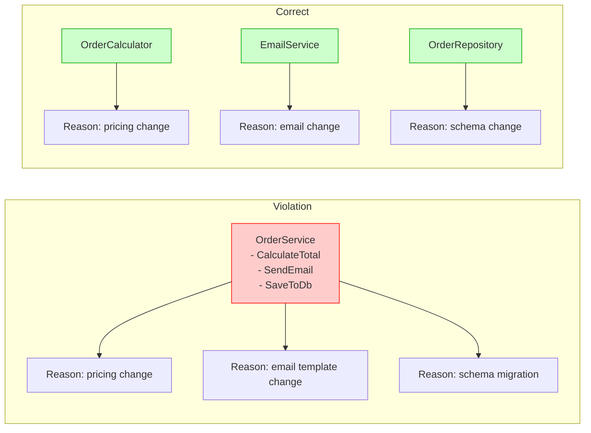
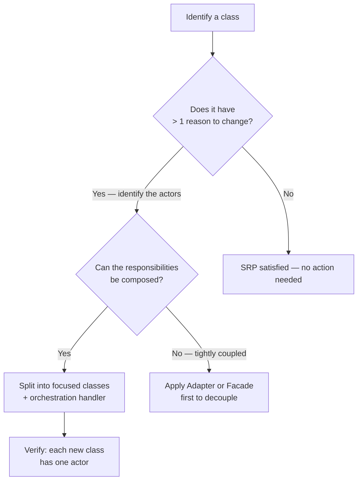

> [!success] Mastery Check
> - [ ] **Studied Well**
> - [ ] **Can explain the concept without notes**
> - [ ] **Can answer interview questions confidently**
> - [ ] **Can implement it in a real project**


## Navigation

**Domain:** [[6 — Design Principles & Patterns]] > **Group:** SOLID Principles
**Previous:** None | **Next:** [[6.002 — Open/Closed Principle]]

### Prerequisites
- [[4.034 — The Built-In DI Container Service Registration]] — Understanding DI registration is essential because SRP violations often manifest as classes that require too many dependencies.
- [[6.013 — Functions — Single Level of Abstraction]] — SRP at the class level mirrors SLA at the function level; both enforce focused responsibility.

### Where This Fits
The Single Responsibility Principle is the foundation of maintainable software architecture. It states that a class should have only one reason to change, which directly governs how you decompose business logic into cohesive units. When every class owns exactly one responsibility, the system becomes comprehensible, testable, and resilient to change. In .NET ecosystems, SRP is the rationale behind splitting domain logic from infrastructure concerns — it is why you separate repository interfaces from EF Core `DbContext` usage, and why command handlers in MediatR are single-purpose classes rather than monolithic service classes.

## Core Mental Model

A class should have one and only one reason to change. That reason is always a single actor — a single stakeholder or use case — whose requirements drive modification of that class. If two different actors could demand changes to the same class for different reasons, the class violates SRP.

### Dimensions

| Dimension | SRP-Compliant | SRP-Violated |
|---|---|---|
| **Actor alignment** | One stakeholder per class | Multiple stakeholders coupled |
| **Cohesion** | Methods operate on same data/concern | Methods address unrelated concerns |
| **Dependency count** | Focused, minimal | Numerous, serving different purposes |
| **Test surface** | One behavior per test suite | Tests must set up unrelated concerns |



## Deep Mechanics

### How It Works

SRP is enforced by identifying the actors who drive change and ensuring each class answers to exactly one actor.

**Before — Violation:**
```csharp
// ❌ Violation: OrderProcessor serves three actors
public class OrderProcessor
{
    public decimal CalculateTotal(Order order) { /* accounting wants formula change */ }
    public void SendConfirmation(Order order) { /* marketing wants template change */ }
    public void SaveOrder(Order order) { /* DBA wants schema change */ }
}
```

**After — Correct:**
```csharp
// ✅ Correct: Three classes, one responsibility each
public class OrderCalculator
{
    public decimal CalculateTotal(Order order) { /* only pricing logic */ }
}

public class OrderNotifier
{
    public void SendConfirmation(Order order) { /* only notification logic */ }
}

public class OrderRepository
{
    public void SaveOrder(Order order) { /* only persistence logic */ }
}
```

The refactoring removes coupling between unrelated concerns. A change to the email template no longer risks introducing a bug in total calculation or database writes.

### Why It Matters at Scale

In a codebase with 500+ classes, violating SRP creates a cascading fragility problem. A single "god class" that handles persistence, validation, logging, and business logic means every feature change touches that class. Code reviews become bottlenecked because multiple teams own the same file. Merge conflicts spike. Unit tests become integration tests because you cannot instantiate the class without setting up databases and mail servers. At scale, SRP is the difference between a codebase that is confidently changeable and one where every commit is a gamble.

## Production Code Patterns

### Implementation in C#

```csharp
// Domain model
public sealed record Order(
    Guid Id,
    string CustomerEmail,
    IReadOnlyList<OrderLineItem> LineItems);

public sealed record OrderLineItem(
    string ProductName,
    int Quantity,
    decimal UnitPrice);

// ============================================
// Responsibility 1: Pricing
// ============================================

/// <summary>
/// Calculates order totals including tax and discounts.
/// Owned by the Accounting domain.
/// </summary>
public interface IPricingCalculator
{
    /// <summary>
    /// Computes the final total for the given order.
    /// </summary>
    decimal CalculateTotal(Order order);
}

public sealed class StandardPricingCalculator : IPricingCalculator
{
    private const decimal TaxRate = 0.08m;

    public decimal CalculateTotal(Order order)
    {
        decimal subtotal = order.LineItems.Sum(li => li.Quantity * li.UnitPrice);
        decimal tax = subtotal * TaxRate;
        return subtotal + tax;
    }
}

// ============================================
// Responsibility 2: Notification
// ============================================

/// <summary>
/// Sends order-related notifications to customers.
/// Owned by the Marketing domain.
/// </summary>
public interface INotificationService
{
    Task SendConfirmationAsync(Order order, CancellationToken ct);
}

public sealed class EmailNotificationService : INotificationService
{
    private readonly ISmtpClient _smtpClient;

    public EmailNotificationService(ISmtpClient smtpClient)
    {
        _smtpClient = smtpClient;
    }

    public async Task SendConfirmationAsync(Order order, CancellationToken ct)
    {
        string subject = $"Order {order.Id} Confirmed";
        string body = FormattableString.Invariant($"Your total is {order.LineItems.Sum(li => li.Quantity * li.UnitPrice):C}");
        await _smtpClient.SendAsync(order.CustomerEmail, subject, body, ct);
    }
}

// ============================================
// Responsibility 3: Persistence
// ============================================

/// <summary>
/// Manages order persistence. Owned by the Data Platform team.
/// </summary>
public interface IOrderRepository
{
    Task SaveAsync(Order order, CancellationToken ct);
}

public sealed class SqlOrderRepository : IOrderRepository
{
    private readonly DbContext _context;

    public SqlOrderRepository(DbContext context)
    {
        _context = context;
    }

    public async Task SaveAsync(Order order, CancellationToken ct)
    {
        await _context.Set<Order>().AddAsync(order, ct);
        await _context.SaveChangesAsync(ct);
    }
}

// ============================================
// Orchestration — Composes SRP classes
// ============================================

/// <summary>
/// Orchestrates the order placement workflow.
/// This class coordinates SRP-compliant services without violating SRP itself —
/// its single reason to change is the order placement flow logic.
/// </summary>
public sealed class PlaceOrderHandler
{
    private readonly IPricingCalculator _pricing;
    private readonly INotificationService _notifier;
    private readonly IOrderRepository _repository;

    public PlaceOrderHandler(
        IPricingCalculator pricing,
        INotificationService notifier,
        IOrderRepository repository)
    {
        _pricing = pricing;
        _notifier = notifier;
        _repository = repository;
    }

    public async Task<decimal> HandleAsync(Order order, CancellationToken ct)
    {
        decimal total = _pricing.CalculateTotal(order);
        await _repository.SaveAsync(order, ct);
        await _notifier.SendConfirmationAsync(order, ct);
        return total;
    }
}
```

### ASP.NET Core / .NET Ecosystem Integration

```csharp
// Program.cs — SRP-compliant registration
var builder = WebApplication.CreateBuilder(args);

// Each interface maps to a single responsibility
builder.Services.AddSingleton<IPricingCalculator, StandardPricingCalculator>();
builder.Services.AddScoped<IOrderRepository, SqlOrderRepository>();
builder.Services.AddTransient<INotificationService, EmailNotificationService>();
builder.Services.AddTransient<PlaceOrderHandler>();

// MediatR — SRP enforced per handler
builder.Services.AddMediatR(cfg =>
{
    cfg.RegisterServicesFromAssemblyContaining<PlaceOrderHandler>();
});

var app = builder.Build();

app.MapPost("/orders", async (
    Order order,
    PlaceOrderHandler handler,
    CancellationToken ct) =>
{
    decimal total = await handler.HandleAsync(order, ct);
    return Results.Ok(new { OrderId = order.Id, Total = total });
});

app.Run();
```

In ASP.NET Core, the DI container itself encourages SRP: constructor injection makes excessive dependencies visible immediately. If a controller's constructor has more than 3-4 parameters, it signals SRP violation — the controller is doing too much. The framework's `IMiddleware` abstraction and `IExceptionHandler` also embody SRP by isolating cross-cutting concerns into single-purpose classes.

## Gotchas & Anti-Patterns

### Primitive Obsession Masquerading as SRP

**Wrong:** Over-fragmenting data into primitive parameters to avoid "creating too many types."
```csharp
// ❌ Wrong: Scattered primitives that travel together
public void ProcessOrder(
    Guid orderId,
    string customerName,
    string customerEmail,
    string shippingStreet,
    string shippingCity,
    string shippingZip,
    decimal subtotal,
    decimal tax,
    decimal total)
{
    // ...
}
```

**Right:** Group related data into cohesive records. Each record has one responsibility.
```csharp
// ✅ Right: Cohesive value objects
public sealed record CustomerInfo(string Name, string Email);
public sealed record ShippingAddress(string Street, string City, string Zip);
public sealed record OrderTotal(decimal Subtotal, decimal Tax, decimal GrandTotal);

public void ProcessOrder(
    Guid orderId,
    CustomerInfo customer,
    ShippingAddress address,
    OrderTotal total)
{
    // ...
}
```

**Consequence:** Primitive-ridden signatures lead to parameter confusion, ordering bugs, and resistance to change. Adding a field requires modifying every call site.

### God Class

**Wrong:** A single class that handles business logic, validation, persistence, logging, and email.
```csharp
// ❌ Wrong: God class with five responsibilities
public class OrderService
{
    private readonly DbContext _db;
    private readonly ILogger _logger;
    private readonly SmtpClient _smtp;

    public void PlaceOrder(Order order)
    {
        _logger.LogInformation("Placing order");
        ValidateOrder(order);        // validation
        CalculateTotal(order);       // pricing
        _db.Orders.Add(order);       // persistence
        _smtp.Send("...");           // notification
        _logger.LogInformation("Done");
    }
}
```

**Right:** Decompose into focused services orchestrated by a handler.
```csharp
// ✅ Right: Each class has one reason to change
public sealed record PlaceOrderCommand(Order Order);

public sealed class PlaceOrderCommandHandler : IRequestHandler<PlaceOrderCommand, decimal>
{
    private readonly IValidator<Order> _validator;
    private readonly IPricingCalculator _pricing;
    private readonly IOrderRepository _repository;
    private readonly INotificationService _notifier;
    private readonly IAuditLogger _audit;

    public async Task<decimal> Handle(PlaceOrderCommand command, CancellationToken ct)
    {
        Order order = command.Order;
        await _validator.ValidateAsync(order, ct);
        decimal total = _pricing.CalculateTotal(order);
        await _repository.SaveAsync(order, ct);
        await _notifier.SendConfirmationAsync(order, ct);
        _audit.Log("OrderPlaced", new { order.Id, total });
        return total;
    }
}
```

**Consequence:** God classes are untestable without full integration setup. Every change risks breaking unrelated features. Code reviews become superficial because no one can hold the entire class in their head.

### Splitting Until Nothing Is Left

**Wrong:** Applying SRP so aggressively that every tiny method becomes its own class, destroying readability.
```csharp
// ❌ Wrong: Over-split nonsense
public sealed class OrderSubtotalCalculator
{
    public decimal Calculate(OrderLineItem item) => item.Quantity * item.UnitPrice;
}
public sealed class TaxCalculator
{
    public decimal Calculate(decimal subtotal) => subtotal * 0.08m;
}
public sealed class GrandTotalCalculator
{
    public decimal Calculate(decimal subtotal, decimal tax) => subtotal + tax;
}
```

**Right:** Keep related calculations at the same level of abstraction within the same class until a real actor demands separation.
```csharp
// ✅ Right: Cohesive pricing logic
public sealed class PricingCalculator : IPricingCalculator
{
    public decimal CalculateTotal(Order order)
    {
        decimal subtotal = order.LineItems.Sum(li => li.Quantity * li.UnitPrice);
        return subtotal + subtotal * TaxRate;
    }
}
```

**Consequence:** Over-splitting causes "class sprawl" with hundreds of single-method classes. Navigation becomes painful, and the cohesion that makes code readable is destroyed.

### Leaking Infrastructure into Domain

**Wrong:** Mixing EF Core / serialization concerns with business logic in the same class.
```csharp
// ❌ Wrong: Domain entity coupled to persistence
public class Order
{
    public Guid Id { get; set; }
    public string CustomerEmail { get; set; } = string.Empty;
    public decimal Total { get; set; }

    // EF Core navigation property — persistence concern polluting domain
    public virtual ICollection<OrderLineItem> LineItems { get; set; } = new List<OrderLineItem>();

    public decimal CalculateDiscount()
    {
        return Total > 100 ? Total * 0.1m : 0;
    }
}
```

**Right:** Keep domain models clean; use separate persistence models or owned types.
```csharp
// ✅ Right: Domain model knows nothing about persistence
public sealed record Order(
    Guid Id,
    string CustomerEmail,
    IReadOnlyList<OrderLineItem> LineItems)
{
    public decimal CalculateDiscount() =>
        LineItems.Sum(li => li.Quantity * li.UnitPrice) > 100 ? 0.1m : 0m;
}
```

**Consequence:** When domain logic depends on EF Core lazy loading or proxy creation, you cannot unit-test business rules without a database. Schema migrations cascade into domain changes.

## Performance Implications

### Maintenance Cost Model

| Scenario | Defect Probability | Change Impact | Onboarding Cost |
|---|---|---|---|
| SRP followed (focused classes) | Low | Isolated to one class | Low — single responsibility to learn |
| SRP violated (god class) | High — changes to one concern break others | Cascading — ripple through file | High — must understand entire class |
| SRP followed (clean domain) | Low | Can change persistence without touching domain | Low — bounded context per file |
| SRP violated (mixed concerns) | Very high | One line change can introduce email/spam bug | Very high — no clear ownership |

## Interview Arsenal

### Question Bank

1. (Foundational) What is the Single Responsibility Principle and who defined it?
2. (Foundational) How do you identify that a class violates SRP during a code review?
3. (Intermediate) How does SRP relate to the Interface Segregation Principle?
4. (Intermediate) Can a class with one method still violate SRP? Explain.
5. (Advanced) How does SRP influence the decision to use MediatR or raw DI?
6. (Advanced) Does SRP apply to microservices, or only to class-level design?
7. (Trick) Is `public static void Main()` a violation of SRP?
8. (Senior) How do you refactor a legacy god class with 5000+ lines that has no tests?

### Spoken Answers

**Q1 — What is SRP?**

> **Average answer:** A class should do only one thing. If it does more than one thing, split it.

> **Great answer:** SRP, defined by Robert C. Martin, states that a class should have one and only one reason to change, and that reason is always a single actor — a stakeholder or use case. It is not about "doing one thing" in a granular sense but about aligning change responsibility. For example, `OrderService` that calculates totals (accounting actor), sends emails (marketing actor), and saves to DB (DBA actor) violates SRP because three different stakeholders would request changes to the same class. The fix is to decompose into `OrderCalculator`, `NotificationService`, and `OrderRepository`, each owned by the team that owns that concern.

**Q3 — How does SRP relate to ISP?**

> **Average answer:** Both are SOLID principles. ISP is about interfaces, SRP is about classes. They are similar.

> **Great answer:** SRP governs class responsibility while ISP governs interface contracts. They operate at different levels but reinforce each other: a class that follows SRP naturally suggests segregated interfaces, and role interfaces from ISP help enforce SRP by preventing clients from depending on methods they do not use. In practice, when you extract an `IPricingCalculator` interface for a pricing concern, you are simultaneously applying SRP (the implementation has one reason to change) and ISP (the consumer depends only on pricing methods, not on unrelated notification or persistence methods).

### Trick Question

**"A `Logger` class logs to file, console, and database — is that an SRP violation?"**

Why it is a trap: It sounds like three responsibilities, but logging is a single concern (observability); the output destinations are implementation details, not separate actors. The actor is the operations team who owns logging configuration.

Correct answer: No, this is not necessarily an SRP violation. The single responsibility is "recording diagnostic information," and the output targets are variations of that responsibility. True violation would be if `Logger` also performed business logic like calculating order totals. However, be aware of the Single Level of Abstraction principle at the function level — logging setup and business calculation should not mix.

### Comparison Table

| Aspect | Single Responsibility Principle (SRP) | Interface Segregation Principle (ISP) |
|---|---|---|
| Intent | One reason to change per class | One role per interface; no client forced to depend on methods it does not use |
| Scope | Class / module level | Interface / contract level |
| When to use | When a class has multiple actors driving change | When an interface has methods that are irrelevant to some consumers |
| .NET example | Split `OrderService` into `PricingCalculator`, `OrderRepository`, `EmailNotifier` | Split `IWorker` into `IWork` and `IEat` instead of forcing both on `Robot` |
| Key difference | SRP is about *cohesion within a module*; ISP is about *segregation of contracts* | SRP is the "why" of splitting; ISP is the "how" of contract design |

## Decision Framework

### When to Apply SRP



### Application Checklist

- [ ] I have identified exactly one actor (stakeholder/use case) per class
- [ ] Each class has a cohesive set of methods that operate on the same data/concern
- [ ] Constructor dependencies serve a single purpose (no mixed infrastructure + domain)
- [ ] I can describe each class's responsibility in one sentence without using "and"
- [ ] The orchestrator/composer class only coordinates, not implements, behaviors
- [ ] Moving a method to a different class would not leave orphans behind
- [ ] I can unit-test each class without setting up unrelated infrastructure

### Tradeoff Summary

| What You Gain | What You Give Up |
|---|---|
| Isolated change impact — one actor's change does not affect another | Increased number of files and types in the project |
| Testable classes with minimal setup | Orchestration overhead — handlers must compose services |
| Clear ownership per team/domain | Navigational cost — more files to jump between |
| Parallel development — teams work on different classes | Potential over-engineering if applied speculatively to stable code |
| Merge conflict reduction on hot files | Initial refactoring effort for legacy code |

## Self-Check

### Conceptual Questions

1. What is the exact definition of SRP according to Robert C. Martin?
2. What is the difference between "doing one thing" and "having one reason to change"?
3. How many actors should a single class serve?
4. How does constructor injection in ASP.NET Core help detect SRP violations?
5. Why is a class with 20 private methods that all relate to tax calculation NOT an SRP violation?
6. How does SRP differ from Interface Segregation Principle (ISP)?
7. Can a static utility class violate SRP? Under what conditions?
8. What refactoring technique is most commonly used to fix SRP violations?
9. Why does SRP become more critical in a codebase with 50+ engineers?
10. How does SRP influence microservice boundaries?

<details><summary>Answers</summary>
1. A class should have one and only one reason to change, and that reason is a single actor.
2. "Doing one thing" is a granular, often ambiguous metric. "One reason to change" ties responsibility to a specific stakeholder or use case, making it concrete and verifiable.
3. Exactly one.
4. When a constructor requires 5+ parameters, it suggests the class depends on too many unrelated concerns, indicating SRP violation.
5. Because all methods serve the same actor (accounting/pricing). Cohesion is high even though there are many methods.
6. SRP governs class responsibility (one reason to change). ISP governs interface granularity (no client depends on methods it does not use).
7. Yes, if it groups unrelated concerns (e.g., `FileHelper` with both encryption and compression methods). Each concern should be its own class.
8. Extract Class — identifying a responsibility and moving it to a new class, then composing via dependency injection.
9. Without SRP, multiple teams own the same files, causing merge conflicts, review bottlenecks, and cascading defects.
10. Each microservice should have one domain responsibility. A microservice that handles payments AND notifications AND inventory violates SRP at the service boundary.
</details>

### Code Puzzles

**Puzzle 1 — Identify the violation**

```csharp
public class InvoiceGenerator
{
    public void GenerateInvoice(Order order)
    {
        var invoice = CreateInvoice(order);
        SaveToPdf(invoice);
        var data = Serialize(invoice);
        Db.Save(data);
        Email.Send(order.CustomerEmail, invoice);
    }
}
```

<details><summary>Answer</summary>
Violates SRP: `InvoiceGenerator` handles PDF generation, serialization, database persistence, and email. Each is a different concern (reporting, data access, notification). Split into `InvoiceRenderer`, `InvoiceRepository`, `InvoiceEmailService`. The original class's orchestration can become a handler.
</details>

**Puzzle 2 — Complete the pattern**

Complete the refactoring by extracting the persistence and notification responsibilities from `UserRegistrationService`:

```csharp
// Current violation
public class UserRegistrationService
{
    private readonly DbContext _db;
    private readonly SmtpClient _smtp;

    public async Task Register(User user)
    {
        // validation
        if (string.IsNullOrEmpty(user.Email)) throw new ArgumentException();
        // persistence
        _db.Users.Add(user);
        await _db.SaveChangesAsync();
        // notification
        await _smtp.SendMailAsync(user.Email, "Welcome!");
    }
}
```

<details><summary>Answer</summary>
```csharp
public sealed record RegisterUserCommand(User User);

public sealed class RegisterUserHandler
{
    private readonly IUserRepository _repository;
    private readonly IWelcomeSender _welcome;

    public RegisterUserHandler(IUserRepository repository, IWelcomeSender welcome)
    {
        _repository = repository;
        _welcome = welcome;
    }

    public async Task Handle(RegisterUserCommand cmd)
    {
        User user = cmd.User;
        if (string.IsNullOrEmpty(user.Email)) throw new ArgumentException();
        await _repository.SaveAsync(user);
        await _welcome.SendAsync(user.Email);
    }
}

public interface IUserRepository
{
    Task SaveAsync(User user);
}

public interface IWelcomeSender
{
    Task SendAsync(string email);
}
```
</details>

**Puzzle 3 — Choose the right approach**

A `ReportBuilder` class currently: (1) queries data from SQL, (2) transforms it into a report model, (3) renders HTML, and (4) emails the report. Your PM says: "The CEO wants a new chart format, and Marketing wants the email subject changed." Should you refactor, and how?

<details><summary>Answer</summary>
Yes — two different actors (CEO and Marketing) demand changes to the same class. Extract: `ReportDataProvider` (query), `ReportTransformer` (model mapping), `HtmlReportRenderer` (HTML), `ReportEmailService` (notification). Each has one reason to change.
</details>

**Puzzle 4 — Spot the anti-pattern**

```csharp
public class StringUtils
{
    public static string Capitalize(string s) => s.Length > 0 ? char.ToUpper(s[0]) + s[1..] : s;
    public static string Compress(string s) => /* GZip logic */;
    public static string Encrypt(string s) => /* AES logic */;
    public static string Hash(string s) => /* SHA256 logic */;
    public static string ToBase64(string s) => Convert.ToBase64String(Encoding.UTF8.GetBytes(s));
}
```

<details><summary>Answer</summary>
This is a **utility god class** anti-pattern. String transformation, compression, encryption, and hashing are completely unrelated concerns. While each method is small, the class violates SRP because different actors drive changes to each concern (security team owns encryption, performance team owns compression). Split into `StringCasing`, `StringCompressor`, `StringEncryptor`, `StringHasher`.
</details>

**Puzzle 5 — Refactor to apply SRP**

```csharp
public class PaymentController : ControllerBase
{
    [HttpPost]
    public async Task<IActionResult> ProcessPayment([FromBody] PaymentRequest request)
    {
        // Validate
        if (request.Amount <= 0) return BadRequest();
        if (string.IsNullOrEmpty(request.CardNumber)) return BadRequest();

        // Process payment via Stripe
        var charge = await Stripe.Charge.CreateAsync(new StripeChargeRequest
        {
            Amount = (int)(request.Amount * 100),
            Currency = "usd",
            Source = request.CardNumber
        });

        // Save to DB
        using var db = new AppDbContext();
        db.Payments.Add(new Payment { Id = charge.Id, Amount = request.Amount });
        await db.SaveChangesAsync();

        // Send receipt
        using var smtp = new SmtpClient("smtp.example.com");
        await smtp.SendMailAsync(request.Email, "Receipt", $"Paid {request.Amount}");

        // Log
        Log.Information("Payment processed: {Id}", charge.Id);

        return Ok(new { charge.Id });
    }
}
```

<details><summary>Answer</summary>
```csharp
[ApiController]
public class PaymentController : ControllerBase
{
    private readonly PaymentHandler _handler;

    public PaymentController(PaymentHandler handler) => _handler = handler;

    [HttpPost]
    public async Task<IActionResult> ProcessPayment([FromBody] PaymentRequest request)
    {
        Result result = await _handler.HandleAsync(request);
        return result.IsSuccess ? Ok(result.Value) : BadRequest(result.Error);
    }
}

public sealed record PaymentRequest(decimal Amount, string CardNumber, string Email);

public sealed class PaymentHandler
{
    private readonly IPaymentGateway _gateway;
    private readonly IPaymentRepository _repository;
    private readonly IReceiptSender _receipt;
    private readonly IAuditLogger _audit;

    public PaymentHandler(
        IPaymentGateway gateway,
        IPaymentRepository repository,
        IReceiptSender receipt,
        IAuditLogger audit)
    {
        _gateway = gateway;
        _repository = repository;
        _receipt = receipt;
        _audit = audit;
    }

    public async Task<Result> HandleAsync(PaymentRequest request)
    {
        if (request.Amount <= 0) return Result.Failure("Invalid amount");
        if (string.IsNullOrEmpty(request.CardNumber)) return Result.Failure("Missing card");

        ChargeResponse charge = await _gateway.ChargeAsync(request.Amount, request.CardNumber);
        await _repository.SaveAsync(new PaymentRecord(charge.Id, request.Amount));
        await _receipt.SendAsync(request.Email, request.Amount);
        _audit.Log("PaymentProcessed", charge.Id);

        return Result.Success(new { charge.Id });
    }
}
```
</details>
