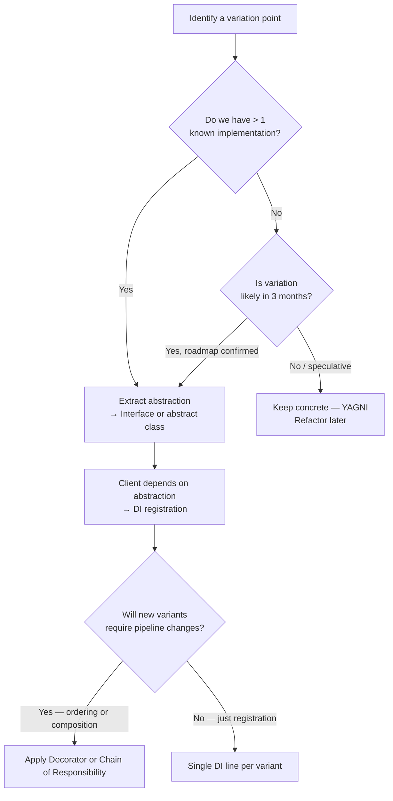

> [!success] Mastery Check
> - [ ] **Studied Well**
> - [ ] **Can explain the concept without notes**
> - [ ] **Can answer interview questions confidently**
> - [ ] **Can implement it in a real project**


## Navigation

**Domain:** [[6 — Design Principles & Patterns]] > **Group:** SOLID Principles
**Previous:** [[6.001 — Single Responsibility Principle]] | **Next:** [[6.003 — Liskov Substitution Principle]]

### Prerequisites
- [[6.001 — Single Responsibility Principle]] — OCP builds on SRP: when each class has one responsibility, you can extend it without modifying existing behavior.
- [[4.034 — The Built-In DI Container Service Registration]] — DI enables OCP by allowing polymorphic substitution of implementations without touching consumers.
- [[6.024 — Decorator Pattern]] — The canonical OCP pattern that layers behavior without modifying the original class.

### Where This Fits
The Open/Closed Principle (OCP) states that software entities should be open for extension but closed for modification. It is the primary driver for abstraction in object-oriented design — you design a stable core that accommodates new behavior through plugins, strategies, or decorators without rewriting existing code. In the .NET ecosystem, OCP is embodied by `IEnumerable<T>` configuration patterns, ASP.NET Core middleware pipelines, the `IOptions<T>` pattern, and the entire plugin/hosting model. Violations manifest as endless `switch` statements, `if/else if` chains, and "case X: type == ..." conditionals that grow with every new feature.

## Core Mental Model

Design modules so that you can add new behavior by writing new code, not by changing existing code. The module has a fixed abstraction (interface or abstract class) that is *closed* for modification, while new implementations of that abstraction *extend* the system.

### Classification

```mermaid
flowchart LR
    subgraph Violation — Closed for Extension
        A[OrderProcessor] --> B{OrderType}
        B -->|Standard| C[ProcessStandard]
        B -->|Express| D[ProcessExpress]
        B -->|International| E[ProcessInternational]
        A -- "Add new type? → Modify OrderProcessor" --> F[❌ Modify existing code]
    end

    subgraph Correct — Open for Extension
        G[<i>IOrderProcessor</i>] --> H[StandardProcessor]
        G --> I[ExpressProcessor]
        G --> J[InternationalProcessor]
        G -- "Add new type? → New class" --> K[✅ New code, no modification]
    end

    style F fill:#ffcccc,stroke:#ff0000
    style K fill:#ccffcc,stroke:#00aa00
```

## Deep Mechanics

### How It Works

OCP is realized through abstraction and polymorphism. The client depends on an abstraction (interface or abstract class), and concrete implementations are injected or resolved at runtime. Adding a new behavior requires:

1. Defining a new implementation of the abstraction
2. Registering it with the DI container (or configuration)
3. No changes to the client or existing implementations

**Before — Violation (Modification-based):**
```csharp
// ❌ Violation: Adding a new payment method requires changing this class
public class PaymentProcessor
{
    public string Process(string method, decimal amount)
    {
        return method switch
        {
            "credit_card" => ChargeCreditCard(amount),
            "paypal" => ChargePayPal(amount),
            _ => throw new NotSupportedException()
        };
    }
}
```

**After — Correct (Extension-based):**
```csharp
// ✅ Correct: Add new payment methods without touching existing code

/// <summary>Closed for modification.</summary>
public interface IPaymentMethod
{
    string Name { get; }
    Task<PaymentResult> ChargeAsync(decimal amount, CancellationToken ct);
}

public sealed record PaymentResult(bool IsSuccess, string TransactionId);

/// <summary>Open for extension — new class, no modification.</summary>
public sealed class CreditCardPayment : IPaymentMethod
{
    public string Name => "credit_card";
    public async Task<PaymentResult> ChargeAsync(decimal amount, CancellationToken ct) { /* ... */ }
}

public sealed class PayPalPayment : IPaymentMethod
{
    public string Name => "paypal";
    public async Task<PaymentResult> ChargeAsync(decimal amount, CancellationToken ct) { /* ... */ }
}

/// <summary>Client is closed — uses abstraction.</summary>
public sealed class PaymentOrchestrator
{
    private readonly IEnumerable<IPaymentMethod> _methods;

    public PaymentOrchestrator(IEnumerable<IPaymentMethod> methods) => _methods = methods;

    public async Task<PaymentResult> ProcessAsync(string methodName, decimal amount, CancellationToken ct)
    {
        IPaymentMethod method = _methods.First(m => m.Name == methodName);
        return await method.ChargeAsync(amount, ct);
    }
}
```

### .NET Runtime Behavior

At the CLR level, OCP is enabled by virtual method dispatch and interface dispatch (`.callvirt` IL instruction). When `PaymentOrchestrator` calls `IPaymentMethod.ChargeAsync`, the runtime resolves the concrete implementation's method table entry at runtime. The JIT may devirtualize sealed or non-virtual calls for performance, so marking implementations `sealed` can improve both OCP clarity and runtime speed. The DI container handles lifetime and resolution — adding a new `IPaymentMethod` is a single `services.AddTransient<IPaymentMethod, BitcoinPayment>()` registration line.

## Production Code Patterns

### Implementation in C#

```csharp
// ============================================
// Abstraction — Closed for modification
// ============================================

/// <summary>
/// Defines a discount calculation strategy.
/// New discount types implement this interface without changing consumers.
/// </summary>
public interface IDiscountStrategy
{
    /// <summary>Whether this strategy applies to the given order.</summary>
    bool IsApplicable(Order order);

    /// <summary>Applies the discount and returns the adjusted total.</summary>
    decimal Apply(Order order, decimal currentTotal);
}

// ============================================
// Extensions — Open for extension
// ============================================

public sealed class NoDiscount : IDiscountStrategy
{
    public bool IsApplicable(Order order) => true;
    public decimal Apply(Order order, decimal currentTotal) => currentTotal;
}

public sealed class PercentageDiscount : IDiscountStrategy
{
    private readonly decimal _percent;

    public PercentageDiscount(decimal percent) => _percent = percent;

    public bool IsApplicable(Order order) =>
        order.LineItems.Sum(li => li.Quantity * li.UnitPrice) >= 100;

    public decimal Apply(Order order, decimal currentTotal) =>
        currentTotal * (1 - _percent / 100);
}

public sealed class LoyaltyDiscount : IDiscountStrategy
{
    private readonly ILoyaltyRepository _loyalty;

    public LoyaltyDiscount(ILoyaltyRepository loyalty) => _loyalty = loyalty;

    public bool IsApplicable(Order order) =>
        _loyalty.GetTier(order.CustomerId) == LoyaltyTier.Gold;

    public decimal Apply(Order order, decimal currentTotal)
    {
        const decimal goldDiscount = 0.15m;
        return currentTotal * (1 - goldDiscount);
    }
}

// ============================================
// Client — Closed for modification
// ============================================

/// <summary>
/// Applies all applicable discount strategies to an order.
/// Never needs modification when a new discount type is added.
/// </summary>
public sealed class DiscountEngine
{
    private readonly IEnumerable<IDiscountStrategy> _strategies;

    public DiscountEngine(IEnumerable<IDiscountStrategy> strategies) => _strategies = strategies;

    public decimal CalculateFinalTotal(Order order)
    {
        decimal total = order.LineItems.Sum(li => li.Quantity * li.UnitPrice);

        foreach (IDiscountStrategy strategy in _strategies)
        {
            if (strategy.IsApplicable(order))
            {
                total = strategy.Apply(order, total);
            }
        }

        return total;
    }
}
```

### ASP.NET Core / .NET Ecosystem Integration

```csharp
// Program.cs — Adding a new discount is a single line; no existing code changes
var builder = WebApplication.CreateBuilder(args);

builder.Services.AddSingleton<IDiscountStrategy, NoDiscount>();
builder.Services.AddSingleton<IDiscountStrategy, PercentageDiscount>(sp =>
    new PercentageDiscount(10));
builder.Services.AddSingleton<IDiscountStrategy, LoyaltyDiscount>();
builder.Services.AddSingleton<DiscountEngine>();

// ASP.NET Core middleware — classic OCP example
// Adding a new middleware is a new class; the pipeline is closed
public sealed class RequestTimingMiddleware
{
    private readonly RequestDelegate _next;
    private readonly ILogger _logger;

    public RequestTimingMiddleware(RequestDelegate next, ILogger<RequestTimingMiddleware> logger)
    {
        _next = next;
        _logger = logger;
    }

    public async Task InvokeAsync(HttpContext context)
    {
        var sw = Stopwatch.StartNew();
        await _next(context);
        sw.Stop();
        _logger.LogInformation("{Method} {Path} took {Elapsed}ms",
            context.Request.Method, context.Request.Path, sw.ElapsedMilliseconds);
    }
}

// Extending the pipeline — no modification to existing middleware
app.UseMiddleware<RequestTimingMiddleware>();
app.UseAuthentication();
app.UseAuthorization();
app.MapControllers();

// EF Core — IEntityTypeConfiguration<T> follows OCP
// Adding a new entity configuration? New class, no changes to DbContext model creation
public sealed class OrderConfiguration : IEntityTypeConfiguration<Order>
{
    public void Configure(EntityTypeBuilder<Order> builder)
    {
        builder.ToTable("Orders");
        builder.HasKey(o => o.Id);
        builder.Property(o => o.CustomerEmail).HasMaxLength(256);
    }
}
// In OnModelCreating: builder.ApplyConfigurationsFromAssembly(typeof(OrderConfiguration).Assembly);
```

In the .NET ecosystem, OCP appears throughout the framework:
- **`IOutputFormatter` / `IInputFormatter`** — add serialization formats without touching MVC
- **`IHealthCheck`** — add health checks without modifying the health endpoint
- **`IHostedService`** — add background services without modifying the host
- **`IConfigureOptions<TOptions>`** — extend configuration without modifying options classes
- **`IExceptionHandler`** (ASP.NET Core 8+) — add exception handling strategies without touching middleware

## Gotchas & Anti-Patterns

### Switch/If Chain on Type

**Wrong:** A `switch` statement that dispatches based on a discriminator string or enum.
```csharp
// ❌ Wrong: Every new method requires modifying this method
public string Export(Data data, string format)
{
    return format switch
    {
        "csv" => ExportCsv(data),
        "json" => ExportJson(data),
        "xml" => ExportXml(data),
        _ => throw new NotSupportedException()
    };
}
```

**Right:** Strategy pattern — each format is a class implementing `IExportStrategy`.
```csharp
// ✅ Right: New format = new class, no switch modification
public interface IExportStrategy { string Export(Data data); }
public sealed class CsvExport : IExportStrategy { public string Export(Data data) { /* ... */ } }
public sealed class JsonExport : IExportStrategy { public string Export(Data data) { /* ... */ } }
```

**Consequence:** Every new feature requires modifying and retesting an existing class. The switch grows unbounded, making the method harder to read and more likely to have merge conflicts.

### Abstract Class with Default Behavior That Requires Modification

**Wrong:** Using an abstract class with a "default" implementation that subclasses must override, but the default has to change.
```csharp
// ❌ Wrong: Base class forces override but default behavior leaks
public abstract class ReportGenerator
{
    public virtual string GenerateHeader() => "<header>Default</header>";
    public abstract string GenerateBody();
}

// Adding a new report requires modifying the base class to add a footer?
```

**Right:** Favor interfaces or sealed abstract members. Use composition over inheritance.
```csharp
// ✅ Right: Interface + decorators or strategy for optional parts
public interface IReportSection { string Render(); }
```

**Consequence:** Fragile base class problem — modifying the base class can break all derived classes.

### Premature OCP Abstraction

**Wrong:** Building abstractions for every variation "just in case," when only one implementation exists.
```csharp
// ❌ Wrong: Speculative abstraction with one implementation
public interface IStringReverser { string Reverse(string s); }
public sealed class StringReverser : IStringReverser
{
    public string Reverse(string s) => new(s.Reverse().ToArray());
}
```

**Right:** YAGNI — write concrete code until the second variation appears, then extract the interface.
```csharp
// ✅ Right: Concrete until duplicated
public static class StringExtensions
{
    public static string Reverse(this string s) => new(s.Reverse().ToArray());
}
```

**Consequence:** Unnecessary interfaces increase cognitive load, navigation cost, and maintenance surface area. Every abstraction has a cost.

### Plugin Without Versioning Contract

**Wrong:** Exposing an extension point without considering backward compatibility.
```csharp
// ❌ Wrong: Changing this interface breaks ALL implementations
public interface IPlugin
{
    Task ExecuteAsync(Context ctx);
}

// Adding a new parameter? Must change the interface → breaks every plugin
```

**Right:** Use the Options pattern or context objects to allow evolution.
```csharp
// ✅ Right: Context object allows adding properties without breaking contract
public sealed record PluginContext(
    HttpRequest Request,
    IServiceProvider Services,
    CancellationToken CancellationToken);

public interface IPlugin
{
    Task ExecuteAsync(PluginContext ctx);
}

// Adding a property to PluginContext is backward compatible
```

**Consequence:** Breaking changes to extension interfaces force simultaneous updates across all implementations, defeating the purpose of "closed for modification."

## Performance Implications

### Maintenance Cost Model

| Scenario | Defect Probability | Change Impact | Onboarding Cost |
|---|---|---|---|
| OCP followed (strategy pattern) | Low — new classes are isolated | Isolated — new class only | Low — one strategy per class |
| OCP violated (switch monster) | High — modifying switch affects all cases | Cascading — one case fix breaks another | High — must trace all switch paths |
| Preemptive OCP (speculative) | Low defect, high overhead | Accidental complexity | Medium — many interfaces to navigate |
| Plugin with versioned contract | Very low | Backward-compatible additions | Medium — versioning rules needed |

## Interview Arsenal

### Question Bank

1. (Foundational) What does "open for extension, closed for modification" mean in practice?
2. (Foundational) What is the primary mechanism for achieving OCP in C#?
3. (Intermediate) How does the Strategy pattern relate to OCP?
4. (Intermediate) Can OCP be violated even when using interfaces? Explain with an example.
5. (Advanced) How does OCP interact with the Decorator pattern in .NET?
6. (Advanced) Describe how ASP.NET Core middleware pipeline achieves OCP.
7. (Trick) Is inheritance always a violation of OCP because the subclass "modifies" behavior of the base?
8. (Senior) How do you design an extensible OCP-compliant system when the extension points are not known in advance?

### Spoken Answers

**Q1 — What does OCP mean in practice?**

> **Average answer:** You should be able to add new features without changing existing code. Use interfaces.

> **Great answer:** OCP means designing modules where the core logic is expressed in terms of abstractions, and new behaviors are introduced by supplying new implementations of those abstractions. In .NET, this is realized through interface-based polymorphism, strategy pattern, and DI container registration. For example, ASP.NET Core's `IHealthCheck` interface: to add a new health check, you write a class implementing `IHealthCheck` and register it. You never modify the health check endpoint or the existing checks. The key insight is identifying the *axis of variation* — what is likely to change — and abstracting behind that seam.

**Q3 — How does Strategy pattern relate to OCP?**

> **Average answer:** Strategy pattern lets you swap algorithms. It follows OCP because you can add new strategies.

> **Great answer:** The Strategy pattern is the canonical OCP implementation. The strategy interface is the *closed* part — clients depend on it and never change. Concrete strategies are the *open* part — you add new algorithms by writing new strategy classes. In our DiscountEngine example, `IDiscountStrategy` is closed, and adding `SeasonalDiscount` or `BulkDiscount` requires only a new class and a DI registration. The engine never needs modification. The pattern also aligns with SRP: each strategy has one responsibility.

### Trick Question

**"If I add a virtual method to a base class, is that a violation of OCP because subclasses might need to change?"**

Why it is a trap: It conflates the *producer* modifying the base (class itself changes) with *consumers* extending (subclasses).

Correct answer: Adding a virtual method to a base class is not an OCP violation — the base class is being *modified* (extended), and the class itself is not closed for modification in that direction. OCP applies to the *consumer* perspective: existing clients that depend on the abstraction should not need modification when new behavior is added. If you add a virtual method with a default implementation, existing subclasses still compile and work. OCP violation occurs when you change an interface that forces all implementations to change, or when you modify a switch statement that clients depend on.

### Comparison Table

| Aspect | Open/Closed Principle (OCP) | Dependency Inversion Principle (DIP) |
|---|---|---|
| Intent | Extend without modification | Depend on abstractions, not concretions |
| Scope | Module extension boundaries | Dependency direction and ownership |
| When to use | When variation is anticipated along an axis | In all non-trivial systems to decouple layers |
| .NET example | `IHealthCheck` — add checks without modifying pipeline | `IOrderRepository` — domain depends on interface, infrastructure implements |
| Key difference | OCP addresses *how* you add behavior (new code, not modification); DIP addresses *who owns the abstraction* (the client/high-level module) | OCP is a goal; DIP is a mechanism to achieve OCP |

## Decision Framework

### When to Apply OCP



### Application Checklist

- [ ] I have identified the axis of variation (what changes)
- [ ] The abstraction is stable and unlikely to change
- [ ] I have at least two concrete implementations, or a confirmed roadmap for a second
- [ ] All existing implementations are unchanged when adding a new one
- [ ] The abstraction does not expose implementation details (e.g., no `SqlConnection` in interface)
- [ ] No `switch`/`if-else` on type discriminator survives
- [ ] The client compiles and works without modification when a new implementation is added
- [ ] Adding a new implementation requires no changes to tests of existing implementations

### Tradeoff Summary

| What You Gain | What You Give Up |
|---|---|
| New features added without touching existing, tested code | Indirection — consumers must understand abstraction |
| Parallel development — different teams own different implementations | Startup cost to design the right abstraction |
| Runtime polymorphism — behavior selected at runtime | Performance overhead of virtual/interface dispatch (usually negligible) |
| Plug-in / extensibility architecture | If over-applied, speculative abstraction and interface bloat |
| Reduced merge conflicts on stable files | Navigation cost — finding all implementations of an interface |

## Self-Check

### Conceptual Questions

1. What are the two parts of OCP — what does "open" refer to and what does "closed" refer to?
2. What is the relationship between OCP and polymorphism?
3. What is the "axis of variation" and why is it important for OCP?
4. How does the Strategy pattern implement OCP?
5. Why does a switch statement on a type discriminator violate OCP?
6. What is the difference between OCP and DIP?
7. How does YAGNI (You Ain't Gonna Need It) interact with OCP?
8. When is it acceptable to violate OCP?
9. How does ASP.NET Core middleware demonstrate OCP?
10. What is the "fragile base class" problem and how does it relate to OCP?

<details><summary>Answers</summary>
1. Open for extension (new implementations can be added); closed for modification (existing code is not changed).
2. OCP relies on polymorphism — the client invokes behavior through an abstraction, and the concrete type is resolved at runtime.
3. The axis of variation is the dimension along which change is expected (e.g., payment method, export format, notification channel). Identifying it correctly is crucial for designing the right abstraction.
4. Strategy pattern defines a family of algorithms (open for extension) encapsulated behind an interface (closed for modification). New strategies don't change the context.
5. Adding a new case requires modifying the switch statement, which changes existing tested code and risks breaking existing cases.
6. OCP is about extension vs. modification; DIP is about the direction of dependencies and ownership of abstractions.
7. YAGNI warns against speculative abstractions. OCP should be applied when a second implementation exists or is confirmed on the roadmap, not preemptively for imaginary variations.
8. In hot paths where interface dispatch cost is measurable; in trivial one-off code; when refactoring legacy code where the cost of abstraction extraction exceeds the benefit.
9. Middleware components implement `InvokeAsync(HttpContext, RequestDelegate)`. Adding a new middleware is a new class added to the pipeline; no existing middleware is modified.
10. Adding a method to a base class that all subclasses inherit — even with a default — can break subclasses if they override it unexpectedly. The base class is not truly "closed" from the subclass perspective.
</details>

### Code Puzzles

**Puzzle 1 — Identify the violation**

```csharp
public class NotificationSender
{
    public async Task SendAsync(string type, string message)
    {
        if (type == "email")
        {
            using var client = new SmtpClient();
            await client.SendMailAsync("user@example.com", "Alert", message);
        }
        else if (type == "sms")
        {
            using var http = new HttpClient();
            await http.PostAsync("https://sms.provider/api", new StringContent(message));
        }
        else if (type == "push")
        {
            // push notification logic
        }
    }
}
```

<details><summary>Answer</summary>
OCP violation — adding a new notification type (e.g., "slack", "teams") requires modifying `SendAsync`, adding another `else if`. Solution: extract `INotificationChannel` interface with `SendAsync(string message)`, implement per channel, inject `IEnumerable<INotificationChannel>`, select by channel name.
</details>

**Puzzle 2 — Complete the pattern**

Complete the OCP-compliant design for a shipping cost calculator:

```csharp
public class ShippingCalculator
{
    public decimal Calculate(Order order, string provider)
    {
        if (provider == "fedex") return /* FedEx logic */;
        if (provider == "ups") return /* UPS logic */;
        throw new NotSupportedException();
    }
}
```

<details><summary>Answer</summary>
```csharp
public interface IShippingProvider
{
    string Name { get; }
    decimal CalculateCost(Order order);
}

public sealed class FedExShipping : IShippingProvider
{
    public string Name => "fedex";
    public decimal CalculateCost(Order order) { /* FedEx logic */ }
}

public sealed class UpsShipping : IShippingProvider
{
    public string Name => "ups";
    public decimal CalculateCost(Order order) { /* UPS logic */ }
}

// Client — closed
public sealed class ShippingCostEngine
{
    private readonly Dictionary<string, IShippingProvider> _providers;

    public ShippingCostEngine(IEnumerable<IShippingProvider> providers)
    {
        _providers = providers.ToDictionary(p => p.Name);
    }

    public decimal Calculate(Order order, string provider) =>
        _providers[provider].CalculateCost(order);
}
```
</details>

**Puzzle 3 — Choose the right approach**

Your team needs to add support for exporting reports to three new formats (PDF, Excel, Markdown) over the next two quarters. Currently, export is handled by one method with a format parameter. Design the solution.

<details><summary>Answer</summary>
Apply OCP with Strategy pattern. Create `IReportExporter { string Export(Report report); }`. Implement `PdfExporter`, `ExcelExporter`, `MarkdownExporter`. Register with DI. The original method's callers switch to depending on `IEnumerable<IReportExporter>` or a `ReportExportService` that selects the right exporter based on format. Existing `CsvExporter` (if any) remains untouched.
</details>

**Puzzle 4 — Spot the anti-pattern**

```csharp
public interface IDataProcessor
{
    Task ProcessAsync(Stream data);
}

public sealed class CsvProcessor : IDataProcessor
{
    public async Task ProcessAsync(Stream data) { /* CSV parsing */ }
}

public sealed class JsonProcessor : IDataProcessor
{
    public async Task ProcessAsync(Stream data) { /* JSON parsing */ }
}

// Registration
services.AddSingleton<IDataProcessor, CsvProcessor>();
services.AddSingleton<IDataProcessor, JsonProcessor>();
```

<details><summary>Answer</summary>
This is actually **correct OCP** — adding a new format means adding a new `IDataProcessor` implementation and registering it. No existing code changes. However, one potential issue: if the client needs to select a specific processor rather than processing with all, it needs a way to discriminate (e.g., by file extension). That selection mechanism itself should also be OCP-compliant (e.g., a `Dictionary<string, IDataProcessor>` populated from DI).
</details>

**Puzzle 5 — Refactor to apply OCP**

```csharp
public class PricingEngine
{
    public decimal Calculate(Order order, Customer customer)
    {
        decimal basePrice = order.LineItems.Sum(li => li.Quantity * li.UnitPrice);

        // Seasonal discount
        if (DateTime.UtcNow.Month == 12) basePrice *= 0.9m;

        // VIP discount
        if (customer.Tier == CustomerTier.Vip) basePrice *= 0.85m;

        // Bulk discount
        if (order.LineItems.Sum(li => li.Quantity) > 50) basePrice *= 0.95m;

        // Coupon
        if (order.CouponCode == "SAVE20") basePrice *= 0.8m;

        return basePrice;
    }
}
```

<details><summary>Answer</summary>
```csharp
// Closed abstraction
public interface IPricingRule
{
    bool IsApplicable(Order order, Customer customer);
    decimal Apply(Order order, Customer customer, decimal currentPrice);
}

// Extensions — open
public sealed class SeasonalDiscount : IPricingRule
{
    public bool IsApplicable(Order order, Customer customer) => DateTime.UtcNow.Month == 12;
    public decimal Apply(Order order, Customer customer, decimal price) => price * 0.9m;
}

public sealed class VipDiscount : IPricingRule
{
    public bool IsApplicable(Order order, Customer customer) => customer.Tier == CustomerTier.Vip;
    public decimal Apply(Order order, Customer customer, decimal price) => price * 0.85m;
}

public sealed class BulkDiscount : IPricingRule
{
    public bool IsApplicable(Order order, Customer customer) =>
        order.LineItems.Sum(li => li.Quantity) > 50;
    public decimal Apply(Order order, Customer customer, decimal price) => price * 0.95m;
}

public sealed class CouponDiscount : IPricingRule
{
    public bool IsApplicable(Order order, Customer customer) => order.CouponCode == "SAVE20";
    public decimal Apply(Order order, Customer customer, decimal price) => price * 0.8m;
}

// Client — closed
public sealed class PricingEngine
{
    private readonly IEnumerable<IPricingRule> _rules;

    public PricingEngine(IEnumerable<IPricingRule> rules) => _rules = rules;

    public decimal Calculate(Order order, Customer customer)
    {
        decimal price = order.LineItems.Sum(li => li.Quantity * li.UnitPrice);
        foreach (var rule in _rules.Where(r => r.IsApplicable(order, customer)))
        {
            price = rule.Apply(order, customer, price);
        }
        return price;
    }
}
```
</details>
