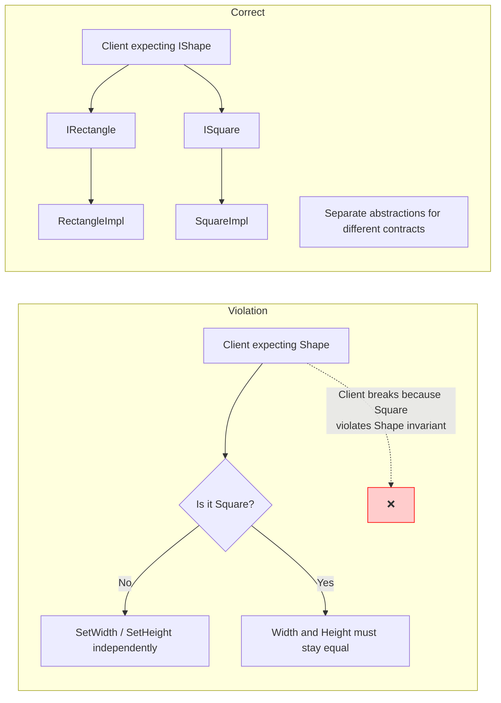
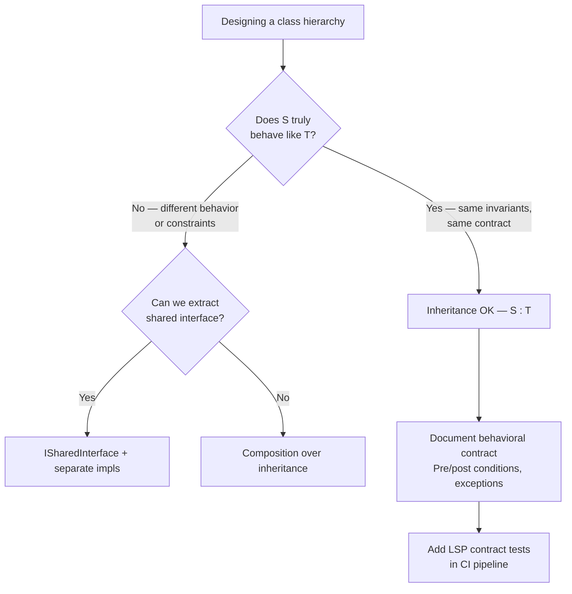

> [!success] Mastery Check
> - [ ] **Studied Well**
> - [ ] **Can explain the concept without notes**
> - [ ] **Can answer interview questions confidently**
> - [ ] **Can implement it in a real project**


## Navigation

**Domain:** [[6 — Design Principles & Patterns]] > **Group:** SOLID Principles
**Previous:** [[6.002 — Open/Closed Principle]] | **Next:** [[6.004 — Interface Segregation Principle]]

### Prerequisites
- [[6.002 — Open/Closed Principle]] — LSP is what makes OCP safe: if subtypes violate contracts, extending via new subtypes breaks the system.
- [[4.036 — EF Core Inheritance Mapping]] — TPH/TPT/TPS mappings demonstrate real LSP consequences at the database level when subtype invariants differ from base.

### Where This Fits
The Liskov Substitution Principle (LSP) defines the behavioral contract of inheritance: if `S` is a subtype of `T`, then objects of type `T` should be replaceable by objects of type `S` without altering the correctness of the program. LSP is not about syntax (the compiler ensures that) — it is about semantics and invariants. Violations cause the "fragile base class" problem, runtime surprises when a subtype throws unexpected exceptions, or silent data corruption when a setter precondition is weakened. In .NET, LSP is the principle violated by `MemoryStream` when disposed (throws `ObjectDisposedException`), by `Rectangle`-`Square` dilemmas, and by `IReadOnlyCollection<T>.Add` — though the last is a design choice to share a single interface contract.

## Core Mental Model

If a function accepts a base type, any derived type must be substitutable without the function knowing the derived type exists. Subtypes can strengthen preconditions or weaken postconditions, but they cannot weaken preconditions or strengthen postconditions.

### Dimensions



### Behavioral Contract Dimensions

| Contract Element | Precondition | Postcondition | Invariant |
|---|---|---|---|
| Base type | Argument must be > 0 | Return value is non-null | State is valid after each method |
| Subtype violation | Accepts negative values (weaker) | Returns null (stronger) | Allows invalid intermediate state |
| LSP-valid change | Same or stronger condition | Same or weaker condition | Same invariant |

## Deep Mechanics

### How It Works

LSP is enforced by ensuring the subtype satisfies the base type's contract — not just its method signature. The contract includes:

1. **Preconditions** cannot be strengthened (subtype cannot reject valid base inputs)
2. **Postconditions** cannot be weakened (subtype cannot produce output outside base guarantees)
3. **Invariants** must be preserved (subtype must maintain all base type invariants)
4. **Exception types** — subtype cannot throw exceptions the base does not declare

**Before — Violation (Rectangle/Square):**
```csharp
// ❌ Violation: Square strengthens postcondition (Width == Height after setter)
public class Rectangle
{
    public virtual int Width { get; set; }
    public virtual int Height { get; set; }
    public int Area => Width * Height;
}

public class Square : Rectangle
{
    public override int Width
    {
        set { base.Width = value; base.Height = value; }
    }
    public override int Height
    {
        set { base.Height = value; base.Width = value; }
    }
}

// Client that works for Rectangle but breaks for Square
public void Resize(Rectangle r)
{
    r.Width = 5;
    r.Height = 10;
    Debug.Assert(r.Area == 50); // Fails for Square!
}
```

**After — Correct (Separate abstractions):**
```csharp
// ✅ Correct: Rectangle and Square are unrelated shapes
public interface IShape
{
    int Area { get; }
}

public sealed class Rectangle : IShape
{
    public int Width { get; set; }
    public int Height { get; set; }
    public int Area => Width * Height;
}

public sealed class Square : IShape
{
    public int Side { get; set; }
    public int Area => Side * Side;
}
```

### .NET Runtime Behavior

The CLR enforces *syntactic* substitutability through type safety — if `Square : Rectangle`, the compiler allows passing `Square` to `Rectangle` parameters. LSP violations manifest only at runtime. The .NET runtime itself contains LSP-sensitive design choices:

- **`Stream` base class**: `MemoryStream` after `Dispose()` throws `ObjectDisposedException` — a LSP violation because `Stream`'s contract implies operations are valid until disposal.
- **`IReadOnlyCollection<T>`**: Lacks mutation methods, so `List<T>` passed as `IReadOnlyCollection<T>` is safe — good design.
- **`Nullable<T>`**: The lifted operators preserve `T`'s contract for null propagation, an LSP-compliant design.
- **`IEnumerable<T>`**: `Select().ToList()` and `ToArray()` both produce materialized collections that satisfy enumeration contract — LSP-safe.

## Production Code Patterns

### Implementation in C#

```csharp
// ============================================
// LSP-safe hierarchy: Payment processing
// ============================================

/// <summary>
/// Base abstraction for payment gateway operations.
/// Defines the contract all payment gateways must satisfy.
/// </summary>
public abstract class PaymentGateway
{
    /// <summary>
    /// Processes a payment. Must return a PaymentResult.
    /// Must NOT throw PaymentNetworkException — that is reserved for connectivity.
    /// </summary>
    public abstract Task<PaymentResult> ChargeAsync(
        decimal amount,
        Currency currency,
        CancellationToken ct);

    /// <summary>
    /// Returns true if the gateway supports refunds for the given transaction.
    /// Base always returns true — overrides may weaken this (return false only if
    /// the gateway does not support refunds).
    /// </summary>
    public virtual bool CanRefund(string transactionId) => true;
}

public sealed record PaymentResult(
    bool IsSuccess,
    string TransactionId,
    string? ErrorMessage);

public sealed record Currency(string Code);

// ============================================
// LSP-compliant subtype
// ============================================

/// <summary>
/// Stripe payment gateway. Full substitutable for PaymentGateway.
/// - Precondition: amount > 0 (same as base — no strengthening)
/// - Postcondition: returns PaymentResult (same as base — no weakening)
/// - Exception: wraps StripeException in PaymentException (same type as base)
/// </summary>
public sealed class StripePaymentGateway : PaymentGateway
{
    private readonly IStripeClient _client;

    public StripePaymentGateway(IStripeClient client) => _client = client;

    public override async Task<PaymentResult> ChargeAsync(
        decimal amount,
        Currency currency,
        CancellationToken ct)
    {
        if (amount <= 0)
            throw new ArgumentException("Amount must be positive", nameof(amount));

        try
        {
            var charge = await _client.CreateChargeAsync(
                amount, currency.Code, ct);

            return new PaymentResult(true, charge.Id, null);
        }
        catch (StripeException ex)
        {
            return new PaymentResult(false, string.Empty, ex.Message);
        }
    }
}

// ============================================
// LSP-violating subtype (bad example)
// ============================================

/// <summary>
/// ❌ LSP Violation: PayPal gateway that throws on non-PayPal currencies.
/// Strengthens precondition by rejecting valid currencies the base accepts.
/// </summary>
public sealed class PayPalPaymentGateway : PaymentGateway
{
    // ...

    public override async Task<PaymentResult> ChargeAsync(
        decimal amount,
        Currency currency,
        CancellationToken ct)
    {
        // ❌ Strengthened precondition: base accepts any Currency
        if (currency.Code != "USD")
            throw new NotSupportedException("PayPal only supports USD");

        // ...
    }
}

// ============================================
// Client that depends on substitutability
// ============================================

/// <summary>
/// Processes payments using any gateway. Relies on LSP — must work with
/// any PaymentGateway subtype without knowing the concrete type.
/// </summary>
public sealed class CheckoutService
{
    private readonly PaymentGateway _gateway;

    public CheckoutService(PaymentGateway gateway) => _gateway = gateway;

    public async Task<CheckoutResult> ProcessPaymentAsync(Order order, CancellationToken ct)
    {
        PaymentResult result = await _gateway.ChargeAsync(
            order.Total, order.Currency, ct);

        return result.IsSuccess
            ? CheckoutResult.Success(result.TransactionId)
            : CheckoutResult.Failed(result.ErrorMessage!);
    }
}
```

### ASP.NET Core / .NET Ecosystem Integration

```csharp
// Program.cs — Any PaymentGateway subtype is substitutable
var builder = WebApplication.CreateBuilder(args);

// Swap implementation by changing one line — LSP ensures safety
builder.Services.AddSingleton<PaymentGateway, StripePaymentGateway>();
// builder.Services.AddSingleton<PaymentGateway, PayPalPaymentGateway>();

builder.Services.AddSingleton<CheckoutService>();

// EF Core — DbContext inheritance and LSP
public abstract class BaseDbContext : DbContext
{
    protected override void OnConfiguring(DbContextOptionsBuilder options)
    {
        // Base provides default connection string resolution
    }
}

public sealed class OrdersDbContext : BaseDbContext
{
    // LSP-safe: overrides OnModelCreating but preserves base contract
    protected override void OnModelCreating(ModelBuilder modelBuilder)
    {
        base.OnModelCreating(modelBuilder); // Must call base to preserve invariant
        modelBuilder.ApplyConfigurationsFromAssembly(GetType().Assembly);
    }
}

// ASP.NET Core IExceptionHandler — LSP ensures all handlers conform
public sealed class ValidationExceptionHandler : IExceptionHandler
{
    public async ValueTask<bool> TryHandleAsync(
        HttpContext httpContext,
        Exception exception,
        CancellationToken cancellationToken)
    {
        if (exception is ValidationException)
        {
            httpContext.Response.StatusCode = 400;
            await httpContext.Response.WriteAsJsonAsync(
                new { Error = exception.Message }, cancellationToken);
            return true;
        }
        return false; // LSP: returning false means "not handled", per contract
    }
}
```

In .NET ecosystem patterns:
- **`IComparer<T>`** — LSP-safe: all comparers return int per contract. A broken comparer that returns random values violates LSP.
- **`IEqualityComparer<T>`** — LSP requires `Equals` and `GetHashCode` contract: if `Equals(a, b)` then `GetHashCode(a) == GetHashCode(b)`.
- **`IDisposable`** — Calling `Dispose` multiple times must be safe (idempotent). Violating this LSP contract leads to `ObjectDisposedException`.

## Gotchas & Anti-Patterns

### The Square-Rectangle Problem

**Wrong:** Modeling `Square` as a subclass of `Rectangle`.
```csharp
// ❌ Wrong: Square inherits Rectangle but violates width/height independence
public class Square : Rectangle
{
    public new int Width
    {
        set { base.Width = value; base.Height = value; }
    }
    public new int Height
    {
        set { base.Height = value; base.Width = value; }
    }
}
```

**Right:** Use composition or separate interfaces.
```csharp
// ✅ Right: Separate types, no inheritance relationship
public record struct Rectangle(int Width, int Height);
public record struct Square(int Side);
```

**Consequence:** Clients that set `Width` and `Height` independently on a `Rectangle` reference will silently produce wrong results when the actual type is `Square`. The bug is not caught at compile time and may not appear until production.

### Throwing Unexpected Exceptions

**Wrong:** A subtype throws an exception type not expected by the client.
```csharp
// ❌ Wrong: FileRepository throws SqlException — client only expects IOException
public class FileRepository
{
    public virtual async Task<string> ReadAsync(string path)
    {
        return await File.ReadAllTextAsync(path);
    }
}

public class CachedFileRepository : FileRepository
{
    private readonly DatabaseCache _cache;

    public override async Task<string> ReadAsync(string path)
    {
        // ❌ Strengthened exception contract
        try { return await _cache.GetAsync(path); }
        catch (SqlException ex) { throw new InvalidOperationException("Cache failed", ex); }
    }
}
```

**Right:** Match exception contract of the base.
```csharp
// ✅ Right: Wrap in exception type the client can handle
public override async Task<string> ReadAsync(string path)
{
    try { return await _cache.GetAsync(path); }
    catch (SqlException ex) { throw new IOException("Cache unavailable, falling back", ex); }
}
```

**Consequence:** The calling code's `catch (IOException)` block does not catch `InvalidOperationException`, causing unhandled exceptions in production. Downstream systems see 500 errors.

### Weakening Postconditions (Returning Null)

**Wrong:** Subtype returns `null` where base guarantees non-null.
```csharp
// ❌ Wrong: Base returns non-null, subtype may return null
public class UserRepository
{
    public virtual User? GetById(int id) => FindUser(id) ?? throw new KeyNotFoundException();
}

public class CachedUserRepository : UserRepository
{
    public override User? GetById(int id)
    {
        // ❌ Returns null on cache miss — violates base contract
        return _cache.Get<User>(id);
    }
}
```

**Right:** Null object pattern or throw from base behavior.
```csharp
// ✅ Right: Match base contract
public override User? GetById(int id)
{
    User? cached = _cache.Get<User>(id);
    return cached ?? base.GetById(id); // Fall through to base which throws
}
```

**Consequence:** Callers that trust the base contract omit null checks. A `NullReferenceException` surfaces in production, often at a location far from the root cause.

### Strengthening Preconditions in Validation

**Wrong:** Subtype rejects valid base input.
```csharp
// ❌ Wrong: Subtype rejects phone numbers the base accepts
public abstract class NotificationChannel
{
    public abstract Task SendAsync(string recipient, string message);
}

public sealed class SmsChannel : NotificationChannel
{
    public override async Task SendAsync(string recipient, string message)
    {
        // ❌ Strengthened: base accepts any string, subtype requires E.164
        if (!recipient.StartsWith("+"))
            throw new ArgumentException("Phone must be in E.164 format");
        // ...
    }
}
```

**Right:** Validate at the boundary, not in the subtype.
```csharp
// ✅ Right: Normalize or accept and handle
public override async Task SendAsync(string recipient, string message)
{
    string normalized = recipient.StartsWith("+") ? recipient : $"+1{recipient}";
    // ...
}
```

**Consequence:** The `NotificationChannel` abstraction promises "send to any recipient string," but the `SmsChannel` subtype rejects valid strings, breaking callers that pass a valid 10-digit number.

## Performance Implications

### Maintenance Cost Model

| Scenario | Defect Probability | Change Impact | Onboarding Cost |
|---|---|---|---|
| LSP followed (contract-sealed hierarchy) | Low — behavioral contract verified | Isolated — subtype can be swapped | Low — contract is documented and tested |
| LSP violated (Square-Rectangle) | High — violations are silent | Hidden — breaks unrelated callers | High — must verify all callers |
| Base with documented exceptions | Medium — callers can handle predictably | Isolated to new exception types | Medium — exception docs must be read |
| Subtype null weakening | Very high — NRE at runtime | Cascading — caller crashes far from source | High — root cause is hard to trace |

## Interview Arsenal

### Question Bank

1. (Foundational) What is the Liskov Substitution Principle in one sentence?
2. (Foundational) What is the difference between syntactic and semantic substitutability?
3. (Intermediate) Why is the Rectangle-Square problem an LSP violation?
4. (Intermediate) How does LSP relate to the contract of `Equals` and `GetHashCode`?
5. (Advanced) Does the `IDisposable` pattern have LSP implications?
6. (Advanced) How does covariance/contravariance in C# generics relate to LSP?
7. (Trick) If a subclass adds new methods, does it violate LSP?
8. (Senior) How would you design a test suite to validate LSP compliance?

### Spoken Answers

**Q1 — What is LSP?**

> **Average answer:** If you have a base class, you should be able to use any subclass without breaking the program.

> **Great answer:** LSP defines behavioral subtyping: if `S` is a subtype of `T`, then objects of type `T` should be replaceable by objects of type `S` without altering the desirable properties of the program. The key insight is that LSP is about *contract* — not inheritance hierarchy. A subtype can strengthen preconditions (require more), weaken postconditions (guarantee less), or throw different exceptions only if the base contract explicitly allows those variations. In .NET, `Stream` is a classic example: `MemoryStream` after `Dispose` throws `ObjectDisposedException`, which violates `Stream`'s implied contract that the stream is usable. The practical consequence is that code depending on `Stream` may crash with `ObjectDisposedException` when given a disposed `MemoryStream`, even though it did not explicitly dispose the stream itself.

**Q3 — Why is Rectangle-Square an LSP violation?**

> **Average answer:** Because Square changes the behavior of Width and Height setters to keep them equal, which breaks the Rectangle contract.

> **Great answer:** The Rectangle-Square problem violates LSP because the `Rectangle` base contract implies `Width` and `Height` are independently settable. `Square` strengthens the postcondition of the `Width` setter — it changes `Height` implicitly, which no caller of `Rectangle.SetWidth` expects. A client that calls `rect.Width = 5; rect.Height = 10; Debug.Assert(rect.Area == 50)` works correctly for `Rectangle` but fails for `Square`. The fix is not to make `Square` inherit `Rectangle` — they have incompatible invariants. Use separate types or composition instead.

### Trick Question

**"If I add a public method `DoSomething()` to a subclass that the base class does not have, does this violate LSP?"**

Why it is a trap: It sounds like the subclass offers "more" so it should be fine, but LSP is about substitutability — adding methods does not violate the base contract.

Correct answer: No, adding methods does not violate LSP. LSP is concerned with the *existing contract* of the base type. Adding new methods extends the subtype without weakening the base's preconditions, postconditions, or invariants. Clients that use the subtype through the base type reference never call the new method and are unaffected. However, if the new method modifies internal state in a way that breaks base invariants (e.g., by leaving an object in an invalid state that the base type considers valid), that would be an LSP violation — not because of the new method, but because the invariant is weakened.

### Comparison Table

| Aspect | Liskov Substitution Principle (LSP) | Open/Closed Principle (OCP) |
|---|---|---|
| Intent | Subtypes must preserve base contract | Extend without modification |
| Scope | Behavioral contract of inheritance | Module extension boundaries |
| When to use | When designing class hierarchies | When variation is anticipated |
| .NET example | `Stream` subtypes must adhere to read/write contract | `IHealthCheck` — new checks without modifying health endpoint |
| Key difference | LSP ensures OCP works — if subtypes violate contracts, OCP extension breaks correctness | OCP is *what* you want; LSP is the invariant that makes it safe |

## Decision Framework

### When to Apply LSP



### Application Checklist

- [ ] Subtype does not strengthen base preconditions
- [ ] Subtype does not weaken base postconditions
- [ ] Subtype does not throw new exception types beyond what base allows
- [ ] Base invariants are preserved by subtype
- [ ] Base's `Equals`/`GetHashCode` contract is honored
- [ ] Base's `IDisposable` contract is honored (idempotent, no double-dispose exception)
- [ ] Base methods that the subtype overrides call the base method if required for invariants
- [ ] All callers of the base type work correctly when given the subtype (tested)
- [ ] The `is` / `as` pattern on subtypes is not required in client code
- [ ] The hierarchy passes "behaves like" test (can you describe subtype as a specialization?)

### Tradeoff Summary

| What You Gain | What You Give Up |
|---|---|
| Safe polymorphism — any subtype works anywhere | Inheritance design takes more thought — must define contract explicitly |
| Predictable behavior — base class contract is a guarantee | If contract is not documented, subtypes may drift |
| Composability — subtypes can be mixed and matched | Over-restrictive contracts may force complex hierarchies |
| CI-verifiable LSP compliance (via contract tests) | Test infrastructure for behavioral contract verification |

## Self-Check

### Conceptual Questions

1. What is the formal definition of LSP?
2. What is the difference between syntactic and semantic substitutability?
3. What are the four elements of a behavioral contract that LSP governs?
4. Why is `MemoryStream` after `Dispose` considered an LSP violation?
5. How does LSP relate to the `is` operator in C#?
6. Can a sealed class participate in an LSP relationship?
7. What is the relationship between LSP and covariance/contravariance?
8. How would you write a unit test to verify LSP compliance?
9. What is the "fragile base class" problem and how does LSP address it?
10. Does LSP apply to interfaces, or only to class inheritance?

<details><summary>Answers</summary>
1. If `S` is a subtype of `T`, then objects of type `T` should be replaceable by objects of type `S` without altering the desirable properties of the program.
2. Syntactic substitutability is enforced by the compiler (type checking); semantic substitutability is about behavioral contracts (preconditions, postconditions, invariants).
3. Preconditions (cannot be strengthened), postconditions (cannot be weakened), invariants (must be preserved), exception types (cannot introduce new ones outside base contract).
4. `Stream`'s contract implies operations are valid after construction. `MemoryStream` violates this by throwing `ObjectDisposedException` on `Read`/`Write` after `Dispose`, even though `Dispose` is supposed to leave the object in a safe state.
5. `is` / `as` checks often signal an LSP violation — if client code needs to check the concrete subtype, the abstraction is not cleanly substitutable.
6. Yes — sealed classes can implement interfaces and be fully LSP-compliant. LSP is about contract adherence, not inheritance hierarchy.
7. Covariance (`IEnumerable<out T>`) respects LSP: `IEnumerable<string>` is substitutable for `IEnumerable<object>`. Contravariance (`IComparer<in T>`) also respects LSP in the opposite direction.
8. Create instances of each subtype, pass them to methods that accept the base type, and verify behavioral assertions (same outputs for same inputs, same exception behavior, same state invariants after operations).
9. The fragile base class problem occurs when modifying the base class breaks subclasses. LSP mitigates it by requiring that the base class contract is explicit and minimal — subclasses should not depend on implementation details.
10. LSP applies to both. When a class implements an interface, it must satisfy the interface's implicit behavioral contract, not just its method signatures.
</details>

### Code Puzzles

**Puzzle 1 — Identify the violation**

```csharp
public class Bird
{
    public virtual void Fly() { /* flies */ }
}

public class Penguin : Bird
{
    public override void Fly()
    {
        throw new NotSupportedException("Penguins cannot fly");
    }
}
```

<details><summary>Answer</summary>
LSP violation: `Bird` contract implies all birds can fly. `Penguin` strengthens the precondition by throwing when `Fly` is called. Client code that iterates a `List<Bird>` and calls `Fly()` works for `Sparrow` but crashes for `Penguin`. Fix: extract `IFlyingBird` interface, keep `Penguin` as non-flying `Bird`.
</details>

**Puzzle 2 — Complete the pattern**

Design an LSP-compliant hierarchy for repository caching where `CachedProductRepository` is a subtype of `ProductRepository` and the base returns `Product?` (nullable, meaning "not found").

<details><summary>Answer</summary>
```csharp
public class ProductRepository
{
    // Contract: returns null if not found (weakened postcondition allowed)
    public virtual async Task<Product?> GetByIdAsync(int id)
    {
        return await Db.FindAsync<Product>(id);
    }
}

public sealed class CachedProductRepository : ProductRepository
{
    private readonly ProductRepository _inner;
    private readonly IMemoryCache _cache;

    public CachedProductRepository(ProductRepository inner, IMemoryCache cache)
    {
        _inner = inner;
        _cache = cache;
    }

    public override async Task<Product?> GetByIdAsync(int id)
    {
        // LSP-safe: same postcondition (returns Product? — may be null)
        return await _cache.GetOrCreateAsync($"product:{id}", async entry =>
        {
            entry.SlidingExpiration = TimeSpan.FromMinutes(5);
            return await _inner.GetByIdAsync(id); // may return null — OK
        });
    }
}
```
</details>

**Puzzle 3 — Choose the right approach**

You have `IStreamReader` with methods `ReadLine()`, `ReadToEnd()`, `Close()`. You need a `NetworkStreamReader` that reads from a TCP stream. The TCP stream might time out. Should `NetworkStreamReader` throw `TimeoutException` on `ReadLine()`?

<details><summary>Answer</summary>
Only if the base `IStreamReader` contract explicitly states that timeout-based exceptions are allowed. If the base contract implies no exceptions other than `IOException`, then `TimeoutException` violates LSP because it strengthens the exception contract. Solution: either document in the base contract that `TimeoutException` is allowed, or catch the `TimeoutException` and wrap it in an `IOException` (or a custom `StreamReadException` that the contract permits).
</details>

**Puzzle 4 — Spot the anti-pattern**

```csharp
public abstract class DiscountPolicy
{
    public abstract decimal ApplyDiscount(decimal price);

    public virtual bool IsEligible(Customer customer) => customer.IsActive;
}

public sealed class NoDiscountPolicy : DiscountPolicy
{
    public override decimal ApplyDiscount(decimal price) => price;
}

public sealed class VipDiscountPolicy : DiscountPolicy
{
    public override bool IsEligible(Customer customer)
    {
        // ❌ Strengthened precondition: customer must be Gold tier
        return customer.IsActive && customer.Tier == CustomerTier.Gold;
    }

    public override decimal ApplyDiscount(decimal price)
    {
        if (!IsEligible(null!)) // won't compile? but imagine null ref on customer
            return price;
        return price * 0.8m;
    }
}
```

<details><summary>Answer</summary>
LSP violation: `VipDiscountPolicy.IsEligible` strengthens the precondition (base only checks `IsActive`, subtype also checks `Tier`). Client code that calls `IsEligible(customer)` then `ApplyDiscount(price)` expecting the discount to apply when `IsEligible` returns true may get no discount for Gold-tier customers — which is fine — but worse, non-Gold active customers are told they are ineligible even though the base class implies they are eligible. This breaks the client's expectation that the policy gives discounts to active customers. Fix: use `DiscountPolicy` base without `IsEligible`, or make `IsEligible` part of a separate `IEligibilityEvaluator` interface.
</details>

**Puzzle 5 — Refactor to apply LSP**

```csharp
public class OrderValidator
{
    public virtual ValidationResult Validate(Order order)
    {
        var errors = new List<string>();
        if (order.Total <= 0) errors.Add("Total must be positive");
        if (string.IsNullOrEmpty(order.CustomerEmail)) errors.Add("Email required");
        return new ValidationResult(errors.Count == 0, errors);
    }
}

public sealed class InternationalOrderValidator : OrderValidator
{
    public override ValidationResult Validate(Order order)
    {
        // ❌ Returns null if international shipping is not configured
        return _config.IsInternationalEnabled ? base.Validate(order) : null!;
    }
}
```

<details><summary>Answer</summary>
```csharp
// ✅ Fixed: Maintain null-safety, match base postcondition
public sealed class InternationalOrderValidator : OrderValidator
{
    private readonly IShippingConfiguration _config;

    public InternationalOrderValidator(IShippingConfiguration config) => _config = config;

    public override ValidationResult Validate(Order order)
    {
        if (!_config.IsInternationalEnabled)
        {
            return new ValidationResult(false, ["International shipping is disabled"]);
        }

        ValidationResult baseResult = base.Validate(order);
        var additionalErrors = new List<string>();

        if (string.IsNullOrEmpty(order.CustomsDeclaration))
            additionalErrors.Add("Customs declaration required for international orders");

        var allErrors = baseResult.Errors.Concat(additionalErrors).ToList();
        return new ValidationResult(allErrors.Count == 0, allErrors);
    }
}
```
</details>
