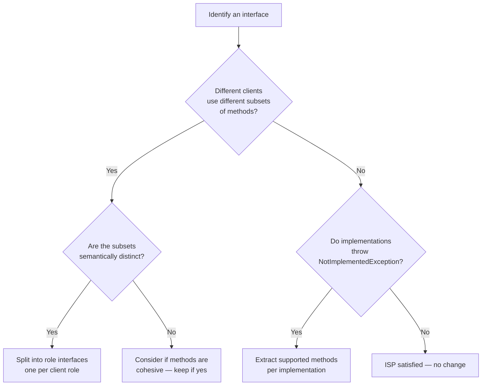

> [!success] Mastery Check
> - [ ] **Studied Well**
> - [ ] **Can explain the concept without notes**
> - [ ] **Can answer interview questions confidently**
> - [ ] **Can implement it in a real project**


## Navigation

**Domain:** [[6 — Design Principles & Patterns]] > **Group:** SOLID Principles
**Previous:** [[6.003 — Liskov Substitution Principle]] | **Next:** [[6.005 — Dependency Inversion Principle]]

### Prerequisites
- [[6.001 — Single Responsibility Principle]] — ISP is the interface-level analog of SRP: just as a class should have one reason to change, an interface should serve one client role.
- [[4.034 — The Built-In DI Container Service Registration]] — DI container wiring reveals fat interface problems when implementations must provide empty or throwing stubs for methods they do not need.

### Where This Fits
The Interface Segregation Principle (ISP) states that no client should be forced to depend on methods it does not use. It is the principle behind role interfaces, fine-grained contracts, and the decomposition of large interfaces into smaller, focused ones. In .NET, ISP is visible everywhere: `IReadOnlyCollection<T>` is separated from `ICollection<T>`, `IOutputFormatter` from `IInputFormatter`, and `IExceptionHandler` from `IMiddleware`. Violations manifest as "fat interfaces" where implementors throw `NotSupportedException` for unused members, or where clients take dependencies on interfaces with methods irrelevant to their use case.

## Core Mental Model

Interfaces should be client-specific rather than implementation-specific. Each interface should represent a single role, and a class may implement multiple role interfaces. The "client" that ISP refers to is the consumer of the interface — not the implementor.

### Dimensions

```mermaid
flowchart LR
    subgraph Fat Interface
        A[IWorker] --> B[Work()]
        A --> C[Eat()]
        A --> D[Sleep()]
        B --> E[HumanWorker ✅]
        C --> E
        D --> E
        B --> F[RobotWorker ❌]
        C -.->|throws| F
        D -.->|throws| F
    end

    subgraph Segregated Interfaces
        G[IWork] --> H[Work()]
        I[IEat] --> J[Eat()]
        K[ISleep] --> L[Sleep()]
        G --> M[HumanWorker ✅]
        I --> M
        K --> M
        G --> N[RobotWorker ✅]
    end

    style F fill:#ffcccc,stroke:#ff0000
    style N fill:#ccffcc,stroke:#00aa00
```

### ISP vs SRP

| Aspect | SRP | ISP |
|---|---|---|
| Level | Class / module | Interface / contract |
| Focus | One reason to change | No client depends on unused methods |
| Client perspective | Internal cohesion | External contract granularity |
| Typical outcome | Smaller classes | Smaller interfaces |

## Deep Mechanics

### How It Works

ISP is enforced by identifying the **roles** that clients play. A single class may play multiple roles, and each role should be represented by a separate interface. The class implements all relevant interfaces, and each client depends only on the interface for its specific role.

**Before — Violation (Fat Interface):**
```csharp
// ❌ Violation: IMultifunctionDevice forces all clients to know about all capabilities
public interface IMultifunctionDevice
{
    void Print(Document doc);
    void Scan(Document doc);
    void Fax(Document doc);
    void Stapler();
    void Emailed(Document doc);
}

// Client that only needs printing
public class PrintClient
{
    private readonly IMultifunctionDevice _device;

    public PrintClient(IMultifunctionDevice device) => _device = device;

    public void PrintDocument(Document doc)
    {
        _device.Print(doc); // Only uses Print, but depends on Scan, Fax, Staple, Email
    }
}

// Implementation that must stub unused methods
public class BasicPrinter : IMultifunctionDevice
{
    public void Print(Document doc) { /* prints */ }
    public void Scan(Document doc) => throw new NotSupportedException();
    public void Fax(Document doc) => throw new NotSupportedException();
    public void Stapler() => throw new NotSupportedException();
    public void Emailed(Document doc) => throw new NotSupportedException();
}
```

**After — Correct (Segregated Interfaces):**
```csharp
// ✅ Correct: Each role has its own interface
public interface IPrinter
{
    void Print(Document doc);
}

public interface IScanner
{
    void Scan(Document doc);
}

public interface IFax
{
    void Fax(Document doc);
}

// Client depends only on what it needs
public class PrintClient
{
    private readonly IPrinter _printer;
    public PrintClient(IPrinter printer) => _printer = printer;
    public void PrintDocument(Document doc) => _printer.Print(doc);
}

// Implementation implements only what it supports
public sealed class BasicPrinter : IPrinter
{
    public void Print(Document doc) { /* prints */ }
    // No Scan, No Fax — zero NotImplementedException
}

// Rich device implements multiple role interfaces
public sealed class MultifunctionPrinter : IPrinter, IScanner, IFax
{
    public void Print(Document doc) { /* ... */ }
    public void Scan(Document doc) { /* ... */ }
    public void Fax(Document doc) { /* ... */ }
}
```

### Why It Matters at Scale

Fat interfaces create coupling that is invisible until deployment. When `IMultifunctionDevice` has a new method added (e.g., `Copy`), every implementation must change — even `BasicPrinter` that never supported copying. Worse, the `BasicPrinter` implementor adds `throw new NotSupportedException()`, which becomes a runtime bomb: the compiler is happy, but the first production call to `Copy` on a `BasicPrinter` crashes. At scale, ISP reduces the blast radius of contract changes and eliminates the "I implement it because I have to but it doesn't work" pattern.

## Production Code Patterns

### Implementation in C#

```csharp
// ============================================
// Domain types
// ============================================

public sealed record Document(string Id, string Content, string ContentType);

// ============================================
// Segregated interfaces — each represents a role
// ============================================

/// <summary>
/// Role: Document storage operations.
/// </summary>
public interface IDocumentStore
{
    Task SaveAsync(Document doc, CancellationToken ct);
    Task<Document?> GetByIdAsync(string id, CancellationToken ct);
}

/// <summary>
/// Role: Document search and retrieval.
/// </summary>
public interface IDocumentSearch
{
    Task<IReadOnlyList<Document>> SearchAsync(string query, CancellationToken ct);
}

/// <summary>
/// Role: Document transformation.
/// </summary>
public interface IDocumentTransformer
{
    Task<Document> ConvertToAsync(Document doc, string targetContentType, CancellationToken ct);
}

/// <summary>
/// Role: Document notification (version-tolerant).
/// </summary>
public interface IDocumentNotifier
{
    Task NotifyAsync(string documentId, string eventType, CancellationToken ct);
}

// ============================================
/// Implementation — composite service
// ============================================

/// <summary>
/// Full-featured document service. Implements all role interfaces so each
/// client depends only on what it needs.
/// </summary>
public sealed class DocumentService : IDocumentStore, IDocumentSearch, IDocumentTransformer, IDocumentNotifier
{
    private readonly IDocumentRepository _repository;
    private readonly IBlobStorage _storage;
    private readonly ILogger _logger;

    public DocumentService(
        IDocumentRepository repository,
        IBlobStorage storage,
        ILogger<DocumentService> logger)
    {
        _repository = repository;
        _storage = storage;
        _logger = logger;
    }

    // IDocumentStore
    public async Task SaveAsync(Document doc, CancellationToken ct)
    {
        await _repository.SaveMetadataAsync(doc, ct);
        await _storage.UploadAsync(doc.Id, doc.Content, ct);
        _logger.LogInformation("Document {Id} saved", doc.Id);
    }

    public async Task<Document?> GetByIdAsync(string id, CancellationToken ct)
    {
        string content = await _storage.DownloadAsync(id, ct);
        return content is null ? null : new Document(id, content, "application/octet-stream");
    }

    // IDocumentSearch
    public async Task<IReadOnlyList<Document>> SearchAsync(string query, CancellationToken ct)
    {
        return await _repository.SearchAsync(query, ct);
    }

    // IDocumentTransformer
    public async Task<Document> ConvertToAsync(Document doc, string targetType, CancellationToken ct)
    {
        // Conversion logic
        return doc with { ContentType = targetType };
    }

    // IDocumentNotifier
    public async Task NotifyAsync(string documentId, string eventType, CancellationToken ct)
    {
        _logger.LogInformation("Notification: {Id} / {Event}", documentId, eventType);
        await Task.CompletedTask;
    }
}

// ============================================
// Client 1 — Only stores and retrieves
// ============================================

/// <summary>
/// Backup service only needs storage — no search, no transformation, no notification.
/// ISP ensures it depends only on IDocumentStore.
/// </summary>
public sealed class BackupService
{
    private readonly IDocumentStore _store;

    public BackupService(IDocumentStore store) => _store = store;

    public async Task BackupAsync(string documentId, CancellationToken ct)
    {
        Document? doc = await _store.GetByIdAsync(documentId, ct);
        if (doc is not null)
        {
            await _store.SaveAsync(doc with { Id = $"backup-{doc.Id}" }, ct);
        }
    }
}

// ============================================
// Client 2 — Only searches
// ============================================

/// <summary>
/// Search API controller depends only on IDocumentSearch.
/// No dependency on storage, transformation, or notification.
/// </summary>
[ApiController]
public sealed class SearchController : ControllerBase
{
    private readonly IDocumentSearch _search;

    public SearchController(IDocumentSearch search) => _search = search;

    [HttpGet("documents/search")]
    public async Task<IActionResult> Search(string query, CancellationToken ct)
    {
        IReadOnlyList<Document> results = await _search.SearchAsync(query, ct);
        return Ok(results);
    }
}
```

### ASP.NET Core / .NET Ecosystem Integration

```csharp
// Program.cs — Register the composite service under each role interface
var builder = WebApplication.CreateBuilder(args);

// DocumentService implements all role interfaces
// Each client resolves only the interface it needs
builder.Services.AddSingleton<DocumentService>();
builder.Services.AddSingleton<IDocumentStore>(sp => sp.GetRequiredService<DocumentService>());
builder.Services.AddSingleton<IDocumentSearch>(sp => sp.GetRequiredService<DocumentService>());
builder.Services.AddSingleton<IDocumentTransformer>(sp => sp.GetRequiredService<DocumentService>());
builder.Services.AddSingleton<IDocumentNotifier>(sp => sp.GetRequiredService<DocumentService>());

builder.Services.AddSingleton<BackupService>();
builder.Services.AddControllers();

// ============================================
// .NET Framework ISP Examples
// ============================================

// IReadOnlyCollection<T> — segregated from ICollection<T>
// Client that only reads should depend on IReadOnlyCollection<T>, not ICollection<T>
public sealed class ReportService
{
    private readonly IReadOnlyCollection<Order> _orders;

    public ReportService(IReadOnlyCollection<Order> orders) => _orders = orders;

    public int TotalCount => _orders.Count;
    // Cannot modify — ISP prevents mutation dependency
    // No .Add(), .Remove(), .Clear() — the interface has only read methods
}

// IHttpClientFactory — segregated from HttpClient lifecycle
// Client depends on IHttpClientFactory, not on creating HttpClient directly
public sealed class ApiClient
{
    private readonly IHttpClientFactory _httpClientFactory;

    public ApiClient(IHttpClientFactory httpClientFactory)
    {
        _httpClientFactory = httpClientFactory;
    }

    public async Task<string> FetchDataAsync(string url)
    {
        HttpClient client = _httpClientFactory.CreateClient("Api");
        return await client.GetStringAsync(url);
    }
}

// ASP.NET Core IExceptionHandler (8+) — segregated from middleware pipeline
// Handler only deals with exceptions, not the full request lifecycle
public sealed class DomainExceptionHandler : IExceptionHandler
{
    public async ValueTask<bool> TryHandleAsync(
        HttpContext httpContext,
        Exception exception,
        CancellationToken cancellationToken)
    {
        if (exception is DomainException domainEx)
        {
            httpContext.Response.StatusCode = 400;
            await httpContext.Response.WriteAsJsonAsync(
                new { Error = domainEx.Message }, cancellationToken);
            return true;
        }
        return false;
    }
}
```

In .NET ecosystem patterns:
- **`IEnumerable<T>` / `IReadOnlyCollection<T>` / `ICollection<T>` / `IList<T>`** — a hierarchy of segregated interfaces at different granularity levels.
- **`ILogger<T>`** — segregated from `ILoggerFactory`; the consumer gets only the logging API, not the factory for creating loggers.
- **`IMediator`** vs **`ISender`** vs **`IPublisher`** — MediatR segregates sending commands (request/response) from publishing events (fire-and-forget).

## Gotchas & Anti-Patterns

### Fat Interface with NotImplementedException

**Wrong:** One interface for all capabilities, implementations throw for unsupported operations.
```csharp
// ❌ Wrong: Fat interface with stubs
public interface IDataRepository
{
    Task SaveAsync<T>(T entity);
    Task<T?> GetByIdAsync<T>(int id);
    Task<IReadOnlyList<T>> GetAllAsync<T>();
    Task DeleteAsync<T>(int id);
    Task<IQueryable<T>> QueryAsync<T>();
    Task BulkInsertAsync<T>(IEnumerable<T> entities);
    Task<T> ExecuteRawSqlAsync<T>(string sql);
    // ...
}

public sealed class ReadOnlyRepository : IDataRepository
{
    public Task SaveAsync<T>(T entity) => throw new NotSupportedException();
    public Task<T?> GetByIdAsync<T>(int id) { /* works */ }
    public Task<IReadOnlyList<T>> GetAllAsync<T>() { /* works */ }
    public Task DeleteAsync<T>(int id) => throw new NotSupportedException();
    public Task<IQueryable<T>> QueryAsync<T>() { /* works */ }
    public Task BulkInsertAsync<T>(IEnumerable<T> entities) => throw new NotSupportedException();
    public Task<T> ExecuteRawSqlAsync<T>(string sql) => throw new NotSupportedException();
}
```

**Right:** Segregate into `IReadableDataRepository` and `IWritableDataRepository`.
```csharp
// ✅ Right: Segregated interfaces
public interface IReadableRepository
{
    Task<T?> GetByIdAsync<T>(int id);
    Task<IReadOnlyList<T>> GetAllAsync<T>();
}

public interface IWritableRepository
{
    Task SaveAsync<T>(T entity);
    Task DeleteAsync<T>(int id);
}
```

**Consequence:** `NotSupportedException` at runtime — the compiler cannot catch the mismatch. Every new client that accepts the fat interface either duplicates the stubs or inherits the practice of throwing. Testing requires mocking the entire interface, even when only `GetById` is needed.

### Refused Bequest

**Wrong:** A class inherits an interface but uses only a subset of its members.
```csharp
// ❌ Wrong: Interface inheritance for convenience
public interface IEntity
{
    int Id { get; set; }
    DateTime CreatedAt { get; set; }
    DateTime? ModifiedAt { get; set; }
    string CreatedBy { get; set; }
    byte[] RowVersion { get; set; }
    bool IsDeleted { get; set; }
}

// Read-only view model — forced to implement all members it does not need
public sealed record OrderSummaryView : IEntity
{
    public int Id { get; set; }
    public DateTime CreatedAt { get; set; }
    public DateTime? ModifiedAt { get; set; } // Not needed for view
    public string CreatedBy { get; set; } = string.Empty; // Not needed
    public byte[] RowVersion { get; set; } = []; // Not needed
    public bool IsDeleted { get; set; } // Not needed
}
```

**Right:** Separate persistence interface from query interface.
```csharp
// ✅ Right: View model has its own lightweight interface
public interface IReadOnlyEntity
{
    int Id { get; }
    DateTime CreatedAt { get; }
}

public sealed record OrderSummaryView(int Id, DateTime CreatedAt) : IReadOnlyEntity;
```

**Consequence:** View models, DTOs, and projections are forced to carry properties they do not use, bloating serialization payloads and creating fake initialization paths.

### Role Interface Ignorance

**Wrong:** Creating interfaces that match classes rather than roles.
```csharp
// ❌ Wrong: Interface mirrors class, not role
public interface IOrderService // Matches the class, not the client's role
{
    Task<Order> CreateOrderAsync(CreateOrderRequest request);
    Task<Order> GetOrderAsync(int id);
    Task CancelOrderAsync(int id);
    Task<Invoice> GenerateInvoiceAsync(int orderId);
    Task ShipOrderAsync(int orderId, ShippingInfo info);
}
```

**Right:** Define interfaces per role.
```csharp
// ✅ Right: Each client role has its own interface
public interface IOrderCreator { Task<Order> CreateAsync(CreateOrderRequest request); }
public interface IOrderCanceller { Task CancelAsync(int id); }
public interface IInvoiceGenerator { Task<Invoice> GenerateAsync(int orderId); }
```

**Consequence:** Clients depend on more than they need. Changing one method signature on `IOrderService` affects all clients, even those that never call that method.

### One-Method Interface Over-Fragmentation

**Wrong:** Splitting interfaces so aggressively that every method becomes its own interface with no semantic grouping.
```csharp
// ❌ Wrong: Over-segregated
public interface IGetUser { Task<User> GetAsync(int id); }
public interface ISaveUser { Task SaveAsync(User user); }
public interface IDeleteUser { Task DeleteAsync(int id); }
public interface ICountUsers { Task<int> CountAsync(); }
public interface IFindUsers { Task<IReadOnlyList<User>> FindAsync(string name); }
```

**Right:** Group related operations by role.
```csharp
// ✅ Right: Cohesive role interfaces
public interface IUserReader
{
    Task<User?> GetByIdAsync(int id);
    Task<IReadOnlyList<User>> FindAsync(string name);
}

public interface IUserWriter
{
    Task SaveAsync(User user);
    Task DeleteAsync(int id);
}
```

**Consequence:** Construction injection explodes — a class that needs read and write operations must inject 5 interfaces instead of 2. Test setup becomes tedious without meaningful grouping.

## Performance Implications

### Maintenance Cost Model

| Scenario | Defect Probability | Change Impact | Onboarding Cost |
|---|---|---|---|
| ISP followed (role interfaces) | Low — changes affect only relevant clients | Isolated — one interface change hits one role | Low — interface scope is obvious |
| Fat interface with NotImplementedException | High — runtime failures | Hidden — throw surfaces in production | High — must read implementation to know what works |
| ISP with "role interface" design | Low — each interface has semantic meaning | Minimal — adding method only affects role interface | Medium — more interfaces to learn |
| Over-segregated (per-method interfaces) | Low defect, high overhead | Isolated but many | High — injection explosion, many files |

## Interview Arsenal

### Question Bank

1. (Foundational) What is the Interface Segregation Principle?
2. (Foundational) How is ISP different from SRP?
3. (Intermediate) What is a "fat interface" and what problems does it cause?
4. (Intermediate) Can you "segregate" an interface that only has one method?
5. (Advanced) How does ISP apply to .NET's `IEnumerable<T>` / `IReadOnlyCollection<T>` / `ICollection<T>` hierarchy?
6. (Advanced) How does ISP influence the design of MediatR interfaces (`IMediator`, `ISender`, `IPublisher`)?
7. (Trick) If I extract an interface with all 10 methods from a class, is that an ISP violation?
8. (Senior) How would you refactor a system where 15 classes implement a single `IRepository` interface with 12 methods, and only 3 of those methods are used by any given implementation?

### Spoken Answers

**Q1 — What is ISP?**

> **Average answer:** Don't create big interfaces. Break them into smaller ones.

> **Great answer:** ISP states that no client should be forced to depend on methods it does not use. It is not about interface size — it is about interface *cohesion from the client's perspective*. The principle drives us to define *role interfaces*: contracts that correspond to a single role a client plays. In .NET, `IReadOnlyCollection<T>` is segregated from `ICollection<T>` because a read-only client should not depend on `Add`, `Remove`, or `Clear`. The `IReadOnlyCollection<T>` role is "I can count and enumerate." A class like `List<T>` implements both, but a client that only needs to read depends only on `IReadOnlyCollection<T>`.

**Q3 — What is a fat interface?**

> **Average answer:** A big interface with lots of methods that do different things.

> **Great answer:** A fat interface is one that exposes more methods than any single client needs. It violates ISP by forcing all implementors to provide stubs or throw `NotSupportedException`. The classic example is `IRepository<T>` with `Add`, `Update`, `Delete`, `GetById`, `GetAll`, `Query`, `BulkInsert`, etc. A read-only reporting client depends on all of these even though it only uses `GetById` and `GetAll`. Worse, a cache-backed implementation that is read-only must stub `Add` with `NotSupportedException` — a runtime failure waiting to happen. The fix is to split into `IReadOnlyRepository<T>` and `IWriteOnlyRepository<T>`.

### Trick Question

**"I have an interface with 20 methods, but all 20 are used by every client. Is this an ISP violation?"**

Why it is a trap: The number of methods is irrelevant — ISP is about *whether clients depend on methods they do not use*, not about the method count.

Correct answer: No, this is not an ISP violation. ISP is violated when clients are *forced to depend on methods they do not use*. If all 20 methods are relevant to every client, then a single interface with 20 methods is perfectly ISP-compliant. The principle is about segregation by *client role*, not by method count. However, consider whether the 20 methods truly represent a single role or if there are hidden sub-roles that different teams own — that would be a design smell worth investigating.

### Comparison Table

| Aspect | Interface Segregation Principle (ISP) | Single Responsibility Principle (SRP) |
|---|---|---|
| Intent | No client forced to depend on unused methods | One reason to change per class |
| Scope | Interface / contract level | Class / module level |
| When to use | When an interface has methods irrelevant to some consumers | When a class has multiple actors driving change |
| .NET example | `IReadOnlyCollection<T>` vs `ICollection<T>` | Split `OrderService` into `OrderCalculator`, `OrderRepository` |
| Key difference | ISP is about *contract granularity for clients*; SRP is about *cohesion of implementation* | ISP separates *what clients see*; SRP separates *what a class does* |

## Decision Framework

### When to Apply ISP



### Application Checklist

- [ ] Every client depends only on methods it actually calls
- [ ] No implementation throws `NotSupportedException` for interface members
- [ ] Each interface methods are semantically cohesive (represent one role)
- [ ] Interface names reflect the role (e.g., `IOrderReader`, not `IOrder`)
- [ ] Adding a method to an interface does not force changes in unrelated clients
- [ ] Mock setups in tests only need to mock methods relevant to the test
- [ ] No "pass-through" or "delegate-to-implementation" proxies exist solely to hide methods
- [ ] The interface can be described in terms of what the *client* does, not what the *class* has

### Tradeoff Summary

| What You Gain | What You Give Up |
|---|---|
| Clients decoupled — changes in one role do not affect others | More interfaces to create, name, and maintain |
| Eliminated `NotImplementedException` stubs | Potential interface explosion if over-applied |
| Test mocks are minimal — only mock relevant role | Registration complexity — multiple interfaces per implementation |
| Clearer contract semantics — "I need a reader, not a writer" | Some interfaces may have only 1-2 methods, which can feel excessive |

## Self-Check

### Conceptual Questions

1. What is the formal statement of the Interface Segregation Principle?
2. Who is the "client" referred to in ISP?
3. What is the relationship between ISP and SRP?
4. What is a "fat interface" and what runtime symptom reveals it?
5. How does `IReadOnlyCollection<T>` exemplify ISP?
6. What is a "role interface" and how does it differ from a class interface?
7. Why is it a code smell when a class throws `NotSupportedException` from an interface method?
8. How does ISP relate to contract versioning?
9. Can a single-method interface violate ISP? How?
10. What is the difference between ISP and the concept of "separation of concerns"?

<details><summary>Answers</summary>
1. No client should be forced to depend on methods it does not use.
2. The client is the consumer of the interface (the calling code), not the implementor.
3. SRP governs class cohesion (one reason to change), ISP governs interface granularity (no unused dependencies). They operate at different levels: SRP is about implementation, ISP is about contract.
4. A fat interface has more methods than any single client needs. The symptom is `NotSupportedException` thrown by implementations for methods they do not support.
5. `IReadOnlyCollection<T>` exposes only `Count` and `GetEnumerator()`. A read-only client depends on this, not on `ICollection<T>` which has `Add`, `Remove`, `Clear`. This is clean ISP.
6. A role interface represents what a *client* does with a type (e.g., `IComparer<T>`), not what the type *is*. Compare to a class interface that mirrors the class's public API.
7. It indicates the implementation does not support a method that the interface contract claims it supports. This violates ISP (the client depends on something that does not work) and LSP (the subtype cannot fully substitute for the contract).
8. ISP reduces the blast radius of interface changes. Adding a method to a fine-grained role interface affects only clients of that role. Adding to a fat interface forces all clients to consider the new method.
9. Yes — if the single method is semantically meaningless to some clients. For example, `ISave` with a single `Save` method on a read-only service forces the client to depend on persistence it does not use.
10. ISP is about *contract design* (what interfaces expose), while separation of concerns is about *module design* (what classes do). ISP ensures that contract boundaries match concern boundaries.
</details>

### Code Puzzles

**Puzzle 1 — Identify the violation**

```csharp
public interface IOrderProcessor
{
    Task<Order> CreateOrderAsync(Cart cart);
    Task<Invoice> GenerateInvoiceAsync(int orderId);
    Task SendConfirmationAsync(int orderId);
    Task<ShippingLabel> GenerateShippingLabelAsync(int orderId);
    Task UpdateInventoryAsync(int orderId);
}
```

<details><summary>Answer</summary>
Fat interface violation. Different clients need different subsets: `CheckoutController` may only need `CreateOrderAsync`, `InvoiceController` needs `GenerateInvoiceAsync`, `ShippingService` needs `GenerateShippingLabelAsync` and maybe `UpdateInventoryAsync`. Split into `IOrderCreator`, `IInvoiceGenerator`, `IOrderConfirmationSender`, `IShippingLabelGenerator`, `IInventoryUpdater`.
</details>

**Puzzle 2 — Complete the pattern**

Segregate this interface into role interfaces so that a read-only reporting client does not depend on mutation methods:

```csharp
public interface IProductRepository
{
    Task<Product?> GetByIdAsync(int id);
    Task<IReadOnlyList<Product>> GetAllAsync();
    Task SaveAsync(Product product);
    Task DeleteAsync(int id);
}
```

<details><summary>Answer</summary>
```csharp
public interface IProductReader
{
    Task<Product?> GetByIdAsync(int id);
    Task<IReadOnlyList<Product>> GetAllAsync();
}

public interface IProductWriter
{
    Task SaveAsync(Product product);
    Task DeleteAsync(int id);
}

// Implementation
public sealed class ProductRepository : IProductReader, IProductWriter
{
    // all methods implemented here
}

// Client
public sealed class ProductReportService
{
    private readonly IProductReader _reader;
    public ProductReportService(IProductReader reader) => _reader = reader;
    // No mutation dependency
}
```
</details>

**Puzzle 3 — Choose the right approach**

You have a `NotificationService` that sends email, SMS, and push notifications. Currently, there is one interface with `SendEmailAsync`, `SendSmsAsync`, and `SendPushAsync`. Should you segregate it, and if so, how?

<details><summary>Answer</summary>
Yes — each notification channel is a different role and likely consumed by different clients or independently tested. Segregate into `IEmailSender`, `ISmsSender`, `IPushSender`. A `CompositeNotificationService` can implement all three if needed, but each client depends only on the channel it needs.
</details>

**Puzzle 4 — Spot the anti-pattern**

```csharp
public interface IRepository<T>
{
    Task<T?> GetByIdAsync(int id);
    Task<IReadOnlyList<T>> GetAllAsync();
    Task AddAsync(T entity);
    Task UpdateAsync(T entity);
    Task DeleteAsync(int id);
    Task<IQueryable<T>> QueryAsync();
    Task<int> CountAsync();
    Task<bool> ExistsAsync(int id);
    Task BulkInsertAsync(IEnumerable<T> entities);
    Task BulkDeleteAsync(IEnumerable<int> ids);
}

public sealed class ReadOnlyLookupRepository<T> : IRepository<T>
{
    public Task<T?> GetByIdAsync(int id) { /* ... */ }
    public Task<IReadOnlyList<T>> GetAllAsync() { /* ... */ }
    public Task AddAsync(T entity) => throw new NotSupportedException();
    public Task UpdateAsync(T entity) => throw new NotSupportedException();
    public Task DeleteAsync(int id) => throw new NotSupportedException();
    public Task<IQueryable<T>> QueryAsync() { /* ... */ }
    public Task<int> CountAsync() { /* ... */ }
    public Task<bool> ExistsAsync(int id) { /* ... */ }
    public Task BulkInsertAsync(IEnumerable<T> entities) => throw new NotSupportedException();
    public Task BulkDeleteAsync(IEnumerable<int> ids) => throw new NotSupportedException();
}
```

<details><summary>Answer</summary>
Fat interface + throw stubs anti-pattern. `IRepository<T>` forces read-only lookups to implement mutation methods they do not support, causing `NotSupportedException` at runtime. Fix: split into `IReadOnlyRepository<T>` (GetById, GetAll, Query, Count, Exists) and `IWriteOnlyRepository<T>` (Add, Update, Delete, BulkInsert, BulkDelete).
</details>

**Puzzle 5 — Refactor to apply ISP**

```csharp
// API Controller
[ApiController]
public class UserController : ControllerBase
{
    private readonly IUserService _userService;

    public UserController(IUserService userService) => _userService = userService;

    [HttpGet("{id}")]
    public async Task<IActionResult> Get(int id) => Ok(await _userService.GetUserAsync(id));

    [HttpPost]
    public async Task<IActionResult> Create(CreateUserRequest request)
    {
        await _userService.CreateUserAsync(request);
        return Ok();
    }

    [HttpPut("{id}/password")]
    public async Task<IActionResult> ChangePassword(int id, ChangePasswordRequest req)
    {
        await _userService.ChangePasswordAsync(id, req);
        return Ok();
    }
}

public interface IUserService
{
    Task<UserDto> GetUserAsync(int id);
    Task CreateUserAsync(CreateUserRequest request);
    Task ChangePasswordAsync(int id, ChangePasswordRequest request);
    Task DeactivateUserAsync(int id);
    Task<IReadOnlyList<UserDto>> SearchUsersAsync(string query);
    Task AssignRoleAsync(int userId, string role);
    Task<AuditLog> GetAuditTrailAsync(int userId);
}
```

<details><summary>Answer</summary>
```csharp
// Segregated by client role
public interface IUserReader
{
    Task<UserDto> GetUserAsync(int id);
    Task<IReadOnlyList<UserDto>> SearchUsersAsync(string query);
}

public interface IUserWriter
{
    Task CreateUserAsync(CreateUserRequest request);
    Task DeactivateUserAsync(int id);
}

public interface IUserPasswordManager
{
    Task ChangePasswordAsync(int id, ChangePasswordRequest request);
}

public interface IUserRoleManager
{
    Task AssignRoleAsync(int userId, string role);
}

public interface IUserAuditor
{
    Task<AuditLog> GetAuditTrailAsync(int userId);
}

// Controller now depends only on what it needs
[ApiController]
public class UserController : ControllerBase
{
    private readonly IUserReader _reader;
    private readonly IUserWriter _writer;
    private readonly IUserPasswordManager _password;

    public UserController(
        IUserReader reader,
        IUserWriter writer,
        IUserPasswordManager password)
    {
        _reader = reader;
        _writer = writer;
        _password = password;
    }

    [HttpGet("{id}")]
    public async Task<IActionResult> Get(int id) => Ok(await _reader.GetUserAsync(id));

    [HttpPost]
    public async Task<IActionResult> Create(CreateUserRequest request)
    {
        await _writer.CreateUserAsync(request);
        return Ok();
    }

    [HttpPut("{id}/password")]
    public async Task<IActionResult> ChangePassword(int id, ChangePasswordRequest req)
    {
        await _password.ChangePasswordAsync(id, req);
        return Ok();
    }
}
```
</details>
