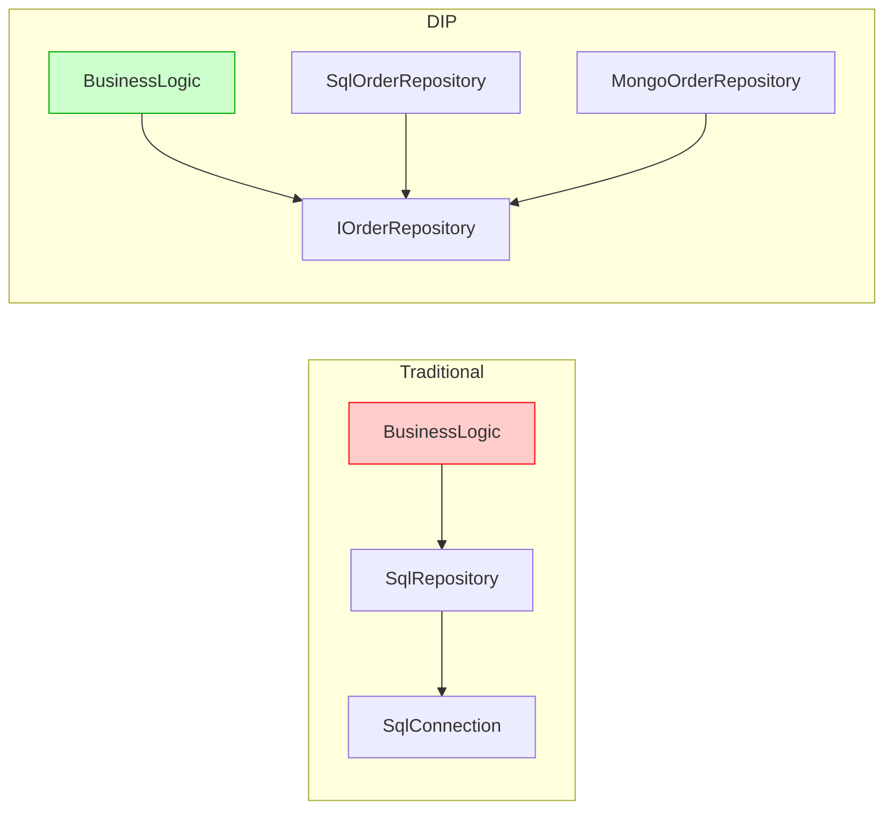
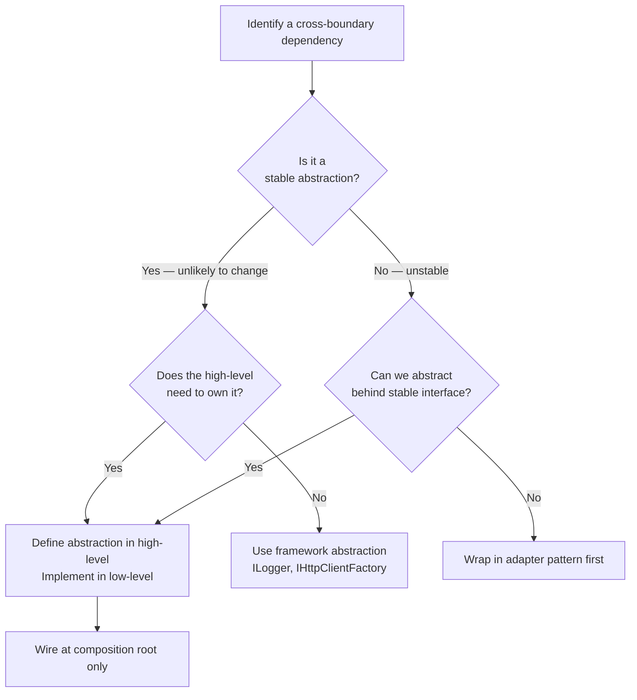

> [!success] Mastery Check
> - [ ] **Studied Well**
> - [ ] **Can explain the concept without notes**
> - [ ] **Can answer interview questions confidently**
> - [ ] **Can implement it in a real project**


## Navigation

**Domain:** [[6 — Design Principles & Patterns]] > **Group:** SOLID Principles
**Previous:** [[6.004 — Interface Segregation Principle]] | **Next:** [[6.006 — DRY]]

### Prerequisites
- [[6.004 — Interface Segregation Principle]] — ISP ensures interfaces are focused; DIP depends on well-segregated abstractions to decouple high-level from low-level modules.
- [[4.034 — The Built-In DI Container Service Registration]] — The DI container is the primary mechanism for satisfying DIP in .NET — it wires abstractions to concretions at the composition root.
- [[6.019 — Factory Method Pattern]] — Factory Method supports DIP by allowing high-level code to create dependencies without knowing concrete types.

### Where This Fits
The Dependency Inversion Principle (DIP) is the most architecturally significant of the SOLID principles. It states that high-level modules should not depend on low-level modules — both should depend on abstractions, and abstractions should not depend on details, but details should depend on abstractions. DIP is what makes layered architectures maintainable: the domain layer defines repository interfaces, and the infrastructure layer implements them. In .NET, DIP is the rationale behind `IEnumerable<T>`, `IHttpClientFactory`, the repository pattern in clean architecture, and ASP.NET Core itself where `IServiceProvider` inverts control of dependency creation.

## Core Mental Model

Traditional programming creates a dependency chain: UI → Business Logic → Data Access → Database. DIP inverts this: the high-level policy (business logic) owns the abstraction (interface), and the low-level detail (data access) implements that abstraction. The dependency arrow points into the abstraction, reversing the traditional flow.

### Classification



### Three Rules of DIP

| Rule | Explanation |
|---|---|
| High-level modules must not depend on low-level modules | Business logic should not reference `SqlConnection` or `HttpClient` |
| Both must depend on abstractions | Domain and infrastructure reference interfaces defined in the domain |
| Abstractions must not depend on details | The interface should not expose `DbSet<T>` or `SqlParameter` |

## Deep Mechanics

### How It Works

DIP is realized by: (1) owning the abstraction in the high-level module, (2) injecting the dependency through the constructor, (3) implementing in the low-level module, (4) wiring at the composition root.

**Before — Violation:**
```csharp
// ❌ Violation: Domain references EF Core directly
namespace Domain.Services;
using Infrastructure.Persistence; // Domain depends on Infrastructure!

public class OrderService
{
    private readonly AppDbContext _context;
    public OrderService(AppDbContext context) => _context = context;
    public async Task<Order> GetOrderAsync(int id)
        => await _context.Orders.FindAsync(id);
}
```

**After — Correct:**
```csharp
// ✅ Correct: Domain defines abstraction, infrastructure implements
namespace Domain.Abstractions;
public interface IOrderRepository
{
    Task<Order?> GetByIdAsync(int id, CancellationToken ct);
    Task SaveAsync(Order order, CancellationToken ct);
}

namespace Domain.Services;
public class OrderService
{
    private readonly IOrderRepository _repository;
    public OrderService(IOrderRepository repository) => _repository = repository;
    public async Task<Order> GetOrderAsync(int id)
        => await _repository.GetByIdAsync(id, CancellationToken.None);
}

namespace Infrastructure.Persistence;
public sealed class SqlOrderRepository : IOrderRepository
{
    private readonly AppDbContext _context;
    public SqlOrderRepository(AppDbContext context) => _context = context;
    public async Task<Order?> GetByIdAsync(int id, CancellationToken ct)
        => await _context.Orders.FindAsync(new object[] { id }, ct);
    public async Task SaveAsync(Order order, CancellationToken ct)
    {
        await _context.Orders.AddAsync(order, ct);
        await _context.SaveChangesAsync(ct);
    }
}
```

### Composition Root

```csharp
// The ONLY place where concrete types are wired
public static class CompositionRoot
{
    public static IServiceCollection AddApplication(this IServiceCollection services)
    {
        services.AddScoped<IOrderRepository, SqlOrderRepository>();
        services.AddScoped<OrderService>();
        return services;
    }
}
```

### .NET Runtime Behavior

The CLR satisfies DIP through constructor injection via `IServiceProvider`. When `OrderService` is resolved, the DI container sees `IOrderRepository` in the constructor, looks up `SqlOrderRepository`, creates it (resolving its own dependencies like `AppDbContext`), and passes it to `OrderService`. The JIT compiles the interface dispatch for `IOrderRepository.GetByIdAsync` once — the overhead is one virtual call through the interface method table.

## Production Code Patterns

### Implementation in C#

```csharp
// Domain Abstractions — owned by high-level module
namespace Domain.Abstractions;

public interface IOrderRepository
{
    Task<Order?> GetByIdAsync(Guid id, CancellationToken ct);
    Task AddAsync(Order order, CancellationToken ct);
    Task UpdateAsync(Order order, CancellationToken ct);
}

public interface IPaymentGateway
{
    Task<PaymentResult> ChargeAsync(decimal amount, string currency, string cardToken, CancellationToken ct);
}

public sealed record PaymentResult(bool IsSuccess, string TransactionId, string? ErrorMessage);

public interface INotificationService
{
    Task SendOrderConfirmationAsync(Order order, CancellationToken ct);
}

// Domain Services — uses abstractions only
namespace Domain.Services;

public sealed class PlaceOrderHandler
{
    private readonly IOrderRepository _repository;
    private readonly IPaymentGateway _payment;
    private readonly INotificationService _notifier;

    public PlaceOrderHandler(
        IOrderRepository repository,
        IPaymentGateway payment,
        INotificationService notifier)
    {
        _repository = repository;
        _payment = payment;
        _notifier = notifier;
    }

    public async Task<Result> HandleAsync(Order order, string cardToken, CancellationToken ct)
    {
        var paymentResult = await _payment.ChargeAsync(order.Total, "USD", cardToken, ct);
        if (!paymentResult.IsSuccess) return Result.Failure(paymentResult.ErrorMessage!);

        var confirmed = order with { Status = OrderStatus.Confirmed };
        await _repository.AddAsync(confirmed, ct);
        await _notifier.SendOrderConfirmationAsync(confirmed, ct);
        return Result.Success();
    }
}

public sealed record Result
{
    public bool IsSuccess { get; }
    public string? Error { get; }
    private Result(bool success, string? error) => (IsSuccess, Error) = (success, error);
    public static Result Success() => new(true, null);
    public static Result Failure(string error) => new(false, error);
}

// Infrastructure — implements abstractions
namespace Infrastructure.Persistence;

public sealed class SqlOrderRepository : IOrderRepository
{
    private readonly OrdersDbContext _context;
    public SqlOrderRepository(OrdersDbContext context) => _context = context;
    public async Task<Order?> GetByIdAsync(Guid id, CancellationToken ct)
        => await _context.Orders.FindAsync(new object[] { id }, ct);
    public async Task AddAsync(Order order, CancellationToken ct)
    {
        await _context.Orders.AddAsync(order, ct);
        await _context.SaveChangesAsync(ct);
    }
    public async Task UpdateAsync(Order order, CancellationToken ct)
    {
        _context.Orders.Update(order);
        await _context.SaveChangesAsync(ct);
    }
}

namespace Infrastructure.Payments;

public sealed class StripePaymentGateway : IPaymentGateway
{
    private readonly IStripeClient _client;
    public StripePaymentGateway(IStripeClient client) => _client = client;
    public async Task<PaymentResult> ChargeAsync(decimal amount, string currency, string cardToken, CancellationToken ct)
    {
        try
        {
            var charge = await _client.CreateChargeAsync((long)(amount * 100), currency, cardToken, ct);
            return new PaymentResult(true, charge.Id, null);
        }
        catch (StripeException ex)
        {
            return new PaymentResult(false, string.Empty, ex.Message);
        }
    }
}

namespace Infrastructure.Notifications;

public sealed class EmailNotificationService : INotificationService
{
    private readonly ISmtpClient _smtp;
    public EmailNotificationService(ISmtpClient smtp) => _smtp = smtp;
    public async Task SendOrderConfirmationAsync(Order order, CancellationToken ct)
    {
        await _smtp.SendAsync(order.CustomerEmail, "Order Confirmed",
            $"Order {order.Id} confirmed for {order.Total:C}", ct);
    }
}
```

### ASP.NET Core / .NET Ecosystem Integration

```csharp
// Program.cs — Composition Root
var builder = WebApplication.CreateBuilder(args);

builder.Services.AddDbContext<OrdersDbContext>(o =>
    o.UseSqlServer(builder.Configuration.GetConnectionString("Orders")));
builder.Services.AddSingleton<IStripeClient>(_ =>
    new StripeClient(builder.Configuration["Stripe:SecretKey"]!));
builder.Services.AddSingleton<ISmtpClient, SmtpClientWrapper>();

builder.Services.AddScoped<IOrderRepository, SqlOrderRepository>();
builder.Services.AddScoped<IPaymentGateway, StripePaymentGateway>();
builder.Services.AddScoped<INotificationService, EmailNotificationService>();
builder.Services.AddScoped<PlaceOrderHandler>();

// Framework DIP examples:
// IHttpClientFactory — high-level depends on abstraction
builder.Services.AddHttpClient("GitHub", client =>
{
    client.BaseAddress = new Uri("https://api.github.com");
});
// IOptions<T> — configuration abstraction
// ILogger<T> — logging abstraction
// IMemoryCache — caching abstraction
// IHostedService — background service abstraction
```

## Gotchas & Anti-Patterns

### Leaking Infrastructure into Domain Abstractions

**Wrong:** Domain interface exposes infrastructure types.
```csharp
public interface IOrderRepository
{
    Task<Order?> GetByIdAsync(int id, CancellationToken ct);
    IQueryable<Order> Query(); // Couples domain to IQueryable provider
    Task BulkInsertAsync(IEnumerable<Order> orders, SqlConnection connection); // SqlConnection!
}
```

**Right:** Abstractions use only domain types.
```csharp
public interface IOrderRepository
{
    Task<Order?> GetByIdAsync(int id, CancellationToken ct);
    Task<IReadOnlyList<Order>> GetByDateRangeAsync(DateOnly from, DateOnly to, CancellationToken ct);
    Task AddAsync(Order order, CancellationToken ct);
}
```

**Consequence:** Changing infrastructure (EF Core to Dapper) requires changes in domain abstractions — the very thing DIP prevents.

### Concrete Type Injection

**Wrong:** High-level depends on concrete implementation.
```csharp
public sealed class ReportGenerator
{
    private readonly SqlReportRepository _repository; // Concrete!
    public ReportGenerator(SqlReportRepository repository) => _repository = repository;
}
```

**Right:** Depend on abstraction defined in high-level module.
```csharp
public interface IReportRepository { /* defined in domain */ }
public sealed class SqlReportRepository : IReportRepository { /* in infrastructure */ }
public sealed class ReportGenerator
{
    private readonly IReportRepository _repository;
    public ReportGenerator(IReportRepository repository) => _repository = repository;
}
```

**Consequence:** Cannot swap implementations, cannot unit test without database, compile-time coupling to infrastructure.

### Service Locator Anti-Pattern

**Wrong:** Using IServiceProvider as a service locator instead of constructor injection.
```csharp
public sealed class OrderProcessor
{
    private readonly IServiceProvider _provider;
    public OrderProcessor(IServiceProvider provider) => _provider = provider;
    public async Task ProcessAsync(Order order)
    {
        var repo = _provider.GetRequiredService<IOrderRepository>(); // Service locator!
        var payment = _provider.GetRequiredService<IPaymentGateway>();
    }
}
```

**Right:** Explicit constructor injection.
```csharp
public sealed class OrderProcessor
{
    private readonly IOrderRepository _repository;
    private readonly IPaymentGateway _payment;
    public OrderProcessor(IOrderRepository repository, IPaymentGateway payment)
    {
        _repository = repository;
        _payment = payment;
    }
}
```

**Consequence:** Hidden dependencies that are not discoverable from the constructor signature. Runtime resolution failures instead of compile-time guarantees. Violates the principle that dependencies should be explicit.

### Violating the Abstraction Ownership Direction

**Wrong:** Infrastructure project defines the interface that domain depends on.
```csharp
// Infrastructure defines the abstraction
namespace Infrastructure.Abstractions;
public interface IOrderRepository { /* ... */ }

// Domain depends on Infrastructure's abstraction — WRONG direction
namespace Domain.Services;
using Infrastructure.Abstractions;
```

**Right:** Domain owns the abstraction.
```csharp
// Domain defines the abstraction
namespace Domain.Abstractions;
public interface IOrderRepository { /* ... */ }

// Infrastructure depends on Domain's abstraction and implements it
namespace Infrastructure.Persistence;
using Domain.Abstractions;
```

**Consequence:** The domain layer cannot exist without referencing the infrastructure assembly. The entire point of DIP — decoupling high-level policy from low-level details — is defeated.

## Performance Implications

### Maintenance Cost Model

| Scenario | Defect Probability | Change Impact | Onboarding Cost |
|---|---|---|---|
| DIP followed (domain owns abstractions) | Low | Infrastructure changes isolated to infrastructure | Low — domain is pure business logic |
| DIP violated (domain depends on infrastructure) | High — DB changes break domain logic | Cascading — schema change affects domain | High — must understand both domain and infrastructure |
| DIP with service locator | Medium — hidden dependencies | Hard to trace | High — unclear what a class needs |
| DIP with infrastructure-owned abstractions | High — domain coupled to infrastructure | Impossible to test domain without infrastructure | Very high — circular dependency risk |

## Interview Arsenal

### Question Bank

1. (Foundational) What is the Dependency Inversion Principle?
2. (Foundational) What is the difference between Dependency Injection and Dependency Inversion?
3. (Intermediate) Name the three rules of DIP.
4. (Intermediate) How does DIP relate to the Open/Closed Principle?
5. (Advanced) What happens when the abstraction leaks infrastructure types?
6. (Advanced) How does the .NET DI container implement DIP at the framework level?
7. (Trick) Is IoC (Inversion of Control) the same as DIP?
8. (Senior) How would you apply DIP in a legacy system where the domain layer already references Entity Framework?

### Spoken Answers

**Q1 — What is DIP?**

> **Average answer:** High-level modules should not depend on low-level modules. Both should depend on abstractions.

> **Great answer:** DIP has two parts. First, high-level modules should not depend on low-level modules — both should depend on abstractions. Second, abstractions should not depend on details — details should depend on abstractions. The critical insight is that the high-level module *owns* the abstraction. In a clean architecture .NET solution, the Domain project defines `IOrderRepository`, and the Infrastructure project implements it. The Domain project has no reference to Infrastructure, EF Core, or any external library. This allows swapping data access strategies (EF Core, Dapper, Mongo) without touching business logic. The ASP.NET Core framework itself is built on DIP: `IServiceProvider`, `ILogger<T>`, `IHttpClientFactory` are all abstractions owned by the framework's high-level policy, with concrete implementations swappable via configuration.

**Q3 — What are the three rules of DIP?**

> **Average answer:** Depend on abstractions, not concretions. Don't reference low-level modules from high-level ones.

> **Great answer:** (1) High-level modules must not depend on low-level modules — your domain services should never `using Infrastructure.Persistence;`. (2) Both must depend on abstractions — the domain references `IOrderRepository`, infrastructure references `IOrderRepository`, no one references `SqlOrderRepository` except the composition root. (3) Abstractions must not depend on details — your `IOrderRepository` interface should not contain `IQueryable` or `SqlConnection`, because those are infrastructure concerns. Following these rules ensures that infrastructure changes (DB migration, ORM swap) do not ripple into domain logic.

### Trick Question

**"Isn't Dependency Injection the same as the Dependency Inversion Principle?"**

Why it is a trap: The names sound similar and they often appear together, but they address different concerns. Many candidates conflate the mechanism (DI) with the principle (DIP).

Correct answer: No. Dependency Injection is a *mechanism* — a way of providing dependencies to a class from the outside (usually via constructor parameters). Dependency Inversion is a *principle* about the direction of dependencies and ownership of abstractions. DI is one technique that enables DIP (by allowing concrete implementations to be injected at the composition root), but you can do DI without DIP (injecting a concrete `SqlRepository` into a class that depends on it), and you can theoretically do DIP without DI (using a factory or service locator at the composition root).

### Comparison Table

| Aspect | Dependency Inversion Principle (DIP) | Open/Closed Principle (OCP) |
|---|---|---|
| Intent | Invert dependency direction; high-level owns abstractions | Extend without modification |
| Scope | Module/assembly dependency direction | Class extension boundaries |
| When to use | Always in layered architectures | When variation points exist |
| .NET example | `IOrderRepository` in Domain, `SqlOrderRepository` in Infrastructure | `IHealthCheck` — add checks without modifying pipeline |
| Key difference | DIP addresses *who owns the abstraction* and the direction of arrows; OCP addresses *how you add new behavior* | DIP is the structural foundation; OCP is the behavioral goal enabled by DIP |

## Decision Framework

### When to Apply DIP



### Application Checklist

- [ ] High-level module does not reference low-level module assembly
- [ ] Abstraction is defined in the high-level module (or a shared abstractions project)
- [ ] Abstraction contains only domain types — no infrastructure types
- [ ] The composition root is the only place where concrete implementations are selected
- [ ] Dependencies are injected via constructor (not service locator, not `new`)
- [ ] Swapping implementation requires no changes in high-level code
- [ ] Unit tests for high-level module mock the abstraction without infrastructure setup
- [ ] The dependency graph has no circular references

### Tradeoff Summary

| What You Gain | What You Give Up |
|---|---|
| Domain is pure business logic — no infrastructure coupling | Additional project/assembly per layer |
| Swappable infrastructure — change DB without touching domain | Indirection — must navigate interface to implementation |
| Testable business logic without infrastructure setup | Composition root complexity |
| Clear dependency direction — no cycles | Learning curve for team new to layered architecture |
| Aligns with clean architecture / hexagonal architecture | Potential over-engineering for simple CRUD apps |

## Self-Check

### Conceptual Questions

1. What are the two parts of the Dependency Inversion Principle?
2. How does DIP differ from Dependency Injection?
3. What does it mean for the high-level module to "own" the abstraction?
4. Why is it a violation to put `IQueryable<T>` in a domain repository interface?
5. What is the composition root and what role does it play in DIP?
6. How does DIP relate to the concept of "hexagonal architecture" (ports and adapters)?
7. Why is service locator considered an anti-pattern when DIP is applied?
8. How does DIP support unit testing?
9. What is the problem when the infrastructure project defines interfaces that domain uses?
10. Can you have DIP without an IoC container?

<details><summary>Answers</summary>
1. (a) High-level modules should not depend on low-level modules; both should depend on abstractions. (b) Abstractions should not depend on details; details should depend on abstractions.
2. DIP is a design principle about dependency direction and abstraction ownership. DI is a technique for supplying dependencies from outside. DI enables DIP but is not synonymous with it.
3. The interface is defined in the same assembly/project as the high-level module. The domain project defines `IOrderRepository`; the infrastructure project references the domain and implements it. The domain never references infrastructure.
4. `IQueryable<T>` leaks EF Core (or LINQ provider) concerns into the domain abstraction, violating the rule that abstractions must not depend on details. It also makes the domain interface dependent on a specific query paradigm.
5. The composition root is the application's entry point where all dependencies are wired together (e.g., `Program.cs`). It is the only place where concrete types are selected. The rest of the application depends only on abstractions.
6. DIP is the core principle behind ports and adapters. The "ports" are abstractions defined by the domain (high-level), and the "adapters" are infrastructure implementations (low-level). The dependency direction is always toward the domain.
7. Service locator (e.g., `IServiceProvider.GetService<T>()`) hides dependencies, making them undiscoverable from the constructor signature. It also moves implementation selection into the body of the method, away from the composition root.
8. Since domain services depend only on abstractions, unit tests can inject mocks or fakes without setting up a database, HTTP client, or file system.
9. It inverts the direction incorrectly. The domain becomes coupled to infrastructure's assembly and can be forced to change when infrastructure changes. The domain cannot be compiled or tested independently.
10. Yes. DIP is a design principle that can be applied manually with factories or manual DI. An IoC container automates wiring but is not required. The principle is about where interfaces are defined and which way dependencies point.
</details>

### Code Puzzles

**Puzzle 1 — Identify the violation**

```csharp
public class EmailService
{
    private readonly SmtpClient _smtp;
    public EmailService()
    {
        _smtp = new SmtpClient("smtp.example.com", 587);
    }
    public async Task SendAsync(string to, string subject, string body)
    {
        await _smtp.SendMailAsync(to, subject, body);
    }
}

public class OrderNotifier
{
    private readonly EmailService _email;
    public OrderNotifier()
    {
        _email = new EmailService(); // Direct instantiation
    }
    public async Task NotifyAsync(Order order)
    {
        await _email.SendAsync(order.CustomerEmail, "Order", "Confirmed");
    }
}
```

<details><summary>Answer</summary>
DIP violation: `OrderNotifier` (high-level) depends on `EmailService` (concrete low-level) and creates it directly. Cannot test `OrderNotifier` without sending real emails, cannot swap to SMS or push notifications. Fix: extract `INotificationChannel` in the domain, inject it into `OrderNotifier`, implement `EmailNotificationChannel` in infrastructure.
</details>

**Puzzle 2 — Complete the pattern**

Design the DIP-compliant abstraction for inventory management where the domain needs to check stock levels and reserve items.

<details><summary>Answer</summary>
```csharp
// Domain abstraction
namespace Domain.Abstractions;
public interface IInventoryService
{
    Task<bool> HasStockAsync(string sku, int quantity, CancellationToken ct);
    Task ReserveAsync(string sku, int quantity, CancellationToken ct);
}

// Domain service
namespace Domain.Services;
public sealed class OrderFulfillmentService
{
    private readonly IInventoryService _inventory;
    public OrderFulfillmentService(IInventoryService inventory) => _inventory = inventory;
    public async Task<bool> CanFulfillAsync(Order order, CancellationToken ct)
    {
        foreach (var item in order.LineItems)
        {
            if (!await _inventory.HasStockAsync(item.Sku, item.Quantity, ct))
                return false;
        }
        return true;
    }
}

// Infrastructure
namespace Infrastructure.Inventory;
public sealed class SqlInventoryService : IInventoryService
{
    private readonly InventoryDbContext _db;
    public SqlInventoryService(InventoryDbContext db) => _db = db;
    // implementation
}
```
</details>

**Puzzle 3 — Choose the right approach**

Your team has a `UserController` that creates `DbContext` directly. You are introducing unit tests. Should you refactor, and what pattern should you use?

<details><summary>Answer</summary>
Yes. Apply DIP: extract `IUserRepository` in the domain, implement `SqlUserRepository` in infrastructure, inject it into `UserController` via constructor. This allows tests to mock `IUserRepository` without a database. The composition root wires the concrete implementation.
</details>

**Puzzle 4 — Spot the anti-pattern**

```csharp
// Domain/Abstractions
namespace Domain.Abstractions;
public interface IReportingService
{
    Task<byte[]> GenerateReportAsync(ReportRequest request);
}

// Infrastructure/Reporting
namespace Infrastructure.Reporting;
public sealed class FastReportService : IReportingService
{
    public async Task<byte[]> GenerateReportAsync(ReportRequest request)
    {
        // Implementation
    }
}

// Domain/Services
namespace Domain.Services;
public sealed class ReportScheduler
{
    private readonly IServiceProvider _provider;
    public ReportScheduler(IServiceProvider provider) => _provider = provider;
    public async Task RunScheduledReportsAsync()
    {
        var reporting = _provider.GetRequiredService<IReportingService>(); // service locator!
        // ...
    }
}
```

<details><summary>Answer</summary>
Service locator anti-pattern. `ReportScheduler` hides its dependency on `IReportingService`. Fix: inject `IReportingService` directly into `ReportScheduler`'s constructor.
</details>

**Puzzle 5 — Refactor to apply DIP**

```csharp
public class OrderExportService
{
    public async Task ExportToCsvAsync(DateTime from, DateTime to)
    {
        using var conn = new SqlConnection("connection string");
        var orders = await conn.QueryAsync<Order>("SELECT * FROM Orders WHERE ...");
        using var writer = new StreamWriter("orders.csv");
        foreach (var order in orders)
        {
            await writer.WriteLineAsync($"{order.Id},{order.CustomerEmail},{order.Total}");
        }
    }
}
```

<details><summary>Answer</summary>
```csharp
// Domain abstractions
namespace Domain.Abstractions;
public interface IOrderQueryService
{
    Task<IReadOnlyList<Order>> GetOrdersByDateRangeAsync(DateOnly from, DateOnly to, CancellationToken ct);
}
public interface IReportWriter
{
    Task WriteAsync(string fileName, IReadOnlyList<Order> orders, CancellationToken ct);
}

// Domain service
namespace Domain.Services;
public sealed class OrderExportService
{
    private readonly IOrderQueryService _query;
    private readonly IReportWriter _writer;
    public OrderExportService(IOrderQueryService query, IReportWriter writer)
    {
        _query = query;
        _writer = writer;
    }
    public async Task ExportAsync(DateOnly from, DateOnly to, string fileName, CancellationToken ct)
    {
        var orders = await _query.GetOrdersByDateRangeAsync(from, to, ct);
        await _writer.WriteAsync(fileName, orders, ct);
    }
}

// Infrastructure implementations
namespace Infrastructure.Persistence;
public sealed class DapperOrderQueryService : IOrderQueryService { /* Dapper */ }

namespace Infrastructure.Reporting;
public sealed class CsvReportWriter : IReportWriter { /* CSV logic */ }
```
</details>
