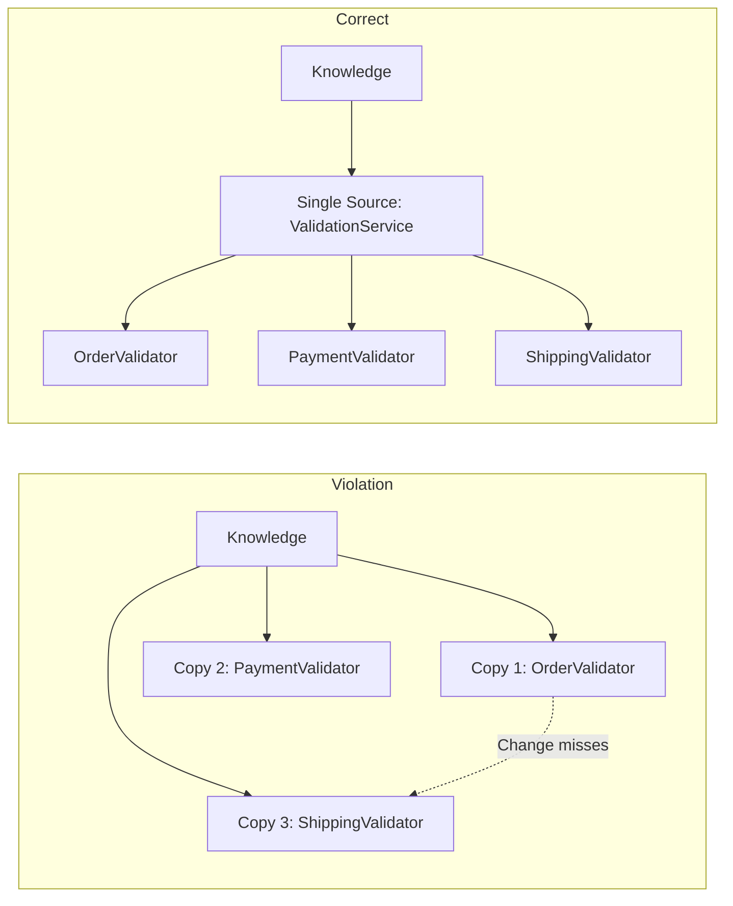
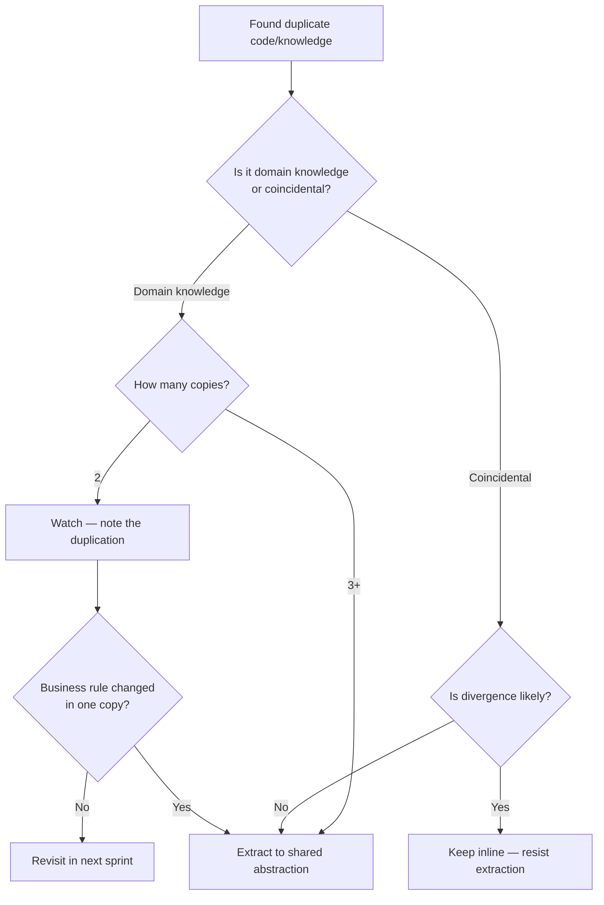

> [!success] Mastery Check
> - [ ] **Studied Well**
> - [ ] **Can explain the concept without notes**
> - [ ] **Can answer interview questions confidently**
> - [ ] **Can implement it in a real project**


## Navigation

**Domain:** [[6 — Design Principles & Patterns]] > **Group:** General Principles
**Previous:** [[6.005 — Dependency Inversion Principle]] | **Next:** [[6.007 — KISS]]

### Prerequisites
- [[6.005 — Dependency Inversion Principle]] — DRY often relies on abstractions extracted from repeated code; DIP guides how those abstractions should depend on stable contracts.

### Where This Fits
DRY is the foundational principle that every piece of knowledge must have a single, unambiguous, authoritative representation within a system. It sits alongside KISS and YAGNI as one of the three cardinal rules of pragmatic software design. DRY applies everywhere from database schemas to configuration files to business logic, but its most common battleground is C# code where duplication silently compounds maintenance debt.

---

## Core Mental Model

Every fact, rule, or piece of logic in a system should exist in exactly one place. When you need to change that fact, you change it once and the change propagates everywhere it is used. Violating DRY means the same knowledge is scattered — updating it requires finding every copy, and missing even one introduces a bug.



### Dimensions
- **Duplication Type** — Code duplication (same expressions), Knowledge duplication (same business rules), Document duplication (same specs in multiple places).
- **Extraction Unit** — Method, class, module, service, or dedicated assembly.
- **Abstraction Cost** — Every abstraction added to remove duplication introduces indirection; the cure must not be worse than the disease.
- **Mutability Profile** — Stable logic (domain invariants) benefits most from DRY; volatile logic (UI layouts) may tolerate controlled duplication.
- **Scope** — Within a method, within a class, within a bounded context, or across the entire system.

---

## Deep Mechanics

### How It Works

Consider a payment system where tax calculation is duplicated:

**Before (Violation):**
```
OrderProcessor.CalculateTotal()
  1. Lookup tax rate from database
  2. Apply rate to subtotal
  3. Return subtotal + tax

InvoiceGenerator.CalculateTotal()
  1. Lookup tax rate from database  // same query
  2. Apply rate to subtotal          // same formula
  3. Return subtotal + tax           // same result
```

**After (DRY Applied):**
```
TaxService.CalculateTax(subtotal)
  1. Lookup tax rate from database  // single ownership
  2. Return tax amount

OrderProcessor.CalculateTotal()
  1. Call TaxService.CalculateTax(subtotal)
  2. Return subtotal + tax

InvoiceGenerator.CalculateTotal()
  1. Call TaxService.CalculateTax(subtotal)
  2. Return subtotal + tax
```

The key insight: the *knowledge* of how tax is calculated now lives in `TaxService`. If tax logic changes (e.g., tiered rates, new jurisdiction rules), only `TaxService` is modified.

### Why It Matters at Scale
- A 500K LOC monolith with 40% duplication requires 2-3x the effort for feature changes compared to a DRY system.
- Bug cascades: a single missed duplicate in a security check can become a CVE.
- Onboarding: new engineers must learn N variations of the same rule instead of one canonical source.

---

## Production Code Patterns

### Implementation in C#

```csharp
// ❌ Violation — same rounding logic scattered across three handlers
public sealed record OrderTotalRequest(decimal Subtotal, decimal TaxRate);

public sealed class OrderHandler
{
    public decimal CalculateTotal(OrderTotalRequest request)
    {
        var raw = request.Subtotal * request.TaxRate;
        return Math.Round(raw, 2, MidpointRounding.AwayFromZero);
    }
}

public sealed class InvoiceHandler
{
    public decimal ComputeTotal(decimal sub, decimal rate)
    {
        var raw = sub * rate;
        return Math.Round(raw, 2, MidpointRounding.AwayFromZero);  // duplicate
    }
}

// ✅ Correct — rounding extracted into a single service
public interface IRoundingService
{
    decimal RoundToTwo(decimal value);
}

internal sealed class FinancialRoundingService : IRoundingService
{
    public decimal RoundToTwo(decimal value) =>
        Math.Round(value, 2, MidpointRounding.AwayFromZero);
}

public sealed class OrderHandler
{
    private readonly IRoundingService _rounding;

    public OrderHandler(IRoundingService rounding) => _rounding = rounding;

    public decimal CalculateTotal(OrderTotalRequest request)
    {
        var raw = request.Subtotal * request.TaxRate;
        return _rounding.RoundToTwo(raw);
    }
}
```

### ASP.NET Core / .NET Ecosystem Integration

```csharp
// Program.cs — registering a DRY extraction
var builder = WebApplication.CreateBuilder(args);

builder.Services.AddSingleton<IRoundingService, FinancialRoundingService>();
builder.Services.AddScoped<OrderHandler>();
builder.Services.AddScoped<InvoiceHandler>();

// Every handler now receives the same rounding service via DI.
// If rounding rules change (e.g., switch to MidpointRounding.ToZero),
// only FinancialRoundingService is updated.

var app = builder.Build();
```

---

## Gotchas & Anti-Patterns

### Premature Abstraction
**Wrong:** Extracting a `StringHelper` class because two methods both call `.Trim().ToLower()`.
```csharp
// ❌ Wrong — coincidental duplication, two different concepts
public static class StringHelper
{
    public static string Normalize(string input) => input.Trim().ToLower();
}
```
**Right:** Keep duplication until a third occurrence reveals the true abstraction.
```csharp
// ✅ Right — wait for the pattern to surface
// First two callers keep inline code
```
**Consequence:** Premature abstraction creates a coupling point that connects unrelated concepts, making future refactoring harder.

### Copy-Paste Inheritance
**Wrong:** Creating a base class `BaseRepository` with shared SQL just because two repositories have similar queries.
```csharp
// ❌ Wrong — inheritance for accidental similarity
public abstract class BaseRepository
{
    protected string BuildConnectionString() => "Server=...";
}
```
**Right:** Use composition via a dedicated `ConnectionStringProvider` service.
**Consequence:** Inheritance couples subclasses to base class behavior; a change for one subclass breaks the other.

### Configuration Duplication
**Wrong:** Copying connection strings or feature flags across `appsettings.Development.json`, `appsettings.Staging.json`, and `appsettings.Production.json`.
**Right:** Use a single source of truth — Azure Key Vault, user secrets, or environment variables with fallback.
**Consequence:** Rotating a database password becomes a nightmare of hunting down config files.

### Duplicated Business Rules in Tests
**Wrong:** Reimplementing the calculation logic inside test assertions.
```csharp
// ❌ Wrong — test duplicates the production logic it should verify
var expected = subtotal * 0.08m;  // same formula as the SUT
Assert.Equal(expected, actual);
```
**Right:** Use known input/output pairs from a verified source (e.g., a spreadsheet from the business).
**Consequence:** The test never fails because the bug is mirrored in the assertion.

### ORM Mapping Duplication
**Wrong:** Defining the same column mapping in EF Core Fluent API and a Dapper manual mapper.
**Right:** Pick one ORM per bounded context; if mixing, use a mapping generator or a shared metadata source.
**Consequence:** Renaming a column requires updating two mappers, and they will inevitably drift.

---

## Performance Implications

### Maintenance Cost Model

| Scenario | Defect Probability | Change Impact | Onboarding Cost |
|---|---|---|---|
| Followed | Low | Isolated to one module | Low — one source to learn |
| Violated | High | Cascading across N copies | High — N variations to understand |

- **Performance overhead of abstractions:** Extracting a method adds a stack frame but JIT inlines trivial methods. Service extraction adds a virtual call (~1ns). In hot paths, use `[MethodImpl(MethodImplOptions.AggressiveInlining)]` on extracted helpers.
- **Memory cost:** Each abstraction class adds negligible overhead (~32 bytes per type). The maintenance savings dwarf the memory cost.
- **Cold start impact:** More types increase assembly load time. For serverless functions, weigh DRY extraction against startup budget. Use source generators or static abstract members to inline at compile time (e.g., `INumber<T>`).

---

## Interview Arsenal

### Question Bank

1. What is the DRY principle and why does it matter?
2. How do you decide when to extract duplicated code versus leaving it inline?
3. Describe a time when applying DRY made the code worse.
4. How does DRY interact with the YAGNI principle?
5. Can you have too much DRY? What does that look like?
6. How would you eliminate duplication in an ASP.NET Core middleware pipeline?
7. What is the difference between code duplication and knowledge duplication?
8. How do you handle DRY when dealing with database migrations across environments?
9. Does DRY apply to configuration files? How?
10. How would you apply DRY in a microservices architecture?

### Spoken Answers

> **Average answer (Q1):** DRY means don't write the same code twice. You should extract it into a method or class to avoid having to fix bugs in multiple places.

> **Great answer (Q1):** DRY — Don't Repeat Yourself — means every piece of knowledge should have a single, unambiguous representation in the system. It distinguishes between *accidental duplication* (coincidentally similar code) and *essential duplication* (the same domain knowledge expressed multiple times). For example, if tax calculation logic appears in both `OrderProcessor` and `InvoiceGenerator`, a rate change requires updating two places — and the inevitable miss causes a production bug. The cost is not just typing: it's cognitive load, inconsistent behavior, and increased surface area for defects.

> **Average answer (Q3):** I once extracted everything into shared utility classes and it became hard to understand the flow. Now I'm more careful.

> **Great answer (Q3):** In a payment processing system, I extracted validation logic into a shared `PaymentValidator` base class used by both credit card and PayPal handlers. The base class grew conditionals for provider-specific rules, violating the Open-Closed Principle and creating a god class. The right approach was to keep validation logic separate (allowing duplication) until we had three or more providers, at which point a Strategy pattern emerged naturally. The lesson: DRY applied too early creates coupling that is harder to undo than the original duplication was to maintain.

### Trick Question

**"If I have two identical methods in two different classes, should I always extract them into a shared base class?"**

Why it is a trap: It conflates coincidental similarity with shared domain knowledge.

Correct answer: Not always. If the methods happen to look the same today but represent different domain concepts — e.g., `CalculateDiscount` for promotions and `CalculateTax` for billing — they will diverge tomorrow. DRY is about *knowledge duplication*, not *code duplication*. Wait until three occurrences confirm the pattern, or until a business rule change forces updates to both. Premature extraction couples unrelated concepts to a shared abstraction, which is often worse than the duplication.

### Comparison Table

| Aspect | DRY | YAGNI |
|---|---|---|
| Intent | Eliminate redundant knowledge | Eliminate speculative generality |
| Participants | Duplicated code/knowledge vs extracted abstraction | Current requirements vs future-proofing |
| When to use | After confirming duplication is essential, not coincidental | Always during initial implementation |
| .NET example | Extracting `IRoundingService` from two handlers | Not adding `IOrderRepository` until a second data source exists |
| Key difference | DRY says extract when repeated; YAGNI says don't build until needed. They conflict when you extract preemptively — YAGNI wins that debate. |

---

## Decision Framework

### When to Apply



### Application Checklist
- [ ] I verified the duplication represents the same *knowledge*, not just similar *code*.
- [ ] I have at least three occurrences before extracting (or one occurrence with a confirmed future use case).
- [ ] The extracted abstraction has a clear name that reveals its intent.
- [ ] I can inject the abstraction via DI rather than hard-coding a dependency.
- [ ] I documented the rationale in a comment at the extraction site.

### Tradeoff Summary

| Factor | Follow DRY | Violate DRY |
|---|---|---|
| Change velocity in stable domains | High | Low |
| Flexibility for divergent evolution | Low — abstraction resists divergence | High — each copy can evolve independently |
| Onboarding friction | Low — one source to learn | High — N sources to discover |
| Refactoring cost | Upfront abstraction design | Compound interest on duplication |

---

## Self-Check

### Conceptual Questions

1. What distinguishes knowledge duplication from code duplication?
2. Why is three occurrences the recommended threshold for extraction?
3. How can premature DRY violate the Open-Closed Principle?
4. Does DRY apply to comments? When should you deduplicate comments vs let them diverge?
5. How does DRY interact with the Single Responsibility Principle?
6. What is the "Rule of Three" in refactoring and how does it relate to DRY?
7. Can configuration files be DRY? Give a .NET example.
8. How would you apply DRY to ASP.NET Core middleware (e.g., logging, auth)?
9. Why is test code duplication sometimes acceptable?
10. In a microservice architecture, when should you share code via NuGet packages versus duplicating across services?

<details><summary>Answers</summary>

1. Knowledge duplication is when the same business fact appears in multiple places (e.g., "orders over $1000 require manager approval"). Code duplication is when two blocks happen to look the same but represent different concepts (e.g., two `.Select(x => x.Name)` calls for different entities).
2. Two occurrences could be coincidence; three confirms the pattern is intrinsic. The "Rule of Three" provides a statistical heuristic that avoids premature abstraction.
3. A shared base class extracted for DRY often accumulates conditionals to serve all subclasses, becoming a god class that violates Open-Closed.
4. Yes — if a comment explains the same business rule in two places, extract a well-named method and let the method name replace both comments.
5. SRP says a class should have one reason to change. DRY extraction that puts two different responsibilities into the same class violates SRP. Ensure the extracted unit has a single, cohesive purpose.
6. The Rule of Three states you refactor duplication into an abstraction only at the third occurrence. It directly implements DRY with a safety guard against premature extraction.
7. Yes — in .NET, use `IEnvironmentConfiguration` or user secrets to avoid duplicating connection strings across `appsettings.*.json` files. Alternatively, use environment variable overrides and a single base config.
8. Extract common middleware behavior into an `IMiddleware` implementation registered via `app.UseMiddleware<T>()`. Shared logic like exception handling, request logging, or culture detection belongs in one middleware class, not inline `Use(...)` delegates.
9. Test code duplication is acceptable when it keeps tests isolated and readable. A shared test helper that couples all tests to one abstraction makes test failures harder to diagnose. Prefer duplication in test arrange blocks over shared setup methods.
10. Share only stable, domain-agnostic contracts (DTOs, validation primitives, telemetry) via NuGet. Duplicate volatile business logic per service to prevent coupling. Use `SharedKernel` packages sparingly and version them strictly.

</details>

### Code Puzzles

**Puzzle 1:** Identify the DRY violation in this code and refactor it.
```csharp
public sealed class OrderService
{
    public bool IsOrderValid(Order order) =>
        order.Amount > 0 && order.CustomerId != Guid.Empty && order.CreatedAt > DateTime.MinValue;

    public bool IsPaymentValid(Payment payment) =>
        payment.Amount > 0 && payment.CustomerId != Guid.Empty && payment.CreatedAt > DateTime.MinValue;
}
```
<details><summary>Answer</summary>
The validation tuple `Amount > 0 && CustomerId != Guid.Empty && CreatedAt > DateTime.MinValue` is duplicated knowledge. Extract to a `ValidateEntity` method or use a base record constraint. Better yet, introduce a `ValidatedEntityBase` record type with a `Validate()` method.
</details>

**Puzzle 2:** The following code violates DRY. How would you fix it?
```csharp
var config = new ConfigurationBuilder()
    .SetBasePath(Directory.GetCurrentDirectory())
    .AddJsonFile("appsettings.json")
    .Build();

var connString = config.GetConnectionString("DefaultConnection");
```

This appears in three different project startup files.
<details><summary>Answer</summary>
Extract into a shared `Infrastructure` project. Create a `static class ConfigurationFactory` with a `Build()` method. Each project calls `ConfigurationFactory.Build()` instead of repeating builder setup.
</details>

**Puzzle 3:** What is wrong with this DRY extraction?
```csharp
public static class MathHelper
{
    public static int Add(int a, int b) => a + b;
}
```
<details><summary>Answer</summary>
`a + b` is fundamental language syntax, not domain knowledge. Extracting basic operators into helpers creates unnecessary indirection. The JIT compiles `+` to a single IL instruction; wrapping it in a method call adds overhead with zero knowledge-consolidation benefit. This is over-DRY.
</details>

**Puzzle 4:** Find the DRY violation in this ASP.NET Core configuration duplication.
```csharp
// In Startup.Configure
app.UseAuthentication();
app.UseAuthorization();

// In a middleware class
public sealed class AuthMiddleware
{
    private readonly RequestDelegate _next;
    public AuthMiddleware(RequestDelegate next) => _next = next;
    public async Task InvokeAsync(HttpContext context)
    {
        // manually checks authentication
        if (!context.User.Identity?.IsAuthenticated ?? false)
        {
            context.Response.StatusCode = 401;
            return;
        }
        await _next(context);
    }
}
```
<details><summary>Answer</summary>
The middleware manually reimplements what `app.UseAuthentication()` already provides. Either rely entirely on the framework middleware or build custom middleware that extends (not replaces) the built-in auth pipeline.
</details>

**Puzzle 5:** Refactor this to be DRY without adding a base class.
```csharp
public record Customer(string Name, string Email);
public record Employee(string Name, string Email);
```
<details><summary>Answer</summary>
Introduce a shared record type:
```csharp
public record Person(string Name, string Email);
public record Customer : Person;
public record Employee : Person;
```
Or better, use composition:
```csharp
public sealed record ContactInfo(string Name, string Email);
public sealed record Customer(ContactInfo Contact);
public sealed record Employee(ContactInfo Contact);
```
</details>
