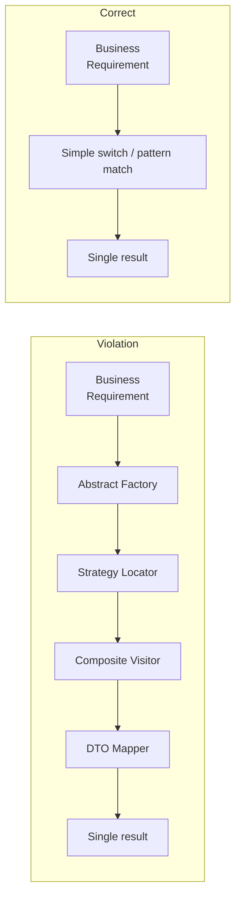
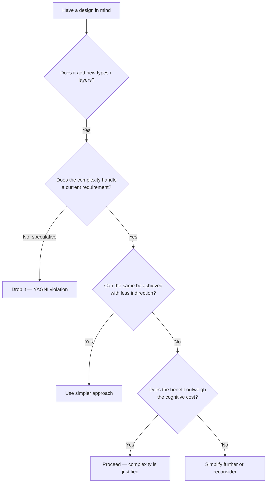

> [!success] Mastery Check
> - [ ] **Studied Well**
> - [ ] **Can explain the concept without notes**
> - [ ] **Can answer interview questions confidently**
> - [ ] **Can implement it in a real project**


## Navigation

**Domain:** [[6 — Design Principles & Patterns]] > **Group:** General Principles
**Previous:** [[6.006 — DRY]] | **Next:** [[6.008 — YAGNI]]

### Prerequisites
- [[6.006 — DRY]] — DRY reduces duplication, but over-applying it can add complexity that violates KISS. Understanding the tension between the two is essential.

### Where This Fits
KISS is the principle that most systems work best when they are kept simple rather than made complicated. It serves as the primary counterweight to over-engineering, abstraction-lust, and speculative generality. In the .NET ecosystem, KISS guides decisions like choosing Minimal APIs over Controllers, `Dictionary<string,string>` over a custom Options class, and inline LINQ over a complex visitor pattern.

---

## Core Mental Model

Simplicity is the ultimate sophistication — but simple does not mean simplistic. A KISS-compliant solution solves today's problem with the minimum viable structure, avoiding layers of indirection, abstraction, or generality that are not yet justified. The measure is not lines of code but *cognitive load*: how much a developer must hold in working memory to understand a given piece of code.



### Dimensions
- **Structural Simplicity** — Number of types, layers, and abstractions. Fewer moving parts = fewer failure modes.
- **Cognitive Simplicity** — How easy it is to trace a code path from input to output. Deep inheritance hierarchies fail this dimension.
- **Operational Simplicity** — How easy the system is to deploy, monitor, and debug. A simple console app beats a microservice mesh unless the complexity is justified.
- **Evolution Simplicity** — How easy it is to change the code tomorrow. Simple code is easy to delete and rewrite; complex code is too risky to touch.

---

## Deep Mechanics

### How It Works

Consider an endpoint that returns a user's display name:

**Before (Over-Engineered):**
```
GetUserDisplayNameHandler:
  1. Command object: GetUserDisplayNameQuery
  2. Validator: GetUserDisplayNameQueryValidator
  3. Handler: GetUserDisplayNameHandler (injected via IRequestHandler<GetUserDisplayNameQuery, string>)
  4. Response: string (auto-mapped via ResponseMapper)
  5. Profile: AutoMapper profile for User -> string
  Total: 5 types + registration + 4 files
```

**After (KISS Applied):**
```
Minimal API endpoint:
  app.MapGet("/users/{id}/display-name", async (int id, AppDbContext db) =>
      await db.Users.Where(u => u.Id == id).Select(u => u.DisplayName).FirstOrDefaultAsync()
  );
  Total: 1 file, 10 lines, zero abstractions beyond what EF Core provides
```

### Why It Matters at Scale
- A complex abstraction layer in a 200K LOC system forces every contributor to learn the *framework on top of the framework* before they can be productive.
- Simple code has fewer defects per line because the mental model fits in a single screen.
- When the business changes (and it always does), simple code is cheap to discard and replace. Complex abstractions fossilize.

---

## Production Code Patterns

### Implementation in C#

```csharp
// ❌ Violation — over-abstracted greeting logic
public interface IGreetingStrategy
{
    string GenerateGreeting(string name, TimeOfDay time);
}

public sealed class MorningGreetingStrategy : IGreetingStrategy
{
    public string GenerateGreeting(string name, TimeOfDay time) =>
        time == TimeOfDay.Morning ? $"Good morning, {name}" : string.Empty;
}

public sealed class AfternoonGreetingStrategy : IGreetingStrategy
{
    public string GenerateGreeting(string name, TimeOfDay time) =>
        time == TimeOfDay.Afternoon ? $"Good afternoon, {name}" : string.Empty;
}

public sealed class GreetingStrategySelector
{
    private readonly IEnumerable<IGreetingStrategy> _strategies;

    public GreetingStrategySelector(IEnumerable<IGreetingStrategy> strategies) =>
        _strategies = strategies;

    public string SelectAndExecute(string name, TimeOfDay time) =>
        _strategies.Select(s => s.GenerateGreeting(name, time))
                   .FirstOrDefault(r => !string.IsNullOrEmpty(r)) ?? "Hello";
}

// ✅ Correct — simple switch expression
public static string Greet(string name, TimeOfDay time) => time switch
{
    TimeOfDay.Morning => $"Good morning, {name}",
    TimeOfDay.Afternoon => $"Good afternoon, {name}",
    _ => $"Hello, {name}"
};
```

### ASP.NET Core / .NET Ecosystem Integration

```csharp
// ❌ Violation — Controllers + MediatR for simple CRUD
[ApiController]
[Route("api/[controller]")]
public sealed class ProductsController : ControllerBase
{
    private readonly IMediator _mediator;

    public ProductsController(IMediator mediator) => _mediator = mediator;

    [HttpGet("{id}")]
    public async Task<ActionResult<ProductResponse>> Get(int id)
    {
        var query = new GetProductQuery(id);
        var result = await _mediator.Send(query);
        return Ok(result);
    }
}

// ✅ Correct — Minimal API, zero ceremony
var app = WebApplication.Create(args);

app.MapGet("/api/products/{id}", async (int id, AppDbContext db) =>
    await db.Products.FindAsync(id) is { } product
        ? Results.Ok(product)
        : Results.NotFound());

app.Run();
```

---

## Gotchas & Anti-Patterns

### Framework-on-Framework
**Wrong:** Adding a custom wrapper on top of every .NET library you use (e.g., `IMyLogger` wrapping `ILogger<T>`).
```csharp
// ❌ Wrong — zero-value abstraction
public interface IMyLogger
{
    void LogInfo(string message);
}
internal sealed class MyLoggerAdapter : IMyLogger
{
    private readonly ILogger<MyLoggerAdapter> _logger;
    public void LogInfo(string message) => _logger.LogInformation(message);
}
```
**Right:** Use `ILogger<T>` directly. Add abstractions only when you need to swap implementations or mock in tests — and for logging, you never do.
**Consequence:** Every layer of wrapper adds maintenance cost, increases assembly size, slows cold start, and contributes nothing to functionality.

### God Switch Statement
**Wrong:** Replacing a strategy pattern with a single 200-line switch.
```csharp
// ❌ Wrong — false simplicity, violates Open-Closed
return notificationType switch
{
    "email" => EmailService.Send(...),
    "sms" => SmsService.Send(...),
    "push" => PushService.Send(...),
    "slack" => SlackService.Send(...),
    "teams" => TeamsService.Send(...),
    // ... 8 more cases
    _ => throw new NotSupportedException()
};
```
**Right:** Use a dictionary of delegates or a strategy interface when the case count exceeds 5-7 and new types are added frequently.
**Consequence:** The switch grows unbounded, becomes a merge conflict magnet, and violates Open-Closed.

### Silver Bullet Syndrome
**Wrong:** Adopting CQRS + MediatR + AutoMapper + FluentValidation for every single endpoint, including a `GET /healthz` ping.
**Right:** Choose Minimal APIs for simple endpoints, introduce MediatR only when cross-cutting concerns (logging, validation, retry) must be applied uniformly across many handlers.
**Consequence:** Architectural cargo-culting multiplies boilerplate 5x for each new endpoint.

### Clever One-Liners
**Wrong:** Chaining 12 LINQ operations into an unreadable pipeline.
```csharp
// ❌ Wrong — maximum cleverness, minimum readability
var result = data.Where(x => x.IsActive).GroupBy(x => x.Type)
    .Select(g => g.OrderByDescending(x => x.Date).First())
    .ToDictionary(x => x.Id, x => x.Value);
```
**Right:** Break into named steps with descriptive variables.
```csharp
var activeItems = data.Where(x => x.IsActive);
var latestPerType = activeItems.GroupBy(x => x.Type)
    .Select(g => g.MaxBy(x => x.Date));
var lookup = latestPerType.ToDictionary(x => x.Id, x => x.Value);
```
**Consequence:** Debugging and modifying the clever version requires tracing through each operation mentally; the simpler version is self-documenting.

---

## Performance Implications

### Maintenance Cost Model

| Scenario | Defect Probability | Change Impact | Onboarding Cost |
|---|---|---|---|
| Followed | Low | Localized — one path to change | Low — minimal context needed |
| Violated | Medium-High | Cascading abstraction changes | High — must learn custom framework |

- **Complexity tax:** Each additional abstraction layer adds 5-10% overhead in cold start (DI resolution, assembly loading). For serverless, this directly impacts P50 latency.
- **JIT optimization:** Simple code is easier for the JIT to inline and optimize. Deep call chains (abstraction-heavy) defeat inlining heuristics.
- **Developer velocity:** Studies show a 2x-3x reduction in feature delivery time when complex code is refactored to simple equivalents (source: DORA metrics on maintainability).

---

## Interview Arsenal

### Question Bank

1. What does KISS stand for and why is it important?
2. How do you distinguish between "simple" and "simplistic"?
3. When should you violate KISS? What justifies increased complexity?
4. How does KISS relate to YAGNI?
5. Give an example of a .NET feature that can easily violate KISS when misused.
6. How do you introduce complexity incrementally without pre-architecting?
7. Can a Minimal API become too complex? At what point should you refactor to Controllers?
8. How does KISS apply to database design?
9. What's the relationship between KISS and technical debt?
10. How do you sell simplicity to a team that values "enterprise patterns"?

### Spoken Answers

> **Average answer (Q1):** KISS means Keep It Simple, Stupid. Don't over-engineer things. Write code that's easy to understand.

> **Great answer (Q1):** KISS means Keep It Simple — the principle that systems work best when they have the minimum complexity needed to satisfy current requirements. In .NET, this manifests as choosing Minimal APIs over Controllers for simple endpoints, using `Dictionary<string, string>` instead of a custom `IOptions<T>` wrapper for one-off config values, and preferring a straightforward `switch` expression over a strategy pattern until the switch grows beyond ~7 cases. The real metric is cognitive load — can a developer reading this code for the first time understand the full happy path in under 30 seconds?

> **Average answer (Q3):** Sometimes you need complexity for performance or extensibility. You shouldn't over-simplify things that need to be complex.

> **Great answer (Q3):** Violate KISS when you have *current* evidence of need — not speculation. In .NET, introduce MediatR when you have 5+ request handlers that all need the same pipeline behaviors (logging, validation, retry). Introduce a separate class library when the type count in a single project exceeds ~50 and responsibilities are clearly separable. Introduce a message broker when you have confirmed latency constraints that HTTP can't meet. The key is that every complexity-add must be justified by a concrete, present-tense requirement — never by "we might need this later" (that's YAGNI territory).

### Trick Question

**"Keep it simple means never use design patterns, right?"**

Why it is a trap: It conflates simplicity with primitiveness. Design patterns are tools; using them correctly reduces complexity by giving a shared vocabulary.

Correct answer: No — KISS means using the simplest *effective* solution. A well-placed Strategy pattern that eliminates a 200-line switch is simpler than the switch, not more complex. The goal is to minimize total cognitive load across the codebase. Patterns become a KISS violation when they are applied prophylactically — "we'll use MediatR because it's the 'right' way" — without solving an actual problem they address.

### Comparison Table

| Aspect | KISS | YAGNI |
|---|---|---|
| Intent | Minimize complexity of current solution | Eliminate speculative features |
| Participants | Solution structure vs over-engineering | Current requirements vs extra functionality |
| When to use | Always when designing a solution | Always when deciding scope |
| .NET example | Minimal API vs Controllers | Not adding a `SoftDeleteFilter` when no soft-delete requirement exists |
| Key difference | KISS governs *how* you solve it; YAGNI governs *what* you solve. Both reduce unnecessary work from different angles. |

---

## Decision Framework

### When to Apply



### Application Checklist
- [ ] I can explain this code to a junior developer in under 2 minutes.
- [ ] Every abstraction layer has a documented, present-tense justification.
- [ ] I am not using a design pattern where a language feature (switch, pattern matching, delegate) would suffice.
- [ ] The solution fits on one screen or is logically grouped into single-purpose files.
- [ ] I have not introduced a NuGet package where BCL types would work.

### Tradeoff Summary

| Factor | Follow KISS | Violate KISS |
|---|---|---|
| Development speed | Fast early, sustained | Slow early, may slow further |
| Flexibility | Low — easy to replace | High — but hard to change safely |
| Debugging | Straightforward — few indirections | Trace through abstraction layers |
| Onboarding | Minutes to productive | Days to learn the architecture |

---

## Self-Check

### Conceptual Questions

1. What is the difference between "simple" and "easy" in software design?
2. How does KISS apply to exception handling?
3. When does a switch statement stop being KISS and become a maintenance liability?
4. What is the relationship between KISS and the Single Responsibility Principle?
5. How does KISS guide package/module structure in a .NET solution?
6. Can unit tests violate KISS? How?
7. What is "incidental complexity" and how does KISS address it?
8. How does KISS interact with performance optimization?
9. Why is "clever code" often a KISS violation?
10. How would you apply KISS to a distributed system design?

<details><summary>Answers</summary>

1. Simple means few conceptual elements with minimal interactions. Easy means familiar. A minimal API is simple; a complex fluent interface the team already knows is easy but not simple. KISS prioritizes simple.
2. KISS says use the language's built-in exception handling. Don't create a `Result<T>` type for every operation — use exceptions for exceptional paths and `Nullable<T>` / `TryParse` for expected failures.
3. Around 5-7 cases, when new cases are added monthly, or when the switch body exceeds 50 lines. At that point, a strategy dispatch (dictionary of delegates) is simpler.
4. KISS and SRP both push toward focused units. A class that does one thing is simpler than a class that does ten things.
5. KISS suggests a single-project approach until there is a clear boundary (e.g., UI vs domain vs infrastructure). Don't split into `Domain`, `Application`, `Infrastructure` projects until the codebase justifies separate deployment or team ownership.
6. Yes — tests with elaborate setup chains, mocks of mocks, or complex parameterized test matrices violate KISS. A straightforward `[Fact]` with inline data is better than a theory with 20 `[MemberData]` rows.
7. Incidental complexity is complexity that arises from the solution approach rather than the problem. KISS eliminates incidental complexity by choosing the most direct path.
8. Premature optimization is a KISS violation. Optimize only when profiling confirms a bottleneck. Use simple code first, then optimize the hot spots.
9. Clever code optimizes for writer satisfaction rather than reader comprehension. A clever one-liner that takes 5 minutes to parse is objectively more complex than 10 lines of straightforward code.
10. In distributed systems, KISS means prefer direct HTTP calls over message brokers, prefer a monolith over microservices, and prefer a single database over CQRS/event sourcing. Only add distribution when the constraints force it.

</details>

### Code Puzzles

**Puzzle 1:** Simplify this over-abstracted validation code.
```csharp
public interface IValidator<in T>
{
    ValidationResult Validate(T instance);
}

public sealed class OrderValidator : IValidator<Order>
{
    public ValidationResult Validate(Order order) =>
        order.Amount > 0 ? ValidationResult.Success : ValidationResult.Failure("Amount must be positive");
}
```
<details><summary>Answer</summary>
Since there's only one validator, inline it:
```csharp
public static ValidationResult ValidateOrder(Order order) =>
    order.Amount > 0 ? ValidationResult.Success : ValidationResult.Failure("Amount must be positive");
```
Or use FluentValidation's built-in `AbstractValidator<Order>` directly without the custom interface wrapper.
</details>

**Puzzle 2:** What is over-engineered here? Refactor to be simpler.
```csharp
public sealed class TemperatureConverter
{
    private readonly ITemperatureStrategy _strategy;
    public TemperatureConverter(ITemperatureStrategy strategy) => _strategy = strategy;
    public double Convert(double value) => _strategy.Convert(value);
}

public interface ITemperatureStrategy { double Convert(double value); }
public sealed class CelsiusToFahrenheit : ITemperatureStrategy
{
    public double Convert(double value) => value * 9 / 5 + 32;
}
```
<details><summary>Answer</summary>
Replace the strategy + interface + DI with a static method:
```csharp
public static double CelsiusToFahrenheit(double c) => c * 9 / 5 + 32;
```
Only introduce a strategy when the caller needs to swap conversion algorithms at runtime.
</details>

**Puzzle 3:** Simplify this endpoint registration.
```csharp
public interface IEndpoint
{
    void Register(IEndpointRouteBuilder app);
}

public sealed class HealthEndpoint : IEndpoint
{
    public void Register(IEndpointRouteBuilder app)
    {
        app.MapGet("/health", () => Results.Ok(new { Status = "Healthy" }));
    }
}

// Program.cs
var endpoints = app.Services.GetRequiredService<IEnumerable<IEndpoint>>();
foreach (var e in endpoints) e.Register(app);
```
<details><summary>Answer</summary>
```csharp
app.MapGet("/health", () => Results.Ok(new { Status = "Healthy" }));
```
A single line of code. The endpoint registration pattern is justified only when you have 20+ endpoints and need to organize them across files.
</details>

**Puzzle 4:** Spot the KISS violation in this payment processing.
```csharp
public sealed class PaymentProcessor
{
    private readonly IPaymentGatewayFactory _factory;
    private readonly IPaymentValidator _validator;
    private readonly IPaymentLogger _logger;
    private readonly IPaymentAuditor _auditor;

    public async Task<PaymentResult> ProcessAsync(PaymentRequest request)
    {
        _validator.Validate(request);
        var gateway = _factory.Create(request.Provider);
        var result = await gateway.ChargeAsync(request);
        _logger.Log(request, result);
        _auditor.Audit(request, result);
        return result;
    }
}
```
<details><summary>Answer</summary>
The four separate abstractions (`IPaymentGatewayFactory`, `IPaymentValidator`, `IPaymentLogger`, `IPaymentAuditor`) each add an interface + implementation. If logging and auditing are simple, merge them into a single `IPaymentGateway` interface, or use MediatR behaviors / middleware instead of manual injection of four collaborators. A simpler `PaymentProcessor` would take two dependencies: `IPaymentGateway` and `IOptions<PaymentOptions>`.
</details>

**Puzzle 5:** What would be the KISS-compliant way to handle this feature toggle?
```csharp
public interface IFeatureToggle
{
    bool IsEnabled(string feature);
}

public sealed class FeatureToggle : IFeatureToggle
{
    private readonly IConfiguration _config;
    public FeatureToggle(IConfiguration config) => _config = config;
    public bool IsEnabled(string feature) => _config.GetValue<bool>($"Features:{feature}");
}
```
<details><summary>Answer</summary>
Use `IConfiguration` directly where the toggle is needed. Only extract a `FeatureToggle` service when toggles are consumed in 5+ locations:
```csharp
if (configuration.GetValue<bool>("Features:NewCheckout"))
{
    // new logic
}
```
Even better, use `IOptionsSnapshot<FeatureFlags>` with a strongly typed `FeatureFlags` class — simple, typed, zero custom abstractions.
</details>
