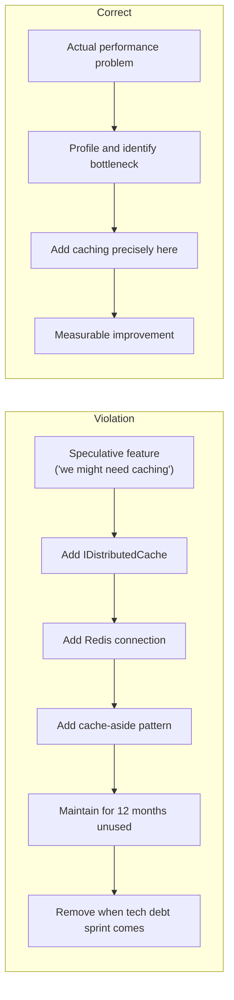
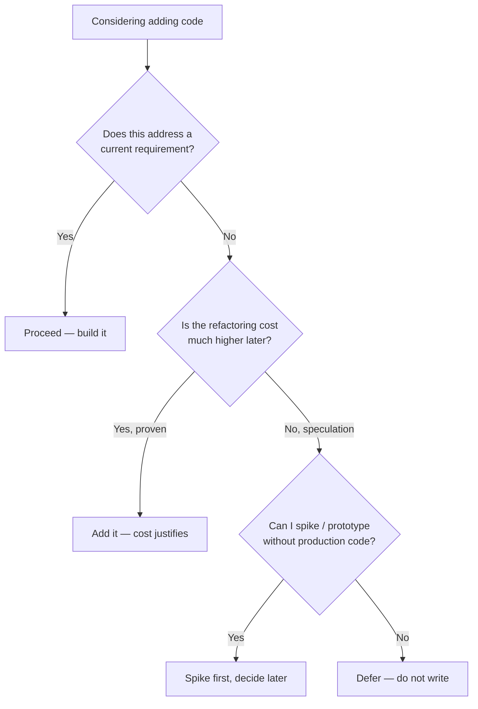

> [!success] Mastery Check
> - [ ] **Studied Well**
> - [ ] **Can explain the concept without notes**
> - [ ] **Can answer interview questions confidently**
> - [ ] **Can implement it in a real project**


## Navigation

**Domain:** [[6 — Design Principles & Patterns]] > **Group:** General Principles
**Previous:** [[6.007 — KISS]] | **Next:** [[6.009 — Composition Over Inheritance]]

### Prerequisites
- [[6.007 — KISS]] — YAGNI is KISS's tactical sibling: KISS says keep the solution simple, YAGNI says don't build solutions you don't currently need.

### Where This Fits
YAGNI emerges from Extreme Programming and the Agile movement. It is the single most effective defense against over-engineering, gold-plating, and speculative generality. YAGNI directly contradicts the common intuition that "it's cheap to add it now while we're here." In the .NET world, YAGNI is the voice that questions adding a `IRepository<T>` abstraction before a second data store is required, or adding a message queue before the first throughput bottleneck appears.

---

## Core Mental Model

Every line of code you write is a liability — it must be compiled, tested, debugged, documented, understood, and maintained. YAGNI says: do not write code that addresses requirements you don't have today, no matter how inevitable they seem. The cost of adding it later (when you actually need it) is less than the cumulative cost of carrying it from day one.



### Dimensions
- **Scope of Speculation** — A method parameter (we might need pagination), a class abstraction (we might need multiple implementations), a service (we might need a message queue), or a new project (we might need microservices).
- **Irreversibility** — Some decisions are costly to undo (database schema, public API contracts). YAGNI relaxes for irreversible choices but still prefers minimal surface.
- **Refactoring Cost** — If adding the feature later costs roughly the same as adding it now, defer. YAGNI is about exploiting the time value of code — unused code depreciates in value while imposing ongoing cost.

---

## Deep Mechanics

### How It Works

Consider building a report generation endpoint where the requirement today is CSV output:

**Before (YAGNI Violated):**
```
1. Build ReportController with Accept header negotiation
2. Add ICsvFormatter, IJsonFormatter, IXmlFormatter, IPdfFormatter
3. Register all formatters in DI
4. Implement CSV formatter (current need)
5. Stub out JSON, XML, PDF formatters (empty or NotImplemented)
6. Write integration tests for all four format types
Effort: 4x the required scope, 6 months of maintaining stubs
```

**After (YAGNI Applied):**
```
1. Build a Minimal API endpoint
2. Write CSV output inline using StringBuilder
3. Ship it
Effort: the actual requirement only
Future: When JSON is needed, add formatter then
```

### Why It Matters at Scale
- In a 50-engineer org, speculative features consume 20-40% of total development effort (industry observation).
- Unused code is not inert — it creates merge conflicts, false positives in code search, confusion during onboarding, and attack surface for security vulnerabilities.
- The sunk-cost fallacy: teams resist removing speculative code because "we already wrote it," even though it has zero business value.

---

## Production Code Patterns

### Implementation in C#

```csharp
// ❌ Violation — speculative IRepository<T> before a second store exists
public interface IRepository<T>
{
    Task<T?> GetByIdAsync(int id);
    Task<IReadOnlyList<T>> GetAllAsync();
    Task AddAsync(T entity);
    Task UpdateAsync(T entity);
    Task DeleteAsync(int id);
}

public sealed class ProductRepository : IRepository<Product>
{
    private readonly AppDbContext _db;
    public ProductRepository(AppDbContext db) => _db = db;

    public async Task<Product?> GetByIdAsync(int id) =>
        await _db.Products.FindAsync(id);

    public async Task<IReadOnlyList<Product>> GetAllAsync() =>
        await _db.Products.ToListAsync();

    // ... remaining methods
}

// ✅ Correct — direct DbContext usage until a second provider exists
public sealed class ProductService
{
    private readonly AppDbContext _db;

    public ProductService(AppDbContext db) => _db = db;

    public async Task<Product?> GetByIdAsync(int id) =>
        await _db.Products.FindAsync(id);
}
```

### ASP.NET Core / .NET Ecosystem Integration

```csharp
// ❌ Violation — adding Redis cache speculatively
builder.Services.AddStackExchangeRedisCache(options =>
{
    options.Configuration = builder.Configuration.GetConnectionString("Redis");
});

// Later, in a service:
public sealed class CatalogService
{
    private readonly IDistributedCache _cache; // unused for 8 months

    public CatalogService(IDistributedCache cache) => _cache = cache;
}

// ✅ Correct — add caching only when performance metrics demand it
public sealed class CatalogService
{
    private readonly AppDbContext _db;
    public CatalogService(AppDbContext db) => _db = db;

    // When profiling shows a bottleneck, add IDistributedCache here
    // — at that point, the requirement is real, not speculative
}
```

---

## Gotchas & Anti-Patterns

### Stub-for-Testability
**Wrong:** Adding `IOrderRepository` because "we might need to mock it in tests."
```csharp
// ❌ Wrong — interface created for testability, not polymorphism
public interface IOrderRepository { ... }
```
**Right:** Mock `AppDbContext` using an in-memory provider or the repository's actual implementation. Only extract an interface when you have a second implementation.
**Consequence:** Every domain aggregate gets a repository interface, multiplying types 2x and creating a maintenance burden across the entire codebase.

### Config Over-abstraction
**Wrong:** Wrapping every configuration key in a typed Options class with validation.
```csharp
// ❌ Wrong — 10 options classes, 5 are used in one place
public sealed class EmailOptions
{
    public const string Section = "Email";
    public string SmtpServer { get; init; } = string.Empty;
    public int Port { get; init; }
    public string Username { get; init; } = string.Empty;
    public string Password { get; init; } = string.Empty;
}
```
**Right:** Use `IConfiguration["Email:SmtpServer"]` inline for one-off values. Promote to `IOptions<T>` only when the options are consumed in multiple places.
**Consequence:** Developer hostility — every appsetting requires navigating a maze of Options classes before the value is actually used.

### Speculative Logging
**Wrong:** Adding structured logging of every method parameter "for debugging."
```csharp
// ❌ Wrong — logs everything speculatively
_logger.LogInformation("ProcessOrder called: {OrderId}, {CustomerId}, {Amount}, {ItemsCount}",
    order.Id, order.CustomerId, order.Amount, order.Items.Count);
```
**Right:** Log only at meaningful boundaries (errors, state transitions, external calls). Add detailed logging when investigating a specific production issue.
**Consequence:** Log noise buries real signals, increases storage costs, and creates PII exposure risk.

### Premature Performance
**Wrong:** Adding `ConcurrentDictionary` caches, `ValueTask`, or `Span<byte>` optimizations before profiling.
**Right:** Write the simple version first. Profile. Optimize the top 3 bottlenecks. The one thing you thought would be slow rarely is.
**Consequence:** Premature optimization code is harder to read, harder to refactor, and frequently wrong about the actual bottleneck.

---

## Performance Implications

### Maintenance Cost Model

| Scenario | Defect Probability | Change Impact | Onboarding Cost |
|---|---|---|---|
| Followed | Low — only ships needed code | Focused on real requirements | Low — less code to learn |
| Violated | Medium — unused code may have subtle bugs | Speculative abstractions complicate real changes | High — must understand speculative code to determine it's irrelevant |

- **Executable bloat:** Every speculative abstraction adds IL, increasing cold start and assembly load time. In serverless, a 10% increase in assembly bytes can add 200-500ms to cold starts.
- **Compile-time cost:** More types = longer compilation. A speculative interface hierarchy can add 15-30% to build times in large solutions.
- **Testing tax:** Speculative abstractions require speculative tests. Unused code at 80% coverage still costs CI time and maintenance.

---

## Interview Arsenal

### Question Bank

1. What is YAGNI and where does it come from?
2. How do you distinguish between "good preparation" and "YAGNI violation"?
3. When should you violate YAGNI? What justifies building something before it's needed?
4. How do YAGNI and DRY conflict? How do you resolve the tension?
5. What is the cost of carrying speculative code in a codebase?
6. How do you handle YAGNI in a .NET API design (public contracts)?
7. How does YAGNI apply to database schema design?
8. How does YAGNI relate to the "last responsible moment" concept?
9. What's a concrete example of a YAGNI violation you've seen in ASP.NET Core projects?
10. How would you convince a product manager that building "just in case" features is wasteful?

### Spoken Answers

> **Average answer (Q1):** YAGNI means You Ain't Gonna Need It. Don't add code for features you don't currently need.

> **Great answer (Q1):** YAGNI — You Aren't Gonna Need It — is an Extreme Programming principle stating that you should never add functionality that is not justified by current requirements. It's grounded in the observation that 80% of speculative features are never used, and the 20% that are used are implemented differently than anticipated. In .NET, YAGNI manifests as not adding `IRepository<T>` before a second data store, not adding `IMediator` before you have cross-cutting pipeline concerns, and not adding `AutoMapper` before your projection logic exceeds 3-4 mappings. The principle forces you to defer architectural decisions until the last responsible moment, when you have maximum information and minimum uncertainty.

> **Average answer (Q3):** I'd violate YAGNI if I'm sure we'll need it. Like, if the product roadmap says we're adding a new payment provider next quarter, I'd build the abstraction now.

> **Great answer (Q3):** I violate YAGNI only when the cost of adding it later is dramatically higher than adding it now, and the later-cost gap is proven, not speculated. The canonical example is a public API contract: renaming a method in your own codebase costs minutes, but renaming a public endpoint in a NuGet package that 50 teams consume costs months of deprecation cycles. In .NET, this means I'd design the public API surface of a library carefully even if only one consumer exists today, but I'd defer internal implementation abstractions. Another valid exception is infrastructure that is difficult to retrofit — e.g., if I know with certainty the app will need multi-tenancy, I'll design the tenant isolation model upfront because retrofitting tenant context through every query is orders of magnitude more expensive.

### Trick Question

**"YAGNI means you should never plan ahead or think about future requirements."**

Why it is a trap: It misrepresents YAGNI as anti-architecture when it is really anti-speculative-code.

Correct answer: YAGNI does not forbid thinking ahead — it forbids *coding* ahead. You should absolutely think about future requirements, sketch out design options, and even spike risky unknowns. The line is crossed when you write production code — that is, code that must be tested, documented, maintained, and deployed — for a scenario that does not exist yet. Design thinking is free; production code has carrying costs.

### Comparison Table

| Aspect | YAGNI | DRY |
|---|---|---|
| Intent | Eliminate speculative code | Eliminate redundant knowledge |
| Participants | Current requirements vs extra functionality | Duplicated code/knowledge vs extracted abstraction |
| When to use | Always for scope decisions | After confirming duplication is essential |
| .NET example | Not adding `IDistributedCache` before a perf test proves the need | Extracting `TaxCalculator` when the same formula appears in 3 endpoints |
| Key difference | YAGNI says "don't build it yet"; DRY says "don't duplicate it when you do build." They conflict when DRY encourages premature extraction — YAGNI wins that conflict. |

---

## Decision Framework

### When to Apply



### Application Checklist
- [ ] This code solves a problem a user or system has *today*.
- [ ] I cannot point to a user story, bug, or acceptance criterion that requires this code.
- [ ] The cost to add this later (when actually needed) is known and acceptable.
- [ ] I have not added an abstraction layer that wraps a single implementation.
- [ ] I am not adding performance infrastructure without profiling data.

### Tradeoff Summary

| Factor | Follow YAGNI | Violate YAGNI |
|---|---|---|
| Speed to market | Fast — delivers only what's needed | Slow — builds unused infrastructure |
| Codebase health | Lean, focused | Bloated, hard to navigate |
| Future extensibility | Refactor when real need arises | Pre-built but often wrong abstraction |
| Team morale | High — every line matters | Low — maintain ghosts |

---

## Self-Check

### Conceptual Questions

1. What is the relationship between YAGNI and the "last responsible moment"?
2. How does YAGNI apply to NuGet package dependencies?
3. Why is "it's cheap to add now" often a YAGNI fallacy?
4. How do you handle YAGNI when designing a public API for a library?
5. Can comments be a YAGNI violation? How?
6. What is the sunk-cost fallacy in relation to speculative code?
7. How does YAGNI apply to error handling?
8. How do YAGNI and premature optimization relate?
9. What is the cost of a speculative abstraction over a 2-year period?
10. How would you apply YAGNI to a greenfield .NET solution architecture?

<details><summary>Answers</summary>

1. The last responsible moment is the point at which delaying a decision increases cost more than making it early. YAGNI says defer until that moment.
2. Only add a NuGet package when you need an API from it. Don't pre-add `AutoMapper`, `FluentValidation`, or `MediatR` when scaffolding a new project — add them when the specific need arises.
3. "It's cheap to add now" ignores carrying costs: the code must be maintained, tested, understood, and considered in every future refactoring. Over N years, those costs dwarf the initial build cost.
4. For public APIs, relax YAGNI slightly — renaming a public method in a library is a breaking change. Design the public contract with care, but keep the implementation as simple as possible.
5. Yes — speculative comments like "// in the future, we might support X" or "// TODO: handle this edge case" that don't correspond to current requirements are YAGNI violations. Delete them.
6. Teams resist deleting speculative code because effort was already invested. But the effort is sunk — the only question is whether maintaining it forward provides value. It doesn't.
7. Handle errors that can happen now. Don't write catch blocks for exceptions that the current code path cannot throw. Add specific error handling when the scenario becomes possible.
8. They are strongly linked. Premature optimization (caching, data structures, async optimizations) done before profiling is a YAGNI violation — you don't know you need it.
9. Over 2 years, a speculative abstraction costs roughly 15-20 hours in maintenance: reading during onboarding, factoring around during refactoring, fixing CI when its tests break, and finally removing it in a tech debt sprint.
10. Start with a single ASP.NET Core project. Do not split into `Application`, `Domain`, `Infrastructure` projects until you have actual separation concerns. Use Minimal APIs. Add MediatR, AutoMapper, FluentValidation one at a time as needs arise.

</details>

### Code Puzzles

**Puzzle 1:** Identify the YAGNI violation.
```csharp
public sealed class OrderService
{
    private readonly ICacheService _cache;
    public OrderService(ICacheService cache) => _cache = cache;

    public async Task<Order?> GetOrderAsync(int id)
    {
        var cached = await _cache.GetAsync<Order>($"order:{id}");
        if (cached is not null) return cached;
        var order = await FetchFromDbAsync(id);
        await _cache.SetAsync($"order:{id}", order);
        return order;
    }
}
```
<details><summary>Answer</summary>
Caching was added speculatively without evidence of a performance problem. The `ICacheService` abstraction and Redis infrastructure (if `ICacheService` wraps `IDistributedCache`) add complexity with zero current benefit. Remove caching until profiling shows a need.
</details>

**Puzzle 2:** Is this a YAGNI violation?
```csharp
public sealed record Discount(decimal Percentage, DateTime ValidUntil);
public sealed record GoldDiscount(decimal Percentage, DateTime ValidUntil)
{
    public bool RequiresApproval => true;
}
public sealed record SilverDiscount(decimal Percentage, DateTime ValidUntil);
public sealed record BronzeDiscount(decimal Percentage, DateTime ValidUntil);
```
<details><summary>Answer</summary>
Yes, if the requirement today is only one discount type. `GoldDiscount`, `SilverDiscount`, `BronzeDiscount` are speculative. Start with `Discount` and add tiered types only when the business rules diverge.
</details>

**Puzzle 3:** Spot the YAGNI violations in this Program.cs.
```csharp
builder.Services.AddAutoMapper(typeof(Program));
builder.Services.AddMediatR(cfg => cfg.RegisterServicesFromAssembly(typeof(Program).Assembly));
builder.Services.AddFluentValidationAutoValidation();
builder.Services.AddStackExchangeRedisCache(options => { ... });
builder.Services.AddHostedService<OutboxProcessor>();
builder.Services.AddOpenTelemetry().WithMetrics().WithTracing();
```
<details><summary>Answer</summary>
Every line here is speculative unless proven necessary by current requirements. The only justified registrations are those supporting shipped features. If this is a new project with one CRUD endpoint, all six are YAGNI violations. Add them individually when each cross-cutting concern becomes a real requirement.
</details>

**Puzzle 4:** What is wrong with this DTO pattern?
```csharp
public sealed record OrderDto(int Id, string CustomerName, decimal Amount, string Status, DateTime CreatedAt);
public sealed record OrderListDto(int Id, string CustomerName, decimal Amount);
public sealed record OrderDetailDto(int Id, string CustomerName, decimal Amount, string Status, DateTime CreatedAt, List<OrderItemDto> Items);
public sealed record OrderCreateDto(string CustomerName, decimal Amount, List<OrderItemCreateDto> Items);
```
<details><summary>Answer</summary>
If the current requirement is only creating and displaying orders, there are 4 DTOs where 1-2 would suffice. `OrderListDto` and `OrderDetailDto` are speculative — the UI may never need separate list vs detail views. Start with `OrderDto` and split when API consumers require it.
</details>

**Puzzle 5:** Is this test a YAGNI violation?
```csharp
[Theory]
[InlineData(0)]
[InlineData(-1)]
[InlineData(int.MinValue)]
[InlineData(999999999)]
[InlineData(null)]
public void CalculateTotal_WithEdgeCaseQuantity_HandlesGracefully(int? quantity)
```
<details><summary>Answer</summary>
Potentially — if the business currently constrains quantity to 1-100 via UI validation, testing `int.MinValue` and `999999999` is speculative. Focus tests on the actual domain boundaries. Add edge-case testing when the contract's input range becomes unbounded.
</details>
