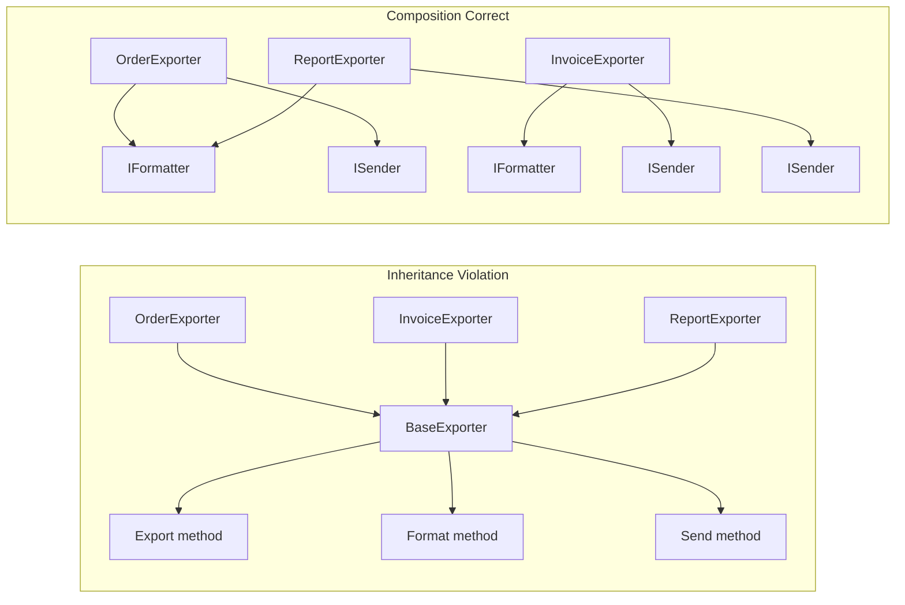

> [!success] Mastery Check
> - [ ] **Studied Well**
> - [ ] **Can explain the concept without notes**
> - [ ] **Can answer interview questions confidently**
> - [ ] **Can implement it in a real project**


## Navigation

**Domain:** [[6 — Design Principles & Patterns]] > **Group:** General Principles
**Previous:** [[6.008 — YAGNI]] | **Next:** [[6.010 — Principle of Least Surprise]]

### Prerequisites
- [[6.008 — YAGNI]] — YAGNI warns against premature abstraction; composition over inheritance often requires building composed units rather than deep hierarchies, and YAGNI ensures each unit is justified by current needs.

### Where This Fits
Composition over inheritance is a design principle that favors assembling behavior from small, focused components (composition) rather than deriving behavior from a parent class (inheritance). It is the single most impactful OOP principle for producing flexible, testable, and maintainable systems. In the .NET ecosystem, it manifests everywhere — from `IComparer<T>` composed into sorting (rather than inheriting a base comparer) to ASP.NET Core middleware pipelines composed from small `IMiddleware` components.

---

## Core Mental Model

Inheritance captures an "is-a" relationship (a `Car` is a `Vehicle`); composition captures a "has-a" or "uses-a" relationship (a `Car` has an `Engine`, a `PaymentProcessor` uses an `IPaymentGateway`). Composition wins because it is dynamically configurable, testable in isolation, and does not leak implementation details across levels of a hierarchy.



### Dimensions
- **Binding Time** — Inheritance is static (compile-time); composition is dynamic (runtime). With DI, you swap composed behaviors without recompiling.
- **Granularity** — Inheritance bundles multiple behaviors into one monolithic base; composition lets you mix and match small, single-purpose interfaces.
- **Testability** — Inherited behavior is inseparable from the base; composed behavior is injected and mockable.
- **Reuse Mechanism** — Inheritance reuses via specialization (override); composition reuses via delegation (forward calls to a contained object).

---

## Deep Mechanics

### How It Works

Consider an export system that formats and sends data:

**Before (Inheritance Hierarchy):**
```
BaseExporter (abstract)
  ├─ Export() — template method
  ├─ Format() — abstract
  ├─ Send() — virtual (default: email)
  ├─ CanExport(User) — checks permissions
  └─ Log(string) — writes telemetry

  ├─ CsvExporter : BaseExporter
  │   ├─ Format() → CSV formatting
  │   └─ CanExport() → overridden for admin-only CSV export
  │
  ├─ PdfExporter : BaseExporter
  │   ├─ Format() → PDF generation
  │   └─ Send() → overridden to use FTP instead of email
  │
  └─ JsonExporter : BaseExporter
      ├─ Format() → JSON serialization
      └─ Send() → also uses FTP
```

Problem: PdfExporter and JsonExporter both override `Send()` to FTP — duplicated logic. Adding a new transport (e.g., S3) requires modifying multiple exporters. The base class knows too much.

**After (Composition Applied):**
```
IFormatter → CsvFormatter, PdfFormatter, JsonFormatter
ISender   → EmailSender, FtpSender, S3Sender
IAuthorizer → RoleAuthorizer, PermissionAuthorizer

Exporter(IFormatter, ISender, IAuthorizer)
  └─ Export() → format → authorize → send
```

Now adding a new format or transport means adding a new `IFormatter` or `ISender` implementation — zero changes to existing classes. The `Exporter` is a thin orchestrator.

### Why It Matters at Scale
- Inheritance hierarchies beyond 3 levels become incomprehensible. A change at level 2 can break behavior in all 10 subclasses at level 3.
- Composition supports the Open-Closed Principle natively: add behavior via new implementations, not by modifying existing ones.
- In large codebases, composition-based designs enable parallel development — two teams can work on `IFormatter` and `ISender` independently, then integrate via DI registration.

---

## Production Code Patterns

### Implementation in C#

```csharp
// ❌ Violation — deep inheritance for validation
public abstract class OrderValidatorBase
{
    public virtual ValidationResult Validate(Order order)
    {
        if (order.Amount <= 0) return ValidationResult.Failure("Invalid amount");
        return ValidateCore(order);
    }
    protected abstract ValidationResult ValidateCore(Order order);
}

public sealed class PremiumOrderValidator : OrderValidatorBase
{
    protected override ValidationResult ValidateCore(Order order)
    {
        if (order.CustomerTier == CustomerTier.Premium && order.Amount > 10000)
            return ValidationResult.Failure("Premium orders over 10K need approval");
        return ValidationResult.Success;
    }
}

// ✅ Correct — composition of IValidator<T> via the decorator pattern
public interface IOrderValidator
{
    ValidationResult Validate(Order order);
}

public sealed class AmountValidator : IOrderValidator
{
    public ValidationResult Validate(Order order) =>
        order.Amount > 0
            ? ValidationResult.Success
            : ValidationResult.Failure("Amount must be positive");
}

public sealed class PremiumThresholdValidator : IOrderValidator
{
    public ValidationResult Validate(Order order) =>
        order is { CustomerTier: CustomerTier.Premium, Amount: > 10000 }
            ? ValidationResult.Failure("Premium orders over 10K need approval")
            : ValidationResult.Success;
}

public sealed class CompositeValidator : IOrderValidator
{
    private readonly IEnumerable<IOrderValidator> _validators;

    public CompositeValidator(IEnumerable<IOrderValidator> validators) => _validators = validators;

    public ValidationResult Validate(Order order)
    {
        var errors = _validators.Select(v => v.Validate(order))
                                .Where(r => !r.IsSuccess)
                                .Select(r => r.Error)
                                .ToList();
        return errors.Count == 0
            ? ValidationResult.Success
            : ValidationResult.Failure(string.Join("; ", errors));
    }
}
```

### ASP.NET Core / .NET Ecosystem Integration

```csharp
// Composition via DI — registering validators as a collection
builder.Services.AddSingleton<IOrderValidator, AmountValidator>();
builder.Services.AddSingleton<IOrderValidator, PremiumThresholdValidator>();
builder.Services.AddSingleton<IOrderValidator, ShippingAddressValidator>();
builder.Services.AddSingleton<CompositeValidator>();

// CompositeValidator receives all registered IOrderValidator instances
// Adding a new validation rule = new class + one DI registration line.
// Zero changes to existing validators.

// ASP.NET Core middleware itself is a composition example:
public sealed class RequestLoggingMiddleware : IMiddleware
{
    private readonly ILogger<RequestLoggingMiddleware> _logger;

    public RequestLoggingMiddleware(ILogger<RequestLoggingMiddleware> logger) => _logger = logger;

    public async Task InvokeAsync(HttpContext context, RequestDelegate next)
    {
        _logger.LogInformation("Request: {Method} {Path}", context.Request.Method, context.Request.Path);
        await next(context);
        _logger.LogInformation("Response: {StatusCode}", context.Response.StatusCode);
    }
}

// Composition: app.UseMiddleware<RequestLoggingMiddleware>();
// Each middleware is a small, composed behavior in a pipeline.
```

---

## Gotchas & Anti-Patterns

### God Base Class
**Wrong:** Putting everything in a `ServiceBase` class that all services inherit from.
```csharp
// ❌ Wrong — base class with logging, telemetry, auth, error handling
public abstract class ServiceBase
{
    protected ILogger Logger { get; }
    protected ITelemetryClient Telemetry { get; }
    protected IAuthorizationService Auth { get; }
    // 10 more cross-cutting concerns
}
```
**Right:** Inject cross-cutting concerns via constructor (composition) or use a pipeline behavior (MediatR) / middleware (ASP.NET Core).
**Consequence:** Every service inherits 15 methods it doesn't use. A change to logging format in the base class recompiles every service. Testing requires mocking inherited dependencies.

### Thin-Syndrome Over-Extraction
**Wrong:** Extracting every loop body into a separate method/interface.
```csharp
// ❌ Wrong — excessive composition
public sealed class OrderProcessor
{
    private readonly IOrderTotalComputer _totalComputer;
    private readonly ITaxComputer _taxComputer;
    private readonly IShippingComputer _shippingComputer;
    // ... 7 more injected dependencies
}
```
**Right:** A class with 10+ injected services is a design smell — it has too many responsibilities. Group related computations into fewer, coarser interfaces.
**Consequence:** The orchestrator class becomes a traffic cop with no logic, and the real complexity is scattered across 10 single-method interfaces.

### Inheritance for Code Reuse
**Wrong:** Using inheritance to share a single private method between two classes.
```csharp
// ❌ Wrong — inheritance just to share FormatCurrency
public abstract class ReportBase
{
    protected string FormatCurrency(decimal amount) => amount.ToString("C2");
}

public sealed class SalesReport : ReportBase { ... }
public sealed class TaxReport : ReportBase { ... }
```
**Right:** Extract `FormatCurrency` as a static method or a service, and inject it.
**Consequence:** The "is-a" relationship is a lie. `SalesReport` is not a kind of `ReportBase` conceptually — it just needs currency formatting. This misleads future readers.

### Overriding Intent
**Wrong:** Overriding a virtual method in a base class but calling `base.Method()` inside the override, while other subclasses don't.
```csharp
// ❌ Wrong — fragile override chain
public override ValidationResult Validate(Order order)
{
    var result = base.Validate(order); // fragile — what if base behavior changes?
    if (!result.IsSuccess) return result;
    // additional logic
}
```
**Right:** Compose behavior explicitly rather than relying on override contracts. Use the Strategy pattern instead of template methods when behavior composition is needed.
**Consequence:** The `base.Method()` contract is implicit. A future developer changes the base method and breaks subclasses in hard-to-detect ways.

---

## Performance Implications

### Maintenance Cost Model

| Scenario | Defect Probability | Change Impact | Onboarding Cost |
|---|---|---|---|
| Composition | Low — focused types | Isolated to one component | Low — one concept per type |
| Inheritance | Medium-High — base change breaks children | Cascading through hierarchy | High — must understand entire tree |

- **Composition overhead:** Each composed object adds an allocation and a virtual call. In extreme cases (10+ composed objects per operation), this matters — but typically the overhead is lost in noise compared to I/O.
- **JIT inlining:** Deeply composed chains defeat inlining. If performance is critical, use sealed classes with `[MethodImpl(MethodImplOptions.AggressiveInlining)]` or consider a source-generated monomorphization approach.
- **DI resolution cost:** Composing via DI adds overhead per resolution. Use singleton lifetimes where possible to amortize the cost.

---

## Interview Arsenal

### Question Bank

1. What does "composition over inheritance" mean?
2. When is inheritance the right choice over composition?
3. Give a concrete example where inheritance created maintenance problems.
4. How does composition support the Open-Closed Principle?
5. How does the Decorator pattern relate to composition over inheritance?
6. How does ASP.NET Core's middleware pipeline exemplify composition?
7. What is the "fragile base class" problem?
8. How does composition affect testability?
9. When does composition become over-engineering?
10. How do records and primary constructors in C# enable composition?

### Spoken Answers

> **Average answer (Q1):** Composition over inheritance means you should prefer has-a relationships over is-a relationships. Instead of inheriting behavior, you delegate to contained objects.

> **Great answer (Q1):** Composition over inheritance means assembling behavior from small, focused, independently-testable components rather than inheriting from a base class. In C#, this means preferring `IPaymentGateway` injected into a `PaymentProcessor` over having `PaymentProcessor` extend `BasePaymentProcessor`. The key advantage is that composition is dynamically configurable — I can swap `IPaymentGateway` from `StripeGateway` to `PayPalGateway` via DI configuration without recompiling. Inheritance would require a new subclass. Composition also avoids the fragile base class problem, where a change in a base class silently breaks subclasses in production.

> **Average answer (Q3):** I had a base class that did logging and when I changed it, all the subclasses broke. I should have used composition.

> **Great answer (Q3):** In a fraud detection system, we had a `BaseRule` with: `IsApplicable(Transaction)` (virtual), `Evaluate(Transaction)` (abstract), and `GetSeverity()` (virtual). 30 rules inherited from it. A new requirement — "rules should check the merchant's risk tier before evaluating" — required adding `IsMerchantHighRisk()` to the base. This caused regression in 6 rules because their `IsApplicable` overrides conflicted with the new check. The composition fix: extract `IRuleCondition` (conditions like `HighRiskMerchantCondition`, `LargeAmountCondition`) and `IAction` (block, flag, notify), then compose rules as `Rule(List<IRuleCondition>, IAction)`. Rules became configuration, not code.

### Trick Question

**"Is-a relationships are natural for domain modeling, so inheritance is usually the right choice for modeling real-world entities."**

Why it is a trap: It confuses conceptual modeling with implementation strategy. Even real-world "is-a" relationships often benefit from composition.

Correct answer: Domain modeling is about semantics, not mechanics. A `Car` *is-a* `Vehicle` in the real world, but in code, `Car(Engine, Transmission, BrakeSystem)` via composition is more maintainable than `Car : Vehicle` if engines, transmissions, and brakes can vary independently. The GoF Design Patterns book explicitly recommends composition over inheritance for this reason. Use inheritance only when the subtype truly substitutes for the base type in all scenarios (Liskov Substitution Principle) *and* the subtype adds no behavior that the base needs to know about.

### Comparison Table

| Aspect | Composition | Inheritance |
|---|---|---|
| Intent | Assemble behavior from parts | Derive behavior from parent |
| Relationship | Has-a / uses-a | Is-a |
| Flexibility | Dynamic (runtime-swappable) | Static (compile-time) |
| Testability | Each part mockable independently | Base behavior hard to isolate |
| Reuse scope | Per-component, across unrelated types | Per-hierarchy, limited to subclasses |
| .NET example | `IMiddleware` in ASP.NET Core pipeline | `ControllerBase` inheritance for Web API controllers |
| Key difference | Composition favors interfaces + delegation; inheritance favors abstract classes + method overriding |

---

## Decision Framework

### When to Apply

```mermaid
flowchart TD
    A[Need to share behavior<br>between types] --> B{Is it an is-a<br>relationship?}
    B -->|Yes| C{Will subtypes truly<br>substitute for base<br>(LSP holds)?}
    C -->|Yes| D{Will the hierarchy<br>stay ≤ 2 levels?}
    D -->|Yes| E[Consider inheritance]
    D -->|No| F[Use composition]
    C -->|No| F
    B -->|No| F
    F --> G[Identify single-responsibility interfaces]
    G --> H[Inject via constructor or method parameter]
```

### Application Checklist
- [ ] I have verified the relationship is not actually "has-a" disguised as "is-a."
- [ ] The base class does not contain protected state that subclasses depend on.
- [ ] I can list the interfaces I would extract if I switched to composition today.
- [ ] The hierarchy is at most 2 levels deep (base → concrete).
- [ ] I have not overridden `base.Method()` in any subclass.

### Tradeoff Summary

| Factor | Composition | Inheritance |
|---|---|---|
| Code reuse | Via delegation to multiple interfaces | Via override of base methods |
| Changes | Add new implementations, no existing changes | Base changes propagate to all subclasses |
| Performance | Slight overhead (allocation + virtual call) | Minimal (single dispatch) |
| Boilerplate | More types/interfaces needed | Less code initially |

---

## Self-Check

### Conceptual Questions

1. What is the "fragile base class" problem?
2. How does the Strategy pattern exemplify composition over inheritance?
3. When is inheritance unavoidable in C#? (Hint: framework constraints)
4. What is the role of interfaces in composition?
5. How does DI enable composition in .NET?
6. Can you compose behaviors without interfaces? How?
7. What is the difference between aggregation and composition?
8. How does C#'s `sealed` keyword relate to this principle?
9. Why is deep inheritance hierarchies (5+ levels) considered harmful?
10. How does the Decorator pattern use composition to extend behavior?

<details><summary>Answers</summary>

1. The fragile base class problem occurs when a change to a base class (apparently safe) breaks derived classes in unexpected ways, because subclasses depend on implicit contracts in the base.
2. Strategy defines a family of algorithms as interchangeable implementations of an interface. A client *composes* with a strategy rather than *inheriting* the algorithm from a base class.
3. Inheritance is unavoidable when extending framework types: `ControllerBase`, `PageModel`, `DbContext`, `Stream`, etc. These frameworks expose extension points via virtual methods.
4. Interfaces define contracts for behavior. Composition wires concrete implementations behind those contracts, enabling swapping, mocking, and decoration.
5. DI registers interface-implementation mappings. A composed class requests its dependencies via constructor, and the container wires the graph at runtime.
6. Yes — via delegates (`Func<T>`, `Action<T>`), events, or higher-order functions. Composition does not require interfaces, but interfaces provide discoverability and documentation.
7. Aggregation implies a whole-part relationship where parts can exist independently (e.g., `Team` aggregates `Players`). Composition implies parts cannot exist without the whole (e.g., `Order` composes `OrderLineItems` — deleting the order deletes line items).
8. `sealed` prevents inheritance and forces composition. Marking classes `sealed` by default (as in C# records) nudges developers toward composition.
9. Deep hierarchies violate the "one level of abstraction" principle. Understanding a subclass requires mentally loading the entire ancestor chain. Changes at level 1 can break level 5.
10. Decorator wraps an interface implementation with additional behavior. Instead of inheriting `Stream` to add buffering, `BufferedStream` wraps a `Stream` — the classic composition-over-inheritance example.

</details>

### Code Puzzles

**Puzzle 1:** Identify the inheritance abuse and refactor to composition.
```csharp
public abstract class NotifierBase
{
    protected readonly ILogger _logger;
    protected NotifierBase(ILogger logger) => _logger = logger;
    public abstract Task SendAsync(string message);
    protected void Log(string message) => _logger.LogInformation("Sent: {Message}", message);
}

public sealed class EmailNotifier : NotifierBase
{
    public EmailNotifier(ILogger logger) : base(logger) { }
    public override async Task SendAsync(string message) { /* SMTP send */ Log(message); }
}
```
<details><summary>Answer</summary>
Extract `ILogger` injection to the concrete class directly, and remove the abstract base:
```csharp
public interface INotifier { Task SendAsync(string message); }
public sealed class EmailNotifier : INotifier
{
    private readonly ILogger<EmailNotifier> _logger;
    public EmailNotifier(ILogger<EmailNotifier> logger) => _logger = logger;
    public async Task SendAsync(string message) { /* SMTP send */ _logger.LogInformation("Sent: {Message}", message); }
}
```
</details>

**Puzzle 2:** Refactor this inheritance to composition.
```csharp
public abstract class ReportGenerator
{
    public string GenerateReport()
    {
        var data = FetchData();
        var formatted = Format(data);
        return Save(formatted);
    }
    protected abstract object FetchData();
    protected abstract string Format(object data);
    private string Save(string content) => File.WriteAllText("report.txt", content).ToString();
}
```
<details><summary>Answer</summary>
```csharp
public interface IDataFetcher { object Fetch(); }
public interface IReportFormatter { string Format(object data); }
public sealed class ReportGenerator
{
    private readonly IDataFetcher _fetcher;
    private readonly IReportFormatter _formatter;
    public ReportGenerator(IDataFetcher fetcher, IReportFormatter formatter) => (_fetcher, _formatter) = (fetcher, formatter);
    public string Generate() => File.WriteAllText("report.txt", _formatter.Format(_fetcher.Fetch())).ToString();
}
```
</details>

**Puzzle 3:** Spot the composition-suitable code disguised as inheritance.
```csharp
public abstract class PriceCalculator
{
    protected abstract decimal BasePrice(Product product);
    public decimal Calculate(Product product, Customer customer)
    {
        var price = BasePrice(product);
        if (customer.IsPremium) price *= 0.9m;
        if (product.IsOnSale) price *= 0.8m;
        return price;
    }
}
```
<details><summary>Answer</summary>
The discount logic is hard-coded in the base class. Compose it:
```csharp
public interface IPriceModifier { decimal Apply(Product product, Customer customer, decimal basePrice); }
public sealed class PremiumDiscountModifier : IPriceModifier { ... }
public sealed class SaleModifier : IPriceModifier { ... }
public sealed class PriceCalculator
{
    private readonly IEnumerable<IPriceModifier> _modifiers;
    public decimal Calculate(Product product, Customer customer) =>
        _modifiers.Aggregate(BasePrice(product), (price, m) => m.Apply(product, customer, price));
}
```
</details>

**Puzzle 4:** What is the problem with this composition?
```csharp
public sealed class OrderExporter
{
    private readonly ICsvFormatter _csvFormatter;
    private readonly IJsonFormatter _jsonFormatter;
    private readonly IPdfFormatter _pdfFormatter;
    private readonly IXmlFormatter _xmlFormatter;
    private readonly IEmailSender _emailSender;
    private readonly IFtpSender _ftpSender;
    private readonly IS3Sender _s3Sender;
    // ... 15 more injected services
}
```
<details><summary>Answer</summary>
This is the God Class anti-pattern in composition form — too many injected dependencies (typically 4+ is a smell). The class has too many responsibilities. Break it into separate exporters (e.g., `CsvOrderExporter`, `PdfOrderExporter`), each with a focused set of dependencies.
</details>

**Puzzle 5:** Refactor this to remove inheritance without adding interfaces.
```csharp
public sealed record Customer(string Name, string Email);
public sealed record PremiumCustomer : Customer
{
    public decimal DiscountRate { get; init; }
    public PremiumCustomer(string Name, string Email, decimal DiscountRate) : base(Name, Email) => this.DiscountRate = DiscountRate;
}
```
<details><summary>Answer</summary>
Use composition instead of inheritance, keeping simple types:
```csharp
public sealed record Customer(string Name, string Email);
public sealed record PremiumCustomer(Customer Base, decimal DiscountRate);
// Or flatten:
public sealed record CustomerInfo(string Name, string Email, decimal? DiscountRate);
```
</details>
