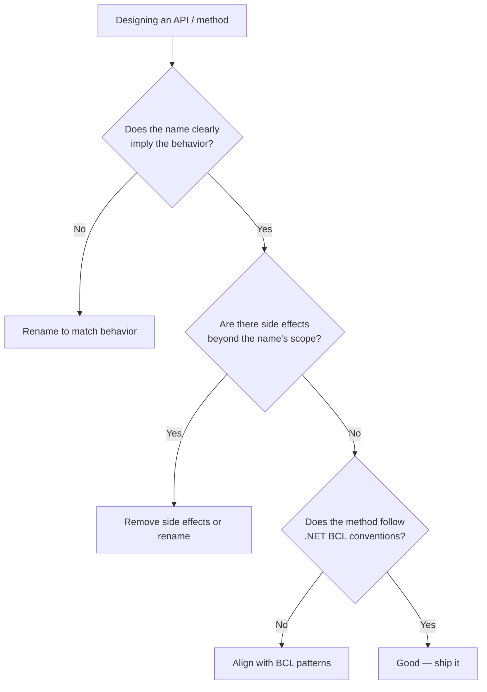

> [!success] Mastery Check
> - [ ] **Studied Well**
> - [ ] **Can explain the concept without notes**
> - [ ] **Can answer interview questions confidently**
> - [ ] **Can implement it in a real project**


## Navigation

**Domain:** [[6 — Design Principles & Patterns]] > **Group:** General Principles
**Previous:** [[6.009 — Composition Over Inheritance]] | **Next:** [[6.011 — Fail Fast]]

### Prerequisites
- [[6.009 — Composition Over Inheritance]] — Composition leads to predictable interface-based contracts; the Principle of Least Surprise governs how those contracts should behave to meet caller expectations.

### Where This Fits
The Principle of Least Surprise (also called Principle of Least Astonishment) states that a system should behave in a way that most users expect it to — the result of an operation should be obvious and predictable given the name, signature, and context. It governs API design, method naming, parameter ordering, exception types, and even UI layout. In .NET, it is the reasoning behind framework conventions like `async` methods ending in `Async`, `IEnumerable<T>` being lazily evaluated, and `Dispose()` being idempotent.

---

## Core Mental Model

Every interface, method, or type creates a contract of expectations in the caller's mind. When the implementation violates those expectations, the caller introduces bugs — not because the caller was wrong, but because the contract was surprising. The principle demands that your code behaves as any reasonable developer would predict based solely on its name, signature, and documentation.

```mermaid
flowchart LR
  subgraph Surprising
    A["SaveFile(data)"] --> B[Writes to disk<br>... but throws if<br>file already exists]
    B --> C[Caller expects<br>upsert semantics]
    C --> D[Debugging nightmare: "Save<br>should create or overwrite"]
  end
  subgraph Least Surprise
    E["SaveFile(data, overwrite: false)"] --> F[Writes if new,<br>throws if exists<br>as explicitly stated]
    F --> G[Caller sees the<br>opt-in constraint]
    G --> H[Correct behavior<br>first time]
  end
```

### Dimensions
- **Naming Semantics** — A method named `Delete` should actually remove data; `SoftDelete`, `Archive`, or `Deactivate` are distinct operations.
- **Parameter Conventions** — Standard .NET conventions (cancellationToken last, Stream as readable-seekable), `string.IsNullOrEmpty` returning `bool`, Try-prefix for `bool` return with `out` parameter.
- **Side Effects** — A property getter should not mutate state. A method named `Validate` should not modify the object. `ToString()` should never throw.
- **Exception Expectations** — `File.OpenRead` throws `FileNotFoundException` (predictable), not `InvalidOperationException`. Custom exceptions should derive from predictable base types.
- **Null Semantics** — If a method returns `string`, callers expect a non-null string unless documented otherwise (or flagged as `string?` in nullable-enabled code).

---

## Deep Mechanics

### How It Works

Consider a method that processes an order and optionally sends a confirmation:

**Before (Surprising):**
```
ProcessOrder(order)
  1. Saves order to DB
  2. If order.Amount > 0, sends confirmation email  // side effect: email
  3. Returns OrderResponse with Total = order.Amount + tax
  // Surprise: email sent even if caller didn't ask for it
  // Surprise: Total includes tax, but parameter is just "Amount"
```

**After (Least Surprise):**
```
ProcessOrder(order, sendConfirmation: false)
  1. Saves order to DB
  2. Returns ProcessOrderResult(Subtotal, Tax, Total)
  // No email unless explicitly requested
  // Return type clearly separates subtotal, tax, total
```

### Why It Matters at Scale
- In a 200K LOC system, a surprising API causes cascading bugs — one developer assumes `Save()` is upsert, another assumes it throws on duplicates. The two callers diverge in behavior and one ships a bug.
- Surprising APIs increase code review friction — reviewers must mentally trace the implementation to understand side effects, rather than trusting the signature.
- Onboarding cost: every surprising behavior must be learned (or discovered the hard way). Predictable APIs let new contributors be productive immediately.

---

## Production Code Patterns

### Implementation in C#

```csharp
// ❌ Violation — side effect in a property getter
public sealed class Order
{
    private bool _isProcessed;

    public decimal Total
    {
        get
        {
            if (!_isProcessed)
            {
                Process();  // side effect in a property getter — shocking
                _isProcessed = true;
            }
            return CalculateTotal();
        }
    }
}

// ✅ Correct — explicit method for operations, property for state
public sealed class Order
{
    public decimal Total { get; private set; }

    public void Process()
    {
        Total = CalculateTotal();
    }
}

// ❌ Violation — Try-prefix without standard pattern
public bool TryFindCustomer(string name, out Customer? customer)
{
    customer = null;
    if (string.IsNullOrEmpty(name)) return false;  // returns false but no error logged
    customer = _db.Customers.FirstOrDefault(c => c.Name == name);
    return customer is not null;
}

// ✅ Correct — standard Try-pattern
public bool TryFindCustomer(string name, [MaybeNullWhen(false)] out Customer customer)
{
    if (string.IsNullOrEmpty(name))
    {
        customer = null;
        return false;
    }
    customer = _db.Customers.FirstOrDefault(c => c.Name == name);
    return customer is not null;
}
```

### ASP.NET Core / .NET Ecosystem Integration

```csharp
// ❌ Violation — surprising HTTP semantics
app.MapPost("/api/orders", async (Order request, AppDbContext db) =>
{
    var existing = await db.Orders.FindAsync(request.Id);
    if (existing is not null)
    {
        return Results.Conflict();  // POST creating? Surprise: POST is supposed to create, not check existence
    }
    db.Orders.Add(request);
    await db.SaveChangesAsync();
    return Results.Created($"/api/orders/{request.Id}", request);
});

// ✅ Correct — follow HTTP semantics predictably
// POST = create (returns 201, idempotency via client-generated IDs or 409 on conflict)
// PUT = upsert (idempotent)
// PATCH = partial update

app.MapPut("/api/orders/{id}", async (int id, Order updated, AppDbContext db) =>
{
    var existing = await db.Orders.FindAsync(id);
    if (existing is null) return Results.NotFound();
    // update logic
    return Results.Ok(existing);
});
```

---

## Gotchas & Anti-Patterns

### Async Method Without Async Suffix
**Wrong:** Naming an async method `GetData` instead of `GetDataAsync`.
```csharp
// ❌ Wrong — callers don't know to await
public Task<List<Order>> GetOrders() => ...
```
**Right:** Follow the .NET convention: suffix async methods with `Async`.
**Consequence:** Callers may call the method and forget to `await`, getting a `Task` instead of the actual result. The bug manifests non-deterministically.

### Mutating Method Named as Query
**Wrong:** `GetCustomer` that logs access or updates a "last accessed" timestamp.
```csharp
// ❌ Wrong — query name with mutation side effect
public Customer GetCustomer(int id)
{
    _auditLogger.LogAccess(id);  // side effect
    return _db.Customers.Find(id)!;
}
```
**Right:** Rename to `GetAndLogAccess` or split into `GetCustomer` and a separate `LogAccess` call.
**Consequence:** Callers call `GetCustomer` twice, getting two audit entries. Predictable name + surprising behavior = production bug.

### Inconsistent Null Handling
**Wrong:** Some methods return `null`, others throw, others return `Optional<T>`.
```csharp
// ❌ Wrong — inconsistent approaches
public Customer? Find(int id) => ...;      // returns null
public Customer Get(int id) => ...;         // throws if not found
public Option<Customer> Search(int id) => ...; // returns Option
```
**Right:** Pick one convention per class/project. Standard .NET: use nullable return with `MaybeNullWhen` for try-methods, or throw for required-entity methods.
**Consequence:** Callers must read the implementation of every method to know how "not found" is communicated.

### Parameters Reordered from Convention
**Wrong:** `SendEmail(string body, string subject, string to)` — most .NET APIs put the primary receiver first, then subject, then body.
```csharp
// ❌ Wrong — non-standard parameter order
public Task SendEmail(string body, string subject, string to)
```
**Right:** `SendEmail(string to, string subject, string body)` following `MailMessage` constructor convention.
**Consequence:** Callers constantly check parameter order, and bugs from swapped parameters are hard to spot during code review.

### Exception Type Mismatch
**Wrong:** Throwing `Exception` base type or `InvalidOperationException` when `ArgumentNullException` is expected.
```csharp
// ❌ Wrong — wrong exception type
public void Process(Order? order)
{
    if (order is null) throw new InvalidOperationException("Order is null");
}
```
**Right:** `ArgumentException.ThrowIfNullOrEmpty` or `ArgumentNullException.ThrowIfNull(order)`.
**Consequence:** Callers who catch specific exception types miss the bug. Stack traces mislead debugging.

---

## Performance Implications

### Maintenance Cost Model

| Scenario | Defect Probability | Change Impact | Onboarding Cost |
|---|---|---|---|
| Followed | Low — predictable contracts | Predictable — test only changed part | Low — conventions are universal |
| Violated | High — surprising behavior breeds bugs | High — every caller must be audited | High — must learn team-specific quirks |

- **Cognitive load:** Each surprising API increases the mental model size. A developer can hold ~5 surprising rules before exhaustion; beyond that, mistakes multiply.
- **Review efficiency:** Predictable APIs allow code reviewers to focus on business logic. Surprising APIs force reviewers to mentally execute the implementation to verify behavior.
- **Tooling impact:** When `Try*` methods follow the standard `bool Try*(in, [MaybeNullWhen(false)] out)` pattern, static analysis tools properly warn on unguarded access. Non-standard patterns bypass analysis.

---

## Interview Arsenal

### Question Bank

1. What is the Principle of Least Surprise?
2. Give an example of a surprising API in .NET and how you would fix it.
3. How does the principle affect method naming?
4. What is the relationship between this principle and the concept of "convention over configuration"?
5. How does the principle apply to exception design?
6. How would you apply this principle to REST API design in ASP.NET Core?
7. Can following this principle conflict with performance? How do you resolve it?
8. What is the most common surprising behavior in C# that catches new developers?
9. How does the principle guide null-handling strategy?
10. How would you apply this principle when designing a public NuGet library?

### Spoken Answers

> **Average answer (Q1):** The Principle of Least Surprise says your code should do what people expect it to do. Don't make things confusing.

> **Great answer (Q1):** The Principle of Least Surprise (or Least Astonishment) states that a system should behave in a way that aligns with the user's (or developer's) existing mental model, minimizing the gap between expectation and reality. In .NET, this manifests as: all async methods ending in `Async`, properties being O(1) and side-effect-free, `Try*` methods using the `[MaybeNullWhen(false)]` out-parameter pattern, and LINQ being lazy. A violation is a method named `GetOrders` that makes an HTTP call — the caller expects an in-memory lookup, not a network round trip. The principle is why ASP.NET Core conventions exist: `Startup` class, `ConfigureServices` method, `app.UseXxx()` — they're designed to match what developers expect from the framework.

> **Average answer (Q3):** Method names should match what they do. Don't call it `Save` if it doesn't save.

> **Great answer (Q3):** Method naming is the primary vehicle for communicating expectations. A method named `Delete` should permanently remove the resource — if it does a soft delete, name it `SoftDelete` or `Archive`. A method named `Validate` should return validation results and not mutate state. The .NET BCL provides a strong convention: `Create*` allocates new resources, `Open*` opens existing ones, `Read*`/`Write*` imply I/O. Following these conventions means callers can predict behavior from the name alone. The cost of surprising names is that every caller must read the implementation or docs — which they won't.

### Trick Question

**"The Principle of Least Surprise means I should never throw exceptions in property getters because it's surprising."**

Why it is a trap: Oversimplification. Some exceptions in property getters are completely expected (e.g., `IndexOutOfRangeException` on a collection indexer).

Correct answer: Not always — the principle is about reasonable expectations. `Collection[index]` throwing `ArgumentOutOfRangeException` is expected; that's how arrays and lists work. Property indexers on `ConcurrentDictionary` are designed to throw on missing keys. The surprise is when a seemingly simple getter makes a network call or mutates state. The guiding question: "Would a reasonable .NET developer, knowing only the type signature and the type name, predict this behavior?" If yes, the exception is fine. If no, redesign.

### Comparison Table

| Aspect | Least Surprise | Consistency |
|---|---|---|
| Intent | Match caller's mental model | Apply same pattern uniformly |
| Participants | API surface vs caller expectations | All similar operations vs each other |
| When to use | Always during API design | Always — they reinforce each other |
| .NET example | `Task.WhenAll` returns when all tasks complete (expected) | Always using `Async` suffix for async methods |
| Key difference | Least Surprise is about *external* expectations (what callers think); Consistency is about *internal* uniformity (teams do it the same way). They align when team conventions match broader ecosystem conventions. |

---

## Decision Framework

### When to Apply



### Application Checklist
- [ ] The method name is a verb or verb phrase that accurately describes the action.
- [ ] Property getters are O(1) and side-effect-free.
- [ ] `Try*` methods follow the standard `bool Try*(in, [MaybeNullWhen(false)] out)` pattern.
- [ ] Async methods are suffixed with `Async`.
- [ ] Parameter order follows BCL conventions (primary object first, options/config last, `CancellationToken` last).

### Tradeoff Summary

| Factor | Follow | Violate |
|---|---|---|
| Developer trust | High — callers trust the name | Low — every API must be verified |
| Code review speed | Fast — conventions are known | Slow — each usage must be traced |
| Refactoring safety | Safe — contracts are predictable | Dangerous — side effects hide in plain sight |
| API surface design | Consistent, discoverable | Idiosyncratic, error-prone |

---

## Self-Check

### Conceptual Questions

1. What is a common surprising behavior in C# that relates to `yield return`?
2. Why is it surprising to throw from `ToString()`?
3. How does the principle apply to HTTP status code selection in ASP.NET Core?
4. What makes LINQ's deferred execution surprising to new developers?
5. How does the principle apply to `Dispose()` methods?
6. Why is `GetById(int id)` returning `null` for a missing entity less surprising than throwing?
7. How does the `out` variable pattern in C# reduce surprise?
8. What is the relationship between this principle and the concept of "pit of success"?
9. How does nullable reference types in C# 8+ reduce surprise?
10. Give an example where following the principle would hurt performance and how to document the tradeoff.

<details><summary>Answers</summary>

1. `yield return` creates a lazily-evaluated sequence. New developers are surprised that the code doesn't execute until the sequence is enumerated, leading to bugs like disposing a `SqlConnection` before enumeration completes.
2. `ToString()` should always succeed and return a meaningful string or empty. Throwing from `ToString()` violates the implicit contract that it's a safe, side-effect-free debugging aid.
3. Least Surprise means using standard HTTP semantics: 200 OK for success, 201 Created for POST, 204 No Content for DELETE, 400 Bad Request for validation errors, 404 Not Found for missing resources, 409 Conflict for idempotency violations.
4. LINQ queries don't execute until iterated. Developers used to imperative `List<T>` operations expect immediate evaluation. Surprise: modifying the source collection after building a query changes the query result.
5. `Dispose()` should be idempotent — calling it multiple times should not throw. This is the .NET convention, and violating it surprises cleanup code that defensively calls `Dispose()`.
6. Returning `null` from a query method is standard .NET convention (`FirstOrDefault`). Throwing forces callers to use try-catch for ordinary "not found" scenarios, which is both surprising and expensive.
7. The `out` variable pattern (`TryGetValue(key, out var value)`) reduces surprise by making the out parameter declaration inline at the call site — no separate declaration line to wonder about.
8. The "pit of success" means designing APIs so that the correct path is also the easiest path. Least Surprise reinforces this: when the API does what you expect, you naturally use it correctly.
9. Nullable reference types make null expectations explicit in the type signature. A `string?` parameter clearly communicates "I accept null," while `string` communicates "I expect non-null." This eliminates the surprise of null reference exceptions from undocumented null parameters.
10. Making a property getter O(1) might require pre-computing a value in the constructor, which adds allocation. Document the tradeoff with XML doc: "This property is O(1) and pre-computed during construction."

</details>

### Code Puzzles

**Puzzle 1:** Identify the surprising behavior in this code.
```csharp
public sealed class ShoppingCart
{
    public decimal Total => _items.Sum(i => i.Price);
    private readonly List<CartItem> _items = new();

    public void AddItem(CartItem item)
    {
        _items.Add(item);
        RecalculateDiscount(); // side effect
    }
}
```
<details><summary>Answer</summary>
`AddItem` has a side effect (recalculating discount) that is not implied by the name "Add." Callers expect `AddItem` to just add. Extract `RecalculateDiscount` to be explicit, or rename to `AddItemWithDiscountUpdate`.
</details>

**Puzzle 2:** What is surprising about this validation method?
```csharp
public void ValidateOrder(Order order)
{
    if (order.Amount <= 0) throw new ValidationException("Invalid amount");
    _db.Orders.Add(order);  // side effect — saving during validation!
}
```
<details><summary>Answer</summary>
A method named `Validate` should not mutate state. The `_db.Orders.Add(order)` is a side effect that surprises callers who expect validation to be read-only. Split into `ValidateOrder` (returns errors) and `SaveOrder` (performs the add).
</details>

**Puzzle 3:** Which parameter ordering is least surprising?
```csharp
// Option A
Task<byte[]> DownloadFile(string bucket, string key, CancellationToken ct = default);
// Option B
Task<byte[]> DownloadFile(string key, string bucket, CancellationToken ct = default);
```
<details><summary>Answer</summary>
Option A is less surprising. AWS SDK conventions consistently put bucket first, then key. Following existing ecosystem conventions (even outside .NET) reduces surprise for developers familiar with S3.
</details>

**Puzzle 4:** What is surprising about this async method?
```csharp
public async Task<Order> GetOrder(int id)
{
    await Task.Delay(100); // simulated delay for demo
    return _db.Orders.Find(id);
}
```
<details><summary>Answer</summary>
The method is `async` but does not end in `Async`. Callers may not realize it returns a `Task<Order>` and accidentally call it without `await`, getting a `Task` object instead of an `Order`. Fix: rename to `GetOrderAsync`.
</details>

**Puzzle 5:** Identify the surprise in this API design.
```csharp
public sealed record CreateUserRequest(
    string Email,
    string Password,
    bool SendWelcomeEmail = true  // implicit side effect
);
```
<details><summary>Answer</summary>
The `SendWelcomeEmail` parameter couples user creation with email sending, which is surprising. A POST `/users` endpoint should create the user and return; email sending should be a separate step or an explicit flag on a different endpoint. The default value `true` means callers get an email side effect by default, which violates least surprise for batch creation or testing scenarios.
</details>
