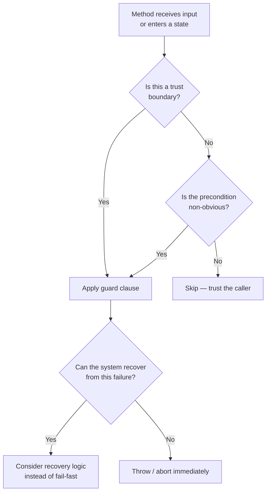

> [!success] Mastery Check
> - [ ] **Studied Well**
> - [ ] **Can explain the concept without notes**
> - [ ] **Can answer interview questions confidently**
> - [ ] **Can implement it in a real project**


## Navigation

**Domain:** [[6 — Design Principles & Patterns]] > **Group:** General Principles
**Previous:** [[6.010 — Principle of Least Surprise]] | **Next:** [[6.012 — Naming]]

### Prerequisites
- [[6.010 — Principle of Least Surprise]] — Fail-fast aligns with least surprise: failing immediately at the error source is more predictable than failing later in a corrupted state.

### Where This Fits
Fail Fast is the principle that a system should immediately stop processing when an unexpected condition occurs, rather than continuing in an indeterminate state and failing later in a harder-to-diagnose way. It guides input validation, precondition checks, and state validation throughout the system. In .NET, it manifests as guard clauses at method entry, `ArgumentException.ThrowIfNull`, and middleware that short-circuits on bad requests.

---

## Core Mental Model

A bug caught 10 milliseconds after its cause is trivial to fix. A bug caught 10 seconds later, after corrupting state, is a production incident. Fail Fast means you check preconditions at the earliest possible moment and halt execution immediately if they are violated, rather than letting bad data propagate through the system.

```mermaid
flowchart LR
  subgraph Violation — Late Fail
    A[Invalid input] --> B[Stored in database]
    B --> C[Processed by worker]
    C --> D[Downstream service call]
    D --> E[NullReferenceException]
    E --> F["Where did the<br>bad data come from?"]
  end
  subgraph Correct — Fail Fast
    G[Invalid input] --> H[Guard clause: throw<br>at the API boundary]
    H --> I[Error logged with<br>full input context]
    I --> J["Clear cause:<br>'Order.Amount was -50'"]
  end
```

### Dimensions
- **Validation Layer** — At boundary (API endpoint, message queue consumer), at service entry (public method), at internal transition (state change).
- **Failure Mode** — Throw exception, return error result, log and abort, or poison message.
- **Error Type** — Argument error (bad input), state error (invalid sequence), configuration error (missing settings), environment error (DB unavailable).
- **Recovery Strategy** — Fail fast does not prevent recovery; it surfaces the error early so a retry or compensation can happen with clean state.

---

## Deep Mechanics

### How It Works

Consider an order service that processes payments:

**Before (Fail Late):**
```
ProcessPayment(orderId, amount)
  1. Fetch order from DB (might return null — not checked)
  2. Deduct from inventory (subtracts even if order is null)
  3. Charge payment gateway (passes null order reference — NPE here)
  4. When NPE happens, inventory is already decremented
  → Data inconsistency: inventory shows deduction, no payment charged
```

**After (Fail Fast):**
```
ProcessPayment(orderId, amount)
  1. Guard: orderId must be > 0 — ArgumentOutOfRangeException
  2. Guard: amount must be > 0 — ArgumentOutOfRangeException
  3. Fetch order: if null, throw OrderNotFoundException
  4. Now proceed with clean state
  → If step 3 fails, nothing has been mutated. Retry-safe.
```

### Why It Matters at Scale
- In distributed systems, fail-late behavior cascades: corrupt data in service A propagates to B, C, D. Root cause analysis requires tracing across 4 services instead of checking one guard clause.
- State corruption from fail-late bugs requires manual data reconciliation — the most expensive type of production incident.
- Stateless fail-fast (validation only) is trivial to recover from. Stateful fail-late (data half-written) is not.

---

## Production Code Patterns

### Implementation in C#

```csharp
// ❌ Violation — late failure after partial state mutation
public async Task<PaymentResponse> ProcessPaymentAsync(int orderId, decimal amount, string currency)
{
    // No validation — proceed blindly
    var order = await _db.Orders.FindAsync(orderId);
    var account = await _accountService.GetAccountAsync(order.CustomerId); // NPE if order is null

    order.Balance -= amount; // mutates before validation
    await _db.SaveChangesAsync();

    return await _paymentGateway.ChargeAsync(currency, amount, orderId);
}

// ✅ Correct — guard clauses at entry, fail before mutation
public async Task<PaymentResponse> ProcessPaymentAsync(int orderId, decimal amount, string currency)
{
    ArgumentOutOfRangeException.ThrowIfNegativeOrZero(orderId);
    ArgumentOutOfRangeException.ThrowIfNegativeOrZero(amount);
    ArgumentException.ThrowIfNullOrWhiteSpace(currency);

    var order = await _db.Orders.FindAsync(orderId);
    ArgumentNullException.ThrowIfNull(order);
    // or: order.ThrowIfNotFound(orderId);

    var account = await _accountService.GetAccountAsync(order.CustomerId);

    // At this point, all preconditions are met — safe to mutate
    order.Balance -= amount;
    await _db.SaveChangesAsync();

    return await _paymentGateway.ChargeAsync(currency, amount, orderId);
}
```

### ASP.NET Core / .NET Ecosystem Integration

```csharp
// Fail-fast validation via FluentValidation middleware in Minimal API
var app = WebApplication.Create(args);

app.MapPost("/api/orders", async (Order request, IValidator<Order> validator, AppDbContext db) =>
{
    var validationResult = await validator.ValidateAsync(request);
    if (!validationResult.IsValid)
    {
        return Results.ValidationProblem(validationResult.ToDictionary());
        // Fail fast — return 400 before touching the database
    }
    // Safe to proceed — validated input
    db.Orders.Add(request);
    await db.SaveChangesAsync();
    return Results.Created($"/api/orders/{request.Id}", request);
});

// Global exception handler — catches unhandled fail-fast exceptions
app.UseExceptionHandler(exceptionHandlerApp =>
{
    exceptionHandlerApp.Run(async context =>
    {
        var exception = context.Features.Get<IExceptionHandlerFeature>()?.Error;
        context.Response.StatusCode = exception switch
        {
            ArgumentException => StatusCodes.Status400BadRequest,
            NotFoundException => StatusCodes.Status404NotFound,
            _ => StatusCodes.Status500InternalServerError
        };
        await context.Response.WriteAsJsonAsync(new { error = exception?.Message });
    });
});
```

---

## Gotchas & Anti-Patterns

### Throwing in Non-Exceptional Paths
**Wrong:** Using exceptions for control flow — e.g., throwing `ValidationException` for a missing optional field.
```csharp
// ❌ Wrong — validation exception for common, expected scenario
if (string.IsNullOrEmpty(request.MiddleName))
    throw new ValidationException("Middle name is optional but missing");
```
**Right:** Use `Result<T>` or nullable for expected missing data. Reserve exceptions for truly exceptional conditions.
**Consequence:** Throwing exceptions is expensive (~1μs per throw) and pollutes the exception model with non-exceptional cases.

### Fail-Fast in Production Without Observability
**Wrong:** Throwing exceptions that crash the process but are not logged.
```csharp
// ❌ Wrong — fail fast with no logging
public void Process(Order order)
{
    if (order is null) throw new ArgumentNullException(nameof(order));
    // ...
}
```
**Right:** Ensure an `IExceptionHandler` or middleware captures and logs all unhandled exceptions.
**Consequence:** An unlogged fail-fast in production is indistinguishable from crash-loop — operations has no clue what failed.

### Over-Validation at Internal Boundaries
**Wrong:** Re-validating data at every method call inside a trusted boundary.
```csharp
// ❌ Wrong — redundant validation inside the trusted zone
public sealed class OrderService
{
    public async Task ShipOrderAsync(int orderId)
    {
        ArgumentOutOfRangeException.ThrowIfNegativeOrZero(orderId);
        // ... ships the order
    }

    public async Task CancelOrderAsync(int orderId)
    {
        ArgumentOutOfRangeException.ThrowIfNegativeOrZero(orderId); // same check again
        // ... cancels
    }
}
```
**Right:** Validate at the public boundary (API controller) once. Internal methods trust their callers (within the same service).
**Consequence:** Boilerplate explosion — every method repeats the same guards. Trust encapsulation and validate at the entry point.

### Swallowing Exceptions Then Failing Later
**Wrong:** Catching a specific exception, logging it, and continuing with bad state.
```csharp
// ❌ Wrong — catch, log, continue — fail late
try
{
    var order = await _db.Orders.FindAsync(orderId);
}
catch (SqlException ex)
{
    _logger.LogError(ex, "DB error");
    // order is null — continues with null, hits NPE 50 lines later
}
```
**Right:** If you can't recover, fail immediately. Let the global exception handler deal with logging and response.
**Consequence:** The NPE happens 50 lines later with no connection to the actual root cause (DB unavailable). Debugging becomes archaeology.

### Fail-Fast in Background Jobs Without Retry Strategy
**Wrong:** A background service throws on transient error and terminates itself.
```csharp
// ❌ Wrong — background service crashes on transient failure
protected override async Task ExecuteAsync(CancellationToken stoppingToken)
{
    var message = await _queue.DequeueAsync(stoppingToken); // throws if queue is temporarily down
    // no catch — service stops
}
```
**Right:** Catch transient exceptions, log, and retry with backoff. Use fail-fast only for fatal configuration errors.
**Consequence:** A 5-second Redis blip takes down the entire background processor.

---

## Performance Implications

### Maintenance Cost Model

| Scenario | Defect Probability | Change Impact | Onboarding Cost |
|---|---|---|---|
| Followed | Low — errors caught at source | Isolated — fix the guard | Low — clear error contracts |
| Violated | High — errors surface late | Cascading — state corruption | High — must trace through N layers to root cause |

- **Throw cost:** Throwing exceptions is ~1,000x slower than a `if` check (microseconds vs nanoseconds). On a hot path handling 10K req/s, avoid throwing in normal flow; use `Try*` pattern instead.
- **TRULY fast fail:** `ArgumentException.ThrowIfNull` is optimized — it uses `[DoesNotReturn]` annotations so the JIT knows the throw path is cold, improving branch prediction for the happy path.
- **Cold-start impact:** Zero. Fail-fast guard clauses are JIT-inlineable (~2 IL instructions for `ArgumentNullException.ThrowIfNull`).

---

## Interview Arsenal

### Question Bank

1. What is the Fail Fast principle?
2. When should you NOT fail fast?
3. How does fail fast interact with the "disposability" pattern (crash-only software)?
4. How do you implement fail fast in an ASP.NET Core API?
5. What is the difference between fail fast and defensive programming?
6. How does fail fast affect unit testing?
7. What is the relationship between fail fast and the `using` statement / `IDisposable`?
8. How would you apply fail fast in a microservice message consumer?
9. How do you prevent fail-fast from causing too many 500 errors in production?
10. What is the "fail fast, fail loud" variant and when is it appropriate?

### Spoken Answers

> **Average answer (Q1):** Fail fast means you should check for errors at the beginning of a method and throw an exception immediately if something is wrong, rather than continuing and crashing later.

> **Great answer (Q1):** Fail Fast dictates that a system should halt execution at the earliest sign of an invalid precondition, invariant violation, or unexpected state, rather than allowing corrupted data to propagate. In .NET, this means: guard clauses at every public method boundary using `ArgumentException.ThrowIfNull` / `ThrowIfNegativeOrZero`; validating request DTOs at the API boundary before touching the database; and throwing `InvalidOperationException` when an object's state makes an operation illegal (e.g., calling `Order.Ship()` on an already-shipped order — the object should throw rather than silently no-op). The key insight is that a fast, loud failure at the point of error is dramatically cheaper to diagnose than a silent corruption that surfaces as a `NullReferenceException` 3 levels down the call stack.

> **Average answer (Q3):** Crash-only software means you just let the process crash and restart. Fail fast supports that because you don't try to recover from bad state.

> **Great answer (Q3):** Crash-only (or "disposability") design says processes should be able to crash at any point and be replaced by a fresh instance. Fail Fast supports this by ensuring that when a process crashes, it crashes because of a specific, detectable precondition failure, and the crash happens before any state corruption occurs. The combination means: validate at process entry, crash immediately on failure, let the orchestrator (Kubernetes, Docker) restart the process, and rely on external state stores (databases, queues) for durability. In .NET, this maps to configuring `IExceptionHandler` to log the crash and then letting `IHost.Lifetime.StopApplication()` terminate gracefully. The alternative — catching everything, logging, and continuing — creates zombie instances running on corrupt state.

### Trick Question

**"Fail fast means I should validate all parameters at every method boundary, even private ones."**

Why it is a trap: It confuses fail fast with paranoia. Internal methods within a trusted boundary don't need redundant guards.

Correct answer: Fail fast applies primarily at *trust boundaries* — public API surfaces, module boundaries, and external integration points. Internal or private methods within a class are called by code you control and trust; adding guards there is redundant overhead. The exception is when a private method is complex and a precondition would be non-obvious from the call site — in that case, a guard documents the contract. But generally, validate at the entry point and trust encapsulation within.

### Comparison Table

| Aspect | Fail Fast | Defensive Programming |
|---|---|---|
| Intent | Halt immediately on invalid state | Continue by correcting/handling invalid state |
| Behavior | Throw / abort / crash | Log, sanitize, default, recover |
| When to use | At trust boundaries, for contract violations | For known edge cases in input processing |
| .NET example | `ArgumentException.ThrowIfNull(argument)` | `int.TryParse(input, out var result)` returning 0 on failure |
| Key difference | Fail Fast says "stop — something is wrong." Defensive programming says "keep going — handle the anomaly." They conflict: fail fast trusts the caller to fix the bug; defensive programming trusts the system to tolerate it. |

---

## Decision Framework

### When to Apply



### Application Checklist
- [ ] Every public method validates its arguments at the entry point.
- [ ] API endpoints validate the request body before processing (FluentValidation / DataAnnotations).
- [ ] State mutations (Ship, Cancel, Pay) throw if called in an illegal state sequence.
- [ ] External dependencies (DB, queue, HTTP client) are checked for connectivity before processing.
- [ ] Exceptions are logged by a global handler and returned as appropriate HTTP status codes.

### Tradeoff Summary

| Factor | Fail Fast | Fail Late (Defensive) |
|---|---|---|
| Debugging speed | Instant root cause correlation | Requires tracing corrupt data |
| Production stability | More 500s (but honest) | Fewer 500s (but silent corruption) |
| Code complexity | Simple guard clauses | Complex recovery/fallback logic |
| User experience | Bad request rejected immediately | May succeed with degraded data |

---

## Self-Check

### Conceptual Questions

1. What distinguishes fail fast from simply throwing exceptions?
2. Why is fail fast particularly important in distributed systems?
3. How does fail fast affect database transaction design?
4. What is the relationship between fail fast and the "let it crash" philosophy?
5. How would you implement fail fast for a Kafka consumer processing orders?
6. When is a fallback value better than throwing an exception?
7. How does fail fast apply to configuration loading at startup?
8. What is a "fail-fast loop" in testing?
9. How does the .NET `Debug.Assert()` relate to fail fast?
10. How does fail fast apply to immutable data structures?

<details><summary>Answers</summary>

1. Fail fast is a *placement* principle — it says to validate at the earliest possible point. Traditional exception throwing without fail fast might validate deep in the call stack after mutations have already occurred.
2. In distributed systems, corrupt data propagates across service boundaries. Detecting the corruption at the source (fail fast) prevents the corruption from reaching downstream services, limiting blast radius.
3. Fail fast suggests recording a transaction log *before* performing a mutation, so if the process crashes mid-mutation, the transaction log allows detection and recovery. But the core principle: validate inputs before opening a transaction.
4. "Let it crash" (Erlang/OTP) says a process should crash rather than handle unexpected errors, and a supervisor restarts it. Fail fast provides the mechanism — validate preconditions and crash immediately — while "let it crash" provides the recovery strategy.
5. Deserialize the message, validate all fields (fail-fast on bad format/missing required fields), then process. If validation fails, send to a dead-letter queue rather than crashing the consumer. Fail-fast on the *processing* (don't proceed with invalid data), but don't crash the consumer process.
6. Fallback is better when the scenario is expected and a degraded behavior is acceptable. E.g., if a currency exchange rate service is down, using the last known rate is a valid fallback. But if the rate is missing entirely and a transaction depends on it, fail fast.
7. Configuration should be validated at startup, not at first use. If `ConnectionStrings:Default` is missing, the app should crash immediately rather than working for 10 minutes and then crashing mid-request.
8. A test that fails immediately on any unexpected condition, rather than accumulating assertions across unrelated areas. xUnit's `Assert.NotNull` at the top of a test is fail-fast for the test itself.
9. `Debug.Assert` fails fast in debug builds but is stripped in release. This is appropriate for invariants that should *never* be violated (internal assumptions). Use `ArgumentException` for release-mode fail-fast (contract violations by callers).
10. Immutable data structures naturally support fail-fast: construction validates all invariants and fails immediately if violated. Once constructed, no further validation is needed because the object cannot change.

</details>

### Code Puzzles

**Puzzle 1:** Add fail-fast guard clauses to this method.
```csharp
public async Task<Invoice> GenerateInvoiceAsync(int orderId, DateTime billingDate)
{
    var order = await _db.Orders.FindAsync(orderId);
    var customer = await _customerService.GetAsync(order.CustomerId);
    if (billingDate < order.CreatedAt)
    {
        billingDate = order.CreatedAt; // silent correction — bad!
    }
    // ... generates invoice
}
```
<details><summary>Answer</summary>
```csharp
public async Task<Invoice> GenerateInvoiceAsync(int orderId, DateTime billingDate)
{
    ArgumentOutOfRangeException.ThrowIfNegativeOrZero(orderId);
    var order = await _db.Orders.FindAsync(orderId) ?? throw new OrderNotFoundException(orderId);
    if (billingDate < order.CreatedAt)
    {
        throw new ArgumentException($"Billing date {billingDate:d} precedes order creation {order.CreatedAt:d}", nameof(billingDate));
    }
    // ... safe to proceed
}
```
</details>

**Puzzle 2:** Where should fail-fast validation go in this service?
```csharp
public sealed class PaymentGateway
{
    public async Task<ChargeResult> ChargeAsync(string token, decimal amount, string currency)
    {
        // existing implementation
    }
}
```
<details><summary>Answer</summary>
```csharp
public async Task<ChargeResult> ChargeAsync(string token, decimal amount, string currency)
{
    ArgumentException.ThrowIfNullOrWhiteSpace(token);
    ArgumentOutOfRangeException.ThrowIfNegativeOrZero(amount);
    ArgumentException.ThrowIfNullOrWhiteSpace(currency);
    // ... existing implementation
}
```
</details>

**Puzzle 3:** Find the fail-late bug in this code.
```csharp
public async Task TransferFundsAsync(int fromAccountId, int toAccountId, decimal amount)
{
    var from = await _db.Accounts.FindAsync(fromAccountId);
    var to = await _db.Accounts.FindAsync(toAccountId);

    from.Balance -= amount; // mutation before validation
    to.Balance += amount;

    if (from is null) throw new AccountNotFoundException(fromAccountId); // too late — already mutated
    if (to is null) throw new AccountNotFoundException(toAccountId);

    await _db.SaveChangesAsync();
}
```
<details><summary>Answer</summary>
Null checks happen *after* mutations. If `from` is null, the code has already thrown a `NullReferenceException` on the line `from.Balance -= amount`. Even if `from` is non-null and `to` is null, `to.Balance += amount` throws NPE but `from.Balance` is already modified in-memory (though not saved). Fix: validate all preconditions before any mutation.
</details>

**Puzzle 4:** This code uses defensive programming. Should it use fail-fast instead?
```csharp
public async Task<Order?> GetOrderAsync(int orderId)
{
    try
    {
        return await _db.Orders.FindAsync(orderId);
    }
    catch (SqlException)
    {
        _logger.LogWarning("DB unavailable, returning null");
        return null; // defensive: return null if DB is down
    }
}
```
<details><summary>Answer</summary>
Depends on the caller. If the caller is an API endpoint, returning `null` results in a 204 No Content, hiding the DB failure from monitoring — bad. Better to let the `SqlException` propagate to the global exception handler, which returns 503 Service Unavailable and logs the true error. Defensive null-returning here masks a production issue. However, if this is called from a batch processor that can retry, defensive null might be acceptable with a retry policy.
</details>

**Puzzle 5:** Apply fail-fast to this background service startup.
```csharp
public sealed class OrderProcessingWorker : BackgroundService
{
    protected override async Task ExecuteAsync(CancellationToken stoppingToken)
    {
        while (!stoppingToken.IsCancellationRequested)
        {
            var order = await _queue.DequeueAsync(stoppingToken);
            await ProcessAsync(order);
        }
    }
}
```
<details><summary>Answer</summary>
```csharp
public sealed class OrderProcessingWorker : BackgroundService
{
    protected override async Task ExecuteAsync(CancellationToken stoppingToken)
    {
        // Fail-fast on startup: validate required config
        var connectionString = _configuration.GetConnectionString("Queue");
        if (string.IsNullOrEmpty(connectionString))
        {
            throw new InvalidOperationException("Queue connection string is not configured.");
        }

        while (!stoppingToken.IsCancellationRequested)
        {
            try
            {
                var order = await _queue.DequeueAsync(stoppingToken);
                await ProcessAsync(order);
            }
            catch (TransientException ex) when (ex.IsTransient)
            {
                _logger.LogWarning(ex, "Transient failure, retrying after delay");
                await Task.Delay(TimeSpan.FromSeconds(5), stoppingToken);
            }
        }
    }
}
```
Fail-fast on startup (missing config = crash before processing). Fail-fast on non-transient processing errors (throw — crash the worker, let the orchestrator restart). Retry on transient errors (queue temporarily unavailable).
</details>
