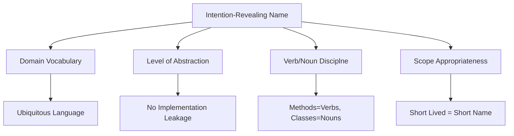
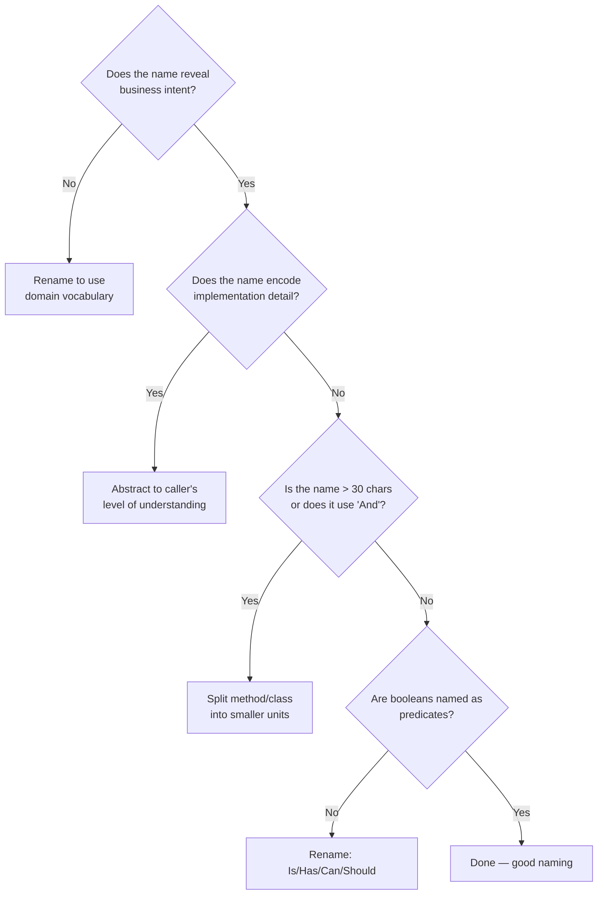

> [!success] Mastery Check
> - [ ] **Studied Well**
> - [ ] **Can explain the concept without notes**
> - [ ] **Can answer interview questions confidently**
> - [ ] **Can implement it in a real project**


## Navigation
**Domain:** [[6 — Design Principles & Patterns]] > **Group:** Clean Code
**Previous:** [[6.011 — Fail Fast]] | **Next:** [[6.013 — Functions — Single Level of Abstraction]]
### Prerequisites
- [[6.011 — Fail Fast]] — Naming conventions fail fastest at the code-review stage.
### Where This Fits
Names are the most pervasive documentation in a codebase — every identifier communicates intent to future readers. This note covers choosing names that reveal purpose rather than implementation, eliminating the need for explanatory comments. Good naming is the foundation of self-documenting code and directly reduces the defect rate at call sites.

---

## Core Mental Model
A name is a contract with the reader: it should answer *what* and *why*, never *how*. If you need to read the body to understand what a method does, the name failed. If a variable requires a comment to explain its meaning, the name failed. The cost of a poor name compounds over every future read — and code is read ~10x more than it is written.

### Dimensions


1. **Domain Vocabulary** — Use the same terms as the business domain (Ubiquitous Language from DDD).
2. **Level of Abstraction** — Name should match the abstraction, not the implementation (`ComputeTotal` not `ForEachLineItemAddToRunningTotal`).
3. **Verb/Noun Discipline** — Methods are verbs/verb phrases (`Save`, `GetInvoice`); classes and structs are nouns (`Invoice`, `LineItem`); booleans are predicates (`IsActive`, `HasExpired`).
4. **Scope Appropriateness** — Wider scope (public API) deserves longer, more descriptive names; narrow scope (loop variable) can be short (`i`, `index`).

---

## Deep Mechanics
### How It Works

**Before (poor naming):**
```csharp
// What does this method do? Why 0.08m? What is a "d"?
public decimal Calc(decimal a, decimal b, decimal d)
{
    var t = a * d;        // t? a? d?
    var s = t > 100m ? t * 0.08m : 0m;
    return b + s;
}
```

**After (intention-revealing):**
```csharp
/// <summary>
/// Calculates the total order cost including shipping surcharge
/// for remote postal codes.
/// </summary>
public decimal CalculateOrderTotal(
    decimal subtotal,
    decimal shippingCost,
    decimal distanceInKm)
{
    var remoteSurchargeRate = 0.08m;
    var surchargeThreshold = 100m;
    var baseAmount = subtotal * distanceInKm;
    var surcharge = baseAmount > surchargeThreshold
        ? baseAmount * remoteSurchargeRate
        : 0m;
    return shippingCost + surcharge;
}
```

**Key transformations:**
- `Calc` → `CalculateOrderTotal` reveals business intent (order total, not generic calculation)
- `a`, `b`, `d` → `subtotal`, `shippingCost`, `distanceInKm` document parameters at every call site
- Magic `100m` and `0.08m` → named constants `surchargeThreshold` and `remoteSurchargeRate` explain the business rule

### Why It Matters at Scale
In a 500K+ LOC codebase with 50+ developers, poorly named identifiers force every reader to:
1. Navigate to the definition to understand purpose (2-5 minutes per occurrence)
2. Repeat for every unfamiliar identifier in every PR review
3. Risk misinterpreting intent and introducing subtle bugs

A single well-named method saves ~3 minutes per read × ~100 reads/year = 5 hours/year *per identifier*.

---

## Production Code Patterns
### Implementation in C#

**❌ Violation — Names that hide intent:**
```csharp
public class Data
{
    public int Id { get; set; }
    public string Info { get; set; }
    public bool Flag { get; set; }

    public void Process()
    {
        if (Flag) { /* ... */ }
    }
}
```

**✅ Correct — Names that reveal intent:**
```csharp
/// <summary>
/// Represents a customer refund request initiated after order cancellation.
/// </summary>
public record RefundRequest(
    Guid RequestId,
    int OrderId,
    string CancellationReason,
    bool RequiresManagerApproval)
{
    public void Approve()
    {
        if (!RequiresManagerApproval)
        {
            throw new InvalidOperationException(
                "Only refunds requiring approval can be approved.");
        }
        // ...
    }
}
```

**❌ Violation — Boolean parameters that are meaningless at call sites:**
```csharp
orderService.UpdateStatus(orderId, true, false);
```

**✅ Correct — Named arguments or enum:**
```csharp
orderService.UpdateStatus(
    orderId,
    isShipped: true,
    sendNotification: false);

// Even better — use an enum:
orderService.UpdateStatus(orderId,
    OrderStatusUpdate.Shipped(sendNotification: false));
```

### ASP.NET Core / .NET Ecosystem Integration

```csharp
// ❌ Violation — Ambiguous endpoint names
app.MapPost("/api/data", (Request req) => { ... });

// ✅ Correct — Domain-revealing names
app.MapPost("/api/orders/{orderId}/cancel", (
    Guid orderId,
    CancelOrderRequest request) => { ... });

// ❌ Violation — Poorly named services
services.AddScoped<IHelper, Helper>();

// ✅ Correct — Domain-revealing service registration
services.AddScoped<IOrderCancellationService, OrderCancellationService>();
```

---

## Gotchas & Anti-Patterns
### Hungarian Notation for .NET Types
**Wrong:** `string strName; int iCount; bool bIsActive` — encodes type information that the compiler already enforces in C#. Violates .NET naming guidelines.
**Right:** `string customerName; int itemCount; bool isActive` — domain-revealing, type-obvious from context.
**Consequence:** Maintenance burden when types change (e.g., `int iCount` → `long`), name must be updated or lies.

### Abbreviations That Save 3 Characters
**Wrong:** `CalcAmt`, `CustAddr`, `MsgTxt`, `btnSubmit` — saves 3-8 characters at the cost of clarity.
**Right:** `CalculateAmount`, `CustomerAddress`, `MessageText`, `submitButton` — full words are instantly parseable.
**Consequence:** Every abbreviation is a mini-puzzle. New joiners waste a week decoding tribal abbreviations.

### The God Object Names
**Wrong:** `Data`, `Info`, `Manager`, `Processor`, `Helper` — these names reveal nothing about responsibility.
**Right:** `InvoicePaymentProcessor`, `EmailNotificationManager`, `RefundEligibilityRule` — encodes single responsibility.
**Consequence:** Classes named `Helper` inevitably accumulate 10K+ lines of unrelated logic. No one knows where to put new code.

### False Domain Names
**Wrong:** Calling a User entity a `Principal` in the domain layer but `User` in the data layer, and `Account` in the API contract.
**Right:** Single term `User` across all layers; map via AutoMapper profiles if the external API demands a different term.
**Consequence:** Mental translation cost on every layer crossing leads to mapping errors and bugs where the wrong entity is used.

### Boolean Parameter Named `flag`
**Wrong:** `UpdateOrder(order, flag: true)` — what does `true` mean? Is it "urgent"? "force"? "notify"?
**Right:** `UpdateOrder(order, isUrgent: true)` or better, separate the concern into two methods.
**Consequence:** Every call site is a landmine. Developer must navigate to the method signature to understand intent.

### Loop Variable List
**Wrong:** `foreach (var itm in ordrs) { ... }` — abbreviations force mental decoding each iteration.
**Right:** `foreach (var order in orders) { ... }` — plural for collection, singular for element.
**Consequence:** Micro-friction across hundreds of loops compounds into significant reading fatigue.

---

## Performance Implications
### Maintenance Cost Model
| Scenario | Defect Probability | Change Impact | Onboarding Cost |
|---|---|---|---|
| Intention-revealing names | Low | Isolated | Low |
| Obscure names | High | Cascading | High |

**No benchmark data:** Naming discipline has no measurable runtime performance impact. Measured via: PR review cycle time, onboarding ramp period, and defect density in newly modified code.

---

## Interview Arsenal
### Question Bank
1. "What makes a name 'intention-revealing'?"
2. "How long should a variable name be?"
3. "Should you rename identifiers that external consumers depend on?"
4. "How do you handle naming when the business uses inconsistent terms?"
5. "What is the relationship between naming and comments?"
6. "When is it acceptable to use a single-letter variable name?"
7. "How do you name a method that does two things?"
8. "What naming conventions does the .NET team recommend and why?"

### Spoken Answers

> **Q1: What makes a name "intention-revealing"?**
>
> **Average answer:** A name that describes what the variable or method does instead of how it does it.
>
> **Great answer:** A name that answers the reader's primary question — "what is this for?" — without requiring them to read the implementation. For example, `order.IsShipped` reveals intent while `order.Flag` requires context. In the .NET ecosystem, this aligns with the Framework Design Guidelines: `HttpClient` reveals it's an HTTP client, not a `NetworkCommunicator`. The name should encode the *why* at the caller's level of abstraction, not the *how* of the implementation. A truly intention-revealing name makes a comment redundant.

> **Q3: Should you rename identifiers that external consumers depend on?**
>
> **Average answer:** No, because it's a breaking change.
>
> **Great answer:** It depends on the consumer. Public API surface (NuGet packages, REST contracts) should not be renamed without a major version bump following SemVer. However, within an internal codebase, rename aggressively — the IDE refactoring tools handle updates, and the cost of a bad name on day one is far lower than the accumulated cost of that bad name over years. For JSON serialization contracts, use `[JsonPropertyName]` or `[DataMember]` to decouple the internal name from the wire format. The .NET team itself renames internal symbols in major releases (e.g., `HttpWebRequest` → `HttpClient`).

### Trick Question
**"Is `temp` an acceptable variable name?"**
Why it is a trap: `temp` appears innocent because the variable is short-lived, but the name conveys zero intent — every developer has a different guess about what the temporary holds. Correct answer: `temp` is acceptable only when the value truly has no semantic meaning beyond being a transient intermediate, such as in `var temp = a; a = b; b = temp;` (swap). In any other scenario — including parsing, transformation, or accumulation — `temp` should be replaced with a domain-revealing name like `parsedValue`, `intermediateTotal`, or `swappedItem`. The .NET runtime itself never uses `temp` in its BCL source except in swap patterns.

### Comparison Table
| Aspect | Intention-Revealing Names | Comments |
|---|---|---|
| Intent | Make code self-documenting via identifiers | Explain what code cannot express |
| Participants | Every identifier in codebase | XML doc, inline, TODO |
| When to use | Always — every declaration | Only when name cannot capture business rationale |
| .NET example | `httpClient.SendAsync(request)` | `/// <summary>why SendAsync retries 3 times</summary>` |
| Key difference | Name answers *what*; disappears when read | Comment answers *why*; must be maintained separately |

---

## Decision Framework



### Application Checklist
- [ ] Does every identifier use domain vocabulary consistent with the ubiquitous language?
- [ ] Do method names use verbs and class names use nouns?
- [ ] Can every boolean field/property be read as "is/has/can/should [something]"?
- [ ] Would removing a comment require a rename to preserve understanding?
- [ ] Is the name length proportional to the identifier's scope?

### Tradeoff Summary
| Principle | Cost | Benefit |
|---|---|---|
| Long descriptive names | More typing (mitigated by IDE completion) | Zero ambiguity at call sites |
| Short name for small scope | Requires scope understanding | Faster scanning in tight loops |
| Consistent domain language | Upfront alignment effort across team | Reduced mental translation cost |

---

## Self-Check
### Conceptual Questions
1. Why is `Get` not always a good prefix for a method?
2. What is the single most important question your name should answer for a reader?
3. How does naming relate to the Single Responsibility Principle?
4. Why are `Helper` and `Utility` considered anti-patterns for class names?
5. What naming convention identifies a Boolean property in .NET?
6. Should a test method name describe the scenario or the expected outcome?
7. Why is `data` considered a poor variable name?
8. What is the "abbreviation anti-pattern"?
9. How does intention-revealing naming eliminate the need for certain comments?
10. What is the relationship between scope and name length?

<details><summary>Answers</summary>
1. `Get` implies a pre-existing value; use `Calculate`, `Find`, `Fetch`, `Create` depending on semantics.
2. "What is this for?" — the purpose of the identifier in the current context.
3. A class with a good name naturally forces a single responsibility; names that mix domains reveal SRP violations.
4. They lack a defined responsibility, becoming catch-all dumping grounds for unrelated code.
5. `Is`/`Has`/`Can`/`Should` prefix + predicate naming, e.g., `IsActive`, `HasExpired`, `CanCancel`.
6. Both — the name should encode the scenario AND the expected outcome: `CancelOrder_WhenOrderIsShipped_ThrowsException`.
7. It reveals nothing about the content, structure, or purpose of the data being stored.
8. Saving a few characters at the cost of forcing every reader to decode the abbreviation.
9. If the name captures the *why* (business intent), there's no need for a comment explaining what the code does.
10. Wider scope (public API) = longer, more descriptive name; narrow scope (local variable in 3-line block) = short name.
</details>

### Code Puzzles

**Puzzle 1 — Rename this method:**
```csharp
public bool Check(Order order) => order.Status != OrderStatus.Cancelled && order.PaymentReceived;
```

<details><summary>Answer</summary>
`IsReadyForFulfillment` — reveals the business meaning (ready to ship) instead of the generic "check".
</details>

**Puzzle 2 — Rename these variables:**
```csharp
var d = DateTime.UtcNow.AddDays(-30);
var r = await _repo.GetOrdersAsync(d);
var f = r.Where(o => o.Total > 1000m);
```

<details><summary>Answer</summary>
`thresholdDate`, `recentOrders`, `highValueOrders` — each reveals the business filtering criteria.
</details>

**Puzzle 3 — What's wrong with this class name?**
```csharp
public class OrderManager
{
    public void Create(Order order) { ... }
    public void Cancel(Guid orderId) { ... }
    public void PrintInvoice(Guid orderId) { ... }
    public decimal CalculateRefund(Guid orderId) { ... }
}
```

<details><summary>Answer</summary>
`Manager` is a catch-all. Split into `OrderFactory`, `OrderCancellationService`, `InvoicePrinter`, and `RefundCalculator` — each with a single, clearly named responsibility.
</details>

**Puzzle 4 — Fix the parameter names:**
```csharp
public async Task<Result> TransferAsync(
    Guid f, Guid t, decimal a)
```

<details><summary>Answer</summary>
`fromAccountId`, `toAccountId`, `amount` — each describes the domain meaning, not a generic letter.
</details>

**Puzzle 5 — What does this name obscure?**
```csharp
public async Task<decimal> GetValueAsync(int id)
```

<details><summary>Answer</summary>
Everything. What kind of value? What entity does `id` refer to? Should be something like `CalculateRecurringRevenueAsync(Guid subscriptionId)`.
</details>
