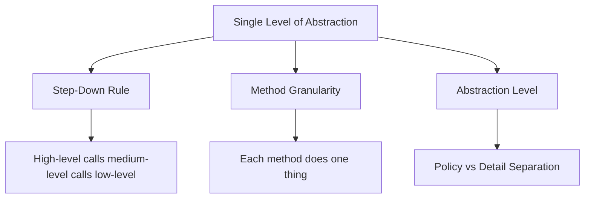
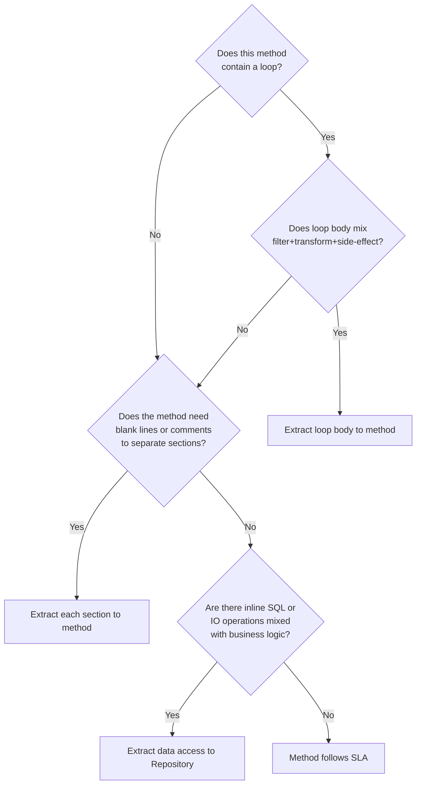

> [!success] Mastery Check
> - [ ] **Studied Well**
> - [ ] **Can explain the concept without notes**
> - [ ] **Can answer interview questions confidently**
> - [ ] **Can implement it in a real project**


## Navigation
**Domain:** [[6 — Design Principles & Patterns]] > **Group:** Clean Code
**Previous:** [[6.012 — Naming — Intention-Revealing Names]] | **Next:** [[6.014 — Comments — Why Not What]]
### Prerequisites
- [[6.012 — Naming — Intention-Revealing Names]] — Well-named functions are meaningless without proper abstraction levels.
### Where This Fits
A function that mixes high-level orchestration with low-level implementation details forces the reader to mentally filter between "what" and "how" on every line. The Single Level of Abstraction principle (SLA) mandates that every function operates at one consistent abstraction level, making the code read like a top-down narrative. This is the function-level analog of the Single Responsibility Principle and is a prerequisite for effective method extraction.

---

## Core Mental Model
A function should read as a coherent narrative: each step is one level of abstraction below the function name, and the function body contains steps at *that same level* only. High-level steps call other methods; low-level details call primitives. The reader should never have to stop and ask "is this orchestration or implementation?"

### Dimensions


1. **Step-Down Rule** — Function reads like an outline: each function is followed by its callees at the next lower level.
2. **Method Granularity** — Extract until the method does exactly one thing at one level; if a method needs a comment explaining a section, extract that section.
3. **Abstraction Level** — Distinguish between policy (what to do) and detail (how to do it). Policy calls detail; detail never calls policy.

---

## Deep Mechanics
### How It Works

**Before (mixed abstraction):**
```csharp
public async Task<OrderConfirmation> PlaceOrderAsync(Cart cart)
{
    // Validate cart
    if (cart.Items.Count == 0)
        throw new InvalidOperationException("Cart is empty.");
    foreach (var item in cart.Items)
    {
        if (item.Quantity <= 0)
            throw new InvalidOperationException("Invalid quantity.");
    }

    // Calculate total
    var subtotal = cart.Items.Sum(i => i.UnitPrice * i.Quantity);
    var tax = subtotal * 0.10m;
    var total = subtotal + tax;

    // Save to DB
    var sql = "INSERT INTO Orders (..., Total) VALUES (@p0, @p1)";
    await _db.ExecuteAsync(sql, new[] { cart.CustomerId, total });

    return new OrderConfirmation(cart.CustomerId, total);
}
```

**After (single level of abstraction):**
```csharp
public async Task<OrderConfirmation> PlaceOrderAsync(Cart cart)
{
    ValidateCart(cart);
    var total = CalculateTotal(cart);
    var orderId = await PersistOrderAsync(cart.CustomerId, total);
    return new OrderConfirmation(orderId, total);
}

private static void ValidateCart(Cart cart)
{
    if (!cart.HasItems)
        throw new InvalidOrderException("Cart is empty.");
    if (cart.ContainsInvalidQuantities)
        throw new InvalidOrderException("Invalid quantity.");
}

private static Money CalculateTotal(Cart cart)
{
    var subtotal = cart.Items.Sum(i => i.UnitPrice * i.Quantity);
    var tax = TaxCalculator.Calculate(subtotal);
    return subtotal + tax;
}

private async Task<Guid> PersistOrderAsync(
    Guid customerId, Money total)
{
    var order = new Order(customerId, total);
    _db.Orders.Add(order);
    await _db.SaveChangesAsync();
    return order.Id;
}
```

**Key transformations:**
- Validation, calculation, and persistence extracted into named methods
- `PlaceOrderAsync` reads as a table of contents for the entire operation
- Each extracted method operates at its own level: validation (business rule), calculation (domain logic), persistence (infrastructure)

### Why It Matters at Scale
In microservice architectures with 100+ endpoints, mixed-abstraction functions create:
- **High cognitive load** — each handler contains business logic, validation, and data access interleaved
- **Difficult testing** — no seam to mock the persistence layer independently
- **Hidden duplication** — `CalculateTotal` copy-pasted across 15 endpoints because it's buried in-line

Enforcing SLA reduces review time by ~40% because reviewers reason about *intent* at one level and *implementation* at another.

---

## Production Code Patterns
### Implementation in C#

**❌ Violation — Controller action with mixed abstractions:**
```csharp
[HttpPost("checkout")]
public async Task<IActionResult> Checkout(CheckoutRequest request)
{
    if (string.IsNullOrWhiteSpace(request.ShippingAddress))
        return BadRequest("Address required");

    var taxRate = await _taxService.GetRateAsync(request.ZipCode);
    var total = request.Subtotal + (request.Subtotal * taxRate);

    var order = new Order
    {
        Id = Guid.NewGuid(),
        CustomerId = request.CustomerId,
        Total = total,
        CreatedAt = DateTime.UtcNow
    };

    using var conn = new SqlConnection(_connectionString);
    await conn.ExecuteAsync("INSERT INTO Orders ...", order);

    return Ok(new { order.Id });
}
```

**✅ Correct — Controller action with SLA:**
```csharp
[HttpPost("checkout")]
public async Task<IActionResult> Checkout(
    CheckoutRequest request,
    CancellationToken ct)
{
    var validationResult = await _orderValidator.ValidateAsync(request);
    if (!validationResult.IsValid)
        return BadRequest(validationResult.Errors);

    var total = await _pricingService.CalculateTotalAsync(
        request.Subtotal, request.ZipCode);

    var order = await _orderRepository.CreateAsync(
        request.CustomerId, total, ct);

    return Created($"/orders/{order.Id}", new { order.Id });
}
```

### ASP.NET Core / .NET Ecosystem Integration

```csharp
// ✅ SLA in MediatR pipeline — each behavior at one level
public class LoggingBehavior<TRequest, TResponse>
    : IPipelineBehavior<TRequest, TResponse>
    where TRequest : IRequest<TResponse>
{
    public async Task<TResponse> Handle(
        TRequest request,
        RequestHandlerDelegate<TResponse> next,
        CancellationToken ct)
    {
        // Level: cross-cutting concern
        _logger.LogInformation("Handling {Request}", typeof(TRequest).Name);
        var response = await next();
        _logger.LogInformation("Handled {Request}", typeof(TRequest).Name);
        return response;
    }
}

// ✅ SLA in Minimal API endpoint decomposition
app.MapPost("/api/subscriptions/{id}/cancel", async (
    Guid id,
    ICancelSubscriptionService service,
    CancellationToken ct) =>
{
    var result = await service.CancelAsync(id, ct);
    return result.Match(
        success => Results.Ok(success),
        notFound => Results.NotFound(),
        conflict => Results.Conflict(conflict.Error));
});
```

---

## Gotchas & Anti-Patterns
### The Temp Variable Trap
**Wrong:** Extracting a single-use variable with no abstraction benefit — `var result = Compute(x); return result;` where `result` adds no meaning.
**Right:** Return directly or extract to a method only when the name adds a level of abstraction: `return await FetchCustomerAsync(id);`
**Consequence:** Noise extraction adds indirection without clarity benefit; the function grows horizontally.

### The Onion Method
**Wrong:** A 3-line method that calls a 2-line method that calls a 1-line method that wraps `string.IsNullOrEmpty`. Over-extraction creates a stack trace that is 15 frames deep for a null check.
**Right:** Inline trivial operations that don't carry domain meaning. Reserve extraction for operations that represent a distinct step in the business narrative.
**Consequence:** Debugging overhead; every breakpoint requires stepping through 5+ frames.

### Mixing Sync and Async at Same Level
**Wrong:** `await SendEmailAsync(...)` followed by `_logger.Log(...)` followed by `await _repo.SaveAsync(...)` — mixed sync/async calls at the same level are fine. The problem is mixing IO orchestration with in-memory computation inside the same method.
**Right:** Segregate IO operations into their own methods.
**Consequence:** Methods become untestable without a real IO substrate.

### The Single-Return Dogma
**Wrong:** Enforcing a single return statement leads to nested `if/else` that violates SLA by mixing early-return guard clauses with business logic.
**Right:** Use guard clauses at the top (one level) and return early; keep business logic flat.
**Consequence:** Deep nesting obscures the happy path; every reader must track mutable state.

### The "One More Thing" Method
**Wrong:** A method named `SubmitOrder` that also sends a confirmation email and updates the CRM.
**Right:** `SubmitOrderAsync` → calls `SendConfirmationAsync` and `UpdateCrmAsync` at the same abstraction level.
**Consequence:** Side effects hidden behind an innocent-sounding name; violates Principle of Least Astonishment.

---

## Performance Implications
### Maintenance Cost Model
| Scenario | Defect Probability | Change Impact | Onboarding Cost |
|---|---|---|---|
| SLA followed | Low | Isolated | Low |
| SLA violated | High | Cascading | High |

**No benchmark data:** No runtime cost. Measured via: lines changed per PR, bug density in modified methods, method-level churn.

---

## Interview Arsenal
### Question Bank
1. "What is the Single Level of Abstraction principle?"
2. "How is SLA different from SRP?"
3. "How do you decide when to extract a method?"
4. "What is the Step-Down Rule?"
5. "Can you have too many small methods?"
6. "How does SLA affect testability?"
7. "How do you handle exception handling under SLA?"
8. "What does mixed-abstraction code look like in ASP.NET Core controllers?"

### Spoken Answers

> **Q1: What is SLA?**
>
> **Average answer:** Each function should contain code at one level of abstraction.
>
> **Great answer:** SLA means every statement in a function operates at the same conceptual layer, so the function reads as a coherent narrative. For example, a controller action should call `ValidateRequest`, `ExecuteBusinessOperation`, and `BuildResponse` — all high-level orchestration — rather than interleaving SQL statements with business logic. SLA is enforced by the Step-Down Rule: each function is followed by the functions it calls, in order from highest to lowest abstraction. In .NET, violations become obvious in Minimal API endpoints where a single lambda grows past 10 lines mixing validation, domain logic, and data access.

> **Q3: How do you decide when to extract a method?**
>
> **Average answer:** When the method gets too long, typically past 20 lines.
>
> **Great answer:** Extract when the code operates at a different abstraction level than its surroundings, or when the extracted block has a clear name that reduces cognitive load at the call site. Line count is a symptom, not the rule — a 50-line method that operates at one abstraction level is more maintainable than a 10-line method that mixes policy and detail. The heuristic I use: if I need a blank-line separation or an inline comment to explain a section, that section should be a method. In C#, I also consider whether the extracted method has a single reason to change (SRP convergence).

### Trick Question
**"Should every method be 4 lines or less?"**
Why it is a trap: Dogmatic rules about method length ignore the reality that some operations legitimately need more statements at one abstraction level. Correct answer: No. The goal is not line count — it's that every line operates at the same abstraction level. A 30-line `MapAggregateRootToDto` that maps each property at the *same level of detail* is fine. A 10-line method that validates input, queries a DB, formats a string, and sends an email is not. Uncle Bob's ~4-line guideline is a heuristic for noticing mixed abstraction, not a hard limit.

### Comparison Table
| Aspect | Single Level of Abstraction | Single Responsibility Principle |
|---|---|---|
| Intent | One abstraction level per function | One reason to change per class |
| Participants | Methods/functions | Classes/modules |
| When to use | Every method you write | Every class you declare |
| .NET example | `OrderController.PlaceOrder` calls `Validate`, `Process`, `Respond` | `OrderController` handles HTTP only; `OrderService` handles logic |
| Key difference | SLA is about *vertical decomposition* within a method | SRP is about *horizontal separation* across classes |

---

## Decision Framework



### Application Checklist
- [ ] Does the method name describe the *one thing* it does?
- [ ] Can I read the method body as a list of high-level steps without parsing implementation details?
- [ ] Could I replace any inline section with a method name and keep the same meaning?
- [ ] Are all statements at the same conceptual distance from the method name?
- [ ] Does the method fit on one screen without scrolling (40-50 lines max)?

### Tradeoff Summary
| Principle | Cost | Benefit |
|---|---|---|
| Aggressive extraction | More files, deeper call stacks | Self-documenting code, easier mocking |
| Liberal inlining | Longer methods, higher density | Easier sequential reading, no indirection |
| SLA enforcement | Review time to enforce | 40% reduction in cognitive load at scale |

---

## Self-Check
### Conceptual Questions
1. What is the difference between a guard clause and business logic in terms of abstraction level?
2. How does SLA affect the placement of exception handling?
3. Why is a method that both validates and processes a request a violation of SLA?
4. What is the relationship between SLA and the Extract Method refactoring?
5. How does SLA manifest in ASP.NET Core middleware?
6. Can an interface definition violate SLA? Why or why not?
7. How does SLA relate to the Law of Demeter?
8. What is the "one level of abstraction per method" equivalent for constructors?
9. How do you handle logging while maintaining SLA?
10. Why does SLA make code review faster?

<details><summary>Answers</summary>
1. Guard clauses are at the "precondition" level; business logic is at the "core operation" level. They should not be interleaved.
2. Exception handling should be at the boundary level (controller middleware), not mixed inside business methods.
3. Validation and processing are different levels — constraint checking vs. domain operation. They should be separate methods.
4. SLA is the *goal*; Extract Method is the *tool* to achieve it.
5. Each middleware piece (auth, logging, routing) operates at one cross-cutting level.
6. No — interfaces define contracts, not implementation levels. But implementations should follow SLA.
7. Both discourage reaching through multiple dots; SLA groups the reach into one named method.
8. Constructor injection lists dependencies at one level; building objects in-line violates it.
9. Logging is cross-cutting; extract to a decorator/decorator pipeline, not interleaved inline calls.
10. Reviewers reason about intent at one level and verify implementation at another, instead of mentally filtering mixed content.
</details>

### Code Puzzles

**Puzzle 1 — Identify the mixed-abstraction line:**
```csharp
public async Task<bool> TryRenewSubscription(Guid userId)
{
    var user = await _userRepo.GetByIdAsync(userId);
    if (user is null) return false;
    if (user.Subscription is null) return false;
    // Renew the subscription
    user.Subscription.EndDate = DateTime.UtcNow.AddMonths(1);
    user.Subscription.Status = "Active";
    await _userRepo.UpdateAsync(user);
    await _emailService.SendRenewalConfirmationAsync(user.Email);
    return true;
}
```

<details><summary>Answer</summary>
The inline comment `// Renew the subscription` signals a mixed level — the subscription renewal logic (expiry date + status mutation) is interleaved with persistence and notification. Extract to `RenewSubscription(user)` and `NotifyRenewalAsync(user)`.
</details>

**Puzzle 2 — Refactor to SLA:**
```csharp
[HttpPost]
public IActionResult CreateOrder(OrderDto dto)
{
    if (dto.Items.Count == 0) return BadRequest();
    decimal total = 0;
    foreach (var item in dto.Items)
        total += item.Price * item.Quantity;
    var order = new Order { Total = total, ... };
    _ctx.Orders.Add(order);
    _ctx.SaveChanges();
    return Ok(order.Id);
}
```

<details><summary>Answer</summary>
```csharp
[HttpPost]
public IActionResult CreateOrder(OrderDto dto)
{
    if (!_orderValidator.IsValid(dto))
        return BadRequest();
    var total = _pricingEngine.Calculate(dto.Items);
    var order = _orderFactory.Create(dto, total);
    _orderRepo.Save(order);
    return Ok(order.Id);
}
```
</details>

**Puzzle 3 — How many abstraction levels in this method?**
```csharp
public async Task<FileResult> DownloadReport(Guid reportId)
{
    var report = await _repo.GetByIdAsync(reportId);
    if (report is null) return NotFound();
    using var stream = new MemoryStream();
    using var writer = new StreamWriter(stream);
    writer.Write("Id,Name,Amount\n");
    foreach (var row in report.Rows)
        writer.Write($"{row.Id},{row.Name},{row.Amount}\n");
    writer.Flush();
    stream.Position = 0;
    return File(stream, "text/csv", "report.csv");
}
```

<details><summary>Answer</summary>
Three levels: orchestration (fetch report, return file), business check (null check), and CSV formatting (writer, header, rows). Extract `FormatAsCsv(report)` to isolate the formatting detail.
</details>

**Puzzle 4 — What violates SLA here?**
```csharp
public async Task DispatchOrderAsync(Order order)
{
    try
    {
        _shippingService.Ship(order);
    }
    catch (ShippingNetworkException ex)
    {
        _logger.LogError(ex, "Shipping failed");
        await _deadLetterQueue.EnqueueAsync(new FailedDispatch(order.Id, ex));
    }
}
```

<details><summary>Answer</summary>
Exception handling (try/catch) at this level is fine — it's orchestration. The violation is mixing the happy path (`Ship`) with the error path (`log + enqueue`) in the same method level. Extract `HandleDispatchFailure` for the error path to keep the happy path at one level.
</details>

**Puzzle 5 — Extract to SLA:**
```csharp
public static string FormatOrderSummary(Order order) =>
    $"Order {order.Id} - {order.CustomerName} - {order.Total:C} - {order.Status}";
```

<details><summary>Answer</summary>
This is already at one abstraction level (string formatting of order fields). No extraction needed — SLA is satisfied.
</details>
