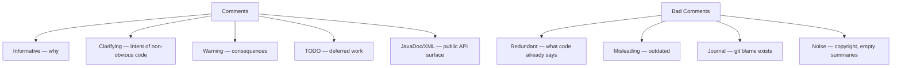
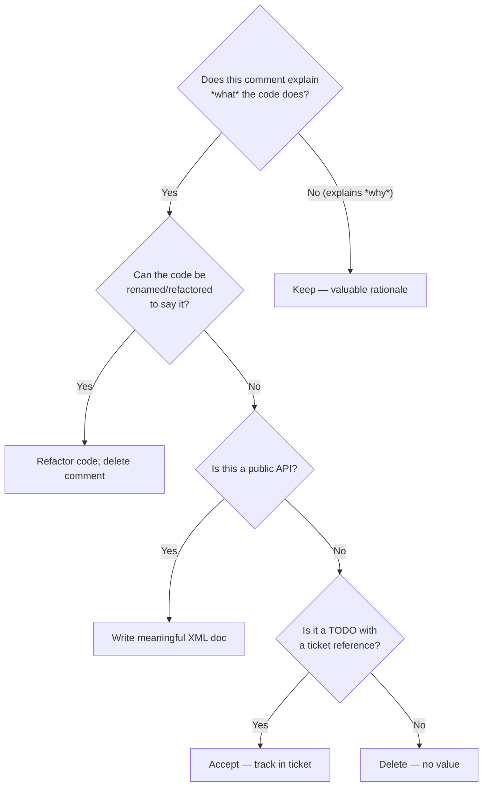

> [!success] Mastery Check
> - [ ] **Studied Well**
> - [ ] **Can explain the concept without notes**
> - [ ] **Can answer interview questions confidently**
> - [ ] **Can implement it in a real project**


## Navigation
**Domain:** [[6 — Design Principles & Patterns]] > **Group:** Clean Code
**Previous:** [[6.013 — Functions — Single Level of Abstraction]] | **Next:** [[6.015 — Error Handling — Exceptions vs Return Values]]
### Prerequisites
- [[6.013 — Functions — Single Level of Abstraction]] — Well-factored functions naturally need fewer comments.
### Where This Fits
Comments are a necessary evil — they document *why* the code exists (business rationale, tradeoffs) but should never explain *what* the code does (the code should do that itself). This note covers when comments add value, when they rot, and how to let well-named code replace most of them. The official .NET XML doc system is for public API surface; everything else should strive to be self-documenting.

---

## Core Mental Model
A comment is a failure of expression. Every comment that explains *what* the code does represents a missed opportunity to rename, refactor, or restructure the code to be self-explanatory. The only defensible comments are those that explain *why* — the business rule that has no code analogue, the performance tradeoff, the legal requirement. All comments rot; code doesn't lie.

### Dimensions


1. **Informative** — Explains *why* a business rule exists (regulatory, contractual, historical).
2. **Clarifying** — Documents the intent of a non-obvious piece of code (algorithm choice, performance rationale).
3. **Warning** — Flags consequences of modification or usage constraints.
4. **TODO** — Marks deferred work with owner and ticket reference; never a permanent resident.
5. **Public API XML** — The only mandated comments in .NET; `/// <summary>` for all public members.

---

## Deep Mechanics
### How It Works

**Before (bad comments):**
```csharp
/// <summary>
/// Gets the data.
/// </summary>
/// <param name="id">The id.</param>
/// <returns>The data.</returns>
public Order GetData(int id)
{
    // Check if id is null
    if (id == 0)
        throw new ArgumentException("Id cannot be 0");

    // Get the order from DB
    var order = _repo.GetById(id);

    // Calculate discount
    if (order.Total > 100)
        order.Total = order.Total * 0.9m;

    // Return the order
    return order;
}
```

**After (clean comments — what removed, why kept):**
```csharp
/// <summary>
/// Retrieves an order with a volume discount applied
/// when the total exceeds the threshold.
/// </summary>
/// <remarks>
/// The 10% discount for orders over $100 was introduced
/// by marketing (ticket MKT-442) and applies to all
/// non-wholesale customers.
/// </remarks>
public Order GetOrderWithDiscount(int orderId)
{
    ArgumentOutOfRangeException.ThrowIfNegativeOrZero(orderId);
    var order = _repo.GetById(orderId);

    if (order.Total > DiscountThreshold)
    {
        // Apply marketing promotion MKT-442:
        // 10% discount for orders > $100
        order.ApplyDiscount(rate: 0.10m);
    }

    return order;
}
```

**Key transformations:**
- Redundant `/// <summary>Gets the data</summary>` → meaningful summary of what this *specific* operation does
- Useless `<param>` removed (type-safe name already documented)
- `// Check if id is null` → removed (code says `ThrowIfNegativeOrZero` which is self-documenting)
- `// Calculate discount` → removed (extracted to `ApplyDiscount`)
- `/// <remarks>` → added *why* (MKT-442 business rule origin)

### Why It Matters at Scale
At scale, bad comments are worse than no comments:
- **Misleading comments** cause defects — developers trust comments over code; a stale comment saying "this returns UTC" when the code was changed to local time causes silent date bugs that manifest in production.
- **Redundant comments** are noise — every `// Loop through items` adds cognitive friction. In a 500K LOC codebase, 10K+ such comments waste reading time.
- **"What" comments rot** — the code changes, the comment doesn't. "Why" comments survive refactoring because the business rationale changes less often.

---

## Production Code Patterns
### Implementation in C#

**❌ Violation — The useless XML doc:**
```csharp
/// <summary>
/// Sets the name.
/// </summary>
/// <param name="name">The name.</param>
public void SetName(string name) => _name = name;
```

**✅ Correct — Useful XML doc or omitted:**
```csharp
/// <summary>
/// Updates the customer's display name.
/// </summary>
/// <remarks>
/// The name is sanitized to prevent XSS in the web UI.
/// Use <see cref="CustomerProfileService.UpdateFullName"/>
/// when updating both first and last name.
/// </remarks>
public void SetDisplayName(string name)
{
    _name = Sanitizer.HtmlEncode(name);
}
```

**❌ Violation — The commented-out code:**
```csharp
// public void OldMethod() { ... }
```

**✅ Correct — Delete it:**
```csharp
// (nothing — git history preserves it)
```

**❌ Violation — The journal comment:**
```csharp
// 2024-01-15: Fixed bug where null customer caused crash — John
// 2024-03-20: Changed to use new API — Jane
```

**✅ Correct — Use git blame:**
```csharp
// (no journal comments — version control serves this purpose)
```

### ASP.NET Core / .NET Ecosystem Integration

```csharp
// ✅ Informative comment: business rule rationale
public class AuctionBiddingService
{
    private static readonly TimeSpan BidExtensionWindow = TimeSpan.FromMinutes(5);

    public bool CanPlaceBid(Auction auction, DateTime utcNow)
    {
        // EB-1287: European auction regulation requires that any bid
        // placed within the last 5 minutes extends the auction by 5 minutes.
        // This prevents "sniping" and is non-negotiable per compliance.
        return auction.EndsAtUtc > utcNow ||
               (auction.EndsAtUtc >= utcNow - BidExtensionWindow);
    }
}

// ✅ TODO with ticket reference (acceptable short-term)
// TODO: Replace with Polly retry policy — see INFRA-772
services.AddHttpClient<IPaymentGatewayClient, StripeClient>()
    .Add transient fault handling ...

// ✅ Warning comment for fragile coupling
// WARNING: The order of middleware registration matters here.
// RateLimiter must come AFTER auth so that unauthenticated
// requests are rejected before consuming rate limit budget.
app.UseAuthentication();
app.UseAuthorization();
app.UseRateLimiter();
```

---

## Gotchas & Anti-Patterns
### The "What" Comment That Never Dies
**Wrong:** `// Increment counter` above `count++;` — the code already says this, and the comment adds zero value. When the code changes to `count += 2;`, the comment lies.
**Right:** Delete the comment. If you feel the need for a comment, rename to `incrementCount` or extract to `IncrementOrderCount()`.
**Consequence:** Stale comments become misinformation. Readers trust the comment over the code, introducing subtle bugs.

### The XML Doc That Says Nothing
**Wrong:** `/// <summary>Gets or sets the name.</summary>` on a property called `Name` — this is pure noise that passes code review because it "looks documented."
**Right:** Either omit the summary (internal code) or write something meaningful: `/// <summary>The customer's billing contact name.</summary>`.
**Consequence:** False sense of documentation. Tools like Sandcastle/GhostDoc generate useless doc, and teams stop reading summaries.

### Copyright Headers on Every File
**Wrong:** 15-line MIT license block at the top of every `.cs` file.
**Right:** A single `LICENSE` file at root. Remove per-file headers entirely.
**Consequence:** Noise at the top of every file. Developers scroll past it without reading, and it adds no legal protection beyond the root license.

### The Legal Compliance Comment
**Wrong:** `// This code must not be modified` — an unenforceable decree.
**Consequence:** If a developer *must* modify it, the comment creates guilt without guidance. Better to use `[Obsolete]`, `sealed`, or an analyzer rule (`<SuppressMessage>` with a justification).

### The Hungry Comment Block
**Wrong:** A 40-line ASCII-art comment block separating sections of a 200-line method.
**Right:** Extract each section into its own method. The method name is the comment that never goes stale.
**Consequence:** The comment block is ignored after the first read. The sections drift independently, and the comment becomes a wall that developers scroll past.

### Comment-Driven-Development
**Wrong:** Writing a comment as a TODO: `// TODO: Should we validate the email here?` that sits for 2 years.
**Right:** Decide now. If it matters, write a test. If it doesn't, delete the comment. If it's deferred, create a ticket and reference it: `// TODO: Validate email format — AUTH-331`.
**Consequence:** Accumulated TODOs become noise. Teams develop "TODO blindness" and miss the one that actually matters.

---

## Performance Implications
### Maintenance Cost Model
| Scenario | Defect Probability | Change Impact | Onboarding Cost |
|---|---|---|---|
| Comments explain *why* only | Low | Isolated | Low |
| Comments explain *what* | Medium | Cascading (stale) | Medium |
| No comments, poor names | High | Cascading | High |

**No benchmark data:** No runtime cost. Measured via: comment-to-code ratio, stale comment detection rate, and onboarding ramp time.

---

## Interview Arsenal
### Question Bank
1. "When is a comment justified?"
2. "What is the worst kind of comment?"
3. "Should all public API have XML doc comments?"
4. "How do you handle TODO comments?"
5. "What is the relationship between comments and unit tests?"
6. "Are `/// <summary>Property name</summary>` comments useful?"
7. "How do you document a complex algorithm without comments?"
8. "Should you comment non-obvious bug fixes?"

### Spoken Answers

> **Q1: When is a comment justified?**
>
> **Average answer:** When the code is complex and hard to understand.
>
> **Great answer:** A comment is justified when it explains *why* — the business rationale, the regulatory constraint, the performance tradeoff — that cannot be expressed in code. If the code is hard to understand, the correct response is to refactor, not comment. The .NET XML doc system should only carry public API surface documentation for consumers who don't have source access; everything internal should be self-documenting via names and structure. The only exception is algorithm rationale (e.g., "we use a Bloom filter here because dataset fits in L2 cache").

> **Q3: Should all public API have XML doc comments?**
>
> **Average answer:** Yes, every public member must have XML doc.
>
> **Great answer:** Yes for NuGet packages consumed externally — the XML doc file ships with the package and powers IntelliSense. For internal line-of-business apps where all consumers have source access, the cost-benefit shifts: worthless `<param>` comments that parrot the parameter name are worse than nothing. Enforce meaningful summaries via `.editorconfig` and code review, not blanket rules. I use `dotnet_diagnostic.CS1591.severity = warning` and suppress false positives with pragmas rather than empty doc comments.

### Trick Question
**"Wouldn't it be better to just write more comments so everyone understands the code?"**
Why it is a trap: It sounds collaborative and helpful, but "more comments" is a proxy for "the code is unreadable." Correct answer: No. More comments create a parallel maintenance burden that diverges from the code. The code should be the truth. Comments that repeat the code are noise. Comments that explain *why* are valuable but should be the minority. The correct ratio is ~90% self-documenting code / ~10% strategic *why* comments. If a team needs "more comments," the real solution is better naming and smaller methods.

### Comparison Table
| Aspect | Comments (Why) | Naming (What) |
|---|---|---|
| Intent | Explain business rationale, tradeoffs | Make code self-documenting via identifiers |
| Participants | XML doc, inline, remarks | Every identifier in codebase |
| When to use | Regulatory, performance, historical | Always — every declaration |
| .NET example | `/// <remarks>PCI-DSS requirement</remarks>` | `httpClient.SendAsync(request)` |
| Key difference | Comments rot; names don't | Names are executable truth |

---

## Decision Framework



### Application Checklist
- [ ] Does this comment explain *why* or *what*? (delete if *what*)
- [ ] Could I rename or refactor the code so this comment is unnecessary?
- [ ] Is this XML doc adding information beyond the signature?
- [ ] Is this TODO linked to a ticket or owner?
- [ ] Would a unit test convey this information better?

### Tradeoff Summary
| Principle | Cost | Benefit |
|---|---|---|
| Always comment public API | XML doc overhead, risk of stale docs | IntelliSense for consumers |
| Never comment inline | Forces code clarity | Zero maintenance burden |
| Strategic *why* comments | None (stable rationale) | Preserves tribal knowledge |

---

## Self-Check
### Conceptual Questions
1. What is the difference between an informative comment and a redundant comment?
2. Why do "what" comments rot faster than "why" comments?
3. What is the single best replacement for a "what" comment?
4. How should you handle auto-generated XML doc from GhostDoc or CoPilot?
5. Why are copyright headers at the top of each file considered noise?
6. What is the relationship between comments and the Single Level of Abstraction?
7. When is a `// TODO` acceptable vs. irresponsible?
8. Should unit tests have comments?
9. What does a high comment-to-code ratio indicate about a codebase?
10. How does XML doc benefit NuGet package consumers?

<details><summary>Answers</summary>
1. Informative explains *why* (business rule, tradeoff); redundant explains *what* (code already says it).
2. Code changes for features and bug fixes; *what* comments must track those changes. *Why* comments (regulation, business rule) change rarely.
3. A well-named method/class/variable.
4. Delete them — they produce noise like `/// <summary>Gets or sets the name.</summary>`. Write meaningful summaries or nothing.
5. A single LICENSE file at the root suffices legally; per-file headers add no value and consume screen space.
6. SLA produces methods at one conceptual level, each named to reveal intent — eliminating the need for "what" section comments.
7. Acceptable with ticket reference (`// TODO: Add retry — INFRA-772`); irresponsible as a permanent resident without ownership.
8. Test names should describe scenario + expectation (`CancelOrder_WhenShipped_Throws`). Inline comments inside tests suggest the test is unreadable.
9. It signals that the code is unreadable without explanatory prose — the team should focus on refactoring, not translating.
10. XML doc ships in the `.xml` file inside the NuGet package, powering IntelliSense for consumers who don't have source access.
</details>

### Code Puzzles

**Puzzle 1 — Which comments should be deleted?**
```csharp
// This method validates the order
public bool ValidateOrder(Order order)
{
    // Check if order is null
    if (order is null)
        throw new ArgumentNullException(nameof(order));

    // Ensure items exist
    if (order.Items.Count == 0)
        return false;

    // Verify payment
    // Payment must be completed before validation
    return order.PaymentStatus == PaymentStatus.Completed;
}
```

<details><summary>Answer</summary>
Delete all of them — every comment explains what the code already says. The method name `ValidateOrder` and the statements are self-documenting. If `PaymentStatus == Completed` needs explanation, extract to `HasCompletedPayment`.
</details>

**Puzzle 2 — Rewrite this bad XML doc:**
```csharp
/// <summary>
/// Sends the notification.
/// </summary>
/// <param name="userId">The user id.</param>
/// <param name="message">The message.</param>
public Task SendNotificationAsync(Guid userId, string message)
```

<details><summary>Answer</summary>
```csharp
/// <summary>
/// Sends a push notification to the user's registered device.
/// </summary>
/// <remarks>
/// Falls back to email if the user has no registered device
/// or if push delivery fails after 3 retries.
/// </remarks>
public Task SendPushNotificationAsync(Guid userId, string message)
```
</details>

**Puzzle 3 — Identify the dangerous comment:**
```csharp
// Returns the total in USD
public Money CalculateTotal(Order order, bool includeTax = false)
{
    // ...
}
```

<details><summary>Answer</summary>
If the method is later changed to return EUR but the comment isn't updated, callers will misinterpret the value. The comment is a lying time bomb. Better to encode the currency in the return type: `public Money CalculateTotalInUsd(Order order, ...)`.
</details>

**Puzzle 4 — What should replace this comment?**
```csharp
// Subtract discounts, then add tax, then round
var final = (subtotal - discounts) * (1 + taxRate);
final = Math.Round(final, 2);
```

<details><summary>Answer</summary>
Extract to a well-named method: `CalculateFinalAmountAfterDiscountsAndTax`. The method name replaces the comment and is automatically maintained.
</details>

**Puzzle 5 — Should this comment stay or go?**
```csharp
// EF Core 6.0 bug: Include() on owned entities throws
// InvalidOperationException when query splits are enabled.
// Workaround: load navigation property separately.
// Remove this when upgrading to EF Core 8+.
var order = await _ctx.Orders.Where(o => o.Id == id)
    .AsSplitQuery(false)
    .FirstOrDefaultAsync();
```

<details><summary>Answer</summary>
Stay — it's a *why* comment (explains the reason for a non-obvious workaround), references the bug/version, and has a removal condition. This is a model informative comment.
</details>
