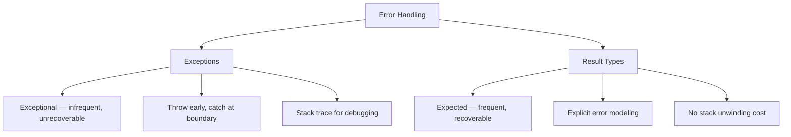
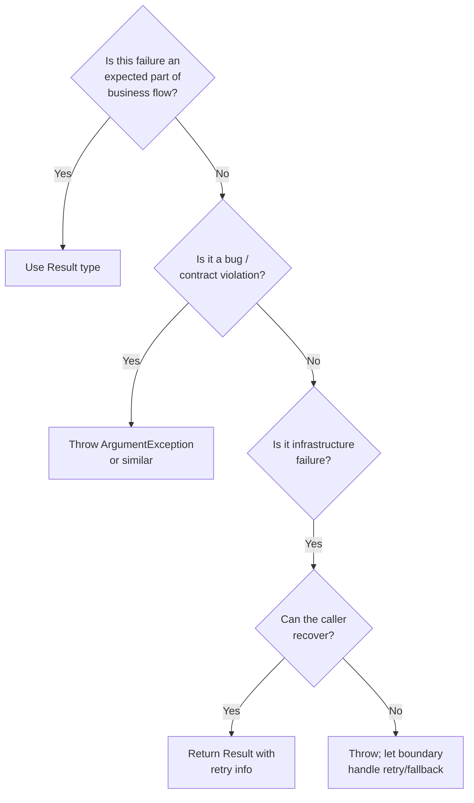

> [!success] Mastery Check
> - [ ] **Studied Well**
> - [ ] **Can explain the concept without notes**
> - [ ] **Can answer interview questions confidently**
> - [ ] **Can implement it in a real project**


## Navigation
**Domain:** [[6 — Design Principles & Patterns]] > **Group:** Clean Code
**Previous:** [[6.014 — Comments — Why Not What]] | **Next:** [[6.016 — Code Formatting and Consistency]]
### Prerequisites
- [[6.014 — Comments — Why Not What]] — Error handling code benefits from the same *why* vs *what* commenting discipline.
### Where This Fits
Error handling strategy is one of the most impactful architectural decisions in a codebase. Exceptions are the idiomatic .NET approach, but they carry hidden costs: stack unwinding, unclear control flow when overused, and difficulty tracing the happy path. Return-value approaches (Result type, discriminated unions) offer explicit error modeling at the cost of ceremony. This note covers when to throw, when to return, and how to design an error-handling strategy that scales across application boundaries.

---

## Core Mental Model
Exceptions are for *exceptional* conditions — things that should not happen during normal operation (network down, disk full, invalid state). Return values (Result types) are for *expected* failures — things that happen as part of normal business flow (validation failure, insufficient funds, resource not found). Mixing the two is the root cause of try/catch-hell and silent swallowed exceptions.

### Dimensions


1. **Exception Domain** — Catastrophic failures (null ref, IO error, bug) that the caller cannot meaningfully handle.
2. **Result Domain** — Predictable business failures (validation error, insufficient funds) that the caller must explicitly handle.
3. **Boundary Handling** — Exceptions caught at service/controller boundaries; result types returned through business logic.
4. **Failure Atomicity** — Either the operation fully succeeded, or the system state is unchanged — no partial mutations.

---

## Deep Mechanics
### How It Works

**Before (mixed exception/return — ambiguous intent):**
```csharp
public async Task<Order> GetOrderAsync(Guid orderId)
{
    try
    {
        var order = await _repo.FindAsync(orderId);
        if (order is null)
            throw new NotFoundException($"Order {orderId} not found");
        return order;
    }
    catch (NotFoundException)
    {
        return null;  // Caller doesn't know null vs exception vs success
    }
}

// Caller must guess:
var order = await service.GetOrderAsync(id);
if (order is null)
    // What happened? Was it not found? Was it a DB error?
```

**After (clear intent — exceptions for exceptional, result type for business):**
```csharp
public async Task<Result<Order>> GetOrderAsync(Guid orderId)
{
    try
    {
        var order = await _repo.FindAsync(orderId);
        return order is not null
            ? Result.Success(order)
            : Result.NotFound($"Order {orderId} not found");
    }
    catch (SqlException ex) when (ex.Number == -2)
    {
        // Timeout — exceptional, let boundary handle retry
        throw new DatabaseTimeoutException("Order query timed out", ex);
    }
}

// Caller pattern-matches:
var result = await service.GetOrderAsync(id);
return result.Match(
    success => Ok(success.Value),
    notFound => NotFound(notFound.Message));
```

**Key transformations:**
- `null` return removed — `Result<T>` makes success/failure explicit in the type signature
- `SqlException` is exceptional (network failure) → rethrown as domain exception
- `NotFound` is expected business case (order doesn't exist) → modeled as `Result` variant
- Caller *must* handle both cases — no silent null dereference

### Why It Matters at Scale
In a system with 200+ endpoints:
- **Swallowed exceptions** cause silent data corruption — `try { } catch { }` hides bugs that manifest as mysterious state drift
- **Business exceptions used for control flow** costs ~1μs per throw in stack unwinding; at 10K RPS with validation-by-exception, that's 10ms CPU time wasted per second
- **Mixed null returns** propagate — a null from a repository becomes a NullReferenceException three layers up with no context about what was null or why

---

## Production Code Patterns
### Implementation in C#

**❌ Violation — Exception for control flow:**
```csharp
public async Task<decimal> CalculatePriceAsync(Order order)
{
    try
    {
        ValidateOrder(order);
        // ...
    }
    catch (ValidationException ex)
    {
        // Using exception for expected validation — expensive and unclear
        _logger.LogWarning(ex, "Validation failed");
        return 0m;
    }
}
```

**✅ Correct — Result type for expected validation:**
```csharp
public async Task<Result<decimal>> CalculatePriceAsync(Order order)
{
    var validationResult = ValidateOrder(order);
    if (!validationResult.IsSuccess)
        return validationResult.Errors;

    return await ApplyPricingRulesAsync(order);
}

private static Result ValidateOrder(Order order)
{
    if (order is null)
        return Result.Error("Order cannot be null");
    if (!order.Items.Any())
        return Result.Error("Order has no items");
    return Result.Success();
}
```

**❌ Violation — Swallowed exception:**
```csharp
try
{
    await _paymentGateway.ChargeAsync(amount);
}
catch (Exception)
{
    // Silently ignored — charge failed but nobody knows
}
```

**✅ Correct — Rethrow or handle explicitly:**
```csharp
try
{
    await _paymentGateway.ChargeAsync(amount);
}
catch (PaymentDeclinedException ex)
{
    // Expected business failure — model as result
    return Result.Declined(ex.Message);
}
catch (PaymentGatewayTimeoutException ex)
{
    // Exceptional — retry or fail fast
    throw new OrderProcessingException("Payment gateway unavailable", ex);
}
```

### ASP.NET Core / .NET Ecosystem Integration

```csharp
// ✅ Exception handling middleware — catch at boundary
public class ExceptionHandlingMiddleware
{
    public async Task InvokeAsync(HttpContext context)
    {
        try
        {
            await _next(context);
        }
        catch (DomainException ex)
        {
            context.Response.StatusCode = 400;
            await context.Response.WriteAsJsonAsync(
                new { error = ex.Message });
        }
        catch (NotFoundException ex)
        {
            context.Response.StatusCode = 404;
            await context.Response.WriteAsJsonAsync(
                new { error = ex.Message });
        }
        catch (Exception ex)
        {
            // Unhandled — log full details, return generic 500
            _logger.LogError(ex, "Unhandled exception");
            context.Response.StatusCode = 500;
            await context.Response.WriteAsJsonAsync(
                new { error = "An unexpected error occurred." });
        }
    }
}

// ✅ FluentValidation — expected validation errors, not exceptions
public class CreateOrderValidator : AbstractValidator<CreateOrderRequest>
{
    public CreateOrderValidator()
    {
        RuleFor(x => x.CustomerId).NotEmpty();
        RuleFor(x => x.Items).NotEmpty();
        RuleFor(x => x.Total).GreaterThan(0);
    }
}

// ✅ ProblemDetails — RFC 7807 standard error responses
app.UseStatusCodePages();
app.UseExceptionHandler(configure =>
{
    configure.Run(async ctx =>
    {
        var problem = new ProblemDetails
        {
            Status = 500,
            Title = "Internal Server Error",
            Type = "https://httpstatuses.com/500"
        };
        await ctx.Response.WriteAsJsonAsync(problem);
    });
});
```

---

## Gotchas & Anti-Patterns
### Swallowed Exception (Empty Catch)
**Wrong:** `try { ... } catch { }` — the cardinal sin. The error disappears.
**Right:** Either let it propagate, log and rethrow, or handle it explicitly with a `Result` type.
**Consequence:** Silent data corruption, impossible debugging, hours of production firefighting.

### Exception for Control Flow
**Wrong:** Throwing `ValidationException` for every invalid input; catching it to return 400 responses.
**Right:** Use FluentValidation's `ValidationResult` to collect errors without exceptions.
**Consequence:** ~1μs per throw × tens of thousands of validation failures = measurable latency. Also breaks the debugger — "break on thrown exceptions" becomes unusable.

### The God Catch Block
**Wrong:** `catch (Exception ex)` at every layer, wrapping it in a custom exception and rethrowing. Creates stack traces 30 frames deep that all say the same thing.
**Right:** Catch at boundaries only (controller middleware, service boundary). Let exceptions propagate naturally through the call stack.
**Consequence:** Deep exception chains obscure the original failure location. Inner exceptions nested 5 levels deep make debugging a archaeology project.

### Returning Null for "Not Found"
**Wrong:** `public async Task<Order?> GetByIdAsync(Guid id)` returning `null` when not found.
**Right:** `public async Task<Result<Order>> GetByIdAsync(Guid id)` — the type system enforces handling the not-found case.
**Consequence:** Every call site needs a null check. One missed check → NRE in production. `Result<T>` makes the failure path explicit.

### Mixed Exception + Result in Same Layer
**Wrong:** Some methods throw, some return `Result`, with no convention for which is which.
**Right:** Define a clear boundary: inside a service class, use `Result<T>` for business logic. At the HTTP boundary, convert to exceptions only for infrastructure failures.
**Consequence:** Callers must know internal implementation details to handle errors correctly. Defect rate triples.

### Throwing in Constructors
**Wrong:** Throwing from a primary constructor or record constructor used with DI.
**Right:** Validate in a factory method or `Create` method; keep constructors simple.
**Consequence:** DI container crashes at startup with non-obvious error messages. Hard to test — construction throws before assertion.

---

## Performance Implications
### Maintenance Cost Model
| Scenario | Defect Probability | Change Impact | Onboarding Cost |
|---|---|---|---|
| Exceptions for exceptional, Result for expected | Low | Isolated | Medium |
| Exceptions for control flow | High | Cascading | High |
| Mixed null returns | High | Cascading | High |

**Exception cost per throw:** ~1μs stack unwinding + allocation of `Exception` object (~1KB). At 10K TPS, throwing 1% of requests adds 100ms CPU overhead per second. `Result<T>` allocation: ~100 bytes, zero stack unwinding.

---

## Interview Arsenal
### Question Bank
1. "When should you throw an exception vs. return a result type?"
2. "Why is `try { } catch { }` considered an anti-pattern?"
3. "How do you handle validation errors in ASP.NET Core?"
4. "What is the cost of throwing an exception in .NET?"
5. "How do you design error handling across microservice boundaries?"
6. "What is the Role of Exception Filters (`when` clause)?"
7. "Should you create custom exception classes or reuse built-in ones?"
8. "How do you handle partial failure in batch operations?"

### Spoken Answers

> **Q1: When should you throw vs. return a Result?**
>
> **Average answer:** Exceptions for errors, return values for expected cases.
>
> **Great answer:** Throw exceptions for conditions that should never occur during normal operation — infrastructure failures, bugs, contract violations. Return `Result<T>` for conditions that are part of the business domain — validation failures, not found, insufficient balance. The distinction maps to the .NET exception philosophy: `ArgumentException` is a *bug* (programmer passed bad data); `PaymentDeclinedException` is a *business outcome* (customer has insufficient funds). The latter should be a `Result` variant, not an exception. At the ASP.NET boundary, the exception handler middleware converts unhandled domain exceptions to 500s, while `Result` failures map to appropriate 4xx status codes.

> **Q3: How do you handle validation errors in ASP.NET Core?**
>
> **Average answer:** Use `[ApiController]` and `ModelState.IsValid` or FluentValidation.
>
> **Great answer:** Model validation (`[Required]`, `[Range]`, etc.) handles basic structural validation before the controller runs — that's free. For domain-level validation (e.g., "order cannot be canceled after shipment"), use FluentValidation's `Validator<T>` with `RuleFor` expressions, which return a `ValidationResult` without exceptions. The `FluentValidation.AspNetCore` integration automatically returns 400 with structured errors. This avoids allocating exceptions for expected validation outcomes. At scale, I also add a custom `ValidationBehavior` in the MediatR pipeline to centralize validation across all commands/queries.

### Trick Question
**"Should you never throw exceptions in C#? They're expensive."**
Why it is a trap: Frames the question as a performance absolute, tempting candidates to over-index on the cost of exceptions. Correct answer: Exceptions are expensive (~1μs) but that's irrelevant for truly exceptional conditions that happen <0.1% of requests. The perf concern is using exceptions for *expected* control flow — validation errors, not-found lookups — where 5%+ of requests legitimately hit the failure path. The rule: exceptions for exceptional conditions (rare, unrecoverable); Result types for expected business outcomes (frequent, caller-correctable).

### Comparison Table
| Aspect | Exceptions | Result Types |
|---|---|---|
| Intent | Catastrophic / unrecoverable failures | Expected / recoverable failures |
| Participants | Thrower + boundary catcher | Caller explicitly handles each variant |
| When to use | Infrastructure failure, bug, contract violation | Validation, not-found, insufficient funds |
| .NET example | `SqlException`, `NullReferenceException` | `FluentValidation.ValidationResult`, `OneOf<T>`, `FluentResults.Result<T>` |
| Key difference | Stack unwinding, invisible in signature | Type-safe, visible in method signature |

---

## Decision Framework



### Application Checklist
- [ ] Is every exception truly exceptional (should happen <1% of calls)?
- [ ] Are business validation errors modeled as `Result<T>` and not exceptions?
- [ ] Is there a consistent boundary (middleware) catching unhandled exceptions?
- [ ] Does every service method return a type that reveals success vs failure?
- [ ] Are empty `catch` blocks forbidden by code analysis?

### Tradeoff Summary
| Strategy | Cost | Benefit |
|---|---|---|
| Exceptions everywhere | Stack unwinding cost, hidden control flow | Simple happy-path code |
| Result types everywhere | Ceremony at every call site | Explicit error handling |
| Exception at boundary, Result in domain | Medium (dual strategy) | Best of both — clear happy path, explicit failure handling |

---

## Self-Check
### Conceptual Questions
1. What distinguishes an expected failure from an exceptional failure?
2. Why does `try { } catch (Exception) { }` make debugging impossible?
3. What is the performance cost of throwing an exception in .NET?
4. How does FluentValidation handle validation errors without exceptions?
5. What is the role of exception filters (`catch when`)?
6. Should you throw or return null for "not found"?
7. How do you handle partial failure in a batch of operations?
8. Why is "exception for control flow" an anti-pattern?
9. What is the relationship between error handling and the Fail Fast principle?
10. How should exceptions flow through ASP.NET Core middleware?

<details><summary>Answers</summary>
1. Expected: part of domain specification (validation, not found). Exceptional: violates a precondition or infrastructure assumption.
2. The error is swallowed; the system continues in an unknown state; the original exception context is lost.
3. ~1μs for stack unwinding + ~1KB allocation for the exception object.
4. `Validator.Validate()` returns a `ValidationResult` with `Errors` collection — no exception thrown.
5. `catch (SqlException ex) when (ex.Number == -2)` catches only specific error codes, allowing others to propagate.
6. Neither — return `Result.NotFound()` or use the `OneOf<T>` pattern. `null` is ambiguous.
7. Collect all results into a list of `Result<T>`; report per-item failures without aborting the whole batch.
8. It abuses the exception mechanism (designed for rare failures) for high-frequency flow control, causing perf issues and unreadable code.
9. Fail Fast says terminate on unexpected state; Result types handle expected failures. They're complementary — exceptional failures fail fast, expected failures are handled.
10. Unhandled exceptions should propagate to the global exception handler middleware, which logs and returns a structured 500 response.
</details>

### Code Puzzles

**Puzzle 1 — What's the error handling bug?**
```csharp
public async Task<IActionResult> CancelOrder(Guid orderId)
{
    try
    {
        var result = await _service.CancelOrderAsync(orderId);
        return Ok(result);
    }
    catch (NotFoundException)
    {
        return NotFound();
    }
}
```

<details><summary>Answer</summary>
The service throws `NotFoundException` for an expected business case (order not found). This should be a `Result.NotFound()` instead — exceptions for non-exceptional control flow are expensive and misleading.
</details>

**Puzzle 2 — Identify the pattern:**
```csharp
public async Task<Order?> GetByIdAsync(Guid id)
{
    try
    {
        return await _db.Orders.FindAsync(id);
    }
    catch
    {
        return null;
    }
}
```

<details><summary>Answer</summary>
Swallowed exception + null return. A DB exception (connection failure, timeout) is swallowed and the caller gets `null`, indistinguishable from "not found." Catastrophic — the caller may silently proceed with a null order.
</details>

**Puzzle 3 — Refactor to use Result:**
```csharp
public async Task<Customer> GetOrThrowAsync(Guid id)
{
    var customer = await _repo.FindAsync(id);
    if (customer is null)
        throw new CustomerNotFoundException(id);
    return customer;
}
```

<details><summary>Answer</summary>
```csharp
public async Task<Result<Customer>> GetCustomerAsync(Guid id)
{
    var customer = await _repo.FindAsync(id);
    return customer is not null
        ? Result.Success(customer)
        : Result.NotFound($"Customer {id} not found");
}
```
</details>

**Puzzle 4 — Why is this problematic?**
```csharp
public async Task ProcessOrderAsync(Order order)
{
    try
    {
        await _paymentService.ChargeAsync(order);
    }
    catch (Exception ex)
    {
        _logger.LogError(ex, "Payment failed");
        throw;
    }
}
```

<details><summary>Answer</summary>
Rethrowing (`throw;`) is correct — preserves stack trace. But logging and rethrowing in every method creates noise. Log at the boundary (middleware) only, not in every service method.
</details>

**Puzzle 5 — Which approach is correct?**
```csharp
// Approach A
public async Task<Result> WithdrawAsync(Account account, decimal amount)
{
    if (amount <= 0) return Result.Error("Amount must be positive");
    if (account.Balance < amount) return Result.Error("Insufficient funds");
    account.Balance -= amount;
    return Result.Success();
}

// Approach B
public async Task WithdrawAsync(Account account, decimal amount)
{
    if (amount <= 0) throw new ArgumentException("Amount must be positive");
    if (account.Balance < amount) throw new InsufficientFundsException();
    account.Balance -= amount;
}
```

<details><summary>Answer</summary>
Approach A is correct for expected failures (invalid amount, insufficient balance — domain outcomes). Approach B uses exceptions for conditions that happen regularly (e.g., insufficient funds is a normal business rejection, not a catastrophe). Reserve approach B only for truly unexpected conditions like a null `account` reference.
</details>
