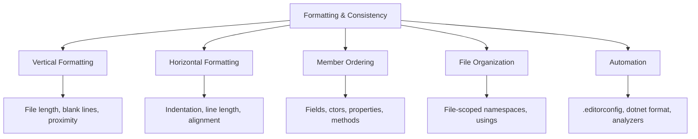
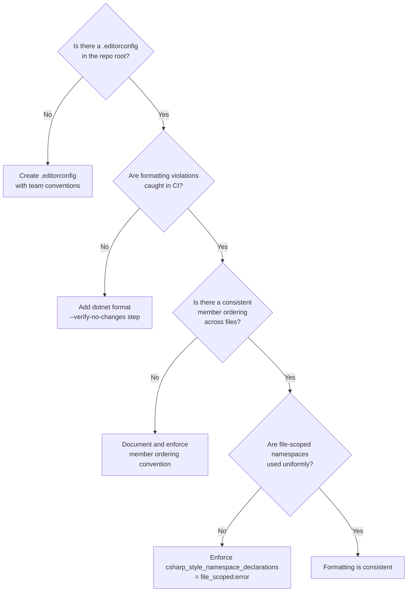

> [!success] Mastery Check
> - [ ] **Studied Well**
> - [ ] **Can explain the concept without notes**
> - [ ] **Can answer interview questions confidently**
> - [ ] **Can implement it in a real project**


## Navigation
**Domain:** [[6 — Design Principles & Patterns]] > **Group:** Clean Code
**Previous:** [[6.015 — Error Handling — Exceptions vs Return Values]] | **Next:** [[6.017 — Boundaries — Wrapping Third Party Code]]
### Prerequisites
- [[6.014 — Comments — Why Not What]] — Consistent formatting minimizes the need for clarifying comments about structure.
### Where This Fits
Code formatting is the most *visible* but least *important* aspect of clean code — yet it's the first thing a reviewer notices. Inconsistent formatting signals carelessness and erodes trust before a single line of logic is reviewed. This note covers automated formatting via `.editorconfig` and `dotnet format`, team conventions for file structure, and the principle that formatting should be *mechanically enforced*, not manually debated.

---

## Core Mental Model
Formatting is about *consistent visual rhythm*, not subjective preference. When every file follows the same structure — blank lines, brace placement, using order, member ordering — the reader's brain builds a mental model of where things live. Inconsistent formatting breaks that model on every file, costing ~100ms of context-switching overhead each time. Automate everything so humans can focus on logic, not whitespace.

### Dimensions


1. **Vertical Formatting** — Related concepts are close together; blank lines separate distinct sections; files stay under ~500 lines.
2. **Horizontal Formatting** — Consistent indentation (4 spaces, not tabs per .NET convention), readable line lengths, no manual alignment.
3. **Member Ordering** — Fields, constructors, properties, events, methods — consistent order in every file.
4. **File Organization** — One type per file (unless nested), `global using` / `global using static` for common imports.
5. **Automation** — No style debates. Enforce via `.editorconfig`, `dotnet format`, and analyzers in CI.

---

## Deep Mechanics
### How It Works

**Before (inconsistent formatting — multiple styles in same project):**
```csharp
    public class Order
    {
    public int Id {get;set;}
        public string? CustomerName{get;set;}
        public Order(int id,string? customerName)
        {
            Id = id;
        CustomerName = customerName;
        }
        public decimal? TotalAmount{get;set;}
    public DateTime CreatedAt { get; set; }
        private List<OrderItem> _items=new();
    }
```

**After (consistent formatting with conventions):**
```csharp
public class Order
{
    private readonly List<OrderItem> _items = [];

    public int Id { get; set; }
    public string? CustomerName { get; set; }
    public decimal? TotalAmount { get; set; }
    public DateTime CreatedAt { get; set; }

    public Order(int id, string? customerName)
    {
        Id = id;
        CustomerName = customerName;
    }

    public void AddItem(OrderItem item) => _items.Add(item);
    public IReadOnlyCollection<OrderItem> Items => _items.AsReadOnly();
}
```

**Key transformations:**
- Braces consistently at end of line (K&R style, per .NET conventions)
- Spaces inside `{ get; set; }` — consistent spacing around tokens
- Blank line between property group and constructor (logical grouping)
- Fields at top, then properties, constructor, methods (member ordering)
- Collection expressions `[]` (modern C#)
- File-scoped namespace (not shown, but assumed)

### Why It Matters at Scale
At 100+ files and 20+ developers:
- **Bike-shedding** — teams waste hours debating tabs vs spaces. Automated formatting eliminates this.
- **PR noise** — a formatting-only PR touches 50 files with zero behavior change, making real diffs harder to review.
- **Onboarding friction** — new joiners must learn tribal formatting rules that differ from their muscle memory.
- With `.editorconfig` + `dotnet format`, all formatting is deterministic. CI rejects non-compliant code — zero manual enforcement.

---

## Production Code Patterns
### Implementation in C#

**❌ Violation — Manual alignment (brittle, not maintained):**
```csharp
public class OrderRepository
{
    public Task<Order?>   GetByIdAsync(Guid id);
    public Task<List<Order>> GetAllAsync(int    page, int pageSize);
    public Task           SaveAsync(Order   order);
}
```

**✅ Correct — Natural formatting:**
```csharp
public class OrderRepository
{
    public Task<Order?> GetByIdAsync(Guid id);
    public Task<List<Order>> GetAllAsync(int page, int pageSize);
    public Task SaveAsync(Order order);
}
```

**❌ Violation — Inconsistent member ordering:**
```csharp
public class InvoiceService
{
    public async Task<Invoice> CreateInvoiceAsync(...) { ... }
    private readonly ILogger _logger;
    private decimal _taxRate;
    public InvoiceService(ILogger logger) { ... }
    private async Task<decimal> CalculateTaxAsync(...) { ... }
}
```

**✅ Correct — Consistent member ordering:**
```csharp
public class InvoiceService(ILogger<InvoiceService> logger)
{
    // 1. Constants & fields
    private const decimal DefaultTaxRate = 0.10m;
    private readonly ITaxRepository _taxRepo;

    // 2. Public methods (primary constructor — no explicit ctor needed)
    public async Task<Invoice> CreateInvoiceAsync(...) { ... }

    // 3. Private methods
    private async Task<decimal> CalculateTaxAsync(...) { ... }
}
```

### ASP.NET Core / .NET Ecosystem Integration

```csharp
// ✅ .editorconfig — source-controlled formatting rules
// [*.cs]
// indent_style = space
// indent_size = 4
// csharp_style_namespace_declarations = file_scoped:warning
// csharp_style_prefer_primary_constructors = true:suggestion
// dotnet_sort_system_directives_first = true
// csharp_prefer_braces = when_multiline:suggestion

// ✅ Global usings — consistent across project
global using System;
global using System.Collections.Generic;
global using System.Linq;
global using System.Threading;
global using System.Threading.Tasks;
global using Microsoft.AspNetCore.Mvc;
global using FluentValidation;

// ✅ Analyzer package — catch formatting violations in CI
// <PackageReference Include="Microsoft.CodeAnalysis.NetAnalyzers" Version="*" />
// <PackageReference Include="StyleCop.Analyzers" Version="*" />
```

---

## Gotchas & Anti-Patterns
### The One-True-Brace-Style War
**Wrong:** Endless team debate over K&R (Egyptian braces) vs Allman vs Stroustrup.
**Right:** Pick the .NET default (K&R for most constructs, Allman for types/methods historically, though C# now allows both with analyzers) and enforce it with `.editorconfig`. No debate.
**Consequence:** Hours of meeting time wasted per month. The most productive teams use any consistent style and automate it.

### Line Length Dogma
**Wrong:** Enforcing a hard 80-character line limit in 2024. Modern monitors are wide; wrapping at 80 chars creates jagged, harder-to-read code.
**Right:** Use a reasonable limit (120-150 chars .NET default) with analyzer warnings, not errors. Prefer breaking at natural points (after `(`, `&&`, `??`).
**Consequence:** Artificial wrapping creates readability problems worse than long lines — the reader must mentally reassemble the split expression.

### Manual Region Directives
**Wrong:** `#region Public Methods` / `#endregion` — regions hide structure rather than revealing it.
**Right:** Split into partial classes or separate files if a class is large enough to need regions. Use member ordering instead of regions.
**Consequence:** Regions hide code by default in the IDE — developers collapse and forget entire sections. Regions are a smell that the class is too big.

### Inconsistent Blank Line Usage
**Wrong:** Sometimes 1 blank line between methods, sometimes 2, sometimes 0. No logical grouping.
**Right:** 1 blank line between members; 2 blank lines between logical sections; 0 blank lines between tightly related one-liners.
**Consequence:** Inconsistent spacing forces the reader to re-parse the logical grouping on every file.

### File-Scoped Namespace Inconsistency
**Wrong:** Mixing block-scoped namespaces (`namespace Foo.Bar { ... }`) and file-scoped namespaces (`namespace Foo.Bar;`) in the same project.
**Right:** Pick file-scoped (.NET 6+ default) for all files. Use `.editorconfig` rule: `csharp_style_namespace_declarations = file_scoped:error`.
**Consequence:** Every file has an extra indent level for block-scoped, inconsistent with file-scoped files. Adds indent noise across the entire project.

### Using Order Chaos
**Wrong:** `System.*` usings mixed with third-party usings mixed with internal usings, no sorting.
**Right:** `dotnet_sort_system_directives_first = true` — System usings first, then third-party, then internal. Alphabetically sorted.
**Consequence:** Harder to scan imports; merge conflicts on unordered lines more likely.

---

## Performance Implications
### Maintenance Cost Model
| Scenario | Defect Probability | Change Impact | Onboarding Cost |
|---|---|---|---|
| Consistent automated formatting | Low | Isolated | Low |
| Inconsistent manual formatting | Low | Isolated | High |
| No formatting standards | Low | Cascading (merge conflicts) | Very High |

**No benchmark data:** Formatting has zero runtime impact. Measured via: PR cycle time (formatting debates), merge conflict frequency (file reordering), onboarding time (learning tribal rules).

---

## Interview Arsenal
### Question Bank
1. "Why is automated formatting better than manual formatting conventions?"
2. "What belongs in an `.editorconfig` file?"
3. "Should you use `#region` directives?"
4. "How do you handle formatting across multiple teams in a monorepo?"
5. "What is the ideal file length for a C# class?"
6. "Why does the .NET team recommend file-scoped namespaces?"
7. "How do you reconcile different formatting preferences during a merge?"
8. "What is the relationship between formatting and code review quality?"

### Spoken Answers

> **Q1: Why is automated formatting better than manual conventions?**
>
> **Average answer:** It saves time and prevents arguments.
>
> **Great answer:** Automated formatting via `.editorconfig` + `dotnet format` eliminates the three costs of manual conventions: cognitive load (thinking about formatting while writing code), review overhead (commenting on style nitpicks), and onboarding friction (learning tribal rules). With `dotnet format --verify-no-changes` in CI, formatting violations fail the build — no human enforcement needed. Tools like `csharp_prefer_braces = when_multiline:suggestion` produce IDE green-squiggle suggestions that train developers without blocking builds. The result: PRs discuss *logic* not *whitespace*.

> **Q3: Should you use `#region` directives?**
>
> **Average answer:** Yes, to organize large files.
>
> **Great answer:** No — `#region` is a code smell that indicates the class is too large and should be split. Regions hide implementation details by default in Visual Studio, encouraging "collapse all and ignore" behavior. The .NET team itself discourages regions in the BCL source. If you need regions to navigate a file, extract the region's content into a separate partial class, a separate file, or a new class entirely. The one exception is auto-generated code (e.g., WinForms `*.Designer.cs`), where regions are an acceptable convention to separate generated from manual code.

### Trick Question
**"Code formatting doesn't matter — it's just cosmetic. The compiler doesn't care."**
Why it is a trap: Technically true but dismisses the human factor. Correct answer: The compiler doesn't enforce formatting, but code is read by humans ~10× more than it's written. Inconsistent formatting adds ~100ms of cognitive overhead per file as the reader re-parses the structure. Across a 500-file codebase visited hundreds of times, that's hours of collective friction. More importantly, inconsistent formatting is a *signal* — if a team can't agree on basic style, it suggests deeper disagreement about code quality. The compiler doesn't care about formatting, but the next developer who has to fix a bug at 3 PM on a Friday certainly does.

### Comparison Table
| Aspect | Code Formatting | Naming |
|---|---|---|
| Intent | Consistent visual rhythm and structure | Self-documenting identifiers |
| Participants | Whitespace, braces, ordering, file layout | Every identifier |
| When to use | Every file, automated | Every declaration, manual |
| .NET example | `.editorconfig` → `indent_size = 4` | `order.IsShipped` |
| Key difference | Formatting is mechanical; can be automated | Naming is semantic; requires human judgment |

---

## Decision Framework



### Application Checklist
- [ ] Is `.editorconfig` checked into the repository root?
- [ ] Does `dotnet format --verify-no-changes` run in CI?
- [ ] Are file-scoped namespaces enforced project-wide?
- [ ] Is member ordering consistent across all files (fields → ctors → properties → methods)?
- [ ] Are `#region` directives absent (except designer files)?

### Tradeoff Summary
| Principle | Cost | Benefit |
|---|---|---|
| Automated formatting | Setup time (1 hour) | Eliminates all style debates and formatting PR noise |
| File-scoped namespaces | Minor migration effort | Removes one indent level from every file |
| No regions | Requires refactoring large classes | Reveals true class complexity |

---

## Self-Check
### Conceptual Questions
1. Why is `.editorconfig` preferred over a team wiki page for formatting rules?
2. What happens when `dotnet format --verify-no-changes` fails in CI?
3. Why does the .NET team prefer file-scoped namespaces in modern C#?
4. What is the cost of inconsistent brace style across a project?
5. How do you handle formatting for generated code (e.g., `*.g.cs`)?
6. What is the relationship between vertical formatting and the Single Level of Abstraction?
7. Why should blank lines have a consistent rule?
8. What does a high number of `#region` directives indicate?
9. How does `global using` affect formatting consistency?
10. What is the recommended maximum line length in .NET?

<details><summary>Answers</summary>
1. `.editorconfig` is machine-enforceable, IDE-integrated, and version-controlled. A wiki page is aspirational, not enforced.
2. The CI build fails. The developer must run `dotnet format` locally and push the formatted changes.
3. File-scoped namespaces remove one indent level from every file, reducing horizontal scrolling and visual noise.
4. Each inconsistent file forces the reader to re-parse the visual structure, adding micro-friction across hundreds of files.
5. Exclude generated files from analyzers and formatting checks via `.editorconfig` `root = false` or path-specific rules.
6. SLA produces shorter methods; vertical formatting (blank lines, proximity) groups related code at each abstraction level.
7. Inconsistent blank lines break the reader's ability to visually parse logical grouping. Consistent rules make grouping intuitive.
8. The class is too large and should be split into multiple classes or partial files.
9. `global using` eliminates repetitive `using` statements, reducing horizontal noise and ensuring consistent import behavior.
10. The .NET coding convention recommends 120-150 characters for C# code, with warnings beyond that threshold.
</details>

### Code Puzzles

**Puzzle 1 — Reorder members consistently:**
```csharp
public class PaymentService
{
    public async Task ChargeAsync(Payment payment) { ... }
    private readonly IPaymentGateway _gateway;
    public PaymentService(IPaymentGateway gateway) { ... }
    private const decimal MaxTransactionAmount = 10000m;
    private async Task<bool> ValidateLimitAsync(decimal amount) { ... }
}
```

<details><summary>Answer</summary>
```csharp
public class PaymentService
{
    private const decimal MaxTransactionAmount = 10000m;
    private readonly IPaymentGateway _gateway;

    public PaymentService(IPaymentGateway gateway) { _gateway = gateway; }

    public async Task ChargeAsync(Payment payment) { ... }

    private async Task<bool> ValidateLimitAsync(decimal amount) { ... }
}
```
Constants → fields → constructor → public methods → private methods.
</details>

**Puzzle 2 — Fix the inconsistent whitespace:**
```csharp
public async Task<Order> GetOrderAsync(Guid id)
{
    var order = await _repo.FindAsync(id);


    if (order is null)
        throw new NotFoundException(id);

    return order;
}
```

<details><summary>Answer</summary>
Remove the extra blank lines. One blank line between logical sections is sufficient — not three.
</details>

**Puzzle 3 — Convert to file-scoped namespace:**
```csharp
namespace MyApp.Orders
{
    public class OrderService
    {
        // ...
    }
}
```

<details><summary>Answer</summary>
```csharp
namespace MyApp.Orders;

public class OrderService
{
    // ...
}
```
</details>

**Puzzle 4 — What's wrong with this formatting approach?**
```csharp
var invoice = new Invoice
                {
                    Id          = Guid.NewGuid(),
                    Customer    = customer,
                    Total       = 1500.00m,
                    LineItems   = items
                };
```

<details><summary>Answer</summary>
Manual vertical alignment. Adding a property with a longer name forces realignment of all values. The alignment breaks as soon as anyone edits it. Use natural formatting:
```csharp
var invoice = new Invoice
{
    Id = Guid.NewGuid(),
    Customer = customer,
    Total = 1500.00m,
    LineItems = items
};
```
</details>

**Puzzle 5 — Apply consistent member ordering:**
```csharp
public class OrderValidator : AbstractValidator<Order>
{
    private void ValidateItems() { ... }
    public OrderValidator()
    {
        RuleFor(x => x.Id).NotEmpty();
        RuleFor(x => x.Total).GreaterThan(0);
    }
    private const int MaxItems = 100;
}
```

<details><summary>Answer</summary>
```csharp
public class OrderValidator : AbstractValidator<Order>
{
    private const int MaxItems = 100;

    public OrderValidator()
    {
        RuleFor(x => x.Id).NotEmpty();
        RuleFor(x => x.Total).GreaterThan(0);
    }

    private void ValidateItems() { ... }
}
```
Constants → constructor → private methods.
</details>
