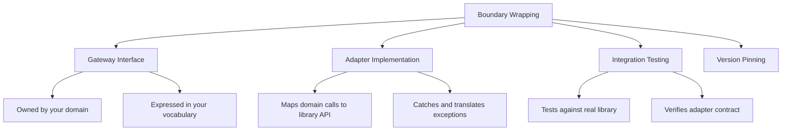

> [!success] Mastery Check
> - [ ] **Studied Well**
> - [ ] **Can explain the concept without notes**
> - [ ] **Can answer interview questions confidently**
> - [ ] **Can implement it in a real project**


## Navigation
**Domain:** [[6 — Design Principles & Patterns]] > **Group:** Clean Code
**Previous:** [[6.016 — Code Formatting and Consistency]] | **Next:** [[6.018 — Singleton Pattern]]
### Prerequisites
- [[6.016 — Code Formatting and Consistency]] — Consistent wrapping conventions ensure every third-party boundary looks the same.
### Where This Fits
Third-party code changes on its own schedule. A library update that renames a method, changes a parameter, or throws a different exception propagates everywhere the library is used — unless you insulate your code behind an abstraction boundary. This note covers the seam between your code and external dependencies: wrapping NuGet packages, HTTP APIs, and legacy subsystems behind interfaces you control. The goal is to minimize the blast radius of library churn and to make your domain code read in your vocabulary, not the library's.

---

## Core Mental Model
Every third-party dependency is a liability. Its API expresses the library author's mental model, not yours. The wrapping boundary translates between the two: your application code speaks domain language through an interface you own, and the adapter maps that to the third-party API behind the scenes. When the library changes, only the adapter changes — the rest of the codebase is immune.

### Dimensions


1. **Gateway Interface** — An interface defined in your domain layer that expresses the service in your ubiquitous language.
2. **Adapter Implementation** — A class in your infrastructure layer that implements the gateway interface using the third-party library.
3. **Library-Specific Types** — Never allowed to leak past the adapter boundary (no `Stripe.Charge`, no `SendGrid.Message` in domain code).
4. **Integration Tests** — Tests that exercise the adapter against a real (or containerized) instance of the third-party service.

---

## Deep Mechanics
### How It Works

**Before (no boundary — third-party types everywhere):**
```csharp
// Domain service depends directly on Stripe SDK
public class OrderService
{
    private readonly Stripe.ChargeService _stripe;

    public async Task<Guid> ChargeCustomerAsync(
        Order order, Stripe.PaymentMethod paymentMethod)
    {
        var chargeOptions = new Stripe.ChargeCreateOptions
        {
            Amount = (long)(order.Total * 100),
            Currency = "usd",
            PaymentMethod = paymentMethod.Id
        };
        var charge = await _stripe.CreateAsync(chargeOptions);
        return Guid.Parse(charge.Id);
    }
}

// Domain model depends on Stripe types
public record PaymentMethod(Stripe.PaymentMethod StripeMethod);
```

**After (boundary wrapping — domain isolated):**
```csharp
// Domain layer — owns this interface
public interface IPaymentGateway
{
    Task<PaymentResult> ChargeAsync(
        Money amount, PaymentToken token, CancellationToken ct);
}

public record PaymentResult(
    bool Success,
    string? TransactionId,
    string? ErrorMessage);

public record PaymentToken(string Value);

// Infrastructure layer — adapter translates
internal sealed class StripePaymentGateway : IPaymentGateway
{
    private readonly Stripe.ChargeService _stripe;

    public async Task<PaymentResult> ChargeAsync(
        Money amount, PaymentToken token, CancellationToken ct)
    {
        try
        {
            var charge = await _stripe.CreateAsync(
                new Stripe.ChargeCreateOptions
                {
                    Amount = (long)(amount.Value * 100),
                    Currency = amount.Currency,
                    PaymentMethod = token.Value
                }, cancellationToken: ct);

            return new PaymentResult(true, charge.Id, null);
        }
        catch (Stripe.StripeException ex)
        {
            _logger.LogError(ex, "Stripe charge failed");
            return new PaymentResult(false, null, ex.Message);
        }
    }
}
```

**Key transformations:**
- `Stripe.PaymentMethod` never appears in domain code — replaced by `PaymentToken` (your abstraction)
- `StripeException` caught in adapter; domain code only sees `PaymentResult`
- Domain interface uses domain types: `Money` instead of `long` (cents), `PaymentToken` instead of raw string
- Adapter method signature matches domain needs, not library API

### Why It Matters at Scale
In a system with 15+ external dependencies:
- **Library upgrade** — Stripe API v2 → v3 changes every method name? One adapter file changes, not 500 call sites
- **Vendor switch** — Stripe → Adyen? Write a new adapter behind the same `IPaymentGateway` interface
- **Testing** — Mock `IPaymentGateway` in domain tests; no need to mock `Stripe.ChargeService` across 100 tests
- **Exception translation** — `StripeException`, `SqlException`, `HttpRequestException` all normalized to domain result types

---

## Production Code Patterns
### Implementation in C#

**❌ Violation — Leaking third-party types through domain:**
```csharp
public class NotificationService
{
    private readonly SendGridClient _client;

    public async Task SendAsync(Order order)
    {
        var msg = new SendGridMessage
        {
            From = new EmailAddress("noreply@shop.com"),
            Subject = $"Order {order.Id} confirmed",
            PlainTextContent = $"Thank you for your order."
        };
        msg.AddTo(new EmailAddress(order.CustomerEmail));
        await _client.SendEmailAsync(msg);
    }
}
```

**✅ Correct — Boundary wrapping:**
```csharp
// Domain interface
public interface INotificationService
{
    Task<NotificationResult> SendOrderConfirmationAsync(
        EmailAddress customerEmail, OrderId orderId);
}

// Infrastructure adapter
internal sealed class SendGridNotificationService : INotificationService
{
    private readonly SendGridClient _client;

    public async Task<NotificationResult> SendOrderConfirmationAsync(
        EmailAddress customerEmail, OrderId orderId)
    {
        try
        {
            var msg = new SendGridMessage
            {
                From = new EmailAddress("noreply@shop.com"),
                Subject = $"Order {orderId} confirmed",
                PlainTextContent = $"Thank you for your order."
            };
            msg.AddTo(new EmailAddress(customerEmail.Value));
            var response = await _client.SendEmailAsync(msg);
            return response.IsSuccessStatusCode
                ? NotificationResult.Success()
                : NotificationResult.Failed("SendGrid returned non-success");
        }
        catch (SendGridException ex)
        {
            _logger.LogError(ex, "SendGrid failure");
            return NotificationResult.Failed(ex.Message);
        }
    }
}
```

### ASP.NET Core / .NET Ecosystem Integration

```csharp
// ✅ Registration — interface in domain, adapter in infrastructure
// Domain layer: public interface IPaymentGateway
// Infrastructure: internal sealed class StripePaymentGateway : IPaymentGateway

// Program.cs — wiring
builder.Services.AddScoped<IPaymentGateway, StripePaymentGateway>();

// ✅ IHttpClientFactory — bound HTTP client for third-party API
builder.Services.AddHttpClient<IShippingRateProvider, FedExShippingRateProvider>(
    client =>
    {
        client.BaseAddress = new Uri("https://api.fedex.com/v1/");
        client.DefaultRequestHeaders.Add("Api-Key", configuration["FedEx:ApiKey"]);
    })
    .AddTransientHttpErrorPolicy(p => p.RetryAsync(3))
    .AddPolicyHandler(Policy.TimeoutAsync<HttpResponseMessage>(10));

// ✅ Health checks for third-party dependencies
builder.Services.AddHealthChecks()
    .AddUrlGroup(new Uri("https://api.stripe.com/v1/health"),
        name: "stripe");
```

---

## Gotchas & Anti-Patterns
### The Leaky Abstraction
**Wrong:** A gateway interface that exposes third-party types: `Task<Stripe.Charge> ChargeAsync(Money amount)`.
**Right:** Return your own domain type: `Task<PaymentResult> ChargeAsync(Money amount)`.
**Consequence:** Every domain consumer depends on the third-party library. Upgrading the library requires changing all consumers, defeating the purpose of the boundary.

### The Blow-Through Exception
**Wrong:** Catching `Exception` in the adapter and letting nothing through, or letting `StripeException` propagate uncaught.
**Right:** Catch the specific exceptions the library throws and either return a domain result or wrap in a domain exception.
**Consequence:** Uncaught library exceptions propagate into domain code that can't handle them meaningfully. Callers must know about Stripe to handle Stripe errors.

### The Generic Wrapper
**Wrong:** `Task<T> CallStripeAsync<T>(Func<Task<T>> operation)` — a generic wrapper that doesn't abstract Stripe at all.
**Right:** Specific methods like `ChargeAsync`, `RefundAsync`, `GetCustomerAsync` that operate with domain types.
**Consequence:** The generic wrapper is a thin veneer — every call site still constructs Stripe-specific types and handles Stripe-specific errors.

### No Integration Test for the Adapter
**Wrong:** Only unit-testing with a mocked `IPaymentGateway`. The mock never exercises the actual mapping.
**Right:** Write at least one integration test per adapter that calls the real library (or a test double like WireMock or Testcontainers).
**Consequence:** The adapter works in unit tests but fails in production due to mapping errors, serialization issues, or undocumented library behavior.

### Over-Abstraction for Simple Dependencies
**Wrong:** Wrapping `System.Text.Json` behind `ISerializer` interface — a non-trivial, stable, built-in library.
**Right:** Don't wrap the BCL. Wrapping is for dependencies that change (volatile) — third-party services, legacy systems, infrastructure.
**Consequence:** Unnecessary indirection with no benefit. Every new developer must navigate a pointless abstraction.

### Retry / Circuit Breaker in the Wrong Layer
**Wrong:** Adding Polly retry policies inside the adapter and also in the `HttpClient` pipeline.
**Right:** Decide a single layer for resilience. Prefer the `HttpClient` pipeline or a decorator over the adapter — never both.
**Consequence:** Double-retry: 3 adapter retries × 3 client retries = 9 attempts. Latency spikes and unintended load on the downstream service.

---

## Performance Implications
### Maintenance Cost Model
| Scenario | Defect Probability | Change Impact | Onboarding Cost |
|---|---|---|---|
| Well-wrapped boundary | Low | Isolated (adapter only) | Low |
| Leaky boundary | High | Cascading | High |
| No boundary | Very High | Global | Very High |

**No benchmark data:** Boundaries have negligible runtime overhead (one extra method call). Measured via: lines changed per library upgrade, time to vendor-switch, test suite size.

---

## Interview Arsenal
### Question Bank
1. "Why should you wrap third-party code behind an interface?"
2. "What types should a gateway interface use?"
3. "How do you test an adapter?"
4. "When is it NOT worth wrapping a dependency?"
5. "How do you handle configuration for third-party services?"
6. "What is the role of `IHttpClientFactory` in boundary management?"
7. "How do you deal with third-party SDKs that are static or singleton-based?"
8. "What happens when the third-party API has reliability issues?"

### Spoken Answers

> **Q1: Why wrap third-party code behind an interface?**
>
> **Average answer:** So you can mock it for testing.
>
> **Great answer:** Three reasons: (1) **Testability** — the adapter isolates the third-party SDK from domain logic, enabling fast unit tests without network calls. (2) **Change isolation** — Stripe upgrades from API v2 to v3 and renames `ChargeCreateOptions` to `PaymentIntentCreateOptions`? One adapter file changes, not 500 call sites. (3) **Domain vocabulary** — the gateway interface speaks your language (`PaymentToken`, `Money`, `PaymentResult`) instead of the library's (`Stripe.Charge`, `SendGrid.Message`). In .NET, this maps to the `I[DomainService]` interface in the domain layer and `[VendorName][DomainService]` in infrastructure, registered via `services.AddScoped<I, Impl>()`.

> **Q3: How do you test an adapter?**
>
> **Average answer:** Mock the third-party SDK and verify the adapter maps properly.
>
> **Great answer:** There are two levels. At the unit level, I mock the third-party client interface (e.g., `Stripe.ChargeService`) and verify the adapter translates the response correctly into my domain result type. At the integration level, I write tests against the real third-party API using Testcontainers for self-hosted dependencies or a sandbox account (Stripe test mode, SendGrid test mode). The integration test catches mapping errors and SDK behavioral quirks that mocks can't replicate — like Stripe's error object structure or SendGrid's rate-limit header format. CI runs integration tests with a separate connection string/config, never against production.

### Trick Question
**"Why not wrap everything in an interface, even the BCL? It makes testing easier."**
Why it is a trap: It sounds pragmatic but leads to over-engineering every stable, well-tested dependency. Correct answer: Only wrap *volatile* dependencies — third-party libraries that change on their schedule, legacy systems you're migrating from, infrastructure with reliability concerns. Wrapping the BCL (`System.Text.Json`, `System.IO`, `DateTime`) adds pointless indirection. The .NET runtime is as stable as it gets; upgrading it is a project-wide event that any codebase handles. The cost of wrapping everything — interface explosion, indirection complexity, onboarding friction — far outweighs the hypothetical benefit of swapping out `HttpClient` for something else.

### Comparison Table
| Aspect | Boundary Wrapping | Adapter Pattern |
|---|---|---|
| Intent | Insulate domain from third-party churn | Make incompatible interfaces work together |
| Participants | Gateway interface + Adapter + Domain types | Target + Adapter + Adaptee |
| When to use | All third-party dependencies | When integrating with legacy or incompatible APIs |
| .NET example | `IPaymentGateway` → `StripePaymentGateway` | `ILogger<T>` → `SerilogLoggerAdapter` |
| Key difference | Boundary is about *ownership* (you own the interface) | Adapter is about *compatibility* (making square peg fit round hole) |

---

## Decision Framework

```mermaid
graph TD
    Q1{Is this a built-in .NET<br>library? (BCL)} -- Yes --> R1[Do not wrap — use directly]
    Q1 -- No --> Q2{Is this a volatile<br>third-party dependency?}
    Q2 -- No --> R2[Consider direct use<br>if stable, well-tested]
    Q2 -- Yes --> Q3{Does the library<br>change frequently?}
    Q3 -- Yes --> R3[Wrap behind interface]
    Q3 -- No --> Q4{Might you switch<br>vendors in future?}
    Q4 -- Yes --> R4[Wrap behind interface]
    Q4 -- No --> Q5{Do you need to mock<br>this in domain tests?}
    Q5 -- Yes --> R5[Wrap behind interface]
    Q5 -- No --> R6[Consider direct use<br>with integration tests]
```

### Application Checklist
- [ ] Does the gateway interface use only domain types (no third-party types)?
- [ ] Are all third-party exceptions caught and translated within the adapter?
- [ ] Is there at least one integration test for each adapter?
- [ ] Is the adapter registered via DI with the interface lifetime managed correctly?
- [ ] Is the third-party SDK excluded from domain-layer analyzers / dependencies?

### Tradeoff Summary
| Strategy | Cost | Benefit |
|---|---|---|
| Full wrapping (interface + adapter) | Extra files, indirection | Complete isolation from vendor churn |
| Direct use (no wrapper) | Zero overhead | Impossible to mock, vendor change is global |
| Wrapping only volatile deps | Some indirection | Balances isolation with simplicity |

---

## Self-Check
### Conceptual Questions
1. What distinguishes a volatile dependency from a stable one?
2. Why should third-party types never appear in domain layer interfaces?
3. How does wrapping improve testability beyond simple mocking?
4. What is the risk of wrapping BCL types behind interfaces?
5. How do you handle third-party SDKs that require static/global configuration?
6. What is the role of the `Options` pattern in managing third-party configuration?
7. When should you use `IHttpClientFactory` instead of raw `HttpClient`?
8. How do you version your gateway interfaces as the third-party API evolves?
9. What is the difference between a boundary wrapper and a facade?
10. Why is it dangerous to let third-party exceptions propagate uncaught through domain code?

<details><summary>Answers</summary>
1. Volatile: changes frequently, different release cadence, still maturing. Stable: BCL, Newtonsoft.Json (mature), Serilog.
2. Consuming code now depends on the library, defeating the isolation purpose. The library's type system leaks into your domain.
3. Wrapping also translates exception types, normalizes API semantics, and allows swapping implementations without changing call sites.
4. BCL types are maximally stable. Wrapping them adds indirection with zero isolation benefit, increasing code surface for no gain.
5. Wrap in a dedicated adapter that initializes the SDK via a factory method. Use the Options pattern for configuration. Never rely on global static state in domain code.
6. `IOptions<T>` (or `IOptionsSnapshot` for reloadable config) provides strongly-typed configuration injection into the adapter constructor, keeping config management consistent with the rest of .NET.
7. Use `IHttpClientFactory` for any outbound HTTP calls — it manages connection pooling, lifetime, and supports centralized resilience policies (Polly).
8. Version the interface only when the third-party API introduces breaking changes you need to support simultaneously. Otherwise, update the single adapter and all consumers stay unchanged.
9. Boundary wrapper is about *ownership* (you control the interface). Facade is about *simplification* (hiding complexity of a subsystem).
10. Domain code cannot handle `StripeException` meaningfully without depending on Stripe. The adapter must catch and translate to domain types or exceptions.
</details>

### Code Puzzles

**Puzzle 1 — Identify the leaky abstraction:**
```csharp
public interface IEmailSender
{
    Task<SendGrid.Response> SendEmailAsync(SendGrid.Message message);
}
```

<details><summary>Answer</summary>
Both parameter and return type leak SendGrid types. Should be:
```csharp
public interface IEmailSender
{
    Task<EmailResult> SendEmailAsync(EmailMessage message);
}
```
</details>

**Puzzle 2 — What's missing from this adapter?**
```csharp
internal sealed class SmtpEmailSender : IEmailSender
{
    private readonly SmtpClient _client = new("smtp.sendgrid.net");

    public async Task<EmailResult> SendEmailAsync(EmailMessage message)
    {
        using var mail = new MailMessage(message.From, message.To)
        {
            Subject = message.Subject,
            Body = message.Body
        };
        await _client.SendMailAsync(mail);
        return EmailResult.Success();
    }
}
```

<details><summary>Answer</summary>
No exception handling. If `SendMailAsync` throws (network failure, auth error, rate limit), the exception propagates unhandled. The adapter should catch `SmtpException` and return `EmailResult.Failure(error)`. Also no logging and no `IHttpClientFactory` / connection pooling.
</details>

**Puzzle 3 — Write the gateway interface for this third-party SDK:**
```csharp
// Twilio SDK — you don't want this in domain
var message = MessageResource.Create(
    body: "Hello",
    from: new PhoneNumber("+1234567890"),
    to: new PhoneNumber("+0987654321"));
```

<details><summary>Answer</summary>
```csharp
public interface ISmsSender
{
    Task<SmsResult> SendSmsAsync(
        PhoneNumber recipient, string message);
}
```
No `MessageResource`, no `PhoneNumber` (wrap in your own `PhoneNumber` value object).
</details>

**Puzzle 4 — How would you handle a third-party API that returns raw JSON?**
```csharp
// Direct HttpClient usage — JSON parsing everywhere
var response = await _httpClient.GetAsync("/api/shipping/rates");
var json = await response.Content.ReadAsStringAsync();
var rates = JsonSerializer.Deserialize<ShippingRate[]>(json);
```

<details><summary>Answer</summary>
```csharp
internal sealed class FedExShippingRateProvider : IShippingRateProvider
{
    private readonly HttpClient _httpClient;

    public async Task<Result<IReadOnlyList<ShippingRate>>> GetRatesAsync(
        Address origin, Address destination)
    {
        try
        {
            var request = MapToFedExRequest(origin, destination);
            var response = await _httpClient.PostAsJsonAsync("/rates", request);
            response.EnsureSuccessStatusCode();
            var fedExResponse = await response.Content
                .ReadFromJsonAsync<FedExRateResponse>();
            return MapToDomainRates(fedExResponse!);
        }
        catch (HttpRequestException ex)
        {
            _logger.LogError(ex, "FedEx API call failed");
            return Result.Error("Shipping rate lookup failed");
        }
    }
}
```
</details>

**Puzzle 5 — Where is the boundary violation?**
```csharp
// Program.cs
builder.Services.AddScoped<IOrderRepository>(sp =>
{
    var connString = sp.GetRequiredService<IConfiguration>()
        .GetConnectionString("Orders");
    return new OrderRepository(
        new SqlConnection(connString));
});

// OrderRepository.cs
public class OrderRepository : IOrderRepository
{
    private readonly SqlConnection _connection;

    public OrderRepository(SqlConnection connection)
    {
        _connection = connection;
    }

    public async Task<Order?> GetByIdAsync(Guid id)
    {
        await using var cmd = new SqlCommand(
            "SELECT * FROM Orders WHERE Id = @id", _connection);
        cmd.Parameters.AddWithValue("@id", id);
        // ...
    }
}
```

<details><summary>Answer</summary>
The repository leaks `SqlConnection` and `SqlCommand` in the constructor and implementation. It should accept `IDbConnection` or `IUnitOfWork` instead. When switching to PostgreSQL, every repository constructor needs to change. Use `DbConnection` base class or an abstraction like `IUnitOfWork` to keep data access abstracted.
</details>
